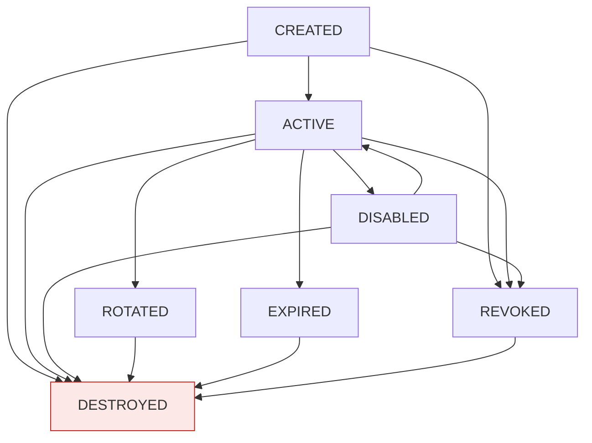
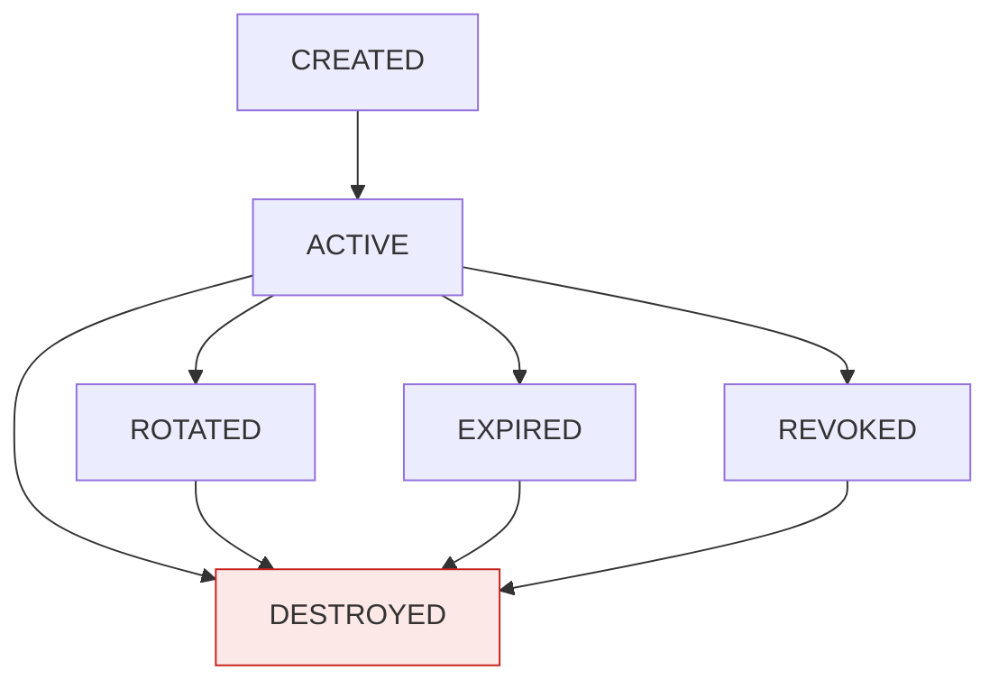

# A. 接口规范与数据需求提取（V2.9）

> **来源**：《国密加密服务系统软件需求规格说明书》V2.9，源文件 `docs/需求说明文档.md`（只读，未修改）。
> **主提取范围**：第 6 章 接口规范（源文件行 2576–3099）、第 7 章 数据需求（源文件行 3101–3697）。
> **补充引用范围**（因第 6/7 章正文以引用方式指向其他章节，为不丢失细节按原文追加照抄）：3.2.1～3.2.23、3.3.1～3.3.6、3.4.1～3.4.4、3.5.2～3.5.5、3.6.1～3.6.5、3.8、3.9、3.11.4～3.11.5、4.9、4.10、4.11、4.12、8.15～8.17、13.3、13.5.1～13.5.2。
> **保真原则**：表格、公式、步骤、常量、阈值、错误码逐字照抄；原文未定义处标注「原文未明确」，不做推断补充。
> **注意**：第 7 章各实体字段表原文**仅含「字段 / 说明」两列**，未定义数据类型、是否可空、索引、唯一性（除说明列中已显式标注者，如 `IPWhitelistEnabled（默认 false）`、`UNIQUE(AppId, Nonce)`）。下文各表后统一标注该事实，不再逐表重复。

---

# 第一部分　接口规范（第 6 章）

## 1. 通用约定（6.1）

- 传输：HTTPS；数据格式：JSON；字符编码：UTF-8；二进制编码：Base64；时间格式：ISO 8601。
- **所有 API 必须返回 RequestId**。
- 统一 API 前缀：`/api/v1`。

### 1.1 API 分类（6.1）

| 类别     | 前缀                | 认证方式                     | 调用方               |
| -------- | ------------------- | ---------------------------- | -------------------- |
| 业务 API | `/api/v1/*`       | 请求直接签名（HMAC-SM3）     | 第三方业务系统       |
| 管理 API | `/api/v1/admin/*` | Access Token（管理端登录后） | 管理控制台、后台测试 |

### 1.2 请求体大小上限

| 项                 | 值                     | 来源            |
| ------------------ | ---------------------- | --------------- |
| 单次请求最大数据量 | 10MB（NF-PERF-014）    | 4.1.4 / 4.8     |
| 随机数单次最大输出 | 默认 64KB，可配置上限 1MB（V2.9） | 3.1.5 / F-CFG-008 / D-26 |

- 随机数最大长度独立定义，**不得复用 NF-PERF-014**（NF-PERF-014 为通用请求体大小限制）。
- 配置项清单中亦含「请求体大小限制」（3.8）。

### 1.3 分页约定

**原文未明确**：全文未定义分页参数（页码/游标）、默认页大小、最大页大小、分页响应包装结构。列表类接口（`/api/v1/keys`、`/api/v1/audit/logs`、`/api/v1/admin/*` 列表等）的分页口径需在详细设计阶段补充。

### 1.4 统一响应结构（6.4）

成功：

```json
{
  "code": 0,
  "message": "success",
  "data": {},
  "requestId": "req-xxxx",
  "timestamp": "2026-09-23T10:30:00.000+08:00"
}
```

错误：

```json
{
  "code": 30001,
  "message": "SM4 operation failed",
  "data": null,
  "requestId": "req-xxxx",
  "timestamp": "2026-09-23T10:30:00.000+08:00"
}
```

| 字段      | 类型      | 含义                 | 来源 | 备注                                   |
| --------- | --------- | -------------------- | ---- | -------------------------------------- |
| code      | 整数      | 业务结果码，0=成功   | 6.4  | 非 0 见 6.11 / 13.3                    |
| message   | 字符串    | 结果描述             | 6.4  | 成功固定 `success`                     |
| data      | 对象/null | 业务数据             | 6.4  | 错误时为 `null`                        |
| requestId | 字符串    | 请求唯一标识         | 6.4  | 所有 API 必须返回                      |
| timestamp | 字符串    | 响应时间（ISO 8601） | 6.4  | 示例含时区偏移 `+08:00`                |

> 字段类型列原文未显式给出类型定义，上表类型为依据示例值的推断标注（示例中 code 为数字、message 为字符串、data 为对象或 null）。**原文未明确**显式类型声明。

### 1.5 禁止外泄内容（6.4）

不得向外部返回：堆栈、内部路径、SQL、密码库异常、Padding 内部细节、HSM 内部错误细节、密钥材料、明文手机号、AppSecret 明文。

---

## 2. 业务 API 认证：请求直接签名（6.2 / 3.3.3）

业务 API 采用 **AppID + 请求直接签名** 模式，**AppSecret 不在网络传输**。

### 2.1 请求头清单（6.2.1 / 3.3.3.1）

```http
X-App-Id: {appId}
X-Timestamp: {unix_timestamp_seconds}
X-Nonce: {uuid_or_random_string}    # 最小 16 字节（128 bit）
X-Signature: {base64_signature}
X-Request-Id: {request_id}          # 可选
```

| 请求头         | 必填性 | 说明                                     | 示例（3.3.3.3）                            |
| -------------- | ------ | ---------------------------------------- | ------------------------------------------ |
| `X-App-Id`   | 必填   | 应用标识                                 | `test-app-001`                           |
| `X-Timestamp`  | 必填   | 当前 Unix 时间戳（秒级）                 | `1727078400`                             |
| `X-Nonce`      | 必填   | 随机字符串/UUID，最小 16 字节（128 bit） | `550e8400-e29b-41d4-a716-446655440000`   |
| `X-Signature`  | 必填   | 客户端生成的签名值（Base64 编码）        | `KfuluxDM90Ze4jQtQeSG5AZ/MubbtzoA3vFoKslQFfc=` |
| `X-Request-Id` | 可选   | 请求唯一标识                             | —（原文未给示例）                          |

### 2.2 签名算法与完整构造公式（6.2.2 / 3.3.3.2）

**HMAC-SM3**（参考阿里云签名结构）。

**CanonicalHeaders 拼接口径（V2.8 钉死，审阅 H-01）**：CanonicalHeaders 为各 `key:value\n` 顺序拼接后**去除末尾换行符**的结果——即 Header 块整体末尾**不带**换行，公式中的 `+ "\n"` 仅作为 Header 块与 SignedHeaders 之间的分隔符，**不再额外产生空行**。本口径以 3.3.3.3 固定测试向量为唯一仲裁依据，任何实现必须通过该向量的签名比对。

```text
stringToSign =
  HTTP-Method + "\n"
  + CanonicalURI + "\n"
  + CanonicalQueryString + "\n"
  + CanonicalHeaders(去除末尾换行) + "\n"
  + SignedHeaders + "\n"
  + HexEncode(SM3(RequestBody))

signature = Base64(HMAC-SM3(AppSecret, stringToSign))
```

**要素顺序（不可变更）**：
1. HTTP-Method
2. CanonicalURI
3. CanonicalQueryString
4. CanonicalHeaders（去除末尾换行）
5. SignedHeaders
6. HexEncode(SM3(RequestBody))
7. signature = Base64(HMAC-SM3(AppSecret, stringToSign))

### 2.3 Canonical Request 跨语言实现规范（6.2.3 / 3.3.3.3）

**1. HTTP-Method**：大写（GET / POST / PUT / DELETE 等）。

**2. CanonicalURI**：
- 请求路径，URL 编码遵循 RFC 3986；
- 保留字符：`A-Z a-z 0-9 - _ . ~`；
- `/` 在路径中不编码；`%2F` 与 `/` 必须区分；
- Unicode 字符按 UTF-8 编码后百分号编码。

**3. CanonicalQueryString**：
- 按参数名小写字典序排序；
- 相同参数名按参数值字典序排序（`?a=1&a=2` → `a=1&a=2`）；
- URL 编码遵循 RFC 3986；空格编码为 `%20`，不是 `+`；
- 无参数时为空字符串。

**4. CanonicalHeaders**：
- 参与签名的 Header：`x-app-id`、`x-timestamp`、`x-nonce`；
- Header 名小写后按字典序排序；
- 格式：`key:value\n`；
- **拼接口径（V2.8 钉死）**：各 `key:value\n` 顺序拼接后**去除末尾换行符**，Header 块整体末尾不带换行；以 3.3.3.3 固定测试向量为唯一仲裁依据；
- Header 值首尾空白去除，内部多个连续空白压缩为单个空格。

**5. SignedHeaders**：
- 参与签名的 Header 名列表（小写），分号分隔；
- 示例：`x-app-id;x-nonce;x-timestamp`。

**6. HexEncode(SM3(RequestBody))**：
- 请求体 SM3 摘要的小写十六进制字符串；
- **空 Body**：SM3("") 的十六进制值 `1ab21d8355cfa17f8e61194831e81a8f22bec8c728fefb747ed035eb5082aa2b`；
- Body 必须为 `Content-Type: application/json; charset=utf-8`；
- 禁止 gzip / chunked / multipart 编码；
- 如请求体为空，必须使用空字符串的 SM3 摘要。

**7. 签名输出**：
- 固定为 Base64；**禁止 Hex**。

**8. Nonce**：
- 最小随机长度 ≥ 128 bit（16 字节）；
- 建议使用 UUID v4 或 16 字节安全随机数。

### 2.4 固定测试向量（6.2.3 / 3.3.3.3，原文照抄）

> 本测试向量仅用于 Canonical Request / SM3 / HMAC-SM3 算法一致性验证。由于 `X-Timestamp=1727078400` 已不在当前生产时间窗口内，**不得直接作为端到端认证成功用例**；端到端认证必须使用测试执行时动态生成的 Timestamp。端到端测试必须在运行时生成动态 Timestamp，并分别验证有效窗口、窗口边界及过期请求。

```text
AppSecret（仅测试环境）：TestAppSecret-V27-20260924!
Method: POST
URI: /api/v1/crypto/sm4/encrypt
Query: 空
Header:
    X-App-Id: test-app-001
    X-Timestamp: 1727078400
    X-Nonce: 550e8400-e29b-41d4-a716-446655440000
Body: {"keyId":"test-key","data":"SGVsbG8="}

SM3(RequestBody):
50511e530afd6b2b568171c95a7e4838680f7d4c1004ee28c5c98247cf9aac0f

StringToSign:
POST
/api/v1/crypto/sm4/encrypt

x-app-id:test-app-001
x-nonce:550e8400-e29b-41d4-a716-446655440000
x-timestamp:1727078400
x-app-id;x-nonce;x-timestamp
50511e530afd6b2b568171c95a7e4838680f7d4c1004ee28c5c98247cf9aac0f

Signature（Base64）：
KfuluxDM90Ze4jQtQeSG5AZ/MubbtzoA3vFoKslQFfc=
```

该测试向量作为 V2.7 编码基线固定值；实现不得自行替换 Canonical URI、Header 排序、Body 序列化、SM3 输出编码或 Base64 规则。

固定预期签名：`KfuluxDM90Ze4jQtQeSG5AZ/MubbtzoA3vFoKslQFfc=`。（6.2.3）

### 2.5 服务端校验步骤（严格顺序，6.2.4 / 3.3.3.4）

**V2.5 的 DoS 风险**：先写入 Nonce 再验证 HMAC，攻击者可用大量无效 Nonce 灌满缓存。

**V2.6 修正顺序**：

```text
1. 必填校验：检查 X-App-Id / X-Timestamp / X-Nonce / X-Signature 齐全
   ↓
2. Timestamp 基础校验：±3 分钟窗口
   ↓
3. 根据 X-App-Id 查询 AppSecret
   ↓
4. 解密 SecretCiphertext 获取 AppSecret（或从受限内存短缓存获取）
   ↓
5. 按 Canonical Request 规则重算签名
   ↓
6. 比对签名：不一致 → 10004（记录安全事件，不写入 Nonce）
   ↓
7. HMAC 成功后原子写入 Nonce（SET NX，缓存 + 数据库 UNIQUE(AppId, Nonce)）
   ↓
8. Nonce 已存在 → 10006
   ↓
9. 放行
```

**关键点（6.2.4）**：
- HMAC 验证失败时**不写入 Nonce**，避免攻击者用无效请求灌满 Nonce 存储；
- Nonce 写入必须原子（SET NX）；
- 数据库回退必须使用 `UNIQUE(AppId, Nonce)` 约束，禁止 SELECT → INSERT；
- **Nonce 双写一致性（V2.9 补充）**：以数据库 `UNIQUE(AppId, Nonce)` 为最终仲裁依据；缓存 SET NX 成功但数据库插入冲突时，以数据库结果为准返回 10006；缓存不可用时直接走数据库；双写均失败时拒绝请求并记录安全事件与告警；禁止将缓存结果作为最终仲裁；
- 解密后的 AppSecret 使用后立即清零内存（短缓存场景按 3.3.2 约束）。

### 2.6 签名失败错误码（6.2.5 / 3.3.3.5）

| 错误码 | 标识符                      | 说明                       |
| ------ | --------------------------- | -------------------------- |
| 10004  | SIGNATURE_INVALID           | 签名校验失败               |
| 10005  | SIGNATURE_TIMESTAMP_EXPIRED | Timestamp 超出允许时间窗口 |
| 10006  | SIGNATURE_NONCE_REPLAY      | Nonce 重复，疑似重放攻击   |

### 2.7 请求签名相关功能需求（3.3.3.6）

| 编号       | 功能                 | 要求                                                        |
| ---------- | -------------------- | ----------------------------------------------------------- |
| F-AUTH-025 | 请求签名生成支持     | 平台提供签名规范说明与示例，支持三方系统按规范生成签名      |
| F-AUTH-026 | 请求签名校验         | 平台按规范重算签名并比对；校验失败返回 10004                |
| F-AUTH-027 | 时间窗口校验         | Timestamp 偏差不得超过 ±3 分钟；超时返回 10005             |
| F-AUTH-028 | Nonce 原子防重放     | HMAC 成功后原子写入 Nonce；重复返回 10006；使用 UNIQUE 约束 |
| F-AUTH-029 | AppSecret 加解密     | 请求签名验证时解密 SecretCiphertext；使用后立即清零内存     |
| F-AUTH-030 | AppSecret 短缓存管理 | HSM/Software 场景下的受限内存短缓存与撤销联动（V2.9 新增）  |

### 2.8 AppSecret 生命周期与短缓存（3.3.2，被 6.2.4 引用）

状态：`CREATED → ACTIVE → ROTATED / DISABLED / REVOKED`

| 字段             | 说明                                          |
| ---------------- | --------------------------------------------- |
| SecretCiphertext | AppSecret 密文（SM4-GCM 由 KEK-Runtime 保护） |
| SecretHash       | SM3(AppSecret)，用于指纹/去重/审计关联        |

要求：
- 创建时只展示一次明文；
- 平台原则上不得提供"找回原 Secret"功能；
- Secret 丢失只能重新生成；
- **AppSecret 轮换后，旧 AppSecret 立即失效**（无兼容期）；
- **AppSecret 轮换为高风险操作**，管理端必须强制二次确认，提示"轮换后旧 AppSecret 立即失效，请确认已通知所有使用方在轮换前完成切换，否则将导致业务中断"；
- Secret 重置必须审计；
- 解密后的 AppSecret 不得写入日志、缓存或普通对象持久化，使用后立即清零内存。

**AppSecret 解密路径与性能分级（V2.9 补充）**：

1. **Software Provider 场景**：
   - AppSecret 解密在应用进程内完成（KEK-Runtime 由 Root Key 解封后驻留安全内存）；
   - 允许在安全内存中短缓存解密后的 AppSecret，TTL 建议 ≤60 秒；
   - 缓存必须满足：仅进程内存、受保护内存区域、禁止序列化、轮换/撤销立即清除、支持审计；
   - NF-PERF-009（请求签名校验 P95 ≤10ms）按该路径验收。
2. **HSM Provider 场景**：
   - AppSecret 解密需调用 HSM 解封 KEK-Runtime 或直接由 HSM 解封 SecretCiphertext；
   - 每次验签调用 HSM 将导致 HSM 成为瓶颈，无法满足 10ms P95；
   - 允许在应用侧安全内存中短缓存解密后的 AppSecret，TTL 建议 ≤30 秒；
   - 缓存必须满足：仅进程内存、HSM 侧轮换/撤销事件驱动立即清除、禁止落盘、支持审计；
   - 性能指标按 NF-PERF-009A（HSM 场景）验收，具体阈值在详细设计阶段结合 HSM 实测冻结。
3. **缓存失效与撤销联动**：
   - AppSecret 轮换/撤销、Key 状态变更、安全事件触发时，必须立即清除应用侧短缓存；
   - 缓存清理由平台统一事件总线或管理端指令下发实现；
   - 清除动作记录审计。
4. **安全约束**：
   - 短缓存必须使用受保护内存（如 .NET SecureString 等价机制或自研安全缓冲区）；
   - 缓存对象不得被 GC 长期驻留；建议使用固定内存 + 主动清零；
   - 缓存访问必须与请求上下文绑定，禁止跨请求跨线程共享；
   - 内存转储抽查时必须验证缓存对象可被清零。

---

## 3. 管理端 API 认证：Access Token（6.3，细化见 3.3.4）

管理端登录后签发 Access Token，用于访问管理 API 与业务 API（用于后台测试）。

```http
Authorization: Bearer {access_token}
```

**Token 特性（6.3）**：
- JWT 格式，签名算法 SM2；
- **空闲超时**：15 分钟无操作后失效（依赖 AdminSession.LastAccessAt）；
- **绝对超时**：24 小时后强制失效；
- 撤销采用"短期 Token + 服务端撤销列表"组合；
- 撤销列表存储于缓存与数据库双写，缓存失效时回退数据库；
- **管理端 Token 不允许第三方系统使用**。

### 3.1 管理端登录与 MFA（3.3.4）

管理端登录采用用户名 + 密码 + 验证码 + **MFA 第二因素**（全局强制，`MFA_POLICY_MODE` 默认 `REQUIRED`，生产环境冻结为 `REQUIRED`）；登录成功后签发 Access Token，用于访问全部 API。

> **V2.9 表述统一说明**：原 V2.8 及以前版本在 3.3.4 章节首段存在"MFA 可选"表述，与 F-CON-013、F-AUTH-010、3.6.3、D-16、NF-CMP-013 冲突。自 V2.9 起全文统一为：管理端 MFA 全局强制，`MFA_POLICY_MODE` 默认 `REQUIRED`，`OPTIONAL` 仅作为平台能力模式，不作为生产基线。

### 3.2 管理端 Token 校验流程（3.3.4，严格顺序）

```text
JWT 校验（签名、exp、aud、iss）
 ↓
查询 AdminSession（按 jti）
 ↓
校验 LastAccessAt（空闲超时 15 分钟）
 ↓
校验 AbsoluteExpireAt（绝对超时 24 小时）
 ↓
校验 RevokedAt（撤销列表）
 ↓
更新 LastAccessAt
 ↓
放行
```

### 3.3 Refresh Token 设计（3.3.4，V2.7 修订）

| 项       | 设计                                   |
| -------- | -------------------------------------- |
| 格式     | 随机 opaque token（非 JWT）            |
| 长度     | ≥ 256 bit                             |
| 存储     | 仅存 Hash（HMAC-SM3 with RefreshKey）  |
| 一次性   | 是（rotation）                         |
| 有效期   | 绝对 7 天（可配置）                    |
| 绑定     | 绑定 UserId + DeviceId                 |
| 泄露处理 | 使用后立即轮换；旧 token 立即失效      |
| 登出处理 | 同时撤销 Access Token 与 Refresh Token |

**RefreshKey 管理（V2.9 补充）**：
- RefreshKey 由 KEK-Runtime 保护；
- RefreshKey 支持轮换；轮换周期由详细设计确定；
- RefreshKey 轮换不要求立即重新哈希全部历史 RefreshToken；轮换时应支持双 Key 并存窗口或强制登出策略；
- RefreshKey 生成、轮换、销毁需安全管理员权限并记录审计。

### 3.4 管理端认证功能需求（3.3.4）

| 编号       | 功能              | 要求                                                                                                                   |
| ---------- | ----------------- | ---------------------------------------------------------------------------------------------------------------------- |
| F-AUTH-010 | 管理端登录        | 用户名 + 密码 + 验证码 + MFA 第二因素（全局强制，MFA_POLICY_MODE=REQUIRED）；登录成功签发 Access Token + Refresh Token |
| F-AUTH-011 | Token 刷新        | 使用 Refresh Token 刷新 Access Token；刷新时重置空闲超时                                                               |
| F-AUTH-012 | Token 校验        | 校验 Token 有效性、空闲超时、绝对超时、AdminSession 状态                                                               |
| F-AUTH-013 | Token 撤销        | 撤销 Token（登出、安全事件、管理员强制撤销等）                                                                         |
| F-AUTH-014 | Token 访问全 API  | 管理端 Token 可访问管理 API 与业务 API（用于后台测试验证）                                                             |
| F-AUTH-015 | 三方系统禁 Token  | 第三方系统禁止使用 Token 访问业务 API，仅允许使用请求直接签名                                                          |
| F-AUTH-016 | AdminSession 管理 | 维护 AdminSession 状态，支持空闲超时判定                                                                               |
| F-AUTH-017 | RefreshToken 管理 | Refresh Token 一次性使用，轮换机制，Hash 存储                                                                          |

### 3.5 管理端 Token 调用业务 API 的资源归属规则（6.5，V2.9 补充）

管理端 Token 无 AppId，调用涉及 KeyId 的业务 API 时必须明确资源归属校验规则：

1. **默认规则（推荐）**：管理端 Token 调用涉及 KeyId 的业务 API 时，必须显式传 `appId` 参数；
2. 平台校验：
   - 调用者具备 `PERM_KEY_CREATE` / `PERM_KEY_BACKUP` / `PERM_KEY_RESTORE` 等对应权限；
   - 传入的 `appId` 与 KeyId 所属 App 一致；
   - 若不传 `appId`，默认仅允许操作"管理端测试专用 App"下的 Key；
3. **生产 Key 操作限制**：管理端 Token 操作生产 Key 时必须：
   - 二次确认；
   - 记录高危审计；
   - 触发告警；
   - 不允许用于业务方常规调用路径；
4. **禁止绕过**：管理端 Token 不得跳过资源归属校验，不得成为绕过密钥隔离的后门；
5. 管理端 Token 调用业务 API 的审计记录中必须标记 `OperatorType=ADMIN`、`AppId`、`KeyId`、`SourceIP`、`ActingAsAppId`。

> 详细设计阶段应将该规则落实到中间件与权限矩阵中。（6.5）
> 对应决策项 D-29 / 已确认事项 C-12（13.5.1 / 13.4）。

---

## 4. 请求与响应格式（6.4）

见本文档 §1.4、§1.5。

---

## 5. 密码服务接口（6.5）

所有密码服务接口均支持两种认证方式：**请求直接签名**（第三方系统，推荐）与 **Access Token**（管理端后台测试）。签名优先，签名验证失败则拒绝。

| 接口         | 方法 | 路径                             |
| ------------ | ---- | -------------------------------- |
| SM2 加密     | POST | `/api/v1/crypto/sm2/encrypt`   |
| SM2 解密     | POST | `/api/v1/crypto/sm2/decrypt`   |
| SM2 签名     | POST | `/api/v1/crypto/sm2/sign`      |
| SM2 验签     | POST | `/api/v1/crypto/sm2/verify`    |
| SM3 Hash     | POST | `/api/v1/crypto/sm3/hash`      |
| SM4 加密     | POST | `/api/v1/crypto/sm4/encrypt`   |
| SM4 解密     | POST | `/api/v1/crypto/sm4/decrypt`   |
| HMAC 生成    | POST | `/api/v1/crypto/hmac/generate` |
| HMAC 验证    | POST | `/api/v1/crypto/hmac/verify`   |
| 随机数       | POST | `/api/v1/crypto/random`        |
| 算法能力     | GET  | `/api/v1/crypto/algorithms`    |
| 密码模块自检 | POST | `/api/v1/crypto/self-test`     |

要求（6.5 原文）：
- 随机数由 GET 调整为 POST；
- 密码运算接口必须校验请求签名（或管理端 Token）与 KeyId 归属（涉及平台托管密钥的操作）；
- 无密钥密码操作（SM3 Hash、RNG、算法能力查询、Self-Test）不执行 KeyId 归属校验，但仍执行调用方身份认证、参数校验及访问控制；
- 密码运算接口在关键操作前必须验证 IntegrityValue（见 7.17）；
- **平台不校验 KeyUsage 业务语义**，由三方系统自行决定；**平台校验 KeyType 兼容性**（见 3.1.7）。

**认证方式 / 资源归属汇总**：

| 接口 | 方法 | 路径 | 认证方式 | KeyId 归属校验 |
| ---- | ---- | ---- | -------- | -------------- |
| SM2 加密 | POST | `/api/v1/crypto/sm2/encrypt` | 请求直接签名（优先）或 Access Token | 是 |
| SM2 解密 | POST | `/api/v1/crypto/sm2/decrypt` | 同上 | 是 |
| SM2 签名 | POST | `/api/v1/crypto/sm2/sign` | 同上 | 是 |
| SM2 验签 | POST | `/api/v1/crypto/sm2/verify` | 同上 | 是 |
| SM3 Hash | POST | `/api/v1/crypto/sm3/hash` | 同上 | 否（无密钥操作，仍校验身份/参数/访问控制） |
| SM4 加密 | POST | `/api/v1/crypto/sm4/encrypt` | 同上 | 是 |
| SM4 解密 | POST | `/api/v1/crypto/sm4/decrypt` | 同上 | 是 |
| HMAC 生成 | POST | `/api/v1/crypto/hmac/generate` | 同上 | 是 |
| HMAC 验证 | POST | `/api/v1/crypto/hmac/verify` | 同上 | 是 |
| 随机数 | POST | `/api/v1/crypto/random` | 同上 | 否 |
| 算法能力 | GET | `/api/v1/crypto/algorithms` | 同上 | 否 |
| 密码模块自检 | POST | `/api/v1/crypto/self-test` | 同上 | 否 |

**版本选择契约（6.6 末段，适用于密码运算接口）**：
- 密码运算接口支持可选参数 `keyVersion`；
- 未指定时使用当前 ACTIVE 版本；
- 指定时按 3.2.22 规则校验版本状态与操作类型；
- 指定历史版本用于解密、验签（含 HMAC Verify）；加密、签名、HMAC Generate 必须使用当前版本；
- 指定不存在的版本返回错误码 40003。

> **原文未明确**：各密码服务接口的具体请求字段（除示例中的 `keyId`、`data`）与响应字段（除统一响应包装外）未逐接口定义；关键请求/响应字段需在详细设计阶段依据 3.1.1～3.1.6 算法要求定义。

---

## 6. 密钥管理接口（6.6）

| 接口     | 方法 | 路径                                     | 认证方式 |
| -------- | ---- | ---------------------------------------- | -------- |
| 创建密钥 | POST | `/api/v1/keys`                         | 请求直接签名（业务 API）/ Access Token（管理端） |
| 查询密钥 | GET  | `/api/v1/keys/{keyId}`                 | 同上 |
| 密钥列表 | GET  | `/api/v1/keys`                         | 同上 |
| 激活     | POST | `/api/v1/keys/{keyId}/activate`        | 同上 |
| 禁用     | POST | `/api/v1/keys/{keyId}/disable`         | 同上 |
| 重新激活 | POST | `/api/v1/keys/{keyId}/enable`          | 同上 |
| 轮换     | POST | `/api/v1/keys/{keyId}/rotate`          | 同上 |
| 注销     | POST | `/api/v1/keys/{keyId}/revoke`          | 同上 |
| 销毁     | POST | `/api/v1/keys/{keyId}/destroy`         | 同上 |
| 导入     | POST | `/api/v1/keys/import`                  | 同上 |
| 备份     | POST | `/api/v1/keys/{keyId}/backup`          | 同上 |
| 恢复     | POST | `/api/v1/keys/restore`                 | 同上 |
| 恢复验证 | POST | `/api/v1/keys/{keyId}/verify-recovery` | 同上 |
| 版本查询 | GET  | `/api/v1/keys/{keyId}/versions`        | 同上 |

### 6.1 密钥创建双入口权限模型（6.6）

| 入口     | 认证方式                  | 审计            | 说明                                                |
| -------- | ------------------------- | --------------- | --------------------------------------------------- |
| 业务 API | 请求直接签名              | 记录 + 通知     | 应用可通过 API 创建自身密钥（受配置开关与配额控制） |
| 管理端   | Access Token + 安全管理员 | 记录 + 二次确认 | 管理员为应用创建密钥，需指定 AppId                  |

### 6.2 业务 API 创建密钥安全控制（6.6，V2.9 补充）

1. 受配置项 `F-CFG-007` 控制：是否允许业务 API 创建密钥、允许的 KeyType、配额；
2. 纳入 6.10.1 敏感操作幂等清单，必须携带 `Idempotency-Key`；
3. 创建后状态为 CREATED，需管理员激活后方可参与密码运算；
4. 创建动作记录审计并通知安全管理员；
5. 如配置为"需管理端审批后激活"，则创建后进入待审批状态，管理端审批后方可激活；
6. 业务 API 创建密钥不允许指定 AppId（隐式归属调用方 AppId）。

### 6.3 Provider 能力检查（6.6，V2.9 补充）

- `/api/v1/keys/{keyId}/backup`、`/api/v1/keys/restore`、`/api/v1/keys/import` 必须按 ProviderCapabilities 检查；
- 不支持时返回 `NotSupported`，不得静默成功；
- HSM 场景下备份/恢复依赖 HSM Vendor Backup，平台接口仅完成元数据记录与身份校验。

> 对应错误码 40005 `PROVIDER_CAPABILITY_NOT_SUPPORTED`（13.3，V2.9 新增）。

---

## 7. 管理端认证接口（6.7）

管理端登录/登出/刷新统一在 `/api/v1/admin/auth/*`。**第三方系统不得使用这些接口**。

| 接口              | 方法 | 路径                                 | 说明                                                                                                                |
| ----------------- | ---- | ------------------------------------ | ------------------------------------------------------------------------------------------------------------------- |
| 管理端登录        | POST | `/api/v1/admin/auth/login`         | 用户名 + 口令 + 验证码/风险控制 + MFA 第二因素验证（全局强制，MFA_POLICY_MODE=REQUIRED）；连续失败按 3.5.3 阈值处理 |
| 管理端登出        | POST | `/api/v1/admin/auth/logout`        | 撤销当前管理端 Token 与 Refresh Token                                                                               |
| 管理端 Token 刷新 | POST | `/api/v1/admin/auth/token/refresh` | 使用 Refresh Token 刷新 Access Token；刷新后重置空闲超时                                                            |

**管理端 Token 与业务 API 的关系（6.7）**：
- 管理端 Token 可访问管理 API 与业务 API（用于后台测试），但需遵守 6.5 资源归属规则；
- 业务 API 不提供独立的 Token 签发接口；
- 业务 API 不接受第三方系统使用管理端 Token，仅接受请求直接签名。

> **原文未明确**：上述 3 个接口的请求/响应字段表未给出。

---

## 8. 审计接口（6.8）

| 接口       | 方法 | 路径                     |
| ---------- | ---- | ------------------------ |
| 审计查询   | GET  | `/api/v1/audit/logs`   |
| 审计导出   | POST | `/api/v1/audit/export` |
| 完整性验证 | POST | `/api/v1/audit/verify` |

审计接口**仅允许管理端 Token 访问，且需审计管理员角色**。（6.8）

> **原文未明确**：审计接口请求/响应字段、查询过滤条件、导出格式、分页未定义。

---

## 9. 系统及健康检查接口（6.9）

```text
GET /health
GET /live
GET /ready
GET /api/v1/system/info
GET /api/v1/crypto/algorithms
```

健康检查接口允许匿名访问（不返回敏感信息）。（6.9）

**健康检查功能需求（3.9）**：

| 编号     | 功能               | 要求                                              |
| -------- | ------------------ | ------------------------------------------------- |
| F-HC-001 | 综合健康检查       | 提供 /health 返回各组件综合健康状态               |
| F-HC-002 | 存活检查           | 提供 /live 返回进程存活状态                       |
| F-HC-003 | 就绪检查           | 提供 /ready 返回服务就绪状态                      |
| F-HC-004 | 组件级健康检查     | 区分 API、DB、缓存、密码模块、HSM、审计服务       |
| F-HC-005 | 密码服务可用性判断 | 密码设备/模块不可用时报告为不可用，并拒绝密码运算 |
| F-HC-006 | 健康检查审计       | 健康检查失败事件记录审计与安全事件                |

---

## 10. 幂等与防重放（6.10）

### 10.1 敏感操作清单（6.10.1）

以下操作必须支持幂等控制（必须使用 Idempotency-Key）：

- 密钥轮换；
- 密钥销毁；
- 密钥注销；
- 密钥恢复；
- **密钥导入（V2.9 新增）**；
- **业务 API 创建密钥（V2.9 新增）**；
- AppSecret 重置；
- AppSecret 轮换；
- AppSecret 撤销；
- Token 撤销；
- Root Key 轮换；
- Root Key 销毁；
- KEK-Runtime 轮换；
- KEK-Runtime 销毁；
- KEK-Backup 轮换；
- KEK-Backup 销毁；
- 用户 MFA 重置/解绑；
- 用户手机号变更；
- MFA 策略切换。

> 共 19 条（原文逐条列出）。对应决策项 D-10（13.5.1）。

### 10.2 幂等机制（6.10.2）

```http
Idempotency-Key: {uuid}
```

- 客户端必须在敏感操作请求中携带 Idempotency-Key；
- 平台按 Idempotency-Key 缓存首次请求结果，**TTL 默认 24 小时**；
- 相同 Idempotency-Key 的重复请求返回首次结果，不重复执行；
- 幂等记录存储于数据库与缓存双写，缓存失效时回退数据库；
- 幂等记录包含操作类型、操作主体、结果、时间。

> **原文未明确**：幂等记录的表名/字段定义、数据库 UNIQUE 约束（原文仅对 Nonce 明确 `UNIQUE(AppId, Nonce)`）、幂等键是否与 AppId/操作类型组合，均未定义。

### 10.3 防重放（6.10.3）

业务 API 通过以下组合实现防重放：
- Timestamp（X-Timestamp）：时间窗口 **±3 分钟**；
- Nonce（X-Nonce）：TTL 不小于时间窗口跨度的 2 倍（**默认 6 分钟，V2.8 调整**），重复即拒绝；
- 请求签名（X-Signature）：HMAC-SM3 签名，防止篡改。

**Nonce 存储方案（6.10.3）**：
- Nonce 存储于缓存（TongRDS/CDM），TTL 不小于时间窗口跨度的 2 倍（默认 6 分钟，V2.8 调整）；
- 缓存不可用时回退数据库短期存储；
- Nonce 唯一性按 AppId + Nonce 校验；
- **数据库侧使用 UNIQUE(AppId, Nonce) 约束，禁止 SELECT → INSERT**；
- **HMAC 验证通过后才写入 Nonce**（见 6.2.4）；
- **Nonce 双写一致性以数据库 UNIQUE 约束为最终仲裁（V2.9 补充）**：缓存 SET NX 成功但数据库插入冲突时，以数据库结果为准返回 10006；缓存不可用时直接走数据库；双写均失败时拒绝请求并记录安全事件与告警；
- 时间窗口外的请求拒绝并记录审计。

**缓存 + 数据库双写一致性规则汇总（6.2.4 / 6.10.3 / 7.6 一致口径）**：

| 规则项           | 原文要求                                                                 |
| ---------------- | ------------------------------------------------------------------------ |
| 写入门槛         | 仅 HMAC 验证通过后写入 Nonce（SET NX 原子写入）                          |
| 主存储           | 缓存（TongRDS / CDM），TTL 默认 6 分钟（≥ 时间窗口跨度 2 倍）            |
| 回退存储         | 数据库短期存储；缓存不可用时直接走数据库                                 |
| 最终仲裁         | 数据库 `UNIQUE(AppId, Nonce)` **为最终仲裁**；禁止以缓存结果为最终仲裁   |
| 冲突处理         | 缓存 SET NX 成功但数据库插入冲突 → 以数据库结果为准，返回 10006         |
| 双写均失败       | 拒绝请求 + 记录安全事件 + 告警                                           |
| 禁止模式         | 禁止 SELECT → INSERT                                                     |
| 清理             | 定期清理过期记录                                                         |

---

## 11. 错误码（6.11 / 13.3）

### 11.1 错误码范围总表（6.11）

| 范围        | 类别              | 需求编号  |
| ----------- | ----------------- | --------- |
| 10000-10099 | 认证              | EC-AUTH   |
| 11000-11099 | Token             | EC-TOKEN  |
| 12000-12099 | 权限/资源归属     | EC-PERM   |
| 20000-20099 | 参数              | EC-PARAM  |
| 30000-30099 | 密码服务          | EC-CRYPTO |
| 40000-40099 | 密钥管理          | EC-KEY    |
| 50000-50099 | 系统              | EC-SYS    |
| 60000-60099 | 请求限流/服务保护 | EC-LIMIT  |
| 70000-70099 | 密码设备          | EC-DEVICE |
| 80000-80099 | 安全事件          | EC-EVENT  |
| 90000-90099 | 数据完整性        | EC-DATA   |

> 详细错误码分类与关键错误码示例见 13.3。（6.11）

### 11.2 错误码分类说明（13.3）

| 范围        | 类别              | 说明                                                                                 |
| ----------- | ----------------- | ------------------------------------------------------------------------------------ |
| 10000-10099 | 认证              | 请求签名校验失败、时间窗口超期、Nonce 重放、MFA 验证失败                             |
| 11000-11099 | Token             | Access Token、Refresh Token 的签发、过期、撤销、校验失败                             |
| 12000-12099 | 权限/资源归属     | 资源归属校验失败、KeyType 不兼容                                                     |
| 20000-20099 | 参数              | 请求参数校验失败、字段缺失、格式错误、数据长度超限（含随机数输出上限、SM2 长度限制） |
| 30000-30099 | 密码服务          | SM2/SM3/SM4/HMAC-SM3/RNG 运算失败、编码不支持、GCM Tag 校验失败、CTR 溢出、自检失败  |
| 40000-40099 | 密钥管理          | 密钥不存在、状态流转非法、版本不存在、导入/备份/恢复失败、Provider NotSupported      |
| 50000-50099 | 系统              | 内部错误、依赖服务不可用                                                             |
| 60000-60099 | 请求限流/服务保护 | 请求过载保护（业务配额已删除）                                                       |
| 70000-70099 | 密码设备          | 密码设备不可用、健康检查失败、故障切换失败、认证证书无效                             |
| 80000-80099 | 安全事件          | 触发安全事件、审计完整性校验失败、禁止国密能力降级                                   |
| 90000-90099 | 数据完整性        | 完整性值生成失败、完整性值不一致、数据被篡改                                         |

### 11.3 关键错误码示例（编号 + 常量名 + 含义，13.3）

| 错误码 | 标识符                             | 说明                                                                     |
| ------ | ---------------------------------- | ------------------------------------------------------------------------ |
| 10003  | MFA_VERIFY_FAILED                  | MFA 第二因素验证失败；MFA_POLICY_MODE=REQUIRED 时登录必经环节（V2.8 起） |
| 10004  | SIGNATURE_INVALID                  | 请求签名校验失败                                                         |
| 10005  | SIGNATURE_TIMESTAMP_EXPIRED        | Timestamp 超出允许时间窗口（±3 分钟）                                   |
| 10006  | SIGNATURE_NONCE_REPLAY             | Nonce 重复，疑似重放攻击                                                 |
| 12001  | KEY_OWNERSHIP_DENIED               | KeyId 不属于当前应用                                                     |
| 12003  | KEY_TYPE_MISMATCH                  | KeyType 与算法操作不兼容                                                 |
| 20001  | PARAM_DATA_TOO_LARGE               | 请求数据超限（含随机数输出上限、SM2 加密数据长度）                       |
| 30001  | CRYPTO_OPERATION_FAILED            | 密码运算失败                                                             |
| 30002  | SM4_GCM_TAG_INVALID                | SM4-GCM Tag 校验失败                                                     |
| 30003  | CRYPTO_MODULE_SELF_TEST_FAILED     | 密码模块自检失败                                                         |
| 30004  | SM4_CTR_COUNTER_OVERFLOW           | CTR 计数器溢出（V2.9 新增）                                              |
| 40001  | KEY_NOT_FOUND                      | 密钥不存在                                                               |
| 40002  | KEY_STATE_TRANSITION_INVALID       | 密钥状态流转非法                                                         |
| 40003  | KEY_VERSION_NOT_FOUND              | 密钥版本不存在                                                           |
| 40004  | KEY_OPERATION_NOT_ALLOWED_IN_STATE | 当前状态下不允许该密码操作                                               |
| 40005  | PROVIDER_CAPABILITY_NOT_SUPPORTED  | Provider 不支持该能力（V2.9 新增）                                       |
| 70001  | CRYPTO_DEVICE_UNAVAILABLE          | 密码设备不可用                                                           |
| 70002  | CRYPTO_DEVICE_CERT_INVALID         | 密码设备认证证书无效或过期                                               |
| 80001  | AUDIT_INTEGRITY_FAILED             | 审计完整性校验失败                                                       |
| 80002  | DEGRADE_FORBIDDEN                  | 禁止国密能力降级                                                         |
| 80003  | EXTERNAL_ANCHOR_FAILED             | 审计外部锚点校验失败                                                     |
| 90001  | DATA_INTEGRITY_VALUE_MISMATCH      | 完整性值不一致，数据可能被篡改                                           |
| 90002  | DATA_INTEGRITY_VALUE_MISSING       | 关键数据缺少完整性值字段                                                 |
| 90003  | DATA_INTEGRITY_VIOLATION           | 数据完整性违规，已拒绝使用并记录安全事件                                 |

> **原文未明确**：错误码全量清单（10001/10002、11001~、12002、20002~、30005~、40006~、50001~、60001~、70003~、80004~ 等）未给出，原文只列出"关键错误码示例"。常量名（标识符）亦仅对上表 25 条给出。

---

## 12. 接口版本管理（6.12）

- API 使用 `/api/v1/`；后续重大不兼容变更使用 `/api/v2/`。
- V1 接口废弃必须提供：**废弃通知、迁移说明、兼容周期、新接口说明**。

> **原文未明确**：废弃通知的具体提前期、兼容周期时长、多版本并行运行要求未定义。

---

## 13. 管理端 API 清单（6.13）

管理端 API 与业务 API **隔离部署**，前缀 `/api/v1/admin`。所有管理端 API 必须：
- 校验管理端 Token 与角色权限；
- 三员互斥校验；
- 高风险操作二次确认；
- 记录审计。

### 13.1 用户与角色（6.13.1）

| 接口          | 方法 | 路径                                            |
| ------------- | ---- | ----------------------------------------------- |
| 用户创建      | POST | `/api/v1/admin/users`                         |
| 用户查询      | GET  | `/api/v1/admin/users`                         |
| 用户更新      | PUT  | `/api/v1/admin/users/{userId}`                |
| 用户启用/禁用 | POST | `/api/v1/admin/users/{userId}/status`         |
| 重置密码      | POST | `/api/v1/admin/users/{userId}/reset-password` |
| 角色分配      | POST | `/api/v1/admin/users/{userId}/roles`          |
| 角色查询      | GET  | `/api/v1/admin/roles`                         |
| 权限查询      | GET  | `/api/v1/admin/permissions`                   |
| MFA 重置      | POST | `/api/v1/admin/users/{userId}/mfa/reset`      |
| MFA 绑定查询  | GET  | `/api/v1/admin/users/{userId}/mfa`            |
| 手机号绑定    | POST | `/api/v1/admin/users/{userId}/phone`          |
| 手机号变更    | PUT  | `/api/v1/admin/users/{userId}/phone`          |

### 13.2 应用管理（6.13.2）

| 接口           | 方法 | 路径                                                 |
| -------------- | ---- | ---------------------------------------------------- |
| 应用注册       | POST | `/api/v1/admin/applications`                       |
| 应用查询       | GET  | `/api/v1/admin/applications`                       |
| 应用更新       | PUT  | `/api/v1/admin/applications/{appId}`               |
| 应用启用/禁用  | POST | `/api/v1/admin/applications/{appId}/status`        |
| AppSecret 重置 | POST | `/api/v1/admin/applications/{appId}/secret/reset`  |
| AppSecret 轮换 | POST | `/api/v1/admin/applications/{appId}/secret/rotate` |
| AppSecret 撤销 | POST | `/api/v1/admin/applications/{appId}/secret/revoke` |
| IP 白名单配置  | PUT  | `/api/v1/admin/applications/{appId}/ip-whitelist`  |

**AppSecret 轮换接口特别说明（6.13.2）**：
- 轮换后旧 AppSecret 立即失效；
- 管理端必须强制二次确认，提示"轮换后旧 AppSecret 立即失效，请确认已通知所有使用方在轮换前完成切换，否则将导致业务中断"；
- 记录审计并触发告警；
- 轮换后必须触发应用侧 AppSecret 短缓存立即清除（见 3.3.2）。

### 13.3 密钥管理（管理端入口）（6.13.3）

| 接口           | 方法 | 路径                                   |
| -------------- | ---- | -------------------------------------- |
| 管理端创建密钥 | POST | `/api/v1/admin/keys`                 |
| 密钥轮换       | POST | `/api/v1/admin/keys/{keyId}/rotate`  |
| 密钥销毁       | POST | `/api/v1/admin/keys/{keyId}/destroy` |
| 密钥恢复       | POST | `/api/v1/admin/keys/restore`         |
| 密钥导入       | POST | `/api/v1/admin/keys/import`          |
| 密钥备份       | POST | `/api/v1/admin/keys/{keyId}/backup`  |

**Provider 能力检查（V2.9 补充）**：以上接口必须按 ProviderCapabilities 检查；不支持时返回 `NotSupported`；HSM 场景下备份/恢复依赖 HSM Vendor Backup，平台接口仅完成元数据记录与身份校验。（6.13.3）

### 13.4 密码设备管理（6.13.4）

| 接口          | 方法 | 路径                                              |
| ------------- | ---- | ------------------------------------------------- |
| 设备注册      | POST | `/api/v1/admin/devices`                         |
| 设备查询      | GET  | `/api/v1/admin/devices`                         |
| 设备启用/禁用 | POST | `/api/v1/admin/devices/{deviceId}/status`       |
| 健康检查      | POST | `/api/v1/admin/devices/{deviceId}/health-check` |
| 主备配置      | PUT  | `/api/v1/admin/devices/{deviceId}/master-slave` |
| 故障切换      | POST | `/api/v1/admin/devices/failover`                |
| 认证证书登记  | PUT  | `/api/v1/admin/devices/{deviceId}/cert`         |

### 13.5 安全事件与告警（6.13.5）

| 接口              | 方法 | 路径                                               |
| ----------------- | ---- | -------------------------------------------------- |
| 安全事件查询      | GET  | `/api/v1/admin/security-events`                  |
| 安全事件确认      | POST | `/api/v1/admin/security-events/{eventId}/ack`    |
| 安全事件处置      | POST | `/api/v1/admin/security-events/{eventId}/handle` |
| 安全事件关闭      | POST | `/api/v1/admin/security-events/{eventId}/close`  |
| 告警规则创建      | POST | `/api/v1/admin/alert-rules`                      |
| 告警规则查询      | GET  | `/api/v1/admin/alert-rules`                      |
| 告警规则更新      | PUT  | `/api/v1/admin/alert-rules/{ruleId}`             |
| 告警规则启用/禁用 | POST | `/api/v1/admin/alert-rules/{ruleId}/status`      |

### 13.6 系统配置（6.13.6）

| 接口     | 方法 | 路径                                  |
| -------- | ---- | ------------------------------------- |
| 配置查询 | GET  | `/api/v1/admin/configs`             |
| 配置更新 | PUT  | `/api/v1/admin/configs/{configKey}` |

### 13.7 Root Key/KEK 管理（6.13.7）

| 接口             | 方法 | 路径                                   |
| ---------------- | ---- | -------------------------------------- |
| Root Key 生成    | POST | `/api/v1/admin/rootkey/generate`     |
| Root Key 轮换    | POST | `/api/v1/admin/rootkey/rotate`       |
| Root Key 备份    | POST | `/api/v1/admin/rootkey/backup`       |
| Root Key 销毁    | POST | `/api/v1/admin/rootkey/destroy`      |
| KEK-Runtime 生成 | POST | `/api/v1/admin/kek/runtime/generate` |
| KEK-Runtime 轮换 | POST | `/api/v1/admin/kek/runtime/rotate`   |
| KEK-Runtime 销毁 | POST | `/api/v1/admin/kek/runtime/destroy`  |
| KEK-Backup 生成  | POST | `/api/v1/admin/kek/backup/generate`  |
| KEK-Backup 轮换  | POST | `/api/v1/admin/kek/backup/rotate`    |
| KEK-Backup 销毁  | POST | `/api/v1/admin/kek/backup/destroy`   |

### 13.8 数据完整性（6.13.8）

| 接口                 | 方法 | 路径                                      |
| -------------------- | ---- | ----------------------------------------- |
| 完整性值巡检触发     | POST | `/api/v1/admin/integrity/scan`          |
| 完整性值巡检结果查询 | GET  | `/api/v1/admin/integrity/scan/{scanId}` |
| 完整性值异常查询     | GET  | `/api/v1/admin/integrity/violations`    |

### 13.9 管理端接口与需求映射（6.13.9）

| 管理端接口组      | 关联功能需求                                     |
| ----------------- | ------------------------------------------------ |
| 用户与角色        | F-CON-001～F-CON-013、F-DI-004～F-DI-007         |
| 应用管理          | F-AUTH-001～F-AUTH-006                           |
| 请求签名配置      | F-AUTH-025～F-AUTH-030                           |
| IP 白名单         | F-AUTH-023（可选）                               |
| 密钥管理          | F-KM-001～F-KM-020、F-DI-001～F-DI-003           |
| 密码设备管理      | F-DEV-001～F-DEV-010                             |
| 安全事件与告警    | F-RISK-001～F-RISK-009、F-ALERT-001～F-ALERT-006 |
| 系统配置          | F-CFG-001～F-CFG-008                             |
| Root Key/KEK 管理 | F-RK-001～F-RK-013、F-KEK-001～F-KEK-007         |
| 数据完整性        | F-DI-001～F-DI-007、NF-DATA-008                  |

> **原文未明确**：管理端 API 清单仅给出「接口名 / 方法 / 路径」，**全部管理端接口的请求字段与响应字段均未定义**（含各接口的路径参数、查询参数、二次确认字段、幂等键字段）。

---

## 14. 接口相关补充来源章节（原文照抄，供详细设计引用）

### 14.1 高风险操作清单（3.6.4）

以下操作必须执行二次确认：密钥销毁、密钥恢复、密钥导入、AppSecret 重置、AppSecret 轮换（轮换后旧 AppSecret 立即失效）、AppSecret 撤销、业务 API 创建密钥（如开启）、Root Key 相关操作、管理员角色变更、安全策略修改、KEK-Backup 轮换/销毁、HSM 认证证书禁用、用户 MFA 重置/解绑、用户手机号变更、MFA 策略切换。

二次确认方式（V2.8 调整，V2.9 补充）：
- 操作人在 REQUIRED 模式下均已启用 MFA，优先使用 MFA 完成二次确认；
- 特殊场景（第二因素设备故障等）可采用重新输入口令、验证码等平台支持的二次确认方式，并记录审计；
- **本期实现方式说明**：审批流（双人审批工作流）属于后续扩展能力，不纳入本期交付；本期二次确认以"重新输入口令 / 验证码"实现；
- 二次确认结果必须记录审计。

### 14.2 初始阈值表（3.5.3，与接口限流/风控相关）

| 检测项                                     | 默认阈值    | 时间窗口 | 触发动作                                                          |
| ------------------------------------------ | ----------- | -------- | ----------------------------------------------------------------- |
| 应用签名连续失败（同一 AppId + 来源 IP）   | 10 次       | 5 分钟   | 告警 + 对该 AppId+IP 组合限流，不自动锁定应用，记录安全事件       |
| 应用签名连续失败（同一 AppId，多 IP 聚合） | 50 次       | 5 分钟   | 告警 + 通知安全管理员；由安全管理员决定是否临时禁用应用           |
| 管理员登录连续失败                         | 5 次        | 5 分钟   | 锁定账户 30 分钟，记录安全事件                                    |
| 管理员登录连续失败（高风险）               | 10 次       | 24 小时  | 强制提示用户处理（重新绑定 MFA 或联系安全管理员），通知安全管理员 |
| 单个应用短时间大量解密                     | 1000 次     | 1 分钟   | 记录安全事件，触发告警                                            |
| 单个应用短时间大量签名                     | 1000 次     | 1 分钟   | 记录安全事件，触发告警                                            |
| 单密钥短时间大量使用                       | 10000 次    | 1 分钟   | 记录安全事件，建议轮换                                            |
| KeyId 越权访问                             | 1 次        | —       | 立即记录安全事件，告警                                            |
| KeyType 不兼容操作                         | 5 次        | 5 分钟   | 记录安全事件                                                      |
| 密钥频繁轮换                               | 10 次       | 24 小时  | 记录安全事件，需安全管理员确认                                    |
| HSM 健康检查失败                           | 3 次连续    | 3 分钟   | 标记设备不可用，触发主备切换，告警                                |
| HSM 认证证书过期                           | 剩余 30 天  | —       | 提醒告警，进入宽限期                                              |
| HSM 认证证书过期（宽限期结束）             | 到期日      | —       | 禁止该设备承载密码运算，告警                                      |
| 审计完整性链断裂                           | 1 次        | —       | 立即触发最高等级安全事件                                          |
| 外部锚点校验失败                           | 1 次        | —       | 立即触发最高等级安全事件                                          |
| 数据完整性值失败                           | 1 次        | —       | 拒绝使用被篡改数据，记录安全事件，告警                            |
| 密码模块自检失败                           | 1 次        | —       | 标记模块不可用，拒绝密码运算，告警                                |
| NodeId 冲突                                | 1 次        | —       | 停止 GCM 运算，触发安全事件，需人工介入                           |
| 缓存不可用                                 | 持续 1 分钟 | —       | 告警；若无法降级则按 NF-AVAIL-006 策略处理                        |

**V2.9 调整说明**：原 V2.8 及以前版本"应用签名连续失败 5 次 / 5 分钟 → 临时锁定应用 15 分钟"存在被攻击者利用伪造 `X-App-Id` 触发合法业务中断的 DoS 风险。自 V2.9 起：
1. 失败计数绑定 `AppId + 来源 IP`；
2. 仅对"AppId 有效且来源可信"的失败计数；
3. 默认不自动锁定应用，改为告警 + 对该 `AppId+IP` 组合限流；
4. 需要临时禁用应用时，由安全管理员在管理端人工操作并记录审计；
5. 应用禁用/启用必须支持快速恢复通道，避免误伤合法业务。

### 14.3 系统配置项与接口相关项（3.8）

平台配置至少包括：AppSecret 策略、管理端 Token 空闲超时（默认 15 分钟）、管理端 Token 绝对超时（默认 24 小时）、请求签名时间窗口（默认 ±3 分钟）、请求签名 Nonce TTL（默认 6 分钟，不小于时间窗口跨度的 2 倍）、登录失败次数、管理员 Session 超时、MFA 强制策略（MFA_POLICY_MODE，OPTIONAL / REQUIRED，默认 REQUIRED，生产冻结 REQUIRED，V2.8/V2.9）、业务 API 创建密钥开关与配额（V2.9 新增）、请求体大小限制、随机数单次最大输出长度（V2.9 新增）、密钥默认有效期、密钥轮换策略、审计保留周期、告警策略、IP 白名单策略（默认关闭）、密码设备策略、国密 TLS 策略、完整性值巡检策略、短信告警配置。

| 编号      | 功能                  | 要求                                                                                                                                      |
| --------- | --------------------- | ----------------------------------------------------------------------------------------------------------------------------------------- |
| F-CFG-001 | 配置项查询            | 查询平台安全配置项                                                                                                                        |
| F-CFG-002 | 配置项更新            | 更新配置项，需权限校验与审计                                                                                                              |
| F-CFG-003 | 配置项变更审计        | 所有安全配置变更均记录审计                                                                                                                |
| F-CFG-004 | 配置差异化部署        | 配置项支持差异化部署                                                                                                                      |
| F-CFG-005 | 配置项完整性校验      | 关键配置项参与 7.17 完整性值机制                                                                                                          |
| F-CFG-006 | MFA 强制策略配置      | 配置项 MFA_POLICY_MODE（V2.8 新增）：取值 OPTIONAL / REQUIRED，默认 REQUIRED，生产冻结 REQUIRED；策略变更需权限校验、高风险二次确认并审计 |
| F-CFG-007 | 业务 API 创建密钥配置 | 配置项：是否允许业务 API 创建密钥、允许的 KeyType、配额、是否需管理端审批后激活（V2.9 新增）                                              |
| F-CFG-008 | 随机数输出上限配置    | 配置项：随机数单次请求最大输出长度，默认 64KB，最大 1MB（V2.9 新增）                                                                      |

### 14.4 时间同步（4.11，接口时间判定依赖）

平台所有节点必须使用统一时间源。时间同步用于：管理端 Token exp 与空闲超时判定、请求签名 Timestamp 校验、密钥过期、审计时间、安全事件时间、日志哈希链、备份、证书有效期。

- 应配置统一 NTP/时间同步服务；
- 时间源不可用时，涉及时间判定的操作应按安全策略拒绝或告警；
- 请求签名时间窗口（±3 分钟）依赖统一时间源，**时间源不可用时应拒绝签名请求**。

### 14.5 传输安全（8.2，与接口强相关）

- TLS 1.2 及以上；
- 业务与管理接口应支持 GB/T 38636 国密 TLS，优先使用 SM2 证书、SM4-GCM、SM3；
- 管理接口与业务接口隔离；
- 密码设备通信采用安全连接；
- 禁止明文传输密码材料；
- **业务 API 的 AppSecret 不在网络传输**，通过 HMAC-SM3 签名验证。

---

# 第二部分　数据需求（第 7 章）

## 7.1 核心数据实体（7.1）

至少包括（原文 22 条，顺序照抄）：

1. Application；
2. ApplicationSecret（含 SecretCiphertext + SecretHash）；
3. User（含加密手机号）；
4. **UserMfaBinding（V2.9 新增）**；
5. Role；
6. Permission；
7. Key；
8. KeyVersion；
9. **KeyMaterial（V2.7 修订，V2.9 补 ProviderKeyIdentity）**；
10. **SignatureNonce**（请求签名 Nonce 记录）；
11. AuditLog；
12. SecurityEvent；
13. AlertRule；
14. CryptoDevice；
15. SystemConfig；
16. BackupRecord；
17. RootKeyMetadata；
18. KekMetadata（含 KEK-Runtime / KEK-Backup）；
19. **UserDataDEK**（用户数据加密密钥元数据）；
20. **AdminSession**（V2.7 修订，管理端会话）；
21. **RefreshToken**（V2.7 修订）；
22. IntegrityScanRecord。

**实体关系（原文给出者）**：

```text
Key
 └── KeyVersion
        └── KeyMaterial
               ├── ProviderId
               ├── StorageType（WRAPPED_DATABASE / HSM_REFERENCE）
               ├── WrappedMaterial（仅 Software）
               ├── ProviderReference（仅 HSM）
               ├── ProviderKeyIdentity（HSM 身份校验）
               ├── MaterialVersion
               └── IntegrityValue
```
（3.11.4 密钥材料数据模型）

其他关系：Application 1—N ApplicationSecret（按 AppId 关联）、Application 1—N Key（按 AppId 关联）、User 1—N UserMfaBinding（按 UserId 关联）、User 1—N AdminSession（按 UserId）、User 1—N RefreshToken（按 UserId）、Role 1—N Permission（按 RoleId）、SignatureNonce 按 `UNIQUE(AppId, Nonce)`、AuditLog 1—N Anchor（按 StartAuditId/EndAuditId）。

> **原文未明确**：Role、Permission 实体在第 7 章仅列名，**未给出完整字段表**；其字段仅可从 7.17.1 校验字段列表与 3.6.1 权限矩阵间接得知（见 §7.5）。ApplicationSecret 与 Application 的外键、级联删除规则未定义。

---

## 7.2 密钥数据（7.2）

### Key

| 字段                   | 说明                           |
| ---------------------- | ------------------------------ |
| KeyId                  | 密钥唯一标识                   |
| KeyType                | 密钥类型                       |
| AppId                  | 所属应用                       |
| CurrentVersion         | 当前版本                       |
| Status                 | 生命周期状态                   |
| CreatedAt              | 创建时间                       |
| ActivatedAt            | 激活时间                       |
| ExpireAt               | 过期时间                       |
| RotatedAt              | 轮换时间                       |
| RevokedAt              | 撤销时间                       |
| DestroyedAt            | 销毁时间                       |
| ProviderId             | 承载密钥的 Provider            |
| AlgorithmParams        | 算法参数                       |
| MetadataIntegrityValue | 元数据完整性保护值（HMAC-SM3） |

> V2.6 删除 KeyUsage 字段（平台不约束业务语义）；新增 KeyMaterial 实体承载密钥材料。（7.2）

### KeyVersion

| 字段           | 说明                     |
| -------------- | ------------------------ |
| KeyId          | 密钥唯一标识             |
| KeyVersion     | 密钥版本                 |
| Status         | 版本状态                 |
| EffectiveAt    | 生效时间                 |
| ExpireAt       | 失效时间                 |
| CreatedAt      | 创建时间                 |
| RotatedAt      | 轮换时间（V2.9 补充）    |
| DestroyedAt    | 销毁时间（V2.9 补充）    |
| IntegrityValue | 完整性保护值（HMAC-SM3） |

### KeyMaterial（V2.7 修订，V2.9 补 ProviderKeyIdentity）

| 字段                          | 说明                                                                                           |
| ----------------------------- | ---------------------------------------------------------------------------------------------- |
| KeyMaterialId                 | 密钥材料唯一标识                                                                               |
| KeyId                         | 关联密钥                                                                                       |
| KeyVersion                    | 关联版本                                                                                       |
| ProviderId                    | 承载 Provider                                                                                  |
| StorageType                   | WRAPPED_DATABASE（Software）/ HSM_REFERENCE（HSM）                                             |
| WrappedMaterial               | 密文密钥材料（仅 Software）                                                                    |
| ProviderReference             | HSM Key Handle / Label（仅 HSM）                                                               |
| **ProviderKeyIdentity** | **HSM 密钥身份校验值（KCV / PublicKeyFingerprint / 厂商等价机制），仅 HSM（V2.9 补充）** |
| MaterialVersion               | 材料版本                                                                                       |
| IntegrityValue                | 完整性保护值（HMAC-SM3）                                                                       |

**要求（7.2）**：
- 密钥材料独立于普通元数据管理，不得以明文形式与元数据同表存储；
- Software 场景下密钥材料由 KEK-Runtime 保护；
- HSM 场景下平台仅保存 ProviderReference 与 ProviderKeyIdentity，不保存密钥材料本身；
- ProviderKeyIdentity 必须参与 IntegrityValue 计算，防止数据库篡改导致密钥引用被替换。

> 类型 / 可空性 / 唯一性 / 索引：**原文未明确**。

---

## 7.3 应用及凭据数据（7.3）

### Application

| 字段               | 说明                                   |
| ------------------ | -------------------------------------- |
| AppId              | 应用唯一标识                           |
| Name               | 应用名称                               |
| Status             | 状态                                   |
| IPWhitelist        | IP 白名单（可选）                      |
| IPWhitelistEnabled | IP 白名单是否启用（默认 false）        |
| AllowApiKeyCreate  | 是否允许业务 API 创建密钥（V2.9 新增） |
| CreatedAt          | 创建时间                               |
| UpdatedAt          | 更新时间                               |
| IntegrityValue     | 完整性保护值（HMAC-SM3）               |

### ApplicationSecret（V2.6 修正）

| 字段                       | 说明                                                     |
| -------------------------- | -------------------------------------------------------- |
| SecretId                   | 凭据唯一标识                                             |
| AppId                      | 所属应用                                                 |
| **SecretCiphertext** | **AppSecret 密文（SM4-GCM，由 KEK-Runtime 保护）** |
| **SecretHash**       | **SM3(AppSecret)，用于指纹/去重/审计关联**         |
| Status                     | 凭据状态                                                 |
| CreatedAt                  | 创建时间                                                 |
| ExpireAt                   | 过期时间                                                 |
| RevokedAt                  | 撤销时间                                                 |
| IntegrityValue             | 完整性保护值（HMAC-SM3）                                 |

**要求（7.3）**：
- AppSecret 原文**不得持久化保存**；
- 服务器端以受 KEK-Runtime 保护的密文形式保存；
- 仅在请求签名验证的短生命周期内解密使用；
- 解密后的 AppSecret 不得写入日志、缓存或普通对象持久化，使用后立即清零内存；
- **AppSecret 轮换后旧 AppSecret 立即失效**；
- 允许受限内存短缓存，约束见 3.3.2。

**相关功能需求（3.3.1）**：

| 编号       | 功能           | 要求                 |
| ---------- | -------------- | -------------------- |
| F-AUTH-001 | 应用注册       | 注册应用并分配 AppId |
| F-AUTH-002 | 应用查询       | 查询应用信息         |
| F-AUTH-003 | 应用启用/禁用  | 控制应用可用状态     |
| F-AUTH-004 | AppSecret 重置 | 重新生成应用凭据     |
| F-AUTH-005 | AppSecret 轮换 | 轮换应用凭据         |
| F-AUTH-006 | AppSecret 撤销 | 撤销应用凭据         |

应用注册后权限说明（3.3.1）：应用注册并启用后即具备调用本系统业务 API 的权限；平台不再进行 API 权限分配；平台不校验 KeyUsage 业务语义；平台执行 AppId 与 KeyId 资源归属校验及 KeyType 兼容性校验；IP 白名单为可选能力，默认关闭。

---

## 7.4 用户数据（7.4）

### User

| 字段                     | 说明                                                                              |
| ------------------------ | --------------------------------------------------------------------------------- |
| UserId                   | 用户唯一标识                                                                      |
| Username                 | 用户名                                                                            |
| PasswordHash             | 密码哈希（PBKDF2-SM3）                                                            |
| PasswordSalt             | 密码 Salt（每用户独立随机）                                                       |
| PasswordUpdatedAt        | 密码最后更新时间                                                                  |
| RoleId                   | 角色                                                                              |
| Status                   | 状态                                                                              |
| MFAEnabled               | MFA 是否启用                                                                      |
| **PhoneEncrypted** | **手机号密文（SM4-GCM + UserDataDEK 加密）；普通属性字段（V2.8 去特殊化）** |
| CreatedAt                | 创建时间                                                                          |
| UpdatedAt                | 更新时间                                                                          |
| IntegrityValue           | 完整性保护值（HMAC-SM3）                                                          |

### UserMfaBinding（V2.9 新增）

| 字段           | 说明                                                       |
| -------------- | ---------------------------------------------------------- |
| BindingId      | 绑定唯一标识                                               |
| UserId         | 用户 ID                                                    |
| MfaType        | 第二因素类型（TOTP / USBKey / SM2Cert / Token）            |
| CredentialHash | 凭据哈希（TOTP 种子哈希 / USBKey 标识哈希 / 证书指纹哈希） |
| PublicKey      | 公钥信息（USBKey / 数字证书场景）                          |
| DeviceLabel    | 设备标识（可选）                                           |
| Status         | 状态（PENDING / ACTIVE / REVOKED）                         |
| BoundAt        | 绑定时间                                                   |
| LastUsedAt     | 最近使用时间                                               |
| ResetAt        | 重置时间                                                   |
| IntegrityValue | 完整性保护值（HMAC-SM3）                                   |

### 手机号处理规则（V2.8 去特殊化）

- 手机号为用户表的**普通属性字段**，不做特殊处理（V2.8 决策）：不建立独立搜索密钥、不做去重/唯一性特殊处理、不参与额外密钥体系；
- 手机号保护统一使用 UserDataDEK；
- 手机号用于接收系统短信告警；
- 手机号加密存储（SM4-GCM + UserDataDEK），展示时脱敏（如 `138****8888`）；
- 手机号不作为登录标识；
- 手机号参与 User 表 IntegrityValue 计算；
- 手机号发送短信告警时临时解密，使用后立即清零内存；
- 手机号绑定/变更需短信验证码验证；
- 手机号变更需高风险管理操作二次确认并审计；
- 手机号保留期限与用户生命周期一致。

**手机号短信验证码策略（V2.9 补充）**：
1. 验证码长度 ≥6 位数字或等价强度；
2. 验证码有效期 ≤5 分钟；
3. 同一手机号发送频率限制：60 秒/次，24 小时内不超过 10 次；
4. 验证失败次数限制：5 次失败后验证码失效，需重新发送；
5. 连续失败触发安全事件并通知安全管理员；
6. 验证码不得写入日志、审计；
7. 短信通道失败时支持重试与降级（站内通知），并记录审计。

**V2.8 决策说明（原 PhoneHash 安全要求废止）**：V2.6 引入的 PhoneSearchKey / PhoneHash（HMAC-SM3 密钥化搜索）机制自 V2.8 起**删除**。手机号不再作为登录/关联标识，"防离线枚举"机制的前提不再成立；如业务确需唯一性校验，由应用层在受控环境中解密后比对实现，不引入额外密钥，不作为需求层机制。

### UserDataDEK

| 字段            | 说明                            |
| --------------- | ------------------------------- |
| DekId           | DEK 唯一标识                    |
| Purpose         | 用途（如 PHONE_ENCRYPTION）     |
| Status          | 状态                            |
| WrappedMaterial | DEK 密文（由 KEK-Runtime 保护） |
| CreatedAt       | 创建时间                        |
| RotatedAt       | 轮换时间                        |
| IntegrityValue  | 完整性保护值（HMAC-SM3）        |

要求：UserDataDEK 轮换时需重新加密所有手机号。（7.4）

**UserDataDEK 轮换流程（V2.9 补充）**：
1. 轮换前生成新 DEK；
2. 后台任务分批解密旧 DEK 保护的手机号，用新 DEK 重新加密；
3. 重加密过程中，旧 DEK 与新 DEK 并存（双 Key 窗口）；
4. 重加密完成后，标记旧 DEK 为 ROTATED，停止使用；
5. 重加密失败时支持回滚：已重加密记录保持新 DEK，未重加密记录保持旧 DEK，由任务状态记录断点；
6. 轮换周期由详细设计确定（见 I-14）；
7. 轮换过程必须限速、低峰执行，避免影响密码服务性能；
8. 轮换操作需安全管理员权限、二次确认并审计。

**补充（8.16 用户手机号安全）**：手机号加密存储（SM4-GCM + UserDataDEK）；UserDataDEK 由 KEK-Runtime 保护，KEK-Runtime 由 Root Key 保护；手机号展示时脱敏；手机号发送短信告警时临时解密，使用后立即清零内存；手机号绑定/变更需短信验证码验证；手机号变更需高风险管理操作二次确认并审计；手机号参与 User 表 IntegrityValue 计算；手机号不作为登录标识；不建立独立搜索密钥，不做去重/唯一性特殊处理；手机号保留期限与用户生命周期一致；日志、审计中禁止记录明文手机号。

**补充（3.6.2 密码策略 V2.7 修订）**：

| 项         | 要求                                        |
| ---------- | ------------------------------------------- |
| 密码复杂度 | 至少 3 类字符（大写、小写、数字、特殊字符） |
| 最小长度   | ≥12                                        |
| 历史密码   | 最近 5 次不能重复                           |
| 密码有效期 | 90 天（可配置）                             |
| 初始密码   | 首次登录强制修改                            |
| 密码重置   | 重置后强制修改                              |
| Hash 算法  | PBKDF2-SM3（参数在详细设计前冻结）          |
| Salt       | 每用户独立随机                              |
| 迭代次数   | 按 OWASP 建议（详细设计确定）               |

---

## 7.5 管理端会话与令牌数据（V2.7 修订）（7.5）

### AdminSession

| 字段             | 说明                                                                                       |
| ---------------- | ------------------------------------------------------------------------------------------ |
| SessionId        | 会话唯一标识                                                                               |
| UserId           | 用户 ID                                                                                    |
| Jti              | JWT ID                                                                                     |
| IssuedAt         | 签发时间                                                                                   |
| LastAccessAt     | 最近访问时间，用于空闲超时判定；具体更新频率由详细设计确定，但不得影响 15 分钟空闲超时语义 |
| AbsoluteExpireAt | 绝对过期时间                                                                               |
| RevokedAt        | 撤销时间                                                                                   |
| Status           | 状态                                                                                       |
| IntegrityValue   | 完整性保护值（HMAC-SM3）                                                                   |

> 注：3.3.4 中的 AdminSession 表未含 IntegrityValue 字段，7.5 表含。两处口径差异需在详细设计阶段以 7.5 为准并确认。

### RefreshToken

| 字段           | 说明                             |
| -------------- | -------------------------------- |
| TokenId        | 令牌唯一标识                     |
| UserId         | 用户 ID                          |
| TokenHash      | HMAC-SM3(RefreshKey, Token) 哈希 |
| DeviceId       | 绑定设备标识（可选）             |
| IssuedAt       | 签发时间                         |
| ExpireAt       | 过期时间（绝对 7 天，可配置）    |
| UsedAt         | 使用时间（一次性使用）           |
| RevokedAt      | 撤销时间                         |
| Status         | 状态                             |
| IntegrityValue | 完整性保护值（HMAC-SM3）         |

**要求（7.5）**：
- RefreshToken 为随机 opaque token，非 JWT；
- 长度 ≥ 256 bit；
- 仅存储 Hash；
- 一次性使用；使用后立即轮换；
- 泄露场景处理：使用后立即轮换，旧 token 立即失效；
- 登出时同时撤销 Access Token 与 Refresh Token；
- RefreshKey 由 KEK-Runtime 保护，支持轮换；轮换策略见 3.3.4。

---

## 7.6 请求签名 Nonce 数据（7.6）

### SignatureNonce

| 字段      | 说明                                                              |
| --------- | ----------------------------------------------------------------- |
| NonceId   | Nonce 记录唯一标识                                                |
| AppId     | 应用标识                                                          |
| Nonce     | 随机字符串                                                        |
| Timestamp | 请求时间戳                                                        |
| CreatedAt | 记录时间                                                          |
| ExpireAt  | 过期时间，TTL 不小于时间窗口跨度的 2 倍，默认 6 分钟（V2.9 统一） |

**存储策略（7.6）**：
- 主存储：缓存（TongRDS / CDM），TTL 不小于时间窗口跨度的 2 倍，默认 6 分钟（V2.9 统一）；
- 回退存储：数据库短期存储，缓存不可用时使用；
- **唯一性约束：`UNIQUE(AppId, Nonce)`**；
- **仅 HMAC 验证通过后才写入**；
- **双写一致性以数据库 UNIQUE 约束为最终仲裁（V2.9 补充）**；
- 定期清理过期记录。

---

## 7.7 审计数据（7.7）

审计日志独立于普通业务数据。

至少记录：操作主体、AppId、KeyId、操作、时间、IP、RequestId、TraceId、结果、错误码、耗时、PreviousHash、CurrentHash。

**审计哈希链规范化（V2.9 补充）**：见 3.4.4 CanonicalSerialize 规则。

### 外部锚点数据

| 字段          | 说明                                    |
| ------------- | --------------------------------------- |
| AnchorId      | 锚点唯一标识                            |
| StartAuditId  | 起始 AuditId                            |
| EndAuditId    | 结束 AuditId                            |
| ChainHeadHash | 哈希链头                                |
| GeneratedAt   | 生成时间                                |
| Signature     | SM2 签名（由 Root Key 保护）            |
| ExternalRef   | 外发引用（集中审计平台 / 独立存储位置） |

### AuditLog 字段表（3.4.2，第 7 章未重复给出）

| 字段         | 说明                  |
| ------------ | --------------------- |
| AuditId      | 审计唯一标识          |
| Timestamp    | 操作时间              |
| RequestId    | 请求唯一标识          |
| TraceId      | 请求追踪标识          |
| OperatorType | APP/ADMIN/USER/SYSTEM |
| OperatorId   | 操作主体              |
| OperatorName | 操作主体名称          |
| AppId        | 应用标识              |
| SourceIP     | 来源 IP               |
| Operation    | 操作类型              |
| KeyId        | 密钥标识              |
| KeyVersion   | 密钥版本              |
| Result       | 成功/失败             |
| ErrorCode    | 错误码                |
| Duration     | 耗时                  |
| PreviousHash | 上一条日志哈希        |
| CurrentHash  | 当前日志哈希          |

**审计敏感数据（3.4.3）**：审计日志禁止记录：AppSecret、PrivateKey、SM4 明文密钥、HMAC 明文密钥、Root Key、KEK、Token 完整内容、明文手机号、明文业务数据、完整密码请求体。必要时仅记录：数据长度、数据摘要、参数类型、KeyId、业务关联标识。

**日志防篡改（3.4.4）**：
审计日志必须采用追加写入模式。要求：
1. 日志写入后不得通过普通业务接口修改；
2. 普通管理员不得删除；
3. 审计员只能查询和导出；
4. 使用 SM3 或其他项目确定的完整性机制形成哈希链；
5. 定期形成完整性校验点，可使用 SM2 对校验点签名；
6. 可将日志归档到独立存储；
7. 支持审计完整性验证。

**审计哈希链规范化（V2.9 补充，3.4.4）**：审计哈希链必须使用统一的 CanonicalSerialize，避免实现差异导致跨节点/跨版本链不兼容：

```text
CanonicalSerialize(AuditLog) =
  AuditId + "|" + Timestamp(ISO 8601 带时区) + "|" + RequestId + "|" + TraceId + "|"
  + OperatorType + "|" + OperatorId + "|" + OperatorName + "|" + AppId + "|" + SourceIP + "|"
  + Operation + "|" + KeyId + "|" + KeyVersion + "|" + Result + "|" + ErrorCode + "|" + Duration

H1 = SM3(CanonicalSerialize(Log1))
H2 = SM3(CanonicalSerialize(Log2) + H1)
H3 = SM3(CanonicalSerialize(Log3) + H2)
...
定期 SM2 Sign(Hn)
```

规范化规则：
- 字段顺序固定为上述列表顺序；
- 空值统一表示为固定占位符 `\0`；
- 时间统一为 ISO 8601 带时区（如 `2026-09-28T10:30:00.000+08:00`）；
- 编码统一为 UTF-8；
- 分隔符固定为 `|`；
- 字段内部出现的 `|` 需转义（如 `\|`），或采用长度前缀编码，具体在详细设计阶段冻结；
- PreviousHash 与 CurrentHash 不参与 CanonicalSerialize（避免循环），仅作为链字段存储。

**多实例并发写入架构（分片链 + 校验点，3.4.4）**：按应用/租户分片写入各自哈希链，定期对分片链头进行聚合签名，形成全局校验点。

要求：
- 必须保证任一分片链可独立验证；
- 校验点必须使用 SM2 签名，签名私钥由 Root Key 保护；
- 集中审计外发时，外发通道必须加密，外发数据应带审计链校验点；
- 外发失败应本地留存并支持断点续传，不得丢弃审计事件；
- 分片规则（按 AppId / 租户 / 固定分片数）由详细设计确定，但必须保证同一审计事件的归属分片稳定；
- 聚合签名频率默认每 N 条或每 T 时长，具体见 3.4.4 外部锚点。

**外部锚点（V2.6 补充，3.4.4）**：为防止数据库管理员删除最后 N 条日志后重新构造哈希链，平台必须建立**外部锚点**：

```text
周期校验点 → SM2 签名 → 集中审计平台 / 独立存储
```

外部锚点要求：
- 每 N 条日志或每 T 时长生成一个校验点（默认 N / T 由详细设计确定，见 I-17）；
- 校验点使用 SM2 签名，签名私钥由 Root Key 保护；
- 校验点外发至集中审计平台或独立存储（与平台数据库物理隔离）；
- 校验点包含：起始 AuditId、结束 AuditId、哈希链头、时间戳、签名；
- 恢复审计链时需同时校验内部链与外部锚点。

**审计保留与归档（3.4.4）**：
- 审计日志保留周期见 7.11（注：7.11 为"数据完整性"，保留周期实际位于 7.12，原文此处交叉引用编号有歧义）；
- 归档日志必须保留哈希链与校验点，支持归档后的完整性验证。

**审计功能需求（3.4.1）**：

| 编号        | 功能             | 要求                                           |
| ----------- | ---------------- | ---------------------------------------------- |
| F-AUDIT-001 | 密码操作审计     | 记录 SM2/SM3/SM4/HMAC 运算                     |
| F-AUDIT-002 | 密钥管理审计     | 记录密钥生命周期操作                           |
| F-AUDIT-003 | 认证审计         | 记录请求签名、管理端登录与令牌操作             |
| F-AUDIT-004 | 管理操作审计     | 记录管理端操作                                 |
| F-AUDIT-005 | 审计查询         | 支持审计日志查询                               |
| F-AUDIT-006 | 审计导出         | 支持审计日志导出                               |
| F-AUDIT-007 | 审计完整性验证   | 支持审计完整性链验证                           |
| F-AUDIT-008 | 配置变更审计     | 记录安全配置变更                               |
| F-AUDIT-009 | 审计日志集中外发 | 支持向安全管理中心集中审计平台外发审计日志     |
| F-AUDIT-010 | 数据完整性审计   | 记录 IntegrityValue 生成、验证、失败及处置过程 |
| F-AUDIT-011 | 外部锚点         | 定期校验点外发至集中审计平台或独立存储         |

---

## 7.8 安全事件数据（7.8）

### SecurityEvent

| 字段            | 说明                     |
| --------------- | ------------------------ |
| EventId         | 事件唯一标识             |
| EventType       | 事件类型                 |
| Severity        | 严重等级                 |
| Source          | 事件来源                 |
| AppId           | 关联应用                 |
| KeyId           | 关联密钥                 |
| FirstDetectedAt | 首次发现时间             |
| LastDetectedAt  | 最近发现时间             |
| Status          | 事件状态                 |
| Handler         | 处置人                   |
| HandleTime      | 处置时间                 |
| HandleResult    | 处置结果                 |
| IntegrityValue  | 完整性保护值（HMAC-SM3） |

**安全事件范围与生命周期（3.5.2）**：
安全事件至少包括：AppSecret 连续签名失败、Token 异常、KeyId 越权访问、短时间大量解密、短时间大量签名、密钥频繁轮换、管理员异常登录、密码设备故障、数据库异常、缓存异常、审计完整性失败、数据完整性校验失败、密码模块自检失败、NodeId 冲突。

```text
发现 → 告警 → 确认 → 处置 → 恢复 → 关闭 → 审计
```

要求：安全事件必须记录 EventId、EventType、Severity、Source、AppId、KeyId、发现时间、处置人、处置结果；重大安全事件必须形成告警并通知责任人。

**安全事件分级标准（3.5.4）**：

| 严重等级 | 标识     | 判定条件                                                                                                         | 处置要求                                 |
| -------- | -------- | ---------------------------------------------------------------------------------------------------------------- | ---------------------------------------- |
| 紧急     | CRITICAL | Root Key 风险、审计完整性断裂、外部锚点失败、HSM 全面不可用、数据完整性大面积失败、密码模块自检失败、NodeId 冲突 | 立即处置，暂停相关密码服务，启动应急预案 |
| 高       | HIGH     | 密钥材料泄露风险、KeyId 越权访问、大规模解密/签名、认证证书过期                                                  | 30 分钟内响应，隔离风险源                |
| 中       | MEDIUM   | 单应用签名连续失败、密钥频繁轮换、HSM 单设备故障、缓存异常                                                       | 2 小时内响应                             |
| 低       | LOW      | 单次越权尝试、单次完整性值失败（疑似瞬态）                                                                       | 24 小时内响应                            |

**异常检测功能需求（3.5.1）**：

| 编号       | 功能                 | 要求                                       |
| ---------- | -------------------- | ------------------------------------------ |
| F-RISK-001 | 认证失败检测         | 检测请求签名连续失败                       |
| F-RISK-002 | 异常调用检测         | 检测异常调用模式                           |
| F-RISK-003 | 密钥异常使用检测     | 检测密钥异常使用                           |
| F-RISK-004 | 管理员异常登录检测   | 检测管理员异常登录                         |
| F-RISK-005 | 大量解密检测         | 检测短时间大量解密                         |
| F-RISK-006 | 大量签名检测         | 检测短时间大量签名                         |
| F-RISK-007 | HSM 异常检测         | 检测密码设备异常                           |
| F-RISK-008 | 审计完整性异常检测   | 检测审计完整性链异常                       |
| F-RISK-009 | 安全事件集中告警外发 | 支持向安全管理中心集中告警平台外发安全事件 |

---

## 7.9 密码设备数据（7.9）

### CryptoDevice

| 字段                 | 说明                                        |
| -------------------- | ------------------------------------------- |
| DeviceId             | 设备唯一标识                                |
| DeviceName           | 设备名称                                    |
| DeviceType           | 设备类型（HSM / Software）                  |
| Vendor               | 厂商                                        |
| Model                | 型号                                        |
| ConnectionInfo       | 连接信息                                    |
| Status               | 状态                                        |
| SupportedAlgorithms  | 支持算法                                    |
| ProviderCapabilities | Provider 能力声明（V2.9 新增，JSON 序列化） |
| MasterSlaveRelation  | 主备关系                                    |
| LastHealthCheckAt    | 最后健康检查时间                            |
| CertNo               | 商用密码产品认证证书编号（仅 HSM）          |
| CertAuthority        | 认证机构（仅 HSM）                          |
| CertExpireAt         | 证书有效期（仅 HSM）                        |
| IntegrityValue       | 完整性保护值（HMAC-SM3）                    |

**设备信息要求（3.7）**：设备信息至少包括 DeviceId、DeviceName、DeviceType（HSM / Software）、厂商、型号、IP/连接信息、状态、支持算法、主备关系、最后健康检查时间、证书编号/机构/有效期（仅 HSM）、IntegrityValue。

**主备密钥同步机制（3.7）**：

| 场景                                    | 同步方式                | 说明                                        |
| --------------------------------------- | ----------------------- | ------------------------------------------- |
| 主备 HSM 为同一厂商、同一型号且支持集群 | HSM 集群内部密钥同步    | 由 HSM 自身完成                             |
| 主备 HSM 不同厂商或不同型号             | 按需加载 + 密钥同步服务 | 平台提供同步服务，使用 KEK-Runtime 加密传输 |
| 主备均为软件密码模块                    | 按需加载                | 由 KEK-Runtime 保护；通过 KEK-Unlock 解封   |

**HSM 认证证书临期宽限流程（3.7）**：
1. 剩余有效期 ≤ 30 天：系统告警；
2. 剩余有效期 ≤ 7 天：进入宽限期，每次密码运算均记录提示；
3. 到期日：未更新则禁止该设备承载密码运算，触发安全事件，主备切换；
4. 更新后：重新校验证书并恢复使用。

**密码设备功能需求（3.7）**：

| 编号      | 功能              | 要求                                                               |
| --------- | ----------------- | ------------------------------------------------------------------ |
| F-DEV-001 | 密码设备注册      | 注册 HSM/软件密码模块                                              |
| F-DEV-002 | 密码设备查询      | 查询设备信息                                                       |
| F-DEV-003 | 密码设备启用/禁用 | 控制设备可用状态                                                   |
| F-DEV-004 | 健康检查          | 检查设备可用性                                                     |
| F-DEV-005 | 主备配置          | 配置设备主备关系                                                   |
| F-DEV-006 | 故障切换          | 支持设备故障切换                                                   |
| F-DEV-007 | 性能状态监控      | 监控设备性能指标                                                   |
| F-DEV-008 | 认证信息登记      | 登记 HSM 商用密码产品认证证书信息（仅 HSM 场景）                   |
| F-DEV-009 | 认证有效性检查    | 定期检查认证证书有效期；临期告警并进入宽限期，宽限期结束后禁止使用 |
| F-DEV-010 | 主备密钥同步      | 定义主备 HSM 的密钥同步/按需加载机制                               |

---

## 7.10 系统配置与备份数据（7.10）

### SystemConfig

| 字段           | 说明                     |
| -------------- | ------------------------ |
| ConfigKey      | 配置键                   |
| ConfigValue    | 配置值                   |
| ConfigScope    | 配置范围                 |
| UpdatedAt      | 更新时间                 |
| UpdatedBy      | 更新人                   |
| IntegrityValue | 完整性保护值（HMAC-SM3） |

### BackupRecord

| 字段           | 说明                  |
| -------------- | --------------------- |
| BackupId       | 备份唯一标识          |
| BackupType     | 备份类型（运行/归档） |
| Scope          | 备份范围              |
| CreatedAt      | 创建时间              |
| Size           | 大小                  |
| IntegrityValue | 完整性保护值          |
| Result         | 结果                  |
| Operator       | 操作人                |

### AlertRule

| 字段           | 说明                                       |
| -------------- | ------------------------------------------ |
| RuleId         | 规则唯一标识                               |
| RuleName       | 规则名称                                   |
| Condition      | 触发条件（规范化序列化表达式或结构化字段） |
| Severity       | 严重等级                                   |
| Channel        | 通知通道（短信 / Webhook / 站内通知）      |
| Status         | 状态                                       |
| CreatedAt      | 创建时间                                   |
| UpdatedAt      | 更新时间                                   |
| IntegrityValue | 完整性保护值（HMAC-SM3）                   |

**告警规则功能需求（3.5.5）**：

| 编号        | 功能              | 要求                                           |
| ----------- | ----------------- | ---------------------------------------------- |
| F-ALERT-001 | 告警规则创建      | 创建告警规则，配置触发条件、严重等级、通知通道 |
| F-ALERT-002 | 告警规则查询      | 查询告警规则                                   |
| F-ALERT-003 | 告警规则更新      | 更新告警规则，需二次确认并审计                 |
| F-ALERT-004 | 告警规则启用/禁用 | 控制规则是否生效                               |
| F-ALERT-005 | 告警通知发送      | 按规则发送告警通知（短信、Webhook、站内通知）  |
| F-ALERT-006 | 告警通知重试      | 通知失败时按策略重试，记录重试结果             |

**告警通道（3.5.5）**：短信（发送至用户加密手机号解密后号码）、Webhook（HTTPS）、站内通知、对外集中告警平台（NF-CMP-008）。

要求：告警通道配置变更必须审计；告警通知内容不得包含敏感密钥材料、Token、AppSecret、明文手机号；短信告警手机号临时解密使用后立即清零内存；通知失败不得丢弃事件。

### RootKeyMetadata

| 字段           | 说明                                        |
| -------------- | ------------------------------------------- |
| RootKeyId      | Root Key 唯一标识                           |
| ProviderId     | 承载 Provider                               |
| Status         | 状态（ACTIVE / ROTATED / DESTROYED）        |
| CreatedAt      | 创建时间                                    |
| RotatedAt      | 轮换时间                                    |
| DestroyedAt    | 销毁时间                                    |
| KcvReference   | KCV 校验值引用（不存明文 KCV）              |
| IntegrityValue | 完整性保护值（HMAC-SM3，建议 SM2 签名加强） |

### KekMetadata

| 字段           | 说明                                        |
| -------------- | ------------------------------------------- |
| KekId          | KEK 唯一标识                                |
| Type           | 类型（KEK-RUNTIME / KEK-BACKUP）            |
| Status         | 状态                                        |
| ProviderId     | 承载 Provider                               |
| CreatedAt      | 创建时间                                    |
| RotatedAt      | 轮换时间                                    |
| DestroyedAt    | 销毁时间                                    |
| IntegrityValue | 完整性保护值（HMAC-SM3，建议 SM2 签名加强） |

### IntegrityScanRecord

| 字段           | 说明                          |
| -------------- | ----------------------------- |
| ScanId         | 巡检唯一标识                  |
| StartedAt      | 开始时间                      |
| FinishedAt     | 结束时间                      |
| ScanScope      | 巡检范围（表名列表）          |
| TotalRecords   | 巡检总记录数                  |
| ViolationCount | 异常记录数                    |
| Result         | 结果（PASS / FAIL / PARTIAL） |
| Operator       | 触发人（系统 / 管理员）       |
| Detail         | 异常明细（JSON 或关联表）     |

> 注：IntegrityScanRecord 自身不参与 IntegrityValue 计算；巡检结果异常必须触发安全事件。（7.10）

---

## 7.11 数据完整性（7.11）

关键数据表必须具备完整性保护能力。完整性保护分两层：

### 7.11.1 审计日志完整性链

审计日志采用 SM3 哈希链 + 定期 SM2 签名 + 外部锚点，详见 3.4.4。

### 7.11.2 关键字段完整性值（V2.6 升级）

**V2.5 缺陷**：普通 SM3 Checksum 无法防御具有数据库写权限的篡改者。

**V2.6 修正**：升级为 **密钥化完整性值 IntegrityValue**。

- 算法：**HMAC-SM3(IntegrityKey, CanonicalSerialize(...) + TableName + RowId)**；
- IntegrityKey 由 KEK-Runtime 保护；
- 对极高价值数据（Key 元数据、RootKeyMetadata、KekMetadata），可采用 **SM2 签名** 加强保护；
- 数据库管理员即使能改 Data + IntegrityValue，也因无 IntegrityKey 而无法生成有效校验值。

**纳入校验对象（7.11.2）**：

| 表                  | 是否纳入完整性值                          |
| ------------------- | ----------------------------------------- |
| Key                 | 是                                        |
| KeyVersion          | 是                                        |
| KeyMaterial         | 是（含 ProviderKeyIdentity）              |
| Application         | 是                                        |
| ApplicationSecret   | 是（含 SecretCiphertext）                 |
| User                | 是（含加密手机号）                        |
| UserMfaBinding      | 是（V2.9 新增）                           |
| Role                | 是                                        |
| Permission          | 是                                        |
| AdminSession        | 是                                        |
| RefreshToken        | 是                                        |
| SecurityEvent       | 是                                        |
| CryptoDevice        | 是（含 ProviderCapabilities）             |
| SystemConfig        | 是                                        |
| BackupRecord        | 是                                        |
| RootKeyMetadata     | 是（建议 SM2 签名加强）                   |
| KekMetadata         | 是（建议 SM2 签名加强）                   |
| UserDataDEK         | 是                                        |
| AlertRule           | 是                                        |
| AuditLog            | 否（由哈希链 + 外部锚点保护）             |
| SignatureNonce      | 否（短生命周期，由 TTL 与唯一性约束保护） |
| IntegrityScanRecord | 否（巡检自身记录）                        |

### 7.11.3 完整性校验失败处理

完整性校验失败必须：
1. 拒绝该数据参与业务操作；
2. 记录安全事件（EventType：DATA_INTEGRITY_VIOLATION）；
3. 触发告警并通知责任人；
4. 保留原始数据与校验值以备追溯；
5. 支持人工复核与恢复流程。

> **原文未明确**：7.11.2 与 7.17.1 的校验对象清单存在差异——7.11.2 含 ApplicationSecret「含 SecretCiphertext」，而 7.17.1 明确「不含 SecretCiphertext，其由 KEK 保护」，以 7.17 为唯一权威章节。

---

## 7.12 数据保留（7.12）

| 数据           | 保留                                       |
| -------------- | ------------------------------------------ |
| 审计日志       | ≥6 个月，建议 3 年                        |
| 销毁密钥元数据 | 长期保留                                   |
| AdminSession   | 过期后按策略清理                           |
| RefreshToken   | 过期后按策略清理                           |
| 请求签名 Nonce | TTL 后清理                                 |
| 应用信息       | 注销后按策略保留                           |
| 安全事件记录   | ≥6 个月                                   |
| 备份记录       | 按备份保留周期                             |
| 完整性巡检记录 | ≥6 个月                                   |
| 用户手机号     | 与用户生命周期一致                         |
| UserMfaBinding | 与用户生命周期一致；解绑后保留必要审计信息 |

---

## 7.13 数据备份（7.13）

要求：生产数据定期备份、备份数据加密、生产与备份环境隔离、密钥相关数据重点保护、审计日志独立归档、备份结果记录、备份失败告警；KEK-Backup 由 Root Key 保护，纳入 3.11 管理；**备份/恢复语义按 Provider 分别定义**（见 3.11.5）。

**备份/恢复语义（按 Provider 分别定义，3.11.5）**：

| Provider | 备份组成                                                                                                   | 恢复流程                                                                                                                             |
| -------- | ---------------------------------------------------------------------------------------------------------- | ------------------------------------------------------------------------------------------------------------------------------------ |
| Software | 平台数据库备份（含 Wrapped Root Key / KEK / Data Key）+ 主密码备份                                         | 恢复数据库 → 输入主密码 → 解封 Root Key → 逐层解封 KEK / Data Key → 验证                                                         |
| HSM      | 平台数据库备份（含 ProviderReference / ProviderKeyIdentity）+ HSM Vendor Backup + HSM Security Domain 备份 | 恢复数据库 → 恢复 HSM / Security Domain → 恢复或重建 Key Reference → 校验 ProviderKeyIdentity / KCV / Fingerprint → 验证密码操作 |

**关键结论（3.11.5）**：
- **不能**把两种模式统一成"平台数据库备份 = 密钥备份"；
- HSM 场景下，平台数据库备份仅恢复元数据与 ProviderReference，密钥材料必须由 HSM 自身的备份机制恢复；
- 恢复后必须通过 `Platform KeyId → ProviderReference → ProviderKeyIdentity` 建立确定性映射，并按 Provider 能力使用 KCV、PublicKeyFingerprint 或厂商等价机制进行身份校验；
- HSM Vendor Backup、Security Domain Backup、Cluster Replication 等均属于 Provider-specific 能力，不得抽象为所有 HSM 通用的备份 API；
- **Provider 不支持 CanBackupKey / CanRestoreKey 时，平台对应接口返回 `NotSupported`，管理控制台明示；不得静默失败**；
- **平台备份记录（BackupRecord）仅记录平台可观测的备份元数据；HSM Vendor Backup 的结果由 Provider 回执或管理端人工登记**。

**备份保留周期（4.10）**：

| 编号       | 需求                                                                |
| ---------- | ------------------------------------------------------------------- |
| NF-BAK-001 | 运行备份保留周期不少于 90 天                                        |
| NF-BAK-002 | 审计日志备份保留周期不少于 6 个月，建议 3 年                        |
| NF-BAK-003 | 归档备份应长期保留，用于合规追溯与历史解密；销毁后备份处置见 3.2.23 |
| NF-BAK-004 | 备份保留周期可配置                                                  |
| NF-BAK-005 | KEK-Backup 纳入 3.11 密钥管理范围                                   |

---

## 7.14 数据恢复验证（7.14）

仅"备份成功"不能作为恢复能力的验收依据。必须定期进行：

```text
备份 → 恢复 → 完整性验证 → 密码操作验证 → 数据一致性验证 → 恢复结果记录
```

- **Software 场景恢复验证**：恢复数据库 → 输入主密码 → 解封 Root Key → 逐层解封 KEK / Data Key → 验证。
- **HSM 场景恢复验证**：恢复数据库 → 恢复 HSM → 依据 KeyId、ProviderKeyIdentity 定位原 HSM Key → 重建 ProviderReference → 身份校验 → 验证密码操作。

> **原文未明确**：恢复演练的周期、验收判定标准、失败处理流程未定义。

---

## 7.15 数据库权限（7.15）

生产应用不得使用数据库超级账号。至少区分：**应用账号、数据库迁移账号、运维账号、审计只读账号**。数据库账号遵循最小权限原则。

> **原文未明确**：各账号的具体权限清单（GRANT 粒度）未定义。

---

## 7.16 数据分区与归档（7.16）

数据库分区、归档及清理要求统一以 **4.9 非功能需求 NF-DATA-001～NF-DATA-008** 为唯一权威定义。本节不重复定义需求编号；详细设计阶段根据数据规模落实分区、归档、清理及恢复策略。

**数据膨胀治理需求（4.9）**：

| 编号        | 需求                                                                                                                                 |
| ----------- | ------------------------------------------------------------------------------------------------------------------------------------ |
| NF-DATA-001 | 审计日志表按时间分区，建议按月分区                                                                                                   |
| NF-DATA-002 | 超过保留期的审计日志归档到独立存储                                                                                                   |
| NF-DATA-003 | 已销毁密钥的元数据记录按策略归档，保留必要追溯信息                                                                                   |
| NF-DATA-004 | 安全事件与告警记录按时间分区或归档                                                                                                   |
| NF-DATA-005 | Token、AdminSession、RefreshToken 与临时认证数据过期后按策略清理                                                                     |
| NF-DATA-006 | 数据分区和归档策略可配置                                                                                                             |
| NF-DATA-007 | 归档数据支持按需恢复和查询                                                                                                           |
| NF-DATA-008 | 关键数据表应增加 IntegrityValue 字段，对影响安全与业务正确性的关键字段进行校验；校验应避免全表全字段扫描，采用按需校验与定期抽查结合 |

---

## 7.17 数据库数据完整性校验（唯一权威章节）（7.17）

平台对数据库关键数据实施"密钥化完整性值 + 按需校验 + 定期抽查"的完整性保护机制。**本节为数据库完整性校验的唯一权威描述**，其他章节（3.2.21、3.6.5、7.11、8.15）均为引用。

### 7.17.1 校验对象

| 表                | 参与完整性值计算的关键字段                                                                                         |
| ----------------- | ------------------------------------------------------------------------------------------------------------------ |
| Key               | KeyId、KeyType、AppId、CurrentVersion、Status、ExpireAt、ProviderId、AlgorithmParams                               |
| KeyVersion        | KeyId、KeyVersion、Status、EffectiveAt、ExpireAt                                                                   |
| KeyMaterial       | KeyMaterialId、KeyId、KeyVersion、ProviderId、StorageType、ProviderReference、ProviderKeyIdentity、MaterialVersion |
| Application       | AppId、Name、Status、IPWhitelist、IPWhitelistEnabled、AllowApiKeyCreate                                            |
| ApplicationSecret | SecretId、AppId、SecretHash、Status、ExpireAt（不含 SecretCiphertext，其由 KEK 保护）                              |
| User              | UserId、Username、PasswordHash、PasswordSalt、RoleId、Status、MFAEnabled、PhoneEncrypted                           |
| UserMfaBinding    | BindingId、UserId、MfaType、CredentialHash、PublicKey、Status                                                      |
| Role              | RoleId、RoleName、IsMutexRole                                                                                      |
| Permission        | PermissionId、RoleId、PermissionCode                                                                              |
| AdminSession      | SessionId、UserId、Jti、LastAccessAt、AbsoluteExpireAt、Status                                                     |
| RefreshToken      | TokenId、UserId、TokenHash、DeviceId、ExpireAt、Status                                                             |
| SecurityEvent     | EventId、EventType、Severity、Status、HandleResult                                                                 |
| CryptoDevice      | DeviceId、DeviceName、DeviceType、Vendor、Model、Status、CertNo、CertExpireAt、ProviderCapabilities                |
| SystemConfig      | ConfigKey、ConfigValue、ConfigScope                                                                                |
| BackupRecord      | BackupId、BackupType、Scope、IntegrityValue、Result                                                                |
| RootKeyMetadata   | RootKeyId、Status、CreatedAt、RotatedAt                                                                            |
| KekMetadata       | KekId、Type、Status、CreatedAt、RotatedAt                                                                          |
| UserDataDEK       | DekId、Purpose、Status、CreatedAt、RotatedAt                                                                       |
| AlertRule         | RuleId、RuleName、Condition、Severity、Status                                                                      |

**不纳入校验的表**：AuditLog（哈希链 + 外部锚点）、SignatureNonce（短生命周期）、IntegrityScanRecord（巡检自身记录）。

**大字段处理**：`AlgorithmParams`、`IPWhitelist`、`ProviderCapabilities`、`Condition` 等大字段采用规范化序列化后计算 HMAC-SM3；**超过 4KB 的字段采用 SM3 摘要后参与**。

> 对应决策项 D-13（13.5.1）；实现参数项 I-10（大字段校验和摘要阈值，建议 4KB，13.5.2）。

### 7.17.2 完整性值字段

每个关键数据表必须增加 IntegrityValue 字段（长度按 HMAC-SM3 输出确定，建议 64 位十六进制字符串或 Base64）。

计算输入：

```text
HMAC-SM3( IntegrityKey,
          CanonicalSerialize(关键字段列表) + TableName + RowId )
```

CanonicalSerialize 规则：
- 字段顺序固定，与 7.17.1 表格一致；
- 编码统一为 UTF-8；
- 空值统一表示为固定占位符（如 `\0`）；
- 时间统一为 ISO 8601 带时区；
- 大字段按 7.17.1 规则摘要后参与；
- 字段分隔符、转义规则与 3.4.4 审计链保持一致，避免实现差异。

**IntegrityValue 字段本身不参与计算，避免循环依赖。**

### 7.17.3 校验时机

| 时机      | 说明                                                     |
| --------- | -------------------------------------------------------- |
| 写入/更新 | 同步计算并写入 IntegrityValue                            |
| 读取/使用 | 对密钥、用户、权限、设备、配置等关键数据在关键操作前验证 |
| 定期巡检  | 后台任务按策略对关键表进行抽查校验                       |
| 备份/恢复 | 备份前验证、恢复后验证                                   |

### 7.17.4 校验策略

- 不对全表全字段进行实时校验；
- 读取路径仅校验当次操作涉及的关键记录；
- 定期巡检采用分批、限速、低峰执行，**默认每 24 小时一轮**；
- 巡检批次大小、限速阈值、低峰窗口由详细设计确定；
- 巡检结果记录于 IntegrityScanRecord，异常记录触发安全事件；
- 巡检频率、批次、限速可配置（NF-DATA-006）；
- 巡检不得影响密码服务性能（NF-PERF 系列）。

### 7.17.5 校验失败处理

- 拒绝使用被篡改数据，返回错误码 **90001 或 90003**；
- 记录安全事件与审计（EventType：DATA_INTEGRITY_VIOLATION）；
- 触发告警并通知责任人；
- 支持人工复核与数据恢复；
- 完整性值缺失返回错误码 **90002**。

**相关校验功能需求（3.2.21 / 3.6.5 / 8.15）**：

| 编号     | 功能                   | 要求                                                                             |
| -------- | ---------------------- | -------------------------------------------------------------------------------- |
| F-DI-001 | 密钥完整性值生成       | 创建/更新 Key 与 KeyVersion 时，对关键字段计算 IntegrityValue                    |
| F-DI-002 | 密钥完整性值验证       | 读取/使用 Key 与 KeyVersion 时，验证 IntegrityValue                              |
| F-DI-003 | 校验失败处理           | IntegrityValue 不一致时拒绝使用、记录安全事件并告警                              |
| F-DI-004 | 用户角色完整性值生成   | 创建/更新 User、Role、Permission、UserMfaBinding 时对关键字段计算 IntegrityValue |
| F-DI-005 | 用户角色完整性值验证   | 登录、授权判定前验证 IntegrityValue                                              |
| F-DI-006 | 校验失败处理           | 校验失败时拒绝登录或授权，记录安全事件并告警                                     |
| F-DI-007 | MFA 绑定完整性验证     | 校验 MFA 绑定数据完整性；失败时拒绝 MFA 验证并告警（V2.9 新增）                  |

8.15 补充要求：关键数据表必须增加 IntegrityValue 字段；校验范围限于影响安全与业务正确性的关键字段；完整性算法使用 HMAC-SM3 + IntegrityKey；写入/更新时生成完整性值，读取/使用时按需验证，定期抽查；校验失败必须拒绝使用数据、记录安全事件并告警；校验机制不得成为密码服务性能瓶颈，需满足第 4 章性能指标；**完整性值字段本身应纳入备份与恢复范围**。

---

# 第三部分　密钥状态机与运算级规则（第 7 章引用、第 3 章定义，原文照抄）

> 第 7 章数据需求以字段 `Status` 承载状态，状态取值与转换规则定义于 3.2.3 / 3.2.4 / 3.2.22，本节按原文完整照抄以支撑详细设计。

## 3.1 Key 生命周期状态机（3.2.3）



要求：
- "使用"不是独立状态；
- DESTROYED 为终态，定义为"**在线运行密钥材料已完成密码学销毁**"；
- 归档备份中的密钥材料属于 ARCHIVE MATERIAL，不属于在线运行密钥材料。

## 3.2 KeyVersion 状态机（3.2.3，V2.9 补充）

KeyVersion 拥有独立状态，与 Key 状态协同但不完全等同：



| 编号      | 当前状态  | 目标状态  | 是否允许 | 条件                         |
| --------- | --------- | --------- | -------: | ---------------------------- |
| ST-KV-001 | CREATED   | ACTIVE    |       是 | Key 激活时同步激活当前版本   |
| ST-KV-002 | CREATED   | REVOKED   |       是 | Key 被撤销                   |
| ST-KV-003 | CREATED   | DESTROYED |       是 | Key 销毁                     |
| ST-KV-004 | ACTIVE    | ROTATED   |       是 | Key 轮换，旧版本转 ROTATED   |
| ST-KV-005 | ACTIVE    | EXPIRED   | 系统自动 | Key 到期                     |
| ST-KV-006 | ACTIVE    | REVOKED   |       是 | Key 被撤销                   |
| ST-KV-007 | ACTIVE    | DESTROYED |       是 | Key 销毁                     |
| ST-KV-008 | ROTATED   | ACTIVE    |       否 | 历史版本不得重新成为当前版本 |
| ST-KV-009 | ROTATED   | DESTROYED |       是 | Key 销毁                     |
| ST-KV-010 | EXPIRED   | ACTIVE    |       否 | 不得重新激活                 |
| ST-KV-011 | EXPIRED   | DESTROYED |       是 | Key 销毁                     |
| ST-KV-012 | REVOKED   | ACTIVE    |       否 | 不得重新激活                 |
| ST-KV-013 | REVOKED   | DESTROYED |       是 | Key 销毁                     |
| ST-KV-014 | DESTROYED | 任意      |       否 | 终态                         |

> 对应决策项 D-30（13.5.1）。

## 3.3 Key 状态转换矩阵（3.2.4）

| 编号      | 当前状态  | 目标状态  | 是否允许 | 条件                         |
| --------- | --------- | --------- | -------: | ---------------------------- |
| ST-KM-001 | CREATED   | ACTIVE    |       是 | 激活                         |
| ST-KM-002 | CREATED   | REVOKED   |       是 | 异常/人工撤销                |
| ST-KM-003 | CREATED   | DESTROYED |       是 | 销毁                         |
| ST-KM-004 | ACTIVE    | DISABLED  |       是 | 临时禁用                     |
| ST-KM-005 | ACTIVE    | ROTATED   |       是 | 新版本产生                   |
| ST-KM-006 | ACTIVE    | EXPIRED   | 系统自动 | 到期                         |
| ST-KM-007 | ACTIVE    | REVOKED   |       是 | 安全事件                     |
| ST-KM-008 | ACTIVE    | DESTROYED |       是 | 满足销毁条件                 |
| ST-KM-009 | DISABLED  | ACTIVE    |       是 | 重新激活                     |
| ST-KM-010 | DISABLED  | REVOKED   |       是 | 永久撤销                     |
| ST-KM-011 | DISABLED  | DESTROYED |       是 | 销毁                         |
| ST-KM-012 | ROTATED   | ACTIVE    |       否 | 不允许旧版本重新成为当前版本 |
| ST-KM-013 | ROTATED   | DESTROYED |       是 | 满足销毁条件                 |
| ST-KM-014 | EXPIRED   | ACTIVE    |       否 | 原则上不得重新激活           |
| ST-KM-015 | EXPIRED   | DESTROYED |       是 | 销毁                         |
| ST-KM-016 | REVOKED   | ACTIVE    |       否 | 不允许重新激活               |
| ST-KM-017 | REVOKED   | DESTROYED |       是 | 销毁                         |
| ST-KM-018 | DESTROYED | 任意      |       否 | 终态                         |

## 3.4 密钥运算级规则表（状态 × 操作允许性，3.2.22）

| 密钥状态  | 当前版本 | 加密 | 解密 | 签名 | 验签 | 查询 | 备注                        |
| --------- | -------- | ---- | ---- | ---- | ---- | ---- | --------------------------- |
| CREATED   | 是       | 否   | 否   | 否   | 否   | 是   | 未激活                      |
| ACTIVE    | 是       | 是   | 是   | 是   | 是   | 是   | 正常                        |
| DISABLED  | 是       | 否   | 否   | 否   | 否   | 是   | 临时禁用                    |
| ROTATED   | 否       | 否   | 是   | 否   | 是   | 是   | 历史版本，允许历史解密/验签 |
| EXPIRED   | 否       | 否   | 是   | 否   | 是   | 是   | 过期，允许历史解密/验签     |
| REVOKED   | 否       | 否   | 是   | 否   | 是   | 是   | 注销，默认允许历史解密/验签 |
| DESTROYED | 否       | 否   | 否   | 否   | 否   | 是   | 终态，仅保留元数据查询      |

规则说明（V2.9 补充 HMAC 语义）：
- 加密、签名必须使用当前 ACTIVE 版本；
- 解密、验签允许使用历史版本（ROTATED / EXPIRED / REVOKED）；
- **表内"验签"列同时覆盖 SM2 Verify 与 HMAC Verify**：对 HMAC 密钥，历史版本允许 HMAC Verify；
- **HMAC Generate 属于 MAC 生成类操作，语义与"签名"一致，必须使用当前 ACTIVE 版本**；历史版本禁止 HMAC Generate；
- DISABLED 状态下禁止一切密码运算；
- REVOKED 状态下历史解密/验签开关由安全策略配置（默认允许）；
- 指定历史版本用于解密、验签时，必须显式传 `keyVersion`；未指定时使用当前 ACTIVE 版本；
- 历史版本用于 SM4 Decrypt 或 HMAC Verify 时，按 KeyVersion 状态机（3.2.3）与上述规则执行。

> 对应决策项 D-31（HMAC 历史版本验证语义，13.5.1）。

## 3.5 密钥材料分类与销毁后备份处置（3.2.14 / 3.2.23）

| 概念             | 定义                                                                                            |
| ---------------- | ----------------------------------------------------------------------------------------------- |
| ONLINE MATERIAL  | 在线运行密钥材料；参与密码运算；受 Provider 保护                                                |
| ARCHIVE MATERIAL | 归档密钥材料；独立 KEK-Backup 保护；仅历史解密/验签；禁止新加密、新签名、新 MAC、新 Wrap/Unwrap |
| DESTROYED        | 在线运行密钥材料已销毁；归档材料不被销毁                                                        |

**销毁必须（3.2.14）**：
1. 校验当前状态；
2. 校验操作权限；
3. 二次确认（见 3.6.4）；
4. 记录审计；
5. **调用 Provider 销毁在线密钥对象**（Software：安全擦除数据库密文；HSM：调用 HSM 销毁接口）；
6. 验证在线材料不可恢复；
7. 保留必要元数据（含 IntegrityValue）；
8. **标记运行备份中对应密钥材料为待擦除**；
9. 归档备份中对应密钥材料保留（见 3.2.23）。

DESTROYED 为终态。`DestroyKeyAsync` 必须返回明确的执行结果与失败原因；如 Provider 不支持销毁能力或设备异常，不得将 Key 状态置为 DESTROYED，应返回明确错误并记录安全事件。

**销毁后备份处置策略（3.2.23）**：

| 备份类型 | 用途                       | 保留周期              | 销毁后处置                                                                                                                           |
| -------- | -------------------------- | --------------------- | ------------------------------------------------------------------------------------------------------------------------------------ |
| 运行备份 | 故障恢复、日常恢复验证     | ≥90 天（NF-BAK-001） | 密钥销毁后，运行备份中的对应密钥材料应在 30 天内安全擦除                                                                             |
| 归档备份 | 合规追溯、历史解密能力保留 | 长期（NF-BAK-003）    | 保留已被销毁密钥的元数据与历史密文可解密所需的历史密钥材料（ARCHIVE MATERIAL）；密钥材料由 KEK-Backup 加密；访问需安全管理员二次确认 |

处置要求：
- 密钥进入 DESTROYED 后，自动标记运行备份中对应密钥材料为待擦除；
- 运行备份擦除必须验证擦除结果并记录审计；
- 归档备份中的密钥材料仅允许用于历史数据解密与验签，不允许用于新的加密与签名；
- 归档备份密钥材料访问必须二次确认、记录审计并触发告警；
- 本期无审批流，二次确认方式以口令/验证码实现（见 3.6.4）；
- KEK-Backup 的轮换、销毁与归档由 3.11 统一管理。

## 3.6 密钥相关功能需求汇总（3.2.5～3.2.21）

| 编号     | 功能         | 要求                       |
| -------- | ------------ | -------------------------- |
| F-KM-001 | 密钥生成     | 生成密钥                   |
| F-KM-002 | 密钥查询     | 查询单个密钥元数据         |
| F-KM-003 | 密钥激活     | 激活 CREATED 状态密钥      |
| F-KM-004 | 密钥禁用     | 临时禁用 ACTIVE 状态密钥   |
| F-KM-005 | 密钥重新激活 | 将 DISABLED 密钥激活       |
| F-KM-006 | 密钥轮换     | 产生新版本                 |
| F-KM-007 | 密钥过期     | 按 ExpireAt 自动变更状态   |
| F-KM-008 | 密钥注销     | 撤销密钥                   |
| F-KM-009 | 密钥销毁     | 销毁在线密钥材料           |
| F-KM-010 | 密钥列表     | 查询密钥列表               |
| F-KM-011 | 密钥版本管理 | 管理密钥版本               |
| F-KM-012 | 密钥导入     | 导入外部密钥               |
| F-KM-013 | 密钥备份     | 备份密钥数据               |
| F-KM-014 | 密钥恢复     | 从备份恢复密钥             |
| F-KM-015 | 恢复验证     | 验证恢复后的密钥可用性     |
| F-KM-020 | 核心属性不可变 | KeyType、所属 App 等核心属性创建后原则上不可直接修改 |

**Key 分类（3.2.1）**：

| KeyType | 算法     | 用途（由三方系统自行决定，平台不约束业务语义） |
| ------- | -------- | ---------------------------------------------- |
| SM2     | SM2      | SIGN / ENCRYPT（三方系统自行决定）             |
| SM4     | SM4      | ENCRYPT（三方系统自行决定）                    |
| HMAC    | HMAC-SM3 | MAC（三方系统自行决定）                        |

**Key 基本属性（3.2.2）**：

| 属性                   | 说明                             |
| ---------------------- | -------------------------------- |
| KeyId                  | 平台内部密钥唯一标识             |
| KeyType                | 密钥类型                         |
| KeyVersion             | 密钥版本                         |
| AppId                  | 所属应用                         |
| 状态                   | 生命周期状态                     |
| 创建时间               | 创建时间                         |
| 生效时间               | 生效时间                         |
| 过期时间               | 过期时间                         |
| 轮换策略               | 轮换策略                         |
| 创建者                 | 创建者                           |
| 创建来源               | 生成 / 导入                      |
| ProviderId             | 承载密钥的 Provider              |
| StorageType            | WRAPPED_DATABASE / HSM_REFERENCE |
| AlgorithmParams        | 算法参数                         |
| 销毁时间               | 销毁时间                         |
| MetadataIntegrityValue | 元数据完整性保护值               |

**密钥轮换策略（3.2.11）**：平台应支持：1. 按时间轮换；2. 按调用次数轮换；3. 按数据量轮换；4. 手工轮换；5. 安全事件触发轮换。

**密钥轮换后语义（3.2.10）**：旧版本 ROTATED，新版本 ACTIVE，KeyId 不变，KeyVersion 递增；支持显式指定 KeyVersion 便于业务侧选择版本。

**密钥版本管理要求（3.2.19）**：每次轮换产生新版本；版本号单调递增；保留版本链；支持查询历史版本；支持按版本执行允许的历史密码操作；不允许历史版本重新成为当前版本。

**密钥隔离（3.2.20）**：必须实现 App A → 只能访问 App A 授权的 Key。后端必须执行 AppId 与 KeyId 归属校验；越权访问必须拒绝并记录审计与安全事件。

**密钥导入要求（3.2.15）**：支持 SM2 公钥、SM2 密钥对、SM4 密钥、HMAC 密钥。要求：加密保护导入；不允许明文 HTTP 导入；不得在普通 API 响应返回；必须验证 KeyType；导入操作审计；优先采用密码设备安全导入机制；密钥导入属于高风险操作，必须二次确认并纳入幂等控制（Idempotency-Key）；导入前需校验 Provider 的 `CanImportKey` 能力，不支持时返回 `NotSupported`；导入格式、加密保护方式、Provider 特定导入机制在详细设计阶段冻结。

**密钥备份要求（3.2.16）**：备份数据必须加密；备份文件不得包含明文密钥；备份必须具备完整性保护；备份数据与生产环境隔离；备份操作审计；备份机制按 Provider 分别定义（见 3.11.7）。

**密钥恢复要求（3.2.17）**：恢复必须验证备份完整性、验证备份来源、校验密钥版本、校验目标环境、记录恢复人员、恢复时间、恢复结果。

**恢复验证要求（3.2.18）**：恢复后必须通过测试确认：密钥可正常识别、KeyId/Version 正确、SM2/SM4/HMAC 能完成约定密码操作、密钥状态符合恢复策略。

**密钥查询禁止返回（3.2.6）**：不得返回 SM2 私钥、SM4 密钥、HMAC 密钥、Root Key、KEK、AppSecret 明文。

**密钥禁用后行为（3.2.8）**：加密禁止、解密禁止、签名禁止、验签禁止、查询允许；管理操作记录审计。

**KeyType 兼容性校验（3.1.7）**：平台校验 KeyType 兼容性，不兼容返回 12003 `KEY_TYPE_MISMATCH`。

---

# 第四部分　Role / Permission 与管理端权限矩阵（第 7 章仅列名，定义见第 3 章）

> 第 7 章 7.1 列出 Role / Permission 实体，但未给出字段表。以下为原文唯一可用来源。

## 4.1 管理角色与权限矩阵（3.6.1）

平台采用等保三员体系，**三员强制互斥**。

| 角色       | 权限                                       | 互斥要求                       |
| ---------- | ------------------------------------------ | ------------------------------ |
| 系统管理员 | 系统配置、用户及应用管理、运维状态         | 与安全管理员、审计管理员互斥   |
| 安全管理员 | 密钥生命周期、密码设备、安全策略、安全事件 | 与系统管理员、审计管理员互斥   |
| 审计管理员 | 审计查询、审计验证、审计导出               | 与系统管理员、安全管理员互斥   |
| 应用管理员 | 授权范围内应用信息维护                     | 扩展角色，不具备三员核心权限   |
| 运维管理员 | 运行状态、设备状态、监控查看               | 扩展角色，不具备密钥与审计权限 |

**Permission 权限矩阵（V2.7 修订）**：

| 权限                       | 系统管理员 | 安全管理员 | 审计管理员 |
| -------------------------- | ---------- | ---------- | ---------- |
| PERM_USER_MANAGE           | ✓         |            |            |
| PERM_SYSTEM_CONFIG         | ✓         |            |            |
| PERM_APP_MANAGE            | ✓         |            |            |
| PERM_KEY_CREATE            |            | ✓         |            |
| PERM_KEY_ROTATE            |            | ✓         |            |
| PERM_KEY_DESTROY           |            | ✓         |            |
| PERM_KEY_BACKUP            |            | ✓         |            |
| PERM_KEY_RESTORE           |            | ✓         |            |
| PERM_KEY_IMPORT            |            | ✓         |            |
| PERM_DEVICE_MANAGE         |            | ✓         |            |
| PERM_ROOTKEY_GENERATE      |            | ✓         |            |
| PERM_ROOTKEY_ROTATE        |            | ✓         |            |
| PERM_ROOTKEY_DESTROY       |            | ✓         |            |
| PERM_KEK_MANAGE            |            | ✓         |            |
| PERM_SECURITY_EVENT_HANDLE |            | ✓         |            |
| PERM_SECURITY_POLICY       |            | ✓         |            |
| PERM_AUDIT_QUERY           |            |            | ✓         |
| PERM_AUDIT_EXPORT          |            |            | ✓         |
| PERM_AUDIT_VERIFY          |            |            | ✓         |

关键原则：密钥管理权限、系统管理权限、审计权限应具备职责分离能力。

## 4.2 Role / Permission 已知字段（源自 7.17.1 校验字段列表）

| 实体       | 已知字段                          | 来源    |
| ---------- | --------------------------------- | ------- |
| Role       | RoleId、RoleName、IsMutexRole     | 7.17.1  |
| Permission | PermissionId、RoleId、PermissionCode | 7.17.1 |

> Role / Permission 的完整字段表（含类型、可空性、唯一性、索引）**原文未明确**。

## 4.3 用户管理功能需求（3.6.2，与用户实体相关）

| 编号      | 功能          | 要求                                                                                                                                                                                                               |
| --------- | ------------- | ------------------------------------------------------------------------------------------------------------------------------------------------------------------------------------------------------------------ |
| F-CON-001 | 登录          | 管理端登录                                                                                                                                                                                                         |
| F-CON-002 | 登出          | 管理端登出                                                                                                                                                                                                         |
| F-CON-003 | 修改密码      | 修改登录口令                                                                                                                                                                                                       |
| F-CON-004 | 用户创建      | 创建管理用户                                                                                                                                       |
| F-CON-005 | 用户查询      | 查询管理用户                                                                                                                                       |
| F-CON-006 | 用户启用/禁用 | 控制用户状态                                                                                                                                       |
| F-CON-007 | 重置密码      | 重置用户口令                                                                                                                                       |
| F-CON-008 | 角色分配      | 分配用户角色                                                                                                                                       |
| F-CON-009 | MFA 能力提供  | 系统支持管理用户绑定 MFA 第二因素，支持 TOTP、国密 USBKey、SM2 数字证书、动态令牌等                                                                |
| F-CON-010 | MFA 启用/停用 | MFA 启用/停用受 MFA_POLICY_MODE 策略控制；REQUIRED 模式下强制启用、禁止用户停用；OPTIONAL 模式下可自主停用（需二次确认并审计）                     |
| F-CON-011 | MFA 重置/解绑 | 用户丢失第二因素或需重置时，由管理员执行重置/解绑；操作需高风险管理操作二次确认并审计                                                              |
| F-CON-012 | MFA 策略提示  | 平台向用户提示当前 MFA 强制策略状态与绑定情况；MFA_POLICY_MODE=REQUIRED 时对未绑定用户进行强制绑定引导                                             |
| F-CON-013 | 全局强制 MFA  | 管理端登录全局强制 MFA（V2.8 起）：通过 MFA_POLICY_MODE（OPTIONAL / REQUIRED）控制，默认 REQUIRED，生产环境冻结 REQUIRED；REQUIRED 模式下所有管理用户必须绑定第二因素，口令校验通过后必须完成 MFA 验证方可获得会话 |

## 4.4 MFA 策略切换规则（3.6.3，V2.9 补充，与幂等清单「MFA 策略切换」对应）

1. OPTIONAL → REQUIRED 切换：
   - 切换前平台必须扫描未绑定 MFA 的管理用户；
   - 未绑定用户在下次登录时进入强制绑定流程；
   - 切换操作需安全管理员权限、高风险二次确认并审计；
   - 切换前应通知所有管理用户。
2. REQUIRED → OPTIONAL 切换：
   - 本期不作为生产基线；仅作为平台能力模式；
   - 切换需安全管理员 + 系统管理员联合确认（本期以双重二次确认实现）；
   - 切换后已绑定用户的 MFA 绑定保留，用户可自主停用；
   - 切换操作必须审计并触发告警。
3. 生产环境冻结为 REQUIRED，禁止通过配置或运维手段切换为 OPTIONAL。

---

# 第五部分　决策项与实现参数项索引（13.5，接口/数据相关）

## 5.1 需求决策项（13.5.1，与接口/数据直接相关者）

| 序号 | 决策项                             | 本期结论                                                                                                        | 关闭版本 |
| ---- | ---------------------------------- | --------------------------------------------------------------------------------------------------------------- | -------- |
| D-06 | 业务 API 认证方式                  | 请求直接签名（HMAC-SM3，阿里云签名结构）                                                                        | V2.5     |
| D-07 | 管理端 Token 有效期                | 空闲 15 分钟（AdminSession.LastAccessAt），绝对 24 小时                                                         | V2.5     |
| D-10 | 敏感操作幂等清单                   | 见 6.10.1（V2.9 新增密钥导入、业务 API 创建密钥）                                                               | V2.2     |
| D-13 | 数据库完整性校验对象               | 见 7.17.1（V2.9 新增 UserMfaBinding）                                                                           | V2.2     |
| D-16 | 生产环境管理用户 MFA 策略          | **生产环境采用 MFA_POLICY_MODE=REQUIRED；所有管理用户必须完成第二因素绑定与登录验证，不允许关闭全局 MFA** | V2.8     |
| D-17 | 签名时间窗口                       | ±3 分钟                                                                                                        | V2.5     |
| D-18 | Nonce TTL                          | 默认 6 分钟，不小于请求签名时间窗口跨度的 2 倍                                                                  | V2.8     |
| D-19 | AppSecret 轮换后旧 Secret          | 立即失效（无兼容期）                                                                                            | V2.5     |
| D-20 | 手机号加密方案                     | DEK（由 KEK-Runtime 保护）                                                                                      | V2.5     |
| D-21 | AppSecret 存储模型（V2.6）         | SecretCiphertext（SM4-GCM）+ SecretHash（SM3）                                                                  | V2.6     |
| D-22 | 完整性值算法（V2.6）               | HMAC-SM3 + IntegrityKey（替代 V2.5 普通 SM3 Checksum）                                                          | V2.6     |
| D-24 | 部署模式（V2.6）                   | Software / HSM 互斥，不支持混合                                                                                 | V2.6     |
| D-26 | 随机数单次最大输出（V2.9）         | 默认 64KB，可配置上限 1MB；不复用 NF-PERF-014                                                                   | V2.9     |
| D-27 | 签名失败处理策略（V2.9）           | AppId+IP 绑定计数，默认不自动锁定应用；改为告警 + 限流 + 人工处置                                               | V2.9     |
| D-28 | AppSecret 短缓存策略（V2.9）       | Software ≤60s；HSM ≤30s；撤销联动清除；受保护内存                                                             | V2.9     |
| D-29 | 管理端 Token 调用业务 API 资源归属 | 显式 appId 或仅限测试专用 App；生产 Key 需二次确认 + 高危审计 + 告警                                            | V2.9     |
| D-30 | KeyVersion 状态机（V2.9）          | 见 3.2.3 ST-KV-001～014                                                                                         | V2.9     |
| D-31 | HMAC 历史版本验证语义（V2.9）      | HMAC Verify 允许历史版本；HMAC Generate 必须当前版本                                                            | V2.9     |
| D-33 | CTR 计数器规则（V2.9）             | 16 字节大端序递增；溢出禁止回绕；触发 Data Key/KeyVersion 轮换                                                 | V2.9     |
| D-34 | SM2 单次数据长度限制（V2.9）       | 默认 512 字节；详细设计按 Provider 能力冻结                                                                     | V2.9     |
| D-35 | 业务 API 创建密钥安全控制（V2.9）  | 配置开关 + 配额 + 幂等 + 审计 + 通知；见 6.6                                                                    | V2.9     |

## 5.2 实现参数项（13.5.2，与接口/数据相关者）

| 序号 | 参数项                 | 说明                                       | 关闭时间点     |
| ---- | ---------------------- | ------------------------------------------ | -------------- |
| I-08 | 审计日志存储方式       | 按部署规模确定                             | 详细设计阶段   |
| I-09 | 备份存储方式           | 按部署规模确定                             | 详细设计阶段   |
| I-10 | 大字段校验和摘要阈值   | 建议 4KB                                   | 详细设计阶段   |
| I-11 | 告警通道具体配置       | SMTP / Webhook 地址                        | 上线前         |

> 另见 7.4 引用 I-14（UserDataDEK 轮换周期）、3.4.4 引用 I-17（审计校验点 N / T）。

---

# 附录　原文缺失与含糊之处清单（供架构师确认）

| 序号 | 缺失/含糊项                                                                             | 涉及小节            |
| ---- | --------------------------------------------------------------------------------------- | ------------------- |
| 1    | 分页约定（页码/游标、默认与最大页大小、分页响应结构）完全未定义                          | 6.1 / 6.6 / 6.8 / 6.13 |
| 2    | 业务 API（密码服务、密钥管理）各接口的请求字段表与响应字段表未给出（仅加密钥示例）      | 6.5 / 6.6           |
| 3    | 全部管理端接口的请求/响应字段未给出                                                     | 6.13.1～6.13.8      |
| 4    | 第 7 章实体字段表仅「字段 + 说明」两列，无类型/可空性/索引/唯一性（除个别说明列标注）   | 7.2～7.10           |
| 5    | Role / Permission 无完整字段表（仅 7.17.1 给出 3 个关键字段）                           | 7.1 / 7.17.1 / 3.6.1 |
| 6    | 幂等记录的表结构、字段定义、数据库 UNIQUE 约束未定义（仅 Nonce 明确 UNIQUE）            | 6.10.2 / 7.6        |
| 7    | 审计接口的查询过滤条件、导出格式、响应字段未定义                                        | 6.8                 |
| 8    | 错误码仅给出范围分类 + 25 条「关键示例」，非全量清单                                    | 6.11 / 13.3         |
| 9    | 接口版本废弃的通知提前期、兼容周期时长未定义                                            | 6.12                |
| 10   | AdminSession 字段表在 3.3.4 与 7.5 不一致（后者多 IntegrityValue）                      | 3.3.4 / 7.5         |
| 11   | ApplicationSecret 是否纳入完整性计算，7.11.2 与 7.17.1 表述冲突（以 7.17 为权威）        | 7.11.2 / 7.17.1     |
| 12   | 手机号短信验证码存储结构、验证码表未定义                                                | 7.4                 |
| 13   | 恢复演练周期、验收判定标准未定义                                                        | 7.14                |
| 14   | 数据库账号的具体权限（GRANT 粒度）未定义                                                | 7.15                |
| 15   | 3.4.4 中「审计日志保留周期见 7.11」编号引用有歧义（实际保留周期在 7.12）                 | 3.4.4 / 7.12        |
| 16   | 审计校验点 N / T 的具体数值下放详细设计（原文标注见 I-17，但 13.5.2 未列 I-17）         | 3.4.4               |
| 17   | UserDataDEK 轮换周期引用 I-14，但 13.5.2 参数项清单未列 I-14                            | 7.4                 |
