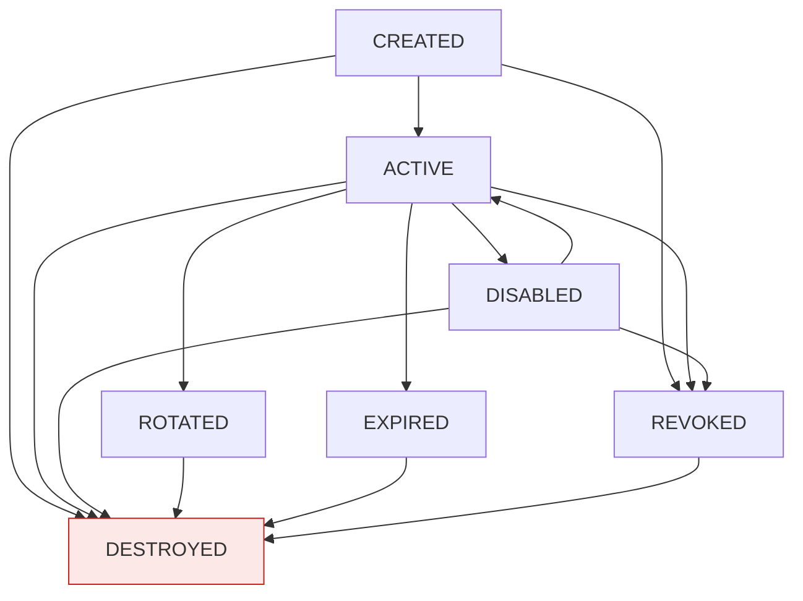
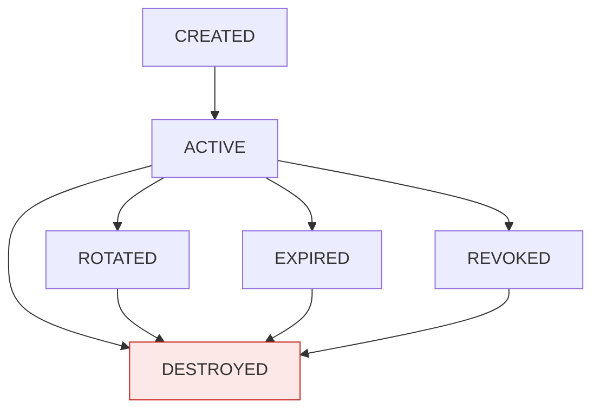

# B — 功能需求提取（第 3 章）

> **提取来源**：`C:/Users/qhbx/Documents/repos/国产化服务/国密服务/docs/需求说明文档.md`（V2.9）第 631–2134 行。
> **提取原则**：逐字保留原文中的矩阵、状态表、阈值、常量、错误码、公式、编码规则；仅精简重复解释性文字，不省略任何规则条目。
> **「原文未明确」**：原文未给出该字段/条件，未臆造。
> **用途**：供架构师编写 V2 详细设计文档使用。

---

## 3.1 密码算法服务（源：3.1，行 633–834）

### 3.1.1 SM2（源：3.1.1，行 635–671）

**需求编号**

| 编号 | 功能 | 要求 |
| --- | --- | --- |
| F-SM2-001 | 密钥对生成 | 生成 SM2 公私钥对 |
| F-SM2-002 | 公钥加密 | 使用指定 KeyId 对数据加密 |
| F-SM2-003 | 私钥解密 | 使用指定 KeyId 解密 |
| F-SM2-004 | 私钥签名 | 对数据进行签名 |
| F-SM2-005 | 公钥验签 | 验证签名 |
| F-SM2-006 | 签名编码转换 | 根据约定支持指定签名编码 |
| F-SM2-007 | 密文编码处理 | 根据实际密码模块能力支持约定编码 |

**算法参数要求**

| 项 | 规则（原文） |
| --- | --- |
| 算法标准 | 遵循 GM/T 0003 |
| 曲线参数 | 使用符合项目要求的 SM2 曲线参数 |
| 签名格式 | 应明确 DER 或 Raw |
| 密文格式 | 应明确实际密码设备/密码库支持的编码 |
| 接口声明 | 接口必须显式声明编码格式或使用平台统一默认值 |
| 长度限制 | SM2 单次数据长度限制必须明确并可配置 |
| 超限处理 | 超过限制时返回明确错误码 |

**本期需求决策项**

| 项 | 决策值 |
| --- | --- |
| SM2 默认签名编码 | **DER** |
| SM2 默认密文编码 | **C1C3C2** |
| 差异登记 | 如实际部署的密码设备仅支持其他编码，应在详细设计中登记差异 |

**SM2 长度限制（V2.9 补充）**

| 项 | 默认值 | 说明 |
| --- | --- | --- |
| SM2 单次加密数据最大长度 | 512 字节 | 依据 SM2 曲线与 KDF 能力，默认 512 字节；详细设计可按 Provider 能力调整 |
| SM2 单次签名数据最大长度 | 不限制（受请求体限制） | 大消息优先使用 SM3 摘要后签名；受 NF-PERF-014 约束 |
| 超限错误码 | 20001 | PARAM_DATA_TOO_LARGE |

> 详细设计阶段应结合所选密码设备能力冻结默认值，并在接口契约中显式声明。

---

### 3.1.2 SM3（源：3.1.2，行 673–687）

**需求编号**

| 编号 | 功能 | 要求 |
| --- | --- | --- |
| F-SM3-001 | SM3 Hash | 对数据计算 SM3 |
| F-SM3-002 | 流式 Hash | 支持大数据流 |

> HMAC-SM3 由 3.1.4 统一提供。

**要求**

| 项 | 规则（原文） |
| --- | --- |
| 算法标准 | 算法遵循 GM/T 0004 |
| 摘要长度 | 256 位 |
| 输出编码 | 支持 Base64 / Hex / 字节流 |
| 内存 | 大文件不得强制一次性加载到内存 |

---

### 3.1.3 SM4（源：3.1.3，行 689–761）

**需求编号**

| 编号 | 功能 | 要求 |
| --- | --- | --- |
| F-SM4-001 | SM4 密钥生成 | 生成 128 位 SM4 密钥 |
| F-SM4-002 | SM4 加密 | 指定 KeyId 加密 |
| F-SM4-003 | SM4 解密 | 指定 KeyId 解密 |
| F-SM4-004 | 流式加密 | 支持大数据 |
| F-SM4-005 | 流式解密 | 支持大数据 |

**支持模式**：ECB / CBC / CTR / GCM。

**要求**

| 项 | 规则（原文） |
| --- | --- |
| 算法标准 | 算法遵循 GM/T 0002 |
| ECB | ECB 仅用于兼容已有业务；新业务原则上不得默认使用 ECB |
| CBC | CBC 必须明确 IV 和 Padding |
| CTR | CTR 必须明确计数器/Nonce 规则 |
| GCM | GCM 必须明确 Nonce、Tag、AAD；GCM Nonce 不得在同一密钥下重复使用；GCM Tag 验证失败时必须整体判定解密失败 |
| 模式选择 | **CBC / CTR 仅提供机密性，不提供认证完整性；新业务涉及机密性 + 完整性时优先使用 SM4-GCM** |

**IV/Nonce 责任与契约**

| 模式 | IV/Nonce 生成方 | 平台责任 | 调用方责任 | 重复检测 |
| --- | --- | --- | --- | --- |
| CBC | 平台生成（默认），也允许调用方传入 | 默认生成安全随机 IV；调用方传入时校验长度 | 传入时必须保证唯一 | 平台按 KeyId+IV 进行短窗口重复检测 |
| CTR | 平台生成（默认），也允许调用方传入 | 默认生成计数器初值；调用方传入时校验长度 | 传入时必须保证不重复 | 平台按 KeyId+Counter 进行短窗口重复检测 |
| GCM | **平台强制生成** | 生成安全随机 Nonce；在密钥生命周期内保证不重复 | 不得传入 Nonce | 平台维护 Nonce 使用记录，超出安全阈值触发密钥轮换告警 |

**CTR 计数器规则（V2.9 补充）**

| 项 | 规则（原文） |
| --- | --- |
| 计数器长度 | 16 字节（128 位），与 SM4 分组长度一致 |
| 初始值 | 平台默认生成安全随机 16 字节计数器初值 |
| 调用方传入 | 必须提供完整 16 字节初始计数器 |
| 递增方式 | 按无符号大端序 +1 |
| 溢出 | **溢出禁止回绕**：当计数器达到最大值时，停止该 KeyVersion 的 CTR 新加密请求，触发该 Data Key 的 KeyVersion 轮换告警；历史密文解密不受影响 |
| 重复检测 | 平台按 `KeyId + Counter` 进行短窗口重复检测 |
| 调用计数 | 平台按 KeyVersion 聚合 CTR 加密调用计数，建议在 2³¹ 设置告警阈值 |
| 事件 | 计数器溢出属于安全事件/关键运行事件，必须写入审计并触发告警 |

**SM4-GCM Nonce 确定性唯一性保障（V2.6 升级）**

GCM Nonce 必须**绝对唯一**，概率性方法不足以保证。采用以下确定性唯一性机制：

```text
Nonce = KeyVersion(4 字节无符号大端序) + NodeId(4 字节无符号大端序) + MonotonicCounter(4 字节无符号大端序)

编码规则必须固定为上述 12 字节拼接结果，不得使用字符串格式或平台默认字节序。
```

或由密码设备/集中服务产生。必须考虑：

| 项 | 规则（原文） |
| --- | --- |
| 场景覆盖 | Node 重启、容器重启、主备切换、时钟异常、数据库不可用 |
| Counter 持久化 | 每个 (KeyId, KeyVersion, NodeId) 三元组维护持久化计数器 |
| Counter 溢出处理（V2.8 修正，审阅 M-01） | 当 MonotonicCounter 达到最大可用值时，**禁止回绕到 0 并继续使用当前 KeyVersion**；处置对象仅限**该 Data Key / KeyVersion**——停止该 KeyVersion 的新 GCM 加密请求，自动触发**该 Data Key 的 KeyVersion 轮换**并生成新的 KeyVersion（从独立计数空间重新开始）；**历史密文（旧 KeyVersion）的解密不受影响**；Root Key / KEK 轮换**不得由溢出事件自动触发**（其人工审批流程见 F-RK-004），仅产生"建议评估轮换"告警，由安全管理员按审批流程决定 |
| 溢出事件 | Counter 溢出属于安全事件/关键运行事件，必须写入审计并触发告警 |
| 平台级调用总量约束（V2.8 新增，审阅 M-02） | Node 级计数器仅保证 Nonce 唯一性，**不承担总量控制**。依据 SP 800-38D，每个 KeyVersion 的 GCM 加密调用总次数（**全节点合计**）不得超过 2³²；平台必须按 KeyVersion 聚合全节点调用计数（集中服务或数据库统一聚合），建议在 2³¹ 设置告警阈值、预留轮换缓冲；达到 2³² 上限前必须完成该 KeyVersion 的强制轮换并记录审计 |
| NodeId 分配 | 由平台统一分配，节点重启后保持不变；节点退役后 NodeId 不再复用；NodeId 注册、心跳、冲突检测机制由详细设计确定（见 I-15） |

**SM4-GCM 参数默认值**

| 项 | 默认值 |
| --- | --- |
| Nonce 长度 | 12 字节（96 位），平台生成 |
| Tag 长度 | 16 字节（128 位） |
| AAD | 允许调用方传入，长度 ≤ 64 字节，默认空 |

**SM4-CBC 参数默认值**

| 项 | 默认值 |
| --- | --- |
| IV 长度 | 16 字节 |
| Padding | PKCS#7 |
| IV 生成 | IV 默认由平台生成 |

---

### 3.1.4 HMAC-SM3（源：3.1.4，行 763–775）

**需求编号**

| 编号 | 功能 | 要求 |
| --- | --- | --- |
| F-HMAC-001 | HMAC-SM3 生成 | 生成认证码 |
| F-HMAC-002 | HMAC-SM3 验证 | 验证认证码 |

**要求**

| 项 | 规则（原文） |
| --- | --- |
| 密钥管理 | HMAC 密钥由平台统一管理；不允许调用方提交平台托管密钥明文 |
| 输出编码 | 输出支持 Base64 / Hex |
| 失败返回 | 验证失败只返回验证失败结果 |

---

### 3.1.5 随机数服务（源：3.1.5，行 777–798）

**需求编号**

| 编号 | 功能 | 要求 |
| --- | --- | --- |
| F-RNG-001 | 随机数生成 | 生成密码学安全随机数 |
| F-RNG-002 | 指定长度 | 支持指定字节长度 |
| F-RNG-003 | 输出编码 | 支持 Base64/Hex |

**要求**

| 项 | 规则（原文） |
| --- | --- |
| 安全机制 | 随机数必须使用密码学安全随机数生成机制 |
| HTTP 方法 | 随机数接口采用 POST |
| 单次最大输出长度（V2.9 修订） | **随机数单次请求最大输出长度独立定义**：默认上限 64KB；最大可配置上限 1MB |
| 限制独立 | 随机数最大长度不得复用 NF-PERF-014（NF-PERF-014 为通用请求体大小限制） |
| 超限错误码 | 超过上限返回错误码 20001 `PARAM_DATA_TOO_LARGE` |
| 大批量 | 大批量随机数应通过多次请求获取，避免单次请求过大 |

**随机数来源优先级**

1. HSM 真随机数发生器（HSM 部署模式）；
2. 操作系统 CSPRNG（软件密码模块部署模式）；
3. 禁止使用非密码学安全随机数。

---

### 3.1.6 密码模块自检（源：3.1.6，行 800–814）

**需求编号**

| 编号 | 功能 | 要求 |
| --- | --- | --- |
| F-KAT-001 | 上电自检 | 密码模块启动时执行算法已知答案测试（KAT） |
| F-KAT-002 | 周期自检 | 按配置周期（默认 24 小时）执行算法自检 |
| F-KAT-003 | 按需自检 | 支持管理员手动触发自检 |
| F-KAT-004 | 自检失败处理 | 自检失败时拒绝提供密码运算并告警，记录安全事件 |

**要求**

| 项 | 规则（原文） |
| --- | --- |
| 覆盖范围 | 自检覆盖 SM2、SM3、SM4、HMAC-SM3、随机数 |
| 测试向量 | 自检使用 GM/T 标准测试向量 |
| 审计 | 自检结果记录审计 |
| 失败处理 | 自检失败时密码模块状态标记为不可用，拒绝所有密码运算请求 |

---

### 3.1.7 KeyType 兼容性校验（V2.6 补充）（源：3.1.7，行 816–832）

平台不校验 KeyUsage 业务语义，但**必须校验 KeyType 与算法操作的密码学兼容性**。

**校验矩阵（允许操作）**

| KeyType | 允许操作 |
| --- | --- |
| SM2 | SM2 Encrypt / Decrypt / Sign / Verify |
| SM4 | SM4 Encrypt / Decrypt |
| HMAC | HMAC Generate / Verify |

**禁止场景（拒绝）**

- SM4 Key 做 SM2 Sign；
- HMAC Key 做 SM4 Encrypt；
- SM2 Key 做 HMAC Generate 等。

**错误码**：不兼容操作返回错误码 12003 `KEY_TYPE_MISMATCH`。

---

## 3.2 密钥生命周期管理（源：3.2，行 834–1176）

### 3.2.1 密钥分类（源：3.2.1，行 836–848）

| KeyType | 算法 | 用途（由三方系统自行决定，平台不约束业务语义） |
| --- | --- | --- |
| SM2 | SM2 | SIGN / ENCRYPT（三方系统自行决定） |
| SM4 | SM4 | ENCRYPT（三方系统自行决定） |
| HMAC | HMAC-SM3 | MAC（三方系统自行决定） |

**要求**

| 项 | 规则（原文） |
| --- | --- |
| AppSecret 归属 | AppSecret 不作为普通密码学 Key 纳入密钥材料管理 |
| 类型不可变 | 密钥类型在创建时确定，创建后原则上不可直接修改 |
| 校验范围 | 平台不校验 KeyUsage 业务语义；平台校验 KeyType 兼容性（见 3.1.7） |

---

### 3.2.2 密钥基本属性（源：3.2.2，行 850–871）

| 属性 | 说明 |
| --- | --- |
| KeyId | 平台内部密钥唯一标识 |
| KeyType | 密钥类型 |
| KeyVersion | 密钥版本 |
| AppId | 所属应用 |
| 状态 | 生命周期状态 |
| 创建时间 | 创建时间 |
| 生效时间 | 生效时间 |
| 过期时间 | 过期时间 |
| 轮换策略 | 轮换策略 |
| 创建者 | 创建者 |
| 创建来源 | 生成 / 导入 |
| ProviderId | 承载密钥的 Provider |
| StorageType | WRAPPED_DATABASE / HSM_REFERENCE |
| AlgorithmParams | 算法参数 |
| 销毁时间 | 销毁时间 |
| MetadataIntegrityValue | 元数据完整性保护值 |

**F-KM-020**：KeyType、所属 App 等核心属性创建后原则上不可直接修改。

---

### 3.2.3 生命周期状态（源：3.2.3，行 873–934）

**Key 状态转换（原文 mermaid 语义展开）**



**要求**

| 项 | 规则（原文） |
| --- | --- |
| "使用" | "使用"不是独立状态 |
| 终态 | DESTROYED 为终态，定义为"**在线运行密钥材料已完成密码学销毁**" |
| 归档材料 | 归档备份中的密钥材料属于 ARCHIVE MATERIAL，不属于在线运行密钥材料 |

**KeyVersion 状态机（V2.9 补充）**

KeyVersion 拥有独立状态，与 Key 状态协同但不完全等同：



**KeyVersion 状态转换矩阵**

| 编号 | 当前状态 | 目标状态 | 是否允许 | 条件 |
| --- | --- | --- | ---: | --- |
| ST-KV-001 | CREATED | ACTIVE | 是 | Key 激活时同步激活当前版本 |
| ST-KV-002 | CREATED | REVOKED | 是 | Key 被撤销 |
| ST-KV-003 | CREATED | DESTROYED | 是 | Key 销毁 |
| ST-KV-004 | ACTIVE | ROTATED | 是 | Key 轮换，旧版本转 ROTATED |
| ST-KV-005 | ACTIVE | EXPIRED | 系统自动 | Key 到期 |
| ST-KV-006 | ACTIVE | REVOKED | 是 | Key 被撤销 |
| ST-KV-007 | ACTIVE | DESTROYED | 是 | Key 销毁 |
| ST-KV-008 | ROTATED | ACTIVE | 否 | 历史版本不得重新成为当前版本 |
| ST-KV-009 | ROTATED | DESTROYED | 是 | Key 销毁 |
| ST-KV-010 | EXPIRED | ACTIVE | 否 | 不得重新激活 |
| ST-KV-011 | EXPIRED | DESTROYED | 是 | Key 销毁 |
| ST-KV-012 | REVOKED | ACTIVE | 否 | 不得重新激活 |
| ST-KV-013 | REVOKED | DESTROYED | 是 | Key 销毁 |
| ST-KV-014 | DESTROYED | 任意 | 否 | 终态 |

---

### 3.2.4 状态转换矩阵（源：3.2.4，行 936–957）

| 编号 | 当前状态 | 目标状态 | 是否允许 | 条件 |
| --- | --- | --- | ---: | --- |
| ST-KM-001 | CREATED | ACTIVE | 是 | 激活 |
| ST-KM-002 | CREATED | REVOKED | 是 | 异常/人工撤销 |
| ST-KM-003 | CREATED | DESTROYED | 是 | 销毁 |
| ST-KM-004 | ACTIVE | DISABLED | 是 | 临时禁用 |
| ST-KM-005 | ACTIVE | ROTATED | 是 | 新版本产生 |
| ST-KM-006 | ACTIVE | EXPIRED | 系统自动 | 到期 |
| ST-KM-007 | ACTIVE | REVOKED | 是 | 安全事件 |
| ST-KM-008 | ACTIVE | DESTROYED | 是 | 满足销毁条件 |
| ST-KM-009 | DISABLED | ACTIVE | 是 | 重新激活 |
| ST-KM-010 | DISABLED | REVOKED | 是 | 永久撤销 |
| ST-KM-011 | DISABLED | DESTROYED | 是 | 销毁 |
| ST-KM-012 | ROTATED | ACTIVE | 否 | 不允许旧版本重新成为当前版本 |
| ST-KM-013 | ROTATED | DESTROYED | 是 | 满足销毁条件 |
| ST-KM-014 | EXPIRED | ACTIVE | 否 | 原则上不得重新激活 |
| ST-KM-015 | EXPIRED | DESTROYED | 是 | 销毁 |
| ST-KM-016 | REVOKED | ACTIVE | 否 | 不允许重新激活 |
| ST-KM-017 | REVOKED | DESTROYED | 是 | 销毁 |
| ST-KM-018 | DESTROYED | 任意 | 否 | 终态 |

---

### 3.2.5 密钥生成（源：3.2.5，行 959–973）

| 编号 | 功能 | 要求 |
| --- | --- | --- |
| F-KM-001 | 密钥生成 | 生成密钥 |

| 维度 | 内容（原文） |
| --- | --- |
| 业务规则 | 根据 KeyType 生成密钥；自动生成唯一 KeyId；不返回对称密钥明文；SM2 可返回公钥；返回密钥元数据；生成操作必须产生审计记录；Provider 决定密钥材料物理位置（数据库密文或 HSM Key Handle） |
| 前置条件 | 原文未明确 |
| 后置条件 | 原文未明确（隐含：产生唯一 KeyId 与密钥元数据、产生审计记录） |
| 异常与错误码 | 原文未明确 |

---

### 3.2.6 密钥查询（源：3.2.6，行 975–982）

| 编号 | 功能 | 要求 |
| --- | --- | --- |
| F-KM-002 | 密钥查询 | 查询单个密钥元数据 |
| F-KM-010 | 密钥列表 | 查询密钥列表 |

| 维度 | 内容（原文） |
| --- | --- |
| 业务规则 | 不得返回：SM2 私钥、SM4 密钥、HMAC 密钥、Root Key、KEK、AppSecret 明文 |
| 前置条件 | 原文未明确 |
| 后置条件 | 原文未明确 |
| 异常与错误码 | 原文未明确 |

---

### 3.2.7 密钥激活（源：3.2.7，行 984–988）

| 编号 | 功能 | 要求 |
| --- | --- | --- |
| F-KM-003 | 密钥激活 | 激活 CREATED 状态密钥 |

| 维度 | 内容（原文） |
| --- | --- |
| 业务规则 | 激活 CREATED 状态密钥 |
| 前置条件 | 原文未明确（隐含：密钥处于 CREATED） |
| 后置条件 | 原文未明确 |
| 异常与错误码 | 原文未明确 |

---

### 3.2.8 密钥禁用（源：3.2.8，行 990–996）

| 编号 | 功能 | 要求 |
| --- | --- | --- |
| F-KM-004 | 密钥禁用 | 临时禁用 ACTIVE 状态密钥 |

| 维度 | 内容（原文） |
| --- | --- |
| 业务规则 | 禁用后：加密禁止、解密禁止、签名禁止、验签禁止、查询允许；管理操作记录审计 |
| 前置条件 | 原文未明确（隐含：密钥处于 ACTIVE） |
| 后置条件 | 原文未明确 |
| 异常与错误码 | 原文未明确 |

---

### 3.2.9 密钥重新激活（源：3.2.9，行 998–1002）

| 编号 | 功能 | 要求 |
| --- | --- | --- |
| F-KM-005 | 密钥重新激活 | 将 DISABLED 密钥激活 |

| 维度 | 内容（原文） |
| --- | --- |
| 业务规则 | 将 DISABLED 密钥激活 |
| 前置条件 | 原文未明确（隐含：密钥处于 DISABLED） |
| 后置条件 | 原文未明确 |
| 异常与错误码 | 原文未明确 |

---

### 3.2.10 密钥轮换（源：3.2.10，行 1004–1010）

| 编号 | 功能 | 要求 |
| --- | --- | --- |
| F-KM-006 | 密钥轮换 | 产生新版本 |

| 维度 | 内容（原文） |
| --- | --- |
| 业务规则 | 轮换后：旧版本 ROTATED，新版本 ACTIVE，KeyId 不变，KeyVersion 递增；支持显式指定 KeyVersion 便于业务侧选择版本 |
| 前置条件 | 原文未明确 |
| 后置条件 | 原文未明确 |
| 异常与错误码 | 原文未明确 |

---

### 3.2.11 密钥轮换策略（源：3.2.11，行 1012–1020）

平台应支持：

1. 按时间轮换；
2. 按调用次数轮换；
3. 按数据量轮换；
4. 手工轮换；
5. 安全事件触发轮换。

| 维度 | 内容 |
| --- | --- |
| 需求编号 | 原文未明确（无独立编号） |
| 前置条件 / 后置条件 / 异常与错误码 | 原文未明确 |

---

### 3.2.12 密钥过期（源：3.2.12，行 1022–1028）

| 编号 | 功能 | 要求 |
| --- | --- | --- |
| F-KM-007 | 密钥过期 | 按 ExpireAt 自动变更状态 |

| 维度 | 内容（原文） |
| --- | --- |
| 业务规则 | 按 ExpireAt 自动变更状态；时间判断必须依赖统一时间源 |
| 前置条件 / 后置条件 / 异常与错误码 | 原文未明确 |

---

### 3.2.13 密钥注销（源：3.2.13，行 1030–1036）

| 编号 | 功能 | 要求 |
| --- | --- | --- |
| F-KM-008 | 密钥注销 | 撤销密钥 |

| 维度 | 内容（原文） |
| --- | --- |
| 业务规则 | REVOKED 后：禁止新的加密/签名/密钥使用；历史解密/验签是否允许根据安全策略确定（默认允许），具体见 3.2.22 |
| 前置条件 / 后置条件 / 异常与错误码 | 原文未明确 |

---

### 3.2.14 密钥销毁（V2.6 重新定义）（源：3.2.14，行 1038–1068）

| 编号 | 功能 | 要求 |
| --- | --- | --- |
| F-KM-009 | 密钥销毁 | 销毁在线密钥材料 |

**DESTROYED 定义（V2.6）**：DESTROYED 表示**在线运行密钥材料已完成密码学销毁，不得参与新的密码运算**。归档备份中的密钥材料（ARCHIVE MATERIAL）不属于在线运行密钥材料。

**材料分类**

| 概念 | 定义 |
| --- | --- |
| ONLINE MATERIAL | 在线运行密钥材料；参与密码运算；受 Provider 保护 |
| ARCHIVE MATERIAL | 归档密钥材料；独立 KEK-Backup 保护；仅历史解密/验签；禁止新加密、新签名、新 MAC、新 Wrap/Unwrap |
| DESTROYED | 在线运行密钥材料已销毁；归档材料不被销毁 |

**销毁必须**

1. 校验当前状态；
2. 校验操作权限；
3. 二次确认（见 3.6.4）；
4. 记录审计；
5. **调用 Provider 销毁在线密钥对象**（Software：安全擦除数据库密文；HSM：调用 HSM 销毁接口）；
6. 验证在线材料不可恢复；
7. 保留必要元数据（含 IntegrityValue）；
8. **标记运行备份中对应密钥材料为待擦除**；
9. 归档备份中对应密钥材料保留（见 3.2.23）。

| 维度 | 内容（原文） |
| --- | --- |
| 终态 | DESTROYED 为终态 |
| 失败处理 | `DestroyKeyAsync` 必须返回明确的执行结果与失败原因；如 Provider 不支持销毁能力或设备异常，不得将 Key 状态置为 DESTROYED，应返回明确错误并记录安全事件 |
| 前置条件 | 原文未明确（隐含：校验当前状态 + 校验操作权限 + 二次确认） |
| 后置条件 | 原文未明确 |
| 异常与错误码 | 原文未明确（仅描述"应返回明确错误并记录安全事件"） |

---

### 3.2.15 密钥导入（源：3.2.15，行 1070–1078）

| 编号 | 功能 | 要求 |
| --- | --- | --- |
| F-KM-012 | 密钥导入 | 导入外部密钥 |

支持：SM2 公钥、SM2 密钥对、SM4 密钥、HMAC 密钥。

| 维度 | 内容（原文） |
| --- | --- |
| 业务规则 | 加密保护导入；不允许明文 HTTP 导入；不得在普通 API 响应返回；必须验证 KeyType；导入操作审计；优先采用密码设备安全导入机制；**密钥导入属于高风险操作，必须二次确认并纳入幂等控制（Idempotency-Key）**；导入前需校验 Provider 的 `CanImportKey` 能力，不支持时返回 `NotSupported`；导入格式、加密保护方式、Provider 特定导入机制在详细设计阶段冻结 |
| 前置条件 | 原文未明确（隐含：Provider `CanImportKey` 能力校验） |
| 后置条件 | 原文未明确 |
| 异常与错误码 | 不支持时返回 `NotSupported`；其余原文未明确 |

---

### 3.2.16 密钥备份（源：3.2.16，行 1080–1093）

| 编号 | 功能 | 要求 |
| --- | --- | --- |
| F-KM-013 | 密钥备份 | 备份密钥数据 |

| 维度 | 内容（原文） |
| --- | --- |
| 业务规则 | 备份数据必须加密；备份文件不得包含明文密钥；备份必须具备完整性保护；备份数据与生产环境隔离；备份操作审计；备份机制按 Provider 分别定义（见 3.11.7） |
| 前置条件 / 后置条件 / 异常与错误码 | 原文未明确 |

> 注：原文 3.2.16 引用 "3.11.7"，而第 3.11 章实际仅至 3.11.6；该引用目标不存在，属原文交叉引用缺陷（详见文末"含糊/缺失"说明）。

---

### 3.2.17 密钥恢复（源：3.2.17，行 1095–1101）

| 编号 | 功能 | 要求 |
| --- | --- | --- |
| F-KM-014 | 密钥恢复 | 从备份恢复密钥 |

| 维度 | 内容（原文） |
| --- | --- |
| 业务规则 | 恢复必须：验证备份完整性、验证备份来源、校验密钥版本、校验目标环境、记录恢复人员、恢复时间、恢复结果 |
| 前置条件 / 后置条件 / 异常与错误码 | 原文未明确 |

---

### 3.2.18 密钥恢复验证（源：3.2.18，行 1103–1109）

| 编号 | 功能 | 要求 |
| --- | --- | --- |
| F-KM-015 | 恢复验证 | 验证恢复后的密钥可用性 |

| 维度 | 内容（原文） |
| --- | --- |
| 业务规则 | 恢复后必须通过测试确认：密钥可正常识别、KeyId/Version 正确、SM2/SM4/HMAC 能完成约定密码操作、密钥状态符合恢复策略 |
| 前置条件 / 后置条件 / 异常与错误码 | 原文未明确 |

---

### 3.2.19 密钥版本管理（源：3.2.19，行 1111–1117）

| 编号 | 功能 | 要求 |
| --- | --- | --- |
| F-KM-011 | 密钥版本管理 | 管理密钥版本 |

| 维度 | 内容（原文） |
| --- | --- |
| 业务规则 | 每次轮换产生新版本；版本号单调递增；保留版本链；支持查询历史版本；支持按版本执行允许的历史密码操作；不允许历史版本重新成为当前版本 |
| 前置条件 / 后置条件 / 异常与错误码 | 原文未明确 |

---

### 3.2.20 密钥隔离（源：3.2.20，行 1119–1123）

| 维度 | 内容（原文） |
| --- | --- |
| 需求编号 | 原文未明确（无独立编号） |
| 业务规则 | 必须实现：App A → 只能访问 App A 授权的 Key。后端必须执行 AppId 与 KeyId 归属校验；越权访问必须拒绝并记录审计与安全事件 |
| 前置条件 / 后置条件 / 异常与错误码 | 原文未明确 |

---

### 3.2.21 密钥数据完整性校验（源：3.2.21，行 1125–1133）

| 编号 | 功能 | 要求 |
| --- | --- | --- |
| F-DI-001 | 密钥完整性值生成 | 创建/更新 Key 与 KeyVersion 时，对关键字段计算 IntegrityValue |
| F-DI-002 | 密钥完整性值验证 | 读取/使用 Key 与 KeyVersion 时，验证 IntegrityValue |
| F-DI-003 | 校验失败处理 | IntegrityValue 不一致时拒绝使用、记录安全事件并告警 |

> 校验范围、时机、算法与失败处理详见 7.17。

| 维度 | 内容 |
| --- | --- |
| 前置条件 / 后置条件 / 异常与错误码 | 原文未明确（详见 7.17，超出本提取范围） |

---

### 3.2.22 密钥运算级规则（源：3.2.22，行 1135–1156）

| 密钥状态 | 当前版本 | 加密 | 解密 | 签名 | 验签 | 查询 | 备注 |
| --- | --- | --- | --- | --- | --- | --- | --- |
| CREATED | 是 | 否 | 否 | 否 | 否 | 是 | 未激活 |
| ACTIVE | 是 | 是 | 是 | 是 | 是 | 是 | 正常 |
| DISABLED | 是 | 否 | 否 | 否 | 否 | 是 | 临时禁用 |
| ROTATED | 否 | 否 | 是 | 否 | 是 | 是 | 历史版本，允许历史解密/验签 |
| EXPIRED | 否 | 否 | 是 | 否 | 是 | 是 | 过期，允许历史解密/验签 |
| REVOKED | 否 | 否 | 是 | 否 | 是 | 是 | 注销，默认允许历史解密/验签 |
| DESTROYED | 否 | 否 | 否 | 否 | 否 | 是 | 终态，仅保留元数据查询 |

**规则说明（V2.9 补充 HMAC 语义）**

| 项 | 规则（原文） |
| --- | --- |
| 加密、签名 | 加密、签名必须使用当前 ACTIVE 版本 |
| 解密、验签 | 解密、验签允许使用历史版本（ROTATED / EXPIRED / REVOKED） |
| 验签列覆盖 | **表内"验签"列同时覆盖 SM2 Verify 与 HMAC Verify**：对 HMAC 密钥，历史版本允许 HMAC Verify |
| HMAC Generate | **HMAC Generate 属于 MAC 生成类操作，语义与"签名"一致，必须使用当前 ACTIVE 版本**；历史版本禁止 HMAC Generate |
| DISABLED | DISABLED 状态下禁止一切密码运算 |
| REVOKED | REVOKED 状态下历史解密/验签开关由安全策略配置（默认允许） |
| 版本指定 | 指定历史版本用于解密、验签时，必须显式传 `keyVersion`；未指定时使用当前 ACTIVE 版本 |
| 历史版本执行 | 历史版本用于 SM4 Decrypt 或 HMAC Verify 时，按 KeyVersion 状态机（3.2.3）与上述规则执行 |

---

### 3.2.23 销毁后备份处置策略（源：3.2.23，行 1158–1174）

| 备份类型 | 用途 | 保留周期 | 销毁后处置 |
| --- | --- | --- | --- |
| 运行备份 | 故障恢复、日常恢复验证 | ≥90 天（NF-BAK-001） | 密钥销毁后，运行备份中的对应密钥材料应在 30 天内安全擦除 |
| 归档备份 | 合规追溯、历史解密能力保留 | 长期（NF-BAK-003） | 保留已被销毁密钥的元数据与历史密文可解密所需的历史密钥材料（ARCHIVE MATERIAL）；密钥材料由 KEK-Backup 加密；访问需安全管理员二次确认 |

**处置要求**

| 项 | 规则（原文） |
| --- | --- |
| 标记 | 密钥进入 DESTROYED 后，自动标记运行备份中对应密钥材料为待擦除 |
| 运行备份擦除 | 运行备份擦除必须验证擦除结果并记录审计 |
| 归档使用范围 | 归档备份中的密钥材料仅允许用于历史数据解密与验签，不允许用于新的加密与签名 |
| 归档访问 | 归档备份密钥材料访问必须二次确认、记录审计并触发告警 |
| 二次确认实现 | 本期无审批流，二次确认方式以口令/验证码实现（见 3.6.4） |
| KEK-Backup | KEK-Backup 的轮换、销毁与归档由 3.11 统一管理 |

---

## 3.3 应用认证与访问控制（源：3.3，行 1176–1517）

### 3.3.1 应用管理（源：3.3.1，行 1178–1195）

| 编号 | 功能 | 要求 |
| --- | --- | --- |
| F-AUTH-001 | 应用注册 | 注册应用并分配 AppId |
| F-AUTH-002 | 应用查询 | 查询应用信息 |
| F-AUTH-003 | 应用启用/禁用 | 控制应用可用状态 |
| F-AUTH-004 | AppSecret 重置 | 重新生成应用凭据 |
| F-AUTH-005 | AppSecret 轮换 | 轮换应用凭据 |
| F-AUTH-006 | AppSecret 撤销 | 撤销应用凭据 |

**应用注册后权限说明**

| 项 | 规则（原文） |
| --- | --- |
| 默认权限 | 应用注册并启用后即具备调用本系统业务 API 的权限 |
| 权限分配 | 平台不再进行 API 权限分配 |
| KeyUsage | 平台不校验 KeyUsage 业务语义，由三方系统自行决定 |
| 平台校验 | 平台执行 **AppId 与 KeyId 资源归属校验** 及 **KeyType 兼容性校验** |
| IP 白名单 | IP 白名单为可选能力，默认关闭 |

---

### 3.3.2 AppSecret 生命周期（V2.6 修正，V2.9 补充性能路径）（源：3.3.2，行 1197–1249）

AppSecret 状态：

```text
CREATED → ACTIVE → ROTATED / DISABLED / REVOKED
```

**存储模型（V2.6 修正）**：AppSecret 原文**不得持久化保存**；服务器端以受 KEK-Runtime 保护的密文形式保存，并仅在请求签名验证的短生命周期内解密使用。

| 字段 | 说明 |
| --- | --- |
| SecretCiphertext | AppSecret 密文（SM4-GCM 由 KEK-Runtime 保护） |
| SecretHash | SM3(AppSecret)，用于指纹/去重/审计关联 |

**要求**

| 项 | 规则（原文） |
| --- | --- |
| 明文展示 | 创建时只展示一次明文 |
| 找回 | 平台原则上不得提供"找回原 Secret"功能 |
| 丢失 | Secret 丢失只能重新生成 |
| 轮换失效 | **AppSecret 轮换后，旧 AppSecret 立即失效**（无兼容期） |
| 轮换为高风险 | **AppSecret 轮换为高风险操作**，管理端必须强制二次确认，提示"轮换后旧 AppSecret 立即失效，请确认已通知所有使用方在轮换前完成切换，否则将导致业务中断" |
| 审计 | Secret 重置必须审计 |
| 内存 | 解密后的 AppSecret 不得写入日志、缓存或普通对象持久化，使用后立即清零内存 |

**AppSecret 解密路径与性能分级（V2.9 补充）**

**1. Software Provider 场景**

| 项 | 规则（原文） |
| --- | --- |
| 解密位置 | AppSecret 解密在应用进程内完成（KEK-Runtime 由 Root Key 解封后驻留安全内存） |
| 短缓存 | 允许在安全内存中短缓存解密后的 AppSecret，TTL 建议 ≤60 秒 |
| 缓存约束 | 缓存必须满足：仅进程内存、受保护内存区域、禁止序列化、轮换/撤销立即清除、支持审计 |
| 性能验收 | NF-PERF-009（请求签名校验 P95 ≤10ms）按该路径验收 |

**2. HSM Provider 场景**

| 项 | 规则（原文） |
| --- | --- |
| 解密位置 | AppSecret 解密需调用 HSM 解封 KEK-Runtime 或直接由 HSM 解封 SecretCiphertext |
| 瓶颈 | 每次验签调用 HSM 将导致 HSM 成为瓶颈，无法满足 10ms P95 |
| 短缓存 | 允许在应用侧安全内存中短缓存解密后的 AppSecret，TTL 建议 ≤30 秒 |
| 缓存约束 | 缓存必须满足：仅进程内存、HSM 侧轮换/撤销事件驱动立即清除、禁止落盘、支持审计 |
| 性能验收 | 性能指标按 NF-PERF-009A（HSM 场景）验收，具体阈值在详细设计阶段结合 HSM 实测冻结 |

**3. 缓存失效与撤销联动**

| 项 | 规则（原文） |
| --- | --- |
| 触发清除 | AppSecret 轮换/撤销、Key 状态变更、安全事件触发时，必须立即清除应用侧短缓存 |
| 实现方式 | 缓存清理由平台统一事件总线或管理端指令下发实现 |
| 审计 | 清除动作记录审计 |

**4. 安全约束**

| 项 | 规则（原文） |
| --- | --- |
| 受保护内存 | 短缓存必须使用受保护内存（如 .NET SecureString 等价机制或自研安全缓冲区） |
| GC | 缓存对象不得被 GC 长期驻留；建议使用固定内存 + 主动清零 |
| 上下文绑定 | 缓存访问必须与请求上下文绑定，禁止跨请求跨线程共享 |
| 内存转储 | 内存转储抽查时必须验证缓存对象可被清零 |

---

### 3.3.3 请求直接签名认证（业务 API）（源：3.3.3，行 1251–1417）

业务 API 采用 **AppID + 请求直接签名** 模式，AppSecret 不在网络传输。

#### 3.3.3.1 请求头结构

| 请求头 | 说明 |
| --- | --- |
| `X-App-Id` | 应用标识 |
| `X-Timestamp` | 当前 Unix 时间戳（秒级） |
| `X-Nonce` | 随机字符串/UUID，最小 16 字节（128 bit） |
| `X-Signature` | 客户端生成的签名值（Base64 编码） |
| `X-Request-Id` | 请求唯一标识（可选） |

#### 3.3.3.2 签名算法

**HMAC-SM3**（参考阿里云签名结构）。

**CanonicalHeaders 拼接口径（V2.8 钉死，审阅 H-01）**：CanonicalHeaders 为各 `key:value\n` 顺序拼接后**去除末尾换行符**的结果——即 Header 块整体末尾**不带**换行，公式中的 `+ "\n"` 仅作为 Header 块与 SignedHeaders 之间的分隔符，**不再额外产生空行**。本口径以 3.3.3.3 固定测试向量为唯一仲裁依据，任何实现必须通过该向量的签名比对。

```text
stringToSign =
  HTTP-Method + "\n"
  + CanonicalURI + "\n"
  + CanonicalQueryString + "\n"
  + CanonicalHeaders(去除末尾换行) + "\n"
  + SignedHeaders + "\n"
  + HexEncode(SM3(RequestBody))

signature = Base64(HMAC-SM3(AppSecret, stringToSign))
```

#### 3.3.3.3 Canonical Request 跨语言实现规范（V2.6 补充）

**1. HTTP-Method**：大写（GET / POST / PUT / DELETE 等）。

**2. CanonicalURI**

| 项 | 规则（原文） |
| --- | --- |
| 编码 | 请求路径，URL 编码遵循 RFC 3986 |
| 保留字符 | 保留字符：`A-Z a-z 0-9 - _ . ~` |
| 斜杠 | `/` 在路径中不编码；`%2F` 与 `/` 必须区分 |
| Unicode | Unicode 字符按 UTF-8 编码后百分号编码 |

**3. CanonicalQueryString**

| 项 | 规则（原文） |
| --- | --- |
| 排序（参数名） | 按参数名小写字典序排序 |
| 排序（同名参数） | 相同参数名按参数值字典序排序（保持 `?a=1&a=2` → `a=1&a=2`） |
| 编码 | URL 编码遵循 RFC 3986；空格编码为 `%20`，不是 `+` |
| 无参数 | 无参数时为空字符串 |

**4. CanonicalHeaders**

| 项 | 规则（原文） |
| --- | --- |
| 参与签名 Header | `x-app-id`、`x-timestamp`、`x-nonce` |
| 排序 | Header 名小写后按字典序排序 |
| 格式 | 格式：`key:value\n` |
| 拼接口径（V2.8 钉死） | 各 `key:value\n` 顺序拼接后**去除末尾换行符**，Header 块整体末尾不带换行；以本节固定测试向量为唯一仲裁依据 |
| 值处理 | Header 值首尾空白去除，内部多个连续空白压缩为单个空格 |

**5. SignedHeaders**

- 参与签名的 Header 名列表（小写），分号分隔；
- 示例：`x-app-id;x-nonce;x-timestamp`。

**6. HexEncode(SM3(RequestBody))**

| 项 | 规则（原文） |
| --- | --- |
| 输出 | 请求体 SM3 摘要的小写十六进制字符串 |
| 空 Body | **空 Body**：SM3("") 的十六进制值 `1ab21d8355cfa17f8e61194831e81a8f22bec8c728fefb747ed035eb5082aa2b` |
| Content-Type | Body 必须为 `Content-Type: application/json; charset=utf-8` |
| 编码禁止 | 禁止 gzip / chunked / multipart 编码 |
| 空体处理 | 如请求体为空，必须使用空字符串的 SM3 摘要 |

**7. 签名输出**

- 固定为 Base64；
- **禁止 Hex**。

**8. Nonce**

- 最小随机长度 ≥ 128 bit（16 字节）；
- 建议使用 UUID v4 或 16 字节安全随机数。

**固定测试向量（供跨语言实现验证）**

> 本测试向量仅用于 Canonical Request / SM3 / HMAC-SM3 算法一致性验证。由于 `X-Timestamp=1727078400` 已不在当前生产时间窗口内，**不得直接作为端到端认证成功用例**；端到端认证必须使用测试执行时动态生成的 Timestamp。

```text
AppSecret（仅测试环境）：TestAppSecret-V27-20260924!
Method: POST
URI: /api/v1/crypto/sm4/encrypt
Query: 空
Header:
    X-App-Id: test-app-001
    X-Timestamp: 1727078400
    X-Nonce: 550e8400-e29b-41d4-a716-446655440000
Body: {"keyId":"test-key","data":"SGVsbG8="}

SM3(RequestBody):
50511e530afd6b2b568171c95a7e4838680f7d4c1004ee28c5c98247cf9aac0f

StringToSign:
POST
/api/v1/crypto/sm4/encrypt

x-app-id:test-app-001
x-nonce:550e8400-e29b-41d4-a716-446655440000
x-timestamp:1727078400
x-app-id;x-nonce;x-timestamp
50511e530afd6b2b568171c95a7e4838680f7d4c1004ee28c5c98247cf9aac0f

Signature（Base64）：
KfuluxDM90Ze4jQtQeSG5AZ/MubbtzoA3vFoKslQFfc=
```

> 该测试向量作为 V2.7 编码基线固定值；实现不得自行替换 Canonical URI、Header 排序、Body 序列化、SM3 输出编码或 Base64 规则。

#### 3.3.3.4 服务端校验步骤（V2.6 修正处理顺序）

**V2.5 的 DoS 风险**：先写入 Nonce 再验证 HMAC，攻击者可用大量无效 Nonce 灌满缓存。

**V2.6 修正顺序**

```text
1. 必填校验：检查 X-App-Id / X-Timestamp / X-Nonce / X-Signature 齐全
   ↓
2. Timestamp 基础校验：±3 分钟窗口
   ↓
3. 根据 X-App-Id 查询 AppSecret
   ↓
4. 解密 SecretCiphertext 获取 AppSecret（或从受限内存短缓存获取）
   ↓
5. 按 Canonical Request 规则重算签名
   ↓
6. 比对签名：不一致 → 10004（记录安全事件，不写入 Nonce）
   ↓
7. HMAC 成功后原子写入 Nonce（SET NX，缓存 + 数据库 UNIQUE(AppId, Nonce)）
   ↓
8. Nonce 已存在 → 10006
   ↓
9. 放行
```

**关键点**

| 项 | 规则（原文） |
| --- | --- |
| 失败不写 Nonce | HMAC 验证失败时**不写入 Nonce**，避免攻击者用无效请求灌满 Nonce 存储 |
| 原子性 | Nonce 写入必须原子（SET NX） |
| 回退 | 数据库回退必须使用 `UNIQUE(AppId, Nonce)` 约束，禁止 SELECT → INSERT |
| Nonce 双写一致性（V2.9 补充） | 以数据库 `UNIQUE(AppId, Nonce)` 为最终仲裁依据；缓存 SET NX 成功但数据库插入冲突时，以数据库结果为准返回 10006；缓存不可用时直接走数据库；双写均失败时拒绝请求并记录安全事件与告警；禁止将缓存结果作为最终仲裁 |
| 内存清零 | 解密后的 AppSecret 使用后立即清零内存（短缓存场景按 3.3.2 约束） |

#### 3.3.3.5 签名失败错误码

| 错误码 | 标识符 | 说明 |
| --- | --- | --- |
| 10004 | SIGNATURE_INVALID | 签名校验失败 |
| 10005 | SIGNATURE_TIMESTAMP_EXPIRED | Timestamp 超出允许时间窗口 |
| 10006 | SIGNATURE_NONCE_REPLAY | Nonce 重复，疑似重放攻击 |

#### 3.3.3.6 功能需求

| 编号 | 功能 | 要求 |
| --- | --- | --- |
| F-AUTH-025 | 请求签名生成支持 | 平台提供签名规范说明与示例，支持三方系统按规范生成签名 |
| F-AUTH-026 | 请求签名校验 | 平台按规范重算签名并比对；校验失败返回 10004 |
| F-AUTH-027 | 时间窗口校验 | Timestamp 偏差不得超过 ±3 分钟；超时返回 10005 |
| F-AUTH-028 | Nonce 原子防重放 | HMAC 成功后原子写入 Nonce；重复返回 10006；使用 UNIQUE 约束 |
| F-AUTH-029 | AppSecret 加解密 | 请求签名验证时解密 SecretCiphertext；使用后立即清零内存 |
| F-AUTH-030 | AppSecret 短缓存管理 | HSM/Software 场景下的受限内存短缓存与撤销联动（V2.9 新增） |

---

### 3.3.4 管理端 Access Token 认证（V2.6 完善，V2.9 MFA 表述统一）（源：3.3.4，行 1419–1494）

管理端登录采用用户名 + 密码 + 验证码 + **MFA 第二因素**（全局强制，`MFA_POLICY_MODE` 默认 `REQUIRED`，生产环境冻结为 `REQUIRED`）；登录成功后签发 Access Token，用于访问全部 API。

> **V2.9 表述统一说明**：原 V2.8 及以前版本在 3.3.4 章节首段存在"MFA 可选"表述，与 F-CON-013、F-AUTH-010、3.6.3、D-16、NF-CMP-013 冲突。自 V2.9 起全文统一为：管理端 MFA 全局强制，`MFA_POLICY_MODE` 默认 `REQUIRED`，`OPTIONAL` 仅作为平台能力模式，不作为生产基线。

**Token 特性**

| 项 | 规则（原文） |
| --- | --- |
| 格式 | JWT 格式，签名算法 SM2 |
| 空闲超时 | **空闲超时**：15 分钟无操作后失效 |
| 绝对超时 | **绝对超时**：24 小时后强制失效 |
| 撤销 | 撤销采用"短期 Token + 服务端撤销列表"组合 |

**AdminSession 实体（V2.7 修订）**

JWT 无状态，无法单独实现"空闲超时"，需配合服务端会话状态：

| 字段 | 说明 |
| --- | --- |
| SessionId | 会话唯一标识 |
| UserId | 用户 ID |
| Jti | JWT ID |
| IssuedAt | 签发时间 |
| LastAccessAt | 最近访问时间，用于空闲超时判定；具体更新频率由详细设计确定，但不得影响 15 分钟空闲超时语义 |
| AbsoluteExpireAt | 绝对过期时间 |
| RevokedAt | 撤销时间 |
| Status | 状态 |

**校验流程**

```text
JWT 校验（签名、exp、aud、iss）
 ↓
查询 AdminSession（按 jti）
 ↓
校验 LastAccessAt（空闲超时 15 分钟）
 ↓
校验 AbsoluteExpireAt（绝对超时 24 小时）
 ↓
校验 RevokedAt（撤销列表）
 ↓
更新 LastAccessAt
 ↓
放行
```

**Refresh Token 设计（V2.7 修订）**

| 项 | 设计 |
| --- | --- |
| 格式 | 随机 opaque token（非 JWT） |
| 长度 | ≥ 256 bit |
| 存储 | 仅存 Hash（HMAC-SM3 with RefreshKey） |
| 一次性 | 是（rotation） |
| 有效期 | 绝对 7 天（可配置） |
| 绑定 | 绑定 UserId + DeviceId |
| 泄露处理 | 使用后立即轮换；旧 token 立即失效 |
| 登出处理 | 同时撤销 Access Token 与 Refresh Token |

**RefreshKey 管理（V2.9 补充）**

| 项 | 规则（原文） |
| --- | --- |
| 保护 | RefreshKey 由 KEK-Runtime 保护 |
| 轮换 | RefreshKey 支持轮换；轮换周期由详细设计确定 |
| 轮换兼容 | RefreshKey 轮换不要求立即重新哈希全部历史 RefreshToken；轮换时应支持双 Key 并存窗口或强制登出策略 |
| 权限 | RefreshKey 生成、轮换、销毁需安全管理员权限并记录审计 |

**功能需求**

| 编号 | 功能 | 要求 |
| --- | --- | --- |
| F-AUTH-010 | 管理端登录 | 用户名 + 密码 + 验证码 + MFA 第二因素（全局强制，MFA_POLICY_MODE=REQUIRED）；登录成功签发 Access Token + Refresh Token |
| F-AUTH-011 | Token 刷新 | 使用 Refresh Token 刷新 Access Token；刷新时重置空闲超时 |
| F-AUTH-012 | Token 校验 | 校验 Token 有效性、空闲超时、绝对超时、AdminSession 状态 |
| F-AUTH-013 | Token 撤销 | 撤销 Token（登出、安全事件、管理员强制撤销等） |
| F-AUTH-014 | Token 访问全 API | 管理端 Token 可访问管理 API 与业务 API（用于后台测试验证） |
| F-AUTH-015 | 三方系统禁 Token | 第三方系统禁止使用 Token 访问业务 API，仅允许使用请求直接签名 |
| F-AUTH-016 | AdminSession 管理 | 维护 AdminSession 状态，支持空闲超时判定 |
| F-AUTH-017 | RefreshToken 管理 | Refresh Token 一次性使用，轮换机制，Hash 存储 |

---

### 3.3.5 IP 白名单（可选能力）（源：3.3.5，行 1496–1506）

| 编号 | 功能 | 要求 |
| --- | --- | --- |
| F-AUTH-023 | IP 白名单 | 配置来源 IP 白名单；默认关闭；可配置开启；管理端独立配置 |

**行为**

| 项 | 规则（原文） |
| --- | --- |
| 默认 | 默认（未配置）：不校验来源 IP |
| 开启后 | 仅白名单内 IP 可访问 |
| 管理端 | 管理端 IP 白名单独立于业务 IP 白名单 |

---

### 3.3.6 已删除需求（DEPRECATED-V2.5）（源：3.3.6，行 1508–1517）

以下需求在 V2.5 中删除，V2.6 保留编号并标记 DEPRECATED，用于版本追踪，**不属于现行需求**：

| 编号 | 原内容 | 状态 | 替代说明 |
| --- | --- | --- | --- |
| F-AUTH-020 | API 权限分配 | DEPRECATED-V2.5 | 应用注册并通过 AppId 认证后即可调用 |
| F-AUTH-021 | KeyUsage 校验 | DEPRECATED-V2.5 | 平台不限制 KeyUsage 业务语义；但保留 KeyType 兼容性校验（见 3.1.7） |
| F-AUTH-022 | 配额管理 | DEPRECATED-V2.5 | DoS 通过防火墙控制，不在应用层实现业务配额 |
| F-AUTH-024 | 请求签名权限 | DEPRECATED-V2.5 | 请求签名改为认证方式（见 3.3.3） |

---

## 3.4 审计与安全管理（源：3.4，行 1519–1643）

### 3.4.1 操作审计（源：3.4.1，行 1521–1535）

| 编号 | 功能 | 要求 |
| --- | --- | --- |
| F-AUDIT-001 | 密码操作审计 | 记录 SM2/SM3/SM4/HMAC 运算 |
| F-AUDIT-002 | 密钥管理审计 | 记录密钥生命周期操作 |
| F-AUDIT-003 | 认证审计 | 记录请求签名、管理端登录与令牌操作 |
| F-AUDIT-004 | 管理操作审计 | 记录管理端操作 |
| F-AUDIT-005 | 审计查询 | 支持审计日志查询 |
| F-AUDIT-006 | 审计导出 | 支持审计日志导出 |
| F-AUDIT-007 | 审计完整性验证 | 支持审计完整性链验证 |
| F-AUDIT-008 | 配置变更审计 | 记录安全配置变更 |
| F-AUDIT-009 | 审计日志集中外发 | 支持向安全管理中心集中审计平台外发审计日志 |
| F-AUDIT-010 | 数据完整性审计 | 记录 IntegrityValue 生成、验证、失败及处置过程 |
| F-AUDIT-011 | 外部锚点 | 定期校验点外发至集中审计平台或独立存储 |

---

### 3.4.2 审计字段（源：3.4.2，行 1537–1557）

| 字段 | 说明 |
| --- | --- |
| AuditId | 审计唯一标识 |
| Timestamp | 操作时间 |
| RequestId | 请求唯一标识 |
| TraceId | 请求追踪标识 |
| OperatorType | APP/ADMIN/USER/SYSTEM |
| OperatorId | 操作主体 |
| OperatorName | 操作主体名称 |
| AppId | 应用标识 |
| SourceIP | 来源 IP |
| Operation | 操作类型 |
| KeyId | 密钥标识 |
| KeyVersion | 密钥版本 |
| Result | 成功/失败 |
| ErrorCode | 错误码 |
| Duration | 耗时 |
| PreviousHash | 上一条日志哈希 |
| CurrentHash | 当前日志哈希 |

---

### 3.4.3 审计敏感数据（源：3.4.3，行 1559–1563）

| 项 | 规则（原文） |
| --- | --- |
| 禁止记录 | 审计日志禁止记录：AppSecret、PrivateKey、SM4 明文密钥、HMAC 明文密钥、Root Key、KEK、Token 完整内容、明文手机号、明文业务数据、完整密码请求体 |
| 必要时仅记录 | 数据长度、数据摘要、参数类型、KeyId、业务关联标识 |

---

### 3.4.4 日志防篡改（源：3.4.4，行 1565–1642）

审计日志必须采用追加写入模式。

**要求**

| 序 | 规则（原文） |
| --- | --- |
| 1 | 日志写入后不得通过普通业务接口修改 |
| 2 | 普通管理员不得删除 |
| 3 | 审计员只能查询和导出 |
| 4 | 使用 SM3 或其他项目确定的完整性机制形成哈希链 |
| 5 | 定期形成完整性校验点，可使用 SM2 对校验点签名 |
| 6 | 可将日志归档到独立存储 |
| 7 | 支持审计完整性验证 |

**审计哈希链规范化（V2.9 补充）**

审计哈希链必须使用统一的 CanonicalSerialize，避免实现差异导致跨节点/跨版本链不兼容：

```text
CanonicalSerialize(AuditLog) =
  AuditId + "|" + Timestamp(ISO 8601 带时区) + "|" + RequestId + "|" + TraceId + "|"
  + OperatorType + "|" + OperatorId + "|" + OperatorName + "|" + AppId + "|" + SourceIP + "|"
  + Operation + "|" + KeyId + "|" + KeyVersion + "|" + Result + "|" + ErrorCode + "|" + Duration

H1 = SM3(CanonicalSerialize(Log1))
H2 = SM3(CanonicalSerialize(Log2) + H1)
H3 = SM3(CanonicalSerialize(Log3) + H2)
...
定期 SM2 Sign(Hn)
```

**规范化规则**

| 项 | 规则（原文） |
| --- | --- |
| 字段顺序 | 字段顺序固定为上述列表顺序 |
| 空值 | 空值统一表示为固定占位符 `\0` |
| 时间 | 时间统一为 ISO 8601 带时区（如 `2026-09-28T10:30:00.000+08:00`） |
| 编码 | 编码统一为 UTF-8 |
| 分隔符 | 分隔符固定为 `|` |
| 转义 | 字段内部出现的 `|` 需转义（如 `\|`），或采用长度前缀编码，具体在详细设计阶段冻结 |
| 链字段 | PreviousHash 与 CurrentHash 不参与 CanonicalSerialize（避免循环），仅作为链字段存储 |

**多实例并发写入架构**

分片链 + 校验点：按应用/租户分片写入各自哈希链，定期对分片链头进行聚合签名，形成全局校验点。

| 项 | 规则（原文） |
| --- | --- |
| 可验证性 | 必须保证任一分片链可独立验证 |
| 校验点签名 | 校验点必须使用 SM2 签名，签名私钥由 Root Key 保护 |
| 集中外发 | 集中审计外发时，外发通道必须加密，外发数据应带审计链校验点 |
| 外发失败 | 外发失败应本地留存并支持断点续传，不得丢弃审计事件 |
| 分片规则 | 分片规则（按 AppId / 租户 / 固定分片数）由详细设计确定，但必须保证同一审计事件的归属分片稳定 |
| 聚合频率 | 聚合签名频率默认每 N 条或每 T 时长，具体见 3.4.4 外部锚点 |

**外部锚点（V2.6 补充）**

为防止数据库管理员删除最后 N 条日志后重新构造哈希链，平台必须建立**外部锚点**：

```text
周期校验点
 ↓
SM2 签名
 ↓
集中审计平台 / 独立存储
```

| 项 | 规则（原文） |
| --- | --- |
| 频率 | 每 N 条日志或每 T 时长生成一个校验点（默认 N / T 由详细设计确定，见 I-17） |
| 签名 | 校验点使用 SM2 签名，签名私钥由 Root Key 保护 |
| 外发 | 校验点外发至集中审计平台或独立存储（与平台数据库物理隔离） |
| 内容 | 校验点包含：起始 AuditId、结束 AuditId、哈希链头、时间戳、签名 |
| 恢复 | 恢复审计链时需同时校验内部链与外部锚点 |

**审计保留与归档**

| 项 | 规则（原文） |
| --- | --- |
| 保留周期 | 审计日志保留周期见 7.11 |
| 归档 | 归档日志必须保留哈希链与校验点，支持归档后的完整性验证 |

---

## 3.5 风险控制与安全事件（源：3.5，行 1646–1728）

### 3.5.1 异常检测（源：3.5.1，行 1648–1660）

| 编号 | 功能 | 要求 |
| --- | --- | --- |
| F-RISK-001 | 认证失败检测 | 检测请求签名连续失败 |
| F-RISK-002 | 异常调用检测 | 检测异常调用模式 |
| F-RISK-003 | 密钥异常使用检测 | 检测密钥异常使用 |
| F-RISK-004 | 管理员异常登录检测 | 检测管理员异常登录 |
| F-RISK-005 | 大量解密检测 | 检测短时间大量解密 |
| F-RISK-006 | 大量签名检测 | 检测短时间大量签名 |
| F-RISK-007 | HSM 异常检测 | 检测密码设备异常 |
| F-RISK-008 | 审计完整性异常检测 | 检测审计完整性链异常 |
| F-RISK-009 | 安全事件集中告警外发 | 支持向安全管理中心集中告警平台外发安全事件 |

---

### 3.5.2 安全事件（源：3.5.2，行 1662–1672）

**安全事件至少包括**：AppSecret 连续签名失败、Token 异常、KeyId 越权访问、短时间大量解密、短时间大量签名、密钥频繁轮换、管理员异常登录、密码设备故障、数据库异常、缓存异常、审计完整性失败、数据完整性校验失败、密码模块自检失败、NodeId 冲突。

**事件生命周期**

```text
发现 → 告警 → 确认 → 处置 → 恢复 → 关闭 → 审计
```

**要求**：安全事件必须记录 EventId、EventType、Severity、Source、AppId、KeyId、发现时间、处置人、处置结果；重大安全事件必须形成告警并通知责任人。

---

### 3.5.3 初始阈值表（V2.9 调整签名失败策略）（源：3.5.3，行 1674–1704）

| 检测项 | 默认阈值 | 时间窗口 | 触发动作 |
| --- | --- | --- | --- |
| 应用签名连续失败（同一 AppId + 来源 IP） | 10 次 | 5 分钟 | 告警 + 对该 AppId+IP 组合限流，不自动锁定应用，记录安全事件 |
| 应用签名连续失败（同一 AppId，多 IP 聚合） | 50 次 | 5 分钟 | 告警 + 通知安全管理员；由安全管理员决定是否临时禁用应用 |
| 管理员登录连续失败 | 5 次 | 5 分钟 | 锁定账户 30 分钟，记录安全事件 |
| 管理员登录连续失败（高风险） | 10 次 | 24 小时 | 强制提示用户处理（重新绑定 MFA 或联系安全管理员），通知安全管理员 |
| 单个应用短时间大量解密 | 1000 次 | 1 分钟 | 记录安全事件，触发告警 |
| 单个应用短时间大量签名 | 1000 次 | 1 分钟 | 记录安全事件，触发告警 |
| 单密钥短时间大量使用 | 10000 次 | 1 分钟 | 记录安全事件，建议轮换 |
| KeyId 越权访问 | 1 次 | — | 立即记录安全事件，告警 |
| KeyType 不兼容操作 | 5 次 | 5 分钟 | 记录安全事件 |
| 密钥频繁轮换 | 10 次 | 24 小时 | 记录安全事件，需安全管理员确认 |
| HSM 健康检查失败 | 3 次连续 | 3 分钟 | 标记设备不可用，触发主备切换，告警 |
| HSM 认证证书过期 | 剩余 30 天 | — | 提醒告警，进入宽限期 |
| HSM 认证证书过期（宽限期结束） | 到期日 | — | 禁止该设备承载密码运算，告警 |
| 审计完整性链断裂 | 1 次 | — | 立即触发最高等级安全事件 |
| 外部锚点校验失败 | 1 次 | — | 立即触发最高等级安全事件 |
| 数据完整性值失败 | 1 次 | — | 拒绝使用被篡改数据，记录安全事件，告警 |
| 密码模块自检失败 | 1 次 | — | 标记模块不可用，拒绝密码运算，告警 |
| NodeId 冲突 | 1 次 | — | 停止 GCM 运算，触发安全事件，需人工介入 |
| 缓存不可用 | 持续 1 分钟 | — | 告警；若无法降级则按 NF-AVAIL-006 策略处理 |

**V2.9 调整说明**：原 V2.8 及以前版本"应用签名连续失败 5 次 / 5 分钟 → 临时锁定应用 15 分钟"存在被攻击者利用伪造 `X-App-Id` 触发合法业务中断的 DoS 风险。自 V2.9 起：

1. 失败计数绑定 `AppId + 来源 IP`；
2. 仅对"AppId 有效且来源可信"的失败计数；
3. 默认不自动锁定应用，改为告警 + 对该 `AppId+IP` 组合限流；
4. 需要临时禁用应用时，由安全管理员在管理端人工操作并记录审计；
5. 应用禁用/启用必须支持快速恢复通道，避免误伤合法业务。

---

### 3.5.4 安全事件分级标准（源：3.5.4，行 1706–1713）

| 严重等级 | 标识 | 判定条件 | 处置要求 |
| --- | --- | --- | --- |
| 紧急 | CRITICAL | Root Key 风险、审计完整性断裂、外部锚点失败、HSM 全面不可用、数据完整性大面积失败、密码模块自检失败、NodeId 冲突 | 立即处置，暂停相关密码服务，启动应急预案 |
| 高 | HIGH | 密钥材料泄露风险、KeyId 越权访问、大规模解密/签名、认证证书过期 | 30 分钟内响应，隔离风险源 |
| 中 | MEDIUM | 单应用签名连续失败、密钥频繁轮换、HSM 单设备故障、缓存异常 | 2 小时内响应 |
| 低 | LOW | 单次越权尝试、单次完整性值失败（疑似瞬态） | 24 小时内响应 |

---

### 3.5.5 告警规则管理（源：3.5.5，行 1715–1728）

| 编号 | 功能 | 要求 |
| --- | --- | --- |
| F-ALERT-001 | 告警规则创建 | 创建告警规则，配置触发条件、严重等级、通知通道 |
| F-ALERT-002 | 告警规则查询 | 查询告警规则 |
| F-ALERT-003 | 告警规则更新 | 更新告警规则，需二次确认并审计 |
| F-ALERT-004 | 告警规则启用/禁用 | 控制规则是否生效 |
| F-ALERT-005 | 告警通知发送 | 按规则发送告警通知（短信、Webhook、站内通知） |
| F-ALERT-006 | 告警通知重试 | 通知失败时按策略重试，记录重试结果 |

**告警通道**：短信（发送至用户加密手机号解密后号码）、Webhook（HTTPS）、站内通知、对外集中告警平台（NF-CMP-008）。

**要求**

| 项 | 规则（原文） |
| --- | --- |
| 变更审计 | 告警通道配置变更必须审计 |
| 内容限制 | 告警通知内容不得包含敏感密钥材料、Token、AppSecret、明文手机号 |
| 短信内存 | 短信告警手机号临时解密使用后立即清零内存 |
| 失败处理 | 通知失败不得丢弃事件 |

**重试策略**：F-ALERT-006 规定"通知失败时按策略重试，记录重试结果"；具体重试次数、间隔、退避算法**原文未明确**。

---

## 3.6 管理控制台（源：3.6，行 1732–1860）

### 3.6.1 管理角色与权限矩阵（V2.6 完善）（源：3.6.1，行 1734–1770）

平台采用等保三员体系，三员强制互斥。

| 角色 | 权限 | 互斥要求 |
| --- | --- | --- |
| 系统管理员 | 系统配置、用户及应用管理、运维状态 | 与安全管理员、审计管理员互斥 |
| 安全管理员 | 密钥生命周期、密码设备、安全策略、安全事件 | 与系统管理员、审计管理员互斥 |
| 审计管理员 | 审计查询、审计验证、审计导出 | 与系统管理员、安全管理员互斥 |
| 应用管理员 | 授权范围内应用信息维护 | 扩展角色，不具备三员核心权限 |
| 运维管理员 | 运行状态、设备状态、监控查看 | 扩展角色，不具备密钥与审计权限 |

**Permission 权限矩阵（V2.7 修订）**

| 权限 | 系统管理员 | 安全管理员 | 审计管理员 |
| --- | --- | --- | --- |
| PERM_USER_MANAGE | ✓ |  |  |
| PERM_SYSTEM_CONFIG | ✓ |  |  |
| PERM_APP_MANAGE | ✓ |  |  |
| PERM_KEY_CREATE |  | ✓ |  |
| PERM_KEY_ROTATE |  | ✓ |  |
| PERM_KEY_DESTROY |  | ✓ |  |
| PERM_KEY_BACKUP |  | ✓ |  |
| PERM_KEY_RESTORE |  | ✓ |  |
| PERM_KEY_IMPORT |  | ✓ |  |
| PERM_DEVICE_MANAGE |  | ✓ |  |
| PERM_ROOTKEY_GENERATE |  | ✓ |  |
| PERM_ROOTKEY_ROTATE |  | ✓ |  |
| PERM_ROOTKEY_DESTROY |  | ✓ |  |
| PERM_KEK_MANAGE |  | ✓ |  |
| PERM_SECURITY_EVENT_HANDLE |  | ✓ |  |
| PERM_SECURITY_POLICY |  | ✓ |  |
| PERM_AUDIT_QUERY |  |  | ✓ |
| PERM_AUDIT_EXPORT |  |  | ✓ |
| PERM_AUDIT_VERIFY |  |  | ✓ |

关键原则：密钥管理权限、系统管理权限、审计权限应具备职责分离能力。

---

### 3.6.2 用户管理（源：3.6.2，行 1772–1802）

| 编号 | 功能 | 要求 |
| --- | --- | --- |
| F-CON-001 | 登录 | 管理端登录 |
| F-CON-002 | 登出 | 管理端登出 |
| F-CON-003 | 修改密码 | 修改登录口令 |
| F-CON-004 | 用户创建 | 创建管理用户 |
| F-CON-005 | 用户查询 | 查询管理用户 |
| F-CON-006 | 用户启用/禁用 | 控制用户状态 |
| F-CON-007 | 重置密码 | 重置用户口令 |
| F-CON-008 | 角色分配 | 分配用户角色 |
| F-CON-009 | MFA 能力提供 | 系统支持管理用户绑定 MFA 第二因素，支持 TOTP、国密 USBKey、SM2 数字证书、动态令牌等 |
| F-CON-010 | MFA 启用/停用 | MFA 启用/停用受 MFA_POLICY_MODE 策略控制；REQUIRED 模式下强制启用、禁止用户停用；OPTIONAL 模式下可自主停用（需二次确认并审计） |
| F-CON-011 | MFA 重置/解绑 | 用户丢失第二因素或需重置时，由管理员执行重置/解绑；操作需高风险管理操作二次确认并审计 |
| F-CON-012 | MFA 策略提示 | 平台向用户提示当前 MFA 强制策略状态与绑定情况；MFA_POLICY_MODE=REQUIRED 时对未绑定用户进行强制绑定引导 |
| F-CON-013 | 全局强制 MFA | 管理端登录全局强制 MFA（V2.8 起）：通过 MFA_POLICY_MODE（OPTIONAL / REQUIRED）控制，默认 REQUIRED，生产环境冻结 REQUIRED；REQUIRED 模式下所有管理用户必须绑定第二因素，口令校验通过后必须完成 MFA 验证方可获得会话 |

**密码策略（V2.7 修订）**

| 项 | 要求 |
| --- | --- |
| 密码复杂度 | 至少 3 类字符（大写、小写、数字、特殊字符） |
| 最小长度 | ≥12 |
| 历史密码 | 最近 5 次不能重复 |
| 密码有效期 | 90 天（可配置） |
| 初始密码 | 首次登录强制修改 |
| 密码重置 | 重置后强制修改 |
| Hash 算法 | PBKDF2-SM3（参数在详细设计前冻结） |
| Salt | 每用户独立随机 |
| 迭代次数 | 按 OWASP 建议（详细设计确定） |

---

### 3.6.3 管理员登录安全（源：3.6.3，行 1804–1838）

管理端登录采用口令认证，并根据风险控制要求使用验证码；MFA 通过配置项 MFA_POLICY_MODE（OPTIONAL / REQUIRED）控制强制策略，默认 REQUIRED，**生产环境冻结 REQUIRED**（全局强制，V2.8 恢复并全局强制，V2.9 表述统一）。

| 项 | 规则（原文） |
| --- | --- |
| REQUIRED 模式（默认） | 所有管理用户必须绑定 MFA 第二因素；未绑定用户登录后进入强制绑定流程，完成绑定前不授予管理权限 |
| MFA 第二因素 | TOTP、国密 USBKey、SM2 数字证书、动态令牌等 |
| 会话前置 | 口令校验通过后必须完成 MFA 第二因素验证，方可获得会话 |
| 停用规则 | REQUIRED 模式下用户不得停用 MFA；OPTIONAL 模式下用户可自主停用，需二次确认并记录审计 |
| 审计 | MFA 绑定、启用、停用、重置、验证失败均须审计 |
| 既有要求 | 连续失败锁定、Session 空闲超时（15 分钟）、绝对会话超时（24 小时）、Cookie Secure/HttpOnly/SameSite 等要求保持不变 |
| 手机号 | 手机号绑定与变更需发送短信验证码验证 |

**MFA 策略切换规则（V2.9 补充）**

1. OPTIONAL → REQUIRED 切换：
   - 切换前平台必须扫描未绑定 MFA 的管理用户；
   - 未绑定用户在下次登录时进入强制绑定流程；
   - 切换操作需安全管理员权限、高风险二次确认并审计；
   - 切换前应通知所有管理用户。
2. REQUIRED → OPTIONAL 切换：
   - 本期不作为生产基线；仅作为平台能力模式；
   - 切换需安全管理员 + 系统管理员联合确认（本期以双重二次确认实现）；
   - 切换后已绑定用户的 MFA 绑定保留，用户可自主停用；
   - 切换操作必须审计并触发告警。
3. 生产环境冻结为 REQUIRED，禁止通过配置或运维手段切换为 OPTIONAL。

**等保三级身份鉴别合规论证**

本系统管理端身份鉴别采用"口令 + 密码技术第二因素（MFA）"组合。针对等保三级"应采用口令、密码技术两种或两种以上组合的鉴别技术，且其中一种鉴别技术至少应使用密码技术来实现"的要求：

1. 口令属于"口令"鉴别技术；
2. MFA 第二因素中的国密 USBKey、SM2 数字证书、动态令牌等基于密码技术实现，构成密码技术鉴别；
3. MFA_POLICY_MODE=REQUIRED（默认，生产冻结）时，全部管理用户均实际执行"口令 + 密码技术"双因素鉴别，直接满足要求；
4. TOTP 作为第二因素时基于预共享密钥的 HMAC 运算，其密码技术属性需与测评机构确认；项目可优先选用 USBKey / 数字证书等明确属于密码技术的第二因素；
5. 最终是否满足测评要求，由测评机构确认。

---

### 3.6.4 高风险操作（源：3.6.4，行 1840–1849）

以下操作必须执行二次确认：密钥销毁、密钥恢复、密钥导入、AppSecret 重置、AppSecret 轮换（轮换后旧 AppSecret 立即失效）、AppSecret 撤销、业务 API 创建密钥（如开启）、Root Key 相关操作、管理员角色变更、安全策略修改、KEK-Backup 轮换/销毁、HSM 认证证书禁用、用户 MFA 重置/解绑、用户手机号变更、MFA 策略切换。

**二次确认方式（V2.8 调整，V2.9 补充）**

| 项 | 规则（原文） |
| --- | --- |
| 优先方式 | 操作人在 REQUIRED 模式下均已启用 MFA，优先使用 MFA 完成二次确认 |
| 特殊场景 | 特殊场景（第二因素设备故障等）可采用重新输入口令、验证码等平台支持的二次确认方式，并记录审计 |
| 本期实现方式说明 | 审批流（双人审批工作流）属于后续扩展能力，不纳入本期交付；本期二次确认以"重新输入口令 / 验证码"实现 |
| 审计 | 二次确认结果必须记录审计 |

---

### 3.6.5 用户与角色数据完整性校验（源：3.6.5，行 1851–1860）

| 编号 | 功能 | 要求 |
| --- | --- | --- |
| F-DI-004 | 用户角色完整性值生成 | 创建/更新 User、Role、Permission、UserMfaBinding 时对关键字段计算 IntegrityValue |
| F-DI-005 | 用户角色完整性值验证 | 登录、授权判定前验证 IntegrityValue |
| F-DI-006 | 校验失败处理 | 校验失败时拒绝登录或授权，记录安全事件并告警 |
| F-DI-007 | MFA 绑定完整性验证 | 校验 MFA 绑定数据完整性；失败时拒绝 MFA 验证并告警（V2.9 新增） |

> 校验范围、时机、算法与失败处理详见 7.17。

---

## 3.7 密码设备管理（源：3.7，行 1864–1894）

### 需求编号

| 编号 | 功能 | 要求 |
| --- | --- | --- |
| F-DEV-001 | 密码设备注册 | 注册 HSM/软件密码模块 |
| F-DEV-002 | 密码设备查询 | 查询设备信息 |
| F-DEV-003 | 密码设备启用/禁用 | 控制设备可用状态 |
| F-DEV-004 | 健康检查 | 检查设备可用性 |
| F-DEV-005 | 主备配置 | 配置设备主备关系 |
| F-DEV-006 | 故障切换 | 支持设备故障切换 |
| F-DEV-007 | 性能状态监控 | 监控设备性能指标 |
| F-DEV-008 | 认证信息登记 | 登记 HSM 商用密码产品认证证书信息（仅 HSM 场景） |
| F-DEV-009 | 认证有效性检查 | 定期检查认证证书有效期；临期告警并进入宽限期，宽限期结束后禁止使用 |
| F-DEV-010 | 主备密钥同步 | 定义主备 HSM 的密钥同步/按需加载机制 |

### 设备信息字段

设备信息至少包括：DeviceId、DeviceName、DeviceType（HSM / Software）、厂商、型号、IP/连接信息、状态、支持算法、主备关系、最后健康检查时间、证书编号/机构/有效期（仅 HSM）、IntegrityValue。

### 主备密钥同步机制（F-DEV-010）

| 场景 | 同步方式 | 说明 |
| --- | --- | --- |
| 主备 HSM 为同一厂商、同一型号且支持集群 | HSM 集群内部密钥同步 | 由 HSM 自身完成 |
| 主备 HSM 不同厂商或不同型号 | 按需加载 + 密钥同步服务 | 平台提供同步服务，使用 KEK-Runtime 加密传输 |
| 主备均为软件密码模块 | 按需加载 | 由 KEK-Runtime 保护；通过 KEK-Unlock 解封 |

### HSM 认证证书临期宽限流程（F-DEV-009）

| 序 | 条件 | 动作（原文） |
| --- | --- | --- |
| 1 | 剩余有效期 ≤ 30 天 | 系统告警 |
| 2 | 剩余有效期 ≤ 7 天 | 进入宽限期，每次密码运算均记录提示 |
| 3 | 到期日 | 未更新则禁止该设备承载密码运算，触发安全事件，主备切换 |
| 4 | 更新后 | 重新校验证书并恢复使用 |

---

## 3.8 系统配置管理（源：3.8，行 1898–1911）

### 配置项全清单（原文列举）

| 配置项 | 默认值/取值（原文） |
| --- | --- |
| AppSecret 策略 | 原文未明确具体取值 |
| 管理端 Token 空闲超时 | 默认 15 分钟 |
| 管理端 Token 绝对超时 | 默认 24 小时 |
| 请求签名时间窗口 | 默认 ±3 分钟 |
| 请求签名 Nonce TTL | 默认 6 分钟，不小于时间窗口跨度的 2 倍 |
| 登录失败次数 | 原文未明确具体取值 |
| 管理员 Session 超时 | 原文未明确具体取值 |
| MFA 强制策略（MFA_POLICY_MODE） | OPTIONAL / REQUIRED，默认 REQUIRED，生产冻结 REQUIRED（V2.8/V2.9） |
| 业务 API 创建密钥开关与配额 | V2.9 新增 |
| 请求体大小限制 | 原文未明确具体取值 |
| 随机数单次最大输出长度 | V2.9 新增 |
| 密钥默认有效期 | 原文未明确具体取值 |
| 密钥轮换策略 | 原文未明确具体取值 |
| 审计保留周期 | 原文未明确具体取值 |
| 告警策略 | 原文未明确具体取值 |
| IP 白名单策略 | 默认关闭 |
| 密码设备策略 | 原文未明确具体取值 |
| 国密 TLS 策略 | 原文未明确具体取值 |
| 完整性值巡检策略 | 原文未明确具体取值 |
| 短信告警配置 | 原文未明确具体取值 |

### 需求编号

| 编号 | 功能 | 要求 |
| --- | --- | --- |
| F-CFG-001 | 配置项查询 | 查询平台安全配置项 |
| F-CFG-002 | 配置项更新 | 更新配置项，需权限校验与审计 |
| F-CFG-003 | 配置项变更审计 | 所有安全配置变更均记录审计 |
| F-CFG-004 | 配置差异化部署 | 配置项支持差异化部署 |
| F-CFG-005 | 配置项完整性校验 | 关键配置项参与 7.17 完整性值机制 |
| F-CFG-006 | MFA 强制策略配置 | 配置项 MFA_POLICY_MODE（V2.8 新增）：取值 OPTIONAL / REQUIRED，默认 REQUIRED，生产冻结 REQUIRED；策略变更需权限校验、高风险二次确认并审计 |
| F-CFG-007 | 业务 API 创建密钥配置 | 配置项：是否允许业务 API 创建密钥、允许的 KeyType、配额、是否需管理端审批后激活（V2.9 新增） |
| F-CFG-008 | 随机数输出上限配置 | 配置项：随机数单次请求最大输出长度，默认 64KB，最大 1MB（V2.9 新增） |

---

## 3.9 健康检查与运行状态（源：3.9，行 1915–1926）

平台应提供：`GET /health`、`GET /live`、`GET /ready`。

| 编号 | 功能 | 要求 |
| --- | --- | --- |
| F-HC-001 | 综合健康检查 | 提供 /health 返回各组件综合健康状态 |
| F-HC-002 | 存活检查 | 提供 /live 返回进程存活状态 |
| F-HC-003 | 就绪检查 | 提供 /ready 返回服务就绪状态 |
| F-HC-004 | 组件级健康检查 | 区分 API、DB、缓存、密码模块、HSM、审计服务 |
| F-HC-005 | 密码服务可用性判断 | 密码设备/模块不可用时报告为不可用，并拒绝密码运算 |
| F-HC-006 | 健康检查审计 | 健康检查失败事件记录审计与安全事件 |

---

## 3.10 剩余信息保护（源：3.10，行 1930–1939）

| 编号 | 功能 | 要求 |
| --- | --- | --- |
| F-RI-001 | 内存清理 | 敏感密码材料在内存生命周期结束后必须采取可验证的清零或安全释放措施 |
| F-RI-002 | 数据库空间保护 | 密钥元数据等记录删除后应确保残留数据不可恢复 |
| F-RI-003 | 密码设备擦除 | 密钥销毁时应通过密码设备执行密钥材料擦除 |
| F-RI-004 | 责任分层 | 应用层负责内存清理与元数据保护；物理介质擦除由密码设备与基础设施承担 |

**验收口径**：代码审查、内存转储抽查、数据库残留查询、HSM 擦除证明、缓存敏感数据检查。

---

## 3.11 Root Key/KEK 管理（V2.6 重写，V2.9 补充主密码恢复）（源：3.11，行 1943–2131）

### 3.11.1 平台逻辑密钥分层保护模型（源：3.11.1，行 1945–1972）

```text
L0  Unlock KEK（KEK-Unlock）
        ↓ 解封
L1  Root Key
        ↓ 保护
L2  Runtime KEK（KEK-Runtime）
        ↓ 保护
L3  Data Key
```

该模型定义了平台的密钥信任传递逻辑，具体的物理实现方式由 Crypto Provider 接口适配层独立解耦。

| 层级 | 名称 | 逻辑职责 |
| --- | --- | --- |
| L0 | KEK-Unlock | 解锁/恢复用途；解封 Root Key；**仅 Software Provider 强制实现**；HSM Provider 由硬件访问控制替代 |
| L1 | Root Key | 平台根密钥层；保护 KEK-Runtime 与 KEK-Backup |
| L2 | KEK-Runtime | 运行期密钥保护层；保护 Data Key；KEK-Backup 用于保护备份数据 |
| L3 | Data Key | 业务数据密钥；执行 SM2/SM4/HMAC 密码运算 |

**关键原则**

- 本模型为**逻辑模型**，不意味着四种密钥都必须以相同形式存在于数据库；
- 不同 Provider 可以采用不同的物理实现；
- Root Key 不直接参与业务密码运算（SM2/SM4），仅用于保护 KEK。

---

### 3.11.2 Crypto Provider 物理实现差异（源：3.11.2，行 1974–2008）

**Software Provider（软件密码模块）**：完全实现四层物理落地。

```text
管理员主密码 → KDF → KEK-Unlock → Unwrap → Root Key → Wrap → KEK-Runtime → Wrap → Data Key
```

**HSM Provider（硬件密码设备）**：采用 HSM 内部受保护密钥对象实现平台逻辑密钥层级。

```text
HSM Security Domain
      ↓
HSM Master Key（HSM 内部 Root of Trust，不由平台直接管理）
      ↓
Platform Root Key（HSM 内专用 Key Object / Key Reference）
      ↓
Runtime KEK
      ↓
Data Key
```

**关键边界**：HSM Master Key 与平台逻辑 Root Key 不等同。HSM Master Key 属于 HSM Security Domain 的底层 Root of Trust，由 HSM 厂商/设备安全域管理；平台 Root Key 是平台 L1 逻辑密钥，在 HSM 中以专用 Key Object / Key Reference 形式存在，可按 Provider 能力执行平台侧轮换、重包裹与生命周期管理。

| 项 | HSM Provider 处理方式 |
| --- | --- |
| KEK-Unlock | 不在平台软件层强制实现，由 HSM Security Domain / 设备访问控制替代 |
| HSM Master Key | HSM 内部 Root of Trust，不作为平台 Root Key API 的直接管理对象 |
| Platform Root Key | HSM 内专用 Key Object / Key Reference；不可要求导出 |
| KEK-Runtime | HSM 内受保护 KEK / Key Object |
| Data Key | HSM Key Object / Key Handle |
| 密钥材料导出 | 默认禁止；是否支持导出由 Provider Capability 决定，且不得突破安全策略 |
| 平台数据模型 | 保存 KeyId / KeyVersion / ProviderId / ProviderReference / ProviderKeyIdentity；不保存明文材料 |

**部署模式互斥**：平台仅支持 Software 或 HSM 一种部署模式，不支持混合部署。

---

### 3.11.3 Root Key 加载验证与自检（源：3.11.3，行 2010–2075）

**Software Provider**

```text
管理员输入主密码
 ↓
KDF 派生 KEK-Unlock
 ↓
解封 Root Key（Unwrap）
 ↓
Root Key 完整性/KCV 验证
 ↓
使用测试 KEK 执行 Wrap/Unwrap 验证
 ↓
Provider SelfTest（SM2/SM3/SM4/HMAC-SM3 KAT）
 ↓
标记 READY
```

**HSM Provider**

```text
HSM 上电
 ↓
HSM 硬件自检（Vendor SelfTest）
 ↓
按 Provider 能力依次执行 Key Identity / KCV / PublicKeyFingerprint / 厂商等价机制校验
 ↓
确认 HSM Key Reference 可访问且身份匹配
 ↓
验证成功：READY
验证失败或 Provider 不支持必要校验：NOT_READY，拒绝正常密码运算
```

**HSM 自检能力回退规则**：Provider 按能力选择可用校验方式，优先级为 `KCV → PublicKeyFingerprint → ProviderKeyIdentity/厂商等价机制`。如 Provider 无法提供任何可接受的密钥身份/完整性验证能力，则不得将 Provider 标记为 READY。

**通用原则**：Root Key 不直接执行业务 SM2/SM4 加解密；验证通过 Wrap/Unwrap 测试 KEK 完成。

**软件密码模块主密码丢失恢复流程（V2.9 补充）**

主密码不在系统内存储（F-RK-008），主密码丢失将导致 Root Key 无法解封、所有托管密钥不可用。平台必须提供明确的灾难恢复路径：

**1. 主密码备份策略**

| 项 | 规则（原文） |
| --- | --- |
| 备份方式 | 部署时由安全管理员将主密码写入密封信封，存放于独立安全设施 |
| 备选方式 | 或采用 Shamir Secret Sharing 分片托管给多名安全管理员 |
| 参数 | 备份策略、分片数量、最小恢复人数由详细设计确定，并纳入部署文档 |
| 存放隔离 | 主密码备份不得与平台数据库、备份介质同地存放 |

**2. 主密码丢失恢复流程**

| 项 | 规则（原文） |
| --- | --- |
| 触发条件 | 主密码丢失且无备份可用 |
| 恢复目标 | 重建 KEK-Unlock，重新解封 Root Key |
| 备份可用 | 若 Root Key 密文完整且主密码备份可用，按 3.11.5 Software 场景恢复流程执行 |
| 备份不可用 | 若主密码备份不可用，Root Key 不可恢复，平台进入"密钥体系重建"流程 |
| 影响 | 密钥体系重建将导致历史数据不可解密，必须作为 CRITICAL 安全事件处理 |
| 审批 | 恢复/重建流程必须由安全管理员 + 系统管理员双重确认，记录审计并通知责任人 |

**3. 风险接受声明**

| 项 | 规则（原文） |
| --- | --- |
| 声明条件 | 若项目选择接受"主密码丢失即密钥体系不可恢复"风险，必须在部署文档与密评材料中显式声明 |
| 确认 | 接受声明需需求方书面确认 |

**4. 恢复演练**

| 项 | 规则（原文） |
| --- | --- |
| 频率 | 每半年至少执行一次主密码恢复演练 |
| 记录 | 演练记录 RTO、RPO、恢复结果与问题跟踪 |
| 报告 | 演练结果纳入运维报告 |

---

### 3.11.4 密钥材料数据模型（源：3.11.4，行 2077–2090）

```text
Key
 └── KeyVersion
        └── KeyMaterial
               ├── ProviderId
               ├── StorageType（WRAPPED_DATABASE / HSM_REFERENCE）
               ├── WrappedMaterial（仅 Software）
               ├── ProviderReference（仅 HSM）
               ├── ProviderKeyIdentity（HSM 身份校验）
               ├── MaterialVersion
               └── IntegrityValue
```

---

### 3.11.5 备份/恢复语义（按 Provider 分别定义）（源：3.11.5，行 2092–2106）

| Provider | 备份组成 | 恢复流程 |
| --- | --- | --- |
| Software | 平台数据库备份（含 Wrapped Root Key / KEK / Data Key）+ 主密码备份 | 恢复数据库 → 输入主密码 → 解封 Root Key → 逐层解封 KEK / Data Key → 验证 |
| HSM | 平台数据库备份（含 ProviderReference / ProviderKeyIdentity）+ HSM Vendor Backup + HSM Security Domain 备份 | 恢复数据库 → 恢复 HSM / Security Domain → 恢复或重建 Key Reference → 校验 ProviderKeyIdentity / KCV / Fingerprint → 验证密码操作 |

**关键结论**

| 项 | 规则（原文） |
| --- | --- |
| 模式不可统一 | **不能**把两种模式统一成"平台数据库备份 = 密钥备份" |
| HSM 场景 | HSM 场景下，平台数据库备份仅恢复元数据与 ProviderReference，密钥材料必须由 HSM 自身的备份机制恢复 |
| 映射确定性 | 恢复后必须通过 `Platform KeyId → ProviderReference → ProviderKeyIdentity` 建立确定性映射，并按 Provider 能力使用 KCV、PublicKeyFingerprint 或厂商等价机制进行身份校验 |
| Provider-specific | HSM Vendor Backup、Security Domain Backup、Cluster Replication 等均属于 Provider-specific 能力，不得抽象为所有 HSM 通用的备份 API |
| 能力缺失 | **Provider 不支持 CanBackupKey / CanRestoreKey 时，平台对应接口返回 `NotSupported`，管理控制台明示；不得静默失败** |
| 备份记录 | **平台备份记录（BackupRecord）仅记录平台可观测的备份元数据；HSM Vendor Backup 的结果由 Provider 回执或管理端人工登记** |

---

### 3.11.6 功能需求（源：3.11.6，行 2108–2131）

| 编号 | 功能 | 要求 |
| --- | --- | --- |
| F-RK-001 | Root Key 生成 | Software 场景平台生成 + 加密存储；HSM 场景在 HSM 内生成 Platform Root Key 专用 Key Object；不得直接以 HSM Master Key 作为平台 Root Key |
| F-RK-002 | Root Key 使用 | 仅用于保护 KEK，不直接用于业务密码运算 |
| F-RK-003 | Root Key 备份 | 按 Provider 分别定义（见 3.11.5） |
| F-RK-004 | Root Key 轮换 | 支持按策略轮换；HSM 场景仅在 Provider 支持 CanRotateRootKey / CanRewrapKey 时执行，需安全管理员审批、二次确认 |
| F-RK-005 | Root Key 销毁 | 销毁需审批、二次确认，验证材料不可恢复 |
| F-RK-006 | Root Key 授权管理 | Root Key 操作需安全管理员权限，记录审计 |
| F-RK-007 | Root Key 状态监控 | 监控 Root Key 状态，异常时告警并记录安全事件 |
| F-RK-008 | 软件模块主密码输入 | 启动时管理员输入主密码，主密码不在系统内存储 |
| F-RK-009 | KDF 派生 KEK-Unlock | 使用 PBKDF2-SM3 派生 KEK-Unlock；Salt、迭代次数、输出长度等参数必须在详细设计阶段冻结，不得在测试阶段临时变更 |
| F-RK-010 | 操作系统安全存储保护 | 派生的 KEK-Unlock 由操作系统密钥库二次保护 |
| F-RK-011 | 软件模块合规说明 | 文档与部署说明中明确"密评前需与测评机构确认软件模块合规性" |
| F-RK-012 | HSM Root of Trust | HSM 场景 Root of Trust 由 HSM 内部 Master Key 承担，不可导出 |
| F-RK-013 | 软件模块主密码恢复流程 | 主密码备份策略、丢失恢复流程、风险接受声明、恢复演练（V2.9 新增，见 3.11.3） |
| F-KEK-001 | KEK 生成 | 由 Root Key 保护生成 |
| F-KEK-002 | KEK 使用 | 用于数据密钥加密存储、备份密钥加密 |
| F-KEK-003 | KEK 轮换 | 支持按策略轮换，轮换需审批与审计 |
| F-KEK-004 | KEK 备份 | 支持加密备份，备份 KEK 由 Root Key 保护 |
| F-KEK-005 | KEK 销毁 | 销毁需审批与二次确认，验证材料不可恢复 |
| F-KEK-006 | KEK 授权管理 | KEK 操作需安全管理员权限，记录审计 |
| F-KEK-007 | KEK-Backup 管理 | KEK-Backup 独立于 KEK-Runtime，用于备份数据加密 |

---

## 附：常数 / 阈值 / 算法参数速查（全部摘自第 3 章）

| 类别 | 值 | 来源小节 |
| --- | --- | --- |
| SM2 单次加密最大长度 | 512 字节（默认） | 3.1.1 |
| SM2 超限错误码 | 20001 PARAM_DATA_TOO_LARGE | 3.1.1 |
| SM2 默认签名编码 / 密文编码 | DER / C1C3C2 | 3.1.1 |
| SM3 摘要长度 | 256 位 | 3.1.2 |
| SM3 空串 HEX | 1ab21d8355cfa17f8e61194831e81a8f22bec8c728fefb747ed035eb5082aa2b | 3.3.3.3 |
| SM4 分组/密钥长度 | 128 位 | 3.1.3 |
| CTR 计数器长度 | 16 字节（128 位） | 3.1.3 |
| CTR 建议告警阈值 | 2³¹ | 3.1.3 |
| GCM Nonce 结构 | KeyVersion(4B BE)+NodeId(4B BE)+MonotonicCounter(4B BE) = 12 字节 | 3.1.3 |
| GCM 全节点总量上限 | 2³² / KeyVersion | 3.1.3 |
| GCM 建议告警阈值 | 2³¹ | 3.1.3 |
| GCM Nonce 长度 / Tag 长度 | 12 字节（96 位）/ 16 字节（128 位） | 3.1.3 |
| GCM AAD 上限 | ≤ 64 字节，默认空 | 3.1.3 |
| CBC IV 长度 / Padding | 16 字节 / PKCS#7 | 3.1.3 |
| 随机数单次上限 | 默认 64KB；最大可配置 1MB | 3.1.5 |
| 随机数超限错误码 | 20001 PARAM_DATA_TOO_LARGE | 3.1.5 |
| KAT 周期 | 默认 24 小时 | 3.1.6 |
| KeyType 不兼容错误码 | 12003 KEY_TYPE_MISMATCH | 3.1.7 |
| 运行备份保留周期 | ≥90 天（NF-BAK-001） | 3.2.23 |
| 运行备份销毁后擦除期限 | 30 天内 | 3.2.23 |
| 归档备份保留周期 | 长期（NF-BAK-003） | 3.2.23 |
| AppSecret 短缓存 TTL | Software ≤60 秒；HSM ≤30 秒 | 3.3.2 |
| 请求签名 Timestamp 窗口 | ±3 分钟 | 3.3.3.4 / F-AUTH-027 |
| Nonce TTL | 默认 6 分钟，不小于时间窗口跨度的 2 倍 | 3.8 |
| Nonce 最小长度 | ≥ 128 bit（16 字节） | 3.3.3.1 / 3.3.3.3 |
| 签名失败错误码 | 10004 / 10005 / 10006 | 3.3.3.5 |
| Access Token 空闲/绝对超时 | 15 分钟 / 24 小时 | 3.3.4 / 3.6.3 |
| Refresh Token 有效/长度 | 绝对 7 天（可配置）/ ≥ 256 bit | 3.3.4 |
| 密码复杂度/长度/历史/有效期 | ≥3 类字符 / ≥12 / 最近 5 次不复用 / 90 天（可配置） | 3.6.2 |
| 管理员登录锁定 | 5 次 / 5 分钟 → 锁定 30 分钟 | 3.5.3 |
| 签名失败限流 | 10 次 / 5 分钟（AppId+IP）；50 次 / 5 分钟（同 AppId 多 IP） | 3.5.3 |
| HSM 证书告警/宽限/停用 | 剩余 30 天 / 剩余 7 天 / 到期日 | 3.7 / 3.5.3 |
| Root Key 恢复演练频率 | 每半年至少一次 | 3.11.3 |
| KDF 算法 | PBKDF2-SM3 | 3.6.2 / F-RK-009 |
| 审计哈希链算法 | SM3 链 + 定期 SM2 签名 | 3.4.4 |
| 审计空值占位符 | `\0` | 3.4.4 |

---

## 附：含糊 / 缺失 / 交叉引用问题清单（供架构师在详细设计阶段裁定）

| 序 | 位置 | 问题 |
| --- | --- | --- |
| 1 | 3.2.16 | 引用 "见 3.11.7"，但 3.11 章实际仅至 3.11.6，目标小节不存在 |
| 2 | 3.2.5 / 3.2.7~3.2.19 各条 | 原文仅给"功能 + 要求"，未逐条给出前置条件、后置条件、异常与错误码（本提取已逐项标"原文未明确"） |
| 3 | 3.2 各条 | 除 KeyType 不兼容返回 12003、导入不支持返回 `NotSupported` 外，密钥生命周期操作未定义统一错误码 |
| 4 | 3.1.3 CTR/GCM | 告警阈值"建议在 2³¹"为建议值，未强制冻结 |
| 5 | 3.5.5 | 告警通知重试次数/间隔/退避算法原文未明确 |
| 6 | 3.8 | 多个配置项（AppSecret 策略、登录失败次数、密钥默认有效期、审计保留周期等）仅列举名称，未给默认值 |
| 7 | 3.4.4 | 聚合签名频率 N/T、分片规则由详细设计确定（I-17），原文未冻结 |
| 8 | 3.1.3 | NodeId 注册/心跳/冲突检测机制见 I-15，原文未冻结 |
| 9 | 3.2.21 / 3.6.5 | 完整性校验的范围、时机、算法、失败处理见 7.17，超出第 3 章范围 |
| 10 | 3.3.3.3 | 字段内部 `|` 转义或长度前缀编码方式"在详细设计阶段冻结" |
| 11 | 3.11.1 | KEK-Backup 在 L2 职责中提及，但四层模型 L0–L3 未单列 KEK-Backup 层级；其保护关系由 3.11.5 / F-KEK-007 补充说明 |
| 12 | 3.6.2 | PBKDF2-SM3 迭代次数仅"按 OWASP 建议（详细设计确定）"，未给基线常量；F-RK-009 同样要求详细设计阶段冻结 |
