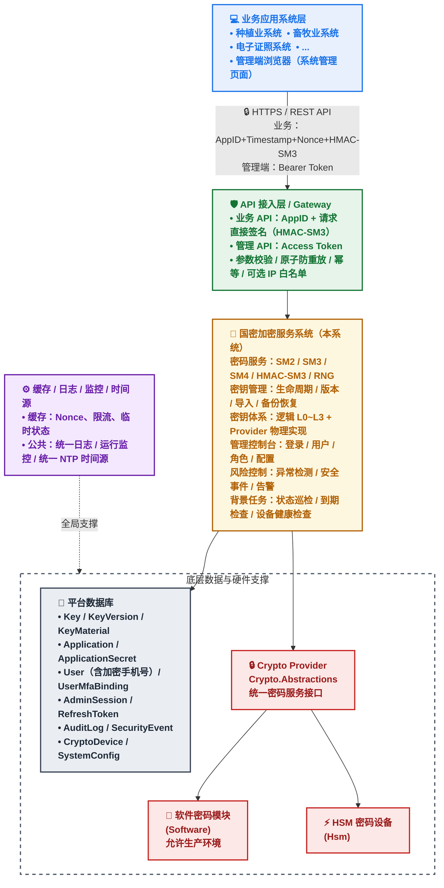

# C-架构非功能与流程提取

> 来源：`docs/需求说明文档.md`（《国密加密服务系统软件需求规格说明书》V2.9）
> 提取范围：第 2 章（354–630）、第 4 章（2135–2415）、第 5 章（2416–2575）、第 8 章（3699–3963）、第 10 章（3984–4207）、第 11 章（4208–4682）、第 12 章（4683–4732）、第 13 章（4733–5000）、附录 A（5001–5397）
> 用途：供架构师编写详细设计文档使用。常量、阈值、错误码、指标值逐字保留；原文未明确的写「原文未明确」。
> 说明：本文档为**提取件**，不作为需求权威源；如有冲突以源文件 V2.9 为准。

---

## 目录

- [1. 系统总体架构（第 2 章）](#1-系统总体架构第-2-章)
- [2. 非功能需求（第 4 章）](#2-非功能需求第-4-章)
- [3. 运行环境（第 5 章）](#3-运行环境第-5-章)
- [4. 安全需求（第 8 章）](#4-安全需求第-8-章)
- [5. 测试与验收需求（第 10 章，清单级）](#5-测试与验收需求第-10-章清单级)
- [6. 典型业务流程（第 11 章）](#6-典型业务流程第-11-章)
- [7. 责任边界矩阵（第 12 章）](#7-责任边界矩阵第-12-章)
- [8. 需求编号与追踪矩阵（第 13 章）](#8-需求编号与追踪矩阵第-13-章)
- [9. 附录 A：需求修正与补充说明](#9-附录-a需求修正与补充说明)

---

# 1. 系统总体架构（第 2 章）

## 1.1 架构概览（2.1）— mermaid 源码照抄



## 1.2 系统分层（2.2）— 逐行照抄

| 层次 | 主要职责 |
| --- | --- |
| API 接入层 | API 路由、认证、原子防重放、参数校验、幂等、可选 IP 白名单 |
| 身份认证层 | 业务 API：AppID + HMAC-SM3 请求签名；管理端：用户名+密码+Token（MFA 全局强制，默认 REQUIRED） |
| 权限控制层 | 资源归属校验（AppId 与 KeyId 一致性）；KeyType 兼容性校验；管理端 RBAC + 三员互斥 |
| 密码服务层 | SM2、SM3、SM4、HMAC、RNG、密码模块自检 |
| 密钥管理层 | 密钥生命周期、版本、导入、备份、恢复、逻辑密钥分层管理 |
| 密码设备适配层 | HSM / 软件密码模块统一适配（Crypto Provider 抽象） |
| 数据层 | 密钥元数据、应用数据、审计数据、安全事件、配置数据（含加密手机号） |
| 安全管理层 | 风险检测、告警、安全事件 |
| 运维管理层 | 配置、监控、健康检查、统一时间源 |

## 1.3 模块划分（2.3）— 逐行照抄

| 模块 | 职责 |
| --- | --- |
| API 接口模块 | 提供统一 REST API |
| 请求签名模块 | 业务 API 请求签名生成/校验（HMAC-SM3），原子防重放 |
| 身份认证模块 | 管理端用户名密码认证、Token 签发与校验、AdminSession、MFA（全局强制，MFA_POLICY_MODE 控制） |
| 资源归属校验模块 | AppId 与 KeyId 一致性校验；KeyType 兼容性校验 |
| 密码服务模块 | 执行 SM2/SM3/SM4/HMAC/RNG、密码模块自检 |
| 密钥管理模块 | 管理密钥生命周期、逻辑密钥分层、KeyMaterial |
| 密钥版本模块 | 管理历史密钥版本 |
| 密钥备份恢复模块 | 负责备份、恢复及验证（按 Provider 分别定义） |
| 密码设备模块 | HSM / 软件密码模块管理（Crypto Provider 统一适配） |
| 审计模块 | 全量审计、审计完整性链、外部锚点、集中外发 |
| 风险控制模块 | 异常调用检测、集中告警外发 |
| 安全事件模块 | 告警、处置、关闭 |
| 管理控制台 | 平台管理 UI |
| 配置管理模块 | 平台安全策略配置 |
| 监控模块 | 服务状态及运行指标 |
| 数据完整性模块 | IntegrityValue 生成、验证、巡检 |
| 告警模块 | 短信/Webhook/站内通知，含手机号解密后发送 |

## 1.4 系统边界（2.4）

### 1.4.1 业务系统不得直接访问的密钥对象（对内安全边界）

- SM2 私钥；
- SM4 密钥；
- HMAC 密钥；
- Root Key；
- KEK-Unlock / KEK-Runtime / KEK-Backup；
- HSM 内部密钥；
- 密钥加密密钥。

> 业务系统通过 **KeyId** 请求密码操作。

### 1.4.2 本系统负责（对内职责）

- 密码算法服务（SM2/SM3/SM4/HMAC-SM3/RNG）；
- 密钥全生命周期管理、版本管理、导入、备份、恢复与恢复验证；
- 逻辑密钥分层管理（L0～L3）；
- 密码设备（HSM / 软件密码模块）适配与管理；
- 业务 API 请求签名认证与资源归属校验；
- 管理端身份认证、Token 签发与访问控制；
- 用户手机号加密存储与短信告警；
- 审计日志、审计完整性链、外部锚点与审计归档；
- 风险检测、安全事件与告警；
- 系统配置管理、健康检查与统一时间源接入；
- 数据库关键字段完整性校验（IntegrityValue）；
- 信创环境适配。

### 1.4.3 本系统不负责（对外职责边界）

- 业务系统自身的角色权限、数据权限、业务流程权限与业务规则；
- 业务数据的分类分级与业务加密策略制定；
- 业务系统的用户身份管理、用户登录与业务会话管理；
- 业务系统密钥用途的业务约束（平台不校验 KeyUsage，由三方系统自行决定）；
- HSM 设备自身的固件、硬件可靠性与厂商级运维；
- 缓存、数据库、操作系统、网络等基础设施的运维。

## 1.5 密码服务处理模型（2.5）

### 1.5.1 标准密码操作流程（业务 API）— 源码照抄

```text
请求
 ↓
HTTPS
 ↓
Timestamp 基础校验
 ↓
获取 AppSecret（解密 SecretCiphertext，或从受限内存短缓存获取）
 ↓
验证 HMAC-SM3 签名
 ↓
HMAC 成功后原子写入 Nonce（SET NX + DB UNIQUE）
 ↓
Nonce 已存在 → 10006
 ↓
资源归属校验（AppId 与 KeyId 一致性）
 ↓
KeyType 兼容性校验
 ↓
Key 状态检查（按 3.2.22 运算级规则）
 ↓
密钥完整性值验证
 ↓
密码服务
 ↓
Crypto Provider
 ↓
HSM / 软件密码模块
 ↓
返回密文 / 签名 / 摘要
 ↓
写入审计
```

### 1.5.2 管理端 API 调用流程 — 源码照抄

```text
管理端登录（用户名 + 密码 + 验证码 + MFA 第二因素，全局强制）
 ↓
签发 Access Token（空闲 15 分钟 / 绝对 24 小时）
 ↓
携带 Token 调用管理 API 或业务 API（用于后台测试）
 ↓
Token 校验 → AdminSession 查询 → LastAccessAt 校验
 ↓
管理端 RBAC + 三员互斥校验
 ↓
（对业务 API）资源归属校验（按 6.5 规则）+ 完整性值验证
 ↓
执行操作
 ↓
写入审计
```

## 1.6 密码设备适配模型（2.6）

### 1.6.1 Crypto Provider 接口（源码照抄）

```csharp
public interface ICryptoProvider
{
    string ProviderId { get; }
    KeyStorageMode StorageMode { get; }   // Software / Hsm
    ProviderCapabilities Capabilities { get; }

    Task<KeyReference> GenerateKeyAsync(...);
    Task<DestroyKeyResult> DestroyKeyAsync(KeyReference keyRef);
    Task<CryptoResult> EncryptAsync(...);
    Task<CryptoResult> DecryptAsync(...);
    Task<CryptoResult> SignAsync(...);
    Task<CryptoResult> VerifyAsync(...);
    Task<CryptoResult> HashAsync(...);
    Task<CryptoResult> MacAsync(...);
    Task<CryptoResult> GenerateRandomAsync(...);
    Task<SelfTestResult> SelfTestAsync(...);
}

// 非所有密码设备都必须实现以下扩展能力；由 ProviderCapabilities 与可选接口共同决定。
public interface IKeyWrappingProvider
{
    Task<WrappedKey> WrapKeyAsync(...);
    Task<KeyReference> UnwrapKeyAsync(...);
}

public interface IKeyBackupProvider
{
    Task<BackupResult> BackupAsync(...);
}

public interface IKeyRestoreProvider
{
    Task<RestoreResult> RestoreAsync(...);
}

public interface IKeyImportProvider { /* Provider-specific import contract */ }
public interface IKeyExportProvider { /* Provider-specific export contract */ }
public interface IRootKeyProvider { /* Root Key / rotation / rewrap contract */ }
```

### 1.6.2 DestroyKeyResult 语义（原文）

`DestroyKeyAsync` 必须返回明确的 `DestroyKeyResult`，包含：

1. 是否成功；
2. 在线材料是否已销毁；
3. 归档材料保留标记；
4. 失败原因（当 Provider 不支持或设备异常时）。

> 具体 DTO 在详细设计阶段确定，但结果语义必须在接口契约中保留。

### 1.6.3 ProviderCapabilities（逐行照抄）

| 能力 | 说明 |
| --- | --- |
| CanWrapKey | 是否支持密钥 Wrap |
| CanUnwrapKey | 是否支持密钥 Unwrap |
| CanBackupKey | 是否支持 Provider 级密钥备份 |
| CanRestoreKey | 是否支持 Provider 级密钥恢复 |
| CanImportKey | 是否支持密钥导入 |
| CanExportKey | 是否支持密钥导出；HSM 通常为 false |
| SupportsNonExportableKey | 是否支持不可导出密钥 |
| CanRotateRootKey | 是否支持平台逻辑 Root Key 轮换 |
| CanRewrapKey | 是否支持密钥重包裹/重新保护 |
| SupportsKeyIdentityVerification | 是否支持 Key Identity / KCV / Fingerprint 校验 |

**强制约束**：平台不得因为某 Provider 不支持某项可选能力而绕过密码设备安全边界；不支持的能力必须返回明确的 `NotSupported` 结果，并记录审计。

### 1.6.4 最小能力准入集（V2.8，审阅 M-03）

平台自身密钥体系（L2 KEK-Runtime Wrap L3 Data Key；Software 模式的 WrappedMaterial 存储）硬依赖 Wrap/Unwrap 能力：

1. **CanWrapKey / CanUnwrapKey 为强制准入项**：Provider 接入（注册/启用）时必须声明并实测通过，否则不得准入；
2. **HSM Provider** 的 Wrap/Unwrap 必须在 HSM 内部完成，密钥明文不得出设备；
3. **SoftwareCryptoProvider（软件密码模块）必须实现平台核心所需的 Wrap/Unwrap 能力**；Backup/Restore、Import/Export、Root Key Rotation/Rewrap、Key Identity 校验等能力按 ProviderCapabilities 声明，不得假定所有 Provider 均支持；
4. Backup/Restore、Import/Export、RotateRootKey、RewrapKey 等为 Provider 可选能力：缺失时对应功能返回明确的 NotSupported 结果并在管理控制台明示，不得静默失败；
5. 准入校验在 Provider 注册与启用流程中强制执行，校验结果记录审计。

### 1.6.5 Provider 备份/恢复/导入/导出语义（V2.9 补充）

1. 平台接口层提供统一入口，但内部按 ProviderCapabilities 分派；
2. HSM 场景下，密钥材料备份必须由 HSM Vendor Backup / Security Domain Backup 完成；平台仅保存 `ProviderReference`、`ProviderKeyIdentity` 与 `BackupRecord` 元数据；
3. 平台不将 HSM Vendor Backup 抽象为通用 API；如 Provider 不支持 CanBackupKey，`/api/v1/keys/{keyId}/backup` 返回 `NotSupported`；
4. 导入/导出接口同理，HSM 通常 `CanExportKey=false`，导入必须走 Provider 特定安全导入机制；
5. 恢复后必须执行 `KeyId → ProviderKeyIdentity → ProviderReference` 身份校验，校验失败视为恢复失败并告警。

### 1.6.6 实现方式与部署模式

- **SoftwareCryptoProvider（软件密码模块）**：模拟 HSM 行为，提供与 HSM 完全一致的接口；允许用于生产环境；
- **HsmCryptoProvider（HSM 密码设备）**：基于硬件安全模块的实现，生产环境优先使用。

**部署模式互斥**：平台仅支持 Software 或 HSM 一种部署模式，不支持混合部署。

> 具体部署方式在详细设计阶段根据实际密码设备与项目验收要求最终确认。

---

# 2. 非功能需求（第 4 章）

## 2.1 性能需求（4.1）

### 2.1.1 性能测试前提条件（4.1.1）

- 测试环境为信创国产化环境；
- 网络条件为内网千兆或以上；
- 测试数据块大小、并发线程数、CPU、内存、软件密码模块/HSM 配置必须记录；
- 性能指标分为包含数据库与审计耗时、不包含数据库与审计耗时两类分别测试；
- 性能指标分为包含网络耗时、不包含网络耗时两类分别测试；
- SM2、SM3、SM4 的软件密码模块性能与 HSM 性能应分别测试。

### 2.1.2 密码服务性能指标（4.1.2，V2.9 补充 HSM 场景签名校验）

**需求硬指标（必须验收）**：

| 指标 | 要求 | 口径说明 | 需求编号 |
| --- | --- | --- | --- |
| 请求签名校验 P95（Software） | ≤ 10ms | 不含网络、不含 DB 与审计；含 AppSecret 解密与 HMAC-SM3 校验 | NF-PERF-009 |
| 请求签名校验 P95（HSM） | ≤ 30ms | 不含网络、不含 DB 与审计；含 HSM 侧 AppSecret 解封/解密与 HMAC-SM3 校验；允许受限内存短缓存 | NF-PERF-009A |
| 应用签名失败率（正确签名） | 0 | 正确签名必须全部通过；不含重放、超窗、Nonce 重复、篡改场景 | NF-PERF-010 |

**NF-PERF-010 口径（V2.9 钉死）**：统计"应用签名失败率"时，仅统计合法请求（AppId 有效、Timestamp 在窗口内、Nonce 首次出现、Body/Query/Header 未被篡改）的签名校验失败；重放、超窗、Nonce 重复、篡改场景不计入该指标。

**环境基准指标（指定型号、硬件、条件下达到基准值）**：

| 指标 | 要求 | 口径说明 | 需求编号 |
| --- | --- | --- | --- |
| SM4 吞吐量 | 单节点不低于 50 MB/s | 软件密码模块；不含网络、不含 DB 与审计 | NF-PERF-001 |
| SM3 吞吐量 | 单节点不低于 100 MB/s | 软件密码模块；不含网络、不含 DB 与审计 | NF-PERF-002 |
| SM2 签名/验签（软件） | 单节点不低于 500 次/s | 软件密码模块；不含网络、不含 DB 与审计 | NF-PERF-003 |
| SM2 签名/验签（HSM） | 单节点不低于 200 次/s | HSM；不含网络、不含 DB 与审计；用于本项目指定 HSM 型号的性能基线验收 | NF-PERF-003A |
| API P99 | 不超过 50ms（不含网络） | 含密码运算时间；不含网络；不含 DB 与审计；软件密码模块场景 | NF-PERF-004 |
| API P99（HSM 场景） | 不超过 100ms（不含网络） | 含密码运算时间；不含网络；不含 DB 与审计；HSM 场景平台需求基线 | NF-PERF-004A |

**说明**：

- **需求硬指标**必须验收；**环境基准指标**在指定测试条件下应达到，如实际密码设备无法达到，应更换设备或调整部署方案，而非降低指标；
- 涉及数据库与审计的端到端性能指标见 4.1.6；
- **HSM 场景的签名校验性能必须单独测试**，并形成《密码设备性能基线表》，记录 HSM 型号、固件、Provider 版本、并发、数据块大小、测试环境和实测结果。

### 2.1.3 控制面性能指标（4.1.3）

| 指标 | 要求 | 需求编号 |
| --- | --- | --- |
| 密钥生成 P95 | ≤200ms | NF-PERF-005 |
| 密钥查询 P95 | ≤200ms | NF-PERF-006 |
| 密钥轮换 P95 | ≤500ms | NF-PERF-007 |
| 密钥销毁 P95 | ≤500ms | NF-PERF-008 |

### 2.1.4 接口大小约束（4.1.4）

| 指标 | 默认建议值 | 需求编号 |
| --- | --- | --- |
| 单次请求最大数据量 | 10MB | NF-PERF-014 |
| 单应用容量基准 | 10000 | NF-PERF-015 |
| 平台容量基准 | 1000000 | NF-PERF-016 |

**说明**：

- NF-PERF-014 为接口契约，与 DoS 防护无关，保留；
- NF-PERF-015、NF-PERF-016 为**容量基准**（非业务限制），表示平台应支持的量级；
- 原 NF-PERF-011~013（单应用 QPS、全局 QPS、单应用并发）已在 V2.5 删除；DoS 防护通过防火墙控制；
- **随机数单次最大输出长度独立定义（V2.9 修订）**，见 3.1.5，不复用 NF-PERF-014。

### 2.1.5 并发能力（4.1.5）

认证与密码服务接口应支持：**≥500 并发请求**。具体容量通过压力测试进行验证。

### 2.1.6 端到端 API 性能指标（4.1.6，V2.7 修订）

真实生产请求的性能表现应包括：认证 + Nonce 校验 + DB + IntegrityValue + Crypto + Audit。

| 指标 | 要求 | 口径说明 | 需求编号 |
| --- | --- | --- | --- |
| SM4 API E2E P95 | ≤ 100ms | 含认证、Nonce、DB、IntegrityValue、Crypto、Audit；不含网络 | NF-PERF-017 |
| SM4 API E2E P99 | ≤ 200ms | 同上 | NF-PERF-018 |
| SM2 Sign API E2E P95 | ≤ 150ms | 同上 | NF-PERF-019 |
| SM2 Sign API E2E P99 | ≤ 300ms | 同上 | NF-PERF-020 |
| 密钥查询 API E2E P95 | ≤ 300ms | 含认证、DB、IntegrityValue；不含网络 | NF-PERF-021 |
| 密钥查询 API E2E P99 | ≤ 500ms | 同上 | NF-PERF-022 |

**说明**：

- E2E 指标为最终用户感知性能，必须验收；
- 上述数值属于平台需求基线，详细设计不得在测试完成后反向修改需求；
- 实际 HSM 型号性能应在上线前形成《密码设备性能基线表》，记录 HSM 型号、固件、Provider 版本、并发、数据块大小、测试环境和实测结果；如设备实测低于平台需求基线，应通过设备选型、集群扩展或部署架构优化解决，不能以"测试后调整需求"方式降低验收标准；
- 若项目合同/招标文件针对特定 HSM 另有更高指标，以更高指标为准；
- **HSM 场景下 E2E 指标应单独测试并形成基线**，作为部署实例性能基线的一部分。

## 2.2 可用性需求（4.2）

| 编号 | 需求 |
| --- | --- |
| NF-AVAIL-001 | 系统可用性 ≥99.95% |
| NF-AVAIL-002 | RTO ≤30 分钟 |
| NF-AVAIL-003 | RPO ≤5 分钟 |
| NF-AVAIL-004 | 应用节点故障不影响服务连续性 |
| NF-AVAIL-005 | API 节点故障不影响服务连续性 |
| NF-AVAIL-006 | 缓存故障不影响核心密码服务连续性；缓存不可用时按降级策略处理 |
| NF-AVAIL-007 | 数据库必须支持项目选定数据库产品的高可用架构 |
| NF-AVAIL-008 | 密码设备支持主备配置与故障切换 |
| NF-AVAIL-009 | 网络故障与节点故障应纳入高可用设计范围 |
| NF-AVAIL-010 | 密码设备不可用时，拒绝密码运算 |

高可用必须覆盖：应用节点故障、API 节点故障、缓存故障、数据库故障、HSM 故障、网络故障。

## 2.3 灾备需求（4.3）

### 2.3.1 部署形态与 HA/DR 边界界定（4.3.1）

| 概念 | 覆盖范围 | 本期范围 | 验收标准 |
| --- | --- | --- | --- |
| HA（高可用） | 节点级故障：应用节点、API 节点、缓存节点、数据库节点、HSM 设备、网络 | 本期建设 | 节点故障时服务不中断；RTO/RPO 见 4.2 |
| DR（灾备） | 机房级故障：单机房断电、网络中断、机房不可用 | 本期不包含跨机房灾备 | 本期仅定义 DR 需求；跨机房灾备作为后续扩展 |

**本期部署形态**：

- 单机房多节点部署；
- 应用、数据库、缓存、HSM 均采用节点级冗余；
- 单机房内节点故障通过 HA 机制恢复；
- 机房级故障不纳入本期恢复范围，但数据备份与密钥备份支持异地存放。

**DR 需求（本期定义，不纳入本期验收）**：

| 编号 | 需求 |
| --- | --- |
| NF-DR-001 | 明确 RPO 和 RTO 目标（引用 4.2 NF-AVAIL-002/003），灾备实现方案在详细设计阶段确认 |
| NF-DR-002 | 灾备范围至少包括：Key、KeyVersion、KeyMaterial、Application、ApplicationSecret、User、UserMfaBinding、Role、Permission、AdminSession、RefreshToken、AuditLog、SecurityEvent、AlertRule、CryptoDevice、SystemConfig、BackupRecord |
| NF-DR-003 | 密钥相关数据的灾备必须保证加密与完整性保护 |
| NF-DR-004 | 密码设备配置与主备关系应可恢复（Software：数据库+主密码；HSM：数据库+HSM Vendor Backup） |
| NF-DR-005 | 后台巡检任务状态应可恢复 |
| NF-DR-006 | 灾备演练应定期进行，记录 RPO/RTO 实测值 |
| NF-DR-007 | 元数据与密钥备份数据应保证一致性 |
| NF-DR-008 | 备份数据应支持异地存放，作为跨机房灾备的基础（本期建设内容；异地恢复演练不纳入本期验收） |

建议 RPO/RTO 目标：

- 密钥元数据 RPO ≤5 分钟，RTO ≤30 分钟；
- 审计日志 RPO ≤5 分钟，RTO ≤30 分钟。

## 2.4 可扩展性需求（4.4）

支持应用节点水平扩展、密码服务水平扩展、HSM 节点扩展、数据库扩展、审计存储扩展、密码设备适配扩展、信创组件替换扩展。容量应支持至少当前业务量的 **3～5 倍**扩展。

## 2.5 可维护性需求（4.5）

要求：健康检查、运行监控、日志统一输出、配置中心、告警、密码设备状态监控、审计查询、故障诊断、密码服务调用监控。

**监控指标清单（逐行照抄）**：

| 类别 | 指标 | 采集方式 |
| --- | --- | --- |
| 服务 | API QPS、P50/P95/P99、错误率 | Prometheus / 平台监控 |
| 服务 | 活跃连接数、线程池状态 | 平台监控 |
| 密码服务 | 各算法调用量、成功率、平均耗时 | 平台监控 |
| 密码服务 | HSM 连接状态、密码运算队列长度 | 平台监控 |
| 密钥 | 密钥总量、各状态数量、轮换次数 | 数据库统计 + 平台监控 |
| 审计 | 审计写入速率、哈希链校验点、外发成功率 | 平台监控 |
| 风险 | 安全事件数量、按等级分布 | 平台监控 |
| 资源 | CPU、内存、磁盘、网络 | 系统监控 |
| 数据库 | 连接数、慢查询、锁等待 | 数据库监控 |
| 缓存 | 命中率、连接数、内存使用 | 缓存监控 |

**监控接入方式**：优先采用 Prometheus 指标暴露（`/metrics` 端点）；管理控制台提供监控面板；重大指标异常触发告警（见 3.5.5）。

## 2.6 兼容性需求（4.6）

- API：RESTful、JSON、UTF-8、HTTPS、Base64。
- SDK 是否纳入本期交付范围，应根据项目实际建设范围确定。若第一期以 REST API 为主，则 OpenAPI 规范优先于 SDK 开发。
- 密码设备：支持软件密码模块与 HSM 两类实现，通过统一 Crypto Provider 接口适配。软件密码模块模拟 HSM 行为，允许生产环境使用。**部署模式互斥，不支持混合部署**。

## 2.7 安全性需求（4.7）

必须满足：

- TLS（优先国密 SSL/TLS）；
- 请求直接签名（HMAC-SM3）；
- 管理端身份认证与 Token；
- 资源归属校验；
- KeyType 兼容性校验；
- 原子防重放（Timestamp + Nonce）；
- 审计；
- 日志防篡改（含外部锚点）；
- 敏感数据脱敏；
- 手机号加密存储（SM4-GCM + UserDataDEK）；
- AppSecret 加密存储（SecretCiphertext）；
- 数据备份加密；
- 数据库最小权限；
- 密钥材料安全擦除；
- 数据库关键字段完整性校验（IntegrityValue）。

## 2.8 容量需求（4.8）

| 指标 | 量级假设（待甲方确认） |
| --- | --- |
| 最大应用数量 | 100～500 |
| 平台密钥容量基准 | 100 万（见 NF-PERF-016） |
| 单应用密钥容量基准 | 1 万（见 NF-PERF-015） |
| 每日 API 调用量 | 100 万～1000 万 |
| 单请求最大数据量 | 10MB（见 NF-PERF-014） |
| 随机数单次最大输出 | 默认 64KB，可配置上限 1MB（V2.9 新增） |
| 审计日志最大增长量 | 每日 1GB～10GB |
| 备份容量 | 按密钥数量与审计量推算，详细设计确定 |

## 2.9 数据膨胀治理需求（4.9）

| 编号 | 需求 |
| --- | --- |
| NF-DATA-001 | 审计日志表按时间分区，建议按月分区 |
| NF-DATA-002 | 超过保留期的审计日志归档到独立存储 |
| NF-DATA-003 | 已销毁密钥的元数据记录按策略归档，保留必要追溯信息 |
| NF-DATA-004 | 安全事件与告警记录按时间分区或归档 |
| NF-DATA-005 | Token、AdminSession、RefreshToken 与临时认证数据过期后按策略清理 |
| NF-DATA-006 | 数据分区和归档策略可配置 |
| NF-DATA-007 | 归档数据支持按需恢复和查询 |
| NF-DATA-008 | 关键数据表应增加 IntegrityValue 字段，对影响安全与业务正确性的关键字段进行校验；校验应避免全表全字段扫描，采用按需校验与定期抽查结合 |

## 2.10 备份保留周期需求（4.10）

| 编号 | 需求 |
| --- | --- |
| NF-BAK-001 | 运行备份保留周期不少于 90 天 |
| NF-BAK-002 | 审计日志备份保留周期不少于 6 个月，建议 3 年 |
| NF-BAK-003 | 归档备份应长期保留，用于合规追溯与历史解密；销毁后备份处置见 3.2.23 |
| NF-BAK-004 | 备份保留周期可配置 |
| NF-BAK-005 | KEK-Backup 纳入 3.11 密钥管理范围 |

## 2.11 时间同步需求（4.11）

平台所有节点必须使用统一时间源。

时间同步用于：管理端 Token exp 与空闲超时判定、请求签名 Timestamp 校验、密钥过期、审计时间、安全事件时间、日志哈希链、备份、证书有效期。

要求：

- 应配置统一 NTP/时间同步服务；
- 时间源不可用时，涉及时间判定的操作应按安全策略拒绝或告警；
- 请求签名时间窗口（**±3 分钟**）依赖统一时间源，时间源不可用时应拒绝签名请求。

## 2.12 合规性需求（4.12）

| 编号 | 需求 |
| --- | --- |
| NF-CMP-001 | 密码算法应使用国家密码管理部门认可的 SM2/SM3/SM4/HMAC-SM3 算法，遵循 GM/T 0002/0003/0004 |
| NF-CMP-002 | 密钥全生命周期应满足密评对密钥生成、存储、使用、更新、归档、销毁的要求 |
| NF-CMP-003 | 审计日志留存时间不少于 6 个月 |
| NF-CMP-004 | 审计日志必须具备完整性保护，并支持完整性验证 |
| NF-CMP-005 | 系统投入运行前应完成商用密码应用安全性评估 |
| NF-CMP-006 | 本系统密码能力按照 GB/T 39786-2021 相关要求进行设计，不提供国密能力降级机制；最终符合性以项目实际选型及正式商用密码应用安全性评估结果为准 |
| NF-CMP-007 | 涉及密码运算的接口应记录完整审计并可追溯 |
| NF-CMP-008 | 本系统应支持与安全管理中心集中管控对接，提供集中审计、集中告警、集中配置接口 |
| NF-CMP-009 | 审计日志应支持外发至集中审计平台，外发通道应加密并支持断点续传 |
| NF-CMP-010 | 业务与管理接口应支持 GB/T 38636 国密 TLS，优先使用 SM2 证书、SM4-GCM、SM3；生产环境是否强制启用国密 TLS 由部署方案与安全策略决定 |
| NF-CMP-011 | 密码设备（HSM）应核查商用密码产品认证证书，证书过期应告警并禁止使用 |
| NF-CMP-013 | 系统应支持管理用户 MFA 并支持强制策略配置：通过 MFA_POLICY_MODE（OPTIONAL / REQUIRED）控制，默认 REQUIRED，生产冻结 REQUIRED；策略变更需权限校验、二次确认并审计 |
| NF-CMP-014 | 业务 API 认证应采用请求直接签名（HMAC-SM3），AppSecret 不在网络传输；Timestamp 窗口 ±3 分钟；Nonce 原子防重放；签名失败返回 10004/10005/10006 |
| NF-CMP-015 | 软件密码模块允许用于生产环境；Root Key 采用"主密码 + KDF 派生 + 操作系统安全存储"双重保护；密评前需与测评机构确认软件模块合规性 |
| NF-CMP-016 | 数据库关键字段完整性保护采用密钥化完整性值（HMAC-SM3 + IntegrityKey），防御具有数据库写权限的篡改者 |
| NF-CMP-017 | AppSecret 原文不得持久化保存；平台以 SecretCiphertext（由 KEK-Runtime 保护）形式保存，仅在请求签名验证的短生命周期内解密使用；允许受限内存短缓存（V2.9 补充） |

> 注：**NF-CMP-012 在源文件中缺号/未列出**（原文编号从 NF-CMP-011 直接跳到 NF-CMP-013）；A.8.2 清单同样无 NF-CMP-012。

## 2.13 信创需求（4.13）

| 编号 | 需求 |
| --- | --- |
| NF-XC-001 | 生产环境应部署在信创国产化环境中 |
| NF-XC-002 | 优先选用国产 CPU、国产操作系统、国产数据库与国产中间件 |
| NF-XC-003 | 密码设备应选用国产商用密码设备（HSM 场景） |
| NF-XC-004 | 信创组件选型应通过项目兼容性测试验证 |
| NF-XC-005 | 应形成完整的信创兼容性矩阵 |
| NF-XC-006 | 非核心组件不得成为密码服务单点故障 |
| NF-XC-007 | 信创组件具体型号与版本应在项目招标后冻结，并记录于兼容性矩阵 |
| NF-XC-008 | 信创兼容性矩阵应经项目组评审确认 |
| NF-XC-009 | 应选用国产密码库并完成适配验证 |
| NF-XC-010 | 密码设备驱动应由厂商提供信创版本，并纳入版本管理 |

---

# 3. 运行环境（第 5 章）

## 3.1 技术栈（5.1）

| 类别 | 技术选型 | 信创适配说明 |
| --- | --- | --- |
| 开发语言 | C# / .NET 10 | 需通过项目兼容性测试验证 |
| 运行平台 | .NET 10 | 需验证国产 OS 与 CPU 支持 |
| Web 框架 | ASP.NET Core 10 | 信创环境兼容 |
| API | RESTful API | 协议无关 |
| ORM | Entity Framework Core 10 | 需验证 EF Core Provider 可用性 |
| 数据库（P0） | 项目指定国产数据库 | 唯一 P0 数据库 |
| 数据库（P1） | 达梦 DM8 / 人大金仓 KingbaseES / 南大通用 GBase | 按项目需要扩展 |
| 缓存 | 东方通 TongRDS / 达梦 CDM / 宝兰德分布式缓存 | 兼容 Redis 协议；用于 Nonce、限流、临时状态 |
| 密码运算 | Crypto Provider 抽象（Software / HSM） | **部署模式互斥，不支持混合部署** |
| 密码设备 | HSM / 软件密码模块 | 需通过项目兼容性测试验证 |
| 业务认证 | AppID + 请求直接签名（HMAC-SM3） | 无外部依赖；AppSecret 不在网络传输 |
| 管理端认证 | 用户名 + 密码 + Access Token + AdminSession；MFA 全局强制（默认 REQUIRED） | 无外部依赖 |
| 手机号加密 | UserDataDEK（由 KEK-Runtime 保护） | 用户数据加密密钥 |
| AppSecret 加密 | SM4-GCM（由 KEK-Runtime 保护） | SecretCiphertext |
| 完整性保护 | HMAC-SM3 + IntegrityKey | IntegrityValue |
| 日志 | Serilog / 平台统一日志体系 | 信创环境兼容 |
| API 文档 | OpenAPI / Scalar | 信创环境兼容 |
| 时间同步 | 统一 NTP 时间源 | 信创环境兼容 |
| 开发测试 | 支持 Docker | 信创环境建议国产容器平台 |
| 生产部署 | 按平台信创部署规范 | 麒麟/统信 + 国产 CPU |
| 编码 | UTF-8 | 通用 |

## 3.2 硬件环境（5.2）

| 环境 | 最低配置 | 推荐配置 | 信创要求 |
| --- | --- | --- | --- |
| 应用服务器 | 4C/8GB | 8C/16GB | 海光/鲲鹏/飞腾/龙芯 |
| 数据库服务器 | 4C/16GB | 8C/32GB | 海光/鲲鹏/飞腾/龙芯 |
| HSM | 支持国密 | 双机/集群 | 国产商用密码设备 |

> 实际生产配置应根据性能测试结果调整。

## 3.3 操作系统（5.3）

支持：银河麒麟、统信 UOS、中标麒麟、Loongnix（龙芯平台）、openEuler、其他项目指定国产操作系统。具体版本必须形成兼容性矩阵。

## 3.4 数据库（5.4）

- **P0**：项目指定国产数据库。
- **P1**：达梦 DM8、人大金仓 KingbaseES、南大通用 GBase、MySQL/PostgreSQL。
- 详细设计阶段应明确：数据库版本、字符集、排序规则、驱动版本、EF Core Provider 版本、国产数据库兼容差异。

要求：

- 生产应用不得使用数据库超级账号；
- 密钥元数据必须具备完整性保护字段（IntegrityValue）；
- 关键数据表必须增加 IntegrityValue 字段，详见 7.17。

## 3.5 缓存及中间件（5.5）

可采用：

- 信创环境下优先选用东方通 TongRDS、达梦 CDM、宝兰德分布式缓存等兼容 Redis 协议的国产产品；
- 非信创环境可使用 Redis；
- 消息队列；
- 日志平台。

要求：

- 缓存不作为密钥材料的存储位置；
- 非核心组件不得成为密码服务单点故障；
- 缓存用于存储 Nonce、撤销列表、临时状态、请求签名 Nonce 等临时数据时，应有持久化或降级策略；
- **请求签名 Nonce 存储于缓存（TongRDS/CDM）+ 数据库短期回退，TTL 不小于时间窗口跨度的 2 倍（默认 6 分钟，窗口 ±3 分钟，V2.8 调整）；数据库侧使用 UNIQUE(AppId, Nonce) 约束**；
- **Nonce 双写一致性以数据库 UNIQUE 约束为最终仲裁（V2.9 补充）**，详见 6.2.4/6.10.3；
- 缓存不得存储明文手机号、AppSecret 明文。

## 3.6 密码设备（5.6）

### 3.6.1 HSM 密码设备（5.6.1）

如采用 HSM，必须明确：

- 厂商；
- 型号；
- 国密算法支持情况（SM2 / SM3 / SM4 / HMAC-SM3）；
- 随机数能力；
- 密钥生成能力；
- 密钥导入导出能力；
- Root of Trust 保护能力；
- HA 能力；
- 国产化适配情况；
- 商用密码产品认证情况；
- Vendor Backup 机制。

密码设备必须核查商用密码产品认证证书。设备注册时应登记证书编号、认证机构、有效期、厂商、型号。平台应定期检查证书有效性，过期前告警，过期后禁止该设备承载密码运算（临期宽限流程见 3.7）。

### 3.6.2 软件密码模块（5.6.2）

软件密码模块（SoftwareCryptoProvider）模拟 HSM 行为，提供与 HSM 完全一致的 Crypto Provider 接口，**允许用于生产环境**（无 HSM 支持场景）。

软件密码模块必须明确：

- 版本；
- 支持的国密算法（SM2/SM3/SM4/HMAC-SM3）；
- 随机数来源（操作系统 CSPRNG）；
- 密钥生成能力；
- 密钥导入导出能力；
- Root Key 管理方式（见 3.11.3）；
- 主密码 + KDF 派生参数；
- 操作系统安全存储方案（DPAPI / Keyring / TPM）；
- 性能指标；
- 国产化适配情况。

**软件密码模块合规说明**：软件密码模块的密评合规性最终由测评机构确认，**密评前需与测评机构确认软件模块合规性**。

**主密码丢失恢复说明**：见 3.11.3 F-RK-013。

### 3.6.3 部署模式互斥（5.6.3）

平台仅支持 **Software Provider** 或 **HSM Provider** 一种部署模式，不支持混合部署。切换部署模式需完整迁移密钥体系，需安全管理员审批。

## 3.7 网络环境（5.7）

- API 使用 HTTPS；
- 管理接口与业务接口隔离；
- 密码设备网络独立（HSM 场景）；
- 数据库不直接暴露公网；
- 管理网络限制访问来源；
- IP 白名单可选（默认关闭）；
- 配置统一 NTP 时间源；
- 业务与管理接口应支持国密 TLS；
- DoS 防护通过防火墙控制，不在应用层实现业务配额。

## 3.8 信创兼容性矩阵（5.8）

| 类型 | 候选 | 验证方式 |
| --- | --- | --- |
| CPU | 海光/鲲鹏/飞腾/龙芯 | 项目兼容性测试 |
| OS | 麒麟/统信/UOS/Loongnix | 项目兼容性测试 |
| DB | 项目指定 P0 数据库 | EF Core Provider 验证 |
| .NET | 实际运行时版本 | 项目兼容性测试 |
| 缓存 | TongRDS/CDM/宝兰德 | 项目兼容性测试 |
| HSM | 厂商/型号 | 项目兼容性测试 + 商用密码产品认证核查 |
| 软件密码模块 | 版本/来源 | 项目兼容性测试 + 密评机构确认 |
| 密码库 | 实际密码组件 | 项目兼容性测试 |
| 浏览器 | Chrome/Edge/国产浏览器 | 兼容性测试 |
| Web Server | Nginx/国产 Web Server | 兼容性测试 + 国密 TLS 适配 |

**国密 TLS 兼容矩阵（V2.9 补充）**：

| 维度 | 要求 |
| --- | --- |
| Web Server | 必须选用支持国密 TLS 的产品；如 Nginx，需加载国密模块并记录版本 |
| 密码库 | 国密 TLS 所用密码库必须为国产密码库并通过兼容性测试 |
| 证书 | 国密 TLS 使用 SM2 双证书；证书链、有效期、吊销机制需记录并纳入监控 |
| 浏览器 | 管理端建议使用支持国密 TLS 的国产浏览器；兼容 Chrome/Edge 通过通用 TLS 访问 |
| .NET 侧 | 优先使用国产密码库；如 .NET 内建不支持国密 TLS，通过 Web Server 卸载国密 TLS |
| 兼容性验证 | 形成客户端 / Web Server / 密码库 / 证书 / 操作系统 的完整兼容矩阵，经项目组评审确认 |
| 降级策略 | 国密 TLS 不可用时，可回退通用 TLS 1.2+，但必须记录审计并告警；生产环境是否强制国密 TLS 由部署方案决定 |

---

# 4. 安全需求（第 8 章）

## 4.1 密钥安全（8.1）

必须：禁止明文存储、禁止日志输出、禁止 API 返回、禁止普通业务系统直接访问、使用 Root Key/KEK/HSM 保护、密钥材料安全擦除、密钥导入加密、备份加密。

Root Key 优先由 HSM 保护（HSM Provider）；软件密码模块场景（Software Provider）下，Root Key 由"主密码 + KDF 派生 KEK-Unlock + 操作系统安全存储"双重保护。详见 3.11。

## 4.2 传输安全（8.2）

- TLS 1.2 及以上；
- 业务与管理接口应支持 GB/T 38636 国密 TLS，优先使用 SM2 证书、SM4-GCM、SM3；
- 管理接口与业务接口隔离；
- 密码设备通信采用安全连接；
- 禁止明文传输密码材料；
- **业务 API 的 AppSecret 不在网络传输**，通过 HMAC-SM3 签名验证。

**国密 TLS 落地策略**：

| 维度 | 策略 |
| --- | --- |
| 启用方式 | 优先启用国密 TLS；如客户端不支持，回退通用 TLS 1.2+ |
| 双栈切换 | Web Server 同时监听国密 TLS 与通用 TLS 端口；按客户端能力协商 |
| 证书体系 | 国密 TLS 使用 SM2 双证书；通用 TLS 使用 RSA 或 ECC 证书 |
| Web Server | 优先选用支持国密 TLS 的国产 Web Server；Nginx 需加载国密模块 |
| 浏览器兼容 | 管理端建议使用支持国密 TLS 的国产浏览器；兼容 Chrome/Edge 通过通用 TLS 访问 |
| .NET 10 适配 | 优先使用国产密码库；如 .NET 内建不支持国密 TLS，通过 Web Server 卸载国密 TLS |
| 兼容矩阵 | 形成客户端 / Web Server / 密码库 / 证书的完整兼容矩阵 |

**支持与启用分离**：

- 平台能力基线：必须具备国密 TLS 能力；
- 部署合规基线：生产环境是否强制启用国密 TLS 由部署方案与安全策略决定；
- 回退通用 TLS 必须记录审计并告警。

## 4.3 身份认证安全（8.3）

### 4.3.1 业务 API：请求直接签名（8.3.1）

- AppID（X-App-Id）；
- Timestamp（X-Timestamp）；
- Nonce（X-Nonce）；
- HMAC-SM3 签名（X-Signature）；
- AppSecret 不在网络传输；
- 时间窗口 ±3 分钟；
- Nonce 原子防重放（HMAC 成功后写入），TTL 不小于时间窗口。

### 4.3.2 管理端：Access Token + AdminSession（8.3.2）

- 用户名；
- 密码；
- 验证码/风险控制；
- MFA 全局强制（MFA_POLICY_MODE，默认 REQUIRED，生产冻结 REQUIRED）：所有管理用户必须绑定第二因素，登录及高风险操作执行 MFA 验证；
- 高风险操作二次确认：优先使用 MFA，特殊场景（设备故障等）采用密码再确认、验证码等方式并记录审计；
- Token 空闲超时 15 分钟（由 AdminSession.LastAccessAt 实现），绝对超时 24 小时。

> MFA_POLICY_MODE 默认为 REQUIRED，管理端全局强制（V2.8 起，V2.9 表述统一）。等保三级身份鉴别合规论证见 3.6.3。

## 4.4 访问控制（8.4，V2.9 管理端 Token 规则补充）

采用 RBAC（管理端）+ 资源归属控制（业务 API）。

**业务 API 权限检查顺序**：

```text
请求签名校验
 ↓
防重放校验（Timestamp + Nonce 原子写入）
 ↓
资源归属校验（AppId 与 KeyId 一致性）
 ↓
KeyType 兼容性校验
 ↓
Key 状态检查
 ↓
完整性值验证
 ↓
执行操作
```

**管理端权限检查顺序**：

```text
Token 校验（含 AdminSession 空闲超时）
 ↓
角色检查（RBAC）
 ↓
权限矩阵校验
 ↓
三员互斥校验
 ↓
（对业务 API）资源归属校验（按 6.5 规则）
 ↓
高风险操作二次确认
 ↓
执行操作
```

要求：

- 任一环节校验失败必须拒绝请求并记录审计；
- 越权尝试必须触发安全事件；
- **平台不校验 KeyUsage 业务语义**，由三方系统自行决定；
- 平台校验 **KeyType 兼容性**（见 3.1.7）；
- **管理端 Token 调用业务 API 时必须执行 6.5 定义的资源归属规则，不得跳过**。

## 4.5 管理员安全（8.5，V2.9 表述统一）

管理员必须支持：密码策略、登录失败锁定、Session 超时（空闲 15 分钟，绝对 24 小时）、高风险操作二次认证、全量管理审计。

**MFA 全局强制（V2.9 表述统一）**：

- 管理端 MFA 由 `MFA_POLICY_MODE` 控制，默认 `REQUIRED`，**生产环境冻结为 `REQUIRED`**；
- `REQUIRED` 模式下所有管理用户必须绑定 MFA 第二因素；未绑定用户登录后进入强制绑定流程，完成绑定前不授予管理权限；
- `REQUIRED` 模式下用户不得停用 MFA；
- `OPTIONAL` 仅作为平台能力模式，不作为生产基线；
- 原 V2.8 及以前版本"系统提供 MFA 能力，管理员可自主选择启用；未启用 MFA 时，不强制第二因素"表述自 V2.9 起废止。

**密码策略**：见 3.6.2。

## 4.6 Token 安全（8.6）

Token 必须：签名（SM2）、设置 exp、设置 aud（管理端专用）、设置 iss、设置 jti、防止重放、支持撤销、不得写入普通业务日志；**第三方系统不得使用 Token**。

> Token 撤销实现方案见 3.3.4。

## 4.7 API 安全（8.7）

API 必须支持：参数校验、Body 大小限制（NF-PERF-014）、随机数输出上限（3.1.5）、字段长度限制、请求直接签名、原子防重放（Timestamp + Nonce）、幂等、CORS 控制、Security Headers、可选 IP 白名单。

## 4.8 审计安全（8.8）

审计日志：追加写入、不允许普通业务接口修改、不允许普通管理员删除、支持完整性验证、支持独立归档、支持定期备份、支持向集中审计平台外发、**支持外部锚点**。

## 4.9 日志安全（8.9）

日志禁止包含：AppSecret、PrivateKey、SM4 Key、HMAC Key、Root Key、KEK、Token、**明文手机号**、明文业务数据、短信验证码。

必要时使用：脱敏、摘要、长度、KeyId。

## 4.10 密码设备安全（8.10）

密码设备（HSM 与软件密码模块）：

- 独立网络（HSM）；
- 访问认证；
- 主备；
- 健康检查；
- 故障告警；
- 权限隔离；
- 操作审计；
- 商用密码产品认证证书核查（仅 HSM）；
- 主备密钥同步机制（见 3.7）。

**软件密码模块特殊要求**：

- Root Key 采用"主密码 + KDF 派生 + 操作系统安全存储"双重保护；
- 主密码由管理员线下保管，系统内不存储；
- 密评前需与测评机构确认软件模块合规性；
- 主密码备份、丢失恢复流程见 3.11.3 F-RK-013。

## 4.11 安全事件处置（8.11）

重大安全事件至少包括：Root Key 风险、HSM 故障、大量密钥操作、AppSecret 泄露风险、审计完整性异常、外部锚点失败、未授权访问、大量解密、大量签名、数据完整性校验失败、密码模块自检失败、签名连续失败、NodeId 冲突。

安全事件必须形成：

```text
发现 → 告警 → 研判 → 处置 → 恢复 → 关闭 → 审计
```

> 事件分级见 3.5.4。

## 4.12 密码技术应用与密评衔接（8.12）

| 密码技术应用点 | 采用的密码技术 | 责任方 |
| --- | --- | --- |
| 密码运算 | SM2 / SM3 / SM4 / HMAC-SM3 | 本系统 |
| 密钥生成 | 密码设备随机数能力 | 本系统 + 密码设备 |
| 密钥存储保护 | Root Key / KEK / HSM 或"主密码 + KDF" | 本系统 + 密码设备 |
| 密钥材料销毁 | 密码设备擦除能力 | 密码设备 |
| 业务 API 身份鉴别 | AppID + HMAC-SM3 请求签名 | 本系统 |
| 管理端身份鉴别 | 用户名 + 密码 + Token；MFA 全局强制（默认 REQUIRED） | 本系统 |
| 传输保护 | TLS（优先国密 SSL/TLS） | 本系统 + 基础设施 |
| 审计完整性保护 | SM3 哈希链 + SM2 签名 + 外部锚点 | 本系统 |
| 数据备份保护 | 加密 + 完整性保护 | 本系统 + 基础设施 |
| 手机号加密 | SM4-GCM + UserDataDEK | 本系统 |
| AppSecret 保护 | SM4-GCM + KEK-Runtime | 本系统 |
| 数据库完整性保护 | HMAC-SM3 + IntegrityKey | 本系统 |
| 密码模块自检 | 算法 KAT | 本系统 + 密码设备 |

要求：

- 本系统应能提供密码算法、密钥管理、审计完整性等环节的测评证据；
- 系统投入运行前应完成密码应用安全性评估；
- **平台密码能力按 GB/T 39786-2021 相关要求设计，不提供国密能力降级机制；最终符合性以项目实际选型及正式商用密码应用安全性评估结果为准**；
- **密评前需与测评机构确认软件模块合规性**（如采用软件密码模块）。

## 4.13 密钥管理责任边界（8.13）

- 本系统负责密钥的生成、存储引用、使用、轮换、归档、撤销与销毁的流程与状态管理；
- 密钥材料的实际生成、保护与擦除由密码设备（HSM 或软件密码模块）或 Root Key/KEK 机制承担；
- 业务系统负责其业务数据的分类分级与业务加密策略，不接触密钥材料明文；
- 平台整体密码应用方案与密评责任划分以平台整体方案为准。

## 4.14 剩余信息保护（8.14）

要求：

- 敏感密码材料在内存生命周期结束后必须采取可验证的清零或安全释放措施；
- 数据库记录删除后应通过数据库自身机制或应用层逻辑确保残留数据不可恢复；
- 密码设备中密钥材料的擦除由密码设备能力承担；
- 缓存中不得长期保存敏感密码材料与明文手机号。

> 验收口径见 3.10。

## 4.15 数据库关键字段完整性校验（8.15）

要求：

- 关键数据表必须增加 IntegrityValue 字段；
- 校验范围限于影响安全与业务正确性的关键字段；
- 完整性算法使用 HMAC-SM3 + IntegrityKey；
- 写入/更新时生成完整性值，读取/使用时按需验证，定期抽查；
- 校验失败必须拒绝使用数据、记录安全事件并告警；
- 校验机制不得成为密码服务性能瓶颈，需满足第 4 章性能指标；
- 完整性值字段本身应纳入备份与恢复范围。

> 完整的校验对象、计算规则、时机与失败处理见 7.17。

## 4.16 用户手机号安全（8.16）

手机号为用户普通属性字段（V2.8 去特殊化），保护统一使用 UserDataDEK。要求：

- 手机号加密存储（SM4-GCM + UserDataDEK）；
- UserDataDEK 由 KEK-Runtime 保护，KEK-Runtime 由 Root Key 保护；
- 手机号展示时脱敏；
- 手机号发送短信告警时临时解密，使用后立即清零内存；
- 手机号绑定/变更需短信验证码验证；
- 手机号变更需高风险管理操作二次确认并审计；
- 手机号参与 User 表 IntegrityValue 计算；
- 手机号不作为登录标识；
- 不建立独立搜索密钥，不做去重/唯一性特殊处理（原 PhoneSearchKey/PhoneHash 机制自 V2.8 删除）；
- 手机号保留期限与用户生命周期一致；
- 日志、审计中禁止记录明文手机号；
- 短信验证码策略见 7.4。

## 4.17 AppSecret 安全（8.17，V2.6 补充，V2.9 补充短缓存）

要求：

- AppSecret 原文不得持久化保存；
- 服务器端以 SecretCiphertext（SM4-GCM 由 KEK-Runtime 保护）形式保存；
- 仅在请求签名验证的短生命周期内解密使用；
- 解密后的 AppSecret 不得写入日志、缓存或普通对象持久化；
- 使用后立即清零内存；
- SecretHash = SM3(AppSecret)，用于指纹/去重/审计关联；
- AppSecret 轮换后旧 AppSecret 立即失效；
- **允许受限内存短缓存（V2.9 补充）**，约束见 3.3.2；
- 短缓存必须支持轮换/撤销事件驱动立即清除；
- 短缓存不得跨请求跨线程共享；
- 内存转储抽查时必须验证缓存对象可被清零。

---

# 5. 测试与验收需求（第 10 章，清单级）

> 仅提取测试项清单与关键测试要求；用例细节见源文件第 10 章。

## 5.1 需求追踪（10.1）

每项功能必须具备：需求编号 → 设计模块 → 接口/数据库 → 代码实现 → 测试用例 → 验收结果。

## 5.2 功能测试项清单（10.2）

**密码算法**：SM2、SM3、SM4、HMAC-SM3、随机数；密码模块自检。

**密钥管理**：密钥生成、密钥查询、激活、禁用、重新激活、轮换、过期、注销、销毁、导入、备份、恢复、恢复验证、版本管理；密钥运算级规则；Root Key/KEK 生成、轮换、备份、销毁；软件密码模块 Root Key 管理；KeyMaterial 存储；**KeyVersion 状态机（V2.9 新增）**；**HMAC 历史版本验证（V2.9 新增）**。

**业务 API 认证**：请求签名生成、校验、时间窗口校验、Nonce 原子防重放；AppSecret 加解密；**AppSecret 短缓存与撤销联动（V2.9 新增）**；签名失败错误码 10004/10005/10006。

**管理端认证**：管理端登录、登出、Token 刷新、Token 校验、Token 撤销、Token 空闲超时（15 分钟）、绝对超时（24 小时）、AdminSession、RefreshToken 一次性使用与轮换、MFA 启用/停用/重置与验证、**MFA 策略切换（V2.9 新增）**、手机号绑定/变更、**短信验证码策略（V2.9 新增）**。

**应用管理**：应用注册与启停；AppSecret 重置、轮换、撤销；IP 白名单配置（可选）；**业务 API 创建密钥开关与配额（V2.9 新增）**。

**密钥隔离**：AppId 与 KeyId 归属校验；KeyType 兼容性校验；**管理端 Token 调用业务 API 的资源归属规则（V2.9 新增）**。

**审计**：审计查询、导出与完整性验证；外部锚点验证；审计集中外发；**审计哈希链规范化验证（V2.9 新增）**。

**风险与事件**：风险检测、安全事件处置、告警规则管理、告警通知发送与重试、短信告警；**签名失败防 DoS 策略（V2.9 新增）**。

**密码设备**：设备注册、启停、主备配置、故障切换、认证证书登记与有效性检查、主备密钥同步；软件密码模块注册与管理；**Provider 能力声明与 NotSupported 处理（V2.9 新增）**；**Provider 备份/恢复/导入/导出语义（V2.9 新增）**。

**管理端能力**：用户管理、角色管理、应用管理、密钥管理、配置管理、安全事件管理、设备管理、Root Key/KEK 管理、数据完整性巡检。

**系统能力**：系统配置变更；健康检查；集中管控对接。

## 5.3 算法/生命周期测试项（10.3、10.4）

- SM2：加密、解密、签名、验签、编码兼容；GM/T 0003 标准测试向量；**长度限制（V2.9 新增）**。
- SM3：GM/T 0004 标准测试向量、大数据、流式。
- SM4：各支持模式（GM/T 0002 标准测试向量）、加密/解密、Padding、GCM Tag、AAD、Nonce、IV/Nonce 责任与重复检测；**GCM Nonce 确定性唯一性验证**；**CTR 计数器规则与溢出处理（V2.9 新增）**。
- HMAC-SM3：标准测试向量、正确值、错误值、边界数据；**HMAC Generate 与 HMAC Verify 的版本语义（V2.9 新增）**。
- 随机数：长度正确性、输出编码、**单次输出上限（V2.9 修订）**、来源验证。
- 密码模块自检：上电自检、周期自检、按需自检、自检失败处理。
- 密钥生命周期必须验证状态转换：`CREATED / ACTIVE / ROTATED / DISABLED / EXPIRED / REVOKED / DESTROYED`；重点验证非法状态转换、越权操作、已销毁/已过期/已撤销 KeyId、历史版本、密钥运算级规则（3.2.22）逐项验证、销毁后备份处置策略（3.2.23）、**ONLINE MATERIAL 与 ARCHIVE MATERIAL 区分**、KeyVersion 状态机、HMAC 历史版本验证。

## 5.4 安全测试项清单（10.5）

请求签名测试（正确/错误/篡改 Body/Query/Header）；请求重放测试（Timestamp 过期/Nonce 重复）；**Nonce 原子性验证（并发请求只能一个成功）**；**Nonce 双写一致性验证（V2.9 新增）**；管理端 Token 篡改/重放测试；Token 空闲超时与绝对超时验证（AdminSession）；三方系统使用 Token 被拒测试；**管理端 Token 调用业务 API 的资源归属测试（V2.9 新增）**；RefreshToken 一次性使用与轮换测试；**RefreshKey 轮换测试（V2.9 新增）**；越权测试；应用隔离测试；KeyId 越权测试；KeyType 兼容性测试；SQL 注入；XSS/CSRF/CORS；敏感信息泄露；日志泄露（明文手机号、AppSecret、Token、短信验证码）；暴力破解；请求体大小超限测试；密钥材料泄露测试；**数据库完整性值篡改检测（V2.9 修订）**；软件密码模块主密码校验测试；**软件密码模块主密码丢失恢复流程测试（V2.9 新增）**；**签名失败防 DoS 测试（V2.9 新增）**；**AppSecret 短缓存与撤销联动测试（V2.9 新增）**；**短信验证码策略测试（V2.9 新增）**。

## 5.5 性能/高可用/备份恢复测试（10.6–10.8）

**性能测试必须记录**：测试服务器配置、CPU、内存、数据大小、并发量、QPS、P50/P95/P99、错误率、HSM/软件密码模块、是否包含数据库、是否包含审计、是否包含网络。

**性能口径**：SM2/SM3/SM4 软件模块与 HSM 分别测试；API P99 区分软件模块与 HSM 场景；请求签名校验 P95 按 Software/HSM 分别测试（NF-PERF-009 / NF-PERF-009A）；**端到端 API 性能单独测试（NF-PERF-017～022）**；**随机数输出上限测试独立于 NF-PERF-014（V2.9 修订）**。

**高可用测试（10.7）**：应用节点宕机、API 节点宕机、缓存宕机（含 Nonce 回退数据库）、数据库主节点故障、HSM 主设备故障、网络断开、密码设备恢复、节点恢复。

**备份恢复测试（10.8）必须至少验证 14 项**：①备份成功；②备份完整性；③备份解密；④数据恢复；⑤密钥恢复；⑥密钥密码运算；⑦审计数据恢复；⑧数据一致性；⑨恢复验证流程可完整执行；⑩KEK-Backup 轮换后历史备份可解密；⑪**Software 场景：主密码恢复流程验证**；⑫**HSM 场景：HSM Vendor Backup 恢复流程验证**；⑬**Provider 不支持备份/恢复时返回 NotSupported（V2.9 新增）**；⑭**HSM 恢复后按 KeyId → ProviderKeyIdentity → ProviderReference 身份校验（V2.9 新增）**。

## 5.6 信创/等保/密评/专项测试（10.9–10.16）

- **10.9 信创兼容性测试**：国产 CPU（海光/鲲鹏/飞腾/龙芯）、国产 OS、国产数据库、国产缓存、国产密码设备/软件密码模块、国产浏览器、国产密码库、.NET 国产运行时。
- **10.10 等保合规测试**：管理用户身份鉴别方式验证；管理用户 MFA 策略验证（生产环境 REQUIRED，未绑定用户强制绑定流程）；登录失败处理验证；访问控制与越权测试；密钥管理角色权限边界验证；管理员职责分离验证；三员互斥强制约束验证；权限矩阵验证；审计日志留存时间验证；审计日志防篡改与完整性链验证；外部锚点验证；剩余信息保护验证；统一时间源验证；集中管控对接验证；数据备份与恢复验证；手机号加密存储与脱敏验证；密码策略验证；**MFA 策略切换流程验证（V2.9 新增）**。
- **10.11 密评合规测试**：密码算法合规性验证；密码模块/密码设备合规性验证；HSM 商用密码产品认证证书核查验证；软件密码模块合规性验证（密评机构确认）；密钥管理全生命周期验证；Root Key/KEK 逻辑分层验证；业务 API 请求签名认证验证；身份鉴别密码技术验证；传输通道密码技术验证；审计完整性链密码保护验证；数据备份加密与完整性验证；**平台密码能力符合 GB/T 39786-2021 验证**；禁止国密能力降级验证；密码模块自检验证；密码应用安全性评估（上线前）。
- **10.12 数据库数据完整性校验测试**（含）：关键表 IntegrityValue 存在性与类型；写入/更新正确生成；读取/使用时验证通过；篡改关键字段后失败；篡改非关键字段按策略不触发；校验失败拒绝使用并记安全事件；触发告警；**完整性值缺失返回 90002**；**完整性值不一致返回 90001/90003**；定期巡检任务可执行；巡检结果记录于 IntegrityScanRecord；**模拟数据库管理员同时篡改 Data 与 IntegrityValue，验证因无 IntegrityKey 而失败**；**模拟篡改 KeyMaterial.ProviderKeyIdentity 验证失败（V2.9 新增）**；性能影响满足第 4 章指标；备份/恢复流程中 IntegrityValue 一致。
- **10.13 请求签名专项测试**：正确签名通过；错误签名拒绝（10004）；Timestamp 过期拒绝（10005）；Timestamp 未来时间拒绝（10005）；Nonce 重复拒绝（10006）；并发相同 Nonce 只有一个成功（原子性）；Nonce 缓存不可用时回退数据库；**Nonce 双写一致性场景验证（V2.9 新增）**；Body/Query/Header 被篡改后签名失败；AppSecret 轮换后旧签名立即失效；三方系统使用 Token 被拒绝；**空 Body 使用 SM3("") 摘要**；**Query 参数重复排序正确**；**Header 空白字符规范化**；**签名输出为 Base64**；**固定测试向量跨语言实现一致**；**动态 Timestamp E2E**（当前 Unix Timestamp，验证当前时间/边界 ±3 分钟/超出窗口/Nonce 重放；固定向量不得作为生产时间窗口成功依据）；**AppSecret 短缓存撤销联动测试（V2.9 新增）**；**签名失败防 DoS 测试（V2.9 新增）**。
- **10.14 Root Key/KEK 专项测试**：Software：主密码输入 → KEK-Unlock 派生 → Root Key 解封 → KCV 校验 → Wrap/Unwrap 测试 KEK → SelfTest → READY；HSM：HSM 上电 → 硬件 SelfTest → 按 Provider 能力执行 KCV / PublicKeyFingerprint / ProviderKeyIdentity 等身份校验 → 成功 READY；不具备必要校验能力或校验失败则 NOT_READY，不提供正常密码运算；Root Key 不直接参与业务密码运算验证；Root Key 轮换时历史 KEK 与数据密钥可解封；备份/恢复语义按 Provider 分别验证；HSM 恢复后按 `KeyId → ProviderKeyIdentity → ProviderReference` 验证原密钥身份；Provider 不支持可选能力时返回 NotSupported；KEK-Runtime 与 KEK-Backup 隔离验证；**软件模块主密码丢失恢复流程验证（V2.9 新增）**；**主密码备份策略验证（V2.9 新增）**；**恢复演练执行与记录（V2.9 新增）**。
- **10.15 SM4-GCM Nonce 与 Counter 专项测试**：Nonce 按 `KeyVersion + NodeId + MonotonicCounter` 固定 12 字节无符号大端序编码；同一 KeyVersion 下并发不产生重复 Nonce；NodeId 冲突立即停止 GCM 运算并记录安全事件；MonotonicCounter 达上限禁止回绕，当前 KeyVersion 停止新加密并轮换 Data Key/KeyVersion；Counter 溢出不得自动触发 Root Key/KEK 轮换；达到 KeyVersion 全节点累计调用量上限前完成强制轮换并记录审计；历史 KeyVersion 密文仍可解密；**CTR 计数器溢出处理验证（V2.9 新增）**。
- **10.16 审计哈希链专项测试（V2.9 新增）**：CanonicalSerialize 规则一致性验证；空值表示、时间格式、转义规则一致性；分片链可独立验证；聚合签名校验点验证；外部锚点与内部链联合验证；归档日志保留哈希链与校验点，支持归档后完整性验证。

---

# 6. 典型业务流程（第 11 章）

> 11.1～11.14 逐流程步骤序列，供绘制时序图。步骤内「↓」表示顺序流转。

## 6.1 业务系统密码运算调用（请求签名模式）（11.1）

**参与方**：业务系统、平台（API 接入层/签名校验/资源归属/完整性/审计）、Crypto Provider、HSM 或软件密码模块。

**正常步骤序列**：

```text
业务系统
 ↓ 构造请求（Method / URI / Query / Header / Body）
 ↓ 本地计算待签字符串（Canonical Request）
 ↓ 使用 AppSecret 计算 HMAC-SM3 签名
 ↓ 携带 X-App-Id / X-Timestamp / X-Nonce / X-Signature 发起请求
 ↓ 平台校验必填字段
 ↓ 平台校验 Timestamp 窗口（±3 分钟）
 ↓ 平台根据 X-App-Id 查出 SecretCiphertext
 ↓ 平台解密 SecretCiphertext 获取 AppSecret（或从受限内存短缓存获取）
 ↓ 平台重算签名并比对
 ↓ 签名一致：原子写入 Nonce（SET NX + DB UNIQUE）
 ↓ Nonce 已存在 → 10006
 ↓ 资源归属校验
 ↓ KeyType 兼容性校验
 ↓ Key 状态检查（按 3.2.22 运算级规则）
 ↓ 完整性值验证
 ↓ 调用 Crypto Provider
 ↓ HSM / 软件密码模块执行密码运算
 ↓ 返回密文 / 签名 / 摘要
 ↓ AppSecret 内存清零（短缓存按 3.3.2 约束）
 ↓ 写入审计
```

**异常分支（签名失败处理）**：

```text
签名不一致 → 返回 10004 SIGNATURE_INVALID（不写入 Nonce）
Timestamp 超窗 → 返回 10005 SIGNATURE_TIMESTAMP_EXPIRED
Nonce 重复 → 返回 10006 SIGNATURE_NONCE_REPLAY
记录安全事件（按 3.5.3 防 DoS 策略处理）
```

**涉及接口/错误码**：业务密码运算 API（如 `POST /api/v1/crypto/sm2/encrypt`、`/sm2/decrypt`、`/sm2/sign`、`/sm2/verify`、`/sm3/hash`、`/sm4/encrypt`、`/sm4/decrypt`、`/hmac/generate`、`/hmac/verify`、`/crypto/random`）；错误码 10004 / 10005 / 10006；可能触发 12001（KEY_OWNERSHIP_DENIED）、12003（KEY_TYPE_MISMATCH）、40004（KEY_OPERATION_NOT_ALLOWED_IN_STATE）、90001/90002/90003（完整性）。

## 6.2 管理端后台测试调用业务 API（11.2）

**参与方**：管理员（管理控制台）、管理端认证模块、AdminSession、资源归属模块、Crypto Provider、审计。

**步骤序列**：

```text
管理员登录管理控制台
 ↓ 用户名 + 密码 + 验证码 + MFA 第二因素（全局强制，MFA_POLICY_MODE=REQUIRED）
 ↓ 签发 Access Token + Refresh Token
 ↓ 创建 AdminSession（记录 LastAccessAt、AbsoluteExpireAt）
 ↓ 管理员在后台测试页面调用业务 API
 ↓ 携带 Authorization: Bearer {access_token}
 ↓ 平台校验 JWT（签名、exp、aud、iss）
 ↓ 查询 AdminSession（按 jti）
 ↓ 校验 LastAccessAt（空闲 15 分钟）
 ↓ 校验 AbsoluteExpireAt（绝对 24 小时）
 ↓ 校验 RevokedAt
 ↓ 更新 LastAccessAt
 ↓ 管理端角色权限校验
 ↓ （对业务 API）资源归属校验（按 6.5 规则，显式传 appId；生产 Key 需二次确认）
 ↓ 完整性值验证
 ↓ 调用 Crypto Provider
 ↓ 返回结果
 ↓ 写入审计（OperatorType = ADMIN、AppId、KeyId、ActingAsAppId）
```

**接口/错误码**：`POST /api/v1/admin/auth/login`、`/admin/auth/token/refresh`、`/admin/auth/logout`、业务运算 API；Token 类错误码 11000-11099 区间（原文未逐一列明具体码）；10003（MFA_VERIFY_FAILED）为登录环节；12001 资源归属。

## 6.3 密钥生命周期与轮换（11.3）

### 6.3.1 管理端密钥生成与轮换

**参与方**：管理员、密钥管理模块、密码设备（Provider）、数据层（Key/KeyVersion/KeyMaterial）、审计。

```text
管理员请求生成密钥
 ↓ 平台按 KeyType 生成密钥材料（Provider 决定物理位置）
 ↓ 创建 Key（状态 CREATED）与 KeyVersion 与 KeyMaterial
 ↓ 计算并写入 IntegrityValue
 ↓ 管理员激活密钥
 ↓ Key 状态 → ACTIVE；KeyVersion 状态 → ACTIVE
 ↓ 业务系统使用 KeyId 执行密码运算
 ↓ 轮换触发（时间/次数/数据量/手工/安全事件）
 ↓ 旧版本 KeyVersion → ROTATED
 ↓ 新版本 KeyVersion → ACTIVE
 ↓ KeyId 不变，KeyVersion 递增
 ↓ 计算并写入新版本 IntegrityValue
 ↓ 写入审计
```

**接口**：`POST /api/v1/keys`（生成）、`/keys/{keyId}/activate`、`/keys/{keyId}/rotate`、`/keys/{keyId}/versions`。

### 6.3.2 业务 API 创建密钥

**参与方**：业务系统、请求签名模块、配置管理（AllowApiKeyCreate）、密钥管理模块、安全管理员、审计。

```text
业务系统携带签名调用 POST /api/v1/keys
 ↓ 平台校验请求签名、原子防重放、幂等（Idempotency-Key）
 ↓ 平台校验配置开关（AllowApiKeyCreate）与配额
 ↓ 平台校验 KeyType 是否在允许列表
 ↓ 平台校验 AppId 归属（新密钥隐式归属调用方 AppId）
 ↓ 平台按 KeyType 生成密钥材料
 ↓ 创建 Key（状态 CREATED）与 KeyVersion 与 KeyMaterial
 ↓ 计算并写入 IntegrityValue
 ↓ 返回 KeyId（不返回密钥材料）
 ↓ 通知安全管理员
 ↓ 激活由管理员在管理端按需执行（或按配置进入待审批状态）
 ↓ 写入审计
```

**异常分支**：签名失败 10004/10005/10006；配置关闭或超配额（错误码原文未明确具体码，归类 60000-60099 请求限流/服务保护或 40000-40099）。

## 6.4 密钥销毁（11.4）

**参与方**：管理员（安全管理员）、密钥管理模块、密码设备（Provider）、备份系统、审计。

```text
管理员请求销毁密钥
 ↓ 校验当前状态是否允许销毁
 ↓ 校验操作权限（安全管理员）
 ↓ 二次确认（MFA 启用时优先 MFA，特殊场景使用口令/验证码）
 ↓ 执行在线密钥材料销毁
 ↓   Software：安全擦除数据库密文
 ↓   HSM：调用 HSM 销毁接口
 ↓ 验证在线材料不可恢复
 ↓ Key 状态 → DESTROYED（终态）；KeyVersion 状态 → DESTROYED
 ↓ 标记运行备份中对应密钥材料为待擦除
 ↓ 归档备份中对应密钥材料保留（ARCHIVE MATERIAL）
 ↓ 保留必要元数据（含 IntegrityValue）
 ↓ 写入审计
```

**接口**：`POST /api/v1/keys/{keyId}/destroy`；错误码 40002（KEY_STATE_TRANSITION_INVALID）、40001（KEY_NOT_FOUND）；Provider 不支持返回 40005。

## 6.5 密钥备份与恢复验证（11.5）

**参与方**：管理员、密钥备份恢复模块、Provider（Software 导出 WrappedMaterial / HSM Vendor Backup）、主密码持有者、审计。

```text
管理员请求备份密钥
 ↓ 按 Provider 分别处理：
    Software：导出 WrappedMaterial 到平台备份
    HSM：调用 HSM Vendor Backup（平台记录 BackupRecord）
 ↓ 备份数据加密并生成完整性保护值
 ↓ 备份数据与生产环境隔离存储
 ↓ 记录 BackupRecord
 ↓ （演练或故障场景）执行恢复
 ↓ 按 Provider 分别恢复：
    Software：恢复数据库 → 输入主密码 → 解封 Root Key → 逐层解封
    HSM：恢复数据库 → 恢复 HSM → 重建 Key Reference ↔ HSM Key 对应关系
 ↓ 执行恢复身份校验（KeyId → ProviderKeyIdentity → ProviderReference）
 ↓ 执行恢复验证：SM2/SM4/HMAC 密码操作验证
 ↓ 记录恢复人员、恢复时间与恢复结果
 ↓ 写入审计
```

**接口**：`POST /api/v1/keys/{keyId}/backup`、`POST /api/v1/keys/restore`、`POST /api/v1/keys/{keyId}/verify-recovery`；Provider 不支持返回 40005（PROVIDER_CAPABILITY_NOT_SUPPORTED）。

## 6.6 密码设备故障切换（11.6）

**参与方**：密码设备模块、健康检查、告警/安全事件、主备设备、审计。

```text
密码设备健康检查失败
 ↓ 标记设备状态为不可用
 ↓ 触发告警并记录安全事件
 ↓ 按主备配置切换至备用设备
 ↓ 验证备用设备密码运算可用
 ↓ 拒绝新增密码运算请求
 ↓ 设备恢复后执行健康检查并回切
 ↓ 写入审计
```

**接口**：`GET /health`、`PUT /api/v1/admin/devices/{deviceId}/master-slave`、`POST /api/v1/admin/devices/{deviceId}/status`；错误码 70001（CRYPTO_DEVICE_UNAVAILABLE）、70002（CRYPTO_DEVICE_CERT_INVALID）。

## 6.7 安全事件处置（11.7）

### 6.7.1 主流程

```text
风险检测发现异常（如大量解密、KeyId 越权、审计完整性失败、数据完整性失败、签名连续失败、外部锚点失败）
 ↓ 创建 SecurityEvent 并分级（按 3.5.4）
 ↓ 告警通知责任人（短信 / Webhook / 站内通知）
 ↓ 研判与确认
 ↓ 处置（禁用应用 / 撤销密钥 / 轮换密钥 / 隔离设备）
 ↓ 恢复
 ↓ 关闭事件
 ↓ 写入审计
```

### 6.7.2 短信告警流程

```text
告警触发
 ↓ 根据用户 ID 查询加密手机号
 ↓ 从 UserDataDEK 获取 DEK（由 KEK-Runtime 解封）
 ↓ 用 DEK 解密手机号
 ↓ 调用第三方 SMS 服务发送告警短信
 ↓ 解密后的手机号内存清零
 ↓ 记录告警发送审计（不记录明文手机号）
```

**接口/错误码**：告警接口 `POST /api/v1/admin/alert-rules`（`GET/PUT`、`/status`）；审计完整性 80001、外部锚点 80003、数据完整性 90003。

## 6.8 应用接入与凭据分配（11.8）

**参与方**：业务系统对接方、管理员、应用管理模块、SecretCiphertext 存储（KEK-Runtime）、请求签名模块、审计。

```text
业务系统对接方
 ↓ 向管理员提出接入申请
 ↓ 管理员审核并注册应用、分配 AppId/AppSecret
 ↓ 线下安全传递 AppId/AppSecret
 ↓ 平台侧：
   生成 AppSecret
   → SM4-GCM 加密（KEK-Runtime 保护）→ SecretCiphertext
   → SM3 哈希 → SecretHash
   → 存储到 ApplicationSecret
 ↓ 应用按签名规范构造请求并调用业务 API
 ↓ 平台校验请求签名、防重放、资源归属
 ↓ 执行密码运算并写入审计
 ↓ （到期或泄露场景）轮换或撤销 AppSecret
 ↓ 轮换后旧 AppSecret 立即失效（管理端强制二次确认）
 ↓ 触发应用侧 AppSecret 短缓存立即清除
```

**接口**：`POST /api/v1/admin/applications`、`..../{appId}/secret/reset|rotate|revoke`、`..../{appId}/status`。

## 6.9 管理用户 MFA 启用与验证（11.9）

**参与方**：管理用户、管理端认证模块、MFA_POLICY_MODE 配置、UserMfaBinding、审计。

```text
管理用户登录管理控制台
 ↓ 读取 MFA_POLICY_MODE
 ↓ OPTIONAL：用户可按策略启用/停用 MFA（停用需二次确认并审计）
   REQUIRED（默认，生产冻结）：用户必须绑定第二因素，禁止停用
 ↓ 首次使用时绑定第二因素（TOTP / 国密 USBKey / SM2 数字证书 / 动态令牌）
 ↓ 验证绑定有效性
 ↓ 登录时口令校验通过后执行 MFA 验证
 ↓ 验证成功后建立管理会话
 ↓ 写入审计
```

**接口/错误码**：`POST /api/v1/admin/users/{userId}/mfa/reset`；10003（MFA_VERIFY_FAILED）；`F-CON-013`、`F-CFG-006`。

## 6.10 用户手机号绑定与变更（11.10）

**参与方**：管理员或用户、短信服务、UserDataDEK/KEK-Runtime、User 表、审计。

```text
管理员或用户发起手机号绑定/变更
 ↓ 输入手机号
 ↓ 平台发送短信验证码至该手机号（受策略限制）
 ↓ 用户输入验证码
 ↓ 验证通过
 ↓ 平台使用 UserDataDEK 以 SM4-GCM 加密手机号
 ↓ 写入 User.PhoneEncrypted
 ↓ 计算并写入 User.IntegrityValue
 ↓ （变更场景）二次确认 + 审计
 ↓ 写入审计（不记录明文手机号、不记录验证码）
```

## 6.11 数据库关键字段完整性校验（11.11）

**参与方**：后台巡检任务、数据完整性模块（IntegrityKey）、安全事件/告警、审计。

```text
后台巡检任务触发
 ↓ 按策略分批读取关键表记录
 ↓ 按 7.17.2 规则重新计算 IntegrityValue
 ↓ 与存储的 IntegrityValue 比对
 ↓ 一致：记录巡检结果，继续下一条
 ↓ 不一致：
 ↓   拒绝使用该记录
 ↓   记录安全事件（DATA_INTEGRITY_VIOLATION）
 ↓   触发告警
 ↓   保留原始数据与校验值
 ↓   支持人工复核与数据恢复
 ↓ 写入审计
```

**错误码**：90001、90002、90003；巡检结果记录于 IntegrityScanRecord。

## 6.12 Root Key 加载与自检（11.12）

**Software Provider**：

```text
平台启动
 ↓ 管理员输入主密码
 ↓ KDF 派生 KEK-Unlock
 ↓ 解封 Root Key（Unwrap）
 ↓ Root Key 完整性/KCV 验证
 ↓ 使用测试 KEK 执行 Wrap/Unwrap 验证
 ↓ Provider SelfTest（SM2/SM3/SM4/HMAC-SM3 KAT）
 ↓ 标记 READY
```

**HSM Provider**：

```text
平台启动
 ↓ HSM 上电
 ↓ HSM 硬件自检（Vendor SelfTest）
 ↓ 按 Provider 能力执行 Platform Root Key Identity / KCV / Fingerprint 校验
 ↓ 确认 HSM Key Reference 可访问且身份匹配
 ↓ 标记 READY
```

**接口**：`POST /api/v1/admin/rootkey/generate|backup|rotate|destroy`、`POST /api/v1/admin/kek/runtime/generate|rotate|destroy`、`POST /api/v1/admin/kek/backup/generate`；错误码 30003（CRYPTO_MODULE_SELF_TEST_FAILED）。

## 6.13 审计外部锚点（11.13）

**参与方**：审计模块、Root Key 保护的 SM2 私钥、集中审计平台/独立存储、审计。

```text
审计日志持续写入
 ↓ 达到锚点生成条件（每 N 条或每 T 时长）
 ↓ 生成校验点（StartAuditId、EndAuditId、ChainHeadHash、GeneratedAt）
 ↓ 使用 Root Key 保护的 SM2 私钥签名
 ↓ 外发至集中审计平台 / 独立存储
 ↓ 记录 AnchorId 与 ExternalRef
 ↓ 写入审计
```

**错误码**：80001（AUDIT_INTEGRITY_FAILED）、80003（EXTERNAL_ANCHOR_FAILED）；参数 I-17 外部锚点生成周期。

## 6.14 软件密码模块主密码丢失恢复（11.14，V2.9 新增）

**主流程**：

```text
安全管理员发现主密码丢失
 ↓ 启动灾难恢复流程
 ↓ 检索主密码备份（密封信封 / Shamir 分片）
 ↓ 按最小恢复人数收集分片
 ↓ 重建主密码
 ↓ KDF 派生 KEK-Unlock
 ↓ 解封 Root Key（Unwrap）
 ↓ KCV 校验与 Wrap/Unwrap 验证
 ↓ Provider SelfTest
 ↓ 标记 READY
 ↓ 记录恢复人员、恢复时间、恢复结果、RTO 实测
 ↓ 写入审计并通知责任人
```

**异常分支（主密码备份不可用）**：

```text
判定 Root Key 不可恢复
 ↓ 触发 CRITICAL 安全事件
 ↓ 启动密钥体系重建流程（安全管理员 + 系统管理员双重确认）
 ↓ 通知业务方历史数据可能不可解密
 ↓ 记录审计与风险接受声明
```

---

# 7. 责任边界矩阵（第 12 章）

> 责任列采用"主责/支撑/存储"标识。整表照抄。

| 能力 | 本系统 | 业务系统 | 密码设备 | 数据库 | 缓存 | 基础设施 |
| --- | --- | --- | --- | --- | --- | --- |
| 密码算法运算 | 主责 | | 支撑 | | | |
| 密钥生命周期管理 | 主责 | | | 存储 | | |
| 逻辑密钥分层管理（L0～L3） | 主责 | | 支撑 | 存储 | | |
| 密钥材料生成与保护 | 支撑 | | 主责 | | | |
| 密钥材料安全擦除 | 支撑 | | 主责 | | | |
| 密钥版本管理 | 主责 | | | 存储 | | |
| Root Key/KEK 管理 | 主责 | | 支撑 | 存储 | | |
| 软件密码模块 Root Key 保护 | 主责 | | | 存储 | | |
| 软件模块主密码恢复流程 | 主责 | | | 存储 | | |
| 密钥备份与恢复 | 主责 | | 支撑 | 存储 | | |
| 密码设备适配与管理 | 主责 | | | 存储 | | |
| 业务 API 请求签名认证 | 主责 | | | 存储 | 支撑 | |
| 管理端 Token 认证 + AdminSession | 主责 | | | 存储 | 支撑 | |
| 管理用户 MFA（全局强制，默认 REQUIRED） | 主责 | | | 存储 | 支撑 | |
| 资源归属校验 | 主责 | | | 存储 | | |
| KeyType 兼容性校验 | 主责 | | | 存储 | | |
| 密钥隔离 | 主责 | | | 存储 | | |
| 业务数据分类分级 | | 主责 | | | | |
| 业务加密策略 | | 主责 | | | | |
| 业务系统用户身份管理 | | 主责 | | | | |
| 业务系统密钥用途决策 | | 主责 | | | | |
| AppSecret 加密存储 | 主责 | | | 存储 | | |
| AppSecret 短缓存管理 | 主责 | | | | 支撑 | |
| 用户手机号加密存储 | 主责 | | | 存储 | | |
| 短信告警发送 | 主责 | | | | | 支撑 |
| 审计与完整性链 + 外部锚点 | 主责 | | | 存储 | | |
| 审计归档 | 主责 | | | 存储 | | 支撑 |
| 集中审计外发 | 主责 | | | | | 支撑 |
| 风险检测与安全事件 | 主责 | | | 存储 | | |
| DoS 防护 | | | | | | 主责 |
| 传输保护（TLS/国密 TLS） | 支撑 | 支撑 | | | | 主责 |
| 剩余信息保护-内存与元数据 | 主责 | | | 存储 | | |
| 剩余信息保护-介质擦除 | | | 主责 | | | 支撑 |
| 数据库关键字段完整性校验 | 主责 | | | 存储 | | |
| 密码模块自检 | 支撑 | | 主责 | | | |
| 时间同步 | 支撑 | | | | | 主责 |
| 高可用（HA） | 主责 | | 支撑 | 支撑 | 支撑 | 支撑 |
| 灾备（DR） | 主责 | | 支撑 | 支撑 | 支撑 | 支撑 |
| 信创适配 | 主责 | | 支撑 | 支撑 | 支撑 | 支撑 |

> 注：V2.9 已修正原 V2.8 中"管理用户 MFA（可选启用）"表述，统一为"管理用户 MFA（全局强制，默认 REQUIRED）"。

---

# 8. 需求编号与追踪矩阵（第 13 章）

## 8.1 追踪矩阵模板（13.1）

矩阵字段：`需求编号 | 需求描述 | 设计模块 | 接口/数据库 | 代码实现 | 测试用例 | 验收结果`

**模板已填样例（逐行照抄）**：

| 需求编号 | 需求描述 | 设计模块 | 接口/数据库 | 代码实现 | 测试用例 | 验收结果 |
| --- | --- | --- | --- | --- | --- | --- |
| F-SM2-002 | SM2 公钥加密 | 密码服务模块 | POST /api/v1/crypto/sm2/encrypt | 待填写 | TC-SM2-002 | 待验收 |
| F-SM2-003 | SM2 私钥解密 | 密码服务模块 | POST /api/v1/crypto/sm2/decrypt | 待填写 | TC-SM2-003 | 待验收 |
| F-SM2-004 | SM2 私钥签名 | 密码服务模块 | POST /api/v1/crypto/sm2/sign | 待填写 | TC-SM2-004 | 待验收 |
| F-SM2-005 | SM2 公钥验签 | 密码服务模块 | POST /api/v1/crypto/sm2/verify | 待填写 | TC-SM2-005 | 待验收 |
| F-SM3-001 | SM3 Hash | 密码服务模块 | POST /api/v1/crypto/sm3/hash | 待填写 | TC-SM3-001 | 待验收 |
| F-SM4-002 | SM4 加密 | 密码服务模块 | POST /api/v1/crypto/sm4/encrypt | 待填写 | TC-SM4-002 | 待验收 |
| F-SM4-003 | SM4 解密 | 密码服务模块 | POST /api/v1/crypto/sm4/decrypt | 待填写 | TC-SM4-003 | 待验收 |
| F-HMAC-001 | HMAC-SM3 生成 | 密码服务模块 | POST /api/v1/crypto/hmac/generate | 待填写 | TC-HMAC-001 | 待验收 |
| F-HMAC-002 | HMAC-SM3 验证 | 密码服务模块 | POST /api/v1/crypto/hmac/verify | 待填写 | TC-HMAC-002 | 待验收 |
| F-RNG-001 | 随机数生成 | 密码服务模块 | POST /api/v1/crypto/random | 待填写 | TC-RNG-001 | 待验收 |
| F-KAT-001 | 上电自检 | 密码服务模块 | POST /api/v1/crypto/self-test | 待填写 | TC-KAT-001 | 待验收 |
| F-AUTH-025 | 请求签名生成支持 | 请求签名模块 | 签名规范说明 | 待填写 | TC-AUTH-025 | 待验收 |
| F-AUTH-026 | 请求签名校验 | 请求签名模块 | 中间件 | 待填写 | TC-AUTH-026 | 待验收 |
| F-AUTH-027 | 时间窗口校验 | 请求签名模块 | 中间件 | 待填写 | TC-AUTH-027 | 待验收 |
| F-AUTH-028 | Nonce 原子防重放 | 请求签名模块 | 缓存 + DB UNIQUE | 待填写 | TC-AUTH-028 | 待验收 |
| F-AUTH-029 | AppSecret 加解密 | 请求签名模块 | ApplicationSecret | 待填写 | TC-AUTH-029 | 待验收 |
| F-AUTH-030 | AppSecret 短缓存管理 | 请求签名模块 | ApplicationSecret | 待填写 | TC-AUTH-030 | 待验收 |
| F-AUTH-010 | 管理端登录 | 身份认证模块 | POST /api/v1/admin/auth/login | 待填写 | TC-AUTH-010 | 待验收 |
| F-AUTH-011 | Token 刷新 | 身份认证模块 | POST /api/v1/admin/auth/token/refresh | 待填写 | TC-AUTH-011 | 待验收 |
| F-AUTH-016 | AdminSession 管理 | 身份认证模块 | AdminSession | 待填写 | TC-AUTH-016 | 待验收 |
| F-AUTH-017 | RefreshToken 管理 | 身份认证模块 | RefreshToken | 待填写 | TC-AUTH-017 | 待验收 |
| F-AUTH-023 | IP 白名单（可选） | 权限控制模块 | Application.IPWhitelist | 待填写 | TC-AUTH-023 | 待验收 |
| F-KM-001 | 密钥生成 | 密钥管理模块 | POST /api/v1/keys | 待填写 | TC-KM-001 | 待验收 |
| F-KM-009 | 密钥销毁 | 密钥管理模块 | POST /api/v1/keys/{keyId}/destroy | 待填写 | TC-KM-009 | 待验收 |
| F-KM-020 | 核心属性不可修改 | 领域规则 | 领域规则 | 待填写 | TC-KM-020 | 待验收 |
| F-RK-001 | Root Key 生成 | 密钥管理模块 | POST /api/v1/admin/rootkey/generate | 待填写 | TC-RK-001 | 待验收 |
| F-RK-008 | 软件模块主密码输入 | 密钥管理模块 | 启动流程 | 待填写 | TC-RK-008 | 待验收 |
| F-RK-009 | KDF 派生 KEK-Unlock | 密钥管理模块 | 密钥派生 | 待填写 | TC-RK-009 | 待验收 |
| F-RK-010 | OS 安全存储保护 | 密钥管理模块 | OS Keyring / DPAPI | 待填写 | TC-RK-010 | 待验收 |
| F-RK-011 | 软件模块合规说明 | 文档 | 部署文档 | 待填写 | TC-RK-011 | 待验收 |
| F-RK-012 | HSM Root of Trust | 密码设备模块 | HSM Master Key | 待填写 | TC-RK-012 | 待验收 |
| F-RK-013 | 软件模块主密码恢复流程 | 密钥管理模块 | 灾难恢复流程 | 待填写 | TC-RK-013 | 待验收 |
| F-KEK-001 | KEK 生成 | 密钥管理模块 | POST /api/v1/admin/kek/runtime/generate | 待填写 | TC-KEK-001 | 待验收 |
| F-CON-013 | 全局强制 MFA | 身份认证模块 | MFA_POLICY_MODE / MFA 绑定状态 | 待填写 | TC-CON-013 | 待验收 |
| F-CFG-006 | MFA 强制策略配置 | 配置管理模块 | SystemConfig / MFA_POLICY_MODE | 待填写 | TC-CFG-006 | 待验收 |
| F-CFG-007 | 业务 API 创建密钥配置 | 配置管理模块 | SystemConfig | 待填写 | TC-CFG-007 | 待验收 |
| F-CFG-008 | 随机数输出上限配置 | 配置管理模块 | SystemConfig | 待填写 | TC-CFG-008 | 待验收 |
| F-DI-001 | 密钥完整性值生成 | 密钥管理模块 | Key / KeyVersion / KeyMaterial | 待填写 | TC-DI-001 | 待验收 |
| F-DI-007 | MFA 绑定完整性验证 | 身份认证模块 | UserMfaBinding | 待填写 | TC-DI-007 | 待验收 |
| F-DEV-008 | 认证信息登记 | 密码设备模块 | CryptoDevice | 待填写 | TC-DEV-008 | 待验收 |
| F-AUDIT-011 | 外部锚点 | 审计模块 | 外部存储 | 待填写 | TC-AUDIT-011 | 待验收 |
| NF-PERF-009 | 请求签名校验 P95（Software） | 请求签名模块 | 中间件 | 待填写 | TC-PERF-009 | 待验收 |
| NF-PERF-009A | 请求签名校验 P95（HSM） | 请求签名模块 | 中间件 | 待填写 | TC-PERF-009A | 待验收 |
| NF-PERF-017 | SM4 API E2E P95 | 密码服务模块 | POST /api/v1/crypto/sm4/encrypt | 待填写 | TC-PERF-017 | 待验收 |
| NF-CMP-016 | 密钥化完整性值 | 数据完整性模块 | IntegrityValue | 待填写 | TC-CMP-016 | 待验收 |
| NF-CMP-017 | AppSecret 加密存储 | 身份认证模块 | SecretCiphertext | 待填写 | TC-CMP-017 | 待验收 |

> 完整矩阵应在详细设计阶段展开，覆盖全部编号需求。**全部需求编号的权威清单见附录 A.8**。

## 8.2 需求编号规则（13.2）

| 前缀 | 含义 |
| --- | --- |
| F-SM2-xxx | SM2 功能需求 |
| F-SM3-xxx | SM3 功能需求 |
| F-SM4-xxx | SM4 功能需求 |
| F-HMAC-xxx | HMAC-SM3 功能需求 |
| F-RNG-xxx | 随机数功能需求 |
| F-KAT-xxx | 密码模块自检功能需求 |
| F-KM-xxx | 密钥生命周期管理功能需求 |
| F-RK-xxx | Root Key 管理功能需求 |
| F-KEK-xxx | KEK 管理功能需求 |
| F-AUTH-xxx | 应用认证与访问控制功能需求 |
| F-AUDIT-xxx | 审计与安全管理功能需求 |
| F-RISK-xxx | 风险控制功能需求 |
| F-ALERT-xxx | 告警规则功能需求 |
| F-CON-xxx | 管理控制台功能需求 |
| F-DEV-xxx | 密码设备管理功能需求 |
| F-CFG-xxx | 系统配置管理功能需求 |
| F-HC-xxx | 健康检查功能需求 |
| F-RI-xxx | 剩余信息保护功能需求 |
| F-DI-xxx | 数据完整性校验功能需求 |
| ST-KM-xxx | 密钥状态转换规则 |
| ST-KV-xxx | KeyVersion 状态转换规则（V2.9 新增） |
| NF-PERF-xxx | 性能非功能需求 |
| NF-AVAIL-xxx | 可用性非功能需求 |
| NF-DR-xxx | 灾备非功能需求 |
| NF-DATA-xxx | 数据治理非功能需求 |
| NF-BAK-xxx | 备份保留非功能需求 |
| NF-CMP-xxx | 合规非功能需求 |
| NF-XC-xxx | 信创非功能需求 |

## 8.3 错误码分类说明（13.3）

### 8.3.1 错误码分类区间（逐行照抄）

| 范围 | 类别 | 说明 |
| --- | --- | --- |
| 10000-10099 | 认证 | 请求签名校验失败、时间窗口超期、Nonce 重放、MFA 验证失败 |
| 11000-11099 | Token | Access Token、Refresh Token 的签发、过期、撤销、校验失败 |
| 12000-12099 | 权限/资源归属 | 资源归属校验失败、KeyType 不兼容 |
| 20000-20099 | 参数 | 请求参数校验失败、字段缺失、格式错误、数据长度超限（含随机数输出上限、SM2 长度限制） |
| 30000-30099 | 密码服务 | SM2/SM3/SM4/HMAC-SM3/RNG 运算失败、编码不支持、GCM Tag 校验失败、CTR 溢出、自检失败 |
| 40000-40099 | 密钥管理 | 密钥不存在、状态流转非法、版本不存在、导入/备份/恢复失败、Provider NotSupported |
| 50000-50099 | 系统 | 内部错误、依赖服务不可用 |
| 60000-60099 | 请求限流/服务保护 | 请求过载保护（业务配额已删除） |
| 70000-70099 | 密码设备 | 密码设备不可用、健康检查失败、故障切换失败、认证证书无效 |
| 80000-80099 | 安全事件 | 触发安全事件、审计完整性校验失败、禁止国密能力降级 |
| 90000-90099 | 数据完整性 | 完整性值生成失败、完整性值不一致、数据被篡改 |

### 8.3.2 完整错误码表（13.3"关键错误码示例"逐行照抄）

| 错误码 | 标识符 | 说明 |
| --- | --- | --- |
| 10003 | MFA_VERIFY_FAILED | MFA 第二因素验证失败；MFA_POLICY_MODE=REQUIRED 时登录必经环节（V2.8 起） |
| 10004 | SIGNATURE_INVALID | 请求签名校验失败 |
| 10005 | SIGNATURE_TIMESTAMP_EXPIRED | Timestamp 超出允许时间窗口（±3 分钟） |
| 10006 | SIGNATURE_NONCE_REPLAY | Nonce 重复，疑似重放攻击 |
| 12001 | KEY_OWNERSHIP_DENIED | KeyId 不属于当前应用 |
| 12003 | KEY_TYPE_MISMATCH | KeyType 与算法操作不兼容 |
| 20001 | PARAM_DATA_TOO_LARGE | 请求数据超限（含随机数输出上限、SM2 加密数据长度） |
| 30001 | CRYPTO_OPERATION_FAILED | 密码运算失败 |
| 30002 | SM4_GCM_TAG_INVALID | SM4-GCM Tag 校验失败 |
| 30003 | CRYPTO_MODULE_SELF_TEST_FAILED | 密码模块自检失败 |
| 30004 | SM4_CTR_COUNTER_OVERFLOW | CTR 计数器溢出（V2.9 新增） |
| 40001 | KEY_NOT_FOUND | 密钥不存在 |
| 40002 | KEY_STATE_TRANSITION_INVALID | 密钥状态流转非法 |
| 40003 | KEY_VERSION_NOT_FOUND | 密钥版本不存在 |
| 40004 | KEY_OPERATION_NOT_ALLOWED_IN_STATE | 当前状态下不允许该密码操作 |
| 40005 | PROVIDER_CAPABILITY_NOT_SUPPORTED | Provider 不支持该能力（V2.9 新增） |
| 70001 | CRYPTO_DEVICE_UNAVAILABLE | 密码设备不可用 |
| 70002 | CRYPTO_DEVICE_CERT_INVALID | 密码设备认证证书无效或过期 |
| 80001 | AUDIT_INTEGRITY_FAILED | 审计完整性校验失败 |
| 80002 | DEGRADE_FORBIDDEN | 禁止国密能力降级 |
| 80003 | EXTERNAL_ANCHOR_FAILED | 审计外部锚点校验失败 |
| 90001 | DATA_INTEGRITY_VALUE_MISMATCH | 完整性值不一致，数据可能被篡改 |
| 90002 | DATA_INTEGRITY_VALUE_MISSING | 关键数据缺少完整性值字段 |
| 90003 | DATA_INTEGRITY_VIOLATION | 数据完整性违规，已拒绝使用并记录安全事件 |

> 注：上表为源文件 13.3 的"关键错误码示例"全表；分类区间内其余错误码**原文未逐条列出**。

## 8.4 已确认事项及关闭结论（13.4，V2.9 更新 C-02）

| 序号 | 原待确认事项 | 关闭结论 | 纳入版本 | 状态 |
| --- | --- | --- | --- | --- |
| C-01 | 现有五角色体系是否收敛为等保三员 | 采用等保三员体系，三员强制互斥 | V2.1 | 已关闭 |
| C-02 | 管理用户身份鉴别是否需引入双因素 | **生产环境 MFA_POLICY_MODE=REQUIRED，全局强制；所有管理用户必须绑定第二因素；OPTIONAL 仅作为平台能力模式，不作为生产基线（V2.9 更新，与 D-16 一致）** | V2.9 | 已关闭 |
| C-03 | 剩余信息保护是否独立立项 | 独立立项，纳入本期需求基线 | V2.1 | 已关闭 |
| C-04 | 等保集中管控落地 | 本系统对接安全管理中心，提供集中审计、集中告警、集中配置接口 | V2.1 | 已关闭 |
| C-05 | 是否强制商用密码产品认证 | 强制核查 HSM 认证证书（HSM 场景） | V2.1 | 已关闭 |
| C-06 | 密评合规基线 | 平台密码能力按 GB/T 39786-2021 相关要求设计，不提供降级机制；最终符合性以实际选型及正式测评结果为准（V2.6 拆分） | V2.6 | 已关闭 |
| C-07 | 是否强制国密 TLS | 业务与管理接口应支持 GB/T 38636 国密 TLS，优先启用；生产是否强制启用由部署方案决定 | V2.1 | 已关闭 |
| C-08 | 软件密码模块生产使用边界 | 允许用于生产环境；Root Key 采用"主密码 + KDF + OS 安全存储"双重保护；密评前需与测评机构确认合规性 | V2.5 | 已关闭 |
| C-09 | 信创选型 | 形成候选矩阵，项目招标后冻结版本 | V2.1 | 已关闭 |
| C-10 | 信创密码库与驱动适配 | 选用国产密码库，HSM 驱动由厂商提供信创版本 | V2.1 | 已关闭 |
| C-11 | 软件模块主密码丢失恢复 | 提供主密码备份策略、恢复流程、风险接受声明、恢复演练（V2.9 新增，F-RK-013） | V2.9 | 已关闭 |
| C-12 | 管理端 Token 调用业务 API 资源归属 | 必须显式传 appId 或仅限测试专用 App；生产 Key 需二次确认、高危审计、告警（V2.9 新增，见 6.5） | V2.9 | 已关闭 |

## 8.5 需求决策项与实现参数项清单（13.5）

### 8.5.1 需求决策项（本期必须关闭）（13.5.1）

| 序号 | 决策项 | 本期结论 | 关闭版本 |
| --- | --- | --- | --- |
| D-01 | SM2 默认签名编码 | DER | V2.2 |
| D-02 | SM2 默认密文编码 | C1C3C2 | V2.2 |
| D-03 | SM4-GCM Nonce 长度 | 12 字节，平台生成 | V2.2 |
| D-04 | SM4-GCM Tag 长度 | 16 字节 | V2.2 |
| D-05 | SM4-CBC Padding | PKCS#7 | V2.2 |
| D-06 | 业务 API 认证方式 | 请求直接签名（HMAC-SM3，阿里云签名结构） | V2.5 |
| D-07 | 管理端 Token 有效期 | 空闲 15 分钟（AdminSession.LastAccessAt），绝对 24 小时 | V2.5 |
| D-08 | 容量量级 | 见 4.8 | V2.2 |
| D-09 | 高风险操作清单 | 见 3.6.4（V2.9 新增密钥导入、业务 API 创建密钥、MFA 策略切换） | V2.2 |
| D-10 | 敏感操作幂等清单 | 见 6.10.1（V2.9 新增密钥导入、业务 API 创建密钥） | V2.2 |
| D-11 | 安全事件分级标准 | 见 3.5.4 | V2.2 |
| D-12 | 初始告警阈值 | 见 3.5.3（V2.9 调整签名失败策略为防 DoS） | V2.2 |
| D-13 | 数据库完整性校验对象 | 见 7.17.1（V2.9 新增 UserMfaBinding） | V2.2 |
| D-14 | 部署形态 | 单机房多节点 | V2.2 |
| D-15 | 软件密码模块生产使用 | 允许用于生产环境 | V2.5 |
| D-16 | 生产环境管理用户 MFA 策略 | **生产环境采用 MFA_POLICY_MODE=REQUIRED；所有管理用户必须完成第二因素绑定与登录验证，不允许关闭全局 MFA** | V2.8 |
| D-17 | 签名时间窗口 | ±3 分钟 | V2.5 |
| D-18 | Nonce TTL | 默认 6 分钟，不小于请求签名时间窗口跨度的 2 倍 | V2.8 |
| D-19 | AppSecret 轮换后旧 Secret | 立即失效（无兼容期） | V2.5 |
| D-20 | 手机号加密方案 | DEK（由 KEK-Runtime 保护） | V2.5 |
| D-21 | AppSecret 存储模型（V2.6） | SecretCiphertext（SM4-GCM）+ SecretHash（SM3） | V2.6 |
| D-22 | 完整性值算法（V2.6） | HMAC-SM3 + IntegrityKey（替代 V2.5 普通 SM3 Checksum） | V2.6 |
| D-23 | 逻辑密钥分层（V2.7） | L0 KEK-Unlock → L1 Root Key → L2 KEK-Runtime → L3 Data Key；HSM Master Key 不等同于 Platform Root Key | V2.7 |
| D-24 | 部署模式（V2.6） | Software / HSM 互斥，不支持混合 | V2.6 |
| D-25 | GCM Nonce 唯一性（V2.6） | 确定性唯一性（KeyVersion + NodeId + MonotonicCounter） | V2.6 |
| D-26 | 随机数单次最大输出（V2.9） | 默认 64KB，可配置上限 1MB；不复用 NF-PERF-014 | V2.9 |
| D-27 | 签名失败处理策略（V2.9） | AppId+IP 绑定计数，默认不自动锁定应用；改为告警 + 限流 + 人工处置 | V2.9 |
| D-28 | AppSecret 短缓存策略（V2.9） | Software ≤60s；HSM ≤30s；撤销联动清除；受保护内存 | V2.9 |
| D-29 | 管理端 Token 调用业务 API 资源归属 | 显式 appId 或仅限测试专用 App；生产 Key 需二次确认 + 高危审计 + 告警 | V2.9 |
| D-30 | KeyVersion 状态机（V2.9） | 见 3.2.3 ST-KV-001～014 | V2.9 |
| D-31 | HMAC 历史版本验证语义（V2.9） | HMAC Verify 允许历史版本；HMAC Generate 必须当前版本 | V2.9 |
| D-32 | 软件模块主密码恢复流程（V2.9） | 备份策略 + 恢复流程 + 风险接受声明 + 恢复演练；见 3.11.3 F-RK-013 | V2.9 |
| D-33 | CTR 计数器规则（V2.9） | 16 字节大端序递增；溢出禁止回绕；触发 Data Key/KeyVersion 轮换 | V2.9 |
| D-34 | SM2 单次数据长度限制（V2.9） | 默认 512 字节；详细设计按 Provider 能力冻结 | V2.9 |
| D-35 | 业务 API 创建密钥安全控制（V2.9） | 配置开关 + 配额 + 幂等 + 审计 + 通知；见 6.6 | V2.9 |

### 8.5.2 实现参数项（可下放至详细设计）（13.5.2）

| 序号 | 参数项 | 说明 | 关闭时间点 |
| --- | --- | --- | --- |
| I-01 | HSM 厂商及型号 | 招标后确定 | 详细设计启动前 |
| I-02 | HSM 主备/集群方案 | 按厂商能力确定 | 详细设计阶段 |
| I-03 | Root Key 具体保护方式 | Software/HSM 按本需求逻辑模型与 Provider Capability 实现；HSM Master Key 不作为平台 Root Key | 详细设计阶段 |
| I-04 | 软件密码模块 KDF 参数 | PBKDF2 迭代次数等 | 详细设计阶段 |
| I-05 | 国产数据库型号及版本 | 招标后确定 | 详细设计启动前 |
| I-06 | 国产操作系统及 CPU 架构 | 招标后确定 | 详细设计启动前 |
| I-07 | 性能测试硬件环境 | 按测试方案确定 | 性能测试前 |
| I-08 | 审计日志存储方式 | 按部署规模确定 | 详细设计阶段 |
| I-09 | 备份存储方式 | 按部署规模确定 | 详细设计阶段 |
| I-10 | 大字段校验和摘要阈值 | 建议 4KB | 详细设计阶段 |
| I-11 | 告警通道具体配置 | SMTP / Webhook 地址 | 上线前 |
| I-12 | 国密 TLS Web Server 具体型号 | 招标后确定 | 详细设计启动前 |
| I-13 | 短信服务商 | 招标后确定 | 详细设计阶段 |
| I-14 | 手机号 DEK 轮换周期 | 按安全策略确定 | 详细设计阶段 |
| I-15 | NodeId 分配规则 | 平台统一分配；含注册、心跳、冲突检测、退役不复用 | 详细设计阶段 |
| I-16 | 密码 Hash 算法参数 | PBKDF2-SM3 的迭代次数、Salt 长度、输出长度等 | 详细设计阶段 |
| I-17 | 外部锚点生成周期 | 每 N 条或每 T 时长 | 详细设计阶段 |
| I-18 | RefreshToken 具体有效期 | 默认 7 天，可配置 | 详细设计阶段 |
| I-19 | RefreshKey 轮换周期 | 按安全策略确定（V2.9 新增） | 详细设计阶段 |
| I-20 | 主密码备份策略 | 密封信封 / Shamir 分片；分片数、最小恢复人数（V2.9 新增） | 详细设计阶段 |
| I-21 | 短信验证码有效期与频率 | 默认 ≤5 分钟、60 秒/次、24 小时 ≤10 次（V2.9 新增） | 详细设计阶段 |
| I-22 | 审计分片与聚合签名规则 | 分片维度、聚合频率（V2.9 新增） | 详细设计阶段 |
| I-23 | IntegrityScan 批次与限速 | 批次大小、限速阈值、低峰窗口（V2.9 新增） | 详细设计阶段 |
| I-24 | SM4-CTR 计数器初值生成方式 | 平台默认生成 / 允许调用方传入（V2.9 新增） | 详细设计阶段 |

---

# 9. 附录 A：需求修正与补充说明

## 9.1 V1.0 逻辑修正（A.1）

| 编号 | V1.0 问题 | V1.1 修正 |
| --- | --- | --- |
| A-01 | "使用"作为生命周期状态 | 调整为 ACTIVE 状态下的行为 |
| A-02 | AppSecret 与密码学密钥混淆 | 独立作为应用凭据管理 |
| A-03 | SM4 模式约束不足 | 明确 ECB/CBC/CTR/GCM 参数要求 |
| A-04 | SM2 编码写死 | 改为实际密码库/设备能力 + 互操作要求 |
| A-05 | 审计主体缺失 | 增加 OperatorType/Id/Name |
| A-06 | HSM 可选与 Root Key 必须 HSM 表述不一致 | 明确生产部署模式需根据安全要求和实际设备确定 |
| A-07 | JWT 撤销机制不明确 | 增加 Token 生命周期及撤销要求 |
| A-08 | 随机数采用 GET | 调整为 POST |
| A-09 | 日志防篡改使用"建议" | 改为必须满足完整性保护 |
| A-10 | admin/user 角色过于简单 | 增加职责分离能力 |

## 9.2 V1.1 新增需求（A.2）

A-N-01 密钥导入；A-N-02 密钥备份；A-N-03 密钥恢复；A-N-04 密钥恢复验证；A-N-05 密钥轮换策略；A-N-06 生命周期状态转换矩阵；A-N-07 AppSecret 生命周期；A-N-09 Token 完整生命周期；A-N-10 RequestId/TraceId；A-N-11 幂等机制；A-N-12 防重放机制；A-N-13 密码设备管理；A-N-14 安全事件管理；A-N-15 健康检查；A-N-16 NTP 时间同步；A-N-17 数据恢复验证；A-N-18 数据库最小权限；A-N-19 敏感数据日志控制；A-N-20 API 算法能力查询；A-N-21 API 版本兼容策略；A-N-22 性能测试条件；A-N-23 国产化兼容性矩阵；A-N-24 需求与测试追踪矩阵。

> 注：A-N-08 在原文中**缺号**（列表从 A-N-07 直接跳至 A-N-09）。

## 9.3 V1.1 明确事项（A.3）

以下内容必须在详细设计阶段最终确认：

1. HSM 厂商及型号；
2. HSM 与软件密码模块的生产使用策略；
3. Root Key 的具体保护方式；
4. SM2 密文编码；
5. SM2 签名编码；
6. SM4-GCM 参数；
7. SM4-CBC 参数；
8. Token 撤销实现方式；
9. 请求签名算法及签名规范；
10. 国产数据库型号及版本；
11. 国产操作系统及 CPU 架构；
12. 性能测试硬件环境；
13. 审计日志存储方式；
14. 备份存储方式；
15. HSM 主备/集群方案。

## 9.4 V1.1 范围边界（A.4）

以下能力可以作为后续扩展：完整 SDK、多租户、跨机房灾备、高级行为分析、密钥自动化策略编排、外部 SIEM 深度集成、双人审批工作流、更复杂的密码设备集群调度、混合部署模式。

## 9.5 历史版本收口记录（A.5–A.7、A.9、A.10）

| 小节 | 版本 | 内容摘要 |
| --- | --- | --- |
| A.5 | V2.1 | 已关闭 V2.0 全部【待确认】事项，主要变更包括 C-01～C-10 确认 |
| A.6 | V2.2 | 采纳 H1～H10、M1～M16、L1～L5 评审意见，主要变更包括 3.2.22、3.2.23、3.11、3.5.3～3.5.5、3.1.6、6.13、7.14（后续调整为 7.17）、8.2 等 |
| A.7 | V2.3 | 采纳复审意见 R-01～R-07，主要变更包括合并 HMAC-SM3 重复编号、新增 A.8、强化等保三级身份鉴别合规论证、补充 GCM Nonce 使用记录、新增管理端登录/登出接口 |
| A.9 | V2.4 | V2.4 系统密码能力按密评要求设计，**删除密评模式配置及相关内容** |
| A.10 | V2.5 | 按项目要求，对业务 API 认证方式、权限模型、用户数据、软件密码模块、章节结构等执行变更 |

## 9.6 需求编号全清单（A.8）

> 本节为全部需求编号的权威索引。**V2.9 新增编号以加粗标注**（源文件用粗体）。
> 按任务要求，此处仅给分类与数量统计，不逐条抄录。

### 9.6.1 功能需求编号清单（A.8.1）分类统计

| 前缀/分组 | 编号范围 | 条目数（按表行计） | 类型 | 备注 |
| --- | --- | --- | --- | --- |
| F-SM2 | 001～007 | 7 | 功能 | |
| F-SM3 | 001～002 | 2 | 功能 | |
| F-SM4 | 001～005 | 5 | 功能 | |
| F-HMAC | 001～002 | 2 | 功能 | |
| F-RNG | 001～003 | 3 | 功能 | |
| F-KAT | 001～004 | 4 | 功能 | |
| F-KM | 001～015、020 | 16 | 功能 | 016～019 未在此表出现 |
| ST-KM | 001～018 | 1 条区间条目 | 状态 | 状态机区间 |
| ST-KV | 001～014 | 1 条区间条目 | 状态 | **V2.9 新增** |
| F-DI | 001～007 | 7 | 功能 | 001～003 密钥完整性；004～006 用户角色；007 **V2.9 新增** |
| F-AUTH | 001～006、010～017、020～025、026～030 | 25 | 功能 | 020/021/022/024 标记 **[DEPRECATED-V2.5]**，类型"已废弃" |
| F-AUDIT | 001～011 | 11 | 功能 | |
| F-RISK | 001～009 | 9 | 功能 | |
| F-ALERT | 001～006 | 6 | 功能 | |
| F-CON | 001～013 | 13 | 功能 | 001/002 引用 F-AUTH-010/013 |
| F-DEV | 001～010 | 10 | 功能 | |
| F-CFG | 001～008 | 8 | 功能 | 007/008 **V2.9 新增** |
| F-HC | 001～006 | 6 | 功能 | |
| F-RI | 001～004 | 4 | 功能 | |
| F-RK | 001～013 | 13 | 功能 | 013 **V2.9 新增** |
| F-KEK | 001～007 | 7 | 功能 | |
| **合计** | | **约 190 条（含 4 条 DEPRECATED、2 个状态机区间条目）** | | |

**已废弃条目明细（A.8.1 中标注 [DEPRECATED-V2.5]）**：

| 编号 | 需求描述 | 章节 | 类型 |
| --- | --- | --- | --- |
| F-AUTH-020 | API 权限分配 [DEPRECATED-V2.5] | 3.3.6 | 已废弃 |
| F-AUTH-021 | KeyUsage 校验 [DEPRECATED-V2.5] | 3.3.6 | 已废弃 |
| F-AUTH-022 | 配额管理 [DEPRECATED-V2.5] | 3.3.6 | 已废弃 |
| F-AUTH-024 | 请求签名权限 [DEPRECATED-V2.5] | 3.3.6 | 已废弃 |

**V2.9 新增功能编号**：ST-KV-001～014、F-AUTH-030、F-DI-007、F-CFG-007、F-CFG-008、F-RK-013。

### 9.6.2 非功能需求编号清单（A.8.2）分类统计

| 分组 | 编号范围 | 条目数 | 章节 | 备注 |
| --- | --- | --- | --- | --- |
| NF-PERF | 001～003、003A、004、004A、005～010、009A、014～022 | 22 | 4.1 | 009A **V2.9 新增**；011～013 已删除 |
| NF-AVAIL | 001～010 | 10 | 4.2 | |
| NF-DR | 001～008 | 8 | 4.3 | |
| NF-DATA | 001～008 | 8 | 4.9 | |
| NF-BAK | 001～005 | 5 | 4.10 | |
| NF-CMP | 001～011、013～017 | 16 | 4.12 | **012 缺号/未列出** |
| NF-XC | 001～010 | 10 | 4.13 | |
| **合计** | | **79 条** | | |

### 9.6.3 关键 V2.9 新增编号（原文加粗项）

`ST-KV-001～014`、`F-AUTH-030`、`F-DI-007`、`F-CFG-007`、`F-CFG-008`、`F-RK-013`、`NF-PERF-009A`、`D-26～D-35`、`I-19～I-24`。

## 9.7 V2.7 定向评审修正记录（A.11）

> A.11 在 V2.6 已关闭 H0 阻断问题的基础上，针对 HSM 密钥模型、Provider 能力抽象、性能基线、GCM Counter、安全密码参数及全文交叉引用进行定向修订。V2.7 不改变 V2.6 已确认的总体架构与业务认证模式。

### A.11.1 HSM 密钥模型修正

1. **HSM Master Key 与 Platform Root Key 解耦**：HSM Master Key 属于 HSM Security Domain 的底层 Root of Trust，不作为平台 Root Key API 的直接管理对象。
2. **Platform Root Key 明确物理映射**：HSM 场景下，平台 L1 Root Key 映射为 HSM 内专用 Key Object / ProviderReference。
3. **Root Key 轮换与重包裹 Provider-specific**：只有 Provider 声明支持 `CanRotateRootKey` / `CanRewrapKey` 时才允许执行对应操作。
4. **HSM 自检语义统一**：删除对"HSM 内部 KCV"作为通用能力的假设，改为按 Provider 能力执行 Key Identity、KCV、Fingerprint 或厂商等价机制验证。
5. **HSM 恢复身份校验**：新增 ProviderKeyIdentity，并要求通过 KeyId → ProviderReference → ProviderKeyIdentity 建立恢复映射。

### A.11.2 Crypto Provider 能力模型修正

1. 核心 `ICryptoProvider` 仅保留所有 Provider 的共同密码能力。
2. Wrap/Unwrap、Backup/Restore、Import/Export、Root Key Rotation/Rewrap 等能力通过 Capability Model + 可选接口表达。
3. Provider 不支持的能力必须返回明确的 `NotSupported`，不得通过绕过 HSM 安全边界的方式实现。
4. 平台不再假设所有 HSM 均具有相同的备份、恢复、导入、导出和轮换机制。

### A.11.3 安全与性能基线修正

1. GCM MonotonicCounter 达到最大值后禁止回绕，必须停止当前 KeyVersion 新加密并触发 KeyVersion 轮换。
2. 密码 Hash 算法族冻结为 PBKDF2-SM3；Salt、迭代次数、输出长度等参数在详细设计阶段冻结，不得测试后修改。
3. 性能需求分为平台需求基线与部署实例性能基线；测试结果不得反向降低需求基线。
4. HSM 型号、固件、Provider 版本、并发、数据块大小等形成《密码设备性能基线表》。
5. 固定请求签名测试向量用于跨语言算法一致性验证；端到端认证测试必须使用动态 Timestamp，并覆盖 ±3 分钟窗口。

### A.11.4 数据与交叉引用修正

1. 数据库完整性校验唯一权威章节为 **7.17**，全文相关引用统一指向 7.17；7.16 保留为"数据分区与归档"章节，不承担完整性校验定义。
2. ARCHIVE MATERIAL 仅用于历史解密/验签，禁止用于新加密、新签名、新 MAC、新 Wrap/Unwrap。
3. 审计签名私钥统一定义为 Provider-managed Key：Software Provider 通过 WrappedMaterial 保护；HSM Provider 仅保存 HSM KeyReference，不要求平台直接读取私钥材料。
4. 修正历史修订记录中的未来日期。

### A.11.5 V2.7 基线结论

V2.7 完成 V2.6 定向评审问题收口后，文档作为**编码基线候选版**使用。后续详细设计可以确定 Provider 厂商型号、数据库/操作系统具体版本、KDF 具体参数、性能测试硬件环境等实现参数，但不得改变本需求中已经冻结的安全边界、数据模型、接口语义、状态机和验收口径。

## 9.8 V2.8 编码基线收口记录（A.12）

> V2.8 在 V2.7 定向评审基础上完成编码基线收口。本版本不新增业务实体，不扩大平台职责，重点修正既有需求之间的冲突、重复和不可验收表述。

### A.12.1 V2.8 冻结修正

1. 明确 **HSM Master Key ≠ Platform Root Key**：HSM Master Key 属于 HSM Security Domain 的底层 Root of Trust，由 HSM 管理；Platform Root Key 是平台 L1 逻辑密钥，在 HSM 场景映射为 HSM 内专用 Key Object / Key Reference。
2. Provider 能力采用核心能力 + Capability/可选接口模型；Provider 不支持的能力必须返回 `NotSupported`，不得绕过设备安全边界。
3. KeyMaterial 完整性值覆盖 ProviderReference、ProviderKeyIdentity，防止数据库篡改导致密钥引用被替换。
4. HSM 恢复必须依据 KeyId → ProviderKeyIdentity → ProviderReference 建立确定性映射，并执行可用的身份校验。
5. HSM 自检能力按 Provider 能力回退；无法完成必要身份/完整性校验时，Provider 保持 NOT_READY，不得降级提供正常密码服务。
6. GCM Counter 溢出仅触发当前 Data Key/KeyVersion 轮换，不自动轮换 Root Key/KEK。Nonce 固定为 KeyVersion + NodeId + Counter 的 12 字节无符号大端序编码。
7. 管理端 MFA 由 `MFA_POLICY_MODE` 控制，生产环境冻结为 `REQUIRED`；OPTIONAL 仅作为平台能力模式，不作为生产基线。
8. 手机号作为 User 普通属性，统一使用 UserDataDEK + SM4-GCM 保护；**删除 PhoneSearchKey、PhoneHash 及其专用机制**。
9. 7.16 不再重复定义 NF-DATA；NF-DATA-001～008 的唯一权威定义为 4.9。
10. AdminSession.LastAccessAt 仅冻结空闲超时语义，不冻结每次请求写数据库等实现方式。
11. DestroyKey 必须返回明确执行结果及失败原因，具体结果对象在详细设计阶段确定。
12. 请求签名、时间窗口、Nonce 防重放、Provider 恢复、Counter 溢出等对应测试矩阵同步更新，保证正文、测试和追踪矩阵一致。

### A.12.2 V2.8 基线结论

V2.8 作为**编码基线版**。后续详细设计可以确定具体 Provider 厂商型号、数据库/操作系统版本、KDF 参数、部署实例性能参数及接口 DTO 的具体实现，但不得改变 V2.8 已冻结的安全边界、认证模式、密钥逻辑分层、核心数据模型、Provider 能力语义、GCM Nonce 唯一性规则和验收口径。

## 9.9 V2.9 编码基线收口记录（A.13）

> V2.9 在 V2.8 基础上按 V2.8 审阅意见完成 P0/P1 收口，重点修正**表述冲突、不可验收、数据模型缺口、Provider 语义不清**等问题。本版本不改变 V2.8 已冻结的安全边界与总体架构。

### A.13.1 V2.9 主要修正（17 项）

1. **MFA 表述全文统一**：3.3.4、8.5、11.2、第 12 章、13.4 C-02 全部统一为"MFA 全局强制，MFA_POLICY_MODE 默认 REQUIRED，生产冻结 REQUIRED"；删除"可选 MFA"残留。
2. **Nonce TTL 统一**：7.6 SignatureNonce TTL 统一为不小于时间窗口跨度的 2 倍（默认 6 分钟），与 6.10.3、3.8、5.5 一致。
3. **AppSecret 解密路径与性能分级**：
   - 明确 Software / HSM 两种路径；
   - 允许受限内存短缓存（Software ≤60s，HSM ≤30s）；
   - 补充安全约束与撤销联动；
   - 新增 NF-PERF-009A（HSM 场景请求签名校验 P95 ≤30ms）。
4. **管理端 Token 调用业务 API 资源归属规则**：6.5、8.4、11.2 明确显式 `appId` 或仅限测试专用 App；生产 Key 需二次确认 + 高危审计 + 告警。
5. **数据实体字段补全**：
   - KeyMaterial 增加 ProviderKeyIdentity、MaterialVersion；
   - 新增 UserMfaBinding；
   - 补全 Role / Permission / AlertRule / RootKeyMetadata / KekMetadata / UserDataDEK / IntegrityScanRecord 字段；
   - 全部纳入 7.17 完整性校验范围。
6. **KeyVersion 状态机与 HMAC 历史验证语义**：3.2.3 新增 ST-KV-001～014；3.2.22 明确 HMAC Verify 允许历史版本，HMAC Generate 必须当前版本。
7. **业务 API 创建密钥安全控制**：6.6、6.10.1、3.6.4、F-CFG-007 补充配置开关、配额、幂等、审计、通知。
8. **随机数最大输出长度独立定义**：3.1.5 默认 64KB，可配置上限 1MB；不复用 NF-PERF-014；新增 F-CFG-008。
9. **签名失败防 DoS**：3.5.3 改为 AppId+IP 绑定计数，默认不自动锁定应用；改为告警 + 限流 + 人工处置。
10. **Provider 备份/恢复/导入/导出语义**：2.6、3.11.5、6.6、6.13.3 明确 NotSupported、HSM Vendor Backup 归属、恢复身份校验。
11. **Nonce 双写一致性**：6.2.4、6.10.3 明确以数据库 UNIQUE 为最终仲裁。
12. **软件密码模块主密码恢复流程**：3.11.3、F-RK-013 补充备份策略、恢复流程、风险接受声明、恢复演练。
13. **CTR 计数器规则与 SM2 长度限制**：3.1.3 补充 CTR 计数器规则；3.1.1 补充 SM2 长度限制与错误码。
14. **审计哈希链规范化**：3.4.4 补充 CanonicalSerialize 规则与分片聚合规则。
15. **13.4 C-02 更新**：关闭结论与 D-16 一致。
16. **新增编号**：F-RK-013、F-DI-007、F-AUTH-030、F-CFG-007、F-CFG-008、NF-PERF-009A、ST-KV-001～014、D-26～D-35、I-19～I-24。
17. **追踪矩阵、A.8、第 10 章测试与正文同步**。

### A.13.2 V2.9 基线结论

V2.9 作为**编码基线版**。后续详细设计可以确定具体 Provider 厂商型号、数据库/操作系统版本、KDF 参数、部署实例性能参数及接口 DTO 的具体实现，但不得改变 V2.9 已冻结的安全边界、认证模式、密钥逻辑分层、核心数据模型、Provider 能力语义、GCM Nonce 唯一性规则、MFA 全局强制策略和验收口径。

## 9.10 历史修正 / 删除 / 废弃项汇总（跨版本）

> 供架构师识别"不可再基于旧版设计"的项。以下为源文件中显式标注的 DEPRECATED / 删除 / 改写项。

| 类别 | 条目 | 处理 | 出处 |
| --- | --- | --- | --- |
| 已废弃需求编号 | F-AUTH-020 API 权限分配 [DEPRECATED-V2.5] | 废弃 | A.8.1 / 3.3.6 |
| 已废弃需求编号 | F-AUTH-021 KeyUsage 校验 [DEPRECATED-V2.5] | 废弃（平台不校验 KeyUsage） | A.8.1 / 8.4 |
| 已废弃需求编号 | F-AUTH-022 配额管理 [DEPRECATED-V2.5] | 废弃 | A.8.1 / 3.3.6 |
| 已废弃需求编号 | F-AUTH-024 请求签名权限 [DEPRECATED-V2.5] | 废弃 | A.8.1 / 3.3.6 |
| 已删除需求编号 | NF-PERF-011～013（单应用 QPS、全局 QPS、单应用并发） | V2.5 删除；DoS 防护通过防火墙控制 | 4.1.4 |
| 已删除机制 | PhoneSearchKey / PhoneHash（含独立搜索密钥、去重/唯一性特殊处理） | V2.8 删除；手机号改 UserDataDEK 普通属性 | 8.16 / A.12.1-8 / A.3 说明 |
| 已删除机制 | 密评模式配置及相关内容 | V2.4 删除 | A.9 |
| 表述废止 | "系统提供 MFA 能力，管理员可自主选择启用；未启用 MFA 时，不强制第二因素"（V2.8 及以前） | 自 V2.9 起废止 | 8.5 |
| 表述修正 | 第 12 章"管理用户 MFA（可选启用）" | V2.9 改为"管理用户 MFA（全局强制，默认 REQUIRED）" | 第 12 章注 |
| 算法改写 | 完整性值算法：V2.5 普通 SM3 Checksum → V2.6 HMAC-SM3 + IntegrityKey | 改写 | D-22 |
| 算法改写 | SM2 编码从"写死"改为"实际密码库/设备能力 + 互操作要求" | 改写 | A.1 A-04 |
| 编号合并 | HMAC-SM3 重复编号合并 | V2.3 | A.7 |
| 章节归属调整 | 7.14 调整为 7.17（完整性校验唯一权威章节） | V2.2 / A.6 / A.11.4-1 | A.6、A.11.4 |
| 章节归属调整 | 7.16 保留为"数据分区与归档"，不承担完整性校验定义；不再重复定义 NF-DATA | V2.7/V2.8 | A.11.4-1、A.12.1-9 |
| 语义删除 | "HSM 内部 KCV"作为通用能力的假设 | V2.7 删除，改为按 Provider 能力校验 | A.11.1-4 |
| 语义修正 | "使用"不再作为生命周期状态，改为 ACTIVE 下的行为 | V1.1 修正 | A.1 A-01 |
| 语义修正 | 随机数接口从 GET 调整为 POST | V1.1 修正 | A.1 A-08 |
| 日期修正 | 修正历史修订记录中的未来日期 | V2.7 | A.11.4-4 |

**V2.9 附加删除/纠错**：

- 删除"可选 MFA"残留表述（A.13.1-1）；
- "可选 MFA"相关测试项与追踪矩阵同步（A.13.1-17）；
- 13.4 C-02 与 D-16 结论对齐（A.13.1-15）。

---

## 附录：提取过程中的缺口与不确定项（原文未明确）

| 项 | 说明 |
| --- | --- |
| NF-CMP-012 | 源文件 4.12 与 A.8.2 均无该编号（从 NF-CMP-011 直接跳至 NF-CMP-013），属**缺号** |
| A-N-08 | 附录 A.2 列表中缺号（A-N-07 后直接 A-N-09） |
| F-KM-016～019 | A.8.1 未列出（F-KM 从 015 跳至 020） |
| 错误码完整表 | 13.3 仅给分类区间 + "关键错误码示例"（24 条）；区间内其余具体错误码原文未逐条列出 |
| 11000-11099 Token 类具体码 | 原文未列具体编号 |
| 12001/12003 之外的资源归属类具体码 | 原文未列 |
| 60000-60099 具体码（业务 API 创建密钥超配额等） | 原文未明确具体编号 |
| 3.1.5 随机数上限、3.2.22 运算级规则、3.2.3 ST-KV 明细、7.17 校验对象 | 均在被引用的功能需求章节（第 3、7 章），不在本次提取范围内，详细设计需回源查阅 |
| SM4/SM2 等算法参数（模式、Padding、长度） | 本节仅收录 D-01～D-05、D-33、D-34 结论；算法实现细节见第 3.1 章 |

*提取件结束（对应源文件 5001–5397 行 A.11～A.13 已完整覆盖）。*