# 国密加密服务系统 · 生产环境双节点部署架构（V1.0）

| 项目     | 内容                                                                                                                                                  |
| -------- | ----------------------------------------------------------------------------------------------------------------------------------------------------- |
| 文档名称 | 国密加密服务系统生产环境双节点部署架构说明                                                                                                            |
| 文档版本 | V1.0                                                                                                                                                  |
| 编制日期 | 2026-09-28                                                                                                                                            |
| 需求依据 | 《国密加密服务系统软件需求规格说明书》V2.9（2026-09-28 编码基线版）第 2 / 4 / 5 / 12 章；《详细设计文档》第 7 章高可用设计、第 8 章国产化部署详细设计 |
| 部署形态 | 单机房多节点 · 应用节点 Active-Active 双活 · 数据库/缓存/密码设备主备冗余                                                                           |
| 适用范围 | 生产环境（信创国产化环境）正式部署拓扑                                                                                                                |

> **设计基线声明**
>
> 1. 本期高可用覆盖**节点级故障**（应用节点、API 节点、缓存节点、数据库节点、HSM 设备、网络）；跨机房灾备（机房级故障）本期**仅定义需求、不纳入验收**（依据 4.3.1）。
> 2. 密码设备部署模式**互斥**：生产环境只能选择 **HSM Provider** 或 **软件密码模块 Provider** 之一，**不支持混合部署**（依据 5.6.3）。
> 3. 生产环境部署**不依赖 Docker/容器**作为必要条件，容器平台仅作为可选项（依据《详细设计文档》8.1）。

---

## 1. 部署架构总图

**图例**：实线＝同步调用链；虚线＝异步、冗余、支撑或互斥关系。

---

## 2. 部署形态与设计基线

| 维度       | 部署决策                                                                    | 需求依据                       |
| ---------- | --------------------------------------------------------------------------- | ------------------------------ |
| 机房形态   | 单机房多节点部署（DR 边界见 4.3.1）                                         | 4.3.1 / D-14                   |
| 应用节点   | 2 台，Active-Active 双活，同构镜像、无状态（Session 不落本地）              | NF-AVAIL-004 / 《详细设计》7.1 |
| API 接入   | Keepalived VIP + Nginx 双活，健康检查自动摘除故障节点                       | NF-AVAIL-005 / 5.7             |
| 数据库     | 1 主 + 1 备，主备复制、自动或人工切换                                       | NF-AVAIL-007 / 《详细设计》7.3 |
| 缓存       | 1 主 + 1 从 + 哨兵；缓存故障不影响核心密码服务连续性与授权判定              | NF-AVAIL-006 / 5.5             |
| 密码设备   | HSM-A 主 + HSM-B 备（或软件密码模块单实例+OS 安全存储），**模式互斥** | NF-AVAIL-008 / 5.6.3           |
| 可用性目标 | 可用性 ≥ 99.95%，RTO ≤ 30 分钟，RPO ≤ 5 分钟                             | NF-AVAIL-001/002/003           |
| 扩展性     | 应用、密码服务、HSM、数据库、审计存储支持水平扩展，容量按业务量 3～5 倍预留 | 4.4                            |
| 时间同步   | 全节点强制统一 NTP/时间同步服务（安全基础设施，非可选项）                   | 4.11 / 《详细设计》8.3         |

---

## 3. 节点规划清单

| 编号        | 节点角色                                | 数量      | 推荐配置                | 关键部署组件                                                                                    | 信创要求                                  |
| ----------- | --------------------------------------- | --------- | ----------------------- | ----------------------------------------------------------------------------------------------- | ----------------------------------------- |
| N-01 / N-02 | 应用节点（API + 管理控制台 + 后台任务） | 2（双活） | 8C/16GB（最低 4C/8GB）  | Nginx（国密 TLS 卸载）、CryptoPlatform.App（.NET 10）、Serilog、/metrics Exporter、NodeExporter | 海光/鲲鹏/飞腾/龙芯 + 麒麟/统信/openEuler |
| N-03        | 数据库主节点                            | 1         | 8C/32GB（最低 4C/16GB） | 国产 P0 数据库、主备复制组件、备份代理、只读审计账号                                            | 同上（数据库服务器专用）                  |
| N-04        | 数据库备节点                            | 1         | 与主节点同构            | 同上（只读承载 + 故障接管）                                                                     | 同上                                      |
| N-05 / N-06 | 缓存节点                                | 2         | 4C/8GB                  | TongRDS / 达梦 CDM / 宝兰德（主从 + 哨兵）                                                      | 国产缓存产品优先                          |
| N-07 / N-08 | 密码设备                                | 2         | 支持国密（按设备规格）  | HSM-A 主 / HSM-B 备 + 厂商 SDK 中间件；或软件密码模块                                           | 国产商用密码设备（须核查认证证书）        |
| N-09        | 运维支撑节点（可与其他基础节点合设）    | 1～2      | 4C/8GB                  | NTP/Chrony、Prometheus、日志平台采集端、配置中心、消息队列                                      | 国产化优先                                |
| N-10        | 备份存储                                | 按需      | 按密钥量与审计量推算    | 备份软件 + 加密介质；异地离线介质                                                               | —                                        |

> 说明：双节点指**应用层双活**；数据库、缓存、密码设备各自采用主备冗余以满足 NF-AVAIL-004～008。若甲方要求"完全双机双份"，可将数据库主备与缓存主从分别落在独立物理机，形成 6～8 台物理部署规模。

---

## 4. 中间件与基础组件清单（部署必查项）

| 序号 | 组件类别              | 部署用途                                                   | 选型（信创优先）                                                     | 高可用方式                     | 故障影响与降级                                                                                           | 需求依据                    |
| ---- | --------------------- | ---------------------------------------------------------- | -------------------------------------------------------------------- | ------------------------------ | -------------------------------------------------------------------------------------------------------- | --------------------------- |
| 1    | Web Server / 反向代理 | 国密 TLS 卸载、反向代理、静态资源、健康检查                | Nginx（加载国密模块）或国产 Web Server                               | 双节点各自部署 + VIP 前置      | 单节点故障由 VIP 摘除，服务不中断                                                                        | 5.8 / 8.2 / NF-CMP-010      |
| 2    | 负载均衡 / VIP        | 业务与管理入口四层/七层分发                                | Keepalived + VIP（可选 LVS/HAProxy）                                 | 主备抢占/非抢占，VRRP          | VIP 漂移至备用节点                                                                                       | 5.7 / NF-AVAIL-005          |
| 3    | 应用运行时            | 承载密码服务与管理控制台                                   | .NET 10 / ASP.NET Core 10                                            | 双节点同构部署                 | 单节点故障由 LB 摘除                                                                                     | 5.1 / 5.8                   |
| 4    | 数据库                | 密钥元数据、应用与用户数据、审计、配置                     | 国产 P0（达梦 DM8 / KingbaseES / GBase；P1 可扩展 MySQL/PostgreSQL） | 主备复制 + 自动/人工切换       | 主故障切备，RPO≤5min、RTO≤30min                                                                        | 5.4 / NF-AVAIL-007          |
| 5    | 数据库访问中间件      | ORM 与驱动层、连接池、迁移账号隔离                         | EF Core 10 + 国产数据库 Provider                                     | 连接串故障转移、连接池健康探测 | 连接失败重试并告警                                                                                       | 5.1 / 《详细设计》8.4       |
| 6    | 分布式缓存            | Nonce 防重放、Token 撤销、限流、分布式锁、AppSecret 短缓存 | 东方通 TongRDS / 达梦 CDM / 宝兰德；非信创可用 Redis                 | 主从 + 哨兵自动切换            | 缓存不可用**不得**影响核心密码服务与授权；Nonce 回退数据库，以 `UNIQUE(AppId, Nonce)` 为最终仲裁 | 5.5 / NF-AVAIL-006 / 6.10.3 |
| 7    | 消息队列              | 异步任务、审计外发缓冲、告警通知重试                       | 国产消息中间件                                                       | 集群或主备                     | 非核心组件，不得成为密码服务单点故障                                                                     | 5.5 / NF-XC-006             |
| 8    | 日志平台              | 统一日志汇聚、审计归档与外发                               | Serilog + 统一日志采集（国产日志平台亦可）                           | 采集端双节点、平台侧冗余       | 采集中断不影响业务，恢复后补传                                                                           | 4.5 / 3.4.4                 |
| 9    | 监控平台              | 指标采集、面板、阈值告警                                   | Prometheus + 监控面板（接入 /metrics）                               | 服务端冗余 + 本地缓存          | 监控不可用不影响密码运算                                                                                 | 4.5                         |
| 10   | 配置中心              | 环境差异化配置下发                                         | 国产配置中心 / 配置库                                                | 与服务同源冗余                 | 配置读取失败走本地缓存快照                                                                               | 4.5 / F-CFG-004             |
| 11   | 时间同步              | 统一时间基准（签名窗口、Token、到期、审计、哈希链）        | NTP / Chrony（建议双时间源）                                         | 多源 + 本地守时                | 时间源不可用按安全策略拒绝或告警                                                                         | 4.11                        |
| 12   | 密码设备中间件        | 屏蔽 HSM 差异，统一 Crypto Provider 接口                   | HSM 厂商 SDK / ProviderClient / 设备管理组件                         | 双设备主备                     | 设备不可用**拒绝密码运算**（不降级）                                                               | 5.6.1 / NF-AVAIL-010        |
| 13   | 国密密码库            | SM2/SM3/SM4/HMAC-SM3/RNG 算法实现                          | 国产密码库（经兼容性验证）                                           | 随应用双节点部署               | 库自检失败触发安全事件并停服                                                                             | NF-XC-009 / F-SM-006        |
| 14   | 国密 TLS 与证书       | SM2 双证书、GB/T 38636 国密 TLS、吊销校验                  | 国密模块 + 国产 CA + CRL/OCSP                                        | 证书双节点分发、双栈监听       | 国密 TLS 不可用可回退 TLS 1.2+，须审计并告警                                                             | NF-CMP-010 / 8.2            |
| 15   | 防火墙 / DoS 防护     | 网络分区、访问控制、DoS 防护                               | 国产防火墙                                                           | 双机热备                       | 由基础设施承担，不在应用层做业务配额                                                                     | 5.7 / 12 章                 |
| 16   | 备份与归档            | 数据库备份、密钥备份、审计归档、异地存放                   | 备份软件 + 加密介质                                                  | 本地 + 异地离线                | 备份失败告警；恢复须验证密钥材料完整性                                                                   | 4.10 / 7.13 / NF-DR-008     |
| 17   | 审计外发通道          | 向集中审计平台外发审计日志与校验点                         | 加密通道 + 断点续传                                                  | 通道冗余 + 本地缓冲            | 外发失败进入 MQ 缓冲，不丢弃事件                                                                         | NF-CMP-009 / F-AUDIT-009    |
| 18   | 外部锚点存储          | 存储 SM2 签名校验点，防哈希链尾部重构                      | 独立存储（与平台库物理隔离）                                         | 独立介质/独立系统              | 锚点校验失败立即触发最高等级安全事件                                                                     | 3.4.4 / F-AUDIT-011         |
| 19   | 告警通道              | 短信、Webhook、站内通知、集中告警                          | 短信网关（服务商招标确定）+ HTTPS Webhook                            | 多通道 + 重试                  | 通道失败不丢弃事件，降级站内通知                                                                         | 3.5.5 / I-13                |
| 20   | 堡垒机 / 运维审计     | 运维操作审计与集中管控（等保三级配套）                     | 国产堡垒机                                                           | 双机或单机+备份                | 运维通道不可用不影响业务面                                                                               | 等保三级合规配套            |
| 21   | 容器平台（可选）      | 应用交付与编排                                             | 国产容器平台（生产非必需）                                           | 多副本调度                     | 未采用时按传统双节点部署                                                                                 | 5.1 / 《详细设计》8.1       |

---

## 5. 网络分区与访问控制

| 区域             | 对外开放                                 | 可达目标                                         | 控制要求                                   |
| ---------------- | ---------------------------------------- | ------------------------------------------------ | ------------------------------------------ |
| 接入区（业务网） | 业务系统按 AppID 接入                    | 仅 DMZ 负载均衡 VIP                              | 请求直接签名，AppSecret 不传输             |
| 接入区（管理网） | 管理员终端                               | 仅管理 VIP 与管理端口                            | 管理接口与业务接口隔离、限制来源、MFA 强制 |
| DMZ              | 443（国密 TLS / 通用 TLS）、管理专用端口 | 应用节点 Web 端口                                | 双栈监听、按客户端能力协商                 |
| 应用区           | 仅接受 DMZ 转发                          | 数据库端口、缓存端口、密码设备端口、运维支撑端口 | 应用节点互访仅用于健康探测                 |
| 数据区           | 不对外暴露                               | —                                               | 数据库不直接暴露公网、账号最小权限分级     |
| 密码设备区       | 仅应用节点可访问                         | —                                               | 独立网络、厂商 SDK 管理通道受限            |
| 运维支撑区       | 仅运维网可达                             | 各节点管理端口                                   | 经堡垒机跳转，操作留痕                     |

---

## 6. 高可用故障场景与切换动作

| 故障场景            | 检测手段                       | 切换动作                               | 服务影响                                | 需求依据                 |
| ------------------- | ------------------------------ | -------------------------------------- | --------------------------------------- | ------------------------ |
| 应用节点故障        | LB 健康检查（/health、/ready） | LB 摘除故障节点，流量切至另一节点      | 无中断                                  | NF-AVAIL-004             |
| API 节点/Nginx 故障 | Keepalived + VIP 探测          | VIP 漂移至备用节点                     | 秒级抖动                                | NF-AVAIL-005             |
| 缓存故障            | 哨兵 + 应用健康探测            | 主从切换；不可用时 Nonce 走数据库      | 核心密码服务不中断，授权判定不放宽      | NF-AVAIL-006 / 6.10.3    |
| 数据库主节点故障    | 数据库 HA 监控                 | 自动或人工切换至备节点                 | RPO≤5min、RTO≤30min                   | NF-AVAIL-007             |
| HSM 主设备故障      | 设备健康检查 + 运算异常        | 切至 HSM-B，密钥引用校验后可恢复       | 密码运算短暂拒绝后恢复                  | NF-AVAIL-008 / F-DEV-006 |
| 密码设备全部不可用  | 健康检查                       | **拒绝密码运算**并触发安全事件   | 密码服务不可用（不降级）                | NF-AVAIL-010             |
| 网络故障            | 防火墙/链路监控                | 路由与连接切换                         | 视链路范围，节点级可恢复                | NF-AVAIL-009             |
| 时间源故障          | NTP 监控                       | 使用本地守时并告警；签名校验按策略拒绝 | 签名类请求可能被拒绝                    | 4.11                     |
| 单机房故障          | —                             | 异地备份恢复                           | **本期不纳入验收**（DR 后续扩展） | 4.3.1                    |

---

## 7. 密码设备部署模式（互斥）

| 模式                  | 适用场景                        | 部署组件                              | Root Key 保护                                        | 备份/恢复语义                                                                                 |
| --------------------- | ------------------------------- | ------------------------------------- | ---------------------------------------------------- | --------------------------------------------------------------------------------------------- |
| HSM Provider          | 生产环境有国产 HSM 条件（推荐） | HSM-A 主 + HSM-B 备 + 厂商 SDK 中间件 | Root of Trust（设备内）                              | 数据库备份（ProviderReference/ProviderKeyIdentity）+ HSM Vendor Backup + Security Domain 备份 |
| 软件密码模块 Provider | 无 HSM 条件，允许生产使用       | SoftwareCryptoProvider（随应用部署）  | 主密码 + KDF 派生 + OS 安全存储（DPAPI/TPM/Keyring） | 数据库备份（含 Wrapped Root Key/KEK/Data Key）+**主密码离线备份（异地）**               |

> 两种模式**不得混合部署**；切换模式须完整迁移密钥体系并经安全管理员审批（5.6.3）。软件密码模块的密评合规性须在密评前与测评机构确认（NF-CMP-015）。

---

## 8. 与需求条款的映射

| 需求条款                          | 本架构落点                                                            |
| --------------------------------- | --------------------------------------------------------------------- |
| 2.1 / 2.2 系统分层与概览          | ① 接入区、② 安全接入区、③ 应用服务区、④ 数据存储区、⑤ 密码设备区 |
| NF-AVAIL-001～010                 | 第 2 节部署形态 + 第 6 节故障切换矩阵                                 |
| 4.3.1 HA/DR 边界                  | 单机房多节点；异地备份但不验收跨机房 DR                               |
| 4.5 可维护性                      | ⑥ 运维支撑区（Prometheus、日志平台、配置中心、NTP、堡垒机）          |
| 4.10 / 7.13 备份保留              | ④ 本地备份 + 异地备份节点                                            |
| 4.11 时间同步                     | ⑥ 统一 NTP 节点，全节点强制接入                                      |
| 5.4 / 5.5 数据库与缓存            | ④ 国产 P0 数据库主备、信创缓存主从                                   |
| 5.6 密码设备                      | ⑤ 密码设备区（HSM 主备 / 软件模块，互斥）                            |
| 5.7 / 8.2 网络与传输安全          | 第 5 节网络分区表 + 国密 TLS 卸载与回退策略                           |
| NF-CMP-008～010 / F-AUDIT-009/011 | ⑦ 安全管理中心 + 外部锚点独立存储                                    |
| NF-XC-006                         | 消息队列、日志、监控等非核心组件均可降级，不构成密码服务单点          |
| 3.11 密钥分层                     | ③ 应用节点内 L0～L3 密钥保护层，物理实现由 Provider 决定             |

---

## 9. 待确认事项（部署相关）

| 编号      | 事项                                    | 当前状态                                             |
| --------- | --------------------------------------- | ---------------------------------------------------- |
| I-09      | 备份存储方式                            | 按部署规模确定（详细设计阶段）                       |
| I-13      | 短信服务商                              | 招标后确定                                           |
| I-17      | 外部锚点生成周期（每 N 条 / 每 T 时长） | 详细设计阶段                                         |
| NF-XC-007 | 信创组件具体型号与版本冻结              | 招标后冻结并记录兼容性矩阵                           |
| —        | 数据库 P0 具体产品                      | 项目指定（达梦 DM8 / KingbaseES / GBase 为 P1 候选） |
| —        | 生产是否强制启用国密 TLS                | 由部署方案与安全策略决定（回退需审计告警）           |
| —        | HSM 型号与实测性能基线                  | 上线前形成《密码设备性能基线表》                     |

---

**变更记录**

| 版本 | 日期       | 说明                                                               |
| ---- | ---------- | ------------------------------------------------------------------ |
| V1.0 | 2026-09-28 | 首次编制：依据 V2.9 编码基线版需求说明书绘制生产环境双节点部署架构 |

``` mermaid
flowchart TB
    %% ================= 样式定义（浅色主题） =================
    classDef biz fill:#E8F0FE,stroke:#1A73E8,stroke-width:2px,color:#174EA6,text-align:left;
    classDef sec fill:#FCE8E6,stroke:#C5221F,stroke-width:2px,color:#991B1B,text-align:left;
    classDef app fill:#FEF7E0,stroke:#B06000,stroke-width:2px,color:#7A4300,text-align:left;
    classDef data fill:#E6F4EA,stroke:#137333,stroke-width:2px,color:#0B5227,text-align:left;
    classDef ops fill:#F3E8FD,stroke:#681DA8,stroke-width:2px,color:#4A148C,text-align:left;
    classDef hw fill:#EAEEF3,stroke:#374151,stroke-width:2px,color:#1F2937,text-align:left;

    %% ================= ① 接入区 =================
    subgraph Z1["① 接入区 · 业务网 / 管理网"]
        direction LR
        BIZ["🧩 业务应用系统群<br/>种植业系统 · 畜牧业系统 · 电子证照系统 …<br/>AppID + Timestamp + Nonce + HMAC-SM3 请求直接签名<br/>AppSecret 不在网络传输"]
        ADM["👤 管理端浏览器（含三员角色）<br/>用户名 + 密码 + MFA 全局强制<br/>MFA_POLICY_MODE = REQUIRED<br/>Access Token 空闲 15min / 绝对 24h + AdminSession"]
    end

    %% ================= ② 安全接入区 =================
    subgraph Z2["② 安全接入区 · DMZ"]
        direction LR
        FW["🧱 防火墙 / DoS 防护<br/>业务网与管理网隔离<br/>密码设备网络独立<br/>IP 白名单可选，默认关闭"]
        LB["⚖️ 负载均衡 VIP · Keepalived 主备<br/>Nginx / 国产 Web Server<br/>国密 TLS 卸载 · SM2 双证书 · GB/T 38636<br/>回退通用 TLS 1.2+ 需审计并告警<br/>健康检查摘除故障节点"]
    end

    %% ================= ③ 应用服务区（双节点） =================
    subgraph Z3["③ 应用服务区 · 生产双节点 Active-Active（单机房内节点级冗余）"]
        direction LR

        subgraph ND1["应用节点 Node-1 · 麒麟/统信 + 海光/鲲鹏/飞腾/龙芯"]
            direction TB
            N1W["Nginx 反向代理 + 国密 TLS 卸载<br/>管理接口与业务接口分端口监听"]
            N1A["CryptoPlatform.App · ASP.NET Core 10 / .NET 10<br/>REST API 接入层：路由 · 参数校验 · 原子防重放 · 幂等<br/>密码服务：SM2 · SM3 · SM4 · HMAC-SM3 · RNG · 自检<br/>密钥管理：生命周期 · 版本 · 导入 · 备份恢复<br/>认证授权：请求签名 · Token · RBAC · 三员互斥<br/>管理控制台 · 风险控制 · 安全事件 · 审计写入"]
            N1K["🔑 密钥保护层 L0~L3<br/>L0 Unlock KEK → L1 Root Key → L2 Runtime KEK → L3 Data Key<br/>Software：主密码 + KDF + OS 安全存储 DPAPI/TPM<br/>HSM：ProviderClient 经厂商中间件访问"]
            N1T["📊 运行时旁路<br/>/metrics · Serilog 日志 · /health · /live · /ready"]
        end

        subgraph ND2["应用节点 Node-2 · 同构镜像，故障互备"]
            direction TB
            N2W["Nginx 反向代理 + 国密 TLS 卸载<br/>管理接口与业务接口分端口监听"]
            N2A["CryptoPlatform.App · ASP.NET Core 10 / .NET 10<br/>REST API 接入层：路由 · 参数校验 · 原子防重放 · 幂等<br/>密码服务：SM2 · SM3 · SM4 · HMAC-SM3 · RNG · 自检<br/>密钥管理：生命周期 · 版本 · 导入 · 备份恢复<br/>认证授权：请求签名 · Token · RBAC · 三员互斥<br/>管理控制台 · 风险控制 · 安全事件 · 审计写入"]
            N2K["🔑 密钥保护层 L0~L3<br/>L0 Unlock KEK → L1 Root Key → L2 Runtime KEK → L3 Data Key<br/>Software：主密码 + KDF + OS 安全存储 DPAPI/TPM<br/>HSM：ProviderClient 经厂商中间件访问"]
            N2T["📊 运行时旁路<br/>/metrics · Serilog 日志 · /health · /live · /ready"]
        end

        BG["🔄 后台任务调度（NodeId 注册 + 分布式锁单实例执行）<br/>密钥状态巡检 · 到期与轮换检查 · 密码设备健康检查<br/>完整性值抽查 · Nonce 临时数据清理 · 告警规则评估"]
    end

    %% ================= ④ 数据存储区 =================
    subgraph Z4["④ 数据存储区 · 主备冗余"]
        direction LR
        DBP["💾 平台数据库 主节点<br/>国产 P0：达梦 DM8 / 人大金仓 KingbaseES / 南大通用 GBase<br/>Key · KeyVersion · KeyMaterial · 密钥状态机<br/>Application · ApplicationSecret · User · UserMfaBinding<br/>Role · Permission · AdminSession · RefreshToken<br/>SignatureNonce · AuditLog · SecurityEvent · AlertRule<br/>CryptoDevice · SystemConfig · BackupRecord<br/>IntegrityValue 全表：HMAC-SM3 + IntegrityKey<br/>审计表按月分区"]
        DBS["💾 平台数据库 备节点<br/>主备复制 · 自动或人工切换<br/>RPO ≤ 5min · RTO ≤ 30min<br/>账号分级最小权限：runtime / migration / audit-readonly / backup"]
        RDP["⚡ 分布式缓存 主节点<br/>信创：东方通 TongRDS / 达梦 CDM / 宝兰德<br/>非信创：Redis · 兼容 Redis 协议<br/>Nonce 防重放 · Token 撤销 · 限流 · 分布式锁<br/>AppSecret 受限内存短缓存 · 临时状态<br/>禁止存放密钥材料与明文敏感数据"]
        RDS["⚡ 分布式缓存 备节点<br/>主从复制 + 哨兵自动切换<br/>缓存故障 → Nonce 回退数据库<br/>以 UNIQUE(AppId, Nonce) 为最终仲裁"]
        BKP["🗄️ 本地备份存储<br/>运行备份 ≥ 90 天 · 审计备份 ≥ 6 个月（建议 3 年）<br/>备份加密 · 归档保留哈希链与校验点<br/>定期恢复验证"]
        DRB["📦 异地备份 · 离线保管<br/>备份介质异地存放<br/>主密码备份不得与数据库/备份介质同地<br/>跨机房 DR 本期建设内容、不纳入本期验收"]
    end

    %% ================= ⑤ 密码设备区 =================
    subgraph Z5["⑤ 密码设备区 · 独立网络"]
        direction LR
        HSM1["🔐 HSM-A 主设备<br/>国密 SM2 / SM3 / SM4 / HMAC-SM3 / RNG<br/>Root of Trust 保护 · 密钥生成与销毁<br/>商用密码产品认证证书核查与临期告警<br/>性能基线 ≥ 200 次/s SM2 签名验签"]
        HSM2["🔐 HSM-B 备设备<br/>主备能力一致 · 故障切换不降低安全等级<br/>同厂商同型号：集群内部密钥同步<br/>异厂商/异型号：按需加载 + 密钥同步服务"]
        SWM["💻 软件密码模块 SoftwareCryptoProvider<br/>【与 HSM 互斥，二选一，不支持混合部署】<br/>允许用于生产环境 · 密评前需与测评机构确认<br/>Root Key：主密码 + KDF 派生 + OS 安全存储<br/>提供与 HSM 完全一致的 Crypto Provider 接口"]
        MPS["🔒 主密码离线保管<br/>物理介质异地保管 · 丢失恢复流程见 F-RK-013"]
    end

    %% ================= ⑥ 统一运维支撑区 =================
    subgraph Z6["⑥ 统一运维支撑区"]
        direction LR
        NTP["⏱️ 统一 NTP / 时间同步服务<br/>签名窗口 ±3min · Token 与 TTL<br/>密钥到期 · 审计时间 · 哈希链<br/>时间源不可用按安全策略拒绝或告警"]
        CFG["🧾 配置中心 / 配置库<br/>环境差异化配置下发<br/>安全配置项以 SystemConfig 为准并纳入完整性校验<br/>MFA · Nonce TTL · 轮换策略 · 保留周期"]
        LOGP["📚 统一日志平台<br/>Serilog 汇聚 · 日志分级 · 审计归档<br/>按月分区 · 日志禁含敏感字段"]
        MQ["📨 消息队列<br/>异步任务 · 审计外发缓冲 · 告警通知重试<br/>非核心组件，不得成为密码服务单点"]
        MON["📈 监控平台 Prometheus + 监控面板<br/>API QPS · P50/P95/P99 · 错误率<br/>HSM 连接与队列 · DB 连接与慢查询<br/>缓存命中率 · 密钥总量与轮换次数<br/>节点 CPU/内存/磁盘/网络"]
        BAST["🖥️ 堡垒机 / 运维审计<br/>等保三级运维操作审计配套<br/>运维与业务网络分离"]
    end

    %% ================= ⑦ 安全合规对接区 =================
    subgraph Z7["⑦ 安全合规对接区 · 等保三级 / 密评"]
        direction LR
        SMC["🛡️ 安全管理中心<br/>集中审计 · 集中告警 · 集中配置<br/>NF-CMP-008 集中管控对接"]
        ANC["📌 外部锚点独立存储<br/>SM2 签名校验点（起始 AuditId · 结束 AuditId · 链头 · 时间戳）<br/>与平台数据库物理隔离<br/>防哈希链尾部删除重构造"]
        CA["🏛️ 国密 CA / 证书与吊销服务<br/>SM2 双证书签发 · 证书链与有效期监控<br/>CRL / OCSP 吊销校验"]
        SMSG["📱 短信网关 / Webhook / 站内通知<br/>告警通道（手机号临时解密，用后立即清零）<br/>通道变更审计 · 通知失败不丢弃事件"]
    end

    %% ================= 连接关系 =================
    BIZ --> FW
    ADM --> FW
    FW --> LB
    LB --> N1W
    LB --> N2W
    LB -.->|国密 TLS 证书与吊销校验| CA

    N1W --> N1A
    N2W --> N2A
    N1A --> N1K
    N2A --> N2K
    N1K --> HSM1
    N2K --> HSM1
    HSM1 -.->|主备切换 · 密钥同步| HSM2
    N1K -.->|部署模式互斥 · 二选一| SWM
    SWM -.->|主密码离线保管| MPS

    N1A <--> DBP
    N2A <--> DBP
    N1A <--> RDP
    N2A <--> RDP
    DBP -.->|主备实时复制 · 自动切换| DBS
    RDP -.->|主从复制 · 哨兵切换| RDS
    DBP --> BKP
    BKP --> DRB

    N1A -.->|触发后台任务| BG
    N2A -.->|触发后台任务| BG
    BG -.->|巡检结果 · 全节点调用计数聚合| DBP
    BG -.->|分布式锁 · NodeId 注册| RDP

    N1T -.-> MON
    N2T -.-> MON
    N1T -.-> LOGP
    N2T -.-> LOGP
    N1A -.->|配置读取| CFG
    N2A -.->|配置读取| CFG
    N1A -.->|时间校验| NTP
    N2A -.->|时间校验| NTP
    LOGP -.->|加密外发 · 断点续传| SMC
    LOGP -.->|校验点写入| ANC
    MON -.->|重大指标异常触发告警| SMSG
    SMSG -.->|集中告警外发| SMC

    %% ================= 样式绑定 =================
    class BIZ,ADM biz;
    class FW,LB sec;
    class HSM1,HSM2,SWM,MPS sec;
    class N1W,N1A,N1K,N1T,N2W,N2A,N2K,N2T,BG app;
    class DBP,DBS,RDP,RDS,BKP,DRB data;
    class NTP,CFG,LOGP,MQ,MON,BAST ops;
    class SMC,ANC,CA,SMSG ops;

    style Z1 fill:#FFFFFF,stroke:#1A73E8,stroke-width:2px,stroke-dasharray:6 6;
    style Z2 fill:#FFFFFF,stroke:#C5221F,stroke-width:2px,stroke-dasharray:6 6;
    style Z3 fill:#FFFFFF,stroke:#B06000,stroke-width:2px,stroke-dasharray:6 6;
    style Z4 fill:#FFFFFF,stroke:#137333,stroke-width:2px,stroke-dasharray:6 6;
    style Z5 fill:#FFFFFF,stroke:#C5221F,stroke-width:2px,stroke-dasharray:6 6;
    style Z6 fill:#FFFFFF,stroke:#681DA8,stroke-width:2px,stroke-dasharray:6 6;
    style Z7 fill:#FFFFFF,stroke:#681DA8,stroke-width:2px,stroke-dasharray:6 6;
    style ND1 fill:#FFFDF5,stroke:#B06000,stroke-width:1px;
    style ND2 fill:#FFFDF5,stroke:#B06000,stroke-width:1px;
```
