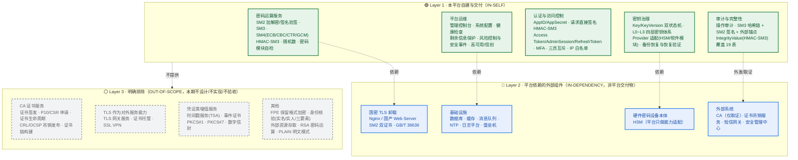

# 国密加密服务系统 · 设计范围界定与纳入/排除清单（V1.0）

| 项目 | 内容 |
| --- | --- |
| 文档名称 | 国密加密服务系统设计范围界定与纳入/排除清单 |
| 文档版本 | V1.0 |
| 编制日期 | 2026-09-28 |
| 范围基线 | **本轮设计仅覆盖「国密加解密服务」本体及其安全运行所必需的平台治理能力** |
| 需求依据 | 《国密加密服务系统软件需求规格说明书》V2.9（2026-09-28 编码基线版） |
| 设计依据 | 《国密加密服务系统详细设计文档》V2.0、《生产环境双节点部署架构》V1.0 |
| 对标依据 | 北京 CA《密码云服务平台·通用密码服务集成指南手册 V1.1》对比分析结论 |
| 效力 | 本清单为**范围冻结文件**，纳入/排除判定一经确认，设计、编码、测试、验收均以此为准 |

---

## 0. 一页纸结论

| 问题 | 结论 |
| --- | --- |
| 本平台**提供**什么？ | 国密算法密码运算服务 + 密钥全生命周期治理 + 认证授权 + 审计与完整性保护 + 管理控制台。一句话：**「密钥在我手上、算力由我提供」的私有化国密基础密码服务平台**。 |
| 本平台**依赖**什么？ | 国密 TLS 卸载（Web Server）、数据库、缓存、消息队列、NTP、HSM 设备本体、外部 CA（仅取证不签发）、短信网关、安全管理中心。 |
| 本平台**不提供**什么？ | **CA 证书服务**（签发/申请/生命周期/吊销发布）、**TLS 作为对外服务能力**（TLS 网关、证书托管）、时间戳服务、事件证书、PKCS#1/7、数字信封、FPE、身份核验、RSA 运算。 |
| 与 V2.9 需求是否冲突？ | **无功能冲突**。CA 证书服务在 V2.9 中本就不存在；TLS 需按「角色切分」处理（见第 4 章），不构成需求变更。 |
| 是否需要修订需求 V2.9？ | **不需要**。建议在 V2.10 的"范围与边界"章节补录本清单作为引用附件（可选，非阻塞）。 |

---

## 1. 范围声明

> **本轮设计范围 = 国密加解密服务。**
>
> 即：SM2 / SM3 / SM4 / HMAC-SM3 / 随机数的**密码运算能力**，以及为保障这些运算**可用、可信、可管、可审计、可合规**所必需的平台治理能力（密钥生命周期、密钥分层、Provider 适配、请求认证、访问控制、审计防篡改、完整性保护、风险控制、管理控制台、高可用与信创适配）。
>
> **TLS 与 CA 证书服务不作为本平台对外提供的服务能力纳入设计范围。** 其中，TLS 作为**平台自身通道保护的基础设施手段**仍然必需（合规基线要求），但其实现主体是部署层的 Web Server，不属于本平台交付的"服务"（角色切分见第 4 章）。

### 1.1 判定四原则

任何能力项是否纳入，按以下四条顺序判定：

| 序 | 判据 | 命中则 |
| --- | --- | --- |
| P1 | 是否属于「密码运算」或「密钥/凭据的生命周期治理」？ | **纳入**（Layer 1） |
| P2 | 是否为保障合规基线（等保三级 / 密评 / 信创）所必需，且无法由平台外组件承担？ | **纳入**（Layer 1） |
| P3 | 是否由其他系统/基础设施提供，本平台仅需对接或消费？ | **列为外部依赖**（Layer 2），平台内只做适配与校验 |
| P4 | 是否属于面向第三方提供的凭证类增值服务（证书/时间戳/格式封装/隐私计算）？ | **排除**（Layer 3） |

---

## 2. 三层范围模型

**读图要点**：
- **Layer 1 是本平台唯一的交付主体**，验收范围以此为准。
- **Layer 2 是运行依赖**：这些组件失败会影响平台可用性，但平台对其**只有适配与校验责任**，不承担其自身功能的设计与验收。
- **Layer 3 是虚线外的排除区**：任何 Layer 3 能力若后续被提出，必须走**需求变更流程**，不在本设计内部消化。

---

## 3. 纳入清单（IN）

### 3.1 Layer 1 · 自建与交付能力

| 域 | 能力项 | 对应需求编号 / 章节 | 设计落点 |
| --- | --- | --- | --- |
| 密码运算 | SM2 加解密、SM2 签名/验签（含 512B 长度限制） | F-CRYPTO-001～ | 详细设计 §4.2 |
| 密码运算 | SM3 摘要、HMAC-SM3 | F-CRYPTO-002/005 | 详细设计 §4.3 |
| 密码运算 | SM4 ECB/CBC/CTR/GCM（CTR 大端序禁回绕、GCM 全节点 2³² 约束） | F-CRYPTO-003/004 | 详细设计 §4.4 |
| 密码运算 | 随机数服务（单次 ≤64KB，上限 1MB） | F-CRYPTO-006 | 详细设计 §4.5 |
| 密码运算 | 密码模块自检（KAT 上电/周期/按需） | F-CRYPTO-007 | 详细设计 §4.6 |
| 密码运算 | KeyType 兼容性校验矩阵 | F-CRYPTO-008 | 详细设计 §4.7 |
| 密钥治理 | Key / KeyVersion 双状态机与全部转换矩阵 | F-KEY-001～ | 详细设计 §5.2～5.3 |
| 密钥治理 | 生成/激活/禁用/重新激活/轮换/过期/注销/销毁 | F-KEY-010～ | 详细设计 §5.4～5.6 |
| 密钥治理 | 导入/备份/恢复/恢复验证/版本管理/隔离/完整性校验 | F-KEY-020～ | 详细设计 §5.7 |
| 密钥治理 | L0 Unlock KEK → L1 Root Key → L2 Runtime KEK → L3 Data Key | F-RK-001～F-KEK-007 | 详细设计 §3 |
| 密钥治理 | Provider 能力模型（Capability 最小准入集 + NotSupported） | F-DEV-001～ | 详细设计 §3.2～3.3 |
| 密钥治理 | 软件模块主密码恢复流程 | F-RK-013 | 详细设计 §3.6 |
| 认证授权 | 应用注册与 AppSecret 生命周期（SecretCiphertext + SecretHash + 短缓存） | F-AUTH-001～ | 详细设计 §6.2 |
| 认证授权 | 业务 API 请求直接签名认证（CanonicalRequest 六段式 + 9 步校验） | F-AUTH-010～ | 详细设计 §6.3 |
| 认证授权 | 管理端 Access Token + AdminSession + RefreshToken 轮换 | F-AUTH-030～ | 详细设计 §6.4 |
| 认证授权 | MFA 全局强制（MFA_POLICY_MODE = REQUIRED）、UserMfaBinding | F-CON-009 / F-AUTH-040～ | 详细设计 §6.5 |
| 认证授权 | 三员分立与互斥、权限矩阵、资源归属校验 | F-CON-001～ | 详细设计 §6.6 |
| 认证授权 | IP 白名单（可选） | F-AUTH-050 | 详细设计 §6.7 |
| 审计 | 操作审计范围与字段清单、脱敏规则 | F-AUDIT-001～ | 详细设计 §7.1～7.2 |
| 审计 | SM3 哈希链 + CanonicalSerialize 规范化 + 分片聚合 + SM2 签名 | F-AUDIT-008～010 | 详细设计 §7.3 |
| 审计 | **外部锚点**（防尾部重构造）与集中外发、断点续传 | F-AUDIT-011 | 详细设计 §7.4 |
| 完整性 | IntegrityValue（HMAC-SM3 + IntegrityKey），覆盖 19 张关键表 | F-INT-001～ | 详细设计 §7.5 |
| 运维 | 管理控制台、用户/角色管理、高风险操作二次确认 | F-CON-001～ | 详细设计 §9.5 |
| 运维 | 系统配置管理（全量配置项） | F-CFG-001～008 | 详细设计 §9.7 |
| 运维 | 健康检查 /health /live /ready（组件级） | F-HC-001～ | 详细设计 §9.6 |
| 运维 | 剩余信息保护 | F-MEM-001～ | 详细设计 §12.5 |
| 风险控制 | 安全事件定义、分级、告警规则、通知通道 | F-RISK-001～ | 详细设计 §7.6 |
| 风险控制 | 签名失败防 DoS（告警 + 限流 + AppId/IP 绑定） | F-RISK-020～ | 详细设计 §7.6 |
| 非功能 | 性能、高可用、监控、时间同步、信创适配、数据治理 | NF-* | 详细设计 §12 |

### 3.2 Layer 2 · 外部依赖（平台需对接，非平台交付）

| 依赖项 | 承担主体 | 平台侧责任 | 依据 |
| --- | --- | --- | --- |
| 国密 TLS 卸载（SM2 双证书、GB/T 38636） | Web Server / Nginx + 国密模块 | 提出能力要求；配合兼容性验证；回退通用 TLS 时触发审计与告警 | NF-CMP-010、§5.5、§8.2 |
| 国产数据库 | 数据库产品 | 表结构、索引、权限分级、备份策略由平台设计 | §5.2、§8 |
| 缓存（TongRDS/CDM/宝兰德等） | 缓存产品 | 使用方式、双写一致性、降级策略由平台设计 | NF-AVAIL-006 |
| 消息队列 | MQ 产品 | 审计外发、事件通知的投递语义由平台定义 | §12.3 |
| NTP 时间源 | 基础设施 | 时间同步要求（±3 分钟窗口依据）、异常降级 | NF-AVAIL-009 |
| HSM 硬件本体 | 密码设备厂商 | 仅做**能力适配与准入核查**，不设计设备本身 | §5.6、F-DEV-001～ |
| 外部 CA / 证书吊销服务 | 第三方 CA | **只消费**：校验服务器证书链与吊销状态、登记 HSM 认证证书信息 | §5.5、F-DEV-008/009 |
| 短信网关 | 第三方服务商 | 定义调用语义与降级 | F-RISK-030 |
| 安全管理中心 | 甲方安全平台 | 定义集中审计/告警/配置外发协议 | NF-CMP-008 |
| 外部锚点独立存储 | 甲方指定 | 定义锚点数据结构与校验协议 | F-AUDIT-011 |

---

## 4. 边界澄清：TLS 与「证书」的三种角色（**本章为关键裁定**）

「TLS 不纳入」与「CA 证书不纳入」不能一刀切，因为 TLS 与证书在本系统中同时以**三种不同角色**出现，混为一谈会误伤合规基线或误增工作量。

### 4.1 角色切分表

| 角色 | 含义 | 是否纳入 | 承担主体 | 依据 |
| --- | --- | --- | --- | --- |
| **角色 A · 对外服务能力** | 平台把 TLS/证书能力**作为服务售卖给业务方**：TLS 网关服务、证书托管、证书签发/申请（P10/CSR）、证书生命周期管理、CRL/OCSP 发布、证书链构建、时间戳签发、事件证书 | ❌ **排除**（Layer 3） | — | 本轮范围声明 |
| **角色 B · 自用通道保护** | 平台**自身 API 与管理端的传输通道**加密：国密 TLS 卸载、SM2 双证书、回退通用 TLS 1.2+ 须审计告警 | ✅ **纳入，但落点在部署层**（Layer 2） | Web Server / Nginx + 国密模块 | NF-CMP-010、§5.5、§8.2、密评"传输通道密码技术" |
| **角色 C · 消费式证书校验** | 平台**读取并校验**外部签发的证书：HSM 商用密码产品认证证书核查、MFA 第二因素 SM2 证书指纹比对、TLS 服务器证书有效期与吊销状态监控 | ✅ **纳入**（Layer 1，限定为"核查/比对"，不含签发） | 本平台 | F-DEV-008/009、F-CON-009、§5.5 |

### 4.2 角色 B 的必要性说明（**请重点确认**）

V2.9 需求中与 TLS 直接相关的强制条款如下，**均为合规基线，不可豁免**：

| 条款 | 内容 | 性质 |
| --- | --- | --- |
| NF-CMP-010 | 业务与管理接口应支持 GB/T 38636 国密 TLS，优先使用 SM2 证书、SM4-GCM、SM3；生产环境是否强制启用由部署方案与安全策略决定 | 非功能强制 |
| §5.5 国密 TLS 兼容矩阵 | Web Server / 密码库 / 证书 / 浏览器 / .NET 侧 / 降级策略 六维要求 | 运行环境要求 |
| §8.2 传输安全 | 启用方式、双栈切换、证书体系、.NET 适配、回退须审计告警 | 安全需求 |
| §10 测试验收 | "传输通道密码技术验证" | 密评测试项 |
| 责任边界矩阵 | 传输保护（TLS/国密 TLS）—— 本系统**主责** | 责任划分 |

**裁定**：TLS 的「角色 B」（自用通道保护）**必须保留**。用户声明的"TLS 不纳入服务范围"应理解为 **「TLS 不作为本平台对外提供的服务能力」**，即排除「角色 A」，而非取消「角色 B」。

**若确认要连角色 B 一并排除**，则必须同步修订需求 V2.9 的 NF-CMP-010、§5.5、§8.2 与责任边界矩阵，并重新评估密评"传输通道密码技术"项的符合性结论 —— 这属于**需求级变更**，不在本轮设计可自行决定的范围。**本设计默认按"保留角色 B"执行。**

### 4.3 角色 C 的边界线

| 纳入（核查型） | 排除（签发型） |
| --- | --- |
| 登记 HSM 认证证书编号/机构/有效期，临期告警、宽限期、过期禁用 | 证书签发、证书申请受理（P10/CSR） |
| 校验 TLS 服务器证书有效期与吊销状态并纳入监控 | CRL/OCSP **发布**（对外提供吊销查询服务） |
| MFA 绑定 SM2 证书时保存 `CredentialHash`（证书指纹）与 `PublicKey` 用于比对 | 证书生命周期管理（签发/更新/吊销的完整管理面） |
| 对外部证书做**信任链与有效期判定**（用于准入） | 构建/运营 CA 体系（根 CA、中间 CA、证书模板） |

**判定线**：**「我签发」排除，「我核查」纳入。**

---

## 5. 排除清单（OUT）

| 序 | 排除项 | 归属 | 排除理由 | 若后续提出的处置 |
| --- | --- | --- | --- | --- |
| E-01 | **CA 证书服务**（证书签发、P10/CSR 申请、证书生命周期管理、CRL/OCSP 发布、证书链构建） | BJCA 能力域 | 本轮范围声明；V2.9 需求中本无此类需求 | 单独立项，走需求变更 |
| E-02 | **TLS 作为对外服务能力**（TLS 网关服务、证书托管、SSL VPN） | BJCA 能力域 | 本轮范围声明；非密码服务平台本体 | 单独立项 |
| E-03 | **时间戳服务（TSA）** | BJCA（10 个接口，依赖专用时间戳服务器 V1.6.1） | 属独立"可信时间服务"，非加密服务本体；平台内"时间戳"仅指请求头字段 | 单独立项 |
| E-04 | **事件证书服务** | BJCA（3 个接口） | 强绑定事件型密钥与证书签发体系，与 Key/KeyVersion 模型不兼容 | 单独立项 |
| E-05 | **PKCS#1 签名/验签** | BJCA（4 个接口） | 属签名格式封装，非密码运算本体 | 若业务确需，按"格式封装工具层"评估 |
| E-06 | **PKCS#7 签名/验签**（attach/detach） | BJCA（4 个接口） | 同上 | 同上 |
| E-07 | **数字信封构造/解析/转换** | BJCA（3 个接口） | 属报文封装协议 | 同上 |
| E-08 | **FPE 保留格式加解密** | BJCA（6 个接口） | 场景特殊；本平台已有 `UserDataDEK` + 应用层格式化可覆盖 | 不纳入 |
| E-09 | **身份核验**（实名/实人/手机号三要素） | BJCA（7 个接口） | 属 CTID 第三方能力代理，与密码服务本体无耦合 | 由业务系统对接 CTID |
| E-10 | **外部资源存取** | BJCA（2 个接口） | 非密码服务本体 | 不纳入 |
| E-11 | **RSA 密码运算** | BJCA | 本平台为纯国密平台；RSA 仅存在于通用 TLS 证书体系（角色 B 的部署层），引入运算会扩大密评范围 | 不纳入 |
| E-12 | **`signAlgo = PLAIN` 明文模式** | BJCA | **安全红线**：与等保三级传输保密性冲突 | **禁止提供**（非"暂不纳入"，而是永久禁止） |

> **说明**：E-05～E-07 的"签名格式封装"与 E-11 的 RSA，是 BJCA 能力域中**最可能被业务方真实需要**的三类。若甲方业务系统存在与既有 PKI/电子签章/OFD/PDF 签章体系对接的诉求，应在**需求评审阶段**提出，作为独立需求纳入，而非在本设计的"待确认项"中长期悬置。

---

## 6. 与 V2.9 需求的一致性核对

### 6.1 核对结论

| 核对维度 | 结论 |
| --- | --- |
| 功能需求（F-*） | **无冲突**。V2.9 中不存在 CA 证书服务、时间戳、事件证书、FPE、身份核验、PKCS#1/7、数字信封、RSA 运算的功能需求条目 |
| 非功能需求（NF-*） | **存在一处需口径切分**：NF-CMP-010（国密 TLS）为强制条款，按第 4.2 节保留为「角色 B」，不因范围收窄而豁免 |
| 运行环境（§5） | §5.5 国密 TLS 兼容矩阵、§5.6.3 密码设备互斥 —— 均为部署层要求，保留 |
| 安全需求（§8） | §8.2 传输安全、§8.14 密码设备安全 —— 保留；§8 中所有证书相关要求均为"核查/登记/监控"型，与第 4.3 节边界线一致 |
| 测试验收（§10） | "传输通道密码技术验证"为密评必测项，保留 |
| 责任边界矩阵（§12） | "传输保护（TLS/国密 TLS）—— 本系统主责" —— 保留；此处"主责"指**通道保护措施的责任**，不含"对外提供 TLS 服务" |

### 6.2 需保留的证书类需求条目（**不得因范围声明而删除**）

| 需求编号 | 内容 | 保留理由 |
| --- | --- | --- |
| F-DEV-008 | 登记 HSM 商用密码产品认证证书信息（仅 HSM 场景） | 密码设备准入合规，属"核查"角色 C |
| F-DEV-009 | 定期检查认证证书有效期；临期告警、宽限期、过期禁用 | 同上；密评必备 |
| F-CON-009 | MFA 第二因素支持 TOTP、国密 USBKey、**SM2 数字证书**、动态令牌 | 身份鉴别密码技术；平台只做凭据指纹比对，不签发证书 |
| NF-CMP-010 | 支持 GB/T 38636 国密 TLS | 传输通道合规基线（角色 B） |
| NF-CMP-011 | 密码设备应核查商用密码产品认证证书 | 同上 |
| §5.5 | 国密 TLS 兼容矩阵（含"证书链、有效期、吊销机制需记录并纳入监控"） | 部署层监控要求 |

### 6.3 需求文档处置建议

| 项 | 建议 | 优先级 |
| --- | --- | --- |
| 在需求 V2.10 增设"§1.x 范围与边界"小节，引用本清单 | 可选，使范围有需求级出处 | P2 |
| 明确 NF-CMP-010 的"服务 vs 通道"语义 | 建议，消除"TLS 不纳入"与 NF-CMP-010 的表面矛盾 | P1 |
| 将本清单第 5 章 E-01～E-12 归档为"明确不纳入"清单 | 建议，避免后续反复评审 | P1 |

---

## 7. 对已交付设计文档的影响与处置

| 交付物 | 影响 | 处置 |
| --- | --- | --- |
| 《详细设计文档》V2.0 | §14.1 冻结项缺"范围排除"声明 | **已补 §14.1 FR-12 范围冻结项**（见下） |
| 《详细设计文档》V2.0 §12.5 安全设计要点 | 传输安全表述需明确"部署层承担" | 已在 §12.5 标注（国密 TLS 由 Web Server 卸载） |
| 《生产环境双节点部署架构》V1.0 | 图中"⑤ 安全合规对接区"的「国密 CA / 证书与吊销服务」易被误读为本平台能力 | **已加注"外部依赖，非本平台交付能力"** |
| 《对比分析报告》V1.0 | §2.3/§2.4/§2.5 中 9 项判定为"B 缺口"的证书/凭证类能力，应改判为"**范围外**" | **已在本清单第 8 章给出重分类对照表**（原报告保持一致，不回溯修改，以本清单为最新裁定） |
| 代码/DDL | 无影响：V2.9 需求本无 CA/时间戳等实体 | 无需调整 |

---

## 8. 对比分析报告的判定重分类

原《对比分析》报告的 "B 缺口 15 项"中，有 **9 项**属本轮范围外，重分类如下：

| 原序号 | 能力项 | 原判定 | **新判定** | 依据 |
| --- | --- | --- | --- | --- |
| #25 | PKCS1 签名/验签 | B 缺口 | **范围外（E-05）** | 非密码运算本体 |
| #26 | PKCS7 签名/验签 | B 缺口 | **范围外（E-06）** | 同上 |
| #27 | 证书 OID 解析 | B 缺口 | **范围外（E-01）** | 属 CA 证书服务 |
| #28 | 证书有效性验证服务 | B 缺口 | **范围外（E-01）**；仅保留内部"准入核查"（角色 C） | 对外验证接口属 CA 服务 |
| #29 | 数字信封构造/解析/转换 | B 缺口 | **范围外（E-07）** | 属报文封装协议 |
| #31 | 时间戳服务（TSA） | B 缺口 | **范围外（E-03）** | 独立产品 |
| #32 | 事件证书服务 | B 缺口 | **范围外（E-04）** | 与密钥模型不兼容 |
| #33 | FPE 保留格式加解密 | B 缺口 | **范围外（E-08）** | 已有替代方案 |
| #34/#35 | 身份核验 / 外部资源存取 | B 缺口 | **范围外（E-09/E-10）** | 第三方能力代理 |

**重分类后的剩余缺口（仍建议纳入）**：

| 项 | 说明 | 优先级 |
| --- | --- | --- |
| 密钥别名 `alias` | `SysKey.Alias` + `UQ(AppId, Alias)`，接口增 `alias` 入参与检索 | P0 |
| 配置化自动轮转参数 | `RotationPolicy{ mode, rotationDays, nextRotationAt, triggers[] }` + 策略查询接口 | P0 |
| `keySpec` 显式算法规格枚举校验 | 防 `AlgorithmParams` 注入非法参数 | P1 |
| `keyUsage` 用途维度（可选） | 同算法不同用途细分，服务"密钥用途最小化" | P2 |
| 业务侧 `X-Request-Id` 贯穿回显 | 提升跨系统排障效率 | P2 |
| DK 信封化下送（**已降级**） | 原建议用于备份密钥/AppSecret/UserDataDEK 复用；但信封格式属 E-07 范畴，**改用平台内部密钥封装（KEK Wrap）实现，不引入对外信封接口** | P2 |

> **重要修正**：原报告 §4.1 第 3 项"DK 信封化下送"建议**不再作为对外接口引入**。平台内部对备份密钥、AppSecret、UserDataDEK 的保护继续使用 **L2 Runtime KEK 封装**（现有设计已覆盖），无需新增 `generateDataKey` 类对外接口。此项对外暴露的价值在纯加密服务范围内不成立。

**重分类后统计**：

| 判定 | 原数量 | 新数量 |
| --- | --- | --- |
| B 缺口 | 15 | **6**（alias、轮转参数、keySpec、keyUsage、transId、DK 复用降级为内部实现） |
| 范围外（本轮不纳入） | — | **9** |

---

## 9. 本清单冻结项

| 编号 | 冻结结论 |
| --- | --- |
| **SC-01** | 本平台交付范围为**国密加解密服务本体 + 密钥/凭据生命周期治理 + 认证授权 + 审计与完整性 + 管理控制台 + 合规非功能**（Layer 1） |
| **SC-02** | **不提供 CA 证书服务**：证书签发、P10/CSR 申请、证书生命周期管理、CRL/OCSP 发布、证书链构建，一律排除（E-01） |
| **SC-03** | **不提供 TLS 作为对外服务能力**：TLS 网关服务、证书托管、SSL VPN，排除（E-02） |
| **SC-04** | **保留国密 TLS 作为平台自用通道保护**（角色 B），由部署层 Web Server 卸载；回退通用 TLS 1.2+ 须审计并告警（NF-CMP-010） |
| **SC-05** | **保留证书"核查型"能力**（角色 C）：HSM 认证证书登记与有效期检查、MFA 证书指纹比对、TLS 服务器证书监控。判定线：**「我签发」排除，「我核查」纳入** |
| **SC-06** | 排除时间戳服务、事件证书、PKCS#1/7、数字信封、FPE、身份核验、外部资源存取、RSA 运算（E-03～E-11） |
| **SC-07** | **永久禁止** `PLAIN` 明文模式（E-12），非"暂不纳入" |
| **SC-08** | 平台内部密钥封装（备份密钥、AppSecret、UserDataDEK）使用 **L2 Runtime KEK**，不引入对外信封接口 |
| **SC-09** | Layer 3 任一项若被提出，**必须走需求变更流程**，不在本轮设计内消化 |

---

## 10. 待确认事项

| 编号 | 事项 | 影响 | 建议关闭时间 |
| --- | --- | --- | --- |
| SC-Q1 | 是否确认 **SC-04**（保留角色 B：TLS 自用通道保护）？若要求连自用通道一并排除，属需求级变更，需同步修订 NF-CMP-010 / §5.5 / §8.2 / 责任边界矩阵，并重估密评"传输通道密码技术"符合性 | 合规基线 | 立即 |
| SC-Q2 | 业务方是否存在与既有 **PKI / 电子签章 / OFD/PDF 签章**体系对接的诉求（涉及 E-05～E-07）？若有，需在需求阶段独立立项 | 需求范围 | 需求评审前 |
| SC-Q3 | MFA 第二因素是否确认包含 **SM2 数字证书**（角色 C，仅指纹比对）？若含，客户端证书由外部 CA 签发，平台不承担签发责任 | 认证设计 | 详细设计评审 |
| SC-Q4 | 是否需要在需求 V2.10 增设"范围与边界"章节，引用本清单 | 文档体系 | 需求定稿前 |

---

## 附录 A. 与 BJCA 能力域的归属对照（一页速览）

| BJCA 能力域 | 接口数（约） | 本轮归属 |
| --- | --- | --- |
| 基础密码算法（SM2/SM3/SM4/随机数） | 20+ | 🟢 Layer 1 纳入 |
| 密钥管理（主密钥/数据密钥/非对称密钥对） | 20+ | 🟢 Layer 1 纳入 |
| 签名格式（PKCS1/PKCS7） | 8 | ⚪ Layer 3 排除 |
| 证书服务（解析/有效性验证/事件证书） | 5 | ⚪ Layer 3 排除 |
| 数字信封 | 3 | ⚪ Layer 3 排除 |
| 时间戳服务（TSA） | 10 | ⚪ Layer 3 排除 |
| FPE 保留格式加密 | 6 | ⚪ Layer 3 排除 |
| 身份核验（CTID） | 7 | ⚪ Layer 3 排除 |
| 外部资源存取 | 2 | ⚪ Layer 3 排除 |
| 平台治理（防重放/幂等/审计/完整性/三员/HA/合规） | BJCA 公开手册未覆盖 | 🟢 Layer 1 纳入（我方领先） |

---

> **编制说明**：本清单的排除判定依据「本轮设计仅覆盖国密加解密服务」的范围声明；纳入判定逐项对应 V2.9 需求编号，未对应需求编号者均已标注。**第 4 章（TLS 与证书的三种角色）与 SC-Q1 为本文档最需要确认的内容**，因为它直接决定合规基线是否完整。
