# 国密加密服务系统详细设计文档

| 项目       | 内容                                                                                |
| ---------- | ----------------------------------------------------------------------------------- |
| 文档名称   | 国密加密服务系统详细设计文档                                                        |
| 文档版本   | **V2.0**                                                                      |
| 编制日期   | 2026-09-28                                                                          |
| 需求基线   | 《国密加密服务系统软件需求规格说明书》**V2.9**（2026-09-28 编码基线版）       |
| 上一版设计 | 《国密加密服务平台详细设计文档》V1.1（依据需求 V1.0，已过时）                       |
| 文档状态   | 设计基线版（与 V2.9 需求逐条对应；变更部分见第 1 章）                               |
| 合规基线   | GB/T 22239-2019（等保 2.0 三级）、GB/T 39786-2021（密评）、信息技术应用创新（信创） |
| 文档用途   | 编码实现、单元/集成测试设计、验收追溯、密评与等保材料                               |

---

# 0. 文档说明

## 0.1 编制依据

本文档依据以下材料编制：

1. 《国密加密服务系统软件需求规格说明书》V2.9（以下简称"需求 V2.9"），为**唯一需求基线**；
2. 《国密加密服务系统生产环境双节点部署架构》V1.0（部署视图输入）；
3. 旧版《国密加密服务平台详细设计文档》V1.1 及其派生规范文档（作为**可继承资产来源**，其与 V2.9 冲突的结论一律以本文档为准）。

## 0.2 为什么需要重写

旧版详细设计基于需求 V1.0 编写，而需求已历经 V1.1 至 V2.9 共 12 个版本演进，其中 V2.5、V2.6、V2.7、V2.8、V2.9 五个版本属于**结构性变更**（认证模型替换、存储模型替换、密钥体系重写、能力模型引入、编码基线收口）。经逐章比对，旧设计共有 **79 处**与 V2.9 冲突或缺失，其中 5 处为**根本性冲突**——照此实现将导致系统无法通过密评、或关键功能密码学上不可实现。

因此本文档**不是对旧文档的局部修订，而是重新编制**：保留旧设计中仍然成立的分层、命名与工程骨架，重写全部与 V2.9 相关的模型、流程、接口与数据结构。

## 0.3 术语与缩略语

| 术语                                                        | 含义                                                                           |
| ----------------------------------------------------------- | ------------------------------------------------------------------------------ |
| AppId                                                       | 业务应用标识；业务 API 认证主体                                                |
| AppSecret                                                   | 应用密钥；**只用于本地计算 HMAC-SM3 签名，不在网络传输**                 |
| SecretCiphertext                                            | AppSecret 的密文形态（SM4-GCM，由 KEK-Runtime 保护）                           |
| SecretHash                                                  | SM3(AppSecret)，用于指纹/去重/审计关联                                         |
| CanonicalRequest / StringToSign                             | 请求签名待签字符串（阿里云签名结构）                                           |
| Nonce                                                       | 请求随机数；HMAC 校验通过后原子写入，防重放                                    |
| AdminSession                                                | 管理端会话实体（空闲超时/绝对超时/撤销判定依据）                               |
| RefreshToken                                                | 管理端刷新令牌（随机 opaque、一次性轮换、仅存哈希）                            |
| KEK-Unlock / Root Key / KEK-Runtime / KEK-Backup / Data Key | L0/L1/L2/L3 逻辑密钥层级                                                       |
| Provider                                                    | Crypto Provider，密码运算物理实现（Software / HSM，**部署模式互斥**）    |
| ProviderCapabilities                                        | Provider 能力声明（最小准入集 + 可选扩展能力）                                 |
| ProviderReference / ProviderKeyIdentity                     | HSM 场景密钥句柄 / 密钥身份校验值                                              |
| IntegrityValue                                              | 密钥化完整性值：HMAC-SM3(IntegrityKey, CanonicalSerialize + TableName + RowId) |
| ARCHIVE MATERIAL                                            | 归档密钥材料，仅用于历史解密/验签                                              |
| NodeId                                                      | 节点标识，参与 GCM Nonce 确定性唯一性构造                                      |
| 三员互斥                                                    | 系统管理员/安全管理员/审计管理员强制职责分离                                   |

## 0.4 阅读指引

- **只想了解"改了什么"** → 第 1 章；
- **编码实现** → 第 3～11 章 + 第 13 章追踪矩阵；
- **接口对接** → 第 6 章、第 9 章；
- **数据库建表** → 第 8 章；
- **测试设计** → 第 10 章流程 + 需求 V2.9 第 10 章测试项；
- **待决事项** → 第 14 章。

---

# 1. 需求升级影响分析与设计变更总览

## 1.1 需求演进路径

| 需求版本    | 关键变化                                                                                                                                                                                                                          | 对设计的影响等级 |
| ----------- | --------------------------------------------------------------------------------------------------------------------------------------------------------------------------------------------------------------------------------- | ---------------- |
| V1.0 / V1.1 | 初稿与逻辑修正                                                                                                                                                                                                                    | 旧设计基线       |
| V2.0～V2.4  | 对齐文档规范，纳入等保/密评/信创基线；删除"密评模式配置"（密码能力永久合规）                                                                                                                                                      | 中               |
| V2.5        | **业务 API 改为请求直接签名**；Token 仅限管理端；删除 F-AUTH-020/021/022/024；新增手机号；软件密码模块允许生产                                                                                                              | 高               |
| V2.6        | AppSecret→SecretCiphertext+SecretHash；Checksum→IntegrityValue；四层逻辑密钥体系 + Provider 互斥；新增 AdminSession/RefreshToken/KeyMaterial；KeyType 兼容性；Nonce 原子防重放                                                  | 极高             |
| V2.7        | HSM Master Key 与平台 Root Key 边界；Provider Capability 模型；GCM Counter 溢出禁止回绕；PBKDF2-SM3 冻结；性能需求与部署基线分离                                                                                                  | 高               |
| V2.8        | **MFA 全局强制**（MFA_POLICY_MODE，默认 REQUIRED）；手机号去特殊化并删除 PhoneHash 机制；StringToSign 口径钉死；GCM 全节点 2³² 总量约束；Nonce TTL 上调至 6 分钟                                                          | 高               |
| V2.9        | 编码基线收口 17 项：MFA 表述全文统一、AppSecret 解密路径与性能分级、管理端 Token 资源归属规则、实体字段补全、KeyVersion 状态机、HMAC 历史验证语义、Nonce 双写仲裁、主密码恢复、CTR/SM2 长度限制、审计哈希链规范化、签名失败防 DoS | 高               |

## 1.2 设计变更分组总览

| 组 | 变更主题                 |     冲突条数 | 冲突性质            | 处置策略              |
| -- | ------------------------ | -----------: | ------------------- | --------------------- |
| A  | 业务 API 认证模型        |            6 | 模型冲突 + 流程变更 | **重写**        |
| B  | AppSecret 存储与生命周期 |            6 | 模型冲突 + 字段缺失 | **重写**        |
| C  | 关键字段完整性保护       |            5 | 模型冲突 + 合规缺口 | **重写**        |
| D  | 逻辑密钥体系             |           10 | 模型冲突 + 流程变更 | **重写**        |
| E  | Provider 能力模型        |            8 | 接口变更 + 需新增   | **重写**        |
| F  | 管理端认证与会话         |           11 | 模型冲突 + 流程变更 | **重写**        |
| G  | 手机号与用户数据         |            3 | 已废弃 + 需新增     | **修订 + 新增** |
| H  | 防重放（Nonce）          |            4 | 流程变更            | **修订**        |
| I  | 审计与防篡改             |            4 | 流程变更 + 需新增   | **修订 + 新增** |
| J  | 算法规则、错误码与接口   |           22 | 接口变更 + 需新增   | **修订 + 新增** |
| — | **合计**           | **79** | —                  | —                    |

## 1.3 五项根本性设计重构

### 1.3.1 重构一：业务 API 认证模型（AppSecret 凭据签名 → 请求直接签名）

| 项          | 旧设计（V1.0 基线）                                         | V2.9 要求                                                                                                      | 设计处置                                                  |
| ----------- | ----------------------------------------------------------- | -------------------------------------------------------------------------------------------------------------- | --------------------------------------------------------- |
| 认证方式    | AppId + AppSecret 作为凭据（凭据签名 / 服务端持有可逆凭据） | AppID + 请求直接签名 HMAC-SM3，**AppSecret 不在网络传输**（F-AUTH-025～028、NF-CMP-014）                 | 重写为 CanonicalRequest 六段式签名                        |
| 待签字符串  | `Method + Path + Timestamp + Nonce + BodyHash(Base64)`    | `Method\nCanonicalURI\nCanonicalQueryString\nCanonicalHeaders\nSignedHeaders\nHexEncode(SM3(Body))`（6.2.2） | **公式整体替换**，以 3.3.3.3 固定测试向量为唯一仲裁 |
| 签名编码    | 未约束                                                      | 固定 Base64，**禁止 Hex**（6.2.3）                                                                       | 约束落实到契约与测试                                      |
| Header 集合 | 未定义 SignedHeaders 语义                                   | `x-app-id;x-nonce;x-timestamp`，小写字典序，`key:value\n` 拼接后**去除末尾换行**（V2.8 钉死）        | 新增规范化实现与跨语言一致性测试                          |
| 校验顺序    | 先写 Nonce 再验签                                           | **先验签、后写 Nonce**（HMAC 失败不写 Nonce），防 DoS（6.2.4）                                           | 重写校验流水线（9 步）                                    |
| 时间窗口    | 未明确定义                                                  | ±3 分钟，依赖统一时间源；时间源不可用拒绝签名请求（4.11）                                                     | 新增时间源健康门控                                        |

> **影响**：签名模块、请求中间件、SDK 示例、测试向量、错误码（10004/10005/10006）全部重做；旧实现无法与新客户端互通。

### 1.3.2 重构二：AppSecret 存储模型（可逆凭据/明文哈希 → 密文 + 哈希双字段）

旧设计存在**密码学上不可实现的悖论**：既要服务端用 AppSecret 参与验签，又只存储 `secret_hash`。V2.9 明确拆分：

| 字段             | 作用                                         | 保护方式                                            |
| ---------------- | -------------------------------------------- | --------------------------------------------------- |
| SecretCiphertext | 服务端验签时解密获取 AppSecret               | SM4-GCM，由**KEK-Runtime** 保护（NF-CMP-017） |
| SecretHash       | 指纹 / 去重 / 审计关联，**不参与验签** | SM3(AppSecret)                                      |

配套要求：原文不得持久化；轮换后旧 Secret **立即失效、无兼容期**（D-19）；允许受限内存短缓存（Software ≤60s / HSM ≤30s），并支持撤销联动清除（D-28、F-AUTH-030）。

### 1.3.3 重构三：完整性保护（普通 SM3 Checksum → 密钥化 IntegrityValue）

V2.5 的普通 SM3 Checksum 无法防御具有数据库写权限的篡改者。V2.6 起升级：

```text
IntegrityValue = HMAC-SM3( IntegrityKey,
                           CanonicalSerialize(关键字段) + TableName + RowId )
```

- IntegrityKey 由 KEK-Runtime 保护；
- 覆盖 19 张关键表（7.17.1 逐表列出关键字段），审计链/Nonce/巡检记录不纳入；
- 极高价值数据（Key 元数据、RootKeyMetadata、KekMetadata）建议 SM2 签名加强；
- 校验策略：写入同步计算、读取按需校验、**每 24 小时**定期抽查（分批、限速、低峰）；失败返回 90001/90002/90003 并拒绝使用数据。

### 1.3.4 重构四：逻辑密钥体系（单层密钥保护 → L0～L3 四层 + Provider 解耦）

| 层级 | 名称                     | 职责                                                    | Software                                      | HSM                                                                 |
| ---- | ------------------------ | ------------------------------------------------------- | --------------------------------------------- | ------------------------------------------------------------------- |
| L0   | KEK-Unlock               | 解封 Root Key                                           | 主密码 + PBKDF2-SM3 派生，OS 安全存储二次保护 | 由 HSM Security Domain / 设备访问控制替代，**不强制软件实现** |
| L1   | Root Key                 | 保护 KEK-Runtime / KEK-Backup；**不参与业务运算** | 平台生成 + 加密存储                           | HSM 内专用 Key Object（**≠ HSM Master Key**）                |
| L2   | KEK-Runtime / KEK-Backup | 保护 Data Key / 备份数据                                | 平台内 Wrap/Unwrap                            | HSM 内受保护 KEK                                                    |
| L3   | Data Key                 | 执行 SM2/SM4/HMAC 运算                                  | 数据库密文（WrappedMaterial）                 | HSM Key Handle（ProviderReference）                                 |

### 1.3.5 重构五：Provider 能力模型（强制统一接口 → 最小准入集 + 可选扩展）

旧设计要求所有密码设备实现完整的 Wrap/Backup/Restore/Import/Export 接口，将**阻塞国产 HSM 准入**。V2.9 改为：

- **最小能力准入集**（V2.8 M-03）：`CanWrapKey` / `CanUnwrapKey` 等为强制项；
- **可选扩展能力**：`CanRotateRootKey`、`CanRewrapKey`、`CanBackupKey`、`CanRestoreKey`、`CanImportKey`、`CanExportKey` 按能力声明（ProviderCapabilities）；
- 不支持时**必须返回 `NotSupported`（40005），不得静默成功**；管理控制台明示；
- HSM Vendor Backup / Security Domain Backup / Cluster Replication 属 Provider-specific，**不得抽象为通用备份 API**。

## 1.4 其余变更明细

| 序号 | 变更主题                | 旧设计结论                            | V2.9 要求（编号）                                                                                                                                                   | 处置                                                                                        |
| ---- | ----------------------- | ------------------------------------- | ------------------------------------------------------------------------------------------------------------------------------------------------------------------- | ------------------------------------------------------------------------------------------- |
| 1    | 管理端认证              | 简单 JWT Token（2 小时）              | Access Token（空闲 15min / 绝对 24h）+**AdminSession** + **RefreshToken 一次性轮换（7 天）** + MFA 全局强制（F-AUTH-010～017、D-07、D-16）              | 重写                                                                                        |
| 2    | MFA                     | 可选启用                              | **全局强制**，MFA_POLICY_MODE（OPTIONAL/REQUIRED，默认 REQUIRED，**生产冻结 REQUIRED**）；新增 UserMfaBinding 实体；新增 F-CON-013、F-CFG-006、F-DI-007 | 重写 + 新增                                                                                 |
| 3    | 手机号                  | PhoneHash / PhoneSearchKey 密钥化搜索 | **去特殊化**：普通属性字段，统一 UserDataDEK 加密（SM4-GCM），删除 PhoneHash 机制（G-1～G-3）                                                                 | 废弃 + 修订                                                                                 |
| 4    | 手机号验证码            | 未定义                                | 长度 ≥6 位、有效期 ≤5min、60s/次、24h ≤10 次、5 次失败失效（V2.9）                                                                                               | 新增                                                                                        |
| 5    | Nonce 防重放            | 简单 Nonce，TTL 10 分钟               | TTL**6 分钟**（≥ 时间窗口 2 倍）；缓存 + 数据库双写；**UNIQUE(AppId, Nonce) 为最终仲裁**；禁止 SELECT→INSERT                                          | 修订                                                                                        |
| 6    | 审计哈希链              | 简单 Prev/Current 哈希链              | **CanonicalSerialize 规范化**（字段顺序/空值 `\0`/ISO 8601 带时区/UTF-8/`                                                                                   | ` 分隔）+**分片链 + 聚合签名** + SM2 签名 + **外部锚点** + 集中外发（断点续传） |
| 7    | 完整性巡检              | 无                                    | IntegrityScanRecord 实体 + 巡检接口 + 每 24h 抽查 + 批次/限速/低峰窗口（I-23）                                                                                      | 新增                                                                                        |
| 8    | KeyVersion              | 无独立状态机                          | ST-KV-001～014 独立状态机；ROTATED/EXPIRED/REVOKED 不可回 ACTIVE                                                                                                    | 新增                                                                                        |
| 9    | HMAC 历史验证           | 未定义                                | HMAC**Verify 允许历史版本**；HMAC **Generate 必须当前 ACTIVE 版本**（D-31）                                                                             | 明确                                                                                        |
| 10   | GCM Counter             | 仅处理回绕                            | 溢出**禁止回绕**，处置对象限于该 Data Key/KeyVersion，自动触发版本轮换；Root Key 不自动轮换；**全节点 2³² 总量约束**，2³¹ 告警（M-01/M-02）         | 修订                                                                                        |
| 11   | GCM Nonce               | 概率性随机                            | **确定性唯一性**：`KeyVersion(4B) + NodeId(4B) + MonotonicCounter(4B)`，12 字节固定拼接；NodeId 平台统一分配、退役不复用（I-15）                            | 重写                                                                                        |
| 12   | CTR 计数器              | 未定义                                | 16 字节大端序 +1；溢出禁止回绕；`KeyId+Counter` 短窗口重复检测；2³¹ 告警（D-33）                                                                                | 新增                                                                                        |
| 13   | SM2 长度限制            | 未定义                                | 单次加密默认**512 字节**；签名不限（受 NF-PERF-014）；超限 20001（D-34）                                                                                      | 新增                                                                                        |
| 14   | 随机数长度              | 复用 NF-PERF-014                      | **独立定义**：默认 64KB，上限 1MB，超限 20001（D-26、F-CFG-008）                                                                                              | 修订                                                                                        |
| 15   | 签名失败处置            | 5 次/5 分钟锁定应用 15 分钟           | **防 DoS 重构**：绑定 AppId+IP；默认不锁定应用，改为告警 + 限流 + 人工处置；快速恢复通道（D-27）                                                              | 重写                                                                                        |
| 16   | 业务 API 创建密钥       | 未定义                                | 受 AllowApiKeyCreate + 配额 + KeyType 白名单控制；CREATED 后需激活；幂等 + 审计 + 通知安全管理员（F-CFG-007、6.6）                                                  | 新增                                                                                        |
| 17   | 管理端 Token 调业务 API | 未定义                                | 必须显式传 appId 或仅限测试专用 App；生产 Key 需二次确认 + 高危审计 + 告警；不得绕过资源归属（D-29）                                                                | 新增                                                                                        |
| 18   | 密码算法                | 未约束 ECB/模式                       | ECB 仅兼容存在业务；新业务优先 GCM；GCM Nonce 平台强制生成、Tag 128 位、AAD ≤64 字节                                                                               | 修订                                                                                        |
| 19   | 口令存储                | 未冻结                                | **PBKDF2-SM3**：复杂度 ≥3 类、长度 ≥12、历史 5 次、90 天、每用户独立 Salt（I-16 待冻结迭代参数）                                                            | 新增                                                                                        |
| 20   | 高风险操作              | 未定义清单                            | 15 类高风险操作 + 二次确认（本期以口令/验证码实现，审批流为后续扩展）                                                                                               | 新增                                                                                        |
| 21   | 幂等                    | 少数接口                              | 19 条敏感操作清单；Idempotency-Key；TTL 24h；库+缓存双写                                                                                                            | 修订                                                                                        |
| 22   | 错误码                  | 自定义子集                            | 11 个区间（10000～90099）；新增 30004（CTR 溢出）、40005（Provider 能力不支持）、10003（MFA 失败）等                                                                | 修订                                                                                        |

## 1.5 明确废止的旧设计结论

以下结论在 V2.9 下**严禁继续沿用**，实现中如出现需按缺陷处理：

1. 使用 `secret_hash` 或任何不可逆摘要参与请求验签；
2. 以"凭据签名"（服务端持有 AppSecret 明文/可逆存储且不加密）作为业务 API 认证；
3. `KeyUsage` 字段与 KeyUsage 业务语义校验（已于 V2.6 删除，平台不再约束业务语义）；
4. 以 `ROOT` 作为普通 KeyType 与业务密钥同表管理；
5. AppSecret 轮换设置 24 小时兼容期（V2.5 起为**立即失效**）；
6. 明文 Root Key 落库或落盘；
7. Admin Token 有效期 2 小时、无 AdminSession（V2.5 起为 15min/24h + AdminSession）；
8. Nonce TTL 10 分钟（V2.8 起为 6 分钟）；
9. MFA"可选启用"（V2.8 起全局强制）；
10. PhoneHash / PhoneSearchKey 机制与手机号唯一性特殊处理；
11. 普通 SM3 Checksum 作为完整性保护（必须 HMAC-SM3 + IntegrityKey）；
12. 以字符串格式或平台默认字节序构造 SM4-GCM Nonce；
13. 签名失败自动锁定应用（V2.9 改为告警 + 限流 + 人工处置）。

## 1.6 可继承资产

旧设计中 **38 项**资产可继续使用（16 项可直接沿用，22 项需少量修订），无一项需整体废弃：

| 资产                                                                      | 文件/位置                  | 处置                                                 |
| ------------------------------------------------------------------------- | -------------------------- | ---------------------------------------------------- |
| 工程分层与命名（CryptoPlatform.App / Api / Domain / Infrastructure 等）   | 旧设计第 34 章             | 沿用                                                 |
| Provider 抽象层骨架（ICryptoProvider / ProviderKeyRef / ProviderContext） | 旧设计第 2、14、28 章      | 沿用骨架，**按 Capability 模型重写能力面**     |
| 密钥状态机骨架（CREATED/ACTIVE/…）                                       | 旧设计第 1.7 节            | 沿用骨架，**补 KeyVersion 状态机与 HMAC 语义** |
| 事务与补偿思路（Provider 成功、数据库失败）                               | 旧设计第 13.2.3 节         | 沿用，补 UNKNOWN 语义                                |
| 错误码框架与统一响应包装                                                  | 旧设计第 18.3、33 章       | 沿用，**按 11 个区间重排**                     |
| DDL/EF Core 骨架、索引与命名规范                                          | 旧设计第 16、17、25、27 章 | 沿用骨架，**按 V2.9 实体字段补全**             |
| 审计表骨架与 Operator 模型                                                | 旧设计第 6 章              | 沿用，**重写哈希链与分片规则**                 |
| 自检（KAT）与健康检查设计                                                 | 旧设计第 9、10 章          | 沿用                                                 |
| HA / 部署 / 信创适配                                                      | 旧设计第 7、8 章           | 沿用并与部署架构 V1.0 对齐                           |

## 1.7 变更影响矩阵

| 变更组          | 影响设计章节   | 影响代码模块                            | 影响数据库                               | 影响接口               |
| --------------- | -------------- | --------------------------------------- | ---------------------------------------- | ---------------------- |
| A 签名模型      | 6.2、9.2、11   | AuthMiddleware、SigningService          | —                                       | 全部业务 API 请求头    |
| B AppSecret     | 6.3、8、11     | SecretService、CacheService             | ApplicationSecret                        | 应用管理类             |
| C 完整性        | 7.6、8、11     | IntegrityService                        | **全部关键表加字段**               | 完整性巡检类           |
| D 密钥体系      | 3、5、10       | KeyService、KeyHierarchy                | RootKeyMetadata/KekMetadata/UserDataDEK  | Root Key/KEK 类        |
| E Provider 能力 | 3.3、11        | ICryptoProvider、CapabilityRegistry     | CryptoDevice                             | 备份/恢复/导入/导出类  |
| F 管理端认证    | 6.5、6.6、10.2 | AuthService、SessionService、MfaService | AdminSession/RefreshToken/UserMfaBinding | 管理端认证类           |
| G 手机号        | 6.7、7.7、8    | UserService、DataDekService             | User.PhoneEncrypted、UserDataDEK         | 用户与手机号类         |
| H Nonce         | 6.4、11        | NonceService                            | SignatureNonce（UNIQUE）                 | 全部业务 API           |
| I 审计          | 7.2～7.4、10.9 | AuditService、AnchorService             | AuditLog 分区、Anchor                    | 审计类                 |
| J 算法/错误码   | 4、9.8、11     | CryptoService、ErrorCatalog             | —                                       | 密码服务类、全部错误码 |

---

# 2. 系统总体设计

## 2.1 设计目标与原则

| 原则                   | 设计落地                                                                    |
| ---------------------- | --------------------------------------------------------------------------- |
| 密钥不出安全边界       | 密钥材料仅在 Provider 内使用；平台只保存引用/密文；接口不返回任何密钥材料   |
| 最小权限               | 数据库四级账号；管理端 RBAC + 三员互斥；应用仅能访问归属 Key                |
| 默认安全               | 默认拒绝；未认证/未授权请求一律拒绝；Provider 能力缺失显式`NotSupported`  |
| 全程审计               | 密码运算、密钥生命周期、认证、管理操作、配置变更全部留痕；哈希链 + 外部锚点 |
| 可替换密码设备         | Provider 接口 + Capability 声明，Software/HSM 互斥部署，业务层无感          |
| 等保与密评合规         | 完整性值、审计留痕、MFA 强制、时间同步、集中管控对接                        |
| 信创优先               | 运行环境、数据库、缓存、密码设备、密码库全部支持国产化替换                  |
| 三员分立与互斥         | 系统/安全/审计管理员权限矩阵强制互斥                                        |
| 能力声明与显式降级禁止 | 国密能力无降级机制；Provider 能力缺失返回明确错误，不静默降级               |
| 逻辑密钥与物理实现解耦 | L0～L3 为逻辑模型，物理落地由 Provider 决定                                 |

## 2.2 逻辑架构

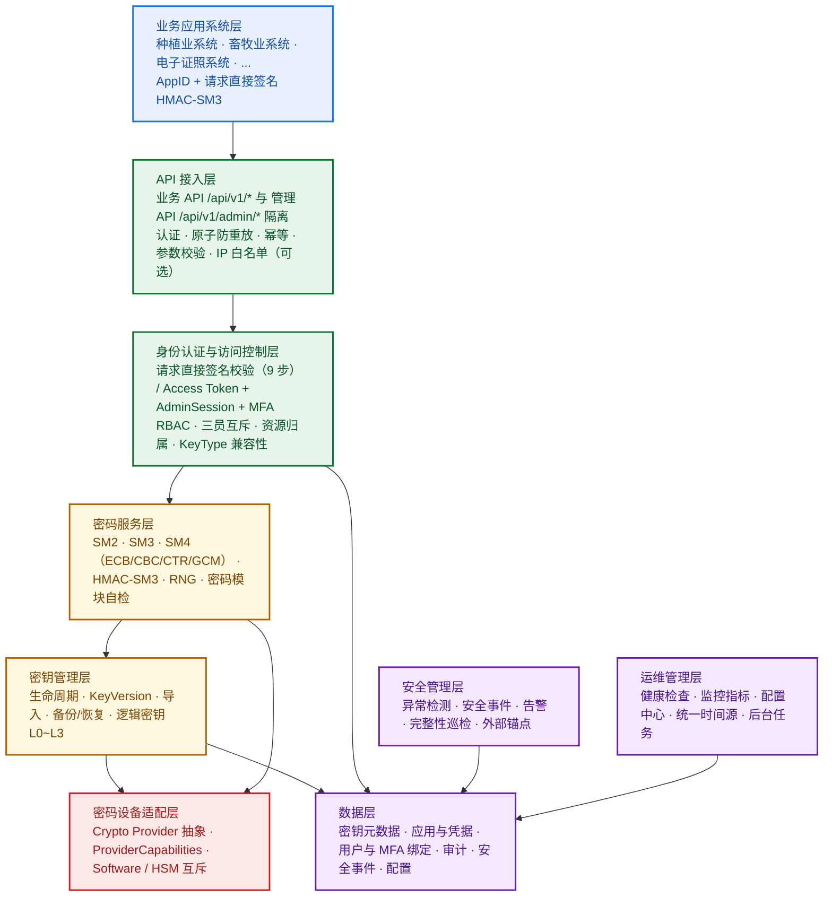

## 2.3 模块划分

| 模块               | 职责                                                                    | 关键设计章节 |
| ------------------ | ----------------------------------------------------------------------- | ------------ |
| API 接入模块       | 路由、请求解析、统一响应、RequestId、体量限制、限流                     | 9.1          |
| 认证模块（业务）   | 请求签名校验、时间窗口、Nonce 原子防重放、AppSecret 短缓存              | 6.2～6.4     |
| 认证模块（管理端） | 登录、验证码、MFA、Access Token、AdminSession、RefreshToken             | 6.5          |
| 授权模块           | RBAC、三员互斥、权限矩阵、资源归属（含管理端 Token 规则）、KeyType 校验 | 6.6          |
| 密码服务模块       | SM2/SM3/SM4/HMAC-SM3/RNG/KAT、参数契约与长度限制                        | 4            |
| 密钥管理模块       | 生成/激活/禁用/轮换/过期/注销/销毁/导入/备份/恢复/版本                  | 5            |
| 密钥体系模块       | L0～L3 分层、Root Key/KEK/UserDataDEK、加载自检、主密码恢复             | 3            |
| 密码设备模块       | 设备注册/健康检查/主备切换/证书核查/能力声明                            | 3.3、10.7    |
| 审计模块           | 全量审计、哈希链、分片聚合、外部锚点、集中外发、归档                    | 7.2～7.4     |
| 完整性模块         | IntegrityValue 计算/校验、巡检、异常处置                                | 7.6          |
| 风险与事件模块     | 异常检测、安全事件、告警规则与通知                                      | 7.5          |
| 管理控制台支撑模块 | 用户/角色/应用/设备/配置/事件/完整性的管理端接口                        | 9.5          |
| 后台任务模块       | 状态巡检、到期与轮换检查、设备健康检查、完整性抽查、临时数据清理        | 10、12.4     |
| 基础支撑模块       | 缓存、时间源、消息、日志、监控、配置                                    | 12           |

## 2.4 系统边界

**对内（本系统负责）**：密码运算、密钥生命周期、逻辑密钥分层、Root Key/KEK 管理、软件模块主密码恢复、密钥备份恢复、密码设备适配、业务 API 签名认证、管理端 Token + AdminSession + MFA、资源归属与 KeyType 校验、密钥隔离、AppSecret 加密存储与短缓存、手机号加密存储、审计链与外部锚点、审计归档与集中外发、风险检测与安全事件、数据库关键字段完整性校验、密码模块自检、HA/DR 与信创适配。

**对外（本系统不负责）**：业务数据分类分级与业务加密策略、业务系统用户身份管理、业务密钥用途决策、DoS 防护（基础设施主责）、介质物理擦除（密码设备主责）、时间同步源（基础设施主责）。

**业务系统不得直接访问**：SM2 私钥、SM4 密钥、HMAC 密钥、Root Key、KEK、AppSecret 明文、密钥材料存储；不得绕过 KeyId 资源归属校验。

## 2.5 部署视图

生产环境采用**双节点 Active-Active 应用层 + 数据库/缓存/密码设备主备**（单机房多节点），详见《国密加密服务系统生产环境双节点部署架构》V1.0。与本设计的对应关系：

| 部署要素     | 设计要求                                                                          |
| ------------ | --------------------------------------------------------------------------------- |
| 应用节点     | 无状态（Session 不落本地），Token/Nonce/撤销列表落缓存与数据库                    |
| 缓存         | Nonce、撤销列表、幂等记录、AppSecret 短缓存、分布式锁；**不得存储密钥材料** |
| 数据库       | 国产 P0 数据库主备；审计按时间分区；账号四级最小权限                              |
| 密码设备     | HSM 主备（或软件密码模块），独立网络；能力声明登记于 CryptoDevice                 |
| 时间源       | 全节点统一 NTP；签名窗口与 Token 超时判定依赖                                     |
| 外部锚点存储 | 与平台数据库物理隔离                                                              |

## 2.6 技术栈

C# / .NET 10、ASP.NET Core 10、Entity Framework Core 10、国产 P0 数据库（EF Core Provider 验证）、信创缓存（TongRDS / 达梦 CDM / 宝兰德，兼容 Redis 协议）、Serilog、OpenAPI/Scalar、国密密码库（国产）、HSM 厂商 SDK、统一 NTP。

## 2.7 两类请求处理模型

### 2.7.1 业务 API（请求直接签名）

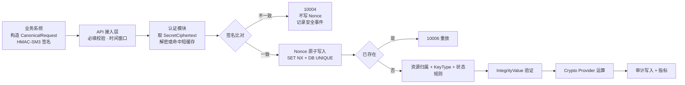

### 2.7.2 管理端 API（Token + 会话 + MFA）

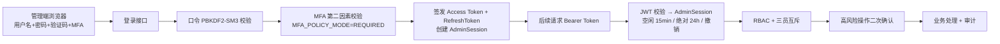

---

# 3. 密钥体系设计（L0～L3 + Provider）

> 需求依据：3.11.1～3.11.6、F-RK-001～013、F-KEK-001～007、5.6、D-23/D-24、NF-CMP-015。

## 3.1 逻辑密钥分层模型

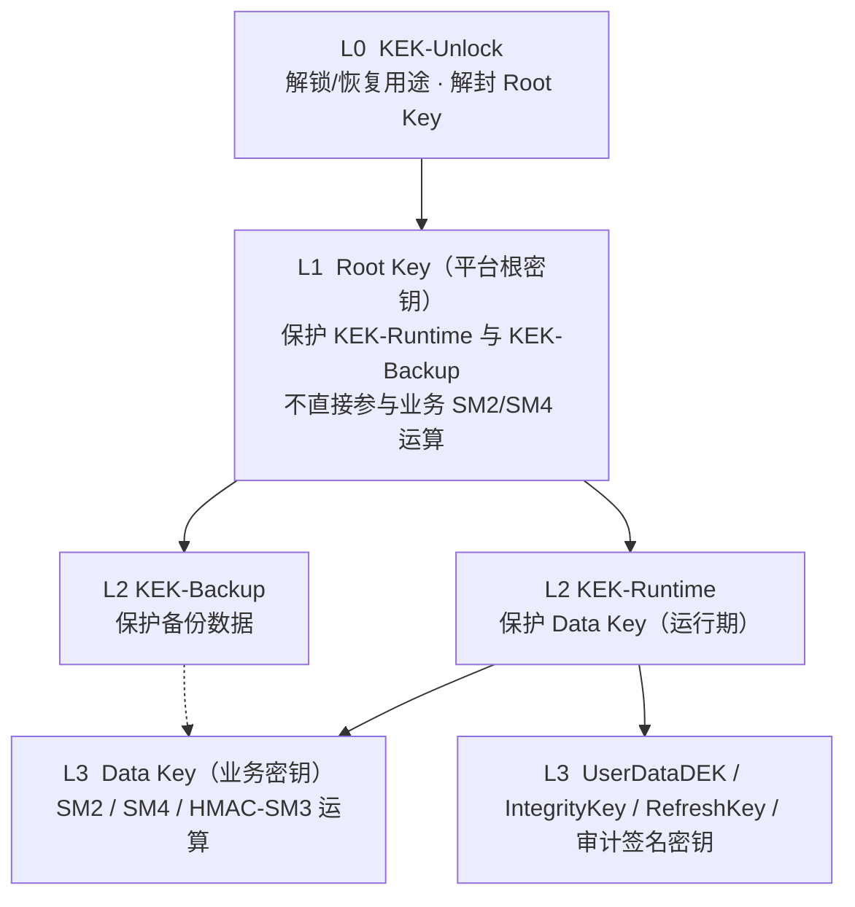

**关键原则**

1. 该模型为**逻辑模型**，四种密钥的物理形态由 Provider 决定，不得假设四者同为数据库密文；
2. Root Key **不执行业务密码运算**，仅通过 Wrap/Unwrap 测试 KEK 验证其可用性；
3. L0 仅 Software Provider 强制实现；HSM 场景由设备安全域访问控制替代；
4. 部署模式**互斥**：同一平台实例只能启用 Software 或 HSM 之一；切换须完整迁移密钥体系并经安全管理员审批。

## 3.2 Provider 物理实现差异

### 3.2.1 Software Provider（软件密码模块，允许用于生产）

```text
管理员主密码 → PBKDF2-SM3 → KEK-Unlock（OS 密钥库二次保护）
      ↓ Unwrap
Root Key（数据库密文，Wrapped）
      ↓ Wrap
KEK-Runtime / KEK-Backup
      ↓ Wrap
Data Key（WrappedMaterial 存库）
```

| 处理项      | 设计要求                                                                                                                     |
| ----------- | ---------------------------------------------------------------------------------------------------------------------------- |
| 主密码      | 启动时由管理员输入，**不在系统内存储**（F-RK-008）                                                                     |
| KDF         | **PBKDF2-SM3**；Salt、迭代次数、输出长度须在详细设计阶段冻结（参数表见 §3.7），测试阶段不得临时变更（F-RK-009、I-16） |
| OS 安全存储 | 派生的 KEK-Unlock 由操作系统密钥库（DPAPI / Keyring / TPM）二次保护（F-RK-010）                                              |
| 密钥材料    | WrappedMaterial 入库；明文材料仅存在于受保护内存                                                                             |
| 合规声明    | 部署文档与密评材料中必须声明"密评前需与测评机构确认软件模块合规性"（F-RK-011）                                               |

### 3.2.2 HSM Provider

```text
HSM Security Domain
      ↓
HSM Master Key（设备内部 Root of Trust，不由平台直接管理，不可导出）
      ↓
Platform Root Key（HSM 内专用 Key Object / Key Reference）
      ↓
Runtime KEK（HSM 内受保护 KEK）
      ↓
Data Key（HSM Key Object / Key Handle）
```

| 处理项       | 设计要求                                                                                                   |
| ------------ | ---------------------------------------------------------------------------------------------------------- |
| KEK-Unlock   | 不在平台软件层强制实现，由设备安全域/访问控制替代                                                          |
| Root Key     | 平台 L1 逻辑密钥，在 HSM 内以专用 Key Object 存在；**可按 Provider 能力执行平台侧轮换与重包裹**      |
| 边界声明     | **HSM Master Key ≠ 平台 Root Key**；不得要求导出 Platform Root Key（F-RK-012）                      |
| 平台数据模型 | 仅保存 KeyId / KeyVersion / ProviderId / ProviderReference / ProviderKeyIdentity，**不保存密钥材料** |
| 密钥材料导出 | 默认禁止；是否支持由 Capability 决定，且不得突破安全策略                                                   |

## 3.3 Provider 接口与能力模型

### 3.3.1 接口分层

```text
Crypto.Abstractions
 ├── ICryptoProvider            // 必选：业务密码运算（SM2/SM3/SM4/HMAC-SM3/RNG）
 ├── IProviderKeyManagement     // 必选：密钥生成、销毁
 ├── IProviderKeyWrap           // 必选（最小准入集）：Wrap/Unwrap
 ├── IProviderKeyBackup         // 可选：备份/恢复
 ├── IProviderKeyImportExport   // 可选：导入/导出
 ├── IProviderRootKey           // 可选：Root Key 轮换/重包裹
 └── IProviderHealth             // 必选：健康检查与自检
```

### 3.3.2 ProviderCapabilities 能力声明

| 能力项                                 | 最小准入集 | 说明                                             |
| -------------------------------------- | ---------- | ------------------------------------------------ |
| `CanWrapKey` / `CanUnwrapKey`      | ✅ 必需    | KEK 包裹/解包；缺失则 Provider**不得准入** |
| `CanGenerateKey` / `CanDestroyKey` | ✅ 必需    | 密钥生成与销毁                                   |
| `CanSelfTest`                        | ✅ 必需    | KAT 自检                                         |
| `CanRotateRootKey`                   | 可选       | 不支持时 Root Key 轮换接口返回`NotSupported`   |
| `CanRewrapKey`                       | 可选       | 支持 KEK 轮换时的重包裹                          |
| `CanBackupKey` / `CanRestoreKey`   | 可选       | 不支持时备份/恢复接口返回`NotSupported`        |
| `CanImportKey` / `CanExportKey`    | 可选       | 不支持时导入/导出接口返回`NotSupported`        |
| `CanMigrateKey`                      | 可选       | 部署模式切换时的密钥迁移                         |

**能力声明落地**：

1. 能力集在设备注册时由适配器探测并写入 `CryptoDevice.ProviderCapabilities`（JSON），且**参与 IntegrityValue 计算**；
2. 运行期调用前必须查询能力，**不支持一律返回 40005 `PROVIDER_CAPABILITY_NOT_SUPPORTED`**，禁止静默成功或静默降级；
3. 管理控制台必须对不可用能力明示（灰化 + 原因提示）。

### 3.3.3 Provider 错误语义

| Provider 返回      | 平台语义           | 平台处置                                                                              |
| ------------------ | ------------------ | ------------------------------------------------------------------------------------- |
| Success            | 成功               | 正常返回                                                                              |
| NotSupported       | 能力不支持         | 40005；不改状态；不写成功审计                                                         |
| Failed（明确失败） | 失败               | 对应业务错误码；事务回滚                                                              |
| Timeout / UNKNOWN  | **结果未知** | 标记为 UNKNOWN，禁止自动重试明文运算；对密钥生成/销毁类操作进入补偿核查流程（§11.2） |

## 3.4 Root Key 加载、验证与自检

### 3.4.1 Software Provider 启动流程

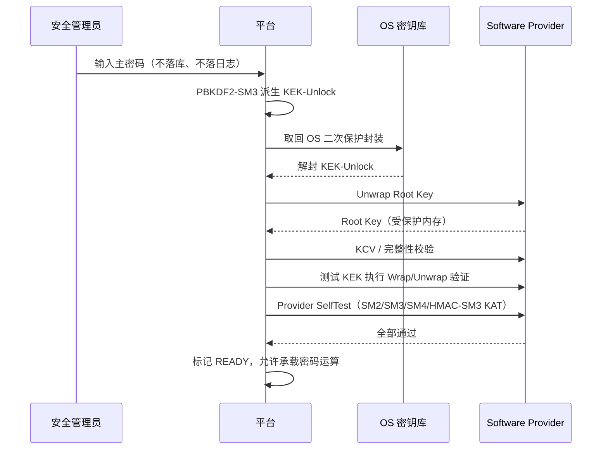

**失败处置**：任一步骤失败 → 标记 `NOT_READY`，**拒绝一切密码运算**，记录安全事件与审计，触发告警（CRITICAL）。

### 3.4.2 HSM Provider 启动流程

```text
HSM 上电 → 硬件自检（Vendor SelfTest）
   → 按能力依次执行 KeyIdentity / KCV / PublicKeyFingerprint / 厂商等价机制校验
   → 确认 Key Reference 可访问且身份匹配 → READY
   → 校验失败或 Provider 不支持必要校验能力 → NOT_READY（拒绝正常密码运算）
```

**自检能力回退规则**：校验方式优先级 `KCV → PublicKeyFingerprint → ProviderKeyIdentity/厂商等价机制`；若 Provider 无法提供任何可接受的密钥身份/完整性验证能力，**不得标记 READY**。

## 3.5 软件密码模块主密码丢失恢复（F-RK-013）

### 3.5.1 主密码备份策略

| 项       | 设计                                                   |
| -------- | ------------------------------------------------------ |
| 备份方式 | 部署时由安全管理员写入密封信封，存放于独立安全设施     |
| 备选方式 | Shamir Secret Sharing 分片托管给多名安全管理员         |
| 隔离要求 | 主密码备份**不得与平台数据库、备份介质同地存放** |
| 参数     | 分片数、最小恢复人数由部署文档确定（I-20）             |

### 3.5.2 恢复流程

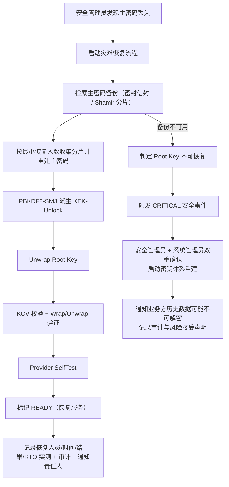

**其他要求**

1. 恢复/重建流程必须由安全管理员 + 系统管理员**双重确认**；
2. 若项目选择接受"主密码丢失即密钥体系不可恢复"的风险，必须在部署文档与密评材料中显式声明，并经需求方书面确认；
3. **每半年至少执行一次主密码恢复演练**，记录 RTO/RPO、恢复结果与问题跟踪，纳入运维报告。

## 3.6 密钥材料数据模型与备份/恢复语义

### 3.6.1 密钥材料数据模型

```text
Key
 └── KeyVersion
        └── KeyMaterial
               ├── ProviderId
               ├── StorageType      WRAPPED_DATABASE（Software） / HSM_REFERENCE（HSM）
               ├── WrappedMaterial  仅 Software
               ├── ProviderReference 仅 HSM（Key Handle / Label）
               ├── ProviderKeyIdentity 仅 HSM（KCV / PublicKeyFingerprint / 厂商等价机制）
               ├── MaterialVersion
               └── IntegrityValue
```

**设计要求**

1. 密钥材料独立于普通元数据管理，**不得与元数据明文同表存储**；
2. Software 场景密钥材料由 KEK-Runtime 保护；HSM 场景平台仅保存引用与身份值；
3. **ProviderKeyIdentity 必须参与 IntegrityValue 计算**，防止数据库篡改导致密钥引用被替换。

### 3.6.2 备份组成与恢复流程（按 Provider 分别定义）

| Provider | 备份组成                                                                                                            | 恢复流程                                                                                                                             |
| -------- | ------------------------------------------------------------------------------------------------------------------- | ------------------------------------------------------------------------------------------------------------------------------------ |
| Software | 平台数据库备份（含 Wrapped Root Key / KEK / Data Key）+**主密码备份**                                         | 恢复数据库 → 输入主密码 → 解封 Root Key → 逐层解封 KEK / Data Key → 验证                                                         |
| HSM      | 平台数据库备份（含 ProviderReference / ProviderKeyIdentity）+**HSM Vendor Backup** + HSM Security Domain 备份 | 恢复数据库 → 恢复 HSM / Security Domain → 恢复或重建 Key Reference → 校验 ProviderKeyIdentity / KCV / Fingerprint → 验证密码操作 |

**关键结论（不可妥协）**

1. **不能**把两种模式统一成"平台数据库备份 = 密钥备份"；
2. HSM 场景平台数据库备份**仅恢复元数据与 ProviderReference**，密钥材料必须由 HSM 自身机制恢复；
3. 恢复后必须通过 `Platform KeyId → ProviderReference → ProviderKeyIdentity` 建立**确定性映射**并完成身份校验；
4. HSM Vendor Backup / Security Domain Backup / Cluster Replication 属 **Provider-specific 能力**，不得抽象为通用备份 API；
5. Provider 不支持 `CanBackupKey`/`CanRestoreKey` 时接口返回 `NotSupported`，管理控制台明示；
6. `BackupRecord` **仅记录平台可观测的备份元数据**；HSM Vendor Backup 结果由 Provider 回执或管理端人工登记。

### 3.6.3 导入/导出语义

| 操作     | 前置校验                                                    | 约束                                                                                            |
| -------- | ----------------------------------------------------------- | ----------------------------------------------------------------------------------------------- |
| 密钥导入 | `CanImportKey` 能力；KeyType 校验；高风险二次确认；幂等键 | 加密保护导入；**禁止明文 HTTP 导入**；不在普通 API 响应返回材料；优先使用设备安全导入机制 |
| 密钥导出 | `CanExportKey` 能力                                       | 默认禁用；受安全策略约束，不得导出私钥/对称密钥明文；导出行为必须审计并告警                     |

## 3.7 详细设计冻结参数（软件密码模块）

| 参数         | 冻结值（设计基线）                                                                            | 依据        |
| ------------ | --------------------------------------------------------------------------------------------- | ----------- |
| KDF 算法     | PBKDF2-SM3                                                                                    | F-RK-009    |
| 迭代次数     | ≥ 100,000（最终值须经性能与环境验证后冻结，不低于 OWASP 同期建议；**编码后不得变更**） | I-04 / I-16 |
| Salt 长度    | 16 字节随机                                                                                   | I-16        |
| 派生输出长度 | 32 字节（与 Root Key 长度对齐）                                                               | I-16        |
| OS 安全存储  | DPAPI（Windows）/ Keyring（Linux 信创）/ TPM（可选）                                          | F-RK-010    |
| 主密码强度   | 遵循管理员密码策略（≥12 位、≥3 类字符）                                                     | 3.6.2       |

---

# 4. 密码服务模块设计

> 需求依据：3.1.1～3.1.7、F-SM2-001～007、F-SM3-001～002、F-SM4-001～005、F-HMAC-001～002、F-RNG-001～003、F-KAT-001～004、D-01～D-05、D-26、D-33、D-34。

## 4.1 模块结构

```text
CryptoPlatform.Crypto
 ├── Sm2Service            SM2 密钥对/加密/解密/签名/验签
 ├── Sm3Service            SM3 Hash（含流式）
 ├── Sm4Service            SM4-EBC/CBC/CTR/GCM
 ├── HmacSm3Service        HMAC-SM3 生成/验证
 ├── RandomService         随机数（HSM TRNG 优先，OS CSPRNG 兜底）
 ├── SelfTestService       KAT 上电/周期/按需自检
 ├── KeyTypeGuard          KeyType 兼容性校验
 ├── GcmNonceAllocator     GCM Nonce 确定性唯一性分配
 ├── CounterService        CTR/GCM 计数器持久化与全节点聚合
 └── ProviderRouter        按 KeyId → Provider 路由
```

**统一处理链**（所有密码运算接口一致）：

```text
认证 → 参数校验 → KeyType 兼容性 → Key 状态与版本规则 →
IntegrityValue 验证 → KeyId 资源归属 → Provider 路由 → 运算 → 审计 → 指标
```

## 4.2 SM2

### 4.2.1 参数与编码（D-01/D-02）

| 项           | 设计值                                                           | 说明                         |
| ------------ | ---------------------------------------------------------------- | ---------------------------- |
| 标准         | GM/T 0003                                                        | —                           |
| 曲线参数     | 项目要求的 SM2 曲线参数（默认推荐曲线）                          | 与密码设备能力对齐           |
| 默认签名编码 | **DER**                                                    | 接口显式声明或使用平台默认值 |
| 默认密文编码 | **C1C3C2**                                                 | 接口显式声明                 |
| 长度限制     | 单次加密数据**≤512 字节**（默认，按 Provider 能力可调整） | 超限返回**20001**      |
| 签名数据长度 | 不限（受 NF-PERF-014 请求体限制）；大消息应先 SM3 摘要再签名     | —                           |

**差异登记**：若部署的密码设备仅支持其他编码（如 Raw 签名、C1C2C3 密文），必须在本节差异表登记并在接口契约中显式声明，**禁止平台侧静默转换**。

### 4.2.2 接口契约

| 接口     | 方法 | 路径                           | 关键请求字段                                                    | 关键响应字段               |
| -------- | ---- | ------------------------------ | --------------------------------------------------------------- | -------------------------- |
| 公钥加密 | POST | `/api/v1/crypto/sm2/encrypt` | keyId、keyVersion?、data（Base64）、cipherEncoding?             | ciphertext、cipherEncoding |
| 私钥解密 | POST | `/api/v1/crypto/sm2/decrypt` | keyId、keyVersion?、ciphertext、cipherEncoding?                 | data（Base64）             |
| 私钥签名 | POST | `/api/v1/crypto/sm2/sign`    | keyId、keyVersion?、data、dataEncoding?、signEncoding?、userId? | signature、signEncoding    |
| 公钥验签 | POST | `/api/v1/crypto/sm2/verify`  | keyId、keyVersion?、data、signature、signEncoding?              | valid（bool）              |

> 说明：需求 V2.9 未逐接口给出字段表（见 A 提取文档"原文未明确"清单），上表为本文档依据 §6.5/6.6 接口清单与算法要求补全的设计契约，**需在联调前经需求方确认**（见 §14.2）。

## 4.3 SM3 与 HMAC-SM3

### 4.3.1 SM3

| 项         | 设计                                                                    |
| ---------- | ----------------------------------------------------------------------- |
| 标准       | GM/T 0004；摘要长度 256 位                                              |
| 输出编码   | Base64 / Hex / 字节流                                                   |
| 流式       | 支持大数据流式摘要；**大文件不得强制一次性载入内存**（F-SM3-002） |
| 无密钥操作 | 不校验 KeyId 归属，但仍需身份认证、参数校验与访问控制                   |

### 4.3.2 HMAC-SM3

| 项                   | 设计                                                                                                  |
| -------------------- | ----------------------------------------------------------------------------------------------------- |
| 密钥管理             | HMAC 密钥由平台统一管理；**不允许调用方提交托管密钥明文**                                       |
| 输出编码             | Base64 / Hex                                                                                          |
| 验证失败             | 只返回"验证失败"结果，不泄露内部比对细节（防侧信道）                                                  |
| 历史版本语义（D-31） | **Verify 允许历史版本**（ROTATED/EXPIRED/REVOKED）；**Generate 必须使用当前 ACTIVE 版本** |
| 用途                 | （1）业务 API 请求签名；（2）IntegrityValue 计算；（3）RefreshToken 哈希；（4）PasswordHash 派生      |

## 4.4 SM4

### 4.4.1 支持模式与选择原则

| 模式 | 定位                                               | 关键约束                                             |
| ---- | -------------------------------------------------- | ---------------------------------------------------- |
| ECB  | **仅兼容已有业务**，新业务原则上不得默认使用 | 需在配置中显式开启                                   |
| CBC  | 兼容与通用加密                                     | 必须明确 IV 与 Padding（PKCS#7）                     |
| CTR  | 流式加密                                           | 必须明确计数器规则（见 §4.4.3）                     |
| GCM  | **新业务默认推荐**                           | Nonce/Tag/AAD 严格约束；Tag 校验失败整体判定解密失败 |

> 原则：CBC/CTR **仅提供机密性，不提供认证完整性**；涉及"机密性 + 完整性"的新业务优先 SM4-GCM。

### 4.4.2 IV/Nonce 责任与契约

| 模式 | IV/Nonce 生成方                  | 平台责任                        | 调用方责任               | 重复检测                                |
| ---- | -------------------------------- | ------------------------------- | ------------------------ | --------------------------------------- |
| CBC  | 平台生成（默认），允许调用方传入 | 生成安全随机 IV；校验传入长度   | 保证唯一                 | 按`KeyId + IV` 短窗口重复检测         |
| CTR  | 平台生成（默认），允许调用方传入 | 生成随机计数器初值；校验长度    | 保证不重复               | 按`KeyId + Counter` 短窗口重复检测    |
| GCM  | **平台强制生成**           | 密钥生命周期内保证 Nonce 不重复 | **不得传入 Nonce** | 维护 Nonce 使用记录，超阈值触发轮换告警 |

### 4.4.3 SM4-CTR 计数器规则（D-33）

| 项         | 规则                                                                                                                              |
| ---------- | --------------------------------------------------------------------------------------------------------------------------------- |
| 计数器长度 | 16 字节（128 位），与分组长度一致                                                                                                 |
| 初始值     | 平台默认生成安全随机 16 字节初值；调用方传入时必须提供完整 16 字节                                                                |
| 递增方式   | 无符号**大端序 +1**                                                                                                         |
| 溢出       | **禁止回绕**：到达最大值时停止该 KeyVersion 的新 CTR 加密请求，触发该 Data Key 的 KeyVersion 轮换告警；历史密文解密不受影响 |
| 重复检测   | 按`KeyId + Counter` 短窗口重复检测                                                                                              |
| 调用计数   | 按 KeyVersion 聚合 CTR 加密计数，**2³¹ 告警阈值**                                                                         |
| 事件       | 溢出为安全事件/关键运行事件，必须审计并告警                                                                                       |

### 4.4.4 SM4-GCM 确定性唯一性（D-25、M-01、M-02）

**Nonce 构造（固定，不得使用字符串格式或平台默认字节序）**

```text
Nonce(12 字节) = KeyVersion(4B 大端序) || NodeId(4B 大端序) || MonotonicCounter(4B 大端序)
```

| 项                   | 规则                                                                                                                                                                                                                                                                                         |
| -------------------- | -------------------------------------------------------------------------------------------------------------------------------------------------------------------------------------------------------------------------------------------------------------------------------------------- |
| 参数默认值           | Nonce 12 字节（平台生成）；Tag 16 字节；AAD 允许调用方传入且**≤64 字节**，默认空                                                                                                                                                                                                      |
| 场景覆盖             | Node 重启、容器重启、主备切换、时钟异常、数据库不可用                                                                                                                                                                                                                                        |
| Counter 持久化       | 每个`(KeyId, KeyVersion, NodeId)` 三元组维护持久化计数器                                                                                                                                                                                                                                   |
| 溢出处置（M-01）     | MonotonicCounter 达最大可用值时**禁止回绕**；处置对象**仅限该 Data Key / KeyVersion**：停止其新加密请求并自动触发该 Data Key 的 KeyVersion 轮换（新版本从独立计数空间开始）；历史密文解密不受影响；**Root Key / KEK 轮换不得由溢出事件自动触发**，仅产生"建议评估轮换"告警 |
| 平台总量约束（M-02） | 每个 KeyVersion 的 GCM 加密调用总次数（**全节点合计**）**不得超过 2³²**；平台按 KeyVersion 聚合全节点计数（数据库统一聚合 + 周期性汇总）；**2³¹ 告警**、预留轮换缓冲；达上限前必须完成强制轮换并审计                                                                   |
| NodeId 分配（I-15）  | 由平台统一分配，节点重启后保持不变；节点退役后**不再复用**；含注册、心跳、冲突检测机制；冲突触发安全事件并停止 GCM 运算                                                                                                                                                                |
| 溢出/冲突事件        | 写入审计并触发告警；GCM 冲突级别为 CRITICAL                                                                                                                                                                                                                                                  |

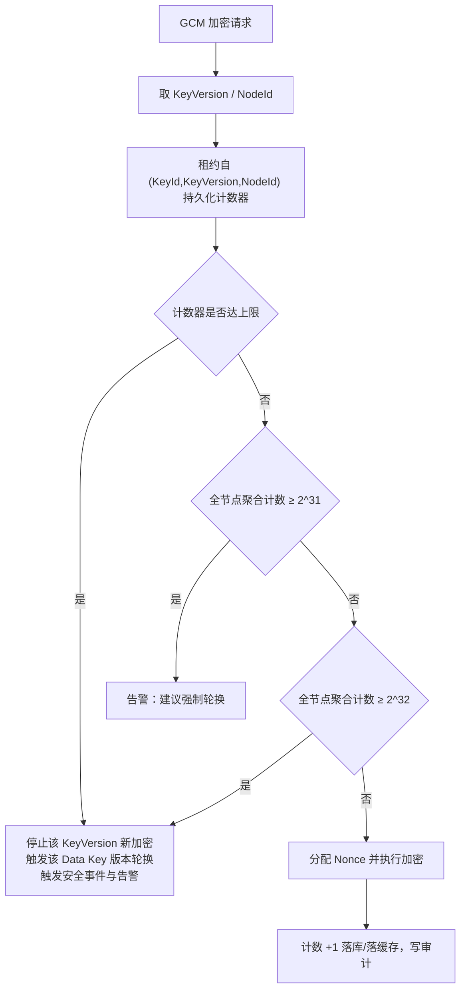

## 4.5 随机数服务（D-26）

| 项         | 设计                                                                                                     |
| ---------- | -------------------------------------------------------------------------------------------------------- |
| HTTP 方法  | **POST** `/api/v1/crypto/random`                                                                 |
| 长度       | 支持指定字节长度；**单次最大输出默认 64KB，可配置上限 1MB**                                        |
| 独立性     | 该上限**独立定义，不得复用 NF-PERF-014**（请求体大小限制）                                         |
| 超限       | 返回**20001 `PARAM_DATA_TOO_LARGE`**                                                             |
| 来源优先级 | ① HSM 真随机数发生器（HSM 模式）→ ② 操作系统 CSPRNG（软件模块模式）→**禁止非密码学安全随机数** |
| 大批量     | 通过多次请求获取，避免单次请求过大                                                                       |
| 配置项     | 受`F-CFG-008` 控制（默认 64KB / 上限 1MB）                                                             |

## 4.6 密码模块自检

| 项           | 设计                                                                                     |
| ------------ | ---------------------------------------------------------------------------------------- |
| 类型         | 上电自检（KAT）、周期自检（**默认 24 小时**，可配置）、按需自检（管理员触发）      |
| 覆盖         | SM2、SM3、SM4、HMAC-SM3、随机数                                                          |
| 测试向量     | GM/T 标准测试向量                                                                        |
| 失败处置     | 模块标记不可用，**拒绝所有密码运算请求**，记录安全事件（CRITICAL）与审计，触发告警 |
| 接口         | `POST /api/v1/crypto/self-test`；错误码 **30003**                                |
| 健康检查联动 | `/health` 中 `cryptoModule` 组件状态为不可用；`/ready` 返回未就绪                  |

## 4.7 KeyType 兼容性校验

| KeyType | 允许操作                              |
| ------- | ------------------------------------- |
| SM2     | SM2 Encrypt / Decrypt / Sign / Verify |
| SM4     | SM4 Encrypt / Decrypt                 |
| HMAC    | HMAC Generate / Verify                |

**拒绝场景示例**：SM4 Key 做 SM2 Sign；HMAC Key 做 SM4 Encrypt；SM2 Key 做 HMAC Generate。

**错误码**：**12003 `KEY_TYPE_MISMATCH`**；同一 `AppId + KeyType` 5 分钟内 5 次不兼容操作记录安全事件（3.5.3）。

> 注意：平台**不校验 KeyUsage 业务语义**（该字段与校验已于 V2.6 删除），仅校验密码学兼容性。

## 4.8 算法参数冻结表

| 参数                      | 冻结值                               | 依据        |
| ------------------------- | ------------------------------------ | ----------- |
| SM2 签名编码 / 密文编码   | DER / C1C3C2                         | D-01、D-02  |
| SM2 单次加密最大长度      | 512 字节（可按 Provider 调整并登记） | D-34        |
| SM4-GCM Nonce / Tag / AAD | 12B（平台生成）/ 16B / ≤64B         | D-03、D-04  |
| SM4-CBC IV / Padding      | 16B（平台生成）/ PKCS#7              | D-05        |
| SM4-CTR 计数器            | 16B 大端序 +1，禁止回绕              | D-33        |
| 随机数单次上限            | 默认 64KB，上限 1MB                  | D-26        |
| 请求体上限                | 10MB                                 | NF-PERF-014 |
| 签名时间窗口              | ±3 分钟                             | D-17        |
| Nonce TTL                 | 6 分钟                               | D-18        |
| 口 令 Hash                | PBKDF2-SM3（参数见 §3.7）           | I-16        |

---

# 5. 密钥生命周期设计

> 需求依据：3.2.1～3.2.23、F-KM-001～015、F-KM-020、F-DI-001～003、D-30、D-31。

## 5.1 领域模型

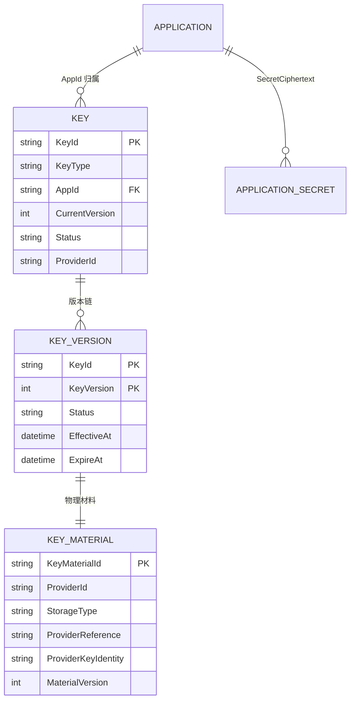

**Key 基本属性**：KeyId、KeyType、KeyVersion、AppId、状态、创建时间、生效时间、过期时间、轮换策略、创建者、创建来源（生成/导入）、ProviderId、StorageType、AlgorithmParams、销毁时间、MetadataIntegrityValue。

**Key 分类**

| KeyType | 算法     | 用途                                     |
| ------- | -------- | ---------------------------------------- |
| SM2     | SM2      | 由三方系统自行决定（平台不约束业务语义） |
| SM4     | SM4      | 同上                                     |
| HMAC    | HMAC-SM3 | 同上                                     |

**核心属性不可变（F-KM-020）**：KeyType、所属 AppId 等核心属性创建后**原则上不可修改**；确需变更须新建密钥并按轮换流程迁移。

## 5.2 状态机

### 5.2.1 Key 状态机（ST-KM-001～018）

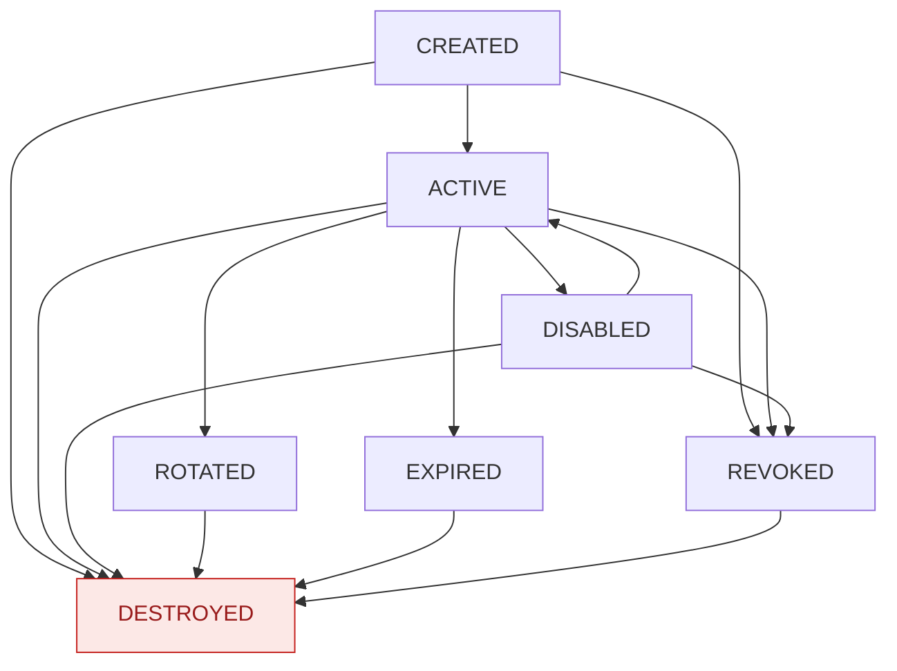

| 编号      | 当前      | 目标      | 允许         | 条件                         |
| --------- | --------- | --------- | ------------ | ---------------------------- |
| ST-KM-001 | CREATED   | ACTIVE    | 是           | 激活                         |
| ST-KM-002 | CREATED   | REVOKED   | 是           | 异常/人工撤销                |
| ST-KM-003 | CREATED   | DESTROYED | 是           | 销毁                         |
| ST-KM-004 | ACTIVE    | DISABLED  | 是           | 临时禁用                     |
| ST-KM-005 | ACTIVE    | ROTATED   | 是           | 新版本产生                   |
| ST-KM-006 | ACTIVE    | EXPIRED   | 系统自动     | 到期                         |
| ST-KM-007 | ACTIVE    | REVOKED   | 是           | 安全事件                     |
| ST-KM-008 | ACTIVE    | DESTROYED | 是           | 满足销毁条件                 |
| ST-KM-009 | DISABLED  | ACTIVE    | 是           | 重新激活                     |
| ST-KM-010 | DISABLED  | REVOKED   | 是           | 永久撤销                     |
| ST-KM-011 | DISABLED  | DESTROYED | 是           | 销毁                         |
| ST-KM-012 | ROTATED   | ACTIVE    | **否** | 不允许旧版本重新成为当前版本 |
| ST-KM-013 | ROTATED   | DESTROYED | 是           | 满足销毁条件                 |
| ST-KM-014 | EXPIRED   | ACTIVE    | **否** | 原则上不得重新激活           |
| ST-KM-015 | EXPIRED   | DESTROYED | 是           | 销毁                         |
| ST-KM-016 | REVOKED   | ACTIVE    | **否** | 不允许重新激活               |
| ST-KM-017 | REVOKED   | DESTROYED | 是           | 销毁                         |
| ST-KM-018 | DESTROYED | 任意      | **否** | 终态                         |

### 5.2.2 KeyVersion 状态机（ST-KV-001～014，V2.9 新增）

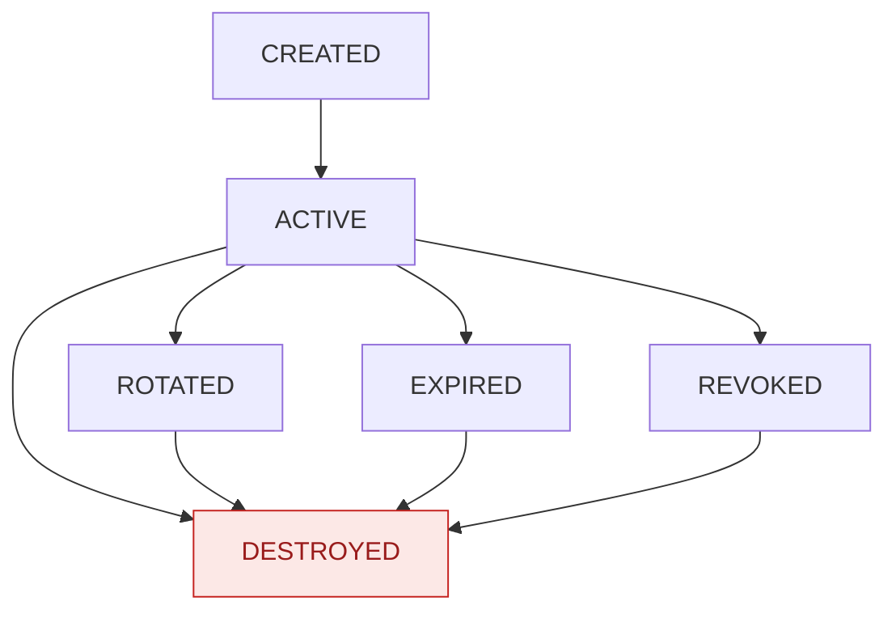

| 编号      | 当前      | 目标      | 允许         | 条件                         |
| --------- | --------- | --------- | ------------ | ---------------------------- |
| ST-KV-001 | CREATED   | ACTIVE    | 是           | Key 激活时同步激活当前版本   |
| ST-KV-002 | CREATED   | REVOKED   | 是           | Key 被撤销                   |
| ST-KV-003 | CREATED   | DESTROYED | 是           | Key 销毁                     |
| ST-KV-004 | ACTIVE    | ROTATED   | 是           | Key 轮换，旧版本转 ROTATED   |
| ST-KV-005 | ACTIVE    | EXPIRED   | 系统自动     | Key 到期                     |
| ST-KV-006 | ACTIVE    | REVOKED   | 是           | Key 被撤销                   |
| ST-KV-007 | ACTIVE    | DESTROYED | 是           | Key 销毁                     |
| ST-KV-008 | ROTATED   | ACTIVE    | **否** | 历史版本不得重新成为当前版本 |
| ST-KV-009 | ROTATED   | DESTROYED | 是           | Key 销毁                     |
| ST-KV-010 | EXPIRED   | ACTIVE    | **否** | 不得重新激活                 |
| ST-KV-011 | EXPIRED   | DESTROYED | 是           | Key 销毁                     |
| ST-KV-012 | REVOKED   | ACTIVE    | **否** | 不得重新激活                 |
| ST-KV-013 | REVOKED   | DESTROYED | 是           | Key 销毁                     |
| ST-KV-014 | DESTROYED | 任意      | **否** | 终态                         |

**协同规则**：Key 状态变更时同步驱动当前 KeyVersion 状态；历史版本状态独立维护；**"使用"不是独立状态**，而是 ACTIVE 下的行为。

## 5.3 运算级规则与版本选择契约

| 密钥状态  | 当前版本 | 加密 | 解密         | 签名 | 验签         | 查询 | 备注                        |
| --------- | -------- | ---- | ------------ | ---- | ------------ | ---- | --------------------------- |
| CREATED   | 是       | 否   | 否           | 否   | 否           | 是   | 未激活                      |
| ACTIVE    | 是       | 是   | 是           | 是   | 是           | 是   | 正常                        |
| DISABLED  | 是       | 否   | 否           | 否   | 否           | 是   | 临时禁用                    |
| ROTATED   | 否       | 否   | **是** | 否   | **是** | 是   | 历史版本，允许历史解密/验签 |
| EXPIRED   | 否       | 否   | **是** | 否   | **是** | 是   | 过期，允许历史解密/验签     |
| REVOKED   | 否       | 否   | **是** | 否   | **是** | 是   | 注销，默认允许历史解密/验签 |
| DESTROYED | 否       | 否   | 否           | 否   | 否           | 是   | 终态，仅保留元数据查询      |

**规则说明（V2.9 补充 HMAC 语义，D-31）**

1. 加密、签名、**HMAC Generate** 必须使用当前 ACTIVE 版本；
2. 解密、验签（**含 HMAC Verify**）允许历史版本；
3. DISABLED 状态禁止一切密码运算；
4. REVOKED 状态下的历史解密/验签由安全策略配置（默认允许）；
5. 指定历史版本时必须显式传 `keyVersion`；未指定则使用当前 ACTIVE 版本；
6. 指定不存在的版本返回 **40003**；状态不允许的操作返回 **40004**。

## 5.4 各操作详细设计

| 操作     | 接口                                                               | 前置校验                                                          | 后置处理                                                                              | 错误码      |
| -------- | ------------------------------------------------------------------ | ----------------------------------------------------------------- | ------------------------------------------------------------------------------------- | ----------- |
| 生成     | `POST /api/v1/keys`（业务）`POST /api/v1/admin/keys`（管理端） | 权限（PERM_KEY_CREATE）、KeyType 白名单、配额、幂等键（业务入口） | Key/KeyVersion/KeyMaterial 落库，状态 CREATED，计算 IntegrityValue，通知安全管理员    | 40002/40005 |
| 查询     | `GET /api/v1/keys/{keyId}`                                       | 资源归属、完整性验证                                              | **不得返回任何密钥材料**（SM2 私钥/SM4 密钥/HMAC 密钥/Root Key/KEK/AppSecret）  | 12001/90001 |
| 激活     | `POST /api/v1/keys/{keyId}/activate`                             | 状态为 CREATED                                                    | Key→ACTIVE，当前 KeyVersion→ACTIVE，写 ActivatedAt                                  | 40002       |
| 禁用     | `POST /api/v1/keys/{keyId}/disable`                              | 状态为 ACTIVE                                                     | ACTIVE→DISABLED；禁止加密/解密/签名/验签，允许查询                                   | 40002       |
| 重新激活 | `POST /api/v1/keys/{keyId}/enable`                               | 状态为 DISABLED                                                   | DISABLED→ACTIVE                                                                      | 40002       |
| 轮换     | `POST /api/v1/keys/{keyId}/rotate`                               | 权限、幂等键、能力（如需重包裹）                                  | 旧版本→ROTATED，新版本→ACTIVE，KeyId 不变、KeyVersion 递增，写新版本 IntegrityValue | 40002/40005 |
| 轮换策略 | 配置驱动                                                           | 支持按时间/调用次数/数据量/手工/安全事件触发                      | 触发源记录审计                                                                        | —          |
| 过期     | 后台任务                                                           | 按 ExpireAt 判定                                                  | ACTIVE→EXPIRED（Key 与当前版本），记录审计                                           | —          |
| 注销     | `POST /api/v1/keys/{keyId}/revoke`                               | 权限、二次确认、幂等键                                            | →REVOKED；历史解密/验签按策略                                                        | 40002       |
| 销毁     | `POST /api/v1/keys/{keyId}/destroy`                              | 见 §5.5                                                          | →DESTROYED（终态）                                                                   | 40002/40005 |
| 导入     | `POST /api/v1/keys/import`                                       | CanImportKey、KeyType、高风险二次确认、幂等键                     | 加密保护导入，落库并计算 IntegrityValue                                               | 40005/12003 |
| 备份     | `POST /api/v1/keys/{keyId}/backup`                               | CanBackupKey                                                      | 生成加密备份 + BackupRecord                                                           | 40005       |
| 恢复     | `POST /api/v1/keys/restore`                                      | CanRestoreKey、备份完整性、来源、版本、目标环境                   | 恢复后必须执行恢复身份校验                                                            | 40005       |
| 恢复验证 | `POST /api/v1/keys/{keyId}/verify-recovery`                      | —                                                                | 执行 SM2/SM4/HMAC 实际运算验证                                                        | 30001       |
| 版本查询 | `GET /api/v1/keys/{keyId}/versions`                              | 资源归属                                                          | 返回版本链（不含材料）                                                                | 40003       |
| 列表     | `GET /api/v1/keys`                                               | 资源归属 / 管理端权限                                             | 分页（见 §9.1）                                                                      | —          |

**Key 隔离（F-KM-013 配套）**：后端必须执行 `AppId` 与 `KeyId` 归属校验；越权访问拒绝并记录审计与安全事件（12001，阈值 1 次即告警）。

## 5.5 销毁与归档材料处置

### 5.5.1 销毁流程（必做 9 步）

1. 校验当前状态；
2. 校验操作权限（安全管理员）；
3. **二次确认**（MFA 优先，特殊场景口令/验证码）；
4. 记录审计；
5. **调用 Provider 销毁在线密钥对象**（Software：安全擦除数据库密文；HSM：调用 HSM 销毁接口）；
6. 验证在线材料不可恢复；
7. 保留必要元数据（含 IntegrityValue）；
8. **标记运行备份中对应密钥材料为待擦除**；
9. 归档备份中对应密钥材料保留（ARCHIVE MATERIAL）。

> `DestroyKeyAsync` 必须返回明确执行结果与失败原因；Provider 不支持销毁能力或设备异常时，**不得将 Key 置为 DESTROYED**，应返回明确错误并记录安全事件。

### 5.5.2 材料分类

| 概念             | 定义                                                                                                      |
| ---------------- | --------------------------------------------------------------------------------------------------------- |
| ONLINE MATERIAL  | 在线运行密钥材料；参与密码运算；受 Provider 保护                                                          |
| ARCHIVE MATERIAL | 归档密钥材料；独立 KEK-Backup 保护；**仅历史解密/验签**；禁止新加密、新签名、新 MAC、新 Wrap/Unwrap |
| DESTROYED        | 在线运行密钥材料已销毁；归档材料不被销毁                                                                  |

### 5.5.3 销毁后备份处置策略

| 备份类型 | 用途                       | 保留周期              | 销毁后处置                                                                                                                   |
| -------- | -------------------------- | --------------------- | ---------------------------------------------------------------------------------------------------------------------------- |
| 运行备份 | 故障恢复、日常恢复验证     | ≥90 天（NF-BAK-001） | 密钥销毁后，对应材料应在**30 天内安全擦除**并验证擦除结果、记录审计                                                    |
| 归档备份 | 合规追溯、历史解密能力保留 | 长期（NF-BAK-003）    | 保留元数据与历史解密所需材料（ARCHIVE MATERIAL），由 KEK-Backup 加密；访问需安全管理员**二次确认**、记录审计并触发告警 |

## 5.6 事务、并发与补偿

| 场景             | 设计                                                                                                                                                                                              |
| ---------------- | ------------------------------------------------------------------------------------------------------------------------------------------------------------------------------------------------- |
| 创建事务         | Provider 生成材料 → 事务内写 Key/KeyVersion/KeyMaterial/IntegrityValue；**Provider 成功但数据库失败**时：不重试生成，转入补偿核查（按 ProviderReference 查询并清理孤儿材料），记录安全事件 |
| 激活事务         | Key 与 KeyVersion 状态在同一事务内更新；失败整体回滚                                                                                                                                              |
| 轮换并发         | 使用数据库行锁 + 版本号乐观锁；并发轮换仅允许一个成功，其余返回 40002；轮换过程不得中断存量运算                                                                                                   |
| 销毁并发         | 销毁为幂等操作（Idempotency-Key）；并发销毁仅执行一次实际擦除                                                                                                                                     |
| Provider UNKNOWN | 按 §11.2 处理：进入待核查状态，人工/后台核验 Provider 侧实际结果后收敛                                                                                                                           |
| 完整性值一致性   | 所有写操作**在同一事务内**计算并写入 IntegrityValue，避免中间态                                                                                                                             |

## 5.7 密钥轮换后的历史数据处理

1. 旧版本材料保留（ROTATED），支持历史解密与验签；
2. 新加密/签名一律走新版本；
3. 数据侧迁移由业务方驱动；平台提供按版本运算能力；
4. 归档材料与在线材料的 KEK 分离（KEK-Backup）；
5. 全节点调用计数（GCM/CTR）在新版本从新计数空间开始。

---

# 6. 认证与授权设计

> 需求依据：3.3.1～3.3.6、6.2、6.3、6.5、6.10、8.3、8.4、8.17、F-AUTH-001～030、F-CON-001～013、NF-CMP-014/017、D-06/D-07/D-16/D-19/D-28/D-29。

## 6.1 双认证模型总览

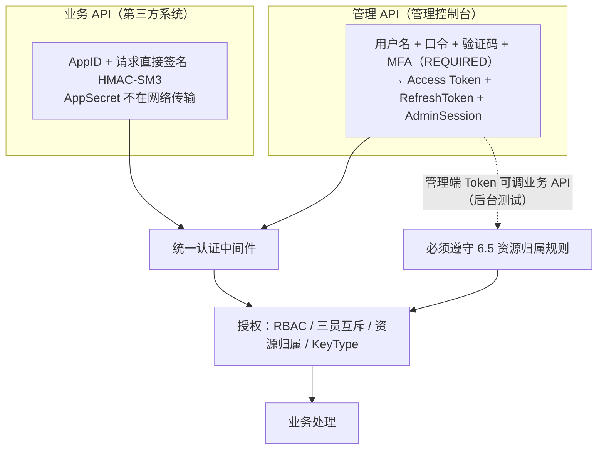

**互斥规则**：第三方系统**禁止使用管理端 Token** 访问业务 API（F-AUTH-015）；管理端 Token 可访问全部 API，但业务 API 不提供独立 Token 签发接口。

## 6.2 业务 API 请求直接签名

### 6.2.1 请求头

| 请求头           | 必填 | 说明                                                        |
| ---------------- | ---- | ----------------------------------------------------------- |
| `X-App-Id`     | 是   | 应用标识                                                    |
| `X-Timestamp`  | 是   | Unix 时间戳（秒级）                                         |
| `X-Nonce`      | 是   | 随机字符串，**最小 16 字节（128 bit）**，建议 UUID v4 |
| `X-Signature`  | 是   | 签名值，**Base64（禁止 Hex）**                        |
| `X-Request-Id` | 否   | 请求唯一标识                                                |

### 6.2.2 待签字符串（CanonicalRequest）

```text
stringToSign =
    HTTP-Method + "\n"
  + CanonicalURI + "\n"
  + CanonicalQueryString + "\n"
  + CanonicalHeaders（去除末尾换行） + "\n"
  + SignedHeaders + "\n"
  + HexEncode(SM3(RequestBody))

signature = Base64(HMAC-SM3(AppSecret, stringToSign))
```

**服务端实现要点（跨语言一致性，V2.8 钉死）**

| 要素                 | 规则                                                                                                                                                           |
| -------------------- | -------------------------------------------------------------------------------------------------------------------------------------------------------------- |
| HTTP-Method          | 大写                                                                                                                                                           |
| CanonicalURI         | RFC 3986 编码；保留`A-Z a-z 0-9 - _ . ~`；`/` 不编码；`%2F` 与 `/` 区分；Unicode 先 UTF-8 再百分号编码                                                 |
| CanonicalQueryString | 参数名小写字典序；同名按值字典序；空格编码为`%20`（非 `+`）；无参数为空串                                                                                  |
| CanonicalHeaders     | 参与头：`x-app-id`、`x-timestamp`、`x-nonce`；名小写字典序；格式 `key:value\n`；**整体去除末尾换行**；值首尾空白去除、内部连续空白压缩为单个空格 |
| SignedHeaders        | 小写头名分号分隔，固定为`x-app-id;x-nonce;x-timestamp`                                                                                                       |
| Body 摘要            | 小写十六进制；空 Body 使用`SM3("")` = `1ab21d8355cfa17f8e61194831e81a8f22bec8c728fefb747ed035eb5082aa2b`                                                   |
| Body 编码            | 必须`Content-Type: application/json; charset=utf-8`；**禁止 gzip / chunked / multipart**                                                               |
| 签名输出             | 固定 Base64                                                                                                                                                    |

### 6.2.3 固定测试向量（唯一仲裁）

```text
Method: POST
URI: /api/v1/crypto/sm4/encrypt
Query: 空
X-App-Id: test-app-001
X-Timestamp: 1727078400
X-Nonce: 550e8400-e29b-41d4-a716-446655440000
Body: {"keyId":"test-key","data":"SGVsbG8="}
SM3(RequestBody): 50511e530afd6b2b568171c95a7e4838680f7d4c1004ee28c5c98247cf9aac0f
StringToSign:
POST
/api/v1/crypto/sm4/encrypt

x-app-id:test-app-001
x-nonce:550e8400-e29b-41d4-a716-446655440000
x-timestamp:1727078400
x-app-id;x-nonce;x-timestamp
50511e530afd6b2b568171c95a7e4838680f7d4c1004ee28c5c98247cf9aac0f
预期 Signature(Base64): KfuluxDM90Ze4jQtQeSG5AZ/MubbtzoA3vFoKslQFfc=
```

> 该向量**仅用于算法一致性验证**；因 Timestamp 已过期，不得作为端到端成功用例。端到端测试必须运行时生成动态 Timestamp，并验证有效窗口、边界与过期请求。

### 6.2.4 服务端校验步骤（严格顺序）

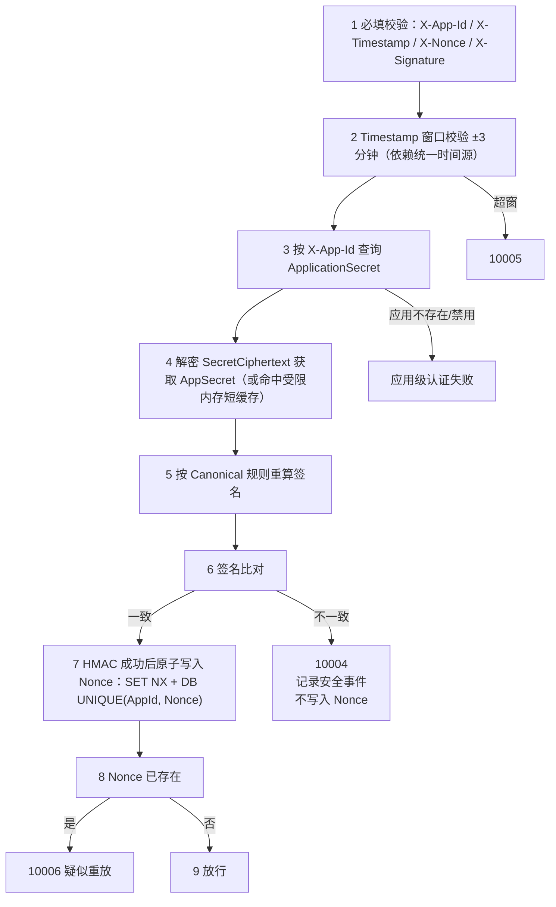

**关键实现约束**

1. **验签失败绝不写 Nonce**（防攻击者用无效请求灌满 Nonce 存储）；
2. Nonce 写入必须原子（`SET NX`）；
3. 数据库回退必须是 `INSERT` 依赖 `UNIQUE(AppId, Nonce)`，**禁止 SELECT → INSERT**；
4. 时间源不可用时**拒绝签名请求**（4.11）；
5. 解密后的 AppSecret 使用后立即清零内存。

## 6.3 AppSecret 生命周期与存储

### 6.3.1 状态与存储模型

```text
CREATED → ACTIVE → ROTATED / DISABLED / REVOKED
```

| 字段             | 作用                                     | 保护                      |
| ---------------- | ---------------------------------------- | ------------------------- |
| SecretCiphertext | 服务端验签时解密获取 AppSecret           | SM4-GCM，KEK-Runtime 保护 |
| SecretHash       | 指纹/去重/审计关联；**不参与验签** | SM3(AppSecret)            |

**要求**

1. 创建时**只展示一次明文**；平台原则上**不提供"找回原 Secret"**；丢失只能重新生成；
2. 轮换后旧 AppSecret **立即失效（无兼容期）**（D-19）；
3. 轮换为高风险操作，管理端**强制二次确认**，提示："轮换后旧 AppSecret 立即失效，请确认已通知所有使用方在轮换前完成切换，否则将导致业务中断"；
4. 解密后的 AppSecret 不得写入日志、缓存文件或普通对象持久化；
5. 原文不得持久化（NF-CMP-017）。

### 6.3.2 解密路径与性能分级（V2.9、D-28）

| 场景              | 路径                                                   | 短缓存 TTL        | 验收指标                              |
| ----------------- | ------------------------------------------------------ | ----------------- | ------------------------------------- |
| Software Provider | 应用进程内解密（KEK-Runtime 解封后驻留安全内存）       | **≤60 秒** | NF-PERF-009：签名校验 P95 ≤10ms      |
| HSM Provider      | 需 HSM 解封 KEK-Runtime 或由 HSM 解封 SecretCiphertext | **≤30 秒** | NF-PERF-009A（阈值结合 HSM 实测冻结） |

**短缓存安全约束（必须全部满足）**

1. 仅进程内存，使用受保护内存（如固定缓冲区 + 主动清零，等价于 SecureString 机制）；
2. 禁止序列化、禁止落盘、禁止跨请求跨线程共享；
3. 缓存对象不得被 GC 长期驻留；内存转储抽查必须可验证被清零；
4. **撤销联动**：AppSecret 轮换/撤销、Key 状态变更、安全事件触发时**立即清除**短缓存；清理由统一事件总线或管理端指令下发，清除动作记录审计。

## 6.4 Nonce 防重放（缓存 + 数据库双写）

| 规则项     | 设计要求                                                                       |
| ---------- | ------------------------------------------------------------------------------ |
| 写入门槛   | **仅 HMAC 验证通过后**写入；原子 `SET NX`                              |
| 主存储     | 缓存（TongRDS / CDM），TTL**6 分钟**（≥ 时间窗口 2 倍）                 |
| 回退存储   | 数据库短期存储；**缓存不可用时直接走数据库**                             |
| 最终仲裁   | **数据库 `UNIQUE(AppId, Nonce)` 为最终仲裁**；禁止以缓存结果为最终仲裁 |
| 冲突处理   | 缓存 SET NX 成功但数据库插入冲突 → 以数据库结果为准，返回**10006**      |
| 双写均失败 | **拒绝请求** + 记录安全事件 + 告警                                       |
| 禁止模式   | 禁止`SELECT → INSERT`                                                       |
| 清理       | 后台任务定期清理过期记录                                                       |

## 6.5 管理端认证（Access Token + AdminSession + RefreshToken）

### 6.5.1 登录与 MFA

```text
用户名 + 口令 + 验证码 → PBKDF2-SM3 校验 → MFA 第二因素校验
  → 签发 Access Token + RefreshToken → 创建 AdminSession
```

| 项            | 设计                                                                                                     |
| ------------- | -------------------------------------------------------------------------------------------------------- |
| MFA 策略      | `MFA_POLICY_MODE` = OPTIONAL / REQUIRED，**默认 REQUIRED，生产冻结 REQUIRED**（D-16、F-CFG-006） |
| 第二因素类型  | TOTP / 国密 USBKey / SM2 数字证书 / 动态令牌（MfaType）                                                  |
| REQUIRED 行为 | 所有管理用户必须绑定第二因素；**禁止用户停用**；未绑定用户强制绑定引导（F-CON-012）                |
| OPTIONAL 行为 | 可自主启用/停用（停用需二次确认并审计）                                                                  |
| 登录失败      | 5 次/5 分钟锁定账户 30 分钟；10 次/24 小时强制提示处理并通知安全管理员                                   |
| 验证码        | 登录验证码独立于短信验证码（§6.7）                                                                      |

### 6.5.2 Token 与会话

| 项                | 设计                                                                                                                                                  |
| ----------------- | ----------------------------------------------------------------------------------------------------------------------------------------------------- |
| Access Token      | JWT，签名算法**SM2**；`Authorization: Bearer {token}`                                                                                         |
| 空闲超时          | **15 分钟**（依据 AdminSession.LastAccessAt）                                                                                                   |
| 绝对超时          | **24 小时**                                                                                                                                     |
| 撤销              | "短期 Token + 服务端撤销列表"组合；撤销列表**缓存与数据库双写**，缓存失效回退数据库                                                             |
| 校验顺序          | JWT 校验（签名/exp/aud/iss）→ 按`jti` 查 AdminSession → 校验 LastAccessAt → 校验 AbsoluteExpireAt → 校验 RevokedAt → 更新 LastAccessAt → 放行 |
| LastAccessAt 更新 | 更新频率由实现决定，但**不得影响 15 分钟空闲超时语义**                                                                                          |

| Refresh Token | 设计                                                                                                             |
| ------------- | ---------------------------------------------------------------------------------------------------------------- |
| 格式          | 随机 opaque token，**非 JWT**；长度 **≥256 bit**                                                    |
| 存储          | 仅存`HMAC-SM3(RefreshKey, Token)` 哈希                                                                         |
| 使用          | **一次性**，使用后立即轮换；旧 Token 立即失效                                                              |
| 有效期        | 绝对**7 天**（可配置，I-18）                                                                               |
| 绑定          | UserId + DeviceId（可选）                                                                                        |
| 登出          | 同时撤销 Access Token 与 Refresh Token                                                                           |
| RefreshKey    | 由 KEK-Runtime 保护；支持轮换（I-19）；轮换时双 Key 并存窗口或强制登出策略；生成/轮换/销毁需安全管理员权限并审计 |

## 6.6 授权模型

### 6.6.1 角色与三员互斥

| 角色       | 权限                                       | 互斥                           |
| ---------- | ------------------------------------------ | ------------------------------ |
| 系统管理员 | 系统配置、用户及应用管理、运维状态         | 与安全管理员、审计管理员互斥   |
| 安全管理员 | 密钥生命周期、密码设备、安全策略、安全事件 | 与系统管理员、审计管理员互斥   |
| 审计管理员 | 审计查询、验证、导出                       | 与系统管理员、安全管理员互斥   |
| 应用管理员 | 授权范围内应用信息维护                     | 扩展角色，不具备三员核心权限   |
| 运维管理员 | 运行状态、设备状态、监控查看               | 扩展角色，不具备密钥与审计权限 |

**强制约束**：`Role.IsMutexRole` 标记互斥角色；同一用户不得同时拥有两个及以上互斥角色，分配时即校验并拒绝（含存量用户登录前校验）。

### 6.6.2 权限矩阵（与需求 3.6.1 一致）

| 权限码                                                         | 系统管理员 | 安全管理员 | 审计管理员 |
| -------------------------------------------------------------- | :--------: | :--------: | :--------: |
| PERM_USER_MANAGE                                               |     ✓     |            |            |
| PERM_SYSTEM_CONFIG                                             |     ✓     |            |            |
| PERM_APP_MANAGE                                                |     ✓     |            |            |
| PERM_KEY_CREATE / ROTATE / DESTROY / BACKUP / RESTORE / IMPORT |            |     ✓     |            |
| PERM_DEVICE_MANAGE                                             |            |     ✓     |            |
| PERM_ROOTKEY_GENERATE / ROTATE / DESTROY                       |            |     ✓     |            |
| PERM_KEK_MANAGE                                                |            |     ✓     |            |
| PERM_SECURITY_EVENT_HANDLE / PERM_SECURITY_POLICY              |            |     ✓     |            |
| PERM_AUDIT_QUERY / EXPORT / VERIFY                             |            |            |     ✓     |

### 6.6.3 资源归属校验

| 调用方           | 规则                                                                                                                                                                                                                              |
| ---------------- | --------------------------------------------------------------------------------------------------------------------------------------------------------------------------------------------------------------------------------- |
| 业务 API（签名） | `KeyId` 所属 App 必须等于 `X-App-Id`；不一致返回 **12001** 并记录安全事件                                                                                                                                               |
| 管理端 Token     | **必须显式传 `appId`**（默认规则）；校验调用者具备对应权限（如 PERM_KEY_CREATE / PERM_KEY_BACKUP / PERM_KEY_RESTORE）；`appId` 与 KeyId 归属必须一致；**不传 `appId` 时仅允许操作"管理端测试专用 App"下的 Key** |
| 生产 Key 操作    | 管理端 Token 操作生产 Key 时必须：二次确认 + 记录高危审计 + 触发告警；**不得用于业务方常规调用路径**                                                                                                                        |
| 禁止绕过         | 管理端 Token 不得跳过资源归属校验，不得成为绕过密钥隔离的后门                                                                                                                                                                     |
| 审计标记         | 管理端调用业务 API 的审计必须标记`OperatorType=ADMIN`、`AppId`、`KeyId`、`SourceIP`、`ActingAsAppId`                                                                                                                    |

## 6.7 幂等设计

### 6.7.1 必须幂等的敏感操作（19 条，6.10.1）

密钥轮换、密钥销毁、密钥注销、密钥恢复、**密钥导入（V2.9 新增）**、**业务 API 创建密钥（V2.9 新增）**、AppSecret 重置、AppSecret 轮换、AppSecret 撤销、Token 撤销、Root Key 轮换、Root Key 销毁、KEK-Runtime 轮换、KEK-Runtime 销毁、KEK-Backup 轮换、KEK-Backup 销毁、用户 MFA 重置/解绑、用户手机号变更、MFA 策略切换。

### 6.7.2 幂等机制

```http
Idempotency-Key: {uuid}
```

| 项           | 设计                                                                                                     |
| ------------ | -------------------------------------------------------------------------------------------------------- |
| 存储         | 数据库 + 缓存双写；缓存失效回退数据库                                                                    |
| 记录内容     | 操作类型、操作主体（AppId/UserId）、Idempotency-Key、请求摘要、首次结果、创建时间                        |
| TTL          | **24 小时**                                                                                        |
| 唯一约束     | `UNIQUE(OperatorType, OperatorId, OperationType, IdempotencyKey)`（需求未定义，本设计补充，见 §14.2） |
| 冲突行为     | 相同键重复请求**返回首次结果**，不重复执行                                                         |
| 与防重放关系 | 幂等（业务语义去重）与 Nonce（传输层防重放）**并行生效**                                           |

## 6.8 口令与凭据存储

| 项            | 设计                                                               |
| ------------- | ------------------------------------------------------------------ |
| 算法          | **PBKDF2-SM3**（参数见 §3.7，I-16）                         |
| Salt          | 每用户独立随机                                                     |
| 复杂度        | ≥3 类字符（大写/小写/数字/特殊）                                  |
| 最小长度      | ≥12                                                               |
| 历史密码      | 最近 5 次不可重复                                                  |
| 有效期        | 90 天（可配置）                                                    |
| 初始/重置密码 | 首次登录**强制修改**                                         |
| 存储          | 仅存 PasswordHash + PasswordSalt；**不存明文、不存可逆密文** |

## 6.9 手机号与短信验证码

| 项       | 设计                                                                                                                                       |
| -------- | ------------------------------------------------------------------------------------------------------------------------------------------ |
| 存储     | `User.PhoneEncrypted` = SM4-GCM(手机号, UserDataDEK)                                                                                     |
| 保护链   | UserDataDEK ← KEK-Runtime ← Root Key                                                                                                     |
| 定位     | **普通属性字段**：不建独立搜索密钥、不做去重/唯一性特殊处理、不作为登录标识                                                          |
| 展示     | 脱敏（如`138****8888`）                                                                                                                  |
| 完整性   | 手机号参与 User 表 IntegrityValue 计算                                                                                                     |
| 使用     | 短信告警时临时解密，用后立即清零；**禁止写入日志与审计明文**                                                                         |
| 变更     | 高风险操作，二次确认 + 审计                                                                                                                |
| 保留     | 与用户生命周期一致                                                                                                                         |
| 验证码   | 长度 ≥6 位；有效期 ≤5 分钟；同一手机号 60 秒/次、24 小时 ≤10 次；**5 次失败即失效**并需重发；连续失败触发安全事件并通知安全管理员 |
| 通道降级 | 短信通道失败支持重试与降级（站内通知），并记录审计                                                                                         |

## 6.10 IP 白名单（可选）

| 项     | 设计                                                                           |
| ------ | ------------------------------------------------------------------------------ |
| 默认   | **关闭**                                                                 |
| 粒度   | 应用级（`Application.IPWhitelist` + `IPWhitelistEnabled`）；管理端独立配置 |
| 启用后 | 白名单外来源拒绝（认证类错误码区间），记录审计                                 |
| 变更   | 记录审计；参与 IntegrityValue 计算                                             |

---

# 7. 审计、安全事件与完整性设计

> 需求依据：3.4.1～3.4.4、3.5.1～3.5.5、3.10、7.7、7.8、7.11、7.17、8.8、8.9、8.14、8.15、F-AUDIT-001～011、F-RISK-001～009、F-ALERT-001～006、F-DI-001～007、F-RI-001～004、NF-CMP-016、D-22。

## 7.1 审计模型

### 7.1.1 审计对象与范围

| 类别       | 覆盖内容                                                        | 需求                     |
| ---------- | --------------------------------------------------------------- | ------------------------ |
| 密码操作   | SM2/SM3/SM4/HMAC 运算（含成功与失败）                           | F-AUDIT-001              |
| 密钥管理   | 生成/激活/禁用/重新激活/轮换/过期/注销/销毁/导入/备份/恢复/验证 | F-AUDIT-002              |
| 认证       | 请求签名校验、管理端登录与令牌操作（含 MFA）                    | F-AUDIT-003              |
| 管理操作   | 管理端全部变更类操作、配置变更、二次确认结果                    | F-AUDIT-004、F-AUDIT-008 |
| 数据完整性 | IntegrityValue 生成、验证、失败及处置过程                       | F-AUDIT-010              |
| 审计链路   | 校验点生成、外部锚点、集中外发结果                              | F-AUDIT-011              |

### 7.1.2 审计字段（AuditLog）

AuditId、Timestamp、RequestId、TraceId、OperatorType（APP/ADMIN/USER/SYSTEM）、OperatorId、OperatorName、AppId、SourceIP、Operation、KeyId、KeyVersion、Result、ErrorCode、Duration、PreviousHash、CurrentHash。

**追加要求（`OperatorType=ADMIN` 调业务 API 时）**：额外记录 `ActingAsAppId`。

### 7.1.3 敏感数据禁止项（3.4.3、8.9）

审计与日志**禁止记录**：AppSecret、PrivateKey、SM4 明文密钥、HMAC 明文密钥、Root Key、KEK、Token 完整内容、**明文手机号**、短信验证码、明文业务数据、完整密码请求体。

**必要时仅记录**：数据长度、数据摘要、参数类型、KeyId、业务关联标识。

## 7.2 审计哈希链

### 7.2.1 CanonicalSerialize（V2.9 规范化，唯一口径）

```text
CanonicalSerialize(AuditLog) =
  AuditId + "|" + Timestamp(ISO 8601 带时区) + "|" + RequestId + "|" + TraceId + "|"
  + OperatorType + "|" + OperatorId + "|" + OperatorName + "|" + AppId + "|" + SourceIP + "|"
  + Operation + "|" + KeyId + "|" + KeyVersion + "|" + Result + "|" + ErrorCode + "|" + Duration

H1 = SM3(CanonicalSerialize(Log1))
H2 = SM3(CanonicalSerialize(Log2) + H1)
H3 = SM3(CanonicalSerialize(Log3) + H2)
...
定期 SM2 Sign(Hn)
```

| 规范化规则   | 要求                                                                                         |
| ------------ | -------------------------------------------------------------------------------------------- |
| 字段顺序     | 固定为上式顺序                                                                               |
| 空值         | 统一表示为固定占位符`\0`                                                                   |
| 时间         | ISO 8601 带时区（如`2026-09-28T10:30:00.000+08:00`）                                       |
| 编码         | UTF-8                                                                                        |
| 分隔符       | 固定 `                                                                                       |
| 转义         | 字段内出现 `                                                                                 |
| 链字段       | PreviousHash 与 CurrentHash**不参与 CanonicalSerialize**（避免循环），仅作为链字段存储 |
| 跨节点一致性 | 所有节点必须使用同一序列化实现（共享程序集），并提供向量自检                                 |

### 7.2.2 多实例并发写入：分片链 + 聚合签名

```text
分片维度（I-22，本设计默认按 AppId 哈希取模 16 分片）
   ↓ 每分片独立哈希链
分片链头定期聚合 → SM2 签名 → 全局校验点 → 外部锚点
```

| 要求           | 设计                                                                 |
| -------------- | -------------------------------------------------------------------- |
| 独立性         | 任一分片链必须可独立验证                                             |
| 校验点签名     | 必须 SM2 签名，私钥由 Root Key 保护                                  |
| 分片规则稳定性 | 同一审计事件的归属分片**必须稳定**（不得随节点漂移）           |
| 聚合频率       | 每 N 条或每 T 时长（默认 N=1000 条 或 T=10 分钟，I-17/I-22，可配置） |
| 并发写入       | 同一分片内串行提交（数据库序列 + 乐观锁），跨分片并行                |

## 7.3 外部锚点（防尾部重构造）

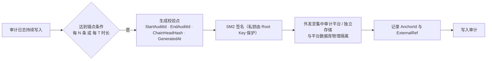

| 要求     | 设计                                                                                              |
| -------- | ------------------------------------------------------------------------------------------------- |
| 锚点内容 | StartAuditId、EndAuditId、ChainHeadHash、GeneratedAt、Signature、ExternalRef                      |
| 隔离     | 锚点存储**与平台数据库物理隔离**                                                            |
| 校验     | 恢复审计链时**必须同时校验内部链与外部锚点**；锚点校验失败（80003）立即触发最高等级安全事件 |
| 周期     | 每 N 条或每 T 时长（I-17）                                                                        |
| 归档     | 归档日志必须保留哈希链与校验点，支持归档后完整性验证                                              |

## 7.4 集中审计外发

| 项     | 设计                                                              |
| ------ | ----------------------------------------------------------------- |
| 通道   | 加密通道（国密 TLS 优先）                                         |
| 内容   | 审计日志 + 审计链校验点                                           |
| 可靠性 | 外发失败**本地留存 + 断点续传**，**不得丢弃审计事件** |
| 缓冲   | 经消息队列缓冲，失败重试与退避                                    |
| 对端   | 安全管理中心集中审计平台（NF-CMP-008/009）                        |
| 审计   | 外发结果（成功/失败/重试次数）记录审计                            |

## 7.5 安全事件与告警

### 7.5.1 事件范围与生命周期

事件类型（至少）：AppSecret 连续签名失败、Token 异常、KeyId 越权访问、短时间大量解密、短时间大量签名、密钥频繁轮换、管理员异常登录、密码设备故障、数据库异常、缓存异常、审计完整性失败、数据完整性校验失败、密码模块自检失败、**NodeId 冲突**。

```text
发现 → 告警 → 确认 → 处置 → 恢复 → 关闭 → 审计
```

### 7.5.2 分级标准

| 等级 | 标识     | 判定条件                                                                                                         | 处置要求                                 |
| ---- | -------- | ---------------------------------------------------------------------------------------------------------------- | ---------------------------------------- |
| 紧急 | CRITICAL | Root Key 风险、审计完整性断裂、外部锚点失败、HSM 全面不可用、数据完整性大面积失败、密码模块自检失败、NodeId 冲突 | 立即处置，暂停相关密码服务，启动应急预案 |
| 高   | HIGH     | 密钥材料泄露风险、KeyId 越权访问、大规模解密/签名、认证证书过期                                                  | 30 分钟内响应，隔离风险源                |
| 中   | MEDIUM   | 单应用签名连续失败、密钥频繁轮换、HSM 单设备故障、缓存异常                                                       | 2 小时内响应                             |
| 低   | LOW      | 单次越权尝试、单次完整性值失败（疑似瞬态）                                                                       | 24 小时内响应                            |

### 7.5.3 初始阈值表（含 V2.9 防 DoS 调整）

| 检测项                                     | 默认阈值         | 时间窗口 | 触发动作                                                                        |
| ------------------------------------------ | ---------------- | -------- | ------------------------------------------------------------------------------- |
| 应用签名连续失败（同一 AppId + 来源 IP）   | 10 次            | 5 分钟   | 告警 + 对该 AppId+IP 组合**限流**；**不自动锁定应用**；记录安全事件 |
| 应用签名连续失败（同一 AppId，多 IP 聚合） | 50 次            | 5 分钟   | 告警 + 通知安全管理员；由安全管理员决定是否临时禁用应用                         |
| 管理员登录连续失败                         | 5 次             | 5 分钟   | 锁定账户 30 分钟，记录安全事件                                                  |
| 管理员登录连续失败（高风险）               | 10 次            | 24 小时  | 强制提示用户处理（重新绑定 MFA 或联系安全管理员），通知安全管理员               |
| 单应用短时间大量解密 / 签名                | 1000 次          | 1 分钟   | 记录安全事件，触发告警                                                          |
| 单密钥短时间大量使用                       | 10000 次         | 1 分钟   | 记录安全事件，建议轮换                                                          |
| KeyId 越权访问                             | 1 次             | —       | 立即记录安全事件，告警                                                          |
| KeyType 不兼容操作                         | 5 次             | 5 分钟   | 记录安全事件                                                                    |
| 密钥频繁轮换                               | 10 次            | 24 小时  | 记录安全事件，需安全管理员确认                                                  |
| HSM 健康检查失败                           | 3 次连续         | 3 分钟   | 标记设备不可用，触发主备切换，告警                                              |
| HSM 认证证书临期 / 到期                    | ≤30 天 / 到期日 | —       | 提醒告警进入宽限期 / 禁止承载运算并告警                                         |
| 审计完整性链断裂、外部锚点失败             | 1 次             | —       | 立即触发最高等级安全事件                                                        |
| 数据完整性值失败                           | 1 次             | —       | 拒绝使用被篡改数据，记录安全事件，告警                                          |
| 密码模块自检失败                           | 1 次             | —       | 标记模块不可用，拒绝密码运算，告警                                              |
| NodeId 冲突                                | 1 次             | —       | 停止 GCM 运算，触发安全事件，需人工介入                                         |
| 缓存不可用                                 | 持续 1 分钟      | —       | 告警；按 NF-AVAIL-006 降级策略处理                                              |

**V2.9 防 DoS 设计约束（必须实现）**

1. 失败计数绑定 `AppId + 来源 IP`；
2. **仅对"AppId 有效且来源可信"的失败计数**（伪造 AppId 的无效请求不得计入合法应用的失败次数）；
3. 默认**不自动锁定应用**，改为告警 + 对该组合限流；
4. 需要临时禁用应用时由安全管理员在管理端**人工操作**并记录审计；
5. 应用禁用/启用必须提供**快速恢复通道**，避免误伤合法业务。

### 7.5.4 告警规则与通知

| 项         | 设计                                                                       |
| ---------- | -------------------------------------------------------------------------- |
| 通道       | 短信（手机号临时解密后发送）、Webhook（HTTPS）、站内通知、对外集中告警平台 |
| 配置变更   | 必须审计                                                                   |
| 内容约束   | 不得包含密钥材料、Token、AppSecret、明文手机号                             |
| 失败处理   | 按策略重试，记录重试结果，**通知失败不得丢弃事件**                   |
| 手机号使用 | 临时解密，用后立即清零内存                                                 |

## 7.6 关键字段完整性保护（IntegrityValue）

### 7.6.1 算法与字段

```text
IntegrityValue = HMAC-SM3( IntegrityKey,
                           CanonicalSerialize(关键字段) + TableName + RowId )

IntegrityKey 由 KEK-Runtime 保护
IntegrityValue 字段本身不参与计算（避免循环依赖）
```

**CanonicalSerialize 规则**：字段顺序固定（与 §7.6.2 表格一致）；UTF-8；空值用固定占位符 `\0`；时间 ISO 8601 带时区；**字段分隔符与转义规则与审计链（§7.2.1）保持一致**；大字段（`AlgorithmParams`、`IPWhitelist`、`ProviderCapabilities`、`Condition`）规范化序列化后参与，**超过 4KB 的字段采用 SM3 摘要后参与**（I-10，建议阈值 4KB）。

**字段长度**：按 HMAC-SM3 输出确定，建议 64 位十六进制字符串或 Base64。

### 7.6.2 校验对象与关键字段（以 7.17.1 为唯一权威）

| 表                | 参与完整性值计算的关键字段                                                                                         |
| ----------------- | ------------------------------------------------------------------------------------------------------------------ |
| Key               | KeyId、KeyType、AppId、CurrentVersion、Status、ExpireAt、ProviderId、AlgorithmParams                               |
| KeyVersion        | KeyId、KeyVersion、Status、EffectiveAt、ExpireAt                                                                   |
| KeyMaterial       | KeyMaterialId、KeyId、KeyVersion、ProviderId、StorageType、ProviderReference、ProviderKeyIdentity、MaterialVersion |
| Application       | AppId、Name、Status、IPWhitelist、IPWhitelistEnabled、AllowApiKeyCreate                                            |
| ApplicationSecret | SecretId、AppId、SecretHash、Status、ExpireAt（**不含 SecretCiphertext**，其由 KEK 保护）                    |
| User              | UserId、Username、PasswordHash、PasswordSalt、RoleId、Status、MFAEnabled、PhoneEncrypted                           |
| UserMfaBinding    | BindingId、UserId、MfaType、CredentialHash、PublicKey、Status                                                      |
| Role              | RoleId、RoleName、IsMutexRole                                                                                      |
| Permission        | PermissionId、RoleId、PermissionCode                                                                               |
| AdminSession      | SessionId、UserId、Jti、LastAccessAt、AbsoluteExpireAt、Status                                                     |
| RefreshToken      | TokenId、UserId、TokenHash、DeviceId、ExpireAt、Status                                                             |
| SecurityEvent     | EventId、EventType、Severity、Status、HandleResult                                                                 |
| CryptoDevice      | DeviceId、DeviceName、DeviceType、Vendor、Model、Status、CertNo、CertExpireAt、ProviderCapabilities                |
| SystemConfig      | ConfigKey、ConfigValue、ConfigScope                                                                                |
| BackupRecord      | BackupId、BackupType、Scope、IntegrityValue、Result                                                                |
| RootKeyMetadata   | RootKeyId、Status、CreatedAt、RotatedAt（**建议 SM2 签名加强**）                                             |
| KekMetadata       | KekId、Type、Status、CreatedAt、RotatedAt（**建议 SM2 签名加强**）                                           |
| UserDataDEK       | DekId、Purpose、Status、CreatedAt、RotatedAt                                                                       |
| AlertRule         | RuleId、RuleName、Condition、Severity、Status                                                                      |

**不纳入校验**：AuditLog（哈希链 + 外部锚点）、SignatureNonce（短生命周期 + 唯一约束）、IntegrityScanRecord（巡检自身记录）。

> 设计裁定：7.11.2 与 7.17.1 关于 `ApplicationSecret` 是否含 `SecretCiphertext` 存在口径差异，**以 7.17.1 为准**（不含，密文由 KEK 保护）。

### 7.6.3 校验时机与策略

| 时机      | 要求                                                                                            |
| --------- | ----------------------------------------------------------------------------------------------- |
| 写入/更新 | **同步计算并写**入 IntegrityValue（与业务写同事务）                                       |
| 读取/使用 | 密钥、用户、权限、设备、配置等关键数据在关键操作前验证                                          |
| 定期巡检  | 后台任务按策略抽查，**默认每 24 小时一轮**；分批、限速、低峰执行（批次/限速/窗口见 I-23） |
| 备份/恢复 | 备份前验证、恢复后验证                                                                          |

**策略约束**：不得全表全字段实时校验；读取路径仅校验当次操作涉及记录；巡检不得影响密码服务性能（NF-PERF 系列）；巡检频率、批次、限速可配置（NF-DATA-006）。

### 7.6.4 校验失败处理

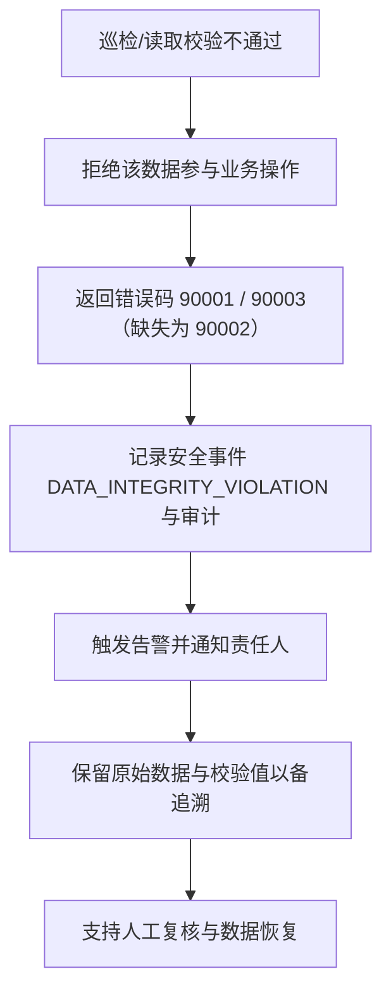

**验收口径**：完整性值字段本身**必须纳入备份与恢复范围**。

## 7.7 剩余信息保护与内存清零

| 编号     | 要求                                          | 设计落地                                                                              |
| -------- | --------------------------------------------- | ------------------------------------------------------------------------------------- |
| F-RI-001 | 敏感材料内存生命周期结束后可验证清零/安全释放 | 统一`SecureBuffer`：固定内存 + 主动清零；AppSecret/主密码/DEK/Root Key/KEK 全部使用 |
| F-RI-002 | 记录删除后残留不可恢复                        | 密钥元数据删除采用物理删除 + 空间回收；数据库层面避免仅软删                           |
| F-RI-003 | 销毁时通过密码设备擦除材料                    | 销毁流程第 5 步强制调用 Provider 擦除                                                 |
| F-RI-004 | 责任分层                                      | 应用层负责内存与元数据；物理介质由密码设备与基础设施承担                              |

**验收口径**：代码审查、内存转储抽查、数据库残留查询、HSM 擦除证明、缓存敏感数据检查。

---

# 8. 数据设计

> 需求依据：第 7 章全部、3.11.4、4.9、4.10、NF-DATA-001～008、NF-BAK-001～005、NF-DR-002。
> 说明：需求 V2.9 的字段表仅给出"字段 + 说明"，**未给类型/可空性/索引**；下表类型为本设计依据业务语义补全（见 §14.2 待确认）。

## 8.1 数据模型总览

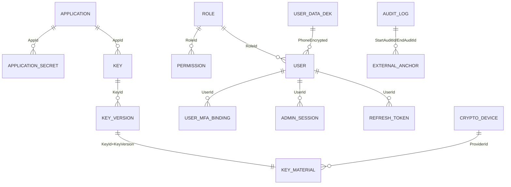

## 8.2 表结构设计

> 通用约定：主键统一 `string(36)`（UUID）除版本号外；时间字段统一 `datetime`（存储 UTC，展示 ISO 8601 带时区）；布尔 `bool`；JSON 使用数据库原生 JSON 或 `text` + 规范化序列化；所有关键表含 `IntegrityValue string(64)`（十六进制）与 `CreatedAt/UpdatedAt`。

### 8.2.1 密钥域

**`SysKey`（Key）**

| 字段                                                                     | 类型        | 约束             | 说明                                                      |
| ------------------------------------------------------------------------ | ----------- | ---------------- | --------------------------------------------------------- |
| KeyId                                                                    | string(36)  | PK               | 密钥唯一标识                                              |
| KeyType                                                                  | string(16)  | 非空，不可变     | SM2 / SM4 / HMAC                                          |
| AppId                                                                    | string(36)  | 非空，FK，不可变 | 所属应用                                                  |
| CurrentVersion                                                           | int         | 非空，默认 0     | 当前版本号                                                |
| Status                                                                   | string(16)  | 非空             | CREATED/ACTIVE/DISABLED/ROTATED/EXPIRED/REVOKED/DESTROYED |
| CreatedAt / ActivatedAt / ExpireAt / RotatedAt / RevokedAt / DestroyedAt | datetime    | 可空             | 生命周期时间戳                                            |
| ProviderId                                                               | string(36)  | 非空             | 承载 Provider                                             |
| AlgorithmParams                                                          | string/json | 可空             | 算法参数（>4KB 摘要参与完整性）                           |
| CreatedBy / CreatedSource                                                | string(64)  | 非空             | 创建者 / 生成或导入                                       |
| MetadataIntegrityValue                                                   | string(64)  | 非空             | 元数据完整性保护值                                        |
| IntegrityValue                                                           | string(64)  | 非空             | 关键字段完整性值                                          |

索引：`IX_SysKey_AppId_KeyType_Status`；唯一：`UQ_SysKey_AppId_KeyId`（隐式 PK）。

**`SysKeyVersion`（KeyVersion）**

| 字段                                                         | 类型       | 约束       | 说明                                             |
| ------------------------------------------------------------ | ---------- | ---------- | ------------------------------------------------ |
| KeyId                                                        | string(36) | PK（复合） | 关联密钥                                         |
| KeyVersion                                                   | int        | PK（复合） | 版本号，单调递增                                 |
| Status                                                       | string(16) | 非空       | CREATED/ACTIVE/ROTATED/EXPIRED/REVOKED/DESTROYED |
| EffectiveAt / ExpireAt / CreatedAt / RotatedAt / DestroyedAt | datetime   | 可空       | 版本时间戳                                       |
| IntegrityValue                                               | string(64) | 非空       | 完整性值                                         |

唯一：`UQ_KeyVersion(KeyId, KeyVersion)`；索引：`IX_KeyVersion_Status`。

**`SysKeyMaterial`（KeyMaterial）**

| 字段                | 类型           | 约束                | 说明                                                                         |
| ------------------- | -------------- | ------------------- | ---------------------------------------------------------------------------- |
| KeyMaterialId       | string(36)     | PK                  | 材料唯一标识                                                                 |
| KeyId               | string(36)     | 非空，FK（复合）    | 关联密钥                                                                     |
| KeyVersion          | int            | 非空（复合）        | 关联版本                                                                     |
| ProviderId          | string(36)     | 非空                | 承载 Provider                                                                |
| StorageType         | string(24)     | 非空                | WRAPPED_DATABASE / HSM_REFERENCE                                             |
| WrappedMaterial     | text/varbinary | 可空（仅 Software） | 密文密钥材料（KEK-Runtime 保护）                                             |
| ProviderReference   | string(256)    | 可空（仅 HSM）      | Key Handle / Label                                                           |
| ProviderKeyIdentity | string(256)    | 可空（仅 HSM）      | KCV / PublicKeyFingerprint / 厂商等价机制；**必须参与 IntegrityValue** |
| MaterialVersion     | int            | 非空                | 材料版本                                                                     |
| IntegrityValue      | string(64)     | 非空                | 完整性值                                                                     |

唯一：`UQ_KeyMaterial(KeyId, KeyVersion)`；约束：`WrappedMaterial` 与 `ProviderReference` **按 StorageType 二选一非空**（CHECK 约束）。

### 8.2.2 应用与凭据域

**`SysApplication`（Application）**

| 字段                  | 类型        | 约束             | 说明                                           |
| --------------------- | ----------- | ---------------- | ---------------------------------------------- |
| AppId                 | string(36)  | PK               | 应用标识                                       |
| Name                  | string(128) | 非空             | 应用名称                                       |
| Status                | string(16)  | 非空             | ACTIVE / DISABLED                              |
| IPWhitelist           | text/json   | 可空             | IP 白名单                                      |
| IPWhitelistEnabled    | bool        | 非空，默认 false | 白名单开关                                     |
| AllowApiKeyCreate     | bool        | 非空，默认 false | **V2.9 新增**：是否允许业务 API 创建密钥 |
| KeyCreateQuota        | int         | 可空             | 业务 API 创建密钥配额（配合 F-CFG-007）        |
| CreatedAt / UpdatedAt | datetime    | 非空             | —                                             |
| IntegrityValue        | string(64)  | 非空             | 完整性值                                       |

**`SysApplicationSecret`（ApplicationSecret）**

| 字段                             | 类型           | 约束           | 说明                                        |
| -------------------------------- | -------------- | -------------- | ------------------------------------------- |
| SecretId                         | string(36)     | PK             | 凭据标识                                    |
| AppId                            | string(36)     | 非空，FK       | 所属应用                                    |
| SecretCiphertext                 | text/varbinary | **非空** | SM4-GCM 密文（KEK-Runtime 保护）            |
| SecretHash                       | string(64)     | 非空           | SM3(AppSecret)，指纹/审计关联               |
| Status                           | string(16)     | 非空           | CREATED/ACTIVE/ROTATED/DISABLED/REVOKED     |
| CreatedAt / ExpireAt / RevokedAt | datetime       | 可空           | —                                          |
| IntegrityValue                   | string(64)     | 非空           | 完整性值（**不含 SecretCiphertext**） |

索引：`IX_AppSecret_AppId_Status`；**业务约束**：同一 AppId 同时最多一个 ACTIVE Secret（应用层 + 唯一部分索引保证）。

### 8.2.3 用户与会话域

**`SysUser`（User）**：UserId（PK）、Username（唯一）、PasswordHash、PasswordSalt、PasswordUpdatedAt、PasswordHistory（最近 5 次，可采用独立表或 JSON）、RoleId（FK）、Status、MFAEnabled（bool）、PhoneEncrypted（SM4-GCM + UserDataDEK）、CreatedAt、UpdatedAt、IntegrityValue。

**`SysUserMfaBinding`（UserMfaBinding，V2.9 新增）**：BindingId（PK）、UserId（FK）、MfaType（TOTP/USBKey/SM2Cert/Token）、CredentialHash、PublicKey（可空）、DeviceLabel（可空）、Status（PENDING/ACTIVE/REVOKED）、BoundAt、LastUsedAt、ResetAt、IntegrityValue。
唯一：`UQ_MfaBinding(UserId, MfaType, Status)`（同一用户同一类型仅一个 ACTIVE 绑定）。

**`SysAdminSession`（AdminSession）**：SessionId（PK）、UserId（FK）、Jti（唯一）、IssuedAt、LastAccessAt、AbsoluteExpireAt、RevokedAt（可空）、Status、IntegrityValue。
索引：`IX_AdminSession_UserId_Status`、`IX_AdminSession_Jti`（唯一）。

**`SysRefreshToken`（RefreshToken）**：TokenId（PK）、UserId（FK）、TokenHash（唯一）、DeviceId（可空）、IssuedAt、ExpireAt（默认 7 天）、UsedAt（可空，一次性标记）、RevokedAt（可空）、Status、IntegrityValue。
索引：`IX_RefreshToken_UserId_Status`。

**`SysUserDataDek`（UserDataDEK）**：DekId（PK）、Purpose（PHONE_ENCRYPTION 等）、Status（ACTIVE/ROTATED/DESTROYED）、WrappedMaterial（KEK-Runtime 保护）、CreatedAt、RotatedAt、IntegrityValue。
约束：同一 Purpose 同时最多一个 ACTIVE（轮换期间允许双 ACTIVE 窗口，标记 `RotatingPhase`）。

### 8.2.4 防重放与幂等域

**`SysSignatureNonce`（SignatureNonce）**

| 字段      | 类型       | 约束 | 说明                   |
| --------- | ---------- | ---- | ---------------------- |
| NonceId   | string(36) | PK   | 记录标识               |
| AppId     | string(36) | 非空 | 应用标识               |
| Nonce     | string(64) | 非空 | 随机字符串             |
| Timestamp | bigint     | 非空 | 请求时间戳             |
| CreatedAt | datetime   | 非空 | 记录时间               |
| ExpireAt  | datetime   | 非空 | 过期时间（TTL 6 分钟） |

**唯一约束：`UNIQUE(AppId, Nonce)`（最终仲裁）**；**禁止 SELECT → INSERT**；索引：`IX_Nonce_ExpireAt`（清理用）。

**`SysIdempotencyRecord`（设计补充）**：IdempotencyRecordId（PK）、OperatorType、OperatorId、OperationType、IdempotencyKey、RequestDigest、ResultCode、ResponseSnapshot（text）、CreatedAt、ExpireAt（默认 24h）。
唯一：`UNIQUE(OperatorType, OperatorId, OperationType, IdempotencyKey)`。

### 8.2.5 审计与事件域

**`SysAuditLog`（AuditLog）**：AuditId（PK，**可排序序列**）、Timestamp、RequestId、TraceId、OperatorType、OperatorId、OperatorName、AppId、SourceIP、Operation、KeyId、KeyVersion、Result、ErrorCode、Duration、PreviousHash、CurrentHash、ActingAsAppId（可空）、ShardId（分片标识）。
索引：`IX_Audit_Ts`（按 Timestamp **按月分区**）、`IX_Audit_AppId_Operation`、`IX_Audit_KeyId`。
**不纳入 IntegrityValue**（由哈希链 + 外部锚点保护）。

**`SysAuditAnchor`（外部锚点）**：AnchorId（PK）、ShardId、StartAuditId、EndAuditId、ChainHeadHash、GeneratedAt、Signature（SM2）、ExternalRef、ShipStatus（待外发/已外发/失败）、RetryCount。

**`SysSecurityEvent`（SecurityEvent）**：EventId（PK）、EventType、Severity、Source、AppId、KeyId、FirstDetectedAt、LastDetectedAt、OccurrenceCount、Status（OPEN/ACK/HANDLING/RECOVERED/CLOSED）、Handler、HandleTime、HandleResult、IntegrityValue。
索引：`IX_SecurityEvent_Severity_Status`、`IX_SecurityEvent_FirstDetectedAt`（按月分区或归档）。

**`SysAlertRule`（AlertRule）**：RuleId（PK）、RuleName、Condition（结构化字段 + 规范化序列化）、Severity、Channel、Status、CreatedAt、UpdatedAt、IntegrityValue。

### 8.2.6 设备、密钥体系与运维域

**`SysCryptoDevice`（CryptoDevice）**：DeviceId（PK）、DeviceName、DeviceType（HSM/Software）、Vendor、Model、ConnectionInfo、Status、SupportedAlgorithms、**ProviderCapabilities（JSON，V2.9 新增）**、MasterSlaveRelation、LastHealthCheckAt、CertNo、CertAuthority、CertExpireAt、IntegrityValue。

**`SysRootKeyMetadata`（RootKeyMetadata）**：RootKeyId（PK）、ProviderId、Status（ACTIVE/ROTATED/DESTROYED）、CreatedAt、RotatedAt、DestroyedAt、KcvReference（**不存明文 KCV**）、IntegrityValue（建议 SM2 签名加强）。

**`SysKekMetadata`（KekMetadata）**：KekId（PK）、Type（KEK-RUNTIME/KEK-BACKUP）、Status、ProviderId、CreatedAt、RotatedAt、DestroyedAt、IntegrityValue（建议 SM2 签名加强）。

**`SysSystemConfig`（SystemConfig）**：ConfigKey（PK）、ConfigValue、ConfigScope、UpdatedAt、UpdatedBy、IntegrityValue。

**`SysBackupRecord`（BackupRecord）**：BackupId（PK）、BackupType（运行/归档）、Scope、CreatedAt、Size、IntegrityValue、Result、Operator、RestoreVerifiedAt（恢复验证时间）、Source（平台/Provider 登记）。

**`SysIntegrityScanRecord`（IntegrityScanRecord）**：ScanId（PK）、StartedAt、FinishedAt、ScanScope、TotalRecords、ViolationCount、Result（PASS/FAIL/PARTIAL）、Operator、Detail（JSON/关联表）。**不参与 IntegrityValue**；异常必须触发安全事件。

**`SysRole` / `SysPermission`**：RoleId（PK）、RoleName（唯一）、IsMutexRole（bool）、Description；PermissionId（PK）、RoleId（FK）、PermissionCode（唯一组合 `RoleId+PermissionCode`）。两者均纳入 IntegrityValue。

## 8.3 关键约束清单

| 类别       | 约束                                                                                                                                                                                                                                                                                                                                            |
| ---------- | ----------------------------------------------------------------------------------------------------------------------------------------------------------------------------------------------------------------------------------------------------------------------------------------------------------------------------------------------- |
| 唯一约束   | `UNIQUE(AppId, Nonce)`（**最终仲裁**）；`UQ_KeyVersion(KeyId, KeyVersion)`；`UQ_KeyMaterial(KeyId, KeyVersion)`；`UNIQUE(Username)`；`UNIQUE(Jti)`；`UNIQUE(TokenHash)`；`UNIQUE(OperatorType, OperatorId, OperationType, IdempotencyKey)`；同一 AppId 仅一个 ACTIVE Secret；同一 Purpose 仅一个 ACTIVE DEK（轮换窗口除外） |
| 禁止模式   | 禁止`SELECT → INSERT` 实现唯一性判定（必须依赖数据库唯一约束）                                                                                                                                                                                                                                                                               |
| 外键       | Key→Application、KeyVersion→Key、KeyMaterial→KeyVersion、User→Role、Permission→Role（**删除策略：限制删除，避免历史断链**）                                                                                                                                                                                                          |
| 不可变字段 | Key.KeyType、Key.AppId、KeyMaterial.StorageType                                                                                                                                                                                                                                                                                                 |

## 8.4 分区与归档（NF-DATA-001～008）

| 对象                                                   | 策略                                                               |
| ------------------------------------------------------ | ------------------------------------------------------------------ |
| AuditLog                                               | **按月分区**；超保留期归档至独立存储；归档保留哈希链与校验点 |
| SecurityEvent / AlertRule 记录                         | 按时间分区或归档                                                   |
| 已销毁密钥元数据                                       | 按策略归档，保留必要追溯信息（长期）                               |
| Token / AdminSession / RefreshToken / Nonce / 幂等记录 | 过期后按策略清理（后台任务，分批限速）                             |
| 归档数据                                               | **支持按需恢复与查询**                                       |
| 策略可配置                                             | 分区与归档策略可配置（配置文件 + SystemConfig）                    |

## 8.5 备份、恢复与保留

| 项           | 设计                                                                                                                                                                                                                        |
| ------------ | --------------------------------------------------------------------------------------------------------------------------------------------------------------------------------------------------------------------------- |
| 备份内容     | 数据库全量/增量 + 密钥体系备份（按 Provider 语义，§3.6.2）+ 审计归档                                                                                                                                                       |
| 加密         | 备份数据必须加密（KEK-Backup 保护）；密钥相关数据重点保护                                                                                                                                                                   |
| 保留         | 运行备份 ≥90 天；审计备份 ≥6 个月（建议 3 年）；归档长期保留（NF-BAK-001～005，可配置）                                                                                                                                   |
| 隔离         | 生产与备份环境隔离；异地存放（NF-DR-008）                                                                                                                                                                                   |
| 恢复验证     | 备份 → 恢复 → 完整性验证 →**密码操作验证** → 数据一致性验证 → 记录结果；**仅"备份成功"不作为验收依据**（7.14）                                                                                             |
| 记录         | BackupRecord + 恢复人员/时间/结果审计                                                                                                                                                                                       |
| 灾备范围     | Key、KeyVersion、KeyMaterial、Application、ApplicationSecret、User、UserMfaBinding、Role、Permission、AdminSession、RefreshToken、AuditLog、SecurityEvent、AlertRule、CryptoDevice、SystemConfig、BackupRecord（NF-DR-002） |
| 后台任务状态 | 巡检任务状态可恢复（NF-DR-005）                                                                                                                                                                                             |

## 8.6 数据库权限（最小权限，四级账号）

| 账号           | 权限范围                                            | 用途           |
| -------------- | --------------------------------------------------- | -------------- |
| runtime        | 业务表 CRUD；**无 DDL**；无 AuditLog 删除权限 | 应用运行       |
| migration      | DDL（建表/索引/分区）；不参与业务读写               | 版本升级       |
| audit-readonly | AuditLog / SecurityEvent 只读                       | 审计查询与导出 |
| backup         | 备份读取、恢复所需权限                              | 备份与恢复     |

**禁止**：生产应用使用数据库超级账号；审计日志允许普通业务接口修改；普通管理员删除审计日志。

## 8.7 EF Core 映射要点

1. 实体命名与表名映射统一使用 `Sys` 前缀；字段使用 PascalCase，数据库层按信创数据库规范转换；
2. `IntegrityValue` 采用 `ValueConverter` + `SaveChanges` 拦截器，**在同一事务内**自动计算写入（拦截器需能获取 RowId 与表名）；
3. 时间统一以 UTC 存储、以带时区 ISO 8601 输出；
4. 大字段（JSON）使用 `HasConversion` + 规范化序列化，保证完整性值稳定；
5. 唯一约束在 Fluent API 中显式声明（**不得依赖应用层判重**）；
6. 分区表通过数据库原生分区策略实现（EF Core 不感知分区，需在迁移脚本中手工维护）；
7. 国产数据库 Provider 差异（类型映射、JSON 支持、分区语法）必须在兼容性矩阵中登记。

---

# 9. 接口设计

> 需求依据：第 6 章全部、13.3、6.10、6.12、NF-PERF-014、3.1.5。

## 9.1 通用约定

| 项         | 约定                                                                                  |
| ---------- | ------------------------------------------------------------------------------------- |
| 传输       | HTTPS（优先国密 TLS，GB/T 38636）                                                     |
| 数据格式   | JSON；UTF-8；二进制 Base64                                                            |
| 时间格式   | ISO 8601 带时区                                                                       |
| API 前缀   | `/api/v1`；管理端 `/api/v1/admin`                                                 |
| RequestId  | **所有 API 必须返回**                                                           |
| 请求体上限 | 10MB（NF-PERF-014）；随机数另有独立上限（默认 64KB / 上限 1MB）                       |
| 版本管理   | 重大不兼容变更使用`/api/v2/`；V1 废弃须提供废弃通知、迁移说明、兼容周期与新接口说明 |

### 9.1.1 统一响应结构

```json
{
  "code": 0,
  "message": "success",
  "data": {},
  "requestId": "req-xxxx",
  "timestamp": "2026-09-28T10:30:00.000+08:00"
}
```

| 字段      | 类型        | 说明                                                        |
| --------- | ----------- | ----------------------------------------------------------- |
| code      | int         | 0 表示成功；非 0 见 §9.8                                   |
| message   | string      | 结果描述（成功固定`success`）；**不得包含内部细节** |
| data      | object/null | 业务数据；错误时为 null                                     |
| requestId | string      | 请求唯一标识                                                |
| timestamp | string      | 响应时间（ISO 8601）                                        |

### 9.1.2 分页约定（设计补充，需求未定义）

| 项       | 约定                                                               |
| -------- | ------------------------------------------------------------------ |
| 请求参数 | `page`（默认 1）、`pageSize`（默认 20，**最大 200**）    |
| 响应结构 | `data.total`、`data.page`、`data.pageSize`、`data.items[]` |
| 排序     | `sortBy` + `sortOrder`（asc/desc）；默认按创建时间倒序         |
| 大结果集 | 审计导出使用异步任务 + 下载链接，不走同步分页                      |

### 9.1.3 禁止外泄内容

不得返回：堆栈、内部路径、SQL、密码库异常、Padding 内部细节、HSM 内部错误细节、密钥材料、明文手机号、AppSecret 明文。

### 9.1.4 限流与服务保护

| 场景                 | 策略                                                                                 |
| -------------------- | ------------------------------------------------------------------------------------ |
| 签名失败（AppId+IP） | 达阈值后**对该组合限流**（60000-60099 区间错误码），不锁定应用                 |
| 全局过载             | 进入保护模式，返回 60000-60099 区间错误码                                            |
| 业务配额             | 已删除应用层业务配额（DoS 由防火墙承担）；仅保留"业务 API 创建密钥配额"（F-CFG-007） |

## 9.2 业务 API 清单

| 接口                     | 方法       | 路径                                                                                                    | 认证                                     | KeyId 归属校验   |
| ------------------------ | ---------- | ------------------------------------------------------------------------------------------------------- | ---------------------------------------- | ---------------- |
| SM2 加密                 | POST       | `/api/v1/crypto/sm2/encrypt`                                                                          | 请求直接签名 / 管理端 Token              | 是               |
| SM2 解密                 | POST       | `/api/v1/crypto/sm2/decrypt`                                                                          | 同上                                     | 是               |
| SM2 签名                 | POST       | `/api/v1/crypto/sm2/sign`                                                                             | 同上                                     | 是               |
| SM2 验签                 | POST       | `/api/v1/crypto/sm2/verify`                                                                           | 同上                                     | 是               |
| SM3 Hash                 | POST       | `/api/v1/crypto/sm3/hash`                                                                             | 同上                                     | 否（无密钥操作） |
| SM4 加密                 | POST       | `/api/v1/crypto/sm4/encrypt`                                                                          | 同上                                     | 是               |
| SM4 解密                 | POST       | `/api/v1/crypto/sm4/decrypt`                                                                          | 同上                                     | 是               |
| HMAC 生成                | POST       | `/api/v1/crypto/hmac/generate`                                                                        | 同上                                     | 是               |
| HMAC 验证                | POST       | `/api/v1/crypto/hmac/verify`                                                                          | 同上                                     | 是               |
| 随机数                   | POST       | `/api/v1/crypto/random`                                                                               | 同上                                     | 否               |
| 算法能力                 | GET        | `/api/v1/crypto/algorithms`                                                                           | 同上                                     | 否               |
| 密码模块自检             | POST       | `/api/v1/crypto/self-test`                                                                            | 同上                                     | 否               |
| 创建密钥                 | POST       | `/api/v1/keys`                                                                                        | 请求直接签名（受开关配额）或管理端 Token | —               |
| 查询密钥                 | GET        | `/api/v1/keys/{keyId}`                                                                                | 同上                                     | 是               |
| 密钥列表                 | GET        | `/api/v1/keys`                                                                                        | 同上                                     | 是               |
| 激活/禁用/重新激活       | POST       | `/api/v1/keys/{keyId}/activate`、`/disable`、`/enable`                                            | 同上                                     | 是               |
| 轮换/注销/销毁           | POST       | `/api/v1/keys/{keyId}/rotate`、`/revoke`、`/destroy`                                              | 同上                                     | 是               |
| 导入/备份/恢复/恢复验证  | POST       | `/api/v1/keys/import`、`/keys/{keyId}/backup`、`/keys/restore`、`/keys/{keyId}/verify-recovery` | 同上                                     | 是               |
| 版本查询                 | GET        | `/api/v1/keys/{keyId}/versions`                                                                       | 同上                                     | 是               |
| 审计查询/导出/完整性验证 | GET / POST | `/api/v1/audit/logs`、`/api/v1/audit/export`、`/api/v1/audit/verify`                              | **仅管理端 Token + 审计管理员**    | —               |
| 系统信息                 | GET        | `/api/v1/system/info`                                                                                 | 管理端 Token                             | —               |

**版本选择契约（密码运算接口统一）**：可选参数 `keyVersion`；未指定使用当前 ACTIVE 版本；指定历史版本仅允许解密/验签（含 HMAC Verify）；指定不存在版本返回 40003。

## 9.3 密码服务接口契约（设计补全）

**`POST /api/v1/crypto/sm4/encrypt`**

| 请求字段       | 类型   | 必填 | 说明                                      |
| -------------- | ------ | ---- | ----------------------------------------- |
| keyId          | string | 是   | 密钥标识                                  |
| keyVersion     | int    | 否   | 指定版本（加密必须当前 ACTIVE）           |
| mode           | string | 是   | GCM / CBC / CTR / ECB                     |
| data           | string | 是   | 明文（Base64）                            |
| iv             | string | 否   | CBC/CTR 允许传入（GCM**禁止**传入） |
| aad            | string | 否   | GCM 专用，≤64 字节                       |
| outputEncoding | string | 否   | Base64（默认）/ Hex                       |

| 响应字段   | 类型   | 说明                                   |
| ---------- | ------ | -------------------------------------- |
| ciphertext | string | 密文                                   |
| iv         | string | 使用的 IV/计数器初值（平台生成时返回） |
| tag        | string | GCM Tag（128 位）                      |
| keyVersion | int    | 实际使用版本                           |

**`POST /api/v1/crypto/sm4/decrypt`**：入参 ciphertext、iv、tag（GCM）、mode、keyVersion?；出参 data。**GCM Tag 校验失败返回 30002 且整体判定解密失败**（不得返回部分明文）。

**`POST /api/v1/crypto/sm3/hash`**：入参 data、encoding?、stream?；出参 hash、encoding。流式请求使用分块上传（受 10MB 限制），大文件由业务侧分块调用。

**`POST /api/v1/crypto/hmac/generate` / `verify`**：入参 keyId、keyVersion?、data、encoding?、（verify 另需 mac）；出参 mac / valid。

**`POST /api/v1/crypto/random`**：入参 length（字节）、encoding?（Base64/Hex）；出参 random、encoding。

**`GET /api/v1/crypto/algorithms`**：出参各算法支持的模式、编码、长度限制、Provider 能力摘要（不泄露密钥信息）。

**`POST /api/v1/crypto/self-test`**：入参 scope?（all/SM2/SM3/SM4/HMAC/RNG）；出参各算法通过状态、失败原因（脱敏）。

## 9.4 密钥管理接口契约要点

| 接口     | 关键请求字段                                                          | 关键响应字段                            | 备注                                                    |
| -------- | --------------------------------------------------------------------- | --------------------------------------- | ------------------------------------------------------- |
| 创建密钥 | keyType、algorithmParams?、expireAt?、Idempotency-Key（业务入口必填） | keyId、status=CREATED、keyVersion       | 业务入口隐式归属调用方 AppId                            |
| 激活     | —                                                                    | status=ACTIVE                           | 需 PERM_KEY_CREATE 或管理端激活权限                     |
| 轮换     | Idempotency-Key、rotateReason?                                        | newKeyVersion、旧版本状态 ROTATED       | 需二次确认（管理端）                                    |
| 销毁     | Idempotency-Key、confirmToken（二次确认凭据）                         | status=DESTROYED、providerResult        | Provider 返回 NotSupported → 40005，**不改状态** |
| 导入     | keyType、encryptedKeyMaterial（加密保护）、Idempotency-Key            | keyId、status=CREATED                   | CanImportKey 校验                                       |
| 备份     | Idempotency-Key                                                       | backupId、backupType、result            | CanBackupKey 校验                                       |
| 恢复     | backupId、Idempotency-Key                                             | restoredKeys[]、verifyResult            | CanRestoreKey 校验                                      |
| 恢复验证 | testOperations?                                                       | sm2Ok/sm4Ok/hmacOk、keyIdVersionMatched | 必须实际执行密码运算                                    |

## 9.5 管理端接口清单

| 分组           | 接口（方法 路径）                                                                                                                                                                                                                                                                                                            |
| -------------- | ---------------------------------------------------------------------------------------------------------------------------------------------------------------------------------------------------------------------------------------------------------------------------------------------------------------------------- |
| 认证           | POST`/api/v1/admin/auth/login`、POST `/api/v1/admin/auth/logout`、POST `/api/v1/admin/auth/token/refresh`                                                                                                                                                                                                              |
| 用户与角色     | POST`/api/v1/admin/users`；GET `/api/v1/admin/users`；PUT `/api/v1/admin/users/{userId}`；POST `.../userId}/status`；POST `.../reset-password`；POST `.../roles`；GET `/api/v1/admin/roles`；GET `/api/v1/admin/permissions`；POST `.../mfa/reset`；GET `.../mfa`；POST `.../phone`；PUT `.../phone` |
| 应用管理       | POST`/api/v1/admin/applications`；GET `/api/v1/admin/applications`；PUT `.../{appId}`；POST `.../{appId}/status`；POST `.../{appId}/secret/reset`；POST `.../secret/rotate`；POST `.../secret/revoke`；PUT `.../{appId}/ip-whitelist`                                                                        |
| 密钥管理       | POST`/api/v1/admin/keys`；POST `/api/v1/admin/keys/{keyId}/rotate`；POST `.../destroy`；POST `/api/v1/admin/keys/restore`；POST `/api/v1/admin/keys/import`；POST `/api/v1/admin/keys/{keyId}/backup`                                                                                                            |
| 设备管理       | POST`/api/v1/admin/devices`；GET `/api/v1/admin/devices`；POST `.../{deviceId}/status`；POST `.../health-check`；PUT `.../master-slave`；POST `/api/v1/admin/devices/failover`；PUT `.../{deviceId}/cert`                                                                                                      |
| 安全事件与告警 | GET`/api/v1/admin/security-events`；POST `.../{eventId}/ack`、`/handle`、`/close`；POST `/api/v1/admin/alert-rules`；GET/PUT `.../alert-rules/{ruleId}`；POST `.../{ruleId}/status`                                                                                                                            |
| 系统配置       | GET`/api/v1/admin/configs`；PUT `/api/v1/admin/configs/{configKey}`                                                                                                                                                                                                                                                      |
| Root Key / KEK | POST`/api/v1/admin/rootkey/generate`、`/rotate`、`/backup`、`/destroy`；POST `/api/v1/admin/kek/runtime/generate`、`/rotate`、`/destroy`；POST `/api/v1/admin/kek/backup/generate`、`/rotate`、`/destroy`                                                                                                |
| 数据完整性     | POST`/api/v1/admin/integrity/scan`；GET `.../scan/{scanId}`；GET `/api/v1/admin/integrity/violations`                                                                                                                                                                                                                  |

**所有管理端接口共同前置**：Token 与角色权限校验 → 三员互斥校验 → 高风险操作二次确认（如适用）→ 记录审计。

**二次确认字段**：涉及高风险操作的接口统一携带 `confirmToken`（由二次确认接口下发，TTL ≤5 分钟，与操作主体绑定）；本期以重新输入口令/验证码实现，审批流为后续扩展。

## 9.6 健康检查

| 接口                        | 说明                                                       |
| --------------------------- | ---------------------------------------------------------- |
| `GET /health`             | 各组件综合健康状态：API、DB、缓存、密码模块、HSM、审计服务 |
| `GET /live`               | 进程存活                                                   |
| `GET /ready`              | 服务就绪（密码模块未 READY 时必须返回未就绪）              |
| `GET /api/v1/system/info` | 版本、构建信息（不含敏感信息）                             |

健康检查允许匿名访问且不返回敏感信息；失败事件记录审计与安全事件。**密码设备/模块不可用时报告为不可用，并拒绝密码运算**（F-HC-005）。

## 9.7 幂等与防重放落点

| 机制            | 落点                                                                                             |
| --------------- | ------------------------------------------------------------------------------------------------ |
| Idempotency-Key | 19 条敏感操作（§6.7.1）必填；响应头回显`Idempotency-Key` 与 `Idempotent-Replay: true/false` |
| Nonce           | 所有业务 API（签名认证路径）；管理端 Token 路径不启用 Nonce 防重放，改用幂等键                   |

## 9.8 错误码

### 9.8.1 区间划分

| 范围        | 类别              | 需求编号  |
| ----------- | ----------------- | --------- |
| 10000-10099 | 认证              | EC-AUTH   |
| 11000-11099 | Token             | EC-TOKEN  |
| 12000-12099 | 权限/资源归属     | EC-PERM   |
| 20000-20099 | 参数              | EC-PARAM  |
| 30000-30099 | 密码服务          | EC-CRYPTO |
| 40000-40099 | 密钥管理          | EC-KEY    |
| 50000-50099 | 系统              | EC-SYS    |
| 60000-60099 | 请求限流/服务保护 | EC-LIMIT  |
| 70000-70099 | 密码设备          | EC-DEVICE |
| 80000-80099 | 安全事件          | EC-EVENT  |
| 90000-90099 | 数据完整性        | EC-DATA   |

### 9.8.2 关键错误码（需求明确列出）

| 错误码 | 标识符                             | 说明                                            |
| ------ | ---------------------------------- | ----------------------------------------------- |
| 10003  | MFA_VERIFY_FAILED                  | MFA 第二因素验证失败（REQUIRED 下登录必经环节） |
| 10004  | SIGNATURE_INVALID                  | 请求签名校验失败                                |
| 10005  | SIGNATURE_TIMESTAMP_EXPIRED        | Timestamp 超窗（±3 分钟）                      |
| 10006  | SIGNATURE_NONCE_REPLAY             | Nonce 重复，疑似重放                            |
| 12001  | KEY_OWNERSHIP_DENIED               | KeyId 不属于当前应用                            |
| 12003  | KEY_TYPE_MISMATCH                  | KeyType 与算法操作不兼容                        |
| 20001  | PARAM_DATA_TOO_LARGE               | 请求数据超限（随机数上限、SM2 加密长度）        |
| 30001  | CRYPTO_OPERATION_FAILED            | 密码运算失败                                    |
| 30002  | SM4_GCM_TAG_INVALID                | SM4-GCM Tag 校验失败                            |
| 30003  | CRYPTO_MODULE_SELF_TEST_FAILED     | 密码模块自检失败                                |
| 30004  | SM4_CTR_COUNTER_OVERFLOW           | CTR 计数器溢出（V2.9 新增）                     |
| 40001  | KEY_NOT_FOUND                      | 密钥不存在                                      |
| 40002  | KEY_STATE_TRANSITION_INVALID       | 密钥状态流转非法                                |
| 40003  | KEY_VERSION_NOT_FOUND              | 密钥版本不存在                                  |
| 40004  | KEY_OPERATION_NOT_ALLOWED_IN_STATE | 当前状态下不允许该密码操作                      |
| 40005  | PROVIDER_CAPABILITY_NOT_SUPPORTED  | Provider 不支持该能力（V2.9 新增）              |
| 70001  | CRYPTO_DEVICE_UNAVAILABLE          | 密码设备不可用                                  |
| 70002  | CRYPTO_DEVICE_CERT_INVALID         | 密码设备认证证书无效或过期                      |
| 80001  | AUDIT_INTEGRITY_FAILED             | 审计完整性校验失败                              |
| 80002  | DEGRADE_FORBIDDEN                  | 禁止国密能力降级                                |
| 80003  | EXTERNAL_ANCHOR_FAILED             | 审计外部锚点校验失败                            |
| 90001  | DATA_INTEGRITY_VALUE_MISMATCH      | 完整性值不一致，数据可能被篡改                  |
| 90002  | DATA_INTEGRITY_VALUE_MISSING       | 关键数据缺少完整性值字段                        |
| 90003  | DATA_INTEGRITY_VIOLATION           | 数据完整性违规，已拒绝使用并记录安全事件        |

### 9.8.3 设计补充错误码（需求未列出，需确认）

| 错误码 | 标识符                     | 说明                                              |
| ------ | -------------------------- | ------------------------------------------------- |
| 10001  | AUTH_MISSING_HEADER        | 认证必填头缺失（必填校验步骤）                    |
| 10002  | APP_NOT_FOUND_OR_DISABLED  | 应用不存在或已禁用                                |
| 10007  | IP_NOT_ALLOWED             | 来源 IP 不在白名单                                |
| 11001  | TOKEN_INVALID              | Access Token 无效（签名/格式/aud/iss）            |
| 11002  | TOKEN_EXPIRED              | Access Token 过期                                 |
| 11003  | SESSION_IDLE_TIMEOUT       | 会话空闲超时（15 分钟）                           |
| 11004  | SESSION_ABSOLUTE_TIMEOUT   | 会话绝对超时（24 小时）                           |
| 11005  | TOKEN_REVOKED              | Token 已撤销                                      |
| 11006  | REFRESH_TOKEN_INVALID      | Refresh Token 无效或已被使用                      |
| 12002  | PERMISSION_DENIED          | 权限不足                                          |
| 20002  | PARAM_INVALID              | 参数校验失败（通用）                              |
| 30005  | SM4_MODE_NOT_SUPPORTED     | SM4 模式不支持（Provider 能力）                   |
| 40006  | KEY_IMPORT_FAILED          | 密钥导入失败                                      |
| 40007  | KEY_BACKUP_FAILED          | 密钥备份失败                                      |
| 40008  | KEY_RESTORE_FAILED         | 密钥恢复失败                                      |
| 40009  | KEY_RECOVERY_VERIFY_FAILED | 恢复验证失败                                      |
| 40010  | KEY_DESTROY_FAILED         | Provider 销毁失败（**不得置为 DESTROYED**） |
| 50001  | INTERNAL_ERROR             | 内部错误                                          |
| 50002  | DEPENDENCY_UNAVAILABLE     | 依赖服务不可用（DB/缓存/设备）                    |
| 50003  | PROVIDER_RESULT_UNKNOWN    | Provider 结果未知（UNKNOWN），需核查              |
| 60001  | RATE_LIMITED               | 请求被限流                                        |
| 80004  | SECURITY_POLICY_DENIED     | 安全策略拒绝（如 REVOKED 历史解密策略关闭）       |

---

# 10. 关键流程设计

> 需求依据：第 11 章 11.1～11.14。以下时序图为本设计的实现级流程，与需求步骤序列一一对应。

## 10.1 业务系统密码运算调用（请求签名模式）

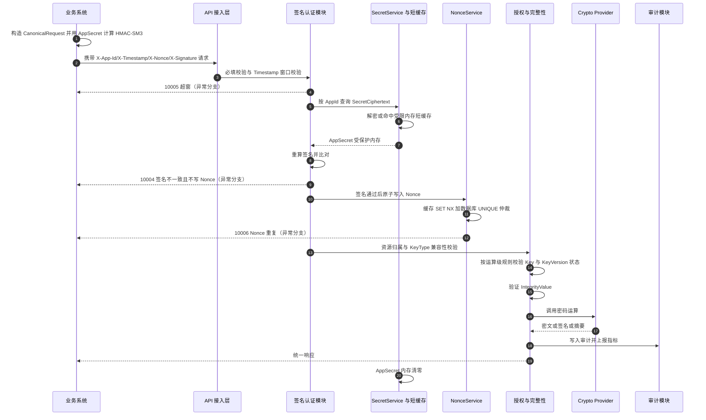

**对应需求步骤**：11.1 全流程；异常分支 10004/10005/10006；可能触发 12001/12003/40004/90001-90003。

## 10.2 管理端登录与 MFA

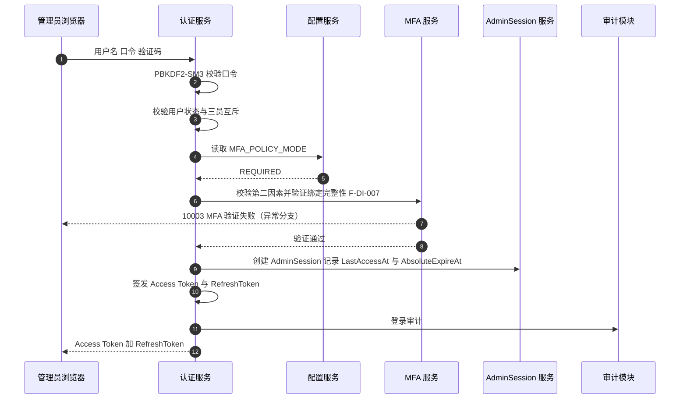

## 10.3 密钥生成与激活

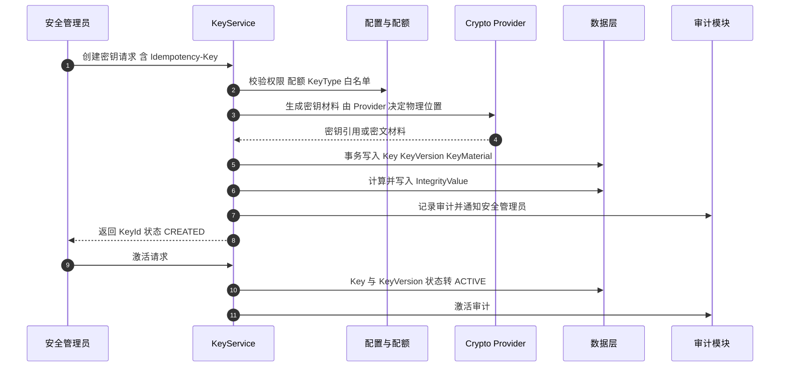

**异常分支**：Provider 成功但数据库失败 → 补偿核查并按 ProviderReference 清理孤儿材料（§5.6）。

## 10.4 密钥轮换

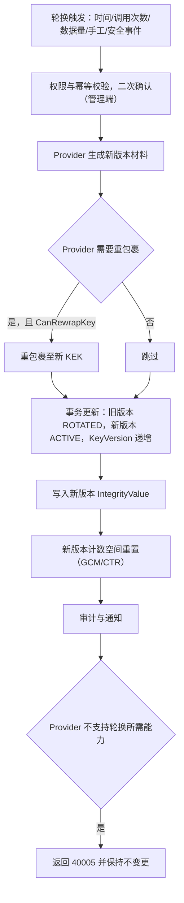

## 10.5 密钥销毁

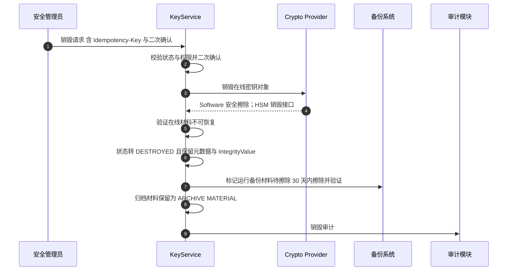

**异常分支**：Provider 不支持销毁或设备异常 → 返回 40010/40005，**不得将 Key 置为 DESTROYED**，记录安全事件。

## 10.6 密钥备份与恢复验证

```mermaid
flowchart TB
    A["管理员发起备份"] --> B{"Provider 能力 CanBackupKey"}
    B -->|不支持| C["返回 40005 并在控制台明示"]
    B -->|支持| D{"部署模式"}
    D -->|Software| E["导出 WrappedMaterial 到平台备份"]
    D -->|HSM| F["调用 HSM Vendor Backup，平台记录 BackupRecord"]
    E --> G["备份加密并生成完整性保护值，与生产隔离存储"]
    F --> G
    G --> H["执行恢复演练"]
    H --> I{"部署模式"}
    I -->|Software| J["恢复数据库 输入主密码 解封 Root Key 逐层解封"]
    I -->|HSM| K["恢复数据库与 HSM 重建 Key Reference"]
    J --> L["恢复身份校验 KeyId 到 ProviderKeyIdentity 到 ProviderReference"]
    K --> L
    L --> M["恢复验证：SM2/SM4/HMAC 实际运算"]
    M --> N["记录恢复人员 时间 结果与审计"]
```

## 10.7 密码设备故障切换

```mermaid
sequenceDiagram
    autonumber
    participant HC as 健康检查与监控
    participant DEV as 设备管理模块
    participant PRV as Provider 路由
    participant STBY as 备用设备
    participant AUD as 审计与告警

    HC->>DEV: 连续 3 次健康检查失败（3 分钟窗口）
    DEV->>DEV: 标记设备不可用
    DEV->>AUD: 告警并记录安全事件
    DEV->>STBY: 按主备配置切换
    STBY-->>DEV: 密码运算可用性验证通过
    PRV->>DEV: 新请求路由至备用设备
    DEV-->>PRV: 拒绝无法承载的运算并返回 70001
    Note over DEV,STBY: 设备恢复后重新健康检查并回切
```

**约束**：切换时**不得自动降低安全等级**（NF-AVAIL-008）；全部设备不可用时按 NF-AVAIL-010 **拒绝密码运算**。

## 10.8 软件密码模块主密码丢失恢复

见 §3.5.2（流程图与异常分支）。

## 10.9 审计外部锚点

见 §7.3（流程图）；错误码 80001/80003。

## 10.10 完整性巡检

```mermaid
flowchart TB
    A["后台任务触发（默认每 24 小时，可配置）"] --> B["按策略分批读取关键表记录（限速 低峰）"]
    B --> C["按规范重算 IntegrityValue"]
    C --> D{"与存储值一致"}
    D -->|是| E["记录巡检结果 继续下一条"]
    D -->|否| F["拒绝使用该记录 返回 90001/90003"]
    F --> G["记录安全事件 DATA_INTEGRITY_VIOLATION 并告警"]
    G --> H["保留原始数据与校验值"]
    H --> I["支持人工复核与数据恢复"]
    E --> J["写入 IntegrityScanRecord 与审计"]
    I --> J
```

---

# 11. 异常处理与降级设计

> 需求依据：3.1.6、3.2.14、3.9、3.11.5、4.2、6.4、6.11、11.6、13.3、NF-AVAIL-006/010、NF-CMP-006。

## 11.1 异常分类与统一处置策略

| 类别       | 典型场景                                                   | 处置原则                                                     | 错误码       |
| ---------- | ---------------------------------------------------------- | ------------------------------------------------------------ | ------------ |
| 认证类     | 头缺失、签名不一致、超窗、Nonce 重复                       | 一律拒绝；**认证失败不写 Nonce**；按阈值记录安全事件   | 10001～10007 |
| 会话类     | Token 无效/过期/撤销、会话超时                             | 拒绝并要求重新登录；不泄露具体内部原因                       | 11001～11006 |
| 授权类     | 权限不足、资源归属不符、KeyType 不兼容                     | 拒绝 + 安全事件；越权 1 次即告警                             | 12001～12003 |
| 参数类     | 缺参、格式错误、长度超限                                   | 拒绝并返回明确字段信息（不回显敏感数据）                     | 20001～20002 |
| 密码运算类 | 运算失败、Tag 校验失败、模式不支持、计数器溢出、自检失败   | 拒绝；Tag 失败**整体判定失败**；自检失败**停服** | 30001～30005 |
| 密钥类     | 不存在、状态非法、版本不存在、导入/备份/恢复失败、销毁失败 | 拒绝并保持原状态；**失败不得产生状态跃迁**             | 40001～40010 |
| 系统类     | 内部错误、依赖不可用、Provider 结果未知                    | 服务保护 + 明确错误；不泄露内部细节                          | 50001～50003 |
| 限流类     | 过载、签名失败限流                                         | 拒绝并返回重试提示                                           | 60001        |
| 设备类     | 设备不可用、证书无效                                       | **拒绝密码运算，不降级**                               | 70001～70002 |
| 事件类     | 策略拒绝、审计/锚点异常、降级被禁止                        | 记录 CRITICAL 事件并告警                                     | 80001～80004 |
| 完整性类   | 完整性值不一致/缺失                                        | **拒绝使用数据** + 安全事件 + 告警                     | 90001～90003 |

## 11.2 Provider 异常语义与补偿

| Provider 结果    | 平台语义          | 处置                                                                                                                                                                                             |
| ---------------- | ----------------- | ------------------------------------------------------------------------------------------------------------------------------------------------------------------------------------------------ |
| Success          | 成功              | 正常返回，写成功审计                                                                                                                                                                             |
| NotSupported     | 能力不支持        | 返回**40005**；**不修改任何状态**；不写成功审计；管理端明示                                                                                                                          |
| Failed           | 明确失败          | 返回对应业务错误码；事务回滚；**不重试**破坏性操作                                                                                                                                         |
| Timeout / 无响应 | **UNKNOWN** | 标记`ProviderResultUnknown`；**禁止自动重试密码材料生成与销毁**；进入核查队列：后台向 Provider 查询实际状态（按 ProviderReference）后收敛；期间相关 Key 状态冻结为"处理中"，禁止参与运算 |

**补偿核查流程**

```text
UNKNOWN 产生 → 记录 50003 + 安全事件 → 冻结相关 Key 状态
  → 后台/人工向 Provider 查询（按 ProviderReference / ProviderKeyIdentity）
  → 材料存在：补齐数据库记录，解除冻结（补写 IntegrityValue 与审计）
  → 材料不存在：回滚数据库记录，解除冻结，记录安全事件
  → 处置结果必须审计，禁止静默处理
```

## 11.3 依赖不可用降级矩阵

| 依赖                        | 不可用影响                             | 降级策略                                                                                                                                     | 约束                                                                                                   |
| --------------------------- | -------------------------------------- | -------------------------------------------------------------------------------------------------------------------------------------------- | ------------------------------------------------------------------------------------------------------ |
| 缓存                        | Nonce 校验、Token 撤销、限流、分布式锁 | **Nonce 回退数据库**；撤销列表回退数据库；限流退化为宽松；分布式锁改用数据库锁                                                         | **不得因缓存故障绕过授权**；缓存故障**不影响核心密码服务连续性与授权判定**（NF-AVAIL-006） |
| 数据库                      | 全部持久化                             | **无降级**：拒绝服务并返回 50002；已就绪的运算可完成但审计写失败按 §11.4 处理                                                         | 数据库为主存；不得以缓存替代授权判定                                                                   |
| 密码设备（单台）            | 部分运算                               | 主备切换（§10.7）                                                                                                                           | 切换不得降低安全等级                                                                                   |
| 密码设备（全部）            | 全部密码运算                           | **拒绝密码运算**并报告 `cryptoModule` 不可用                                                                                         | NF-AVAIL-010；**禁止降级为软件实现或弱算法**（NF-CMP-006、80002）                                |
| 密码模块自检失败            | 密码运算                               | 停服（模块标记不可用）                                                                                                                       | 30003 + CRITICAL 事件                                                                                  |
| 缓存/DB 双写均失败（Nonce） | 防重放                                 | **拒绝请求** + 安全事件 + 告警                                                                                                         | §6.4                                                                                                  |
| 统一时间源                  | 签名时间校验、Token 超时、密钥到期判定 | **拒绝签名请求**；Token 判定按保守策略                                                                                                 | 4.11                                                                                                   |
| 消息队列                    | 审计外发、告警通知                     | 本地留存 + 重试；**不得丢弃审计事件**                                                                                                  | NF-CMP-009                                                                                             |
| 外部锚点存储                | 锚点写入                               | 本地缓存锚点并重试；持续失败触发 CRITICAL 事件                                                                                               | 80003                                                                                                  |
| 审计写入                    | 合规                                   | 写失败时业务操作**不应静默通过**：对高风险操作（密钥生命周期、销毁、导入、恢复）**拒绝完成**；对普通密码运算记录待补写队列并告警 | NF-CMP-007                                                                                             |

## 11.4 审计写入失败策略

| 操作类型                                                                | 审计写失败处置                                                      |
| ----------------------------------------------------------------------- | ------------------------------------------------------------------- |
| 高风险操作（密钥销毁/导入/恢复、Root Key/KEK 操作、配置变更、MFA 策略） | **失败即拒绝**（事务回滚），返回 50001 并告警                 |
| 常规密码运算                                                            | 允许完成，但进入本地待补写队列 + 告警；补写失败持续累计触发安全事件 |

## 11.5 异常响应与信息保护

1. 对外统一返回 `code / message / data / requestId / timestamp`；
2. `message` 使用预定义文案，**不得回显异常堆栈、SQL、路径、HSM 内部错误**；
3. 内部保留完整异常上下文（TraceId 串联），仅在受控日志中记录（日志本身也须脱敏）；
4. 相同错误码的响应时间应尽量一致，避免通过时序侧信道区分失败原因（签名比对使用恒定时间比较）。

---

# 12. 非功能设计落地

> 需求依据：第 4 章、第 5 章、第 8 章、12 章。

## 12.1 性能

| 指标              | 目标                                                      | 设计措施                                           |
| ----------------- | --------------------------------------------------------- | -------------------------------------------------- |
| SM4 吞吐          | ≥50 MB/s（软件模块，单节点）                             | 流式处理 + Provider 批处理；避免全量载入内存       |
| SM3 吞吐          | ≥100 MB/s（软件模块）                                    | 流式摘要                                           |
| SM2 签名/验签     | ≥500 次/s（软件）、≥200 次/s（HSM）                     | 连接池化 HSM 会话；按 HSM 实测形成基线表           |
| API P99           | ≤50ms（软件）/ ≤100ms（HSM）                            | 关键路径避免二次 IO；完整性值按需校验              |
| 密钥生成/查询 P95 | ≤200ms                                                   | 索引优化 + 连接池                                  |
| 密钥轮换/销毁 P95 | ≤500ms                                                   | 异步化重包裹与备份标记                             |
| 请求签名校验 P95  | **≤10ms（Software 硬指标）** / HSM 按 NF-PERF-009A | AppSecret 短缓存（≤60s / ≤30s）                  |
| SM4 API E2E       | P95 ≤100ms、P99 ≤200ms                                  | 端到端含 DB 与审计两类口径分别测量                 |
| SM2 Sign API E2E  | P95 ≤150ms、P99 ≤300ms                                  | —                                                 |
| 密钥查询 API E2E  | P95 ≤300ms、P99 ≤500ms                                  | —                                                 |
| 容量              | 应用 100～500；平台密钥 100 万；单应用 1 万               | 分区 + 索引 + 归档策略                             |
| 扩展性            | 支持当前业务量 3～5 倍                                    | 应用无状态 + Provider 池化 + 库/缓存垂直与水平扩展 |

**测试口径**：性能指标分为「包含数据库与审计」与「不包含数据库与审计」两类分别测试（4.1.1）；不得以"测试后调整需求"方式降低验收标准。

## 12.2 高可用与灾备

| 项         | 设计                                                                                        |
| ---------- | ------------------------------------------------------------------------------------------- |
| 可用性目标 | ≥99.95%；RTO ≤30 分钟；RPO ≤5 分钟                                                       |
| 应用层     | 双节点 Active-Active，**无状态**（Session/Nonce/幂等/撤销列表外置）                   |
| 缓存       | 主从 + 哨兵；故障降级见 §11.3                                                              |
| 数据库     | 主备复制 + 自动/人工切换                                                                    |
| 密码设备   | 主备（或集群）；密钥同步按三场景（同厂商集群同步 / 按需加载 + 同步服务 / 软件模块按需加载） |
| 后台任务   | NodeId 注册 + 分布式锁单实例执行；任务状态可恢复（NF-DR-005）                               |
| DR 边界    | 本期单机房多节点；**跨机房 DR 仅定义需求、不纳入本期验收**；备份支持异地存放          |
| 恢复语义   | 按 Provider 分别定义（§3.6.2）；恢复后必须做密码操作验证                                   |

## 12.3 可维护性与监控

| 类别     | 指标                                                                                    | 采集方式               |
| -------- | --------------------------------------------------------------------------------------- | ---------------------- |
| 服务     | API QPS、P50/P95/P99、错误率、活跃连接、线程池                                          | Prometheus`/metrics` |
| 密码服务 | 各算法调用量、成功率、平均耗时                                                          | 平台指标               |
| 密码设备 | HSM 连接状态、运算队列长度、健康检查结果                                                | 平台指标               |
| 密钥     | 总量、各状态数量、轮换次数                                                              | 数据库统计 + 指标      |
| 审计     | 写入速率、哈希链校验点、外发成功率、锚点延迟                                            | 平台指标               |
| 风险     | 安全事件数量与分级分布                                                                  | 平台指标               |
| 资源     | CPU、内存、磁盘、网络                                                                   | NodeExporter           |
| 数据库   | 连接数、慢查询、锁等待                                                                  | 数据库监控             |
| 缓存     | 命中率、连接数、内存使用                                                                | 缓存监控               |
| 业务特有 | GCM/CTR 全节点调用计数（相对 2³¹/2³² 水位）、AppSecret 短缓存命中率、完整性巡检进度 | 平台指标               |

**重大指标异常触发告警**（3.5.5）；管理控制台提供监控面板。

## 12.4 时间同步

全节点统一 NTP/时间同步；用于 Token exp 与空闲超时、签名 Timestamp、密钥过期、审计时间、安全事件时间、日志哈希链、备份、证书有效期。

- 时间源不可用时，涉及时间判定的操作按安全策略拒绝或告警；
- **签名时间窗口（±3 分钟）依赖统一时间源：时间源不可用必须拒绝签名请求**；
- 建议双时间源 + 本地守时。

## 12.5 安全设计要点汇总

| 域       | 设计要点                                                                                                                              |
| -------- | ------------------------------------------------------------------------------------------------------------------------------------- |
| 传输     | TLS 1.2+；业务与管理接口支持 GB/T 38636 国密 TLS（SM2 双证书 + SM4-GCM + SM3）；由 Web Server 卸载国密 TLS；回退通用 TLS 须审计并告警。**注：本项为平台自用通道保护（部署层承担），不是本平台对外提供的 TLS 服务能力**（范围冻结见 FR-12） |
| 存储     | 密钥材料仅密文/引用；手机号 UserDataDEK 加密；AppSecret SecretCiphertext；关键字段 IntegrityValue                                     |
| 认证     | 业务请求直接签名；管理端 Token + AdminSession + MFA 强制                                                                              |
| 授权     | RBAC + 三员互斥 + 资源归属 + KeyType                                                                                                  |
| 审计     | 哈希链 + 分片聚合 + SM2 签名 + 外部锚点 + 集中外发                                                                                    |
| 剩余信息 | 内存清零、元数据残留处理、设备擦除                                                                                                    |
| 禁止降级 | 无国密能力降级机制（80002）                                                                                                           |
| 密评衔接 | 密码能力永久按 GB/T 39786-2021 设计；软件模块合规性需测评机构确认                                                                     |

## 12.6 信创适配

| 类型       | 要求                                                  |
| ---------- | ----------------------------------------------------- |
| CPU        | 海光/鲲鹏/飞腾/龙芯                                   |
| OS         | 银河麒麟/统信 UOS/中标麒麟/Loongnix/openEuler         |
| 数据库     | 国产 P0 数据库（EF Core Provider 验证）               |
| 缓存       | 东方通 TongRDS / 达梦 CDM / 宝兰德（兼容 Redis 协议） |
| 密码设备   | 国产商用密码设备（认证证书核查 + 驱动信创版本管理）   |
| 密码库     | 国产密码库并完成适配验证                              |
| Web Server | Nginx（国密模块）或国产 Web Server                    |
| 浏览器     | 支持国密 TLS 的国产浏览器；兼容 Chrome/Edge           |
| 兼容矩阵   | 必须形成并经项目组评审确认；型号与版本招标后冻结      |

**约束**：非核心组件（MQ、日志、监控、配置）不得成为密码服务单点故障。

## 12.7 数据治理

分区（审计按月）、归档与恢复、Token/Nonce/幂等记录清理、IntegrityValue 巡检、备份保留周期可配置 —— 见 §8.4、§8.5、§7.6。

---

# 13. 需求追踪矩阵

> 说明：本节按需求族给出设计归属，覆盖 V2.9 全部 F-* / NF-* 编号族；V2.9 新增与变更编号单列（§13.3）。完整逐条矩阵（含测试用例与验收结果列）由项目配置管理在编码阶段填充。

## 13.1 功能需求 → 设计章节

| 需求编号族                    | 主题                 | 设计章节            | 接口/数据对象                                                      |
| ----------------------------- | -------------------- | ------------------- | ------------------------------------------------------------------ |
| F-SM2-001～007                | SM2 运算             | §4.2               | `/crypto/sm2/*`                                                  |
| F-SM3-001～002                | SM3                  | §4.3.1             | `/crypto/sm3/hash`                                               |
| F-SM4-001～005                | SM4                  | §4.4               | `/crypto/sm4/*`                                                  |
| F-HMAC-001～002               | HMAC-SM3             | §4.3.2             | `/crypto/hmac/*`                                                 |
| F-RNG-001～003                | 随机数               | §4.5               | `/crypto/random`                                                 |
| F-KAT-001～004                | 自检                 | §4.6               | `/crypto/self-test`                                              |
| （KeyType）                   | KeyType 兼容性       | §4.7               | 12003`KEY_TYPE_MISMATCH`                                         |
| F-KM-001～015、020            | 密钥生命周期         | §5.1～5.6          | `/keys/*`、`SysKey/SysKeyVersion/SysKeyMaterial`               |
| F-DI-001～003                 | 密钥完整性           | §7.6               | `IntegrityValue`                                                 |
| F-AUTH-001～006               | 应用管理             | §6.3               | `/admin/applications/*`、`SysApplication/SysApplicationSecret` |
| F-AUTH-010～017               | 管理端认证           | §6.5               | `/admin/auth/*`、`SysAdminSession/SysRefreshToken`             |
| F-AUTH-023                    | IP 白名单            | §6.10              | `SysApplication.IPWhitelist`                                     |
| F-AUTH-025～030               | 请求签名与 AppSecret | §6.2、§6.3        | 签名中间件、`SysApplicationSecret`                               |
| F-AUTH-020/021/022/024        | 已废弃               | §1.5               | 不实现（DEPRECATED-V2.5）                                          |
| F-AUDIT-001～011              | 审计                 | §7.1～7.4          | `/audit/*`、`SysAuditLog/SysAuditAnchor`                       |
| F-RISK-001～009               | 风险检测             | §7.5               | 检测引擎 +`SysSecurityEvent`                                     |
| F-ALERT-001～006              | 告警                 | §7.5.4             | `SysAlertRule` + 通知通道                                        |
| F-CON-001～013                | 管理控制台与 MFA     | §6.5、§6.6、§6.8 | `/admin/users/*`、`SysUser/SysUserMfaBinding`                  |
| F-DI-004～007                 | 用户与角色完整性     | §7.6               | 相关表`IntegrityValue`                                           |
| F-DEV-001～010                | 密码设备             | §3.3、§10.7       | `/admin/devices/*`、`SysCryptoDevice`                          |
| F-CFG-001～008                | 系统配置             | §9.5、§12         | `/admin/configs/*`、`SysSystemConfig`                          |
| F-HC-001～006                 | 健康检查             | §9.6               | `/health`、`/live`、`/ready`                                 |
| F-RI-001～004                 | 剩余信息保护         | §7.7               | SecureBuffer、销毁流程                                             |
| F-RK-001～013、F-KEK-001～007 | Root Key/KEK         | §3.1～3.7          | `/admin/rootkey/*`、`/admin/kek/*`                             |

## 13.2 非功能需求 → 设计章节

| 需求编号族                                 | 主题                          | 设计章节                         |
| ------------------------------------------ | ----------------------------- | -------------------------------- |
| NF-PERF-001～022（含 003A/004A/009A/017A） | 性能                          | §12.1                           |
| NF-AVAIL-001～010                          | 可用性                        | §12.2、§11.3                   |
| NF-DR-001～008                             | 灾备                          | §12.2、§8.5                    |
| NF-DATA-001～008                           | 数据治理                      | §8.4、§7.6                     |
| NF-BAK-001～005                            | 备份保留                      | §8.5、§3.6.2                   |
| NF-CMP-001～017                            | 合规                          | §12.5、§7.6、§6.2、§6.3、§3 |
| NF-XC-001～010                             | 信创                          | §12.6                           |
| （4.5/4.11/4.6/4.8）                       | 可维护性/时间同步/兼容性/容量 | §12.3、§12.4、§9.1、§12.1    |

## 13.3 V2.9 新增与变更需求专项追踪

| 需求编号               | 变更内容                                                                                                         | 设计落点                   |
| ---------------------- | ---------------------------------------------------------------------------------------------------------------- | -------------------------- |
| F-CON-013              | MFA 全局强制                                                                                                     | §6.5.1                    |
| F-CFG-006              | MFA_POLICY_MODE 配置                                                                                             | §6.5.1、§9.5             |
| F-CFG-007              | 业务 API 创建密钥配置                                                                                            | §5.4、§9.4               |
| F-CFG-008              | 随机数输出上限配置                                                                                               | §4.5                      |
| F-AUTH-030             | AppSecret 短缓存管理                                                                                             | §6.3.2                    |
| F-DI-007               | MFA 绑定完整性验证                                                                                               | §7.6、§10.2              |
| F-RK-013               | 软件模块主密码恢复                                                                                               | §3.5                      |
| NF-PERF-009A           | HSM 场景签名校验性能                                                                                             | §12.1                     |
| NF-PERF-017A           | （V2.9 新增性能项）                                                                                              | §12.1（阈值结合实测冻结） |
| 3.2.3 / ST-KV-001～014 | KeyVersion 状态机                                                                                                | §5.2.2                    |
| 3.2.22 HMAC 语义       | HMAC 历史验证                                                                                                    | §4.3.2、§5.3             |
| 3.11.5                 | Provider 备份/恢复语义与 NotSupported                                                                            | §3.3.3、§3.6.2、§9.4    |
| 6.2.4 / 6.10.3 / 7.6   | Nonce 双写一致性仲裁                                                                                             | §6.4                      |
| 3.4.4                  | 审计哈希链 CanonicalSerialize 与分片聚合                                                                         | §7.2                      |
| 3.1.3                  | CTR 计数器规则                                                                                                   | §4.4.3                    |
| 3.1.1                  | SM2 长度限制                                                                                                     | §4.2.1                    |
| 3.5.3                  | 签名失败防 DoS                                                                                                   | §7.5.3                    |
| 6.5 / 8.4              | 管理端 Token 资源归属规则                                                                                        | §6.6.3                    |
| 第 7 章字段补全        | KeyMaterial/UserMfaBinding/Role/Permission/AlertRule/RootKeyMetadata/KekMetadata/UserDataDEK/IntegrityScanRecord | §8.2                      |
| D-11～D-35             | 决策项                                                                                                           | §1.4、§4.8、§6、§7     |

---

# 14. 设计冻结项与待确认项

## 14.1 本文档已冻结的设计结论

| 编号  | 结论                                                                                                                 |
| ----- | -------------------------------------------------------------------------------------------------------------------- |
| FR-01 | 请求签名采用 CanonicalRequest 六段式，Base64 输出，`x-app-id;x-nonce;x-timestamp`，以固定测试向量为仲裁            |
| FR-02 | AppSecret 采用 SecretCiphertext（SM4-GCM + KEK-Runtime）+ SecretHash；短缓存 Software ≤60s / HSM ≤30s              |
| FR-03 | 完整性值算法：HMAC-SM3(IntegrityKey, CanonicalSerialize + TableName + RowId)，覆盖 19 张表，24 小时一轮巡检          |
| FR-04 | 逻辑密钥层级 L0～L3；部署模式 Software/HSM 互斥；HSM Master Key ≠ Platform Root Key                                 |
| FR-05 | Provider 最小准入集（Wrap/Unwrap/Generate/Destroy/SelfTest）+ 可选扩展能力；不支持返回 40005                         |
| FR-06 | 管理端 Access Token 15min/24h + AdminSession + RefreshToken（7 天、一次性、Hash 存储）+ MFA REQUIRED                 |
| FR-07 | Nonce 双写、DB UNIQUE 最终仲裁、TTL 6 分钟、HMAC 后写入                                                              |
| FR-08 | 审计 CanonicalSerialize 采用**长度前缀编码**（`len:value`）规避分隔符转义歧义；分片默认按 AppId 哈希 16 分片 |
| FR-09 | GCM Nonce = KeyVersion(4B)+NodeId(4B)+MonotonicCounter(4B)；CTR 16B 大端序 +1；溢出禁止回绕                          |
| FR-10 | 错误码新增 20 项设计补充码（§9.8.3）                                                                                |
| FR-11 | 分页约定（page/pageSize ≤200）、`confirmToken` 二次确认机制                                                       |
| FR-12 | **【范围冻结】本轮设计仅覆盖国密加解密服务本体**。不提供 CA 证书服务（签发/P10/CSR/生命周期/CRL/OCSP 发布/证书链构建）与 TLS 对外服务能力（TLS 网关/证书托管）。**保留**：国密 TLS 作为平台自用通道保护（由部署层 Web Server 卸载，NF-CMP-010）；证书「核查型」能力（HSM 认证证书登记与有效期检查、MFA 证书指纹比对、TLS 服务器证书监控）——判定线为「我签发排除，我核查纳入」。**永久禁止** PLAIN 明文模式。详见《设计范围界定与纳入排除清单》V1.0（SC-01～SC-09） |
| FR-13 | 平台内部密钥封装（备份密钥 / AppSecret / UserDataDEK）一律使用 **L2 Runtime KEK 封装**，**不引入对外数字信封接口**（数字信封属范围外 E-07） |

## 14.2 必须与需求方/联调前确认的事项

| 编号 | 事项                                                                          | 影响          | 建议关闭时间   |
| ---- | ----------------------------------------------------------------------------- | ------------- | -------------- |
| C-01 | 各密码服务与管理端接口的**请求/响应字段表**（需求未定义，本文档已补全） | 接口契约      | 联调前         |
| C-02 | 错误码全量清单（需求仅给关键示例）                                            | 对外错误语义  | 编码前         |
| C-03 | 分页与导出格式约定                                                            | 接口契约      | 联调前         |
| C-04 | 幂等记录表结构与唯一约束（本文档补充）                                        | 数据结构      | 编码前         |
| C-05 | PBKDF2-SM3 迭代次数最终值（性能与安全平衡）                                   | 安全参数      | 编码前冻结     |
| C-06 | 审计分片维度与聚合频率（I-22）                                                | 审计架构      | 详细设计评审   |
| C-07 | 完整性巡检批次、限速、低峰窗口（I-23）                                        | 运维          | 上线前         |
| C-08 | NodeId 分配与心跳、冲突检测机制（I-15）                                       | GCM 唯一性    | 编码前         |
| C-09 | 大字段摘要阈值（I-10，建议 4KB）                                              | 完整性实现    | 编码前         |
| C-10 | 主密码备份策略参数（I-20：分片数/最小恢复人数）                               | 灾备          | 上线前         |
| C-11 | HSM 厂商型号与能力集（I-01/I-02）                                             | Provider 实现 | 详细设计启动前 |
| C-12 | 国产数据库型号与 EF Core Provider（I-05）                                     | 数据层        | 详细设计启动前 |
| C-13 | 手机号 DEK 轮换周期（I-14）、RefreshKey 轮换周期（I-19）                      | 安全运维      | 上线前         |
| C-14 | 外部锚点生成周期（I-17）                                                      | 审计完整性    | 上线前         |
| C-15 | 短信服务商与验证码策略落地（I-13/I-21）                                       | 通知通道      | 上线前         |
| C-16 | 本设计补充的错误码与字段命名是否需与既有对接方兼容                            | 对外契约      | 联调前         |

---

# 附录 A. 与旧版详细设计文档的章节映射

| 旧文档章节                                               | 处置        | 新文档对应                  |
| -------------------------------------------------------- | ----------- | --------------------------- |
| 1 密钥管理详细设计                                       | 修订        | §5（状态机与运算规则重写） |
| 2 HSM / Crypto Provider                                  | 重写        | §3.2～3.3（能力模型）      |
| 3 数据库详细设计                                         | 修订 + 扩展 | §8                         |
| 4 API 完整详细设计                                       | 重写        | §9（认证模型与错误码重排） |
| 5 认证与凭据详细设计                                     | 重写        | §6                         |
| 6 审计与安全事件                                         | 修订 + 扩展 | §7.1～7.5                  |
| 7 HA / 灾备                                              | 沿用        | §12.2                      |
| 8 国产化部署                                             | 沿用        | §12.6                      |
| 9 测试与验收矩阵                                         | 沿用        | §13（并入追踪矩阵）        |
| 10 设计约束与待确认项                                    | 延续        | §14                        |
| 11 关键安全边界                                          | 沿用 + 扩充 | §2.4、§12.5               |
| 12 实施顺序                                              | 沿用        | §13.3（按需求族排布）      |
| 13～37（编码级设计、DDL、EF Core、Provider、异常模型等） | 修订        | §3～§11 对应章节          |

# 附录 B. 修订记录

| 版本           | 日期         | 说明                                                                                                                                                                                                                                                                                                          |
| -------------- | ------------ | ------------------------------------------------------------------------------------------------------------------------------------------------------------------------------------------------------------------------------------------------------------------------------------------------------------- |
| V1.0 / V1.1    | 2026-09 之前 | 基于需求 V1.0 的旧版详细设计（已过时）                                                                                                                                                                                                                                                                        |
| **V2.0** | 2026-09-28   | 依据需求 V2.9 重新编制：新增第 1 章需求升级影响与 79 处变更映射；重写认证模型、AppSecret 存储、完整性保护、逻辑密钥体系、Provider 能力模型、管理端会话；补全 KeyVersion 状态机、HMAC 历史语义、Nonce 仲裁、审计哈希链规范化、CTR/SM2 长度限制、主密码恢复；新增接口契约、数据表结构、异常与降级设计、追踪矩阵 |

---

> **编制说明**：本文档所有常量、阈值、公式、状态矩阵、错误码均取自《国密加密服务系统软件需求规格说明书》V2.9；需求未明确而由本设计补全的部分（字段类型、接口字段、分页约定、幂等表结构、补充错误码、分片与巡检参数）均已在 §9.1.2、§9.8.3、§14.2 显式标注，**需在评审与联调前确认**，不得作为已确认需求使用。
