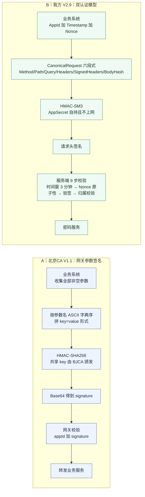
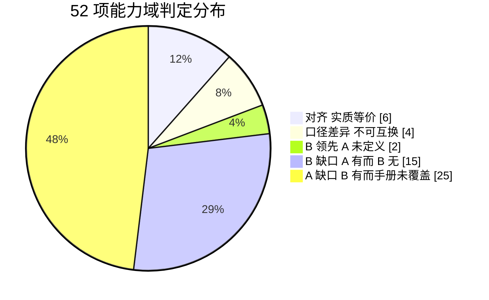

# 北京 CA《密码云服务平台·通用密码服务集成指南手册 V1.1》与我方系统设计对比分析报告

| 项目 | 内容 |
| --- | --- |
| 文档版本 | V1.0 |
| 编制日期 | 2026-09-28 |
| 对比对象 A（外部基线） | 《密码云服务平台 通用密码服务 集成指南手册（V1.1）》，北京数字认证股份有限公司，2022 年 8 月 |
| 对比对象 B（我方设计） | 《国密加密服务系统软件需求规格说明书》V2.9（2026-09-28 编码基线版） 《国密加密服务系统详细设计文档》V2.0 《国密加密服务系统 生产环境双节点部署架构》V1.0 |
| 对比方法 | 先按"能力域 + 接口契约"双维度对齐，再做字段级映射与缺口判定 |
| 结论摘要 | **两者不是同一类产品**：A 是面向外部租户的**公有云密码服务（CFaaS）**，B 是**自主可控、满足等保三级 + 密评的私有化密码服务平台**。A 在"证书/时间戳/信封/隐私计算"等业务增值服务族上明显更宽；B 在"密钥治理、审计防篡改、访问控制、合规与高可用"等平台底座能力上明显更深。**52 项能力判定：对齐 6、口径差异 4、B 领先 2、B 缺口 15、A 缺口 25。** |
| 范围裁定（2026-09-28 追加） | **本轮设计范围已收窄为「仅国密加解密服务」**，CA 证书服务与 TLS 对外服务能力明确排除。据此，原「B 缺口 15 项」中 **9 项改判为「范围外」**，剩余 6 项仍建议纳入。**最新裁定以《国密加密服务系统_设计范围界定与纳入排除清单》V1.0 为准**（该文第 8 章给出逐项重分类对照表）。本报告正文保持 V1.0 原貌不回溯修改，阅读时请对照该清单。 |

---

> ⚠️ **范围裁定提示（2026-09-28 追加）**
> 甲方已确认：本轮设计**仅覆盖国密加解密服务**，**CA 证书服务与 TLS 对外服务能力不纳入范围**。本报告 §2.3（证书、签名格式与服务）、§2.4（时间与凭证类服务）、§2.5 部分条目中原判定为「**B 缺口**」的能力项，现应改为「**范围外（本轮不纳入）**」；§4.1 第 3 项「DK 信封化下送」的对外接口建议**撤销**（改用平台内部 L2 Runtime KEK 封装）。重分类明细见《设计范围界定与纳入排除清单》V1.0 第 8 章。
> 另注：§2.3/§2.5 中的**证书「核查型」能力**（HSM 认证证书核查、MFA 证书指纹比对、TLS 服务器证书监控）**仍在范围内**，判定线为「**我签发排除，我核查纳入**」。

---

## 0. 口径声明（先读这一节，否则结论会失真）

1. **A 是"对外集成手册"，不是"系统设计文档"。** 它只描述"客户端如何调接口"，全文 3449 行、259 张表格，其中不含任何内部架构、部署、密钥治理、审计、合规、高可用内容。经全文关键词校验，以下词汇在 A 中**出现次数为 0**：授权、白名单、幂等、限流、高可用、集群、双活、备份、恢复、审计、脱敏、访问控制、三员、密评、等保、合规、密钥销毁、密钥归档、密钥导入、时间同步、监控、告警、TLS、双向。
   → 因此 **"A 手册未提及" ≠ "BJCA 平台未实现"**。本报告在给出缺口判定时，一律注明是"公开文档未覆盖"还是"确证能力缺失"。
2. **A 的定位是公有云多租户 SaaS**（appId 由管理员在"密管系统"创建、BJCA 为租户颁发签名 key、底层调用厂商密码机/时间戳服务器），**B 的定位是私有化部署的国密基础服务**（自有 HSM/软件密码模块、L0～L3 自管密钥体系、直连安全管理中心）。**两者的"密钥归属"根本不同**：A 是"客户把密钥托管给 BJCA"，B 是"客户自己掌控全部密钥与主密码"。
3. 本报告只做**能力与契约层面的客观对照**，不对任何产品做优劣背书。判定用词统一为：
   - **对齐**：概念与能力实质等价，可互相借鉴；
   - **A 缺口 / B 缺口**：一方**明确提供**而另一方**明确不具备或未定义**；
   - **口径差异**：能力存在但语义、边界或暴露方式不同，**不可直接互换**。

---

## 1. 总体定位与形态差异

| 维度 | A：北京 CA 密码云服务平台 V1.1 | B：我方国密加密服务系统（V2.9 / V2.0） | 判定 |
| --- | --- | --- | --- |
| 产品形态 | 公有云密码服务（CFaaS 层业务服务），底层调用 BJCA 服务器密码机（V1.2.0+）、时间戳服务器（V1.6.1） | 私有化部署的国密基础服务平台，承载自有 HSM 与软件密码模块（Provider 双实现） | 口径差异 |
| 服务对象 | 外部客户业务系统（B/S、C/S、S/S），支持 Java/Go/PHP 等语言 | 平台内业务应用（AppId 受控注册）+ 管理端三员 | 口径差异 |
| 接口规模 | **74 个接口**，9 大服务族；按路径分为 `chiron`(13)、`cmk`(10)、`dataKey`(12)、`dsvs`(19)、`tss`(10)、`eventCert`(3)、`fpe`(6)、`idsctid`(4)、`external`(3) | **约 92 个端点**：业务 API 30 + 管理端 59 + 健康检查 3 | 规模量级相当，重心不同 |
| 接口风格 | REST/JSON，`http://ip:port/{服务组}/{动作}`，POST 为主 | REST/JSON，`/api/v1/{crypto\|keys\|audit\|system}` 与 `/api/v1/admin/**`，方法语义化 | 口径差异 |
| 接口版本 | 部分接口并存 `/chiron/system/**` 与 `/chiron/v1/system/**` 两套路径 | 统一 `/api/v1/`，重大不兼容变更升 `/api/v2/`，V1 废弃须公告 + 迁移说明 + 兼容周期 | **B 更规范** |
| 鉴权模型 | 网关参数 `appId + signAlgo + signature`（HMAC-SHA256 / SHA256withRSA / SM3withSM2 / PLAIN） | **双模型**：业务 API = 请求直接签名（HMAC-SM3，AppSecret 不上网）；管理端 = Access Token + AdminSession + RefreshToken + MFA 强制 | **B 显著更强** |
| 租户与凭据管理 | appId 由管理员在密管系统创建；签名 key 由 BJCA 颁发 | AppId 全生命周期管理（创建/启停/Secret 重置-轮换-撤销/IP 白名单） | **B 更完整** |
| 合规与安全基线 | 手册未涉及 | 等保 2.0 三级（GB/T 22239-2019）+ 密评（GB/T 39786-2021）+ 信创 | **A 公开文档未覆盖** |
| 交付物 | 集成手册 + Demo（`mp_demo.rar`）+ UKey 组件 | 需求规格 + 详细设计 + 部署架构 + 实现规范 + DDL + 开发实施计划 | B 更工程化 |

**一句话结论**：A 是"**能力货架**"（算法、证书、时间戳、信封、FPE、身份核验一应俱全，客户按需调用），B 是"**治理底座**"（密钥分层、完整性、审计、三员、高可用、合规）。**两者可以互补，但不能互相替代。**

---

## 2. 服务能力域对比矩阵（52 项）

判定口径：**对齐** = 双方实质等价；**B 缺口** = A 明确提供、B 明确不具备或未定义；**A 缺口** = B 明确具备、A 公开手册未覆盖；**口径差异** = 两者都有但不可互换。

### 2.1 基础密码算法能力

| # | 能力项 | A（BJCA V1.1） | B（我方 V2.9/V2.0） | 判定 |
| --- | --- | --- | --- | --- |
| 1 | SM2 加解密 | `crypto/asymmetricDecrypt`、`priKeyDec` 支持 | `/api/v1/crypto/sm2/encrypt`、`/decrypt`，含 512B 长度限制与 C1C3C2/C1C2C3 编码约定（D-01/D-02） | 对齐（B 约束更细） |
| 2 | SM2 签名验签 | PKCS1/PKCS7 原文与摘要签名验签，`SM3withSM2` | `/crypto/sm2/sign`、`/verify`（裸签名值） | 口径差异：**A 只出 PKCS1/PKCS7 格式，B 只出裸值** |
| 3 | SM3 摘要 | 作为签名内部步骤，无独立接口 | `/crypto/sm3/hash` 独立接口 + 流式分块 | **A 缺口** |
| 4 | SM4 对称加解密 | `cmk/encrypt`、`dataKey/encrypt`，支持 **ECB / CBC**，padding `PKCS7Padding` | `/crypto/sm4/encrypt`、`/decrypt`，支持 **GCM / CBC / CTR / ECB** | 口径差异：**A 无 GCM/CTR** |
| 5 | HMAC | 手册未列独立接口 | `/crypto/hmac/generate`、`/verify`（HMAC-SM3，含历史版本验证语义） | **A 缺口** |
| 6 | 随机数 | `chiron/system/genRandom`，`length` 最大 **8192** | `/crypto/random`，默认 **64KB**、上限 **1MB** | 对齐（B 上限更大） |
| 7 | RSA 运算 | 支持：1024/2048 生成、`RSA/ECB/PKCS1Padding` 私钥解密、`RSA/NONE/NOPADDING` 纯运算、`SHA256withRSA` | **不提供 RSA 密码运算**（RSA 仅出现在 TLS 证书体系） | **B 缺口**（需确认是否有 RSA 兼容诉求） |
| 8 | 算法能力查询 | 手册未列 | `GET /crypto/algorithms`（返回支持模式、长度限制、Provider 能力摘要） | **A 缺口** |
| 9 | 密码模块自检 | 手册未列 | `POST /crypto/self-test` + 上电/周期/按需 KAT + 失败处置 | **A 缺口** |
| 10 | 国密 TLS 传输 | 集成环境写"通过 HTTP 或 HTTPS 请求调用"，未明确国密套件 | HTTPS 优先国密 TLS（GB/T 38636），SM2 双证书；回退 TLS 1.2+ 须审计告警 | **B 更明确** |

### 2.2 密钥管理能力

| # | 能力项 | A（BJCA V1.1） | B（我方 V2.9/V2.0） | 判定 |
| --- | --- | --- | --- | --- |
| 11 | 主密钥（CMK）托管体系 | **独立对外服务族，11 个接口**：生成/加密/解密/注销/启停/自动轮转开关/手动轮转/改周期/版本查询/策略查询 | 无"对外 CMK"概念；对应内部 **L1 Root Key**，仅管理端 `/admin/rootkey/*` 可操作 | 口径差异：**A 把根密钥做成业务能力，B 把它关进管理端** |
| 12 | 数据密钥（DK）体系 | **独立对外服务族，14 个接口**，区分**托管型 HOSTING_KEY** 与**非托管/事件型 EVENT_KEY**，支持"DK 转公钥加密"（信封化下送） | 无独立 DK 对外 API；L3 Data Key 为内部层级，业务通过 `keyId + keyVersion` 使用 | 口径差异（**A 的 DK 信封化下送模式值得借鉴，见 §4.3**） |
| 13 | 非对称密钥对 | `chiron/system/generateKeyPair`：SM2(256)/RSA(1024/2048)，`keyStore`=EVENT_KEY/HOSTING_KEY | 统一 `/api/v1/keys` 创建，KeyType=SM2/SM4/HMAC + `AlgorithmParams` | 对齐（B 类型更泛化） |
| 14 | **密钥别名 alias** | 支持 `alias` 字段（如 `testCkm`、`testDataKey`） | **不支持** | **B 缺口**（易实现、集成友好度高） |
| 15 | **密钥用途 keyUsage** | 支持 `keyUsage` = ENCRYPT / DECRYPT | 无独立用途字段，由 KeyType + 调用接口隐式约束 | **B 缺口**（B 用 KeyType 覆盖，但缺少"同算法不同用途"细分能力） |
| 16 | **配置化自动轮转周期** | `autoRotation`(ENABLED/DISABLED) + `rotationDays`（**默认 365 天**）+ `nextUpdateTime` 可查；策略查询接口 `getKeyRotationStrategy` | 轮换策略"配置驱动"，支持按时间/调用次数/数据量/手工/安全事件触发，**但具体配置项参数未定义** | **B 缺口**（B 需在详细设计中补齐策略参数表） |
| 17 | 密钥版本管理 | `getAllVersionCmk`、`getAllVersionDataKey` | `GET /keys/{keyId}/versions` + 版本选择契约（未指定用 ACTIVE，历史版本仅允许解密/验签） | 对齐（**B 的"历史版本仅解密/验签"约束 A 未定义，更严谨**） |
| 18 | 密钥状态机 | `keyState` = ENABLED / DISABLED（CMK 维度） | **双状态机**：Key 7 态（CREATED/ACTIVE/DISABLED/ROTATED/EXPIRED/REVOKED/DESTROYED）+ KeyVersion 6 态，共 32 个状态转换（ST-KM-001～018、ST-KV-001～014） | **B 显著更完整** |
| 19 | 密钥导入 | 手册未列独立接口（有 `encCert` 信封方式间接导入） | `POST /keys/import` + `CanImportKey` 能力校验 + 加密保护材料 | **A 缺口** |
| 20 | 密钥备份 / 恢复 / 恢复验证 | 手册未列 | `/keys/{keyId}/backup`、`/keys/restore`、`/keys/{keyId}/verify-recovery`；**按 Provider 分别定义语义**（Software 可导出包裹材料 / HSM 依赖厂商备份机制）；恢复验证**必须实际执行密码运算** | **A 缺口** |
| 21 | 密钥销毁与材料处置 | 有 `revoke`（注销），**销毁流程未见** | 销毁 9 步流程 + 材料分类 + **销毁后备份处置策略** + 事务补偿（§5.5） | **B 更完整** |
| 22 | 根密钥灾备恢复 | 手册未列 | **F-RK-013 软件密码模块主密码丢失恢复**（主密码备份策略 + 恢复流程，可选 Shamir 分片托管） | **A 缺口** |
| 23 | 密钥材料物理承载 | 私钥由密码机指定索引加密保护，密服存库；`encCert` 支持业务证书保护 DK | `StorageType` = WRAPPED_DATABASE（KEK-Runtime 保护）/ HSM_REFERENCE（Key Handle）；`ProviderKeyIdentity`（KCV/公钥指纹）**必须参与完整性校验** | 对齐（**B 的 Provider 解耦与能力准入更工程化**） |

### 2.3 证书、签名格式与服务

| # | 能力项 | A（BJCA V1.1） | B（我方 V2.9/V2.0） | 判定 |
| --- | --- | --- | --- | --- |
| 24 | **P10 证书申请** | `dsvs/ext/genP10`、`dsvs/genKeyPairAndP10FC`（用托管密钥签发 P10） | **不具备** | **B 缺口** |
| 25 | **PKCS1 签名 / 验签** | 原文 + 摘要共 4 个接口，`oriData` 上限 5MB | **不具备**（仅裸签名值） | **B 缺口** |
| 26 | **PKCS7 签名 / 验签** | attach / detach 多格式，原文 + 摘要共 4 个接口 | **不具备** | **B 缺口** |
| 27 | **证书 OID 解析** | `dsvs/cert/parseByOid` | **不具备** | **B 缺口** |
| 28 | **证书有效性验证服务** | `dsvs/cert/validate` + `verifyCert` 开关 + **证书验证策略 ID**（可返回"根不被信任/已过期/已作废/被拉黑/未生效"5 类细分错误码 85002001～85002005） | 仅部署层有"国密 CA + CRL/OCSP"依赖，**无对外证书验证接口** | **B 缺口**（且 A 的错误码细分粒度值得借鉴） |
| 29 | **数字信封构造 / 解析 / 转换** | `dsvs/envelope/encode`、`/decode`、`/convert` | **不具备** | **B 缺口** |
| 30 | 非对称托管密钥解密 | `dsvs/crypto/asymmetricDecrypt` | 等价能力由 `/keys` + `/crypto/sm2/decrypt` 组合承担 | 对齐（路径不同） |

### 2.4 时间与凭证类服务

| # | 能力项 | A（BJCA V1.1） | B（我方 V2.9/V2.0） | 判定 |
| --- | --- | --- | --- | --- |
| 31 | **时间戳服务（TSA）** | **10 个接口**：创建请求/创建时间戳/按原文（UTF-8、Base64）/按摘要/验证（3 种）/解析/取证书；依赖时间戳服务器 V1.6.1 | **不具备**；仅运维层 NTP 时间同步（NF-AVAIL-009） | **B 缺口**（且"时间戳"在我方文档中仅指请求头/字段名） |
| 32 | **事件证书服务** | **3 个接口**：申请事件证书 / 事件证书签名 / 申请并签名（事件型密钥按时段有效、定时清理） | **不具备** | **B 缺口** |

### 2.5 数据保护与隐私计算

| # | 能力项 | A（BJCA V1.1） | B（我方 V2.9/V2.0） | 判定 |
| --- | --- | --- | --- | --- |
| 33 | **FPE 保留格式加解密** | **6 个接口**（主密钥 / 托管 DK / 非托管 DK × 加解密） | **不具备** | **B 缺口** |
| 34 | **身份核验（实名/实人/手机号三要素）** | **7 个接口**：身份认证申请、两项/四项信息实名、两项/四项信息实人、获取数字信封证书、手机号三要素；另有 CITD 专用错误码段（109xxxxx/309xxxxx）与 `authInfo` 解密数据结构 | **不具备**（属第三方 CTID 能力，非密码服务本体） | **B 缺口**（**建议判定为"超出本期边界"，非缺陷**） |
| 35 | 外部资源存取 | `dsvs/external/resources`、`/getResources`（2 个接口） | **不具备** | **B 缺口**（非密码服务本体） |
| 36 | 应用凭据（AppSecret）加密保护 | 手册未列 | `SecretCiphertext`（KEK-Runtime 保护）+ `SecretHash` 双字段 + 受限内存短缓存（Software ≤60s / HSM ≤30s）+ 撤销联动清除 | **A 缺口** |
| 37 | 敏感字段（手机号）加密 | 手册未列 | `UserDataDEK` 统一加密处理，无 PhoneHash 机制 | **A 缺口** |

### 2.6 平台治理、安全与合规（A 公开手册基本空白）

| # | 能力项 | A（BJCA V1.1） | B（我方 V2.9/V2.0） | 判定 |
| --- | --- | --- | --- | --- |
| 38 | 请求防重放 | **手册未定义**（无 timestamp / nonce 参数，`transId` 仅作业务日志流水号） | `X-Timestamp`（±3 分钟窗口）+ Nonce，**缓存 + 数据库双写**，`UNIQUE(AppId, Nonce)` 最终仲裁，TTL 6 分钟 | **A 缺口**（安全水位差异显著） |
| 39 | 幂等 | **手册未定义** | `Idempotency-Key` 覆盖 **19 条敏感操作**，响应头回显 `Idempotent-Replay` | **A 缺口** |
| 40 | 审计与防篡改 | 无审计接口；响应体含 `trace` 错误栈 | 审计范围/字段清单/敏感数据禁止项 + **SM3 哈希链 + CanonicalSerialize 规范化 + 分片聚合签名 + SM2 签名 + 外部锚点** + 集中审计外发 + 断点续传 | **A 缺口** |
| 41 | 集中审计 / 告警外发 | 手册未列 | 安全管理中心对接（集中审计/告警/配置），通知通道含短信/Webhook | **A 缺口** |
| 42 | 三员分离与权限矩阵 | 手册未列 | 三员互斥 + 角色权限矩阵 + 资源归属校验 | **A 缺口** |
| 43 | MFA | 手册未列 | `MFA_POLICY_MODE`（本期 **REQUIRED**）+ UserMfaBinding | **A 缺口** |
| 44 | 会话 / Token 治理 | 仅见请求报文含 `accessToken`（移动端应用 Token），无机制说明 | Access Token（空闲 15min / 绝对 24h）+ AdminSession + RefreshToken（opaque、**一次性轮换**、仅存哈希、7 天） | **A 缺口** |
| 45 | 访问控制 / IP 白名单 | 手册未列 | IP 白名单（可选）+ AppId 归属校验 | **A 缺口** |
| 46 | 数据完整性保护 | 手册未列 | `IntegrityValue`（**HMAC-SM3 + IntegrityKey**）覆盖 **19 张关键表**；校验时机、策略、失败处理、完整性巡检记录 | **A 缺口**（**密评必备项**） |
| 47 | 剩余信息保护 | 手册未列 | 内存清零与剩余信息保护策略 | **A 缺口** |
| 48 | 限流与服务保护 | 手册未列 | 签名失败（AppId+IP）限流；全局过载保护模式（60000-60099 区间） | **A 缺口** |
| 49 | 异常与降级 | 仅错误码表 | 异常分类统一处置 + Provider 异常语义与补偿（UNKNOWN 补偿）+ **依赖不可用降级矩阵** + 审计写入失败策略 + 异常响应信息保护 | **A 缺口** |
| 50 | 监控与健康检查 | 手册未列 | `/health`、`/live`、`/ready` 组件级 + Prometheus `/metrics` + 监控指标清单 | **A 缺口** |
| 51 | 高可用与灾备 | 手册未列 | 双节点 Active-Active + Keepalived VIP + 主备数据库（RPO≤5min / RTO≤30min）+ 缓存主从哨兵 + HSM 主备 + 异地离线备份 | **A 缺口** |
| 52 | 合规对标 | 手册未列 | 等保 2.0 三级 + 密评 + 信创三项基线全量映射（责任边界矩阵） | **A 缺口** |

**矩阵统计（52 项）**：

| 判定 | 数量 | 序号 |
| --- | --- | --- |
| 对齐（实质等价） | **6** | #1、#6、#13、#17、#23、#30 |
| 口径差异（都有但不可互换） | **4** | #2、#4、#11、#12 |
| B 领先（A 深度不足或未定义） | **2** | #18、#21 |
| **B 缺口（A 明确提供，B 不具备）** | **15** | #7、#14、#15、#16、#24～#29、#31～#35 |
| **A 缺口（B 明确具备，A 公开手册未覆盖）** | **25** | #3、#5、#8～#10、#19、#20、#22、#36～#52 |

> 需注意：**B 缺口的 15 项中有 5 项（#3 SM3 独立接口、#5 HMAC、#8 算法能力查询、#9 自检、#19 密钥导入）属于"B 有等价能力但未以独立接口暴露"**，实质风险低；真正需要补的是 **#7 RSA、#14 alias、#15 keyUsage、#16 轮转参数、#24～#29 证书/签名格式族、#31～#35 增值服务族**。

---

## 3. 接口契约逐项对照（最有价值的差异都在这一节）

### 3.1 认证与鉴权

| 项 | A（BJCA V1.1） | B（我方 V2.9 / V2.0） |
| --- | --- | --- |
| 认证载体 | 网关公共参数：`version`、`signAlgo`、`signature`、`deviceId`、`appId`（另有 `accessToken`） | 请求头：`AppId` + `X-Timestamp` + `X-Nonce` + HMAC-SM3 签名（业务）；`Authorization: Bearer` + AdminSession（管理端） |
| 签名算法 | **可选多种**：`HmacSHA256`（推荐）、`SHA256withRSA`、`SM3withSM2`，**`PLAIN` 表示明文不签名** | **强制统一 HMAC-SM3**；管理端走 Token，不签名 |
| 签名密钥 | **对称 key，由 BJCA 颁发给用户**（共享密钥） | **AppSecret，客户自持，永不上网**；服务端以 `SecretCiphertext` 解封后验签 |
| 待签串构造 | 收集所有非空参数（含网关参数 + 业务参数）→ 按**参数名 ASCII 字典序**排序 → 拼 `key1=value1&key2=value2…` → HMAC → Base64 | **CanonicalRequest 六段式**：`Method \n Path \n Query \n CanonicalHeaders \n SignedHeaders \n BodyHash`，含**固定测试向量**作唯一仲裁 |
| 时间窗 | **无** | `X-Timestamp` ±3 分钟 |
| 防重放 | **无** | `X-Nonce` 原子性校验 + 缓存/DB 双写 |
| 密钥泄露影响面 | 对称共享 key 泄露 → 可直接冒充该 appId 签名（无时间窗、无一次性） | AppSecret 泄露 → 仍受时间窗 + Nonce 限制，且可即时撤销（**无兼容期**） |
| 安全事件联动 | 手册未定义 | 签名失败计入安全事件与告警（阈值表含 V2.9 防 DoS 调整） |

> **判定：B 的鉴权模型在抗重放、密钥不落地、可撤销性三个维度上明显更强；A 的模型胜在"算法可选、接入门槛低"，但 `PLAIN` 明文模式与无时间窗设计在等保三级场景下不可接受。**

### 3.2 字段级映射表

| 语义 | A 字段 | B 字段 | 映射关系 |
| --- | --- | --- | --- |
| 应用标识 | `appId`（如 `APP_3510558085994A75A57645255822FBF5`） | `AppId`（string(36)） | 语义相同 |
| 业务流水号 | `transId`（**15-64 位随机数，业务侧自填，仅建议记日志**） | `requestId`（**服务端生成，所有 API 必返**）+ `Idempotency-Key`（客户端提供，19 条敏感操作必填） | **A 用业务流水号兼作追踪；B 拆分为"服务端追踪"与"客户端幂等"两个独立机制** |
| 密钥标识 | `keyId`（CMK/DK）、`keyPairId`（非对称） | `keyId`（统一） | A 按算法族分裂为两类 ID |
| 密钥版本 | `keyVersion`（int）、`keyPairVersion`（int，CMK 场景固定 0） | `keyVersion`（int）+ `CurrentVersion` | A 部分接口**必填**版本；B **可选**，缺省用 ACTIVE |
| 版本使用边界 | 未定义 | **历史版本仅允许解密/验签（含 HMAC Verify）**；加密必须 ACTIVE | **B 更严谨** |
| 密钥用途 | `keyUsage` = ENCRYPT / DECRYPT | 无（由 `KeyType` + 接口语义隐含） | **B 缺口** |
| 算法规格 | `keySpec` = `AES_128` / `AES_256` / `SM4_128`；RSA 1024/2048；SM2 256 | `KeyType` = SM2/SM4/HMAC + `AlgorithmParams` | A 显式枚举规格，B 用参数对象 |
| 加密模式 | `mode` = **ECB / CBC**；`padding` = `PKCS7Padding`；`iv` = CBC 时 16 字节 Base64 | `mode` = **GCM / CBC / CTR / ECB**；GCM **禁止传入 iv**（平台生成，`KeyVersion+NodeId+Counter` 确定性 Nonce）；`tag` 128 位；CTR **禁止回绕** | **A 无 GCM/CTR** |
| 明文/密文编码 | **全部 Base64**（`plaintext`/`plainText`/`encData`/`cipherTextBlob`，注意大小写混用） | Base64（默认）/ Hex 可选，字段名统一小写 | A 存在字段名大小写不一致（`plaintext` vs `plainText`） |
| 密钥存储类型 | `keyStore` = `HOSTING_KEY`（托管）/ `EVENT_KEY`（事件型，按时段有效、定时清理） | `StorageType` = `WRAPPED_DATABASE` / `HSM_REFERENCE`；`CreatedSource` = 生成 / 导入 | **语义不同**：A 区分"生命周期长短"，B 区分"物理存放位置" |
| 轮转控制 | `autoRotation` = ENABLED/DISABLED、`rotationDays`（默认 365）、`nextUpdateTime` | 轮换策略配置驱动（时间/次数/数据量/手工/安全事件），具体参数待定义 | **B 缺口（参数缺失）** |
| 密钥状态 | `keyState` = ENABLED / DISABLED（**2 态**） | `Status` = **7 态** + KeyVersion **6 态** + 32 个转换 | **B 显著更完整** |
| 幂等标记 | 无 | `Idempotency-Key` + 响应头 `Idempotent-Replay: true/false` | **A 缺口** |
| 响应包装 | `{status, message, trace, data{}}`，成功 `status = 200` | `{code, message, data, requestId, timestamp}`，成功 `code = 0` | **口径差异**；A 的 `trace` 会**外泄错误栈**，B 明确禁止外泄堆栈 |
| 分页 | 未定义 | `page` / `pageSize`（≤200）/ `sortBy` / `sortOrder`；大结果集走异步导出 + 下载链接 | **A 缺口** |
| 限流 | 未定义 | 签名失败 AppId+IP 限流；全局过载保护 | **A 缺口** |
| 证书校验开关 | `verifyCert` = true/false；证书与公钥**二选一**，证书非空时以证书为准 | 无（由 CA/CRL/OCSP 依赖承担） | **B 缺口** |

### 3.3 错误码体系对照

| 项 | A（BJCA V1.1） | B（我方 V2.9 / V2.0） |
| --- | --- | --- |
| 编码方式 | 字面量直编（`8502007`、`85002001`、`20010001`、`851060056`…），按服务族分段但不严格 | **区间分段**：10000-10099 认证、20000-… 密钥、30000-… 密码运算、40000-… 密钥生命周期、60000-60099 限流与保护等 |
| 语义 | 以"服务端组件异常"为主（大量 `SecX 返回空值/未捕获异常`） | 以"业务语义 + 客户端可处理动作"为主（如 40003 版本不存在、40005 Provider NotSupported、30002 GCM Tag 校验失败） |
| 信息外泄 | 返回 `trace` 错误栈（如 `cn.bjca.timeOutException:message`） | **明确禁止**：堆栈、内部路径、SQL、HSM 内部错误细节、Padding 细节一律不得返回 |
| 证书类细分 | **优秀**：85002001～85002005 把"根不被信任/已过期/已作废/被拉黑/未生效"拆成 5 个码 | 无对应细分 |
| 可维护性 | 存在**明显质量问题**：`8502007` 与 `85002007` 混用、`851060056` 位数异常（应为 8 位）、错误码表在附录中重复出现 3 次且内容不一致 | 单一权威错误码表 + 设计补充错误码清单（20 项，标注"需求未列出，需确认"） |

> **判定：A 的证书类错误码细分粒度值得 B 借鉴；B 的区间分段、信息保护红线、码表唯一性明显优于 A。**

---

## 4. 我方（B）可借鉴的 8 项 —— 按落地优先级排序

### 4.1 高优先级（建议纳入下一版设计）

| 序 | 借鉴项 | A 的做法 | 对 B 的价值 | 落地成本 |
| --- | --- | --- | --- | --- |
| 1 | **密钥别名 `alias`** | `createKey` / `dataKey/enroll` 均支持 `alias`（如 `testCkm`） | 业务方按语义检索密钥，避免在代码里硬编码 `keyId`；轮换后无需改代码 | 极低（`SysKey` 加 1 个可空字段 + 唯一约束 `UQ_AppId_Alias`） |
| 2 | **配置化自动轮转参数** | `autoRotation`（ENABLED/DISABLED）+ `rotationDays`（默认 **365**）+ `nextUpdateTime` 可查 | B 目前只写了"配置驱动"，**策略参数未定义**，接口无法实现；可直接对齐为 `RotationPolicy{ mode, rotationDays, nextRotationAt, triggers[] }` | 低（补配置项 + `nextRotationAt` 字段 + 策略查询接口） |
| 3 | **DK 信封化下送（托管/非托管双模）** | `generateDataKey` 同时返回 `cipherDataKey`（CMK 保护）与 `cipherDataKeyByPubKey`（业务证书保护）；`decryptDataKeyByPubKey` 支持转换 | 直接映射到 B 的**备份密钥保护、AppSecret 分发、手机号 UserDataDEK 场景**；也可支撑"业务侧本地加解密 + 平台托管根密钥"的混合模式 | 中（新增 3 个接口 + 信封语义） |
| 4 | **证书有效性验证接口 + 错误码细分** | `cert/validate` + 验证策略 ID + 5 类细分错误码 | B 目前只有部署层 CA/CRL/OCSP 依赖，**业务方无法自助校验证书**；且 SM2 双证书场景必须有证书链校验能力 | 中（新增 1～2 个接口 + 策略配置） |

### 4.2 中优先级（建议评估后纳入）

| 序 | 借鉴项 | 说明 |
| --- | --- | --- |
| 5 | **密钥用途 `keyUsage`** | 支持"同算法不同用途"细分（如 SM4 加密专用 / 解密专用密钥），比 B 的 `KeyType` 单维度更细。若 B 需支持"密钥用途最小化"（密评关注点），建议补充 |
| 6 | **`keySpec` 显式算法规格串** | `SM4_128` / `AES_128` 这类规范化字符串，便于跨语言客户端实现与校验；B 的 `AlgorithmParams` JSON 对象更灵活但**缺少强制枚举**，建议增加规格白名单校验 |
| 7 | **`transId` 业务流水号贯穿** | A 要求调用方传入 15-64 位随机流水号并原样回显，便于**跨系统问题排查**。B 的 `requestId` 由服务端生成，业务方无法把自己系统的流水号关联进来 —— 建议允许业务侧传入 `X-Request-Id` 并在响应中回显 |
| 8 | **PKCS1 / PKCS7 / 数字信封 / P10** | 若 B 的服务对象需要与**既有 PKI 体系（CA、电子签章、公文流转、OFD/PDF 签章）**对接，这 4 类能力是刚需。**建议先确认业务边界再决定是否纳入** |

### 4.3 建议明确"不纳入"的项

| 项 | 理由 |
| --- | --- |
| 时间戳服务（TSA） | 属独立产品（A 依赖专用时间戳服务器 V1.6.1），B 本期为"加密服务"而非"可信时间服务"；若需要应单独立项 |
| 事件证书服务 | 强绑定 A 的事件型密钥与证书签发体系，与 B 的 Key/KeyVersion 模型不兼容 |
| FPE 保留格式加解密 | 场景特殊（银行卡号/身份证号格式化脱敏），若 B 有此类需求，**用 `UserDataDEK` + 应用层格式化更合适**，无需在密码平台内实现 |
| 身份核验 / 外部资源存取 | 属 CTID 第三方能力代理，与密码服务本体无耦合，**建议判定为超出本期边界** |
| RSA 密码运算 | B 为纯国密平台，RSA 仅存在于 TLS 证书体系；引入 RSA 运算会扩大密码算法面，**会加重密评范围** |
| `signAlgo = PLAIN` 明文模式 | **安全红线**：与等保三级"传输保密性"要求冲突，**禁止提供** |

---

## 5. 我方（B）显著领先的 11 项能力（评审时可直接引用）

1. **请求防重放**：`X-Timestamp` ±3 分钟窗口 + Nonce 缓存/DB 双写 + `UNIQUE(AppId, Nonce)` 最终仲裁（A 手册无此机制）。
2. **AppSecret 不落地**：`SecretCiphertext`（KEK-Runtime）+ `SecretHash` 双字段 + 受限内存短缓存（Software ≤60s / HSM ≤30s）+ **撤销联动清除、无兼容期**。
3. **数据完整性保护 `IntegrityValue`**：HMAC-SM3 + IntegrityKey 覆盖 19 张关键表，含校验时机、策略、失败处理与巡检记录 —— **密评必备，A 完全未覆盖**。
4. **审计防篡改链**：CanonicalSerialize 规范化 + 分片链 + 聚合签名 + SM2 签名 + **外部锚点防尾部重构造** + 集中外发 + 断点续传。
5. **三员分离 + MFA 强制 + 会话治理**：AdminSession + RefreshToken 一次性轮换（opaque、仅存哈希）+ 高风险操作二次确认（`confirmToken`）。
6. **幂等设计**：19 条敏感操作强制 `Idempotency-Key`，响应头回显重放标记。
7. **密钥分层与 Provider 解耦**：L0 Unlock KEK → L1 Root Key → L2 Runtime KEK → L3 Data Key 四层；Provider 采用 **Capability 最小准入集 + 可选扩展接口 + `NotSupported` 语义**，不阻塞国产 HSM 准入。
8. **密码运算边界严谨**：GCM **全节点 2³² 总量约束**（2³¹ 告警）、CTR **禁止回绕**、SM2 512B 长度限制、随机数 64KB/1MB 上限、KeyType 兼容性校验矩阵。
9. **状态机完整**：Key 7 态 + KeyVersion 6 态、32 个转换矩阵、运算级规则表（状态 × 操作允许性）。
10. **异常与降级设计**：Provider UNKNOWN 补偿、依赖不可用降级矩阵、审计写入失败策略、异常响应信息保护红线。
11. **合规与高可用**：等保三级 + 密评 + 信创三基线全量映射；双节点 Active-Active + 主备 DB（RPO≤5min/RTO≤30min）+ HSM 主备 + 异地离线备份。

---

## 6. 结论与建议动作

### 6.1 核心结论

1. **不存在"谁替代谁"的问题。** A 的 15 项缺口集中在"**面向业务的凭证类增值服务**"（PKCS1/7、信封、P10、时间戳、事件证书、FPE、身份核验、RSA），B 的 25 项领先集中在"**平台底座治理**"（防重放、幂等、完整性、审计、三员、高可用、合规）。**若 B 的服务对象需要与既有 PKI/CA 体系互通，A 的缺口项就是硬需求。**
2. **B 的接口契约层成熟度高于 A。** A 手册在幂等、防重放、分页、限流、错误信息保护、接口版本管理 6 个维度上均为空白，且存在错误码表重复矛盾、`PLAIN` 明文模式、`trace` 栈外泄等**明显质量问题**；B 在这些点上均已定义并留了待确认标注。
3. **A 有 4 项可直接、低成本回填 B 的设计缺口**（`alias`、轮转参数、DK 信封化、证书验证），建议在详细设计 V2.1 中补齐。
4. **B 当前最大的"未定义"风险是轮换策略参数与证书校验能力**：前者导致 `POST /keys/{keyId}/rotate` 的策略字段无法落地，后者导致 SM2 双证书场景缺少链校验手段。

### 6.2 建议动作清单

| 序 | 动作 | 落点 | 优先级 |
| --- | --- | --- | --- |
| 1 | 在 `SysKey` 增加 `Alias`（可空 + `UQ(AppId, Alias)`），接口增加 `alias` 入参与模糊检索 | 详细设计 §8.2.1 / §9.4 | P0 |
| 2 | 定义 `RotationPolicy` 参数表（`mode`、`rotationDays`、`nextRotationAt`、触发源），补 `GET /keys/{keyId}/rotation-policy` | 详细设计 §5.4 / §9.4 | P0 |
| 3 | 明确"证书校验"边界：若需对外提供，新增 `/api/v1/cert/validate` + 验证策略 + 5 类细分错误码 | 需求 V2.10 追加 + 详细设计 §9 | P1 |
| 4 | 评估 DK 信封化下送（`generateDataKey` / `decryptDataKeyByPubKey`）对备份密钥、AppSecret、UserDataDEK 场景的复用价值 | 详细设计 §3.6.3 | P1 |
| 5 | 增加 `keySpec` 强制枚举白名单校验（防 `AlgorithmParams` 被注入非法参数） | 详细设计 §4.7 | P1 |
| 6 | 支持业务侧传入 `X-Request-Id` 并在响应回显，提升跨系统排障效率 | 详细设计 §9.1 | P2 |
| 7 | 评估 `keyUsage` 细分（同算法不同用途）是否需要 | 需求评审 | P2 |
| 8 | 明确并归档"**不纳入**"清单（时间戳/事件证书/FPE/身份核验/RSA 运算/PLAIN），避免后续反复评审 | 详细设计 §14.1 设计冻结项 | P1 |

### 6.3 需你确认的事项

1. **B 的服务对象是否包含需要 PKCS1/PKCS7 签名、数字信封、P10 证书申请的第三方系统？**（若有，§4.2 第 8 项从"可选"升级为"必做"，工作量约新增 12 个接口）
2. **是否需要与北京 CA 或其他第三方 CA 做证书链互认？**（决定 §6.2 第 3 项的范围）
3. **A 手册引用的 `mp_demo.rar`（同名目录下的示例工程）是否需要一并分析？** 其中可能包含 SDK 封装、调用时序与更详细的错误处理约定，可补全手册未覆盖的行为细节。
4. 本报告对 A 的"缺口"判定，语义严格限定为"**该公开手册未覆盖**"。若你手上有 BJCA 的技术方案或部署文档，可提供以便做**第二层校准**（判定真实的实现深度）。

---

## 7. 可视化速览

### 7.1 两条鉴权链路对比（差异最集中的地方）

**读图要点**：A 的签名要素**不含时间与随机数**，因此同一请求可被无限重放；且签名 key 为**双方共享的对称密钥**，泄露即等于可任意冒充。B 在签名串中绑定了时间与 Nonce，密钥仅单向使用（不上网），抗重放与抗泄露能力互补。

### 7.2 52 项能力域判定分布

**读图要点**：红色系的 25 项是 B 的**治理底座优势**（合规、审计、防重放、完整性、高可用），蓝色系的 15 项是 B 的**业务能力缺口**（证书与签名格式族、增值服务族）。前者是本项目的**立身之本**，后者取决于**业务边界是否需要与外部 PKI 体系互通**。

### 7.3 B 缺口按风险分级

| 风险级 | 缺口项 | 后果 |
| --- | --- | --- |
| **高（影响联调）** | #16 轮转策略参数未定义 | `POST /keys/{keyId}/rotate` 的策略字段无法实现，接口无法交付 |
| **高（影响互通）** | #24～#29 PKCS1/PKCS7/信封/P10/证书校验 | 无法与既有 CA、电子签章、公文流转、OFD/PDF 签章系统对接 |
| **中（影响体验）** | #14 alias、#15 keyUsage、#7 RSA | 业务方需硬编码 keyId；无法表达"同算法不同用途"；RSA 客户端需改造 |
| **低（有等价能力）** | #3、#5、#8、#9、#19、#20、#22、#34、#35 | 能力已具备但未以独立接口暴露，或属超出本期边界 |
| **需评估** | #31～#33 时间戳/事件证书/FPE | 属独立产品线，若纳入需单独立项 |

---

## 附录 A. 对比素材与可追溯性

| 材料 | 位置 | 说明 |
| --- | --- | --- |
| A 手册原件 | `Desktop/北京CA-集成手册/签名验签+加解密_集成文档/密码云服务平台_通用密码服务集成指南手册V1.1.docx` | 489 KB，2022-08，北京数字认证股份有限公司 |
| A 手册提取正文 | `docs/北京CA-集成手册/密码云服务平台集成指南V1.1_提取正文.md` | 3449 行 / 259 张表格，按文档流顺序完整提取（含接口表、字段表、示例报文、错误码表） |
| A 手册结构 | 9 大服务族 74 个接口 | 主密钥 11 / 数据密钥 14 / 非对称密钥 5 / 签名 16 / 时间戳 10 / 事件证书 3 / FPE 6 / 身份核验 7 / 外部资源 2 |
| B 设计基线 | `docs/需求说明文档.md`（V2.9）、`docs/国密加密服务系统详细设计文档_V2.0.md`、`docs/国密加密服务系统_生产环境双节点部署架构_V1.0.md` | — |

## 附录 B. A 手册质量问题清单（引用时须注意）

| 序 | 问题 | 位置 | 影响 |
| --- | --- | --- | --- |
| 1 | 错误码位数不一致：`8502007`（7 位）与 `85002007` 语境冲突；`851060056`（9 位，疑为 `85106006`） | 附录 A.1 通用错误码表 | 客户端错误码匹配会失效 |
| 2 | 错误码表重复 3 次且内容不一致 | 附录"事件证书服务结果码说明" | 无法确定权威版本 |
| 3 | 字段名大小写混用：`plaintext` / `plainText` / `cipherTextBlob` / `ciphertextBlob` / `pubkey` / `pubKey` | 多处接口请求/响应示例 | 跨语言客户端易解析失败 |
| 4 | 部分表格是跨页断表，本章节提取时出现表头与数据错位 | 多处 | 已按文档流顺序保留，引用时请核对原件 |
| 5 | `origin` / `keyState` 字段描述自相矛盾（`keyState` 描述写成"密钥用途"） | 生成主密钥接口 `cmkMetadata` | 语义歧义 |
| 6 | 缺 `keyUsage` 联合值的合法组合定义（`ENCRYPT/DECRYPT` 是否可同时取值未说明） | 生成主密钥接口 | 无法确定取值约束 |

---

_本报告所有"缺口"判定均基于 A 手册公开内容与 B 的需求/设计文档，判定语已注明适用范围；不构成对任何产品的整体评价。_
