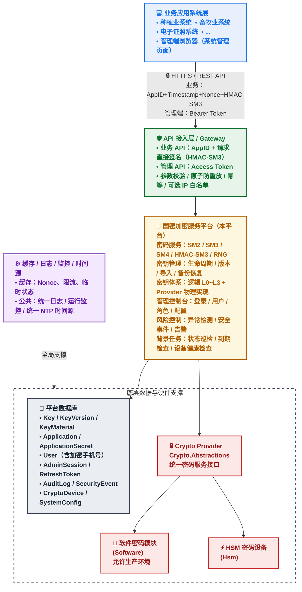
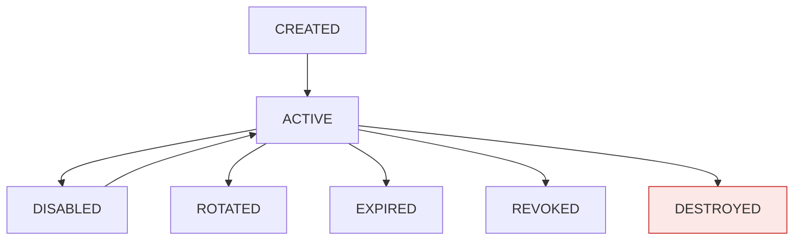

# 国密加密服务平台软件需求规格说明书

| 项目     | 内容                                                                                              |
| -------- | ------------------------------------------------------------------------------------------------- |
| 文档名称 | 国密加密服务平台软件需求规格说明书                                                                |
| 文档版本 | V2.6                                                                                              |
| 编写日期 | 2026-09-23                                                                                        |
| 文档状态 | 评审通过版（平台能力按密评要求设计；业务 API 采用请求直接签名）                                    |
| 上一版本 | V2.5                                                                                              |
| 文档用途 | 需求分析、系统设计、开发实施、测试验收及项目评审                                                  |
| 合规基线 | GB/T 22239-2019（等保2.0三级）、GB/T 39786-2021（密评）、信息技术应用创新（信创）                 |
| 认证基线 | 业务 API：AppID + 请求直接签名（HMAC-SM3，AppSecret 不在网络传输）；管理端：用户名 + 密码 + Token（可访问全部 API）；MFA 可选；密码设备准入认证 |

---

# 修订记录

| 版本 | 日期       | 修订内容                                                                                                                                                                                                                                                                                                                                                                                                                                                                                    |
| ---- | ---------- | ------------------------------------------------------------------------------------------------------------------------------------------------------------------------------------------------------------------------------------------------------------------------------------------------------------------------------------------------------------------------------------------------------------------------------------------------------------------------------------------- |
| V1.0 | 2026-09-17 | 初稿                                                                                                                                                                                                                                                                                                                                                                                                                                                                                        |
| V1.1 | 2026-09-17 | 修正 10 项逻辑问题；新增 24 项需求                                                                                                                                                                                                                                                                                                                                                                                                                                                          |
| V2.0 | 2026-09-23 | 对齐文档规范；纳入等保、密评、信创合规基线                                                                                                                                                                                                                                                                                                                                                                                                                                                  |
| V2.1 | 2026-09-23 | 关闭 V2.0 全部【待确认】事项；MFA 明确为可选启用                                                                                                                                                                                                                                                                                                                                                                                                                                            |
| V2.2 | 2026-09-23 | 采纳评审意见 H1～H10、M1～M16、L1～L5；新增 3.2.22、3.2.23、3.11、3.5.3～3.5.5、3.1.6、6.12、7.14、8.2 等                                                                                                                                                                                                                                                                                                                                                                                   |
| V2.3 | 2026-09-23 | 采纳复审意见 R-01～R-07；合并 HMAC-SM3 重复编号；新增 A.8 需求编号全清单                                                                                                                                                                                                                                                                                                                                                                                                                     |
| V2.4 | 2026-09-23 | 系统密码能力永久符合密评要求，删除密评模式配置                                                                                                                                                                                                                                                                                                                                                                                                                                              |
| V2.5 | 2026-09-23 | 业务 API 改为请求直接签名模式；Token 仅限管理端；删除 F-AUTH-020/021/022/024；新增手机号字段；软件密码模块允许生产；删除第 9 章工程结构                                                                                                                                                                                                                                                                                                                                                      |
| V2.6 | 2026-09-23 | 采纳评审意见 H0-01～H0-04、H1-01～H1-26、H2-01～H2-05：①AppSecret 改为 SecretCiphertext + SecretHash 存储，解决 HMAC-SM3 验签模型冲突；②Checksum 升级为 IntegrityValue（HMAC-SM3），解决数据库篡改者问题；③拆分平台能力基线与部署合规基线；④补全 A.8 需求编号全清单；⑤四层逻辑密钥体系（L0 Unlock KEK → L1 Root Key → L2 Runtime KEK → L3 Data Key）+ Provider 物理实现解耦（Software / HSM 互斥，剔除混合模式）；⑥Root Key 加载验证改为 KCV/Wrap-Unwrap 方式；⑦DESTROYED 重新定义（在线材料 vs 归档材料）；⑧HSM 密钥备份模型按 Provider 分别定义；⑨请求签名补充跨语言规范（7 项）；⑩Nonce 原子防重放（HMAC 成功后写入）；⑪新增 AdminSession、RefreshToken、KeyMaterial 实体；⑫新增 KeyType 兼容性检查、Permission 权限矩阵；⑬PhoneHash 改为 HMAC-SM3 密钥化；⑭补充密码策略、端到端性能指标；⑮修正 7.14→7.16、7.9→7.11 引用残留；⑯已删除编号标记 DEPRECATED；⑰D-16 未关闭改为上线前必须确认 |

---

# 目录

1. 项目概述
2. 系统总体架构
3. 功能需求
4. 非功能需求
5. 运行环境
6. 接口规范
7. 数据需求
8. 安全需求
9. V1.0 范围与优先级
10. 测试与验收需求
11. 典型业务流程
12. 责任边界矩阵
13. 需求编号与追踪矩阵
附录 A. 需求修正与补充说明

---

# 1. 项目概述

## 1.1 建设背景

随着业务系统国产密码算法应用和密码安全建设要求不断提高，传统由各业务系统自行实现加密、解密、签名、验签以及密钥管理的方式存在以下问题：

1. 各业务系统密码算法实现不统一，导致互操作性差；
2. 密钥分散存储，存在明文保存、泄露及权限失控风险；
3. 密钥生命周期管理能力不足；
4. 缺乏统一的密码服务接口；
5. 不同系统重复建设密码服务；
6. 加解密操作缺乏统一审计；
7. 密钥使用过程难以追溯；
8. 业务系统直接接触密钥材料，增加密钥泄露风险；
9. 密码设备及软件密码模块缺乏统一管理；
10. 缺少统一的密钥备份、恢复、轮换和销毁机制；
11. 难以形成统一的密码服务安全边界。

因此，建设统一的国密加密服务平台，对 SM2、SM3、SM4、HMAC-SM3 等密码算法提供统一服务，同时实现密钥全生命周期管理、统一身份认证、权限控制、审计、安全事件管理及密码设备管理。

本文档定位为平台级公共密码服务的软件需求基线。后续详细设计、编码、测试和验收应以经评审确认的版本为准。

> **说明**：接入系统清单、现有密码使用现状、对接时间表与业务量数据由业务方另行补充，不在本文档范围内。

**合规声明（V2.6 拆分）**：

**平台能力基线**：本平台密码能力按照 GB/T 39786-2021《信息安全技术 信息系统密码应用基本要求》第三级要求进行设计，不提供国密能力降级机制。同时满足 GB/T 22239-2019 第三级要求及信息技术应用创新（信创）相关要求。

**部署合规基线**：最终密码产品、密码模块、密码设备及具体部署方案的符合性，以项目实际选型及正式商用密码应用安全性评估结果为准。

**责任边界声明**：本平台按平台整体密码应用方案和等保方案进行建设。本平台承担密码运算、密钥全生命周期管理、密码设备管理及应用侧审计职责；业务系统承担自身业务数据的分类分级、业务加密策略与业务授权；密码设备（HSM）供应商承担密码模块自身的合规性与设备可靠性；最终密评对象、测评范围和符合性以平台整体方案及正式测评结果为准。

最终定级以平台整体定级结果为准。

## 1.2 软件定位

国密加密服务平台（Crypto Platform，以下简称"本平台"）定位为农牧业大数据平台统一的密码基础设施。

核心原则：统一密码能力，不统一业务密码策略。

本平台负责统一密码算法服务、密钥全生命周期管理、密码设备适配、应用认证与访问控制、审计与安全事件管理；业务系统负责自身业务数据的分类分级、业务加密策略、业务授权以及业务侧密钥使用申请。

**认证模式定位**：

- **业务 API**：采用 **AppID + 请求直接签名** 模式，AppSecret 不在网络传输，防止被劫持；支持防篡改、防重放；
- **管理端 API**：采用 **用户名 + 密码 + Access Token** 模式，支持管理页面登录后访问全部 API（含业务 API，用于后台测试验证）；
- **第三方系统**：仅允许使用签名模式调用业务 API，不允许使用 Token。

## 1.3 建设目标

平台总体目标是建立统一、安全、标准化、可审计的国密密码服务能力，为业务系统提供统一密码基础设施。

### 1.3.1 统一密码算法

平台统一提供：

1. SM2 非对称密码服务；
2. SM3 杂凑服务；
3. SM4 对称密码服务；
4. HMAC-SM3 消息认证服务；
5. 安全随机数服务。

### 1.3.2 统一密钥管理

建立密钥全生命周期管理机制，实现：

> 生成 → 创建 → 激活 → 使用 → 轮换 → 禁用 → 过期/注销 → 销毁

并支持密钥版本管理、密钥备份、恢复及恢复验证。

### 1.3.3 统一身份认证

**业务系统调用**：采用 AppID + 请求直接签名模式，业务系统在请求头携带 `X-App-Id`、`X-Timestamp`、`X-Nonce`、`X-Signature`，平台按相同规则重算签名并比对。AppSecret 不在网络传输。

**管理端登录**：采用用户名 + 密码 + 验证码，可选 MFA；登录成功后签发 Access Token，用于访问全部 API。

**高安全场景**：可结合 IP 白名单（可选）、双向 TLS 等安全控制。

### 1.3.4 统一审计

完整记录：

> 谁 → 什么时间 → 来自哪里 → 使用什么资源 → 执行什么操作 → 操作结果 → 请求耗时

并建立不可随意修改、删除的审计机制。

### 1.3.5 密钥不出安全边界

平台托管的 SM2 私钥、SM4 密钥、HMAC 密钥等敏感密钥材料不得通过普通 API 返回给业务系统。

业务系统原则上仅持有：

1. AppID；
2. AppSecret（用于本地计算签名，不传输）；
3. KeyId；
4. 必要的业务密文、签名及摘要数据。

### 1.3.6 统一密码设备管理

建立密码设备（HSM）与软件密码模块的统一适配、注册、健康检查、主备配置与故障切换能力，实现密码服务核心逻辑与具体设备厂商实现的解耦。

**部署模式**：平台仅支持 **Software Provider**（软件密码模块）或 **HSM Provider**（硬件密码设备）两种部署模式，二者互斥，不支持混合部署。软件密码模块模拟 HSM 行为，提供与 HSM 完全一致的 Crypto Provider 接口；允许用于生产环境。

### 1.3.7 合规与信创适配

1. 满足等保三级对身份鉴别、访问控制、安全审计、剩余信息保护及安全管理中心的要求；
2. 满足密评对密码算法、密码产品与服务、密钥管理、身份鉴别密码技术及审计完整性保护的要求；
3. 满足信创环境下国产 CPU、操作系统、数据库、中间件及密码设备的部署要求。

## 1.4 建设范围

### 1.4.1 本期建设范围

1. SM2；
2. SM3；
3. SM4；
4. HMAC-SM3；
5. 随机数；
6. 密钥生成；
7. 密钥激活、禁用、重新激活；
8. 密钥轮换；
9. 密钥过期；
10. 密钥注销；
11. 密钥销毁；
12. 密钥版本管理；
13. 密钥导入；
14. 密钥备份；
15. 密钥恢复；
16. 密钥恢复验证；
17. AppID/AppSecret 管理（加密存储）；
18. **请求直接签名认证（业务 API）**；
19. **管理端 Access Token 认证（管理 API 与后台测试）**；
20. 可选 IP 白名单；
21. 管理控制台；
22. 审计日志；
23. 日志完整性保护；
24. 风险检测；
25. 安全事件及告警；
26. 密码设备管理；
27. 系统配置；
28. 健康检查；
29. 高可用及故障恢复；
30. 信创环境适配；
31. 等保三级三员分立与互斥；
32. 剩余信息保护；
33. 安全管理中心集中管控对接；
34. 商用密码产品认证核查（HSM 场景）；
35. 平台密码能力按密评要求设计，不提供降级机制；
36. 国密 TLS 支持；
37. 管理用户 MFA 能力（可选启用）；
38. Root Key/KEK 管理（含 Software / HSM 两种 Provider）；
39. 数据库关键字段完整性校验（IntegrityValue）；
40. 密码模块自检；
41. 用户手机号（加密存储，用于短信告警）。

**说明**：本期建设范围包含管理用户 MFA 能力。系统提供 MFA 绑定、启用、停用、验证、重置能力；管理用户可自主选择是否启用。

上述合规能力纳入本期需求基线，具体实现方式在详细设计阶段确认。

### 1.4.2 本期不包含

以下内容原则上不纳入本期平台业务授权体系：

- 业务系统自身的角色权限；
- 业务系统数据权限；
- 业务系统业务流程权限；
- 业务系统业务数据加密策略以外的业务规则。

以下能力作为后续扩展，不纳入本期交付范围：

- 完整 SDK；
- 多租户；
- 跨机房灾备；
- 高级行为分析；
- 密钥自动化策略编排；
- 外部 SIEM 深度集成；
- 双人审批工作流；
- 更复杂的密码设备集群调度；
- 混合部署模式（Software + HSM 并存）。

如果项目合同或安全等级要求这些能力，则应在项目范围内单独列项。

> **说明**：跨机房灾备不纳入本期交付范围，本期高可用覆盖节点级故障与单机房内多节点冗余，机房级灾备见 4.3.1 边界界定。

## 1.5 术语与缩略语

| 术语             | 说明                                                                                                       |
| ---------------- | ---------------------------------------------------------------------------------------------------------- |
| 本平台           | 国密加密服务平台                                                                                           |
| SM2              | 国家密码管理局发布的椭圆曲线公钥密码算法（GM/T 0003）                                                      |
| SM3              | 国家密码管理局发布的密码杂凑算法（GM/T 0004）                                                              |
| SM4              | 国家密码管理局发布的分组密码算法（GM/T 0002）                                                              |
| HMAC-SM3         | 基于 SM3 的 HMAC 消息认证码                                                                                |
| KMS              | Key Management Service，密钥管理服务                                                                       |
| HSM              | Hardware Security Module，硬件安全模块（密码设备）                                                         |
| KeyId            | 平台内部密钥唯一标识                                                                                       |
| KeyType          | 密钥类型，取值：SM2 / SM4 / HMAC                                                                           |
| KeyVersion       | 密钥版本                                                                                                   |
| AppId            | 应用唯一标识                                                                                               |
| AppSecret        | 应用认证凭据，仅用于本地计算签名，不在网络传输；平台侧以 SecretCiphertext 加密存储                          |
| SecretCiphertext | AppSecret 密文（由 KEK 保护），用于 HMAC-SM3 验签时解密                                                     |
| SecretHash       | AppSecret 指纹（SM3 哈希），用于去重、审计关联                                                             |
| **请求直接签名** | **业务 API 认证方式：AppID + Timestamp + Nonce + HMAC-SM3 签名，AppSecret 不传输**                          |
| Access Token     | 管理端访问令牌，登录后签发，用于管理 API 与后台测试                                                         |
| Refresh Token    | 令牌刷新凭据，随机 opaque token，一次性使用                                                                |
| AdminSession     | 管理端会话实体，用于实现 Token 空闲超时                                                                     |
| Root Key         | 平台逻辑密钥层级 L1；物理实现由 Provider 决定（Software：Wrapped；HSM：内部 Master Key）                    |
| KEK-Unlock       | 逻辑密钥层级 L0；解锁/恢复用途；仅 Software Provider 强制实现；HSM 由硬件访问控制替代                        |
| KEK-Runtime      | 逻辑密钥层级 L2；运行期密钥保护层；保护 Data Key                                                            |
| KEK-Backup       | 逻辑密钥层级 L2 备份用途；保护备份数据                                                                      |
| Data Key         | 逻辑密钥层级 L3；业务数据密钥                                                                               |
| DEK              | Data Encryption Key，数据加密密钥（如手机号等敏感字段加密）                                                 |
| IntegrityValue   | 关键字段完整性值（HMAC-SM3 + IntegrityKey，替代 V2.5 Checksum）                                             |
| IntegrityKey     | 完整性保护密钥，由 KEK-Runtime 保护                                                                        |
| CSPRNG           | Cryptographically Secure Pseudo-Random Number Generator                                                    |
| Nonce            | 一次性随机数或唯一值                                                                                       |
| AAD              | Additional Authenticated Data，附加认证数据                                                                |
| RequestId        | 单次 API 请求唯一标识                                                                                      |
| TraceId          | 分布式请求追踪标识                                                                                         |
| SIEM             | Security Information and Event Management                                                                  |
| Provider         | Crypto Provider，密码服务提供者抽象；仅支持 Software / HSM 两类                                             |
| 软件密码模块     | SoftwareCryptoProvider，模拟 HSM 行为，允许用于生产环境                                                      |
| 密码设备         | HsmCryptoProvider，基于硬件安全模块的密码运算实现                                                          |
| 等保             | 网络安全等级保护（GB/T 22239-2019）                                                                        |
| 密评             | 商用密码应用安全性评估（GB/T 39786-2021）                                                                  |
| 信创             | 信息技术应用创新                                                                                           |
| 商用密码产品认证 | 商用密码产品/服务通过国家密码管理部门认证的状态                                                            |
| 剩余信息保护     | 存储空间或内存释放前对残留敏感数据进行清除的安全要求                                                       |
| 集中管控         | 等保三级要求的安全管理中心的集中管理与集中审计能力                                                         |
| 三员             | 系统管理员、安全管理员、审计管理员                                                                         |
| MFA              | Multi-Factor Authentication，多因素认证；系统提供能力，用户可选启用                                         |
| Checksum         | V2.5 术语，V2.6 升级为 IntegrityValue                                                                      |
| KAT              | Known Answer Test，已知答案测试                                                                            |
| KCV              | Key Check Value，密钥校验值                                                                                |
| HA / DR          | High Availability / Disaster Recovery                                                                      |
| Canonical Request | 待签字符串，按约定规则对请求要素规范化拼接                                                                 |
| DEPRECATED       | 已废弃需求编号标记，仅保留用于版本追踪                                                                     |

## 1.6 读者对象

项目管理人员、系统架构师、开发人员、测试人员、安全人员、运维人员、审计人员、业务系统对接人员、密码应用设计人员、密码设备厂商及实施人员、信创适配人员。

## 1.7 建设原则

### 1.7.1 密钥不出安全边界

敏感密钥材料原则上只允许在密码服务安全边界内部使用。业务系统仅通过 KeyId 请求密码操作，不得获取密钥材料明文。

### 1.7.2 最小权限

应用、用户、服务账号及数据库账号仅授予完成职责所需的最小权限。应用访问受资源归属约束。

### 1.7.3 默认安全

默认关闭高风险算法及高风险配置；如因兼容性必须开放，应进行显式配置并记录审计。

### 1.7.4 全程审计

密钥管理、密码运算、认证、授权、配置变更、安全事件等关键操作均必须产生审计记录，审计日志通过完整性链防篡改。

### 1.7.5 可替换密码设备

密码服务核心逻辑与具体 HSM 厂商实现解耦，通过统一密码服务提供者接口（Crypto Provider）进行适配。软件密码模块模拟 HSM 行为，提供一致的接口。

### 1.7.6 等保与密评合规

平台密码能力按 GB/T 39786-2021 相关要求设计，不提供国密能力降级机制。密码应用安全性评估应在系统投入运行前完成。

### 1.7.7 信创优先

在同等功能条件下，优先选择国产 CPU、国产操作系统、国产数据库、国产中间件和国产密码设备。信创组件选型应通过项目兼容性测试验证。

### 1.7.8 三员分立与互斥

管理端采用系统管理员、安全管理员、审计管理员三员体系。三员职责相互独立、相互制约，同一用户不得同时拥有任意两个管理角色。

### 1.7.9 责任边界清晰

本平台、业务系统、密码设备、数据库、缓存及基础设施各自承担明确的责任。详见第 12 章责任边界矩阵。

### 1.7.10 关键数据最小校验

对数据库关键数据实施"完整性值字段 + 按需校验 + 定期抽查"的完整性保护，仅覆盖影响安全与业务正确性的关键字段。

### 1.7.11 业务与密钥用途解耦

平台不对三方系统的密钥用途进行业务约束（即不校验 KeyUsage 与请求操作是否匹配），由三方系统自行决定密钥使用方式。平台负责 **KeyType 与算法操作的密码学兼容性校验**，不负责 KeyUsage 业务语义校验。

### 1.7.12 逻辑密钥与物理实现解耦

平台采用统一的逻辑密钥分层保护模型，具体物理实现由 Crypto Provider 决定。平台不强制要求 HSM 按相同物理层级实现。

---

# 2. 系统总体架构

## 2.1 架构概览

平台总体架构如下：



## 2.2 系统分层

| 层次           | 主要职责                                                                 |
| -------------- | ------------------------------------------------------------------------ |
| API 接入层     | API 路由、认证、原子防重放、参数校验、幂等、可选 IP 白名单               |
| 身份认证层     | 业务 API：AppID + HMAC-SM3 请求签名；管理端：用户名+密码+Token（MFA 可选） |
| 权限控制层     | 资源归属校验（AppId 与 KeyId 一致性）；KeyType 兼容性校验；管理端 RBAC + 三员互斥 |
| 密码服务层     | SM2、SM3、SM4、HMAC、RNG、密码模块自检                                    |
| 密钥管理层     | 密钥生命周期、版本、导入、备份、恢复、逻辑密钥分层管理                     |
| 密码设备适配层 | HSM / 软件密码模块统一适配（Crypto Provider 抽象）                        |
| 数据层         | 密钥元数据、应用数据、审计数据、安全事件、配置数据（含加密手机号）        |
| 安全管理层     | 风险检测、告警、安全事件                                                  |
| 运维管理层     | 配置、监控、健康检查、统一时间源                                          |

## 2.3 模块划分

| 模块             | 职责                                                              |
| ---------------- | ----------------------------------------------------------------- |
| API 接口模块     | 提供统一 REST API                                                 |
| 请求签名模块     | 业务 API 请求签名生成/校验（HMAC-SM3），原子防重放                |
| 身份认证模块     | 管理端用户名密码认证、Token 签发与校验、AdminSession、MFA（可选） |
| 资源归属校验模块 | AppId 与 KeyId 一致性校验；KeyType 兼容性校验                     |
| 密码服务模块     | 执行 SM2/SM3/SM4/HMAC/RNG、密码模块自检                           |
| 密钥管理模块     | 管理密钥生命周期、逻辑密钥分层、KeyMaterial                       |
| 密钥版本模块     | 管理历史密钥版本                                                  |
| 密钥备份恢复模块 | 负责备份、恢复及验证（按 Provider 分别定义）                      |
| 密码设备模块     | HSM / 软件密码模块管理（Crypto Provider 统一适配）                |
| 审计模块         | 全量审计、审计完整性链、外部锚点、集中外发                        |
| 风险控制模块     | 异常调用检测、集中告警外发                                        |
| 安全事件模块     | 告警、处置、关闭                                                  |
| 管理控制台       | 平台管理 UI                                                       |
| 配置管理模块     | 平台安全策略配置                                                  |
| 监控模块         | 服务状态及运行指标                                                |
| 数据完整性模块   | IntegrityValue 生成、验证、巡检                                   |
| 告警模块         | 短信/Webhook/站内通知，含手机号解密后发送                         |

## 2.4 系统边界

平台必须明确密码安全边界。

业务系统不得直接访问：

- SM2 私钥；
- SM4 密钥；
- HMAC 密钥；
- Root Key；
- KEK-Unlock / KEK-Runtime / KEK-Backup；
- HSM 内部密钥；
- 密钥加密密钥。

业务系统通过 KeyId 请求密码操作。

本平台负责：

- 密码算法服务（SM2/SM3/SM4/HMAC-SM3/RNG）；
- 密钥全生命周期管理、版本管理、导入、备份、恢复与恢复验证；
- 逻辑密钥分层管理（L0～L3）；
- 密码设备（HSM / 软件密码模块）适配与管理；
- 业务 API 请求签名认证与资源归属校验；
- 管理端身份认证、Token 签发与访问控制；
- 用户手机号加密存储与短信告警；
- 审计日志、审计完整性链、外部锚点与审计归档；
- 风险检测、安全事件与告警；
- 系统配置管理、健康检查与统一时间源接入；
- 数据库关键字段完整性校验（IntegrityValue）；
- 信创环境适配。

本平台不负责：

- 业务系统自身的角色权限、数据权限、业务流程权限与业务规则；
- 业务数据的分类分级与业务加密策略制定；
- 业务系统的用户身份管理、用户登录与业务会话管理；
- 业务系统密钥用途的业务约束（平台不校验 KeyUsage，由三方系统自行决定）；
- HSM 设备自身的固件、硬件可靠性与厂商级运维；
- 缓存、数据库、操作系统、网络等基础设施的运维。

## 2.5 密码服务处理模型

标准密码操作流程（业务 API）：

```text
请求
 ↓
HTTPS
 ↓
Timestamp 基础校验
 ↓
获取 AppSecret（解密 SecretCiphertext）
 ↓
验证 HMAC-SM3 签名
 ↓
HMAC 成功后原子写入 Nonce（SET NX）
 ↓
Nonce 已存在 → 10006
 ↓
资源归属校验（AppId 与 KeyId 一致性）
 ↓
KeyType 兼容性校验
 ↓
Key 状态检查（按 3.2.22 运算级规则）
 ↓
密钥完整性值验证
 ↓
密码服务
 ↓
Crypto Provider
 ↓
HSM / 软件密码模块
 ↓
返回密文 / 签名 / 摘要
 ↓
写入审计
```

管理端 API 调用流程：

```text
管理端登录（用户名 + 密码 + 验证码，可选 MFA）
 ↓
签发 Access Token（空闲 15 分钟 / 绝对 24 小时）
 ↓
携带 Token 调用管理 API 或业务 API（用于后台测试）
 ↓
Token 校验 → AdminSession 查询 → LastAccessAt 校验
 ↓
管理端 RBAC + 三员互斥校验
 ↓
（对业务 API）资源归属校验 + 完整性值验证
 ↓
执行操作
 ↓
写入审计
```

## 2.6 密码设备适配模型

平台应定义统一 Crypto Provider 接口。

```csharp
public interface ICryptoProvider
{
    string ProviderId { get; }
    KeyStorageMode StorageMode { get; }   // Software / Hsm

    Task<KeyReference> GenerateKeyAsync(...);
    Task DestroyKeyAsync(KeyReference keyRef);
    Task<CryptoResult> EncryptAsync(...);
    Task<CryptoResult> DecryptAsync(...);
    Task<CryptoResult> SignAsync(...);
    Task<CryptoResult> VerifyAsync(...);
    Task<CryptoResult> HashAsync(...);
    Task<CryptoResult> MacAsync(...);
    Task<CryptoResult> GenerateRandomAsync(...);
    Task<WrappedKey> WrapKeyAsync(...);
    Task<KeyReference> UnwrapKeyAsync(...);
    Task<BackupResult> BackupAsync(...);
    Task<RestoreResult> RestoreAsync(...);
    Task<SelfTestResult> SelfTestAsync(...);
}
```

实现方式：

- **SoftwareCryptoProvider（软件密码模块）**：模拟 HSM 行为，提供与 HSM 完全一致的接口；允许用于生产环境；
- **HsmCryptoProvider（HSM 密码设备）**：基于硬件安全模块的实现，生产环境优先使用。

**部署模式互斥**：平台仅支持 Software 或 HSM 一种部署模式，不支持混合部署。

具体部署方式在详细设计阶段根据实际密码设备与项目验收要求最终确认。

---

# 3. 功能需求

## 3.1 密码算法服务

### 3.1.1 SM2

| 编号      | 功能         | 要求                             |
| --------- | ------------ | -------------------------------- |
| F-SM2-001 | 密钥对生成   | 生成 SM2 公私钥对                |
| F-SM2-002 | 公钥加密     | 使用指定 KeyId 对数据加密        |
| F-SM2-003 | 私钥解密     | 使用指定 KeyId 解密              |
| F-SM2-004 | 私钥签名     | 对数据进行签名                   |
| F-SM2-005 | 公钥验签     | 验证签名                         |
| F-SM2-006 | 签名编码转换 | 根据约定支持指定签名编码         |
| F-SM2-007 | 密文编码处理 | 根据实际密码模块能力支持约定编码 |

**算法参数要求**：

- 算法遵循 GM/T 0003；
- 使用符合项目要求的 SM2 曲线参数；
- 签名格式应明确 DER 或 Raw；
- 密文格式应明确实际密码设备/密码库支持的编码；
- 接口必须显式声明编码格式或使用平台统一默认值；
- SM2 单次数据长度限制必须明确并可配置；
- 超过限制时返回明确错误码。

**本期需求决策项**：

- SM2 默认签名编码：**DER**；
- SM2 默认密文编码：**C1C3C2**；
- 如实际部署的密码设备仅支持其他编码，应在详细设计中登记差异。

### 3.1.2 SM3

| 编号      | 功能      | 要求           |
| --------- | --------- | -------------- |
| F-SM3-001 | SM3 Hash  | 对数据计算 SM3 |
| F-SM3-002 | 流式 Hash | 支持大数据流   |

> HMAC-SM3 由 3.1.4 统一提供。

要求：

- 算法遵循 GM/T 0004；
- 摘要长度为 256 位；
- 支持 Base64 / Hex / 字节流；
- 大文件不得强制一次性加载到内存。

### 3.1.3 SM4

| 编号      | 功能         | 要求                 |
| --------- | ------------ | -------------------- |
| F-SM4-001 | SM4 密钥生成 | 生成 128 位 SM4 密钥 |
| F-SM4-002 | SM4 加密     | 指定 KeyId 加密      |
| F-SM4-003 | SM4 解密     | 指定 KeyId 解密      |
| F-SM4-004 | 流式加密     | 支持大数据           |
| F-SM4-005 | 流式解密     | 支持大数据           |

支持模式：ECB / CBC / CTR / GCM。

要求：

- 算法遵循 GM/T 0002；
- ECB 仅用于兼容已有业务；
- 新业务原则上不得默认使用 ECB；
- CBC 必须明确 IV 和 Padding；
- CTR 必须明确计数器/Nonce 规则；
- GCM 必须明确 Nonce、Tag、AAD；
- GCM Nonce 不得在同一密钥下重复使用；
- GCM Tag 验证失败时必须整体判定解密失败；
- **CBC / CTR 仅提供机密性，不提供认证完整性；新业务涉及机密性 + 完整性时优先使用 SM4-GCM**。

**IV/Nonce 责任与契约**：

| 模式 | IV/Nonce 生成方 | 平台责任 | 调用方责任 | 重复检测 |
| ---- | --------------- | -------- | ---------- | -------- |
| CBC  | 平台生成（默认），也允许调用方传入 | 默认生成安全随机 IV；调用方传入时校验长度 | 传入时必须保证唯一 | 平台按 KeyId+IV 进行短窗口重复检测 |
| CTR  | 平台生成（默认），也允许调用方传入 | 默认生成计数器初值；调用方传入时校验长度 | 传入时必须保证不重复 | 平台按 KeyId+Counter 进行短窗口重复检测 |
| GCM  | **平台强制生成** | 生成安全随机 Nonce；在密钥生命周期内保证不重复 | 不得传入 Nonce | 平台维护 Nonce 使用记录，超出安全阈值触发密钥轮换告警 |

**SM4-GCM Nonce 确定性唯一性保障（V2.6 升级）**：

GCM Nonce 必须**绝对唯一**，概率性方法不足以保证。采用以下确定性唯一性机制：

```
Nonce = KeyVersion(4 字节) + NodeId(4 字节) + MonotonicCounter(4 字节)
```

或由密码设备/集中服务产生。必须考虑：

- Node 重启、容器重启、主备切换、时钟异常、数据库不可用；
- Counter 持久化：每个 (KeyId, KeyVersion, NodeId) 三元组维护持久化计数器；
- NodeId 分配：由平台统一分配，节点重启后保持不变；节点退役后 NodeId 不再复用。

**SM4-GCM 参数默认值**：

- Nonce 长度：12 字节（96 位），平台生成；
- Tag 长度：16 字节（128 位）；
- AAD：允许调用方传入，长度 ≤ 64 字节，默认空。

**SM4-CBC 参数默认值**：

- IV 长度：16 字节；
- Padding：PKCS#7；
- IV 默认由平台生成。

### 3.1.4 HMAC-SM3

| 编号       | 功能          | 要求       |
| ---------- | ------------- | ---------- |
| F-HMAC-001 | HMAC-SM3 生成 | 生成认证码 |
| F-HMAC-002 | HMAC-SM3 验证 | 验证认证码 |

要求：

- HMAC 密钥由平台统一管理；
- 不允许调用方提交平台托管密钥明文；
- 输出支持 Base64 / Hex；
- 验证失败只返回验证失败结果。

### 3.1.5 随机数服务

| 编号      | 功能       | 要求                 |
| --------- | ---------- | -------------------- |
| F-RNG-001 | 随机数生成 | 生成密码学安全随机数 |
| F-RNG-002 | 指定长度   | 支持指定字节长度     |
| F-RNG-003 | 输出编码   | 支持 Base64/Hex      |

要求：

- 随机数必须使用密码学安全随机数生成机制；
- 随机数接口采用 POST；
- F-RNG-002 单次请求最大长度与 NF-PERF-014 保持一致，默认上限 10MB；
- 超过上限返回明确错误码。

**随机数来源优先级**：

1. HSM 真随机数发生器（HSM 部署模式）；
2. 操作系统 CSPRNG（软件密码模块部署模式）；
3. 禁止使用非密码学安全随机数。

### 3.1.6 密码模块自检

| 编号      | 功能         | 要求                                           |
| --------- | ------------ | ---------------------------------------------- |
| F-KAT-001 | 上电自检     | 密码模块启动时执行算法已知答案测试（KAT）      |
| F-KAT-002 | 周期自检     | 按配置周期（默认 24 小时）执行算法自检         |
| F-KAT-003 | 按需自检     | 支持管理员手动触发自检                         |
| F-KAT-004 | 自检失败处理 | 自检失败时拒绝提供密码运算并告警，记录安全事件 |

要求：

- 自检覆盖 SM2、SM3、SM4、HMAC-SM3、随机数；
- 自检使用 GM/T 标准测试向量；
- 自检结果记录审计；
- 自检失败时密码模块状态标记为不可用，拒绝所有密码运算请求。

### 3.1.7 KeyType 兼容性校验（V2.6 补充）

平台不校验 KeyUsage 业务语义，但**必须校验 KeyType 与算法操作的密码学兼容性**。

| KeyType | 允许操作 |
| ------- | -------- |
| SM2 | SM2 Encrypt / Decrypt / Sign / Verify |
| SM4 | SM4 Encrypt / Decrypt |
| HMAC | HMAC Generate / Verify |

**禁止**：

- SM4 Key 做 SM2 Sign；
- HMAC Key 做 SM4 Encrypt；
- SM2 Key 做 HMAC Generate 等。

不兼容操作返回错误码 12003 `KEY_TYPE_MISMATCH`。

## 3.2 密钥生命周期管理

### 3.2.1 密钥分类

| KeyType | 算法     | 用途（由三方系统自行决定，平台不约束业务语义） |
| ------- | -------- | ---------------------------------------------- |
| SM2     | SM2      | SIGN / ENCRYPT（三方系统自行决定）             |
| SM4     | SM4      | ENCRYPT（三方系统自行决定）                    |
| HMAC    | HMAC-SM3 | MAC（三方系统自行决定）                        |

要求：

- AppSecret 不作为普通密码学 Key 纳入密钥材料管理；
- 密钥类型在创建时确定，创建后原则上不可直接修改；
- 平台不校验 KeyUsage 业务语义；平台校验 KeyType 兼容性（见 3.1.7）。

### 3.2.2 密钥基本属性

| 属性             | 说明                  |
| ---------------- | --------------------- |
| KeyId            | 平台内部密钥唯一标识  |
| KeyType          | 密钥类型              |
| KeyVersion       | 密钥版本              |
| AppId            | 所属应用              |
| 状态             | 生命周期状态          |
| 创建时间         | 创建时间              |
| 生效时间         | 生效时间              |
| 过期时间         | 过期时间              |
| 轮换策略         | 轮换策略              |
| 创建者           | 创建者                |
| 创建来源         | 生成 / 导入           |
| ProviderId       | 承载密钥的 Provider   |
| StorageType      | WRAPPED_DATABASE / HSM_REFERENCE |
| AlgorithmParams  | 算法参数              |
| 销毁时间         | 销毁时间              |
| MetadataIntegrityValue | 元数据完整性保护值 |

**F-KM-020**：KeyType、所属 App 等核心属性创建后原则上不可直接修改。

### 3.2.3 生命周期状态



要求：

- "使用"不是独立状态；
- DESTROYED 为终态，定义为"**在线运行密钥材料已完成密码学销毁**"；
- 归档备份中的密钥材料属于 ARCHIVE MATERIAL，不属于在线运行密钥材料。

### 3.2.4 状态转换矩阵

| 编号      | 当前状态  | 目标状态  | 是否允许 | 条件                         |
| --------- | --------- | --------- | -------: | ---------------------------- |
| ST-KM-001 | CREATED   | ACTIVE    |       是 | 激活                         |
| ST-KM-002 | CREATED   | REVOKED   |       是 | 异常/人工撤销                |
| ST-KM-003 | CREATED   | DESTROYED |       是 | 销毁                         |
| ST-KM-004 | ACTIVE    | DISABLED  |       是 | 临时禁用                     |
| ST-KM-005 | ACTIVE    | ROTATED   |       是 | 新版本产生                   |
| ST-KM-006 | ACTIVE    | EXPIRED   | 系统自动 | 到期                         |
| ST-KM-007 | ACTIVE    | REVOKED   |       是 | 安全事件                     |
| ST-KM-008 | ACTIVE    | DESTROYED |       是 | 满足销毁条件                 |
| ST-KM-009 | DISABLED  | ACTIVE    |       是 | 重新激活                     |
| ST-KM-010 | DISABLED  | REVOKED   |       是 | 永久撤销                     |
| ST-KM-011 | DISABLED  | DESTROYED |       是 | 销毁                         |
| ST-KM-012 | ROTATED   | ACTIVE    |       否 | 不允许旧版本重新成为当前版本 |
| ST-KM-013 | ROTATED   | DESTROYED |       是 | 满足销毁条件                 |
| ST-KM-014 | EXPIRED   | ACTIVE    |       否 | 原则上不得重新激活           |
| ST-KM-015 | EXPIRED   | DESTROYED |       是 | 销毁                         |
| ST-KM-016 | REVOKED   | ACTIVE    |       否 | 不允许重新激活               |
| ST-KM-017 | REVOKED   | DESTROYED |       是 | 销毁                         |
| ST-KM-018 | DESTROYED | 任意      |       否 | 终态                         |

### 3.2.5 密钥生成

| 编号     | 功能     | 要求     |
| -------- | -------- | -------- |
| F-KM-001 | 密钥生成 | 生成密钥 |

要求：

- 根据 KeyType 生成密钥；
- 自动生成唯一 KeyId；
- 不返回对称密钥明文；
- SM2 可返回公钥；
- 返回密钥元数据；
- 生成操作必须产生审计记录；
- Provider 决定密钥材料物理位置（数据库密文或 HSM Key Handle）。

### 3.2.6 密钥查询

| 编号     | 功能     | 要求               |
| -------- | -------- | ------------------ |
| F-KM-002 | 密钥查询 | 查询单个密钥元数据 |
| F-KM-010 | 密钥列表 | 查询密钥列表       |

不得返回：SM2 私钥、SM4 密钥、HMAC 密钥、Root Key、KEK、AppSecret 明文。

### 3.2.7 密钥激活

| 编号     | 功能     | 要求                  |
| -------- | -------- | --------------------- |
| F-KM-003 | 密钥激活 | 激活 CREATED 状态密钥 |

### 3.2.8 密钥禁用

| 编号     | 功能     | 要求                     |
| -------- | -------- | ------------------------ |
| F-KM-004 | 密钥禁用 | 临时禁用 ACTIVE 状态密钥 |

禁用后：加密禁止、解密禁止、签名禁止、验签禁止、查询允许；管理操作记录审计。

### 3.2.9 密钥重新激活

| 编号     | 功能         | 要求                 |
| -------- | ------------ | -------------------- |
| F-KM-005 | 密钥重新激活 | 将 DISABLED 密钥激活 |

### 3.2.10 密钥轮换

| 编号     | 功能     | 要求       |
| -------- | -------- | ---------- |
| F-KM-006 | 密钥轮换 | 产生新版本 |

轮换后：旧版本 ROTATED，新版本 ACTIVE，KeyId 不变，KeyVersion 递增；支持显式指定 KeyVersion 便于业务侧选择版本。

### 3.2.11 密钥轮换策略

平台应支持：

1. 按时间轮换；
2. 按调用次数轮换；
3. 按数据量轮换；
4. 手工轮换；
5. 安全事件触发轮换。

### 3.2.12 密钥过期

| 编号     | 功能     | 要求                     |
| -------- | -------- | ------------------------ |
| F-KM-007 | 密钥过期 | 按 ExpireAt 自动变更状态 |

时间判断必须依赖统一时间源。

### 3.2.13 密钥注销

| 编号     | 功能     | 要求     |
| -------- | -------- | -------- |
| F-KM-008 | 密钥注销 | 撤销密钥 |

REVOKED 后：禁止新的加密/签名/密钥使用；历史解密/验签是否允许根据安全策略确定（默认允许），具体见 3.2.22。

### 3.2.14 密钥销毁（V2.6 重新定义）

| 编号     | 功能     | 要求         |
| -------- | -------- | ------------ |
| F-KM-009 | 密钥销毁 | 销毁在线密钥材料 |

**DESTROYED 定义（V2.6）**：

DESTROYED 表示**在线运行密钥材料已完成密码学销毁，不得参与新的密码运算**。归档备份中的密钥材料（ARCHIVE MATERIAL）不属于在线运行密钥材料。

**材料分类**：

| 概念 | 定义 |
| ---- | ---- |
| ONLINE MATERIAL | 在线运行密钥材料；参与密码运算；受 Provider 保护 |
| ARCHIVE MATERIAL | 归档密钥材料；独立 KEK-Backup 保护；仅历史解密/验签 |
| DESTROYED | 在线运行密钥材料已销毁；归档材料不被销毁 |

**销毁必须**：

1. 校验当前状态；
2. 校验操作权限；
3. 二次确认（见 3.6.4）；
4. 记录审计；
5. **调用 Provider 销毁在线密钥对象**（Software：安全擦除数据库密文；HSM：调用 HSM 销毁接口）；
6. 验证在线材料不可恢复；
7. 保留必要元数据（含 IntegrityValue）；
8. **标记运行备份中对应密钥材料为待擦除**；
9. 归档备份中对应密钥材料保留（见 3.2.23）。

DESTROYED 为终态。

### 3.2.15 密钥导入

| 编号     | 功能     | 要求         |
| -------- | -------- | ------------ |
| F-KM-012 | 密钥导入 | 导入外部密钥 |

支持：SM2 公钥、SM2 密钥对、SM4 密钥、HMAC 密钥。

要求：加密保护导入；不允许明文 HTTP 导入；不得在普通 API 响应返回；必须验证 KeyType；导入操作审计；优先采用密码设备安全导入机制。

### 3.2.16 密钥备份

| 编号     | 功能     | 要求         |
| -------- | -------- | ------------ |
| F-KM-013 | 密钥备份 | 备份密钥数据 |

要求：

- 备份数据必须加密；
- 备份文件不得包含明文密钥；
- 备份必须具备完整性保护；
- 备份数据与生产环境隔离；
- 备份操作审计；
- 备份机制按 Provider 分别定义（见 3.11.7）。

### 3.2.17 密钥恢复

| 编号     | 功能     | 要求           |
| -------- | -------- | -------------- |
| F-KM-014 | 密钥恢复 | 从备份恢复密钥 |

恢复必须：验证备份完整性、验证备份来源、校验密钥版本、校验目标环境、记录恢复人员、恢复时间、恢复结果。

### 3.2.18 密钥恢复验证

| 编号     | 功能     | 要求                   |
| -------- | -------- | ---------------------- |
| F-KM-015 | 恢复验证 | 验证恢复后的密钥可用性 |

恢复后必须通过测试确认：密钥可正常识别、KeyId/Version 正确、SM2/SM4/HMAC 能完成约定密码操作、密钥状态符合恢复策略。

### 3.2.19 密钥版本管理

| 编号     | 功能         | 要求         |
| -------- | ------------ | ------------ |
| F-KM-011 | 密钥版本管理 | 管理密钥版本 |

要求：每次轮换产生新版本；版本号单调递增；保留版本链；支持查询历史版本；支持按版本执行允许的历史密码操作；不允许历史版本重新成为当前版本。

### 3.2.20 密钥隔离

必须实现：App A → 只能访问 App A 授权的 Key。

后端必须执行 AppId 与 KeyId 归属校验；越权访问必须拒绝并记录审计与安全事件。

### 3.2.21 密钥数据完整性校验

| 编号     | 功能           | 要求                                                     |
| -------- | -------------- | -------------------------------------------------------- |
| F-DI-001 | 密钥完整性值生成 | 创建/更新 Key 与 KeyVersion 时，对关键字段计算 IntegrityValue |
| F-DI-002 | 密钥完整性值验证 | 读取/使用 Key 与 KeyVersion 时，验证 IntegrityValue       |
| F-DI-003 | 校验失败处理   | IntegrityValue 不一致时拒绝使用、记录安全事件并告警      |

校验范围、时机、算法与失败处理详见 7.16。

### 3.2.22 密钥运算级规则

| 密钥状态  | 当前版本 | 加密 | 解密 | 签名 | 验签 | 查询 | 备注                        |
| --------- | -------- | ---- | ---- | ---- | ---- | ---- | --------------------------- |
| CREATED   | 是       | 否   | 否   | 否   | 否   | 是   | 未激活                      |
| ACTIVE    | 是       | 是   | 是   | 是   | 是   | 是   | 正常                        |
| DISABLED  | 是       | 否   | 否   | 否   | 否   | 是   | 临时禁用                    |
| ROTATED   | 否       | 否   | 是   | 否   | 是   | 是   | 历史版本，允许历史解密/验签 |
| EXPIRED   | 否       | 否   | 是   | 否   | 是   | 是   | 过期，允许历史解密/验签     |
| REVOKED   | 否       | 否   | 是   | 否   | 是   | 是   | 注销，默认允许历史解密/验签 |
| DESTROYED | 否       | 否   | 否   | 否   | 否   | 是   | 终态，仅保留元数据查询      |

规则说明：

- 加密、签名必须使用当前 ACTIVE 版本；
- 解密、验签允许使用历史版本（ROTATED / EXPIRED / REVOKED）；
- DISABLED 状态下禁止一切密码运算；
- REVOKED 状态下历史解密/验签开关由安全策略配置（默认允许）。

### 3.2.23 销毁后备份处置策略

区分两类备份：

| 备份类型 | 用途 | 保留周期 | 销毁后处置 |
| -------- | ---- | -------- | ---------- |
| 运行备份 | 故障恢复、日常恢复验证 | ≥90 天（NF-BAK-001） | 密钥销毁后，运行备份中的对应密钥材料应在 30 天内安全擦除 |
| 归档备份 | 合规追溯、历史解密能力保留 | 长期（NF-BAK-003） | 保留已被销毁密钥的元数据与历史密文可解密所需的历史密钥材料（ARCHIVE MATERIAL）；密钥材料由 KEK-Backup 加密；访问需安全管理员审批 |

处置要求：

- 密钥进入 DESTROYED 后，自动标记运行备份中对应密钥材料为待擦除；
- 归档备份中的密钥材料仅允许用于历史数据解密与验签，不允许用于新的加密与签名；
- 归档备份密钥材料访问必须二次确认、记录审计并触发告警；
- KEK-Backup 的轮换、销毁与归档由 3.11 统一管理。

## 3.3 应用认证与访问控制

### 3.3.1 应用管理

| 编号       | 功能           | 要求                 |
| ---------- | -------------- | -------------------- |
| F-AUTH-001 | 应用注册       | 注册应用并分配 AppId |
| F-AUTH-002 | 应用查询       | 查询应用信息         |
| F-AUTH-003 | 应用启用/禁用  | 控制应用可用状态     |
| F-AUTH-004 | AppSecret 重置 | 重新生成应用凭据     |
| F-AUTH-005 | AppSecret 轮换 | 轮换应用凭据         |
| F-AUTH-006 | AppSecret 撤销 | 撤销应用凭据         |

**应用注册后权限说明**：

- 应用注册并启用后即具备调用本平台业务 API 的权限；
- 平台不再进行 API 权限分配；
- 平台不校验 KeyUsage 业务语义，由三方系统自行决定；
- 平台执行 **AppId 与 KeyId 资源归属校验** 及 **KeyType 兼容性校验**；
- IP 白名单为可选能力，默认关闭。

### 3.3.2 AppSecret 生命周期（V2.6 修正）

AppSecret 应具有：

```text
CREATED → ACTIVE → ROTATED / DISABLED / REVOKED
```

**存储模型（V2.6 修正）**：

AppSecret 原文**不得持久化保存**；服务器端以受 KEK-Runtime 保护的密文形式保存，并仅在请求签名验证的短生命周期内解密使用。

| 字段 | 说明 |
| ---- | ---- |
| SecretCiphertext | AppSecret 密文（SM4-GCM 由 KEK-Runtime 保护） |
| SecretHash | SM3(AppSecret)，用于指纹/去重/审计关联 |

要求：

- 创建时只展示一次明文；
- 平台原则上不得提供"找回原 Secret"功能；
- Secret 丢失只能重新生成；
- **AppSecret 轮换后，旧 AppSecret 立即失效**（无兼容期）；
- **AppSecret 轮换为高风险操作**，管理端必须强制二次确认，提示"轮换后旧 AppSecret 立即失效，请确认已通知所有使用方在轮换前完成切换，否则将导致业务中断"；
- Secret 重置必须审计；
- 解密后的 AppSecret 不得写入日志、缓存或普通对象持久化，使用后立即清零内存。

### 3.3.3 请求直接签名认证（业务 API）

业务 API 采用 **AppID + 请求直接签名** 模式，AppSecret 不在网络传输。

#### 3.3.3.1 请求头结构

| 请求头 | 说明 |
| ------ | ---- |
| `X-App-Id` | 应用标识 |
| `X-Timestamp` | 当前 Unix 时间戳（秒级） |
| `X-Nonce` | 随机字符串/UUID，最小 16 字节（128 bit） |
| `X-Signature` | 客户端生成的签名值（Base64 编码） |
| `X-Request-Id` | 请求唯一标识（可选） |

#### 3.3.3.2 签名算法

**HMAC-SM3**（参考阿里云签名结构）。

```text
stringToSign =
  HTTP-Method + "\n"
  + CanonicalURI + "\n"
  + CanonicalQueryString + "\n"
  + CanonicalHeaders + "\n"
  + SignedHeaders + "\n"
  + HexEncode(SM3(RequestBody))

signature = Base64(HMAC-SM3(AppSecret, stringToSign))
```

#### 3.3.3.3 Canonical Request 跨语言实现规范（V2.6 补充）

**1. HTTP-Method**：大写（GET / POST / PUT / DELETE 等）。

**2. CanonicalURI**：
- 请求路径，URL 编码遵循 RFC 3986；
- 保留字符：`A-Z a-z 0-9 - _ . ~`；
- `/` 在路径中不编码；`%2F` 与 `/` 必须区分；
- Unicode 字符按 UTF-8 编码后百分号编码。

**3. CanonicalQueryString**：
- 按参数名小写字典序排序；
- 相同参数名按参数值字典序排序（保持 `?a=1&a=2` → `a=1&a=2`）；
- URL 编码遵循 RFC 3986；空格编码为 `%20`，不是 `+`；
- 无参数时为空字符串。

**4. CanonicalHeaders**：
- 参与签名的 Header：`x-app-id`、`x-timestamp`、`x-nonce`；
- Header 名小写后按字典序排序；
- 格式：`key:value\n`；
- Header 值首尾空白去除，内部多个连续空白压缩为单个空格。

**5. SignedHeaders**：
- 参与签名的 Header 名列表（小写），分号分隔；
- 示例：`x-app-id;x-nonce;x-timestamp`。

**6. HexEncode(SM3(RequestBody))**：
- 请求体 SM3 摘要的小写十六进制字符串；
- **空 Body**：SM3("") 的十六进制值 `e3b0c44298fc1c149afbf4c8996fb92427ae41e4649b934ca495991b7852b855`；
- Body 必须为 `Content-Type: application/json; charset=utf-8`；
- 禁止 gzip / chunked / multipart 编码；
- 如请求体为空，必须使用空字符串的 SM3 摘要。

**7. 签名输出**：
- 固定为 Base64；
- **禁止 Hex**。

**8. Nonce**：
- 最小随机长度 ≥ 128 bit（16 字节）；
- 建议使用 UUID v4 或 16 字节安全随机数。

**固定测试向量（供跨语言实现验证）**：

```
Method: POST
URI: /api/v1/crypto/sm4/encrypt
Query: 空
Header:
    X-App-Id: test-app-001
    X-Timestamp: 1727078400
    X-Nonce: 550e8400-e29b-41d4-a716-446655440000
Body: {"keyId":"test-key","data":"SGVsbG8="}
```

**待签字符串**（示意）：

```
POST
/api/v1/crypto/sm4/encrypt

x-app-id:test-app-001
x-nonce:550e8400-e29b-41d4-a716-446655440000
x-timestamp:1727078400
x-app-id;x-nonce;x-timestamp
{SM3(RequestBody) 十六进制}
```

**最终签名**：`Base64(HMAC-SM3(AppSecret, stringToSign))`。

具体测试向量值在详细设计阶段固化。

#### 3.3.3.4 服务端校验步骤（V2.6 修正处理顺序）

**V2.5 的 DoS 风险**：先写入 Nonce 再验证 HMAC，攻击者可用大量无效 Nonce 灌满缓存。

**V2.6 修正顺序**：

```text
1. 必填校验：检查 X-App-Id / X-Timestamp / X-Nonce / X-Signature 齐全
   ↓
2. Timestamp 基础校验：±3 分钟窗口
   ↓
3. 根据 X-App-Id 查询 AppSecret
   ↓
4. 解密 SecretCiphertext 获取 AppSecret
   ↓
5. 按 Canonical Request 规则重算签名
   ↓
6. 比对签名：不一致 → 10004（记录安全事件，不写入 Nonce）
   ↓
7. HMAC 成功后原子写入 Nonce（SET NX，缓存 + 数据库 UNIQUE(AppId, Nonce)）
   ↓
8. Nonce 已存在 → 10006
   ↓
9. 放行
```

**关键点**：

- HMAC 验证失败时**不写入 Nonce**，避免攻击者用无效请求灌满 Nonce 存储；
- Nonce 写入必须原子（SET NX）；
- 数据库回退必须使用 `UNIQUE(AppId, Nonce)` 约束，禁止 SELECT → INSERT；
- 解密后的 AppSecret 使用后立即清零内存。

#### 3.3.3.5 签名失败错误码

| 错误码 | 标识符 | 说明 |
| ------ | ------ | ---- |
| 10004 | SIGNATURE_INVALID | 签名校验失败 |
| 10005 | SIGNATURE_TIMESTAMP_EXPIRED | Timestamp 超出允许时间窗口 |
| 10006 | SIGNATURE_NONCE_REPLAY | Nonce 重复，疑似重放攻击 |

#### 3.3.3.6 功能需求

| 编号       | 功能                | 要求                                                            |
| ---------- | ------------------- | --------------------------------------------------------------- |
| F-AUTH-025 | 请求签名生成支持    | 平台提供签名规范说明与示例，支持三方系统按规范生成签名          |
| F-AUTH-026 | 请求签名校验        | 平台按规范重算签名并比对；校验失败返回 10004                    |
| F-AUTH-027 | 时间窗口校验        | Timestamp 偏差不得超过 ±3 分钟；超时返回 10005                  |
| F-AUTH-028 | Nonce 原子防重放    | HMAC 成功后原子写入 Nonce；重复返回 10006；使用 UNIQUE 约束     |
| F-AUTH-029 | AppSecret 加解密    | 请求签名验证时解密 SecretCiphertext；使用后立即清零内存         |

### 3.3.4 管理端 Access Token 认证（V2.6 完善）

管理端登录采用用户名 + 密码 + 验证码，MFA 可选；登录成功后签发 Access Token，用于访问全部 API。

**Token 特性**：

- JWT 格式，签名算法 SM2；
- **空闲超时**：15 分钟无操作后失效；
- **绝对超时**：24 小时后强制失效；
- 撤销采用"短期 Token + 服务端撤销列表"组合。

**AdminSession 实体（V2.6 新增）**：

JWT 无状态，无法单独实现"空闲超时"，需配合服务端会话状态：

| 字段 | 说明 |
| ---- | ---- |
| SessionId | 会话唯一标识 |
| UserId | 用户 ID |
| Jti | JWT ID |
| IssuedAt | 签发时间 |
| LastAccessAt | 最近访问时间（每次请求更新） |
| AbsoluteExpireAt | 绝对过期时间 |
| RevokedAt | 撤销时间 |
| Status | 状态 |

**校验流程**：

```text
JWT 校验（签名、exp、aud、iss）
 ↓
查询 AdminSession（按 jti）
 ↓
校验 LastAccessAt（空闲超时 15 分钟）
 ↓
校验 AbsoluteExpireAt（绝对超时 24 小时）
 ↓
校验 RevokedAt（撤销列表）
 ↓
更新 LastAccessAt
 ↓
放行
```

**Refresh Token 设计（V2.6 新增）**：

| 项 | 设计 |
| -- | ---- |
| 格式 | 随机 opaque token（非 JWT） |
| 长度 | ≥ 256 bit |
| 存储 | 仅存 Hash（HMAC-SM3 with RefreshKey） |
| 一次性 | 是（rotation） |
| 有效期 | 绝对 7 天（可配置） |
| 绑定 | 绑定 UserId + DeviceId |
| 泄露处理 | 使用后立即轮换；旧 token 立即失效 |
| 登出处理 | 同时撤销 Access Token 与 Refresh Token |

| 编号       | 功能          | 要求                                                             |
| ---------- | ------------- | ---------------------------------------------------------------- |
| F-AUTH-010 | 管理端登录    | 用户名 + 密码 + 验证码，可选 MFA；登录成功签发 Access Token + Refresh Token |
| F-AUTH-011 | Token 刷新    | 使用 Refresh Token 刷新 Access Token；刷新时重置空闲超时         |
| F-AUTH-012 | Token 校验    | 校验 Token 有效性、空闲超时、绝对超时、AdminSession 状态         |
| F-AUTH-013 | Token 撤销    | 撤销 Token（登出、安全事件、管理员强制撤销等）                   |
| F-AUTH-014 | Token 访问全 API | 管理端 Token 可访问管理 API 与业务 API（用于后台测试验证）       |
| F-AUTH-015 | 三方系统禁 Token | 第三方系统禁止使用 Token 访问业务 API，仅允许使用请求直接签名   |
| F-AUTH-016 | AdminSession 管理 | 维护 AdminSession 状态，支持空闲超时判定                      |
| F-AUTH-017 | RefreshToken 管理 | Refresh Token 一次性使用，轮换机制，Hash 存储               |

### 3.3.5 IP 白名单（可选能力）

| 编号       | 功能             | 要求                                                       |
| ---------- | ---------------- | ---------------------------------------------------------- |
| F-AUTH-023 | IP 白名单        | 配置来源 IP 白名单；默认关闭；可配置开启；管理端独立配置   |

行为：

- 默认（未配置）：不校验来源 IP；
- 开启后：仅白名单内 IP 可访问；
- 管理端 IP 白名单独立于业务 IP 白名单。

### 3.3.6 已删除需求（DEPRECATED-V2.5）

以下需求在 V2.5 中删除，V2.6 保留编号并标记 DEPRECATED，用于版本追踪，**不属于现行需求**：

| 编号       | 原内容         | 状态                | 替代说明 |
| ---------- | -------------- | ------------------- | -------- |
| F-AUTH-020 | API 权限分配   | DEPRECATED-V2.5 | 应用注册并通过 AppId 认证后即可调用 |
| F-AUTH-021 | KeyUsage 校验  | DEPRECATED-V2.5 | 平台不限制 KeyUsage 业务语义；但保留 KeyType 兼容性校验（见 3.1.7） |
| F-AUTH-022 | 配额管理       | DEPRECATED-V2.5 | DoS 通过防火墙控制，不在应用层实现业务配额 |
| F-AUTH-024 | 请求签名权限   | DEPRECATED-V2.5 | 请求签名改为认证方式（见 3.3.3） |

## 3.4 审计与安全管理

### 3.4.1 操作审计

| 编号        | 功能             | 要求                                       |
| ----------- | ---------------- | ------------------------------------------ |
| F-AUDIT-001 | 密码操作审计     | 记录 SM2/SM3/SM4/HMAC 运算                 |
| F-AUDIT-002 | 密钥管理审计     | 记录密钥生命周期操作                       |
| F-AUDIT-003 | 认证审计         | 记录请求签名、管理端登录与令牌操作         |
| F-AUDIT-004 | 管理操作审计     | 记录管理端操作                             |
| F-AUDIT-005 | 审计查询         | 支持审计日志查询                           |
| F-AUDIT-006 | 审计导出         | 支持审计日志导出                           |
| F-AUDIT-007 | 审计完整性验证   | 支持审计完整性链验证                       |
| F-AUDIT-008 | 配置变更审计     | 记录安全配置变更                           |
| F-AUDIT-009 | 审计日志集中外发 | 支持向安全管理中心集中审计平台外发审计日志 |
| F-AUDIT-010 | 数据完整性审计   | 记录 IntegrityValue 生成、验证、失败及处置过程 |
| F-AUDIT-011 | 外部锚点         | 定期校验点外发至集中审计平台或独立存储     |

### 3.4.2 审计字段

| 字段         | 说明                  |
| ------------ | --------------------- |
| AuditId      | 审计唯一标识          |
| Timestamp    | 操作时间              |
| RequestId    | 请求唯一标识          |
| TraceId      | 请求追踪标识          |
| OperatorType | APP/ADMIN/USER/SYSTEM |
| OperatorId   | 操作主体              |
| OperatorName | 操作主体名称          |
| AppId        | 应用标识              |
| SourceIP     | 来源 IP               |
| Operation    | 操作类型              |
| KeyId        | 密钥标识              |
| KeyVersion   | 密钥版本              |
| Result       | 成功/失败             |
| ErrorCode    | 错误码                |
| Duration     | 耗时                  |
| PreviousHash | 上一条日志哈希        |
| CurrentHash  | 当前日志哈希          |

### 3.4.3 审计敏感数据

审计日志禁止记录：AppSecret、PrivateKey、SM4 明文密钥、HMAC 明文密钥、Root Key、KEK、Token 完整内容、明文手机号、明文业务数据、完整密码请求体。

必要时仅记录：数据长度、数据摘要、参数类型、KeyId、业务关联标识。

### 3.4.4 日志防篡改

审计日志必须采用追加写入模式。

要求：

1. 日志写入后不得通过普通业务接口修改；
2. 普通管理员不得删除；
3. 审计员只能查询和导出；
4. 使用 SM3 或其他项目确定的完整性机制形成哈希链；
5. 定期形成完整性校验点，可使用 SM2 对校验点签名；
6. 可将日志归档到独立存储；
7. 支持审计完整性验证。

**审计完整性链**：

```text
H1 = SM3(Log1)
H2 = SM3(Log2 + H1)
H3 = SM3(Log3 + H2)
...
定期 SM2 Sign(Hn)
```

**多实例并发写入架构**：

分片链 + 校验点：按应用/租户分片写入各自哈希链，定期对分片链头进行聚合签名，形成全局校验点。

要求：

- 必须保证任一分片链可独立验证；
- 校验点必须使用 SM2 签名，签名私钥由 Root Key 保护；
- 集中审计外发时，外发通道必须加密，外发数据应带审计链校验点；
- 外发失败应本地留存并支持断点续传，不得丢弃审计事件。

**外部锚点（V2.6 补充）**：

为防止数据库管理员删除最后 N 条日志后重新构造哈希链，平台必须建立**外部锚点**：

```
周期校验点
 ↓
SM2 签名
 ↓
集中审计平台 / 独立存储
```

外部锚点要求：

- 每 N 条日志或每 T 时长生成一个校验点；
- 校验点使用 SM2 签名，签名私钥由 Root Key 保护；
- 校验点外发至集中审计平台或独立存储（与平台数据库物理隔离）；
- 校验点包含：起始 AuditId、结束 AuditId、哈希链头、时间戳、签名；
- 恢复审计链时需同时校验内部链与外部锚点。

**审计保留与归档**：

- 审计日志保留周期见 7.11；
- 归档日志必须保留哈希链与校验点，支持归档后的完整性验证。

---

## 3.5 风险控制与安全事件

### 3.5.1 异常检测

| 编号       | 功能                 | 要求                                       |
| ---------- | -------------------- | ------------------------------------------ |
| F-RISK-001 | 认证失败检测         | 检测请求签名连续失败                       |
| F-RISK-002 | 异常调用检测         | 检测异常调用模式                           |
| F-RISK-003 | 密钥异常使用检测     | 检测密钥异常使用                           |
| F-RISK-004 | 管理员异常登录检测   | 检测管理员异常登录                         |
| F-RISK-005 | 大量解密检测         | 检测短时间大量解密                         |
| F-RISK-006 | 大量签名检测         | 检测短时间大量签名                         |
| F-RISK-007 | HSM 异常检测         | 检测密码设备异常                           |
| F-RISK-008 | 审计完整性异常检测   | 检测审计完整性链异常                       |
| F-RISK-009 | 安全事件集中告警外发 | 支持向安全管理中心集中告警平台外发安全事件 |

### 3.5.2 安全事件

安全事件至少包括：AppSecret 连续签名失败、Token 异常、KeyId 越权访问、短时间大量解密、短时间大量签名、密钥频繁轮换、管理员异常登录、密码设备故障、数据库异常、缓存异常、审计完整性失败、数据完整性校验失败、密码模块自检失败、NodeId 冲突。

事件生命周期：

```text
发现 → 告警 → 确认 → 处置 → 恢复 → 关闭 → 审计
```

要求：安全事件必须记录 EventId、EventType、Severity、Source、AppId、KeyId、发现时间、处置人、处置结果；重大安全事件必须形成告警并通知责任人。

### 3.5.3 初始阈值表

| 检测项                         | 默认阈值    | 时间窗口 | 触发动作                                                          |
| ------------------------------ | ----------- | -------- | ----------------------------------------------------------------- |
| 应用签名连续失败               | 5 次        | 5 分钟   | 临时锁定应用 15 分钟，记录安全事件                                |
| 管理员登录连续失败             | 5 次        | 5 分钟   | 锁定账户 30 分钟，记录安全事件                                    |
| 管理员登录连续失败（高风险）   | 10 次       | 24 小时  | 强制提示用户处理（重新绑定 MFA 或联系安全管理员），通知安全管理员 |
| 单个应用短时间大量解密         | 1000 次     | 1 分钟   | 记录安全事件，触发告警                                            |
| 单个应用短时间大量签名         | 1000 次     | 1 分钟   | 记录安全事件，触发告警                                            |
| 单密钥短时间大量使用           | 10000 次    | 1 分钟   | 记录安全事件，建议轮换                                            |
| KeyId 越权访问                 | 1 次        | —       | 立即记录安全事件，告警                                            |
| KeyType 不兼容操作             | 5 次        | 5 分钟   | 记录安全事件                                                      |
| 密钥频繁轮换                   | 10 次       | 24 小时  | 记录安全事件，需安全管理员确认                                    |
| HSM 健康检查失败               | 3 次连续    | 3 分钟   | 标记设备不可用，触发主备切换，告警                                |
| HSM 认证证书过期               | 剩余 30 天  | —       | 提醒告警，进入宽限期                                              |
| HSM 认证证书过期（宽限期结束） | 到期日      | —       | 禁止该设备承载密码运算，告警                                      |
| 审计完整性链断裂               | 1 次        | —       | 立即触发最高等级安全事件                                          |
| 外部锚点校验失败               | 1 次        | —       | 立即触发最高等级安全事件                                          |
| 数据完整性值失败               | 1 次        | —       | 拒绝使用被篡改数据，记录安全事件，告警                            |
| 密码模块自检失败               | 1 次        | —       | 标记模块不可用，拒绝密码运算，告警                                |
| NodeId 冲突                    | 1 次        | —       | 停止 GCM 运算，触发安全事件，需人工介入                           |
| 缓存不可用                     | 持续 1 分钟 | —       | 告警；若无法降级则按 NF-AVAIL-006 策略处理                        |

### 3.5.4 安全事件分级标准

| 严重等级 | 标识     | 判定条件                                                                              | 处置要求                                 |
| -------- | -------- | ------------------------------------------------------------------------------------- | ---------------------------------------- |
| 紧急     | CRITICAL | Root Key 风险、审计完整性断裂、外部锚点失败、HSM 全面不可用、数据完整性大面积失败、密码模块自检失败、NodeId 冲突 | 立即处置，暂停相关密码服务，启动应急预案 |
| 高       | HIGH     | 密钥材料泄露风险、KeyId 越权访问、大规模解密/签名、认证证书过期                       | 30 分钟内响应，隔离风险源                |
| 中       | MEDIUM   | 单应用签名连续失败、密钥频繁轮换、HSM 单设备故障、缓存异常                            | 2 小时内响应                             |
| 低       | LOW      | 单次越权尝试、单次完整性值失败（疑似瞬态）                                            | 24 小时内响应                            |

### 3.5.5 告警规则管理

| 编号        | 功能              | 要求                                           |
| ----------- | ----------------- | ---------------------------------------------- |
| F-ALERT-001 | 告警规则创建      | 创建告警规则，配置触发条件、严重等级、通知通道 |
| F-ALERT-002 | 告警规则查询      | 查询告警规则                                   |
| F-ALERT-003 | 告警规则更新      | 更新告警规则，需二次确认并审计                 |
| F-ALERT-004 | 告警规则启用/禁用 | 控制规则是否生效                               |
| F-ALERT-005 | 告警通知发送      | 按规则发送告警通知（短信、Webhook、站内通知）  |
| F-ALERT-006 | 告警通知重试      | 通知失败时按策略重试，记录重试结果             |

**告警通道**：短信（发送至用户加密手机号解密后号码）、Webhook（HTTPS）、站内通知、对外集中告警平台（NF-CMP-008）。

要求：告警通道配置变更必须审计；告警通知内容不得包含敏感密钥材料、Token、AppSecret、明文手机号；短信告警手机号临时解密使用后立即清零内存；通知失败不得丢弃事件。

## 3.6 管理控制台

### 3.6.1 管理角色与权限矩阵（V2.6 完善）

平台采用等保三员体系，三员强制互斥。

| 角色       | 权限                                                 | 互斥要求                       |
| ---------- | ---------------------------------------------------- | ------------------------------ |
| 系统管理员 | 系统配置、用户及应用管理、运维状态                   | 与安全管理员、审计管理员互斥   |
| 安全管理员 | 密钥生命周期、密码设备、安全策略、安全事件           | 与系统管理员、审计管理员互斥   |
| 审计管理员 | 审计查询、审计验证、审计导出                         | 与系统管理员、安全管理员互斥   |
| 应用管理员 | 授权范围内应用信息维护                               | 扩展角色，不具备三员核心权限   |
| 运维管理员 | 运行状态、设备状态、监控查看                         | 扩展角色，不具备密钥与审计权限 |

**Permission 权限矩阵（V2.6 新增）**：

| 权限 | 系统管理员 | 安全管理员 | 审计管理员 |
| ---- | ---------- | ---------- | ---------- |
| PERM_USER_MANAGE | ✓ | | |
| PERM_SYSTEM_CONFIG | ✓ | | |
| PERM_APP_MANAGE | ✓ | | |
| PERM_KEY_CREATE | | ✓ | |
| PERM_KEY_ROTATE | | ✓ | |
| PERM_KEY_DESTROY | | ✓ | |
| PERM_KEY_BACKUP | | ✓ | |
| PERM_KEY_RESTORE | | ✓ | |
| PERM_KEY_IMPORT | | ✓ | |
| PERM_DEVICE_MANAGE | | ✓ | |
| PERM_ROOTKEY_GENERATE | | ✓ | |
| PERM_ROOTKEY_ROTATE | | ✓ | |
| PERM_ROOTKEY_DESTROY | | ✓ | |
| PERM_KEK_MANAGE | | ✓ | |
| PERM_SECURITY_EVENT_HANDLE | | ✓ | |
| PERM_SECURITY_POLICY | | ✓ | |
| PERM_AUDIT_QUERY | | | ✓ |
| PERM_AUDIT_EXPORT | | | ✓ |
| PERM_AUDIT_VERIFY | | | ✓ |

关键原则：密钥管理权限、系统管理权限、审计权限应具备职责分离能力。

### 3.6.2 用户管理

| 编号      | 功能          | 要求                                                                                                              |
| --------- | ------------- | ----------------------------------------------------------------------------------------------------------------- |
| F-CON-001 | 登录          | 管理端登录                                                                                                        |
| F-CON-002 | 登出          | 管理端登出                                                                                                        |
| F-CON-003 | 修改密码      | 修改登录口令                                                                                                      |
| F-CON-004 | 用户创建      | 创建管理用户                                                                                                      |
| F-CON-005 | 用户查询      | 查询管理用户                                                                                                      |
| F-CON-006 | 用户启用/禁用 | 控制用户状态                                                                                                      |
| F-CON-007 | 重置密码      | 重置用户口令                                                                                                      |
| F-CON-008 | 角色分配      | 分配用户角色                                                                                                      |
| F-CON-009 | MFA 能力提供  | 系统支持管理用户绑定 MFA 第二因素，支持 TOTP、国密 USBKey、SM2 数字证书、动态令牌等；是否启用由用户选择           |
| F-CON-010 | MFA 启用/停用 | 用户可自主启用或停用 MFA；启用后登录需第二因素验证；停用需二次确认并审计；未启用时不要求 MFA                      |
| F-CON-011 | MFA 重置/解绑 | 用户丢失第二因素或需重置时，由管理员执行重置/解绑；操作需高风险管理操作二次确认并审计                             |
| F-CON-012 | MFA 策略提示  | 平台可提示或建议用户启用 MFA，但不得强制用户启用                                                                  |
| F-CON-013 | 手机号管理    | 用户信息包含手机号字段；加密存储，展示时脱敏，不作为登录标识                                                      |

**密码策略（V2.6 新增）**：

| 项 | 要求 |
| -- | ---- |
| 密码复杂度 | 至少 3 类字符（大写、小写、数字、特殊字符） |
| 最小长度 | ≥12 |
| 历史密码 | 最近 5 次不能重复 |
| 密码有效期 | 90 天（可配置） |
| 初始密码 | 首次登录强制修改 |
| 密码重置 | 重置后强制修改 |
| Hash 算法 | PBKDF2-SM3 或 Argon2（详细设计确定） |
| Salt | 每用户独立随机 |
| 迭代次数 | 按 OWASP 建议（详细设计确定） |

### 3.6.3 管理员登录安全

管理端登录采用口令认证，并根据风险控制要求使用验证码。系统提供 MFA 能力，管理用户可自主选择启用或停用。

- 未启用 MFA：登录仅校验口令及验证码/风险控制；
- 启用 MFA：口令校验通过后必须完成 MFA 第二因素验证；
- MFA 第二因素：TOTP、国密 USBKey、SM2 数字证书、动态令牌等；
- 用户停用 MFA 需二次确认并记录审计；
- MFA 绑定、启用、停用、重置、验证失败均须审计；
- 连续失败锁定、Session 空闲超时（15 分钟）、绝对会话超时（24 小时）、Cookie Secure/HttpOnly/SameSite 等要求保持不变；
- 手机号绑定与变更需发送短信验证码验证。

MFA 为可选能力，不是系统强制要求。

**等保三级身份鉴别合规论证**：

本平台管理端身份鉴别采用"口令 + 验证码/风险控制"作为基础鉴别，并提供可选 MFA。针对等保三级"两种或两种以上组合的鉴别技术，且其中一种至少应使用密码技术"的要求：

1. 口令属于"口令"鉴别技术；
2. 验证码/风险控制属于辅助鉴别手段，**不单独计为密码技术**；
3. 高风险操作二次确认中，MFA 启用时使用密码技术作为第二因素；
4. 平台提供 MFA 能力，可按项目安全策略建议管理员启用；生产环境管理用户是否强制启用 MFA 由 D-16 确定（见 13.5.1）；
5. 最终是否满足测评要求，由测评机构确认。

### 3.6.4 高风险操作

以下操作必须执行二次确认：密钥销毁、密钥恢复、AppSecret 重置、AppSecret 轮换（轮换后旧 AppSecret 立即失效）、AppSecret 撤销、Root Key 相关操作、管理员角色变更、安全策略修改、KEK-Backup 轮换/销毁、HSM 认证证书禁用、用户 MFA 重置/解绑、用户手机号变更。

二次确认不强制使用 MFA：

- 若操作人已启用 MFA，优先使用 MFA 完成二次确认；
- 若操作人未启用 MFA，可采用重新输入口令、验证码等平台支持的二次确认方式；
- **本期实现方式说明**：审批流（双人审批工作流）属于后续扩展能力，不纳入本期交付；本期二次确认以"重新输入口令 / 验证码"实现；
- 二次确认结果必须记录审计。

### 3.6.5 用户与角色数据完整性校验

| 编号     | 功能               | 要求                                                    |
| -------- | ------------------ | ------------------------------------------------------- |
| F-DI-004 | 用户角色完整性值生成 | 创建/更新 User、Role、Permission 时对关键字段计算 IntegrityValue |
| F-DI-005 | 用户角色完整性值验证 | 登录、授权判定前验证 IntegrityValue                     |
| F-DI-006 | 校验失败处理       | 校验失败时拒绝登录或授权，记录安全事件并告警            |

校验范围、时机、算法与失败处理详见 7.16。

## 3.7 密码设备管理

| 编号      | 功能              | 要求                                                               |
| --------- | ----------------- | ------------------------------------------------------------------ |
| F-DEV-001 | 密码设备注册      | 注册 HSM/软件密码模块                                              |
| F-DEV-002 | 密码设备查询      | 查询设备信息                                                       |
| F-DEV-003 | 密码设备启用/禁用 | 控制设备可用状态                                                   |
| F-DEV-004 | 健康检查          | 检查设备可用性                                                     |
| F-DEV-005 | 主备配置          | 配置设备主备关系                                                   |
| F-DEV-006 | 故障切换          | 支持设备故障切换                                                   |
| F-DEV-007 | 性能状态监控      | 监控设备性能指标                                                   |
| F-DEV-008 | 认证信息登记      | 登记 HSM 商用密码产品认证证书信息（仅 HSM 场景）                   |
| F-DEV-009 | 认证有效性检查    | 定期检查认证证书有效期；临期告警并进入宽限期，宽限期结束后禁止使用 |
| F-DEV-010 | 主备密钥同步      | 定义主备 HSM 的密钥同步/按需加载机制                               |

设备信息至少包括：DeviceId、DeviceName、DeviceType（HSM / Software）、厂商、型号、IP/连接信息、状态、支持算法、主备关系、最后健康检查时间、证书编号/机构/有效期（仅 HSM）、IntegrityValue。

**主备密钥同步机制**：

| 场景 | 同步方式 | 说明 |
| ---- | -------- | ---- |
| 主备 HSM 为同一厂商、同一型号且支持集群 | HSM 集群内部密钥同步 | 由 HSM 自身完成 |
| 主备 HSM 不同厂商或不同型号 | 按需加载 + 密钥同步服务 | 平台提供同步服务，使用 KEK-Runtime 加密传输 |
| 主备均为软件密码模块 | 按需加载 | 由 KEK-Runtime 保护；通过 KEK-Unlock 解封 |

**HSM 认证证书临期宽限流程**：

1. 剩余有效期 ≤ 30 天：系统告警；
2. 剩余有效期 ≤ 7 天：进入宽限期，每次密码运算均记录提示；
3. 到期日：未更新则禁止该设备承载密码运算，触发安全事件，主备切换；
4. 更新后：重新校验证书并恢复使用。

## 3.8 系统配置管理

平台配置至少包括：AppSecret 策略、管理端 Token 空闲超时（默认 15 分钟）、管理端 Token 绝对超时（默认 24 小时）、请求签名时间窗口（默认 ±3 分钟）、请求签名 Nonce TTL（默认 3 分钟，且不小于时间窗口）、登录失败次数、管理员 Session 超时、MFA 策略（默认不启用，用户可选启用）、请求体大小限制、密钥默认有效期、密钥轮换策略、审计保留周期、告警策略、IP 白名单策略（默认关闭）、密码设备策略、国密 TLS 策略、完整性值巡检策略、短信告警配置。

| 编号      | 功能             | 要求                                             |
| --------- | ---------------- | ------------------------------------------------ |
| F-CFG-001 | 配置项查询       | 查询平台安全配置项                               |
| F-CFG-002 | 配置项更新       | 更新配置项，需权限校验与审计                     |
| F-CFG-003 | 配置项变更审计   | 所有安全配置变更均记录审计                       |
| F-CFG-004 | 配置差异化部署   | 配置项支持差异化部署                             |
| F-CFG-005 | 配置项完整性校验 | 关键配置项参与 7.16 完整性值机制                 |

## 3.9 健康检查与运行状态

平台应提供：`GET /health`、`GET /live`、`GET /ready`。

| 编号     | 功能               | 要求                                              |
| -------- | ------------------ | ------------------------------------------------- |
| F-HC-001 | 综合健康检查       | 提供 /health 返回各组件综合健康状态               |
| F-HC-002 | 存活检查           | 提供 /live 返回进程存活状态                       |
| F-HC-003 | 就绪检查           | 提供 /ready 返回服务就绪状态                      |
| F-HC-004 | 组件级健康检查     | 区分 API、DB、缓存、密码模块、HSM、审计服务       |
| F-HC-005 | 密码服务可用性判断 | 密码设备/模块不可用时报告为不可用，并拒绝密码运算 |
| F-HC-006 | 健康检查审计       | 健康检查失败事件记录审计与安全事件                |

## 3.10 剩余信息保护

| 编号     | 功能           | 要求                                                                 |
| -------- | -------------- | -------------------------------------------------------------------- |
| F-RI-001 | 内存清理       | 敏感密码材料在内存生命周期结束后必须采取可验证的清零或安全释放措施   |
| F-RI-002 | 数据库空间保护 | 密钥元数据等记录删除后应确保残留数据不可恢复                         |
| F-RI-003 | 密码设备擦除   | 密钥销毁时应通过密码设备执行密钥材料擦除                             |
| F-RI-004 | 责任分层       | 应用层负责内存清理与元数据保护；物理介质擦除由密码设备与基础设施承担 |

验收口径：代码审查、内存转储抽查、数据库残留查询、HSM 擦除证明、缓存敏感数据检查。

## 3.11 Root Key/KEK 管理（V2.6 重写）

### 3.11.1 平台逻辑密钥分层保护模型

平台采用统一的逻辑密钥分层保护模型：

```
L0  Unlock KEK（KEK-Unlock）
        ↓ 解封
L1  Root Key
        ↓ 保护
L2  Runtime KEK（KEK-Runtime）
        ↓ 保护
L3  Data Key
```

该模型定义了平台的密钥信任传递逻辑，具体的物理实现方式由 Crypto Provider 接口适配层独立解耦。

| 层级 | 名称 | 逻辑职责 |
| ---- | ---- | -------- |
| L0 | KEK-Unlock | 解锁/恢复用途；解封 Root Key；**仅 Software Provider 强制实现**；HSM Provider 由硬件访问控制替代 |
| L1 | Root Key | 平台根密钥层；保护 KEK-Runtime 与 KEK-Backup |
| L2 | KEK-Runtime | 运行期密钥保护层；保护 Data Key；KEK-Backup 用于保护备份数据 |
| L3 | Data Key | 业务数据密钥；执行 SM2/SM4/HMAC 密码运算 |

**关键原则**：

- 本模型为**逻辑模型**，不意味着四种密钥都必须以相同形式存在于数据库；
- 不同 Provider 可以采用不同的物理实现；
- Root Key 不直接参与业务密码运算（SM2/SM4），仅用于保护 KEK。

### 3.11.2 Crypto Provider 物理实现差异

**Software Provider（软件密码模块）**：完全实现四层物理落地。

```
管理员主密码 → KDF → KEK-Unlock → Unwrap → Root Key → Wrap → KEK-Runtime → Wrap → Data Key
```

**HSM Provider（硬件密码设备）**：映射为 HSM 内部受保护密钥对象。

```
HSM Master Key（Root of Trust，不可导出） → HSM Internal KEK → HSM Key Object
平台侧仅保存 KeyId / KeyVersion / ProviderId / ProviderReference（HSM Key Handle / Label）
```

**关键约束**：

| 项 | HSM Provider 处理方式 |
| -- | --------------------- |
| KEK-Unlock | **不强制软件层实现**；由 HSM 硬件访问控制替代 |
| Root Key | 映射为 HSM 内部 Master Key（不可导出） |
| KEK-Runtime | 映射为 HSM 内部 KEK |
| Data Key | 映射为 HSM Key Object / Key Handle |
| 密钥材料导出 | 绝不要求导出 HSM |
| 平台数据模型 | 仅保存 ProviderReference；不保存 WrappedMaterial |

**部署模式互斥**：平台仅支持 Software 或 HSM 一种部署模式，不支持混合部署。

### 3.11.3 Root Key 加载验证与自检

**Software Provider**：

```text
管理员输入主密码
 ↓
KDF 派生 KEK-Unlock
 ↓
解封 Root Key（Unwrap）
 ↓
Root Key 完整性/KCV 验证
 ↓
使用测试 KEK 执行 Wrap/Unwrap 验证
 ↓
Provider SelfTest（SM2/SM3/SM4/HMAC-SM3 KAT）
 ↓
标记 READY
```

**HSM Provider**：

```text
HSM 上电
 ↓
HSM 硬件自检（Vendor SelfTest）
 ↓
HSM 内部 KCV 校验
 ↓
确认硬件响应正常
 ↓
标记 READY
```

**通用原则**：Root Key 不直接执行业务 SM2/SM4 加解密；验证通过 Wrap/Unwrap 测试 KEK 完成。

### 3.11.4 密钥材料数据模型

```
Key
 └── KeyVersion
        └── KeyMaterial
               ├── ProviderId
               ├── StorageType（WRAPPED_DATABASE / HSM_REFERENCE）
               ├── WrappedMaterial（仅 Software）
               ├── ProviderReference（仅 HSM）
               ├── MaterialVersion
               └── IntegrityValue
```

### 3.11.5 备份/恢复语义（按 Provider 分别定义）

| Provider | 备份组成 | 恢复流程 |
| -------- | -------- | -------- |
| Software | 平台数据库备份（含 Wrapped Root Key / KEK / Data Key）+ 主密码备份 | 恢复数据库 → 输入主密码 → 解封 Root Key → 逐层解封 KEK / Data Key → 验证 |
| HSM | 平台数据库备份（含 ProviderReference）+ HSM Vendor Backup + HSM Security Domain 备份 | 恢复数据库 → 恢复 HSM → 重建 Key Reference ↔ HSM Key 对应关系 → 验证 |

**关键结论**：

- **不能**把两种模式统一成"平台数据库备份 = 密钥备份"；
- HSM 场景下，平台数据库备份仅恢复元数据与 ProviderReference，密钥材料必须由 HSM 自身的备份机制恢复。

### 3.11.6 功能需求

| 编号      | 功能                       | 要求                                                     |
| --------- | -------------------------- | -------------------------------------------------------- |
| F-RK-001  | Root Key 生成              | Software 场景平台生成 + 加密存储；HSM 场景 HSM 内部生成   |
| F-RK-002  | Root Key 使用              | 仅用于保护 KEK，不直接用于业务密码运算                    |
| F-RK-003  | Root Key 备份              | 按 Provider 分别定义（见 3.11.5）                         |
| F-RK-004  | Root Key 轮换              | 支持按策略轮换，轮换需安全管理员审批、二次确认            |
| F-RK-005  | Root Key 销毁              | 销毁需审批、二次确认，验证材料不可恢复                    |
| F-RK-006  | Root Key 授权管理          | Root Key 操作需安全管理员权限，记录审计                   |
| F-RK-007  | Root Key 状态监控          | 监控 Root Key 状态，异常时告警并记录安全事件              |
| F-RK-008  | 软件模块主密码输入         | 启动时管理员输入主密码，主密码不在系统内存储              |
| F-RK-009  | KDF 派生 KEK-Unlock        | 使用 PBKDF2（或国密 KDF）派生 KEK-Unlock，参数可配置      |
| F-RK-010  | 操作系统安全存储保护       | 派生的 KEK-Unlock 由操作系统密钥库二次保护                |
| F-RK-011  | 软件模块合规说明           | 文档与部署说明中明确"密评前需与测评机构确认软件模块合规性" |
| F-RK-012  | HSM Root of Trust          | HSM 场景 Root of Trust 由 HSM 内部 Master Key 承担，不可导出 |
| F-KEK-001 | KEK 生成                   | 由 Root Key 保护生成                                       |
| F-KEK-002 | KEK 使用                   | 用于数据密钥加密存储、备份密钥加密                         |
| F-KEK-003 | KEK 轮换                   | 支持按策略轮换，轮换需审批与审计                           |
| F-KEK-004 | KEK 备份                   | 支持加密备份，备份 KEK 由 Root Key 保护                    |
| F-KEK-005 | KEK 销毁                   | 销毁需审批与二次确认，验证材料不可恢复                     |
| F-KEK-006 | KEK 授权管理               | KEK 操作需安全管理员权限，记录审计                         |
| F-KEK-007 | KEK-Backup 管理            | KEK-Backup 独立于 KEK-Runtime，用于备份数据加密            |

---

# 4. 非功能需求

## 4.1 性能需求

### 4.1.1 性能测试前提条件

- 测试环境为信创国产化环境；
- 网络条件为内网千兆或以上；
- 测试数据块大小、并发线程数、CPU、内存、软件密码模块/HSM 配置必须记录；
- 性能指标分为包含数据库与审计耗时、不包含数据库与审计耗时两类分别测试；
- 性能指标分为包含网络耗时、不包含网络耗时两类分别测试；
- SM2、SM3、SM4 的软件密码模块性能与 HSM 性能应分别测试。

### 4.1.2 密码服务性能指标

**需求硬指标（必须验收）**：

| 指标                          | 要求                  | 口径说明                                       | 需求编号    |
| ----------------------------- | --------------------- | ---------------------------------------------- | ----------- |
| 请求签名校验 P95              | ≤ 10ms                | 不含网络、不含 DB 与审计；含 AppSecret 解密与 HMAC-SM3 校验 | NF-PERF-009 |
| 应用签名失败率（正确签名）    | 0                     | 正确签名必须全部通过                            | NF-PERF-010 |

**环境基准指标（指定型号、硬件、条件下达到基准值）**：

| 指标                  | 要求                     | 口径说明                                                                      | 需求编号     |
| --------------------- | ------------------------ | ----------------------------------------------------------------------------- | ------------ |
| SM4 吞吐量            | 单节点不低于 50 MB/s     | 软件密码模块；不含网络、不含 DB 与审计                                        | NF-PERF-001  |
| SM3 吞吐量            | 单节点不低于 100 MB/s    | 软件密码模块；不含网络、不含 DB 与审计                                        | NF-PERF-002  |
| SM2 签名/验签（软件） | 单节点不低于 500 次/s    | 软件密码模块；不含网络、不含 DB 与审计                                        | NF-PERF-003  |
| SM2 签名/验签（HSM）  | 单节点不低于 200 次/s    | HSM；不含网络、不含 DB 与审计；以实际 HSM 性能为准                            | NF-PERF-003A |
| API P99               | 不超过 50ms（不含网络）  | 含密码运算时间；不含网络；不含 DB 与审计；软件密码模块场景                    | NF-PERF-004  |
| API P99（HSM 场景）   | 不超过 100ms（不含网络） | 含密码运算时间；不含网络；不含 DB 与审计；HSM 场景，如实际 HSM 性能较低可调整 | NF-PERF-004A |

**说明**：

- **需求硬指标**必须验收；**环境基准指标**在指定测试条件下应达到，如实际密码设备无法达到，应更换设备或调整部署方案，而非降低指标；
- 涉及数据库与审计的端到端性能指标见 4.1.6。

### 4.1.3 控制面性能指标

| 指标              | 要求    | 需求编号    |
| ----------------- | ------- | ----------- |
| 密钥生成 P95      | ≤200ms | NF-PERF-005 |
| 密钥查询 P95      | ≤200ms | NF-PERF-006 |
| 密钥轮换 P95      | ≤500ms | NF-PERF-007 |
| 密钥销毁 P95      | ≤500ms | NF-PERF-008 |

### 4.1.4 接口大小约束

| 指标               | 默认建议值 | 需求编号    |
| ------------------ | ---------- | ----------- |
| 单次请求最大数据量 | 10MB       | NF-PERF-014 |
| 单应用容量基准     | 10000      | NF-PERF-015 |
| 平台容量基准       | 1000000    | NF-PERF-016 |

**说明**：

- NF-PERF-014 为接口契约，与 DoS 防护无关，保留；
- NF-PERF-015、NF-PERF-016 为**容量基准**（非业务限制），表示平台应支持的量级；
- 原 NF-PERF-011~013（单应用 QPS、全局 QPS、单应用并发）已在 V2.5 删除；DoS 防护通过防火墙控制。

### 4.1.5 并发能力

认证与密码服务接口应支持：≥500 并发请求。具体容量通过压力测试进行验证。

### 4.1.6 端到端 API 性能指标（V2.6 新增）

真实生产请求的性能表现应包括：认证 + Nonce 校验 + DB + IntegrityValue + Crypto + Audit。

| 指标                  | 要求         | 口径说明                                                       | 需求编号    |
| --------------------- | ------------ | -------------------------------------------------------------- | ----------- |
| SM4 API E2E P95       | ≤ 100ms      | 含认证、Nonce、DB、IntegrityValue、Crypto、Audit；不含网络      | NF-PERF-017 |
| SM4 API E2E P99       | ≤ 200ms      | 同上                                                            | NF-PERF-018 |
| SM2 Sign API E2E P95  | ≤ 150ms      | 同上                                                            | NF-PERF-019 |
| SM2 Sign API E2E P99  | ≤ 300ms      | 同上                                                            | NF-PERF-020 |
| 密钥查询 API E2E P95  | ≤ 300ms      | 含认证、DB、IntegrityValue；不含网络                            | NF-PERF-021 |
| 密钥查询 API E2E P99  | ≤ 500ms      | 同上                                                            | NF-PERF-022 |

**说明**：

- E2E 指标为最终用户感知性能，必须验收；
- 具体数值在详细设计与性能测试方案中根据业务量校准；
- HSM 场景下的 E2E 指标按实际 HSM 性能调整。

## 4.2 可用性需求

| 编号         | 需求                                                         |
| ------------ | ------------------------------------------------------------ |
| NF-AVAIL-001 | 系统可用性 ≥99.95%                                          |
| NF-AVAIL-002 | RTO ≤30 分钟                                                |
| NF-AVAIL-003 | RPO ≤5 分钟                                                 |
| NF-AVAIL-004 | 应用节点故障不影响服务连续性                                 |
| NF-AVAIL-005 | API 节点故障不影响服务连续性                                 |
| NF-AVAIL-006 | 缓存故障不影响核心密码服务连续性；缓存不可用时按降级策略处理 |
| NF-AVAIL-007 | 数据库必须支持项目选定数据库产品的高可用架构                 |
| NF-AVAIL-008 | 密码设备支持主备配置与故障切换                               |
| NF-AVAIL-009 | 网络故障与节点故障应纳入高可用设计范围                       |
| NF-AVAIL-010 | 密码设备不可用时，拒绝密码运算                               |

高可用必须覆盖：应用节点故障、API 节点故障、缓存故障、数据库故障、HSM 故障、网络故障。

## 4.3 灾备需求

### 4.3.1 部署形态与 HA/DR 边界界定

| 概念         | 覆盖范围                                                             | 本期范围             | 验收标准                                   |
| ------------ | -------------------------------------------------------------------- | -------------------- | ------------------------------------------ |
| HA（高可用） | 节点级故障：应用节点、API 节点、缓存节点、数据库节点、HSM 设备、网络 | 本期建设             | 节点故障时服务不中断；RTO/RPO 见 4.2       |
| DR（灾备）   | 机房级故障：单机房断电、网络中断、机房不可用                         | 本期不包含跨机房灾备 | 本期仅定义 DR 需求；跨机房灾备作为后续扩展 |

**本期部署形态**：

- 单机房多节点部署；
- 应用、数据库、缓存、HSM 均采用节点级冗余；
- 单机房内节点故障通过 HA 机制恢复；
- 机房级故障不纳入本期恢复范围，但数据备份与密钥备份支持异地存放。

**DR 需求（本期定义，不纳入本期验收）**：

| 编号      | 需求                                                                                                                                                                           |
| --------- | ------------------------------------------------------------------------------------------------------------------------------------------------------------------------------ |
| NF-DR-001 | 明确 RPO 和 RTO 目标（引用 4.2 NF-AVAIL-002/003），灾备实现方案在详细设计阶段确认                                                                                              |
| NF-DR-002 | 灾备范围至少包括：Key、KeyVersion、KeyMaterial、Application、ApplicationSecret、User、Role、Permission、AdminSession、RefreshToken、AuditLog、SecurityEvent、AlertRule、CryptoDevice、SystemConfig、BackupRecord |
| NF-DR-003 | 密钥相关数据的灾备必须保证加密与完整性保护                                                                                                                                     |
| NF-DR-004 | 密码设备配置与主备关系应可恢复（Software：数据库+主密码；HSM：数据库+HSM Vendor Backup）                                                                                       |
| NF-DR-005 | 后台巡检任务状态应可恢复                                                                                                                                                       |
| NF-DR-006 | 灾备演练应定期进行，记录 RPO/RTO 实测值                                                                                                                                        |
| NF-DR-007 | 元数据与密钥备份数据应保证一致性                                                                                                                                               |
| NF-DR-008 | 备份数据应支持异地存放，作为跨机房灾备的基础（本期建设内容；异地恢复演练不纳入本期验收）                                                                                       |

建议 RPO/RTO 目标：

- 密钥元数据 RPO ≤5 分钟，RTO ≤30 分钟；
- 审计日志 RPO ≤5 分钟，RTO ≤30 分钟。

## 4.4 可扩展性需求

支持应用节点水平扩展、密码服务水平扩展、HSM 节点扩展、数据库扩展、审计存储扩展、密码设备适配扩展、信创组件替换扩展。容量应支持至少当前业务量的 3～5 倍扩展。

## 4.5 可维护性需求

要求：健康检查、运行监控、日志统一输出、配置中心、告警、密码设备状态监控、审计查询、故障诊断、密码服务调用监控。

**监控指标清单**：

| 类别     | 指标                                   | 采集方式              |
| -------- | -------------------------------------- | --------------------- |
| 服务     | API QPS、P50/P95/P99、错误率           | Prometheus / 平台监控 |
| 服务     | 活跃连接数、线程池状态                 | 平台监控              |
| 密码服务 | 各算法调用量、成功率、平均耗时         | 平台监控              |
| 密码服务 | HSM 连接状态、密码运算队列长度         | 平台监控              |
| 密钥     | 密钥总量、各状态数量、轮换次数         | 数据库统计 + 平台监控 |
| 审计     | 审计写入速率、哈希链校验点、外发成功率 | 平台监控              |
| 风险     | 安全事件数量、按等级分布               | 平台监控              |
| 资源     | CPU、内存、磁盘、网络                  | 系统监控              |
| 数据库   | 连接数、慢查询、锁等待                 | 数据库监控            |
| 缓存     | 命中率、连接数、内存使用               | 缓存监控              |

**监控接入方式**：优先采用 Prometheus 指标暴露（/metrics 端点）；管理控制台提供监控面板；重大指标异常触发告警（见 3.5.5）。

## 4.6 兼容性需求

API：RESTful、JSON、UTF-8、HTTPS、Base64。

SDK 是否纳入本期交付范围，应根据项目实际建设范围确定。若第一期以 REST API 为主，则 OpenAPI 规范优先于 SDK 开发。

密码设备：支持软件密码模块与 HSM 两类实现，通过统一 Crypto Provider 接口适配。软件密码模块模拟 HSM 行为，允许生产环境使用。**部署模式互斥，不支持混合部署**。

## 4.7 安全性需求

必须满足：

- TLS（优先国密 SSL/TLS）；
- 请求直接签名（HMAC-SM3）；
- 管理端身份认证与 Token；
- 资源归属校验；
- KeyType 兼容性校验；
- 原子防重放（Timestamp + Nonce）；
- 审计；
- 日志防篡改（含外部锚点）；
- 敏感数据脱敏；
- 手机号加密存储（DEK + PhoneHash 密钥化）；
- AppSecret 加密存储（SecretCiphertext）；
- 数据备份加密；
- 数据库最小权限；
- 密钥材料安全擦除；
- 数据库关键字段完整性校验（IntegrityValue）。

## 4.8 容量需求

| 指标               | 量级假设（待甲方确认）               |
| ------------------ | ------------------------------------ |
| 最大应用数量       | 100～500                             |
| 平台密钥容量基准   | 100 万（见 NF-PERF-016）             |
| 单应用密钥容量基准 | 1 万（见 NF-PERF-015）               |
| 每日 API 调用量    | 100 万～1000 万                      |
| 单请求最大数据量   | 10MB（见 NF-PERF-014）               |
| 审计日志最大增长量 | 每日 1GB～10GB                       |
| 备份容量           | 按密钥数量与审计量推算，详细设计确定 |

## 4.9 数据膨胀治理需求

| 编号        | 需求                                                                                                                           |
| ----------- | ------------------------------------------------------------------------------------------------------------------------------ |
| NF-DATA-001 | 审计日志表按时间分区，建议按月分区                                                                                             |
| NF-DATA-002 | 超过保留期的审计日志归档到独立存储                                                                                             |
| NF-DATA-003 | 已销毁密钥的元数据记录按策略归档，保留必要追溯信息                                                                             |
| NF-DATA-004 | 安全事件与告警记录按时间分区或归档                                                                                             |
| NF-DATA-005 | Token、AdminSession、RefreshToken 与临时认证数据过期后按策略清理                                                               |
| NF-DATA-006 | 数据分区和归档策略可配置                                                                                                       |
| NF-DATA-007 | 归档数据支持按需恢复和查询                                                                                                     |
| NF-DATA-008 | 关键数据表应增加 IntegrityValue 字段，对影响安全与业务正确性的关键字段进行校验；校验应避免全表全字段扫描，采用按需校验与定期抽查结合 |

## 4.10 备份保留周期需求

| 编号       | 需求                                                                |
| ---------- | ------------------------------------------------------------------- |
| NF-BAK-001 | 运行备份保留周期不少于 90 天                                        |
| NF-BAK-002 | 审计日志备份保留周期不少于 6 个月，建议 3 年                        |
| NF-BAK-003 | 归档备份应长期保留，用于合规追溯与历史解密；销毁后备份处置见 3.2.23 |
| NF-BAK-004 | 备份保留周期可配置                                                  |
| NF-BAK-005 | KEK-Backup 纳入 3.11 密钥管理范围                                   |

## 4.11 时间同步需求

平台所有节点必须使用统一时间源。

时间同步用于：管理端 Token exp 与空闲超时判定、请求签名 Timestamp 校验、密钥过期、审计时间、安全事件时间、日志哈希链、备份、证书有效期。

要求：

- 应配置统一 NTP/时间同步服务；
- 时间源不可用时，涉及时间判定的操作应按安全策略拒绝或告警；
- 请求签名时间窗口（±3 分钟）依赖统一时间源，时间源不可用时应拒绝签名请求。

## 4.12 合规性需求

| 编号       | 需求                                                                                                                                                                                                |
| ---------- | --------------------------------------------------------------------------------------------------------------------------------------------------------------------------------------------------- |
| NF-CMP-001 | 密码算法应使用国家密码管理部门认可的 SM2/SM3/SM4/HMAC-SM3 算法，遵循 GM/T 0002/0003/0004                                                                                                            |
| NF-CMP-002 | 密钥全生命周期应满足密评对密钥生成、存储、使用、更新、归档、销毁的要求                                                                                                                              |
| NF-CMP-003 | 审计日志留存时间不少于 6 个月                                                                                                                                                                       |
| NF-CMP-004 | 审计日志必须具备完整性保护，并支持完整性验证                                                                                                                                                        |
| NF-CMP-005 | 系统投入运行前应完成商用密码应用安全性评估                                                                                                                                                          |
| NF-CMP-006 | 本平台密码能力按照 GB/T 39786-2021 相关要求进行设计，不提供国密能力降级机制；最终符合性以项目实际选型及正式商用密码应用安全性评估结果为准                                                             |
| NF-CMP-007 | 涉及密码运算的接口应记录完整审计并可追溯                                                                                                                                                            |
| NF-CMP-008 | 本平台应支持与安全管理中心集中管控对接，提供集中审计、集中告警、集中配置接口                                                                                                                        |
| NF-CMP-009 | 审计日志应支持外发至集中审计平台，外发通道应加密并支持断点续传                                                                                                                                      |
| NF-CMP-010 | 业务与管理接口应支持 GB/T 38636 国密 TLS，优先使用 SM2 证书、SM4-GCM、SM3；生产环境是否强制启用国密 TLS 由部署方案与安全策略决定                                                                      |
| NF-CMP-011 | 密码设备（HSM）应核查商用密码产品认证证书，证书过期应告警并禁止使用                                                                                                                                  |
| NF-CMP-013 | 系统应提供管理用户 MFA 能力；MFA 默认不启用，用户选择启用后生效；项目安全策略可在生产环境提高要求（见 13.5.1 D-16）                                                                                  |
| NF-CMP-014 | 业务 API 认证应采用请求直接签名（HMAC-SM3），AppSecret 不在网络传输；Timestamp 窗口 ±3 分钟；Nonce 原子防重放；签名失败返回 10004/10005/10006                                                          |
| NF-CMP-015 | 软件密码模块允许用于生产环境；Root Key 采用"主密码 + KDF 派生 + 操作系统安全存储"双重保护；密评前需与测评机构确认软件模块合规性                                                                       |
| NF-CMP-016 | 数据库关键字段完整性保护采用密钥化完整性值（HMAC-SM3 + IntegrityKey），防御具有数据库写权限的篡改者                                                                                                 |
| NF-CMP-017 | AppSecret 原文不得持久化保存；平台以 SecretCiphertext（由 KEK-Runtime 保护）形式保存，仅在请求签名验证的短生命周期内解密使用                                                                        |

## 4.13 信创需求

| 编号      | 需求                                                         |
| --------- | ------------------------------------------------------------ |
| NF-XC-001 | 生产环境应部署在信创国产化环境中                             |
| NF-XC-002 | 优先选用国产 CPU、国产操作系统、国产数据库与国产中间件       |
| NF-XC-003 | 密码设备应选用国产商用密码设备（HSM 场景）                   |
| NF-XC-004 | 信创组件选型应通过项目兼容性测试验证                         |
| NF-XC-005 | 应形成完整的信创兼容性矩阵                                   |
| NF-XC-006 | 非核心组件不得成为密码服务单点故障                           |
| NF-XC-007 | 信创组件具体型号与版本应在项目招标后冻结，并记录于兼容性矩阵 |
| NF-XC-008 | 信创兼容性矩阵应经项目组评审确认                             |
| NF-XC-009 | 应选用国产密码库并完成适配验证                               |
| NF-XC-010 | 密码设备驱动应由厂商提供信创版本，并纳入版本管理             |

---

# 5. 运行环境

## 5.1 技术栈

| 类别         | 技术选型                                           | 信创适配说明                                            |
| ------------ | -------------------------------------------------- | ------------------------------------------------------- |
| 开发语言     | C# / .NET 10                                       | 需通过项目兼容性测试验证                                |
| 运行平台     | .NET 10                                            | 需验证国产 OS 与 CPU 支持                               |
| Web 框架     | ASP.NET Core 10                                    | 信创环境兼容                                            |
| API          | RESTful API                                        | 协议无关                                                |
| ORM          | Entity Framework Core 10                           | 需验证 EF Core Provider 可用性                          |
| 数据库（P0） | 项目指定国产数据库                                 | 唯一 P0 数据库                                          |
| 数据库（P1） | 达梦 DM8 / 人大金仓 KingbaseES / 南大通用 GBase    | 按项目需要扩展                                          |
| 缓存         | 东方通 TongRDS / 达梦 CDM / 宝兰德分布式缓存       | 兼容 Redis 协议；用于 Nonce、限流、临时状态             |
| 密码运算     | Crypto Provider 抽象（Software / HSM）             | **部署模式互斥，不支持混合部署**                         |
| 密码设备     | HSM / 软件密码模块                                 | 需通过项目兼容性测试验证                                |
| 业务认证     | AppID + 请求直接签名（HMAC-SM3）                   | 无外部依赖；AppSecret 不在网络传输                      |
| 管理端认证   | 用户名 + 密码 + Access Token + AdminSession；MFA 可选 | 无外部依赖                                            |
| 手机号加密   | DEK（由 KEK-Runtime 保护）                         | 用户数据加密密钥                                        |
| AppSecret 加密 | SM4-GCM（由 KEK-Runtime 保护）                   | SecretCiphertext                                        |
| 完整性保护   | HMAC-SM3 + IntegrityKey                            | IntegrityValue                                          |
| 日志         | Serilog / 平台统一日志体系                         | 信创环境兼容                                            |
| API 文档     | OpenAPI / Scalar                                   | 信创环境兼容                                            |
| 时间同步     | 统一 NTP 时间源                                    | 信创环境兼容                                            |
| 开发测试     | 支持 Docker                                        | 信创环境建议国产容器平台                                |
| 生产部署     | 按平台信创部署规范                                 | 麒麟/统信 + 国产 CPU                                    |
| 编码         | UTF-8                                              | 通用                                                    |

## 5.2 硬件环境

| 环境         | 最低配置 | 推荐配置  | 信创要求            |
| ------------ | -------- | --------- | ------------------- |
| 应用服务器   | 4C/8GB   | 8C/16GB   | 海光/鲲鹏/飞腾/龙芯 |
| 数据库服务器 | 4C/16GB  | 8C/32GB   | 海光/鲲鹏/飞腾/龙芯 |
| HSM          | 支持国密 | 双机/集群 | 国产商用密码设备    |

实际生产配置应根据性能测试结果调整。

## 5.3 操作系统

支持：银河麒麟、统信 UOS、中标麒麟、Loongnix（龙芯平台）、openEuler、其他项目指定国产操作系统。具体版本必须形成兼容性矩阵。

## 5.4 数据库

**P0**：项目指定国产数据库。

**P1**：达梦 DM8、人大金仓 KingbaseES、南大通用 GBase、MySQL/PostgreSQL。

详细设计阶段应明确：数据库版本、字符集、排序规则、驱动版本、EF Core Provider 版本、国产数据库兼容差异。

要求：

- 生产应用不得使用数据库超级账号；
- 密钥元数据必须具备完整性保护字段（IntegrityValue）；
- 关键数据表必须增加 IntegrityValue 字段，详见 7.16。

## 5.5 缓存及中间件

可采用：

- 信创环境下优先选用东方通 TongRDS、达梦 CDM、宝兰德分布式缓存等兼容 Redis 协议的国产产品；
- 非信创环境可使用 Redis；
- 消息队列；
- 日志平台。

要求：

- 缓存不作为密钥材料的存储位置；
- 非核心组件不得成为密码服务单点故障；
- 缓存用于存储 Nonce、撤销列表、临时状态、请求签名 Nonce 等临时数据时，应有持久化或降级策略；
- **请求签名 Nonce 存储于缓存（TongRDS/CDM）+ 数据库短期回退，TTL 不小于时间窗口（3 分钟）；数据库侧使用 UNIQUE(AppId, Nonce) 约束**；
- 缓存不得存储明文手机号、AppSecret 明文。

## 5.6 密码设备

### 5.6.1 HSM 密码设备

如采用 HSM，必须明确：

- 厂商；
- 型号；
- 国密算法支持情况（SM2 / SM3 / SM4 / HMAC-SM3）；
- 随机数能力；
- 密钥生成能力；
- 密钥导入导出能力；
- Root of Trust 保护能力；
- HA 能力；
- 国产化适配情况；
- 商用密码产品认证情况；
- Vendor Backup 机制。

密码设备必须核查商用密码产品认证证书。设备注册时应登记证书编号、认证机构、有效期、厂商、型号。平台应定期检查证书有效性，过期前告警，过期后禁止该设备承载密码运算（临期宽限流程见 3.7）。

### 5.6.2 软件密码模块

软件密码模块（SoftwareCryptoProvider）模拟 HSM 行为，提供与 HSM 完全一致的 Crypto Provider 接口，**允许用于生产环境**（无 HSM 支持场景）。

软件密码模块必须明确：

- 版本；
- 支持的国密算法（SM2/SM3/SM4/HMAC-SM3）；
- 随机数来源（操作系统 CSPRNG）；
- 密钥生成能力；
- 密钥导入导出能力；
- Root Key 管理方式（见 3.11.3）；
- 主密码 + KDF 派生参数；
- 操作系统安全存储方案（DPAPI / Keyring / TPM）；
- 性能指标；
- 国产化适配情况。

**软件密码模块合规说明**：软件密码模块的密评合规性最终由测评机构确认，**密评前需与测评机构确认软件模块合规性**。

### 5.6.3 部署模式互斥

平台仅支持 **Software Provider** 或 **HSM Provider** 一种部署模式，不支持混合部署。切换部署模式需完整迁移密钥体系，需安全管理员审批。

## 5.7 网络环境

- API 使用 HTTPS；
- 管理接口与业务接口隔离；
- 密码设备网络独立（HSM 场景）；
- 数据库不直接暴露公网；
- 管理网络限制访问来源；
- IP 白名单可选（默认关闭）；
- 配置统一 NTP 时间源；
- 业务与管理接口应支持国密 TLS；
- DoS 防护通过防火墙控制，不在应用层实现业务配额。

## 5.8 信创兼容性矩阵

| 类型         | 候选                         | 验证方式                              |
| ------------ | ---------------------------- | ------------------------------------- |
| CPU          | 海光/鲲鹏/飞腾/龙芯          | 项目兼容性测试                        |
| OS           | 麒麟/统信/UOS/Loongnix       | 项目兼容性测试                        |
| DB           | 项目指定 P0 数据库           | EF Core Provider 验证                 |
| .NET         | 实际运行时版本               | 项目兼容性测试                        |
| 缓存         | TongRDS/CDM/宝兰德           | 项目兼容性测试                        |
| HSM          | 厂商/型号                    | 项目兼容性测试 + 商用密码产品认证核查 |
| 软件密码模块 | 版本/来源                    | 项目兼容性测试 + 密评机构确认         |
| 密码库       | 实际密码组件                 | 项目兼容性测试                        |
| 浏览器       | Chrome/Edge/国产浏览器       | 兼容性测试                            |
| Web Server   | Nginx/国产 Web Server        | 兼容性测试 + 国密 TLS 适配            |

---

# 6. 接口规范

## 6.1 通用约定

HTTPS；JSON；UTF-8；Base64；ISO 8601。所有 API 必须返回 RequestId。统一 API 前缀：`/api/v1`。

**API 分类**：

| 类别     | 前缀              | 认证方式                     | 调用方                |
| -------- | ----------------- | ---------------------------- | --------------------- |
| 业务 API | `/api/v1/*`       | 请求直接签名（HMAC-SM3）     | 第三方业务系统        |
| 管理 API | `/api/v1/admin/*` | Access Token（管理端登录后） | 管理控制台、后台测试  |

## 6.2 业务 API 认证：请求直接签名

业务 API 采用 **AppID + 请求直接签名** 模式，AppSecret 不在网络传输。

### 6.2.1 请求头

```http
X-App-Id: {appId}
X-Timestamp: {unix_timestamp_seconds}
X-Nonce: {uuid_or_random_string}    # 最小 16 字节（128 bit）
X-Signature: {base64_signature}
X-Request-Id: {request_id}          # 可选
```

### 6.2.2 签名算法

**HMAC-SM3**（参考阿里云签名结构）。

```text
stringToSign =
  HTTP-Method + "\n"
  + CanonicalURI + "\n"
  + CanonicalQueryString + "\n"
  + CanonicalHeaders + "\n"
  + SignedHeaders + "\n"
  + HexEncode(SM3(RequestBody))

signature = Base64(HMAC-SM3(AppSecret, stringToSign))
```

### 6.2.3 Canonical Request 跨语言实现规范

**1. HTTP-Method**：大写（GET / POST / PUT / DELETE 等）。

**2. CanonicalURI**：
- 请求路径，URL 编码遵循 RFC 3986；
- 保留字符：`A-Z a-z 0-9 - _ . ~`；
- `/` 在路径中不编码；`%2F` 与 `/` 必须区分；
- Unicode 字符按 UTF-8 编码后百分号编码。

**3. CanonicalQueryString**：
- 按参数名小写字典序排序；
- 相同参数名按参数值字典序排序（`?a=1&a=2` → `a=1&a=2`）；
- URL 编码遵循 RFC 3986；空格编码为 `%20`，不是 `+`；
- 无参数时为空字符串。

**4. CanonicalHeaders**：
- 参与签名的 Header：`x-app-id`、`x-timestamp`、`x-nonce`；
- Header 名小写后按字典序排序；
- 格式：`key:value\n`；
- Header 值首尾空白去除，内部多个连续空白压缩为单个空格。

**5. SignedHeaders**：
- 参与签名的 Header 名列表（小写），分号分隔；
- 示例：`x-app-id;x-nonce;x-timestamp`。

**6. HexEncode(SM3(RequestBody))**：
- 请求体 SM3 摘要的小写十六进制字符串；
- **空 Body**：SM3("") 的十六进制值 `e3b0c44298fc1c149afbf4c8996fb92427ae41e4649b934ca495991b7852b855`；
- Body 必须为 `Content-Type: application/json; charset=utf-8`；
- 禁止 gzip / chunked / multipart 编码。

**7. 签名输出**：
- 固定为 Base64；**禁止 Hex**。

**8. Nonce**：
- 最小随机长度 ≥ 128 bit（16 字节）；
- 建议使用 UUID v4 或 16 字节安全随机数。

**固定测试向量（供跨语言实现验证）**：

```text
Method: POST
URI: /api/v1/crypto/sm4/encrypt
Query: 空
Header:
    X-App-Id: test-app-001
    X-Timestamp: 1727078400
    X-Nonce: 550e8400-e29b-41d4-a716-446655440000
Body: {"keyId":"test-key","data":"SGVsbG8="}
```

具体测试向量值在详细设计阶段固化。

### 6.2.4 服务端校验步骤（V2.6 修正顺序）

```text
1. 必填校验：检查 X-App-Id / X-Timestamp / X-Nonce / X-Signature 齐全
   ↓
2. Timestamp 基础校验：±3 分钟窗口
   ↓
3. 根据 X-App-Id 查询 AppSecret
   ↓
4. 解密 SecretCiphertext 获取 AppSecret
   ↓
5. 按 Canonical Request 规则重算签名
   ↓
6. 比对签名：不一致 → 10004（记录安全事件，不写入 Nonce）
   ↓
7. HMAC 成功后原子写入 Nonce（SET NX，缓存 + 数据库 UNIQUE(AppId, Nonce)）
   ↓
8. Nonce 已存在 → 10006
   ↓
9. 放行
```

**关键点**：

- HMAC 验证失败时**不写入 Nonce**，避免攻击者用无效请求灌满 Nonce 存储；
- Nonce 写入必须原子（SET NX）；
- 数据库回退必须使用 `UNIQUE(AppId, Nonce)` 约束，禁止 SELECT → INSERT；
- 解密后的 AppSecret 使用后立即清零内存。

### 6.2.5 签名失败错误码

| 错误码 | 标识符                      | 说明                       |
| ------ | --------------------------- | -------------------------- |
| 10004  | SIGNATURE_INVALID           | 签名校验失败               |
| 10005  | SIGNATURE_TIMESTAMP_EXPIRED | Timestamp 超出允许时间窗口 |
| 10006  | SIGNATURE_NONCE_REPLAY      | Nonce 重复，疑似重放攻击   |

## 6.3 管理端 API 认证：Access Token

管理端登录后签发 Access Token，用于访问管理 API 与业务 API（用于后台测试）。

```http
Authorization: Bearer {access_token}
```

**Token 特性**：

- JWT 格式，签名算法 SM2；
- **空闲超时**：15 分钟无操作后失效（依赖 AdminSession.LastAccessAt）；
- **绝对超时**：24 小时后强制失效；
- 撤销采用"短期 Token + 服务端撤销列表"组合；
- 撤销列表存储于缓存与数据库双写，缓存失效时回退数据库；
- **管理端 Token 不允许第三方系统使用**。

## 6.4 请求与响应格式

成功：

```json
{
  "code": 0,
  "message": "success",
  "data": {},
  "requestId": "req-xxxx",
  "timestamp": "2026-09-23T10:30:00.000+08:00"
}
```

错误：

```json
{
  "code": 30001,
  "message": "SM4 operation failed",
  "data": null,
  "requestId": "req-xxxx",
  "timestamp": "2026-09-23T10:30:00.000+08:00"
}
```

不得向外部返回：堆栈、内部路径、SQL、密码库异常、Padding 内部细节、HSM 内部错误细节、密钥材料、明文手机号、AppSecret 明文。

## 6.5 密码服务接口

所有密码服务接口均支持两种认证方式：**请求直接签名**（第三方系统，推荐）与 **Access Token**（管理端后台测试）。签名优先，签名验证失败则拒绝。

| 接口         | 方法 | 路径                             |
| ------------ | ---- | -------------------------------- |
| SM2 加密     | POST | `/api/v1/crypto/sm2/encrypt`   |
| SM2 解密     | POST | `/api/v1/crypto/sm2/decrypt`   |
| SM2 签名     | POST | `/api/v1/crypto/sm2/sign`      |
| SM2 验签     | POST | `/api/v1/crypto/sm2/verify`    |
| SM3 Hash     | POST | `/api/v1/crypto/sm3/hash`      |
| SM4 加密     | POST | `/api/v1/crypto/sm4/encrypt`   |
| SM4 解密     | POST | `/api/v1/crypto/sm4/decrypt`   |
| HMAC 生成    | POST | `/api/v1/crypto/hmac/generate` |
| HMAC 验证    | POST | `/api/v1/crypto/hmac/verify`   |
| 随机数       | POST | `/api/v1/crypto/random`        |
| 算法能力     | GET  | `/api/v1/crypto/algorithms`    |
| 密码模块自检 | POST | `/api/v1/crypto/self-test`     |

要求：

- 随机数由 GET 调整为 POST；
- 密码运算接口必须校验请求签名（或管理端 Token）与 KeyId 归属（涉及平台托管密钥的操作）；
- 无密钥密码操作（SM3 Hash、RNG、算法能力查询、Self-Test）不执行 KeyId 归属校验，但仍执行调用方身份认证、参数校验及访问控制；
- 密码运算接口在关键操作前必须验证 IntegrityValue（见 7.16）；
- **平台不校验 KeyUsage 业务语义**，由三方系统自行决定；**平台校验 KeyType 兼容性**（见 3.1.7）。

## 6.6 密钥管理接口

| 接口     | 方法 | 路径                                     |
| -------- | ---- | ---------------------------------------- |
| 创建密钥 | POST | `/api/v1/keys`                         |
| 查询密钥 | GET  | `/api/v1/keys/{keyId}`                 |
| 密钥列表 | GET  | `/api/v1/keys`                         |
| 激活     | POST | `/api/v1/keys/{keyId}/activate`        |
| 禁用     | POST | `/api/v1/keys/{keyId}/disable`         |
| 重新激活 | POST | `/api/v1/keys/{keyId}/enable`          |
| 轮换     | POST | `/api/v1/keys/{keyId}/rotate`          |
| 注销     | POST | `/api/v1/keys/{keyId}/revoke`          |
| 销毁     | POST | `/api/v1/keys/{keyId}/destroy`         |
| 导入     | POST | `/api/v1/keys/import`                  |
| 备份     | POST | `/api/v1/keys/{keyId}/backup`          |
| 恢复     | POST | `/api/v1/keys/restore`                 |
| 恢复验证 | POST | `/api/v1/keys/{keyId}/verify-recovery` |
| 版本查询 | GET  | `/api/v1/keys/{keyId}/versions`        |

**密钥创建双入口权限模型**：

| 入口     | 认证方式                  | 审计            | 说明                               |
| -------- | ------------------------- | --------------- | ---------------------------------- |
| 业务 API | 请求直接签名              | 记录            | 应用可通过 API 创建自身密钥        |
| 管理端   | Access Token + 安全管理员 | 记录 + 二次确认 | 管理员为应用创建密钥，需指定 AppId |

**版本选择契约**：

- 密码运算接口支持可选参数 `keyVersion`；
- 未指定时使用当前 ACTIVE 版本；
- 指定时按 3.2.22 规则校验版本状态与操作类型；
- 指定历史版本用于解密、验签；加密、签名必须使用当前版本；
- 指定不存在的版本返回错误码 40003。

## 6.7 管理端认证接口

管理端登录/登出/刷新统一在 `/api/v1/admin/auth/*`。**第三方系统不得使用这些接口**。

| 接口              | 方法 | 路径                                 | 说明                                                                                               |
| ----------------- | ---- | ------------------------------------ | -------------------------------------------------------------------------------------------------- |
| 管理端登录        | POST | `/api/v1/admin/auth/login`         | 用户名 + 口令 + 验证码/风险控制；MFA 已启用用户需完成第二因素验证；连续失败按 3.5.3 阈值处理     |
| 管理端登出        | POST | `/api/v1/admin/auth/logout`        | 撤销当前管理端 Token 与 Refresh Token                                                              |
| 管理端 Token 刷新 | POST | `/api/v1/admin/auth/token/refresh` | 使用 Refresh Token 刷新 Access Token；刷新后重置空闲超时                                           |

**管理端 Token 与业务 API 的关系**：

- 管理端 Token 可访问管理 API 与业务 API（用于后台测试）；
- 业务 API 不提供独立的 Token 签发接口；
- 业务 API 不接受第三方系统使用管理端 Token，仅接受请求直接签名。

## 6.8 审计接口

| 接口       | 方法 | 路径                     |
| ---------- | ---- | ------------------------ |
| 审计查询   | GET  | `/api/v1/audit/logs`   |
| 审计导出   | POST | `/api/v1/audit/export` |
| 完整性验证 | POST | `/api/v1/audit/verify` |

审计接口仅允许管理端 Token 访问，且需审计管理员角色。

## 6.9 系统及健康检查接口

```text
GET /health
GET /live
GET /ready
GET /api/v1/system/info
GET /api/v1/crypto/algorithms
```

健康检查接口允许匿名访问（不返回敏感信息）。

## 6.10 幂等与防重放

### 6.10.1 敏感操作清单

以下操作必须支持幂等控制（必须使用 Idempotency-Key）：

- 密钥轮换；
- 密钥销毁；
- 密钥注销；
- 密钥恢复；
- AppSecret 重置；
- AppSecret 轮换；
- AppSecret 撤销；
- Token 撤销；
- Root Key 轮换；
- Root Key 销毁；
- KEK-Runtime 轮换；
- KEK-Runtime 销毁；
- KEK-Backup 轮换；
- KEK-Backup 销毁；
- 用户 MFA 重置/解绑；
- 用户手机号变更。

### 6.10.2 幂等机制

```http
Idempotency-Key: {uuid}
```

- 客户端必须在敏感操作请求中携带 Idempotency-Key；
- 平台按 Idempotency-Key 缓存首次请求结果，TTL 默认 24 小时；
- 相同 Idempotency-Key 的重复请求返回首次结果，不重复执行；
- 幂等记录存储于数据库与缓存双写，缓存失效时回退数据库；
- 幂等记录包含操作类型、操作主体、结果、时间。

### 6.10.3 防重放

业务 API 通过以下组合实现防重放：

- Timestamp（X-Timestamp）：时间窗口 ±3 分钟；
- Nonce（X-Nonce）：TTL 不小于时间窗口，重复即拒绝；
- 请求签名（X-Signature）：HMAC-SM3 签名，防止篡改。

**Nonce 存储方案**：

- Nonce 存储于缓存（TongRDS/CDM），TTL 不小于时间窗口（3 分钟）；
- 缓存不可用时回退数据库短期存储；
- Nonce 唯一性按 AppId + Nonce 校验；
- **数据库侧使用 UNIQUE(AppId, Nonce) 约束，禁止 SELECT → INSERT**；
- **HMAC 验证通过后才写入 Nonce**（见 6.2.4）；
- 时间窗口外的请求拒绝并记录审计。

## 6.11 错误码

| 范围        | 类别             | 需求编号  |
| ----------- | ---------------- | --------- |
| 10000-10099 | 认证             | EC-AUTH   |
| 11000-11099 | Token            | EC-TOKEN  |
| 12000-12099 | 权限/资源归属    | EC-PERM   |
| 20000-20099 | 参数             | EC-PARAM  |
| 30000-30099 | 密码服务         | EC-CRYPTO |
| 40000-40099 | 密钥管理         | EC-KEY    |
| 50000-50099 | 系统             | EC-SYS    |
| 60000-60099 | 请求限流/服务保护 | EC-LIMIT  |
| 70000-70099 | 密码设备         | EC-DEVICE |
| 80000-80099 | 安全事件         | EC-EVENT  |
| 90000-90099 | 数据完整性       | EC-DATA   |

详细错误码分类与关键错误码示例见 13.3。

## 6.12 接口版本管理

API 使用 `/api/v1/`；后续重大不兼容变更使用 `/api/v2/`。

V1 接口废弃必须提供：废弃通知、迁移说明、兼容周期、新接口说明。

## 6.13 管理端 API 清单

管理端 API 与业务 API 隔离部署，前缀 `/api/v1/admin`。所有管理端 API 必须：

- 校验管理端 Token 与角色权限；
- 三员互斥校验；
- 高风险操作二次确认；
- 记录审计。

### 6.13.1 用户与角色

| 接口          | 方法 | 路径                                            |
| ------------- | ---- | ----------------------------------------------- |
| 用户创建      | POST | `/api/v1/admin/users`                         |
| 用户查询      | GET  | `/api/v1/admin/users`                         |
| 用户更新      | PUT  | `/api/v1/admin/users/{userId}`                |
| 用户启用/禁用 | POST | `/api/v1/admin/users/{userId}/status`         |
| 重置密码      | POST | `/api/v1/admin/users/{userId}/reset-password` |
| 角色分配      | POST | `/api/v1/admin/users/{userId}/roles`          |
| 角色查询      | GET  | `/api/v1/admin/roles`                         |
| 权限查询      | GET  | `/api/v1/admin/permissions`                   |
| MFA 重置      | POST | `/api/v1/admin/users/{userId}/mfa/reset`      |
| 手机号绑定    | POST | `/api/v1/admin/users/{userId}/phone`          |
| 手机号变更    | PUT  | `/api/v1/admin/users/{userId}/phone`          |

### 6.13.2 应用管理

| 接口           | 方法 | 路径                                                 |
| -------------- | ---- | ---------------------------------------------------- |
| 应用注册       | POST | `/api/v1/admin/applications`                       |
| 应用查询       | GET  | `/api/v1/admin/applications`                       |
| 应用更新       | PUT  | `/api/v1/admin/applications/{appId}`               |
| 应用启用/禁用  | POST | `/api/v1/admin/applications/{appId}/status`        |
| AppSecret 重置 | POST | `/api/v1/admin/applications/{appId}/secret/reset`  |
| AppSecret 轮换 | POST | `/api/v1/admin/applications/{appId}/secret/rotate` |
| AppSecret 撤销 | POST | `/api/v1/admin/applications/{appId}/secret/revoke` |
| IP 白名单配置  | PUT  | `/api/v1/admin/applications/{appId}/ip-whitelist`  |

**AppSecret 轮换接口特别说明**：

- 轮换后旧 AppSecret 立即失效；
- 管理端必须强制二次确认，提示"轮换后旧 AppSecret 立即失效，请确认已通知所有使用方在轮换前完成切换，否则将导致业务中断"；
- 记录审计并触发告警。

### 6.13.3 密钥管理（管理端入口）

| 接口           | 方法 | 路径                                   |
| -------------- | ---- | -------------------------------------- |
| 管理端创建密钥 | POST | `/api/v1/admin/keys`                 |
| 密钥轮换       | POST | `/api/v1/admin/keys/{keyId}/rotate`  |
| 密钥销毁       | POST | `/api/v1/admin/keys/{keyId}/destroy` |
| 密钥恢复       | POST | `/api/v1/admin/keys/restore`         |
| 密钥导入       | POST | `/api/v1/admin/keys/import`          |

### 6.13.4 密码设备管理

| 接口          | 方法 | 路径                                              |
| ------------- | ---- | ------------------------------------------------- |
| 设备注册      | POST | `/api/v1/admin/devices`                         |
| 设备查询      | GET  | `/api/v1/admin/devices`                         |
| 设备启用/禁用 | POST | `/api/v1/admin/devices/{deviceId}/status`       |
| 健康检查      | POST | `/api/v1/admin/devices/{deviceId}/health-check` |
| 主备配置      | PUT  | `/api/v1/admin/devices/{deviceId}/master-slave` |
| 故障切换      | POST | `/api/v1/admin/devices/failover`                |
| 认证证书登记  | PUT  | `/api/v1/admin/devices/{deviceId}/cert`         |

### 6.13.5 安全事件与告警

| 接口              | 方法 | 路径                                               |
| ----------------- | ---- | -------------------------------------------------- |
| 安全事件查询      | GET  | `/api/v1/admin/security-events`                  |
| 安全事件确认      | POST | `/api/v1/admin/security-events/{eventId}/ack`    |
| 安全事件处置      | POST | `/api/v1/admin/security-events/{eventId}/handle` |
| 安全事件关闭      | POST | `/api/v1/admin/security-events/{eventId}/close`  |
| 告警规则创建      | POST | `/api/v1/admin/alert-rules`                      |
| 告警规则查询      | GET  | `/api/v1/admin/alert-rules`                      |
| 告警规则更新      | PUT  | `/api/v1/admin/alert-rules/{ruleId}`             |
| 告警规则启用/禁用 | POST | `/api/v1/admin/alert-rules/{ruleId}/status`      |

### 6.13.6 系统配置

| 接口     | 方法 | 路径                                  |
| -------- | ---- | ------------------------------------- |
| 配置查询 | GET  | `/api/v1/admin/configs`             |
| 配置更新 | PUT  | `/api/v1/admin/configs/{configKey}` |

### 6.13.7 Root Key/KEK 管理

| 接口             | 方法 | 路径                                 |
| ---------------- | ---- | ------------------------------------ |
| Root Key 生成    | POST | `/api/v1/admin/rootkey/generate`   |
| Root Key 轮换    | POST | `/api/v1/admin/rootkey/rotate`     |
| Root Key 备份    | POST | `/api/v1/admin/rootkey/backup`     |
| Root Key 销毁    | POST | `/api/v1/admin/rootkey/destroy`    |
| KEK-Runtime 生成 | POST | `/api/v1/admin/kek/runtime/generate` |
| KEK-Runtime 轮换 | POST | `/api/v1/admin/kek/runtime/rotate`   |
| KEK-Runtime 销毁 | POST | `/api/v1/admin/kek/runtime/destroy`  |
| KEK-Backup 生成  | POST | `/api/v1/admin/kek/backup/generate`  |
| KEK-Backup 轮换  | POST | `/api/v1/admin/kek/backup/rotate`    |
| KEK-Backup 销毁  | POST | `/api/v1/admin/kek/backup/destroy`   |

### 6.13.8 数据完整性

| 接口               | 方法 | 路径                                      |
| ------------------ | ---- | ----------------------------------------- |
| 完整性值巡检触发   | POST | `/api/v1/admin/integrity/scan`          |
| 完整性值巡检结果查询 | GET  | `/api/v1/admin/integrity/scan/{scanId}` |
| 完整性值异常查询   | GET  | `/api/v1/admin/integrity/violations`    |

### 6.13.9 管理端接口与需求映射

| 管理端接口组      | 关联功能需求                                     |
| ----------------- | ------------------------------------------------ |
| 用户与角色        | F-CON-001～F-CON-013、F-DI-004～F-DI-006         |
| 应用管理          | F-AUTH-001～F-AUTH-006                           |
| 请求签名配置      | F-AUTH-025～F-AUTH-029                           |
| IP 白名单         | F-AUTH-023（可选）                               |
| 密钥管理          | F-KM-001～F-KM-020、F-DI-001～F-DI-003           |
| 密码设备管理      | F-DEV-001～F-DEV-010                             |
| 安全事件与告警    | F-RISK-001～F-RISK-009、F-ALERT-001～F-ALERT-006 |
| 系统配置          | F-CFG-001～F-CFG-005                             |
| Root Key/KEK 管理 | F-RK-001～F-RK-012、F-KEK-001～F-KEK-007         |
| 数据完整性        | F-DI-001～F-DI-006、NF-DATA-008                  |

---

# 7. 数据需求

## 7.1 核心数据实体

至少包括：

1. Application；
2. ApplicationSecret（含 SecretCiphertext + SecretHash）；
3. User（含加密手机号）；
4. Role；
5. Permission；
6. Key；
7. KeyVersion；
8. **KeyMaterial**（V2.6 新增）；
9. **SignatureNonce**（请求签名 Nonce 记录）；
10. AuditLog；
11. SecurityEvent；
12. AlertRule；
13. CryptoDevice；
14. SystemConfig；
15. BackupRecord；
16. RootKeyMetadata；
17. KekMetadata（含 KEK-Runtime / KEK-Backup）；
18. **UserDataDEK**（用户数据加密密钥元数据）；
19. **AdminSession**（V2.6 新增，管理端会话）；
20. **RefreshToken**（V2.6 新增）；
21. IntegrityScanRecord。

## 7.2 密钥数据

Key 数据至少包括：

| 字段                   | 说明                             |
| ---------------------- | -------------------------------- |
| KeyId                  | 密钥唯一标识                     |
| KeyType                | 密钥类型                         |
| AppId                  | 所属应用                         |
| CurrentVersion         | 当前版本                         |
| Status                 | 生命周期状态                     |
| CreatedAt              | 创建时间                         |
| ActivatedAt            | 激活时间                         |
| ExpireAt               | 过期时间                         |
| RotatedAt              | 轮换时间                         |
| RevokedAt              | 撤销时间                         |
| DestroyedAt            | 销毁时间                         |
| ProviderId             | 承载密钥的 Provider              |
| AlgorithmParams        | 算法参数                         |
| MetadataIntegrityValue | 元数据完整性保护值（HMAC-SM3）   |

> V2.6 删除 KeyUsage 字段（平台不约束业务语义）；新增 KeyMaterial 实体承载密钥材料。

KeyVersion 数据至少包括：

| 字段        | 说明                             |
| ----------- | -------------------------------- |
| KeyId       | 密钥唯一标识                     |
| KeyVersion  | 密钥版本                         |
| Status      | 版本状态                         |
| EffectiveAt | 生效时间                         |
| ExpireAt    | 失效时间                         |
| CreatedAt   | 创建时间                         |
| IntegrityValue | 完整性保护值（HMAC-SM3）      |

**KeyMaterial（V2.6 新增）**：

| 字段              | 说明                                             |
| ----------------- | ------------------------------------------------ |
| KeyMaterialId     | 密钥材料唯一标识                                 |
| KeyId             | 关联密钥                                         |
| KeyVersion        | 关联版本                                         |
| ProviderId        | 承载 Provider                                    |
| StorageType       | WRAPPED_DATABASE（Software）/ HSM_REFERENCE（HSM） |
| WrappedMaterial   | 密文密钥材料（仅 Software）                      |
| ProviderReference | HSM Key Handle / Label（仅 HSM）                 |
| MaterialVersion   | 材料版本                                         |
| IntegrityValue    | 完整性保护值（HMAC-SM3）                         |

要求：

- 密钥材料独立于普通元数据管理，不得以明文形式与元数据同表存储；
- Software 场景下密钥材料由 KEK-Runtime 保护；
- HSM 场景下平台仅保存 ProviderReference，不保存密钥材料本身。

## 7.3 应用及凭据数据

Application：

| 字段               | 说明                            |
| ------------------ | ------------------------------- |
| AppId              | 应用唯一标识                    |
| Name               | 应用名称                        |
| Status             | 状态                            |
| IPWhitelist        | IP 白名单（可选）               |
| IPWhitelistEnabled | IP 白名单是否启用（默认 false） |
| CreatedAt          | 创建时间                        |
| UpdatedAt          | 更新时间                        |
| IntegrityValue     | 完整性保护值（HMAC-SM3）        |

ApplicationSecret（V2.6 修正）：

| 字段             | 说明                                                     |
| ---------------- | -------------------------------------------------------- |
| SecretId         | 凭据唯一标识                                             |
| AppId            | 所属应用                                                 |
| **SecretCiphertext** | **AppSecret 密文（SM4-GCM，由 KEK-Runtime 保护）**    |
| **SecretHash**   | **SM3(AppSecret)，用于指纹/去重/审计关联**               |
| Status           | 凭据状态                                                 |
| CreatedAt        | 创建时间                                                 |
| ExpireAt         | 过期时间                                                 |
| RevokedAt        | 撤销时间                                                 |
| IntegrityValue   | 完整性保护值（HMAC-SM3）                                 |

要求：

- AppSecret 原文**不得持久化保存**；
- 服务器端以受 KEK-Runtime 保护的密文形式保存；
- 仅在请求签名验证的短生命周期内解密使用；
- 解密后的 AppSecret 不得写入日志、缓存或普通对象持久化，使用后立即清零内存；
- **AppSecret 轮换后旧 AppSecret 立即失效**。

## 7.4 用户数据

User：

| 字段                | 说明                                |
| ------------------- | ----------------------------------- |
| UserId              | 用户唯一标识                        |
| Username            | 用户名                              |
| PasswordHash        | 密码哈希（PBKDF2-SM3 或 Argon2）    |
| PasswordSalt        | 密码 Salt（每用户独立随机）         |
| PasswordUpdatedAt   | 密码最后更新时间                    |
| RoleId              | 角色                                |
| Status              | 状态                                |
| MFAEnabled          | MFA 是否启用                        |
| **PhoneEncrypted**  | **手机号密文（由 DEK 加密）**       |
| **PhoneHash**       | **手机号 HMAC-SM3 哈希（由 PhoneSearchKey 密钥化）** |
| CreatedAt           | 创建时间                            |
| UpdatedAt           | 更新时间                            |
| IntegrityValue      | 完整性保护值（HMAC-SM3）            |

**手机号处理规则**：

- 手机号用于接收系统短信告警；
- 手机号加密存储（SM4-GCM + DEK），展示时脱敏（如 `138****8888`）；
- 手机号不作为登录标识；
- 手机号参与 User 表 IntegrityValue 计算；
- 手机号发送短信告警时临时解密，使用后立即清零内存；
- 手机号绑定/变更需短信验证码验证；
- 手机号变更需高风险管理操作二次确认并审计；
- 手机号保留期限与用户生命周期一致。

**PhoneHash 安全要求（V2.6 修正）**：

- **不得**直接使用 SM3(手机号)，防止离线枚举；
- 必须使用 `HMAC-SM3(PhoneSearchKey, PhoneNumber)`；
- PhoneSearchKey 由 KEK-Runtime 保护；
- 用于唯一性校验、去重、审计关联。

**UserDataDEK**：

| 字段          | 说明                        |
| ------------- | --------------------------- |
| DekId         | DEK 唯一标识                |
| Purpose       | 用途（如 PHONE_ENCRYPTION） |
| Status        | 状态                        |
| WrappedMaterial | DEK 密文（由 KEK-Runtime 保护） |
| CreatedAt     | 创建时间                    |
| RotatedAt     | 轮换时间                    |
| IntegrityValue | 完整性保护值（HMAC-SM3）   |

要求：DEK 轮换时需重新加密所有手机号。

## 7.5 管理端会话与令牌数据（V2.6 新增）

**AdminSession**：

| 字段             | 说明                          |
| ---------------- | ----------------------------- |
| SessionId        | 会话唯一标识                  |
| UserId           | 用户 ID                       |
| Jti              | JWT ID                        |
| IssuedAt         | 签发时间                      |
| LastAccessAt     | 最近访问时间（每次请求更新）  |
| AbsoluteExpireAt | 绝对过期时间                  |
| RevokedAt        | 撤销时间                      |
| Status           | 状态                          |
| IntegrityValue   | 完整性保护值（HMAC-SM3）      |

**RefreshToken**：

| 字段       | 说明                                       |
| ---------- | ------------------------------------------ |
| TokenId    | 令牌唯一标识                               |
| UserId     | 用户 ID                                    |
| TokenHash  | HMAC-SM3(RefreshKey, Token) 哈希          |
| DeviceId   | 绑定设备标识（可选）                       |
| IssuedAt   | 签发时间                                   |
| ExpireAt   | 过期时间（绝对 7 天，可配置）              |
| UsedAt     | 使用时间（一次性使用）                     |
| RevokedAt  | 撤销时间                                   |
| Status     | 状态                                       |
| IntegrityValue | 完整性保护值（HMAC-SM3）               |

要求：

- RefreshToken 为随机 opaque token，非 JWT；
- 长度 ≥ 256 bit；
- 仅存储 Hash；
- 一次性使用；使用后立即轮换；
- 泄露场景处理：使用后立即轮换，旧 token 立即失效；
- 登出时同时撤销 Access Token 与 Refresh Token。

## 7.6 请求签名 Nonce 数据

SignatureNonce：

| 字段      | 说明                     |
| --------- | ------------------------ |
| NonceId   | Nonce 记录唯一标识       |
| AppId     | 应用标识                 |
| Nonce     | 随机字符串               |
| Timestamp | 请求时间戳               |
| CreatedAt | 记录时间                 |
| ExpireAt  | 过期时间（TTL ≥ 3 分钟） |

**存储策略**：

- 主存储：缓存（TongRDS / CDM），TTL 不小于时间窗口（3 分钟）；
- 回退存储：数据库短期存储，缓存不可用时使用；
- **唯一性约束：`UNIQUE(AppId, Nonce)`**；
- **仅 HMAC 验证通过后才写入**；
- 定期清理过期记录。

## 7.7 审计数据

审计日志独立于普通业务数据。

至少记录：操作主体、AppId、KeyId、操作、时间、IP、RequestId、TraceId、结果、错误码、耗时、PreviousHash、CurrentHash。

**外部锚点数据**：

| 字段          | 说明                                       |
| ------------- | ------------------------------------------ |
| AnchorId      | 锚点唯一标识                               |
| StartAuditId  | 起始 AuditId                               |
| EndAuditId    | 结束 AuditId                               |
| ChainHeadHash | 哈希链头                                   |
| GeneratedAt   | 生成时间                                   |
| Signature     | SM2 签名（由 Root Key 保护）               |
| ExternalRef   | 外发引用（集中审计平台 / 独立存储位置）    |

## 7.8 安全事件数据

SecurityEvent：

| 字段            | 说明                       |
| --------------- | -------------------------- |
| EventId         | 事件唯一标识               |
| EventType       | 事件类型                   |
| Severity        | 严重等级                   |
| Source          | 事件来源                   |
| AppId           | 关联应用                   |
| KeyId           | 关联密钥                   |
| FirstDetectedAt | 首次发现时间               |
| LastDetectedAt  | 最近发现时间               |
| Status          | 事件状态                   |
| Handler         | 处置人                     |
| HandleTime      | 处置时间                   |
| HandleResult    | 处置结果                   |
| IntegrityValue  | 完整性保护值（HMAC-SM3）   |

## 7.9 密码设备数据

CryptoDevice：

| 字段                | 说明                            |
| ------------------- | ------------------------------- |
| DeviceId            | 设备唯一标识                    |
| DeviceName          | 设备名称                        |
| DeviceType          | 设备类型（HSM / Software）      |
| Vendor              | 厂商                            |
| Model               | 型号                            |
| ConnectionInfo      | 连接信息                        |
| Status              | 状态                            |
| SupportedAlgorithms | 支持算法                        |
| MasterSlaveRelation | 主备关系                        |
| LastHealthCheckAt   | 最后健康检查时间                |
| CertNo              | 商用密码产品认证证书编号（仅 HSM） |
| CertAuthority       | 认证机构（仅 HSM）              |
| CertExpireAt        | 证书有效期（仅 HSM）            |
| IntegrityValue      | 完整性保护值（HMAC-SM3）        |

## 7.10 系统配置与备份数据

SystemConfig：

| 字段           | 说明                          |
| -------------- | ----------------------------- |
| ConfigKey      | 配置键                        |
| ConfigValue    | 配置值                        |
| ConfigScope    | 配置范围                      |
| UpdatedAt      | 更新时间                      |
| UpdatedBy      | 更新人                        |
| IntegrityValue | 完整性保护值（HMAC-SM3）      |

BackupRecord：

| 字段           | 说明                  |
| -------------- | --------------------- |
| BackupId       | 备份唯一标识          |
| BackupType     | 备份类型（运行/归档） |
| Scope          | 备份范围              |
| CreatedAt      | 创建时间              |
| Size           | 大小                  |
| IntegrityValue | 完整性保护值          |
| Result         | 结果                  |
| Operator       | 操作人                |

## 7.11 数据完整性

关键数据表必须具备完整性保护能力。完整性保护分两层：

### 7.11.1 审计日志完整性链

审计日志采用 SM3 哈希链 + 定期 SM2 签名 + 外部锚点，详见 3.4.4。

### 7.11.2 关键字段完整性值（V2.6 升级）

**V2.5 缺陷**：普通 SM3 Checksum 无法防御具有数据库写权限的篡改者。

**V2.6 修正**：升级为 **密钥化完整性值 IntegrityValue**。

- 算法：**HMAC-SM3(IntegrityKey, CanonicalSerialize(...) + TableName + RowId)**；
- IntegrityKey 由 KEK-Runtime 保护；
- 对极高价值数据（Key 元数据、RootKeyMetadata、KekMetadata），可采用 **SM2 签名** 加强保护；
- 数据库管理员即使能改 Data + IntegrityValue，也因无 IntegrityKey 而无法生成有效校验值。

**纳入校验对象**：

| 表                | 是否纳入完整性值               |
| ----------------- | ------------------------------ |
| Key               | 是                             |
| KeyVersion        | 是                             |
| KeyMaterial       | 是                             |
| Application       | 是                             |
| ApplicationSecret | 是（含 SecretCiphertext）      |
| User              | 是（含加密手机号、PhoneHash）  |
| Role              | 是                             |
| Permission        | 是                             |
| AdminSession      | 是                             |
| RefreshToken      | 是                             |
| SecurityEvent     | 是                             |
| CryptoDevice      | 是                             |
| SystemConfig      | 是                             |
| BackupRecord      | 是                             |
| RootKeyMetadata   | 是（建议 SM2 签名加强）        |
| KekMetadata       | 是（建议 SM2 签名加强）        |
| UserDataDEK       | 是                             |
| AlertRule         | 是                             |
| AuditLog          | 否（由哈希链 + 外部锚点保护）  |
| SignatureNonce    | 否（短生命周期，由 TTL 与唯一性约束保护） |

### 7.11.3 完整性校验失败处理

完整性校验失败必须：

1. 拒绝该数据参与业务操作；
2. 记录安全事件（EventType：DATA_INTEGRITY_VIOLATION）；
3. 触发告警并通知责任人；
4. 保留原始数据与校验值以备追溯；
5. 支持人工复核与恢复流程。

## 7.12 数据保留

| 数据           | 保留                |
| -------------- | ------------------- |
| 审计日志       | ≥6 个月，建议 3 年 |
| 销毁密钥元数据 | 长期保留            |
| AdminSession   | 过期后按策略清理    |
| RefreshToken   | 过期后按策略清理    |
| 请求签名 Nonce | TTL 后清理          |
| 应用信息       | 注销后按策略保留    |
| 安全事件记录   | ≥6 个月            |
| 备份记录       | 按备份保留周期      |
| 完整性巡检记录 | ≥6 个月            |
| 用户手机号     | 与用户生命周期一致  |

## 7.13 数据备份

要求：生产数据定期备份、备份数据加密、生产与备份环境隔离、密钥相关数据重点保护、审计日志独立归档、备份结果记录、备份失败告警；KEK-Backup 由 Root Key 保护，纳入 3.11 管理；**备份/恢复语义按 Provider 分别定义**（见 3.11.5）。

## 7.14 数据恢复验证

仅"备份成功"不能作为恢复能力的验收依据。必须定期进行：

```text
备份 → 恢复 → 完整性验证 → 密码操作验证 → 数据一致性验证 → 恢复结果记录
```

**Software 场景恢复验证**：恢复数据库 → 输入主密码 → 解封 Root Key → 逐层解封 KEK / Data Key → 验证。

**HSM 场景恢复验证**：恢复数据库 → 恢复 HSM → 重建 Key Reference ↔ HSM Key 对应关系 → 验证。

## 7.15 数据库权限

生产应用不得使用数据库超级账号。至少区分：应用账号、数据库迁移账号、运维账号、审计只读账号。数据库账号遵循最小权限原则。

## 7.16 数据分区与归档

| 编号        | 需求                                               |
| ----------- | -------------------------------------------------- |
| NF-DATA-001 | 审计日志表按时间分区，建议按月分区                 |
| NF-DATA-002 | 超过保留期的审计日志归档到独立存储                 |
| NF-DATA-003 | 已销毁密钥的元数据记录按策略归档，保留必要追溯信息 |
| NF-DATA-004 | 安全事件与告警记录按时间分区或归档                 |
| NF-DATA-005 | Token、AdminSession、RefreshToken 过期后按策略清理 |
| NF-DATA-006 | 数据分区和归档策略可配置                           |
| NF-DATA-007 | 归档数据支持按需恢复和查询                         |

## 7.17 数据库数据完整性校验（唯一权威章节）

平台对数据库关键数据实施"密钥化完整性值 + 按需校验 + 定期抽查"的完整性保护机制。**本节为数据库完整性校验的唯一权威描述**，其他章节（3.2.21、3.6.5、7.11、8.15）均为引用。

### 7.17.1 校验对象

| 表                | 参与完整性值计算的关键字段                                                                                     |
| ----------------- | ------------------------------------------------------------------------------------------------------------ |
| Key               | KeyId、KeyType、AppId、CurrentVersion、Status、ExpireAt、ProviderId、AlgorithmParams                        |
| KeyVersion        | KeyId、KeyVersion、Status、EffectiveAt、ExpireAt                                                             |
| KeyMaterial       | KeyMaterialId、KeyId、KeyVersion、ProviderId、StorageType、MaterialVersion                                   |
| Application       | AppId、Name、Status、IPWhitelist、IPWhitelistEnabled                                                         |
| ApplicationSecret | SecretId、AppId、SecretHash、Status、ExpireAt（不含 SecretCiphertext，其由 KEK 保护）                         |
| User              | UserId、Username、PasswordHash、PasswordSalt、RoleId、Status、MFAEnabled、PhoneHash                          |
| Role              | RoleId、RoleName、IsMutexRole                                                                                |
| Permission        | PermissionId、RoleId、PermissionCode                                                                         |
| AdminSession      | SessionId、UserId、Jti、LastAccessAt、AbsoluteExpireAt、Status                                                |
| RefreshToken      | TokenId、UserId、TokenHash、DeviceId、ExpireAt、Status                                                        |
| SecurityEvent     | EventId、EventType、Severity、Status、HandleResult                                                           |
| CryptoDevice      | DeviceId、DeviceName、DeviceType、Vendor、Model、Status、CertNo、CertExpireAt                                |
| SystemConfig      | ConfigKey、ConfigValue、ConfigScope                                                                          |
| BackupRecord      | BackupId、BackupType、Scope、IntegrityValue、Result                                                          |
| RootKeyMetadata   | RootKeyId、Status、CreatedAt、RotatedAt                                                                      |
| KekMetadata       | KekId、Type、Status、CreatedAt、RotatedAt                                                                    |
| UserDataDEK       | DekId、Purpose、Status、CreatedAt、RotatedAt                                                                 |
| AlertRule         | RuleId、RuleName、Condition、Severity、Status                                                                |

**不纳入校验的表**：AuditLog（哈希链 + 外部锚点）、SignatureNonce（短生命周期）、IntegrityScanRecord（巡检自身记录）。

**大字段处理**：`AlgorithmParams`、`IPWhitelist` 等大字段采用规范化序列化后计算 HMAC-SM3；超过 4KB 的字段采用 SM3 摘要后参与。

### 7.17.2 完整性值字段

每个关键数据表必须增加 IntegrityValue 字段（长度按 HMAC-SM3 输出确定，建议 64 位十六进制字符串或 Base64）。

计算输入：

```text
HMAC-SM3( IntegrityKey,
          CanonicalSerialize(关键字段列表) + TableName + RowId )
```

CanonicalSerialize 规则：

- 字段顺序固定，与 7.17.1 表格一致；
- 编码统一为 UTF-8；
- 空值统一表示为固定占位符（如 `\0`）；
- 时间统一为 ISO 8601 带时区；
- 大字段按 7.17.1 规则摘要后参与。

IntegrityValue 字段本身不参与计算，避免循环依赖。

### 7.17.3 校验时机

| 时机      | 说明                                                     |
| --------- | -------------------------------------------------------- |
| 写入/更新 | 同步计算并写入 IntegrityValue                            |
| 读取/使用 | 对密钥、用户、权限、设备、配置等关键数据在关键操作前验证 |
| 定期巡检  | 后台任务按策略对关键表进行抽查校验                       |
| 备份/恢复 | 备份前验证、恢复后验证                                   |

### 7.17.4 校验策略

- 不对全表全字段进行实时校验；
- 读取路径仅校验当次操作涉及的关键记录；
- 定期巡检采用分批、限速、低峰执行，默认每 24 小时一轮；
- 巡检结果记录于 IntegrityScanRecord，异常记录触发安全事件。

### 7.17.5 校验失败处理

- 拒绝使用被篡改数据，返回错误码 90001 或 90003；
- 记录安全事件与审计（EventType：DATA_INTEGRITY_VIOLATION）；
- 触发告警并通知责任人；
- 支持人工复核与数据恢复；
- 完整性值缺失返回错误码 90002。

---

# 8. 安全需求

## 8.1 密钥安全

必须：禁止明文存储、禁止日志输出、禁止 API 返回、禁止普通业务系统直接访问、使用 Root Key/KEK/HSM 保护、密钥材料安全擦除、密钥导入加密、备份加密。

Root Key 优先由 HSM 保护（HSM Provider）；软件密码模块场景（Software Provider）下，Root Key 由"主密码 + KDF 派生 KEK-Unlock + 操作系统安全存储"双重保护。详见 3.11。

## 8.2 传输安全

- TLS 1.2 及以上；
- 业务与管理接口应支持 GB/T 38636 国密 TLS，优先使用 SM2 证书、SM4-GCM、SM3；
- 管理接口与业务接口隔离；
- 密码设备通信采用安全连接；
- 禁止明文传输密码材料；
- **业务 API 的 AppSecret 不在网络传输**，通过 HMAC-SM3 签名验证。

**国密 TLS 落地策略**：

| 维度         | 策略                                                                         |
| ------------ | ---------------------------------------------------------------------------- |
| 启用方式     | 优先启用国密 TLS；如客户端不支持，回退通用 TLS 1.2+                          |
| 双栈切换     | Web Server 同时监听国密 TLS 与通用 TLS 端口；按客户端能力协商                |
| 证书体系     | 国密 TLS 使用 SM2 双证书；通用 TLS 使用 RSA 或 ECC 证书                      |
| Web Server   | 优先选用支持国密 TLS 的国产 Web Server；Nginx 需加载国密模块                 |
| 浏览器兼容   | 管理端建议使用支持国密 TLS 的国产浏览器；兼容 Chrome/Edge 通过通用 TLS 访问  |
| .NET 10 适配 | 优先使用国产密码库；如 .NET 内建不支持国密 TLS，通过 Web Server 卸载国密 TLS |
| 兼容矩阵     | 形成客户端 / Web Server / 密码库 / 证书的完整兼容矩阵                        |

**支持与启用分离**：

- 平台能力基线：必须具备国密 TLS 能力；
- 部署合规基线：生产环境是否强制启用国密 TLS 由部署方案与安全策略决定。

## 8.3 身份认证安全

### 8.3.1 业务 API：请求直接签名

- AppID（X-App-Id）；
- Timestamp（X-Timestamp）；
- Nonce（X-Nonce）；
- HMAC-SM3 签名（X-Signature）；
- AppSecret 不在网络传输；
- 时间窗口 ±3 分钟；
- Nonce 原子防重放（HMAC 成功后写入），TTL 不小于时间窗口。

### 8.3.2 管理端：Access Token + AdminSession

- 用户名；
- 密码；
- 验证码/风险控制；
- 可选 MFA：用户启用后，登录及高风险操作执行 MFA 验证；
- 高风险操作二次确认：MFA 启用时优先 MFA，未启用时采用密码再确认、验证码等方式；
- Token 空闲超时 15 分钟（由 AdminSession.LastAccessAt 实现），绝对超时 24 小时。

MFA 为系统提供能力，不是强制要求。等保三级身份鉴别合规论证见 3.6.3。

## 8.4 访问控制

采用 RBAC（管理端）+ 资源归属控制（业务 API）。

**业务 API 权限检查顺序**：

```text
请求签名校验
 ↓
防重放校验（Timestamp + Nonce 原子写入）
 ↓
资源归属校验（AppId 与 KeyId 一致性）
 ↓
KeyType 兼容性校验
 ↓
Key 状态检查
 ↓
完整性值验证
 ↓
执行操作
```

**管理端权限检查顺序**：

```text
Token 校验（含 AdminSession 空闲超时）
 ↓
角色检查（RBAC）
 ↓
权限矩阵校验
 ↓
三员互斥校验
 ↓
高风险操作二次确认
 ↓
执行操作
```

要求：任一环节校验失败必须拒绝请求并记录审计；越权尝试必须触发安全事件；**平台不校验 KeyUsage 业务语义**，由三方系统自行决定；平台校验 **KeyType 兼容性**（见 3.1.7）。

## 8.5 管理员安全

管理员必须支持：密码策略、登录失败锁定、Session 超时（空闲 15 分钟，绝对 24 小时）、高风险操作二次认证、全量管理审计。

系统提供 MFA 能力，管理员可自主选择启用；未启用 MFA 时，不强制第二因素。

**密码策略**：见 3.6.2。

## 8.6 Token 安全

Token 必须：签名（SM2）、设置 exp、设置 aud（管理端专用）、设置 iss、设置 jti、防止重放、支持撤销、不得写入普通业务日志；**第三方系统不得使用 Token**。

Token 撤销实现方案见 3.3.4。

## 8.7 API 安全

API 必须支持：参数校验、Body 大小限制（NF-PERF-014）、字段长度限制、请求直接签名、原子防重放（Timestamp + Nonce）、幂等、CORS 控制、Security Headers、可选 IP 白名单。

## 8.8 审计安全

审计日志：追加写入、不允许普通业务接口修改、不允许普通管理员删除、支持完整性验证、支持独立归档、支持定期备份、支持向集中审计平台外发、**支持外部锚点**。

## 8.9 日志安全

日志禁止包含：AppSecret、PrivateKey、SM4 Key、HMAC Key、Root Key、KEK、Token、**明文手机号**、明文业务数据。

必要时使用：脱敏、摘要、长度、KeyId。

## 8.10 密码设备安全

密码设备（HSM 与软件密码模块）：

- 独立网络（HSM）；
- 访问认证；
- 主备；
- 健康检查；
- 故障告警；
- 权限隔离；
- 操作审计；
- 商用密码产品认证证书核查（仅 HSM）；
- 主备密钥同步机制（见 3.7）。

**软件密码模块特殊要求**：

- Root Key 采用"主密码 + KDF 派生 + 操作系统安全存储"双重保护；
- 主密码由管理员线下保管，系统内不存储；
- 密评前需与测评机构确认软件模块合规性。

## 8.11 安全事件处置

重大安全事件至少包括：Root Key 风险、HSM 故障、大量密钥操作、AppSecret 泄露风险、审计完整性异常、外部锚点失败、未授权访问、大量解密、大量签名、数据完整性校验失败、密码模块自检失败、签名连续失败、NodeId 冲突。

安全事件必须形成：

```text
发现 → 告警 → 研判 → 处置 → 恢复 → 关闭 → 审计
```

事件分级见 3.5.4。

## 8.12 密码技术应用与密评衔接

| 密码技术应用点       | 采用的密码技术                                             | 责任方            |
| -------------------- | ---------------------------------------------------------- | ----------------- |
| 密码运算             | SM2 / SM3 / SM4 / HMAC-SM3                                 | 本平台            |
| 密钥生成             | 密码设备随机数能力                                         | 本平台 + 密码设备 |
| 密钥存储保护         | Root Key / KEK / HSM 或"主密码 + KDF"                      | 本平台 + 密码设备 |
| 密钥材料销毁         | 密码设备擦除能力                                           | 密码设备          |
| 业务 API 身份鉴别    | AppID + HMAC-SM3 请求签名                                  | 本平台            |
| 管理端身份鉴别       | 用户名 + 密码 + Token；MFA 可选                            | 本平台            |
| 传输保护             | TLS（优先国密 SSL/TLS）                                    | 本平台 + 基础设施 |
| 审计完整性保护       | SM3 哈希链 + SM2 签名 + 外部锚点                           | 本平台            |
| 数据备份保护         | 加密 + 完整性保护                                          | 本平台 + 基础设施 |
| 手机号加密           | SM4 + DEK                                                  | 本平台            |
| 手机号去重           | HMAC-SM3 + PhoneSearchKey                                  | 本平台            |
| AppSecret 保护       | SM4-GCM + KEK-Runtime                                      | 本平台            |
| 数据库完整性保护     | HMAC-SM3 + IntegrityKey                                    | 本平台            |
| 密码模块自检         | 算法 KAT                                                   | 本平台 + 密码设备 |

要求：

- 本平台应能提供密码算法、密钥管理、审计完整性等环节的测评证据；
- 系统投入运行前应完成密码应用安全性评估；
- **平台密码能力按 GB/T 39786-2021 相关要求设计，不提供国密能力降级机制；最终符合性以项目实际选型及正式商用密码应用安全性评估结果为准**；
- **密评前需与测评机构确认软件模块合规性**（如采用软件密码模块）。

## 8.13 密钥管理责任边界

- 本平台负责密钥的生成、存储引用、使用、轮换、归档、撤销与销毁的流程与状态管理；
- 密钥材料的实际生成、保护与擦除由密码设备（HSM 或软件密码模块）或 Root Key/KEK 机制承担；
- 业务系统负责其业务数据的分类分级与业务加密策略，不接触密钥材料明文；
- 平台整体密码应用方案与密评责任划分以平台整体方案为准。

## 8.14 剩余信息保护

要求：

- 敏感密码材料在内存生命周期结束后必须采取可验证的清零或安全释放措施；
- 数据库记录删除后应通过数据库自身机制或应用层逻辑确保残留数据不可恢复；
- 密码设备中密钥材料的擦除由密码设备能力承担；
- 缓存中不得长期保存敏感密码材料与明文手机号。

验收口径见 3.10。

## 8.15 数据库关键字段完整性校验

要求：

- 关键数据表必须增加 IntegrityValue 字段；
- 校验范围限于影响安全与业务正确性的关键字段；
- 完整性算法使用 HMAC-SM3 + IntegrityKey；
- 写入/更新时生成完整性值，读取/使用时按需验证，定期抽查；
- 校验失败必须拒绝使用数据、记录安全事件并告警；
- 校验机制不得成为密码服务性能瓶颈，需满足第 4 章性能指标；
- 完整性值字段本身应纳入备份与恢复范围。

完整的校验对象、计算规则、时机与失败处理见 7.17。

## 8.16 用户手机号安全

要求：

- 手机号加密存储（SM4-GCM + DEK）；
- DEK 由 KEK-Runtime 保护，KEK-Runtime 由 Root Key 保护；
- 手机号展示时脱敏；
- 手机号发送短信告警时临时解密，使用后立即清零内存；
- 手机号绑定/变更需短信验证码验证；
- 手机号变更需高风险管理操作二次确认并审计；
- 手机号参与 User 表 IntegrityValue 计算；
- 手机号不作为登录标识；
- **PhoneHash 必须使用 HMAC-SM3(PhoneSearchKey, PhoneNumber)，禁止使用普通 SM3**；
- 手机号保留期限与用户生命周期一致；
- 日志、审计中禁止记录明文手机号。

## 8.17 AppSecret 安全（V2.6 补充）

要求：

- AppSecret 原文不得持久化保存；
- 服务器端以 SecretCiphertext（SM4-GCM 由 KEK-Runtime 保护）形式保存；
- 仅在请求签名验证的短生命周期内解密使用；
- 解密后的 AppSecret 不得写入日志、缓存或普通对象持久化；
- 使用后立即清零内存；
- SecretHash = SM3(AppSecret)，用于指纹/去重/审计关联；
- AppSecret 轮换后旧 AppSecret 立即失效。

---

# 9. V1.0 范围与优先级

## 9.1 本期交付

### 9.1.1 P0 核心能力

SM2/SM3/SM4/HMAC-SM3/随机数密码服务；密码模块自检；密钥全生命周期管理（生成、激活、禁用、轮换、过期、注销、销毁）；密钥版本管理；密钥运算级规则；Root Key/KEK 逻辑分层管理（Software / HSM 两种 Provider）；AppID/AppSecret 管理（加密存储）；**业务 API 请求直接签名认证**；管理端 Access Token 认证 + AdminSession；**资源归属校验**；KeyType 兼容性校验；密钥隔离；审计日志与完整性链 + 外部锚点；管理控制台用户与角色管理；健康检查；密码设备适配（HSM 与软件密码模块）；等保三员分立与互斥；剩余信息保护；**平台密码能力按密评要求设计**；商用密码产品认证核查（HSM 场景）；集中审计外发；数据库关键字段完整性校验（IntegrityValue）；用户手机号加密存储（DEK + PhoneHash 密钥化）。

### 9.1.2 P1 本期交付的非核心功能

密钥导入、备份、恢复与恢复验证；密钥轮换策略；安全事件与告警；风险检测；告警规则管理；系统配置管理；数据分区与归档；备份保留周期管理；数据恢复验证；信创兼容性适配；国密 TLS 支持；管理用户 MFA 能力（可选启用）；IP 白名单（可选）；RefreshToken 管理。

## 9.2 后续扩展（P2）

完整 SDK；多租户；跨机房灾备；高级行为分析；密钥自动化策略编排；外部 SIEM 深度集成；双人审批工作流；更复杂的密码设备集群调度；混合部署模式（Software + HSM 并存）。

如果项目合同或安全等级要求这些能力，则应在项目范围内单独列项。

---

# 10. 测试与验收需求

## 10.1 需求追踪

每项功能必须具备：需求编号 → 设计模块 → 接口/数据库 → 代码实现 → 测试用例 → 验收结果。

## 10.2 功能测试

至少覆盖：

**密码算法**：SM2、SM3、SM4、HMAC-SM3、随机数；密码模块自检。

**密钥管理**：密钥生成、密钥查询、激活、禁用、重新激活、轮换、过期、注销、销毁、导入、备份、恢复、恢复验证、版本管理；密钥运算级规则；Root Key/KEK 生成、轮换、备份、销毁；软件密码模块 Root Key 管理；KeyMaterial 存储。

**业务 API 认证**：请求签名生成、校验、时间窗口校验、Nonce 原子防重放；AppSecret 加解密；签名失败错误码 10004/10005/10006。

**管理端认证**：管理端登录、登出、Token 刷新、Token 校验、Token 撤销、Token 空闲超时（15 分钟）、绝对超时（24 小时）、AdminSession、RefreshToken 一次性使用与轮换、MFA 启用/停用/重置与验证、手机号绑定/变更。

**应用管理**：应用注册与启停；AppSecret 重置、轮换、撤销；IP 白名单配置（可选）。

**密钥隔离**：AppId 与 KeyId 归属校验；KeyType 兼容性校验。

**审计**：审计查询、导出与完整性验证；外部锚点验证；审计集中外发。

**风险与事件**：风险检测、安全事件处置、告警规则管理、告警通知发送与重试、短信告警。

**密码设备**：设备注册、启停、主备配置、故障切换、认证证书登记与有效性检查、主备密钥同步；软件密码模块注册与管理。

**管理端能力**：用户管理、角色管理、应用管理、密钥管理、配置管理、安全事件管理、设备管理、Root Key/KEK 管理、数据完整性巡检。

**系统能力**：系统配置变更；健康检查；集中管控对接。

## 10.3 算法测试

SM2：加密、解密、签名、验签、编码兼容；使用 GM/T 0003 标准测试向量。

SM3：标准测试向量（GM/T 0004）、大数据、流式。

SM4：各支持模式（GM/T 0002 标准测试向量）、加密/解密、Padding、GCM Tag、AAD、Nonce、IV/Nonce 责任与重复检测；**GCM Nonce 确定性唯一性验证**。

HMAC-SM3：标准测试向量、正确值、错误值、边界数据。

随机数：长度正确性、输出编码、上限校验、来源验证。

密码模块自检：上电自检、周期自检、按需自检、自检失败处理。

## 10.4 密钥生命周期测试

必须验证所有状态转换：

```text
CREATED / ACTIVE / ROTATED / DISABLED / EXPIRED / REVOKED / DESTROYED
```

重点验证：非法状态转换、越权操作、已销毁 KeyId、已过期 KeyId、已撤销 KeyId、历史版本、密钥运算级规则（3.2.22）逐项验证、销毁后备份处置策略（3.2.23）、**ONLINE MATERIAL 与 ARCHIVE MATERIAL 区分**。

## 10.5 安全测试

至少包括：

- 请求签名测试（正确签名 / 错误签名 / 篡改 Body / 篡改 Query / 篡改 Header）；
- 请求重放测试（Timestamp 过期 / Nonce 重复）；
- **Nonce 原子性验证（并发请求只能一个成功）**；
- 管理端 Token 篡改测试；
- 管理端 Token 重放测试；
- 管理端 Token 空闲超时与绝对超时验证（AdminSession）；
- 三方系统使用 Token 被拒测试；
- RefreshToken 一次性使用与轮换测试；
- 越权测试；
- 应用隔离测试；
- KeyId 越权测试；
- KeyType 兼容性测试；
- SQL 注入；
- XSS / CSRF / CORS；
- 敏感信息泄露；
- 日志泄露（明文手机号、AppSecret、Token）；
- 暴力破解；
- 请求体大小超限测试；
- 密钥材料泄露测试；
- **数据库完整性值篡改检测（模拟数据库管理员篡改）**；
- 软件密码模块主密码校验测试。

## 10.6 性能测试

必须记录：测试服务器配置、CPU、内存、数据大小、并发量、QPS、P50/P95/P99、错误率、HSM/软件密码模块、是否包含数据库、是否包含审计、是否包含网络。

**性能指标口径**：

- SM2、SM3、SM4 软件密码模块性能与 HSM 性能分别测试；
- API P99 区分软件密码模块场景与 HSM 场景；
- 请求签名校验 P95 单独测试（NF-PERF-009，≤10ms）；
- **端到端 API 性能单独测试**（NF-PERF-017～022）。

## 10.7 高可用测试

测试：应用节点宕机、API 节点宕机、缓存宕机（含 Nonce 回退数据库）、数据库主节点故障、HSM 主设备故障、网络断开、密码设备恢复、节点恢复。

## 10.8 备份恢复测试

必须至少验证：

1. 备份成功；
2. 备份完整性；
3. 备份解密；
4. 数据恢复；
5. 密钥恢复；
6. 密钥密码运算；
7. 审计数据恢复；
8. 数据一致性；
9. 恢复验证流程可完整执行；
10. KEK-Backup 轮换后历史备份可解密；
11. **Software 场景：主密码恢复流程验证**；
12. **HSM 场景：HSM Vendor Backup 恢复流程验证**。

## 10.9 信创兼容性测试

至少测试：国产 CPU（海光/鲲鹏/飞腾/龙芯）、国产操作系统、国产数据库、国产缓存、国产密码设备/软件密码模块、国产浏览器、国产密码库、.NET 国产运行时。

## 10.10 等保合规测试

至少覆盖：管理用户身份鉴别方式验证；管理用户 MFA 可选能力验证；登录失败处理验证；访问控制与越权测试；密钥管理角色权限边界验证；管理员职责分离验证；三员互斥强制约束验证；权限矩阵验证；审计日志留存时间验证；审计日志防篡改与完整性链验证；外部锚点验证；剩余信息保护验证；统一时间源验证；集中管控对接验证；数据备份与恢复验证；手机号加密存储与脱敏验证；密码策略验证。

## 10.11 密评合规测试

至少覆盖：密码算法合规性验证；密码模块/密码设备合规性验证；商用密码产品认证证书核查验证（HSM）；软件密码模块合规性验证（密评机构确认）；密钥管理全生命周期验证；Root Key/KEK 逻辑分层验证；业务 API 请求签名认证验证；身份鉴别密码技术验证；传输通道密码技术验证；审计完整性链密码保护验证；数据备份加密与完整性验证；**平台密码能力符合 GB/T 39786-2021 验证**；禁止国密能力降级验证；密码模块自检验证；密码应用安全性评估（上线前）。

## 10.12 数据库数据完整性校验测试

至少覆盖：

- 关键表 IntegrityValue 字段存在性与类型验证；
- 写入/更新时 IntegrityValue 正确生成；
- 读取/使用时 IntegrityValue 验证通过；
- 手动篡改关键字段后 IntegrityValue 验证失败；
- 篡改非关键字段后按策略不触发校验失败；
- 校验失败时拒绝使用数据并记录安全事件；
- 校验失败时触发告警；
- 完整性值缺失返回错误码 90002；
- 完整性值不一致返回错误码 90001/90003；
- 定期巡检任务可正常执行；
- 巡检结果记录于 IntegrityScanRecord；
- **模拟数据库管理员同时篡改 Data 与 IntegrityValue，验证因无 IntegrityKey 而失败**；
- 校验机制对密码服务性能影响满足第 4 章指标；
- 备份/恢复流程中 IntegrityValue 一致。

## 10.13 请求签名专项测试

至少覆盖：

- 正确签名通过；
- 错误签名拒绝（10004）；
- Timestamp 过期拒绝（10005）；
- Timestamp 未来时间拒绝（10005）；
- Nonce 重复拒绝（10006）；
- **并发相同 Nonce 只有一个成功（原子性）**；
- Nonce 缓存不可用时回退数据库；
- Body 被篡改后签名失败；
- Query 参数被篡改后签名失败；
- Header 被篡改后签名失败；
- AppSecret 轮换后旧签名立即失效；
- 三方系统使用 Token 被拒绝；
- **空 Body 使用 SM3("") 摘要**；
- **Query 参数重复排序正确**；
- **Header 空白字符规范化**；
- **签名输出为 Base64**；
- **固定测试向量跨语言实现一致**。

## 10.14 Root Key/KEK 专项测试

至少覆盖：

- Software：主密码输入 → KEK-Unlock 派生 → Root Key 解封 → KCV 校验 → Wrap/Unwrap 测试 KEK → SelfTest → READY；
- HSM：HSM 上电 → 硬件 SelfTest → KCV 校验 → READY；
- Root Key 不直接参与业务密码运算验证；
- Root Key 轮换时历史 KEK 与数据密钥可解封；
- 备份/恢复语义按 Provider 分别验证；
- KEK-Runtime 与 KEK-Backup 隔离验证。

---

# 11. 典型业务流程

## 11.1 业务系统密码运算调用（请求签名模式）

```text
业务系统
 ↓
构造请求（Method / URI / Query / Header / Body）
 ↓
本地计算待签字符串（Canonical Request）
 ↓
使用 AppSecret 计算 HMAC-SM3 签名
 ↓
携带 X-App-Id / X-Timestamp / X-Nonce / X-Signature 发起请求
 ↓
平台校验必填字段
 ↓
平台校验 Timestamp 窗口（±3 分钟）
 ↓
平台根据 X-App-Id 查出 SecretCiphertext
 ↓
平台解密 SecretCiphertext 获取 AppSecret
 ↓
平台重算签名并比对
 ↓
签名一致：原子写入 Nonce（SET NX）
 ↓
Nonce 已存在 → 10006
 ↓
资源归属校验
 ↓
KeyType 兼容性校验
 ↓
Key 状态检查（按 3.2.22 运算级规则）
 ↓
完整性值验证
 ↓
调用 Crypto Provider
 ↓
HSM / 软件密码模块执行密码运算
 ↓
返回密文 / 签名 / 摘要
 ↓
AppSecret 内存清零
 ↓
写入审计
```

**签名失败处理**：

```text
签名不一致 → 返回 10004 SIGNATURE_INVALID（不写入 Nonce）
Timestamp 超窗 → 返回 10005 SIGNATURE_TIMESTAMP_EXPIRED
Nonce 重复 → 返回 10006 SIGNATURE_NONCE_REPLAY
记录安全事件（连续失败触发 3.5.3 阈值）
```

## 11.2 管理端后台测试调用业务 API

```text
管理员登录管理控制台
 ↓
用户名 + 密码 + 验证码（可选 MFA）
 ↓
签发 Access Token + Refresh Token
 ↓
创建 AdminSession（记录 LastAccessAt、AbsoluteExpireAt）
 ↓
管理员在后台测试页面调用业务 API
 ↓
携带 Authorization: Bearer {access_token}
 ↓
平台校验 JWT（签名、exp、aud、iss）
 ↓
查询 AdminSession（按 jti）
 ↓
校验 LastAccessAt（空闲 15 分钟）
 ↓
校验 AbsoluteExpireAt（绝对 24 小时）
 ↓
校验 RevokedAt
 ↓
更新 LastAccessAt
 ↓
管理端角色权限校验
 ↓
（对业务 API）资源归属校验 + 完整性值验证
 ↓
调用 Crypto Provider
 ↓
返回结果
 ↓
写入审计（OperatorType = ADMIN）
```

## 11.3 密钥生命周期与轮换

```text
管理员请求生成密钥
 ↓
平台按 KeyType 生成密钥材料（Provider 决定物理位置）
 ↓
创建 Key（状态 CREATED）与 KeyVersion 与 KeyMaterial
 ↓
计算并写入 IntegrityValue
 ↓
管理员激活密钥
 ↓
Key 状态 → ACTIVE
 ↓
业务系统使用 KeyId 执行密码运算
 ↓
轮换触发（时间/次数/数据量/手工/安全事件）
 ↓
旧版本 KeyVersion → ROTATED
 ↓
新版本 KeyVersion → ACTIVE
 ↓
KeyId 不变，KeyVersion 递增
 ↓
计算并写入新版本 IntegrityValue
 ↓
写入审计
```

**业务 API 创建密钥**：

```text
业务系统携带签名调用 POST /api/v1/keys
 ↓
平台校验请求签名、原子防重放
 ↓
平台校验 AppId 归属（新密钥归属调用方 AppId）
 ↓
平台按 KeyType 生成密钥材料
 ↓
创建 Key（状态 CREATED）与 KeyVersion 与 KeyMaterial
 ↓
计算并写入 IntegrityValue
 ↓
返回 KeyId（不返回密钥材料）
 ↓
激活由管理员在管理端按需执行
 ↓
写入审计
```

## 11.4 密钥销毁

```text
管理员请求销毁密钥
 ↓
校验当前状态是否允许销毁
 ↓
校验操作权限（安全管理员）
 ↓
二次确认（MFA 启用时优先 MFA，未启用时使用口令/验证码）
 ↓
执行在线密钥材料销毁
 ↓
   Software：安全擦除数据库密文
   HSM：调用 HSM 销毁接口
 ↓
验证在线材料不可恢复
 ↓
Key 状态 → DESTROYED（终态）
 ↓
标记运行备份中对应密钥材料为待擦除
 ↓
归档备份中对应密钥材料保留（ARCHIVE MATERIAL）
 ↓
保留必要元数据（含 IntegrityValue）
 ↓
写入审计
```

## 11.5 密钥备份与恢复验证

```text
管理员请求备份密钥
 ↓
按 Provider 分别处理：
   Software：导出 WrappedMaterial 到平台备份
   HSM：调用 HSM Vendor Backup
 ↓
备份数据加密并生成完整性保护值
 ↓
备份数据与生产环境隔离存储
 ↓
记录 BackupRecord
 ↓
（演练或故障场景）执行恢复
 ↓
按 Provider 分别恢复：
   Software：恢复数据库 → 输入主密码 → 解封 Root Key → 逐层解封
   HSM：恢复数据库 → 恢复 HSM → 重建 Key Reference ↔ HSM Key 对应关系
 ↓
执行恢复验证：SM2/SM4/HMAC 密码操作验证
 ↓
记录恢复人员、恢复时间与恢复结果
 ↓
写入审计
```

## 11.6 密码设备故障切换

```text
密码设备健康检查失败
 ↓
标记设备状态为不可用
 ↓
触发告警并记录安全事件
 ↓
按主备配置切换至备用设备
 ↓
验证备用设备密码运算可用
 ↓
拒绝新增密码运算请求
 ↓
设备恢复后执行健康检查并回切
 ↓
写入审计
```

## 11.7 安全事件处置

```text
风险检测发现异常（如大量解密、KeyId 越权、审计完整性失败、数据完整性失败、签名连续失败、外部锚点失败）
 ↓
创建 SecurityEvent 并分级（按 3.5.4）
 ↓
告警通知责任人（短信 / Webhook / 站内通知）
 ↓
研判与确认
 ↓
处置（禁用应用 / 撤销密钥 / 轮换密钥 / 隔离设备）
 ↓
恢复
 ↓
关闭事件
 ↓
写入审计
```

**短信告警流程**：

```text
告警触发
 ↓
根据用户 ID 查询加密手机号
 ↓
从 UserDataDEK 获取 DEK（由 KEK-Runtime 解封）
 ↓
用 DEK 解密手机号
 ↓
调用第三方 SMS 服务发送告警短信
 ↓
解密后的手机号内存清零
 ↓
记录告警发送审计（不记录明文手机号）
```

## 11.8 应用接入与凭据分配

```text
业务系统对接方
 ↓
向管理员提出接入申请
 ↓
管理员审核并注册应用、分配 AppId/AppSecret
 ↓
线下安全传递 AppId/AppSecret
 ↓
平台侧：
   生成 AppSecret
   → SM4-GCM 加密（KEK-Runtime 保护）→ SecretCiphertext
   → SM3 哈希 → SecretHash
   → 存储到 ApplicationSecret
 ↓
应用按签名规范构造请求并调用业务 API
 ↓
平台校验请求签名、防重放、资源归属
 ↓
执行密码运算并写入审计
 ↓
（到期或泄露场景）轮换或撤销 AppSecret
 ↓
轮换后旧 AppSecret 立即失效（管理端强制二次确认）
```

## 11.9 管理用户 MFA 启用（可选）

```text
管理用户登录管理控制台
 ↓
进入安全设置
 ↓
选择启用 MFA
 ↓
绑定第二因素（TOTP / 国密 USBKey / SM2 数字证书 / 动态令牌）
 ↓
验证绑定有效性
 ↓
MFA 启用生效
 ↓
后续登录：口令通过后需完成 MFA 验证
 ↓
（如用户选择停用）二次确认后停用 MFA
 ↓
后续登录：仅口令 + 验证码/风险控制
 ↓
写入审计
```

## 11.10 用户手机号绑定与变更

```text
管理员或用户发起手机号绑定/变更
 ↓
输入手机号
 ↓
平台发送短信验证码至该手机号
 ↓
用户输入验证码
 ↓
验证通过
 ↓
平台用 UserDataDEK 加密手机号
 ↓
计算 PhoneHash = HMAC-SM3(PhoneSearchKey, PhoneNumber)
 ↓
写入 User.PhoneEncrypted 与 PhoneHash
 ↓
计算并写入 User.IntegrityValue
 ↓
（变更场景）二次确认 + 审计
 ↓
写入审计（不记录明文手机号）
```

## 11.11 数据库关键字段完整性校验

```text
后台巡检任务触发
 ↓
按策略分批读取关键表记录
 ↓
按 7.17.2 规则重新计算 IntegrityValue
 ↓
与存储的 IntegrityValue 比对
 ↓
一致：记录巡检结果，继续下一条
 ↓
不一致：
 ↓
   拒绝使用该记录
 ↓
   记录安全事件（DATA_INTEGRITY_VIOLATION）
 ↓
   触发告警
 ↓
   保留原始数据与校验值
 ↓
   支持人工复核与数据恢复
 ↓
写入审计
```

## 11.12 Root Key 加载与自检

**Software Provider**：

```text
平台启动
 ↓
管理员输入主密码
 ↓
KDF 派生 KEK-Unlock
 ↓
解封 Root Key（Unwrap）
 ↓
Root Key 完整性/KCV 验证
 ↓
使用测试 KEK 执行 Wrap/Unwrap 验证
 ↓
Provider SelfTest（SM2/SM3/SM4/HMAC-SM3 KAT）
 ↓
标记 READY
```

**HSM Provider**：

```text
平台启动
 ↓
HSM 上电
 ↓
HSM 硬件自检（Vendor SelfTest）
 ↓
HSM 内部 KCV 校验
 ↓
确认硬件响应正常
 ↓
标记 READY
```

## 11.13 审计外部锚点

```text
审计日志持续写入
 ↓
达到锚点生成条件（每 N 条或每 T 时长）
 ↓
生成校验点（StartAuditId、EndAuditId、ChainHeadHash、GeneratedAt）
 ↓
使用 Root Key 保护的 SM2 私钥签名
 ↓
外发至集中审计平台 / 独立存储
 ↓
记录 AnchorId 与 ExternalRef
 ↓
写入审计
```

---

# 12. 责任边界矩阵

责任列采用"主责/支撑/存储"标识：

| 能力                            | 本平台 | 业务系统 | 密码设备 | 数据库 | 缓存 | 基础设施 |
| ------------------------------- | ------ | -------- | -------- | ------ | ---- | -------- |
| 密码算法运算                    | 主责   |          | 支撑     |        |      |          |
| 密钥生命周期管理                | 主责   |          |          | 存储   |      |          |
| 逻辑密钥分层管理（L0～L3）      | 主责   |          | 支撑     | 存储   |      |          |
| 密钥材料生成与保护              | 支撑   |          | 主责     |        |      |          |
| 密钥材料安全擦除                | 支撑   |          | 主责     |        |      |          |
| 密钥版本管理                    | 主责   |          |          | 存储   |      |          |
| Root Key/KEK 管理               | 主责   |          | 支撑     | 存储   |      |          |
| 软件密码模块 Root Key 保护      | 主责   |          |          | 存储   |      |          |
| 密钥备份与恢复                  | 主责   |          | 支撑     | 存储   |      |          |
| 密码设备适配与管理              | 主责   |          |          | 存储   |      |          |
| 业务 API 请求签名认证           | 主责   |          |          | 存储   | 支撑 |          |
| 管理端 Token 认证 + AdminSession | 主责  |          |          | 存储   | 支撑 |          |
| 管理用户 MFA（可选启用）        | 主责   |          |          | 存储   | 支撑 |          |
| 资源归属校验                    | 主责   |          |          | 存储   |      |          |
| KeyType 兼容性校验              | 主责   |          |          | 存储   |      |          |
| 密钥隔离                        | 主责   |          |          | 存储   |      |          |
| 业务数据分类分级                |        | 主责     |          |        |      |          |
| 业务加密策略                    |        | 主责     |          |        |      |          |
| 业务系统用户身份管理            |        | 主责     |          |        |      |          |
| 业务系统密钥用途决策            |        | 主责     |          |        |      |          |
| AppSecret 加密存储              | 主责   |          |          | 存储   |      |          |
| 用户手机号加密存储              | 主责   |          |          | 存储   |      |          |
| 短信告警发送                    | 主责   |          |          |        |      | 支撑     |
| 审计与完整性链 + 外部锚点       | 主责   |          |          | 存储   |      |          |
| 审计归档                        | 主责   |          |          | 存储   |      | 支撑     |
| 集中审计外发                    | 主责   |          |          |        |      | 支撑     |
| 风险检测与安全事件              | 主责   |          |          | 存储   |      |          |
| DoS 防护                        |        |          |          |        |      | 主责     |
| 传输保护（TLS/国密 TLS）        | 支撑   | 支撑     |          |        |      | 主责     |
| 剩余信息保护-内存与元数据       | 主责   |          |          | 存储   |      |          |
| 剩余信息保护-介质擦除           |        |          | 主责     |        |      | 支撑     |
| 数据库关键字段完整性校验        | 主责   |          |          | 存储   |      |          |
| 密码模块自检                    | 支撑   |          | 主责     |        |      |          |
| 时间同步                        | 支撑   |          |          |        |      | 主责     |
| 高可用（HA）                    | 主责   |          | 支撑     | 支撑   | 支撑 | 支撑     |
| 灾备（DR）                      | 主责   |          | 支撑     | 支撑   | 支撑 | 支撑     |
| 信创适配                        | 主责   |          | 支撑     | 支撑   | 支撑 | 支撑     |

---

# 13. 需求编号与追踪矩阵

## 13.1 追踪矩阵模板

| 需求编号     | 需求描述             | 设计模块            | 接口/数据库                               | 代码实现 | 测试用例     | 验收结果 |
| ------------ | -------------------- | ------------------- | ----------------------------------------- | -------- | ------------ | -------- |
| F-SM2-002    | SM2 公钥加密         | 密码服务模块        | POST /api/v1/crypto/sm2/encrypt           | 待填写   | TC-SM2-002   | 待验收   |
| F-SM2-003    | SM2 私钥解密         | 密码服务模块        | POST /api/v1/crypto/sm2/decrypt           | 待填写   | TC-SM2-003   | 待验收   |
| F-SM2-004    | SM2 私钥签名         | 密码服务模块        | POST /api/v1/crypto/sm2/sign              | 待填写   | TC-SM2-004   | 待验收   |
| F-SM2-005    | SM2 公钥验签         | 密码服务模块        | POST /api/v1/crypto/sm2/verify            | 待填写   | TC-SM2-005   | 待验收   |
| F-SM3-001    | SM3 Hash             | 密码服务模块        | POST /api/v1/crypto/sm3/hash              | 待填写   | TC-SM3-001   | 待验收   |
| F-SM4-002    | SM4 加密             | 密码服务模块        | POST /api/v1/crypto/sm4/encrypt           | 待填写   | TC-SM4-002   | 待验收   |
| F-SM4-003    | SM4 解密             | 密码服务模块        | POST /api/v1/crypto/sm4/decrypt           | 待填写   | TC-SM4-003   | 待验收   |
| F-HMAC-001   | HMAC-SM3 生成        | 密码服务模块        | POST /api/v1/crypto/hmac/generate         | 待填写   | TC-HMAC-001  | 待验收   |
| F-HMAC-002   | HMAC-SM3 验证        | 密码服务模块        | POST /api/v1/crypto/hmac/verify           | 待填写   | TC-HMAC-002  | 待验收   |
| F-RNG-001    | 随机数生成           | 密码服务模块        | POST /api/v1/crypto/random                | 待填写   | TC-RNG-001   | 待验收   |
| F-KAT-001    | 上电自检             | 密码服务模块        | POST /api/v1/crypto/self-test             | 待填写   | TC-KAT-001   | 待验收   |
| F-AUTH-025   | 请求签名生成支持     | 请求签名模块        | 签名规范说明                              | 待填写   | TC-AUTH-025  | 待验收   |
| F-AUTH-026   | 请求签名校验         | 请求签名模块        | 中间件                                    | 待填写   | TC-AUTH-026  | 待验收   |
| F-AUTH-027   | 时间窗口校验         | 请求签名模块        | 中间件                                    | 待填写   | TC-AUTH-027  | 待验收   |
| F-AUTH-028   | Nonce 原子防重放     | 请求签名模块        | 缓存 + DB UNIQUE                          | 待填写   | TC-AUTH-028  | 待验收   |
| F-AUTH-029   | AppSecret 加解密     | 请求签名模块        | ApplicationSecret                         | 待填写   | TC-AUTH-029  | 待验收   |
| F-AUTH-010   | 管理端登录           | 身份认证模块        | POST /api/v1/admin/auth/login             | 待填写   | TC-AUTH-010  | 待验收   |
| F-AUTH-011   | Token 刷新           | 身份认证模块        | POST /api/v1/admin/auth/token/refresh     | 待填写   | TC-AUTH-011  | 待验收   |
| F-AUTH-016   | AdminSession 管理    | 身份认证模块        | AdminSession                              | 待填写   | TC-AUTH-016  | 待验收   |
| F-AUTH-017   | RefreshToken 管理    | 身份认证模块        | RefreshToken                              | 待填写   | TC-AUTH-017  | 待验收   |
| F-AUTH-023   | IP 白名单（可选）    | 权限控制模块        | Application.IPWhitelist                   | 待填写   | TC-AUTH-023  | 待验收   |
| F-KM-001     | 密钥生成             | 密钥管理模块        | POST /api/v1/keys                         | 待填写   | TC-KM-001    | 待验收   |
| F-KM-009     | 密钥销毁             | 密钥管理模块        | POST /api/v1/keys/{keyId}/destroy         | 待填写   | TC-KM-009    | 待验收   |
| F-KM-020     | 核心属性不可修改     | 领域规则            | 领域规则                                  | 待填写   | TC-KM-020    | 待验收   |
| F-RK-001     | Root Key 生成        | 密钥管理模块        | POST /api/v1/admin/rootkey/generate       | 待填写   | TC-RK-001    | 待验收   |
| F-RK-008     | 软件模块主密码输入   | 密钥管理模块        | 启动流程                                  | 待填写   | TC-RK-008    | 待验收   |
| F-RK-009     | KDF 派生 KEK-Unlock  | 密钥管理模块        | 密钥派生                                  | 待填写   | TC-RK-009    | 待验收   |
| F-RK-010     | OS 安全存储保护      | 密钥管理模块        | OS Keyring / DPAPI                        | 待填写   | TC-RK-010    | 待验收   |
| F-RK-011     | 软件模块合规说明     | 文档                | 部署文档                                  | 待填写   | TC-RK-011    | 待验收   |
| F-RK-012     | HSM Root of Trust    | 密码设备模块        | HSM Master Key                            | 待填写   | TC-RK-012    | 待验收   |
| F-KEK-001    | KEK 生成             | 密钥管理模块        | POST /api/v1/admin/kek/runtime/generate   | 待填写   | TC-KEK-001   | 待验收   |
| F-CON-013    | 手机号管理           | 管理控制台          | User.PhoneEncrypted                       | 待填写   | TC-CON-013   | 待验收   |
| F-DI-001     | 密钥完整性值生成     | 密钥管理模块        | Key / KeyVersion / KeyMaterial            | 待填写   | TC-DI-001    | 待验收   |
| F-DEV-008    | 认证信息登记         | 密码设备模块        | CryptoDevice                              | 待填写   | TC-DEV-008   | 待验收   |
| F-AUDIT-011  | 外部锚点             | 审计模块            | 外部存储                                  | 待填写   | TC-AUDIT-011 | 待验收   |
| NF-PERF-009  | 请求签名校验 P95     | 请求签名模块        | 中间件                                    | 待填写   | TC-PERF-009  | 待验收   |
| NF-PERF-017  | SM4 API E2E P95      | 密码服务模块        | POST /api/v1/crypto/sm4/encrypt           | 待填写   | TC-PERF-017  | 待验收   |
| NF-CMP-016   | 密钥化完整性值       | 数据完整性模块      | IntegrityValue                            | 待填写   | TC-CMP-016   | 待验收   |
| NF-CMP-017   | AppSecret 加密存储   | 身份认证模块        | SecretCiphertext                          | 待填写   | TC-CMP-017   | 待验收   |

完整矩阵应在详细设计阶段展开，覆盖全部编号需求。**全部需求编号的权威清单见附录 A.8**。

## 13.2 需求编号规则

| 前缀         | 含义                       |
| ------------ | -------------------------- |
| F-SM2-xxx    | SM2 功能需求               |
| F-SM3-xxx    | SM3 功能需求               |
| F-SM4-xxx    | SM4 功能需求               |
| F-HMAC-xxx   | HMAC-SM3 功能需求          |
| F-RNG-xxx    | 随机数功能需求             |
| F-KAT-xxx    | 密码模块自检功能需求       |
| F-KM-xxx     | 密钥生命周期管理功能需求   |
| F-RK-xxx     | Root Key 管理功能需求      |
| F-KEK-xxx    | KEK 管理功能需求           |
| F-AUTH-xxx   | 应用认证与访问控制功能需求 |
| F-AUDIT-xxx  | 审计与安全管理功能需求     |
| F-RISK-xxx   | 风险控制功能需求           |
| F-ALERT-xxx  | 告警规则功能需求           |
| F-CON-xxx    | 管理控制台功能需求         |
| F-DEV-xxx    | 密码设备管理功能需求       |
| F-CFG-xxx    | 系统配置管理功能需求       |
| F-HC-xxx     | 健康检查功能需求           |
| F-RI-xxx     | 剩余信息保护功能需求       |
| F-DI-xxx     | 数据完整性校验功能需求     |
| ST-KM-xxx    | 密钥状态转换规则           |
| NF-PERF-xxx  | 性能非功能需求             |
| NF-AVAIL-xxx | 可用性非功能需求           |
| NF-DR-xxx    | 灾备非功能需求             |
| NF-DATA-xxx  | 数据治理非功能需求         |
| NF-BAK-xxx   | 备份保留非功能需求         |
| NF-CMP-xxx   | 合规非功能需求             |
| NF-XC-xxx    | 信创非功能需求             |

## 13.3 错误码分类说明

| 范围        | 类别             | 说明                                                                      |
| ----------- | ---------------- | ------------------------------------------------------------------------- |
| 10000-10099 | 认证             | 请求签名校验失败、时间窗口超期、Nonce 重放、MFA 验证失败                  |
| 11000-11099 | Token            | Access Token、Refresh Token 的签发、过期、撤销、校验失败                  |
| 12000-12099 | 权限/资源归属    | 资源归属校验失败、KeyType 不兼容                                          |
| 20000-20099 | 参数             | 请求参数校验失败、字段缺失、格式错误、数据长度超限                        |
| 30000-30099 | 密码服务         | SM2/SM3/SM4/HMAC-SM3/RNG 运算失败、编码不支持、GCM Tag 校验失败、自检失败 |
| 40000-40099 | 密钥管理         | 密钥不存在、状态流转非法、版本不存在、导入/备份/恢复失败                  |
| 50000-50099 | 系统             | 内部错误、依赖服务不可用                                                  |
| 60000-60099 | 请求限流/服务保护 | 请求过载保护（业务配额已删除）                                            |
| 70000-70099 | 密码设备         | 密码设备不可用、健康检查失败、故障切换失败、认证证书无效                  |
| 80000-80099 | 安全事件         | 触发安全事件、审计完整性校验失败、禁止国密能力降级                        |
| 90000-90099 | 数据完整性       | 完整性值生成失败、完整性值不一致、数据被篡改                              |

**关键错误码示例**：

| 错误码 | 标识符                             | 说明                                                        |
| ------ | ---------------------------------- | ----------------------------------------------------------- |
| 10003  | MFA_VERIFY_FAILED                  | MFA 已启用时，第二因素验证失败；未启用 MFA 时不返回该错误码 |
| 10004  | SIGNATURE_INVALID                  | 请求签名校验失败                                            |
| 10005  | SIGNATURE_TIMESTAMP_EXPIRED        | Timestamp 超出允许时间窗口（±3 分钟）                       |
| 10006  | SIGNATURE_NONCE_REPLAY             | Nonce 重复，疑似重放攻击                                    |
| 12001  | KEY_OWNERSHIP_DENIED               | KeyId 不属于当前应用                                        |
| 12003  | KEY_TYPE_MISMATCH                  | KeyType 与算法操作不兼容                                    |
| 30001  | CRYPTO_OPERATION_FAILED            | 密码运算失败                                                |
| 30002  | SM4_GCM_TAG_INVALID                | SM4-GCM Tag 校验失败                                        |
| 30003  | CRYPTO_MODULE_SELF_TEST_FAILED     | 密码模块自检失败                                            |
| 40001  | KEY_NOT_FOUND                      | 密钥不存在                                                  |
| 40002  | KEY_STATE_TRANSITION_INVALID       | 密钥状态流转非法                                            |
| 40003  | KEY_VERSION_NOT_FOUND              | 密钥版本不存在                                              |
| 40004  | KEY_OPERATION_NOT_ALLOWED_IN_STATE | 当前状态下不允许该密码操作                                  |
| 70001  | CRYPTO_DEVICE_UNAVAILABLE          | 密码设备不可用                                              |
| 70002  | CRYPTO_DEVICE_CERT_INVALID         | 密码设备认证证书无效或过期                                  |
| 80001  | AUDIT_INTEGRITY_FAILED             | 审计完整性校验失败                                          |
| 80002  | DEGRADE_FORBIDDEN                  | 禁止国密能力降级                                            |
| 80003  | EXTERNAL_ANCHOR_FAILED             | 审计外部锚点校验失败                                        |
| 90001  | DATA_INTEGRITY_VALUE_MISMATCH      | 完整性值不一致，数据可能被篡改                              |
| 90002  | DATA_INTEGRITY_VALUE_MISSING       | 关键数据缺少完整性值字段                                    |
| 90003  | DATA_INTEGRITY_VIOLATION           | 数据完整性违规，已拒绝使用并记录安全事件                    |

## 13.4 已确认事项及关闭结论

| 序号 | 原待确认事项                       | 关闭结论                                                                                                                    | 纳入版本 | 状态   |
| ---- | ---------------------------------- | --------------------------------------------------------------------------------------------------------------------------- | -------- | ------ |
| C-01 | 现有五角色体系是否收敛为等保三员   | 采用等保三员体系，三员强制互斥                                                                                              | V2.1     | 已关闭 |
| C-02 | 管理用户身份鉴别是否需引入双因素   | 系统提供 MFA 能力，但不强制；用户选择启用后 MFA 生效                                                                        | V2.1     | 已关闭 |
| C-03 | 剩余信息保护是否独立立项           | 独立立项，纳入本期需求基线                                                                                                  | V2.1     | 已关闭 |
| C-04 | 等保集中管控落地                   | 本平台对接安全管理中心，提供集中审计、集中告警、集中配置接口                                                                | V2.1     | 已关闭 |
| C-05 | 是否强制商用密码产品认证           | 强制核查 HSM 认证证书（HSM 场景）                                                                                           | V2.1     | 已关闭 |
| C-06 | 密评合规基线                       | 平台密码能力按 GB/T 39786-2021 相关要求设计，不提供降级机制；最终符合性以实际选型及正式测评结果为准（V2.6 拆分）             | V2.6     | 已关闭 |
| C-07 | 是否强制国密 TLS                   | 业务与管理接口应支持 GB/T 38636 国密 TLS，优先启用；生产是否强制启用由部署方案决定                                          | V2.1     | 已关闭 |
| C-08 | 软件密码模块生产使用边界           | 允许用于生产环境；Root Key 采用"主密码 + KDF + OS 安全存储"双重保护；密评前需与测评机构确认合规性                          | V2.5     | 已关闭 |
| C-09 | 信创选型                           | 形成候选矩阵，项目招标后冻结版本                                                                                            | V2.1     | 已关闭 |
| C-10 | 信创密码库与驱动适配               | 选用国产密码库，HSM 驱动由厂商提供信创版本                                                                                  | V2.1     | 已关闭 |

## 13.5 需求决策项与实现参数项清单

### 13.5.1 需求决策项（本期必须关闭）

| 序号 | 决策项                          | 本期结论                                                                                                                    | 关闭版本 |
| ---- | ------------------------------- | --------------------------------------------------------------------------------------------------------------------------- | -------- |
| D-01 | SM2 默认签名编码                | DER                                                                                                                         | V2.2     |
| D-02 | SM2 默认密文编码                | C1C3C2                                                                                                                      | V2.2     |
| D-03 | SM4-GCM Nonce 长度              | 12 字节，平台生成                                                                                                           | V2.2     |
| D-04 | SM4-GCM Tag 长度                | 16 字节                                                                                                                     | V2.2     |
| D-05 | SM4-CBC Padding                 | PKCS#7                                                                                                                      | V2.2     |
| D-06 | 业务 API 认证方式               | 请求直接签名（HMAC-SM3，阿里云签名结构）                                                                                    | V2.5     |
| D-07 | 管理端 Token 有效期             | 空闲 15 分钟（AdminSession.LastAccessAt），绝对 24 小时                                                                     | V2.5     |
| D-08 | 容量量级                        | 见 4.8                                                                                                                      | V2.2     |
| D-09 | 高风险操作清单                  | 见 3.6.4                                                                                                                    | V2.2     |
| D-10 | 敏感操作幂等清单                | 见 6.10.1                                                                                                                   | V2.2     |
| D-11 | 安全事件分级标准                | 见 3.5.4                                                                                                                    | V2.2     |
| D-12 | 初始告警阈值                    | 见 3.5.3                                                                                                                    | V2.2     |
| D-13 | 数据库完整性校验对象            | 见 7.17.1                                                                                                                   | V2.2     |
| D-14 | 部署形态                        | 单机房多节点                                                                                                                | V2.2     |
| D-15 | 软件密码模块生产使用            | 允许用于生产环境                                                                                                            | V2.5     |
| D-16 | 生产环境管理用户 MFA 启用策略   | **必须在上线前由甲方确认；未确认不得进入生产验收**                                                                          | V2.6     |
| D-17 | 签名时间窗口                    | ±3 分钟                                                                                                                     | V2.5     |
| D-18 | Nonce TTL                       | 不小于时间窗口（3 分钟）                                                                                                    | V2.5     |
| D-19 | AppSecret 轮换后旧 Secret       | 立即失效（无兼容期）                                                                                                        | V2.5     |
| D-20 | 手机号加密方案                  | DEK（由 KEK-Runtime 保护）                                                                                                  | V2.5     |
| D-21 | AppSecret 存储模型（V2.6）      | SecretCiphertext（SM4-GCM）+ SecretHash（SM3）                                                                              | V2.6     |
| D-22 | 完整性值算法（V2.6）            | HMAC-SM3 + IntegrityKey（替代 V2.5 普通 SM3 Checksum）                                                                       | V2.6     |
| D-23 | 逻辑密钥分层（V2.6）            | L0 KEK-Unlock → L1 Root Key → L2 KEK-Runtime → L3 Data Key                                                                  | V2.6     |
| D-24 | 部署模式（V2.6）                | Software / HSM 互斥，不支持混合                                                                                             | V2.6     |
| D-25 | GCM Nonce 唯一性（V2.6）        | 确定性唯一性（KeyVersion + NodeId + MonotonicCounter）                                                                      | V2.6     |
| D-26 | PhoneHash 算法（V2.6）          | HMAC-SM3 + PhoneSearchKey                                                                                                   | V2.6     |

### 13.5.2 实现参数项（可下放至详细设计）

| 序号 | 参数项                       | 说明                | 关闭时间点     |
| ---- | ---------------------------- | ------------------- | -------------- |
| I-01 | HSM 厂商及型号               | 招标后确定          | 详细设计启动前 |
| I-02 | HSM 主备/集群方案            | 按厂商能力确定      | 详细设计阶段   |
| I-03 | Root Key 具体保护方式        | 按 Provider 确定    | 详细设计阶段   |
| I-04 | 软件密码模块 KDF 参数        | PBKDF2 迭代次数等   | 详细设计阶段   |
| I-05 | 国产数据库型号及版本         | 招标后确定          | 详细设计启动前 |
| I-06 | 国产操作系统及 CPU 架构      | 招标后确定          | 详细设计启动前 |
| I-07 | 性能测试硬件环境             | 按测试方案确定      | 性能测试前     |
| I-08 | 审计日志存储方式             | 按部署规模确定      | 详细设计阶段   |
| I-09 | 备份存储方式                 | 按部署规模确定      | 详细设计阶段   |
| I-10 | 大字段校验和摘要阈值         | 建议 4KB            | 详细设计阶段   |
| I-11 | 告警通道具体配置             | SMTP / Webhook 地址 | 上线前         |
| I-12 | 国密 TLS Web Server 具体型号 | 招标后确定          | 详细设计启动前 |
| I-13 | 短信服务商                   | 招标后确定          | 详细设计阶段   |
| I-14 | 手机号 DEK 轮换周期          | 按安全策略确定      | 详细设计阶段   |
| I-15 | NodeId 分配规则              | 平台统一分配        | 详细设计阶段   |
| I-16 | 密码 Hash 算法参数           | PBKDF2 迭代次数等   | 详细设计阶段   |
| I-17 | 外部锚点生成周期             | 每 N 条或每 T 时长  | 详细设计阶段   |
| I-18 | RefreshToken 具体有效期      | 默认 7 天，可配置   | 详细设计阶段   |

---

# 附录 A. 需求修正与补充说明

## A.1 V1.0 逻辑修正

| 编号 | V1.0 问题                               | V1.1 修正                                    |
| ---- | --------------------------------------- | -------------------------------------------- |
| A-01 | "使用"作为生命周期状态                  | 调整为 ACTIVE 状态下的行为                   |
| A-02 | AppSecret 与密码学密钥混淆              | 独立作为应用凭据管理                         |
| A-03 | SM4 模式约束不足                        | 明确 ECB/CBC/CTR/GCM 参数要求                |
| A-04 | SM2 编码写死                            | 改为实际密码库/设备能力 + 互操作要求         |
| A-05 | 审计主体缺失                            | 增加 OperatorType/Id/Name                    |
| A-06 | HSM 可选与 Root Key 必须 HSM 表述不一致 | 明确生产部署模式需根据安全要求和实际设备确定 |
| A-07 | JWT 撤销机制不明确                      | 增加 Token 生命周期及撤销要求                |
| A-08 | 随机数采用 GET                          | 调整为 POST                                  |
| A-09 | 日志防篡改使用"建议"                    | 改为必须满足完整性保护                       |
| A-10 | admin/user 角色过于简单                 | 增加职责分离能力                             |

## A.2 V1.1 新增需求

| 编号   | 新增内容             |
| ------ | -------------------- |
| A-N-01 | 密钥导入             |
| A-N-02 | 密钥备份             |
| A-N-03 | 密钥恢复             |
| A-N-04 | 密钥恢复验证         |
| A-N-05 | 密钥轮换策略         |
| A-N-06 | 生命周期状态转换矩阵 |
| A-N-07 | AppSecret 生命周期   |
| A-N-09 | Token 完整生命周期   |
| A-N-10 | RequestId/TraceId    |
| A-N-11 | 幂等机制             |
| A-N-12 | 防重放机制           |
| A-N-13 | 密码设备管理         |
| A-N-14 | 安全事件管理         |
| A-N-15 | 健康检查             |
| A-N-16 | NTP 时间同步         |
| A-N-17 | 数据恢复验证         |
| A-N-18 | 数据库最小权限       |
| A-N-19 | 敏感数据日志控制     |
| A-N-20 | API 算法能力查询     |
| A-N-21 | API 版本兼容策略     |
| A-N-22 | 性能测试条件         |
| A-N-23 | 国产化兼容性矩阵     |
| A-N-24 | 需求与测试追踪矩阵   |

## A.3 V1.1 明确事项

以下内容必须在详细设计阶段最终确认：

1. HSM 厂商及型号；
2. HSM 与软件密码模块的生产使用策略；
3. Root Key 的具体保护方式；
4. SM2 密文编码；
5. SM2 签名编码；
6. SM4-GCM 参数；
7. SM4-CBC 参数；
8. Token 撤销实现方式；
9. 请求签名算法及签名规范；
10. 国产数据库型号及版本；
11. 国产操作系统及 CPU 架构；
12. 性能测试硬件环境；
13. 审计日志存储方式；
14. 备份存储方式；
15. HSM 主备/集群方案。

> 说明：上述事项中，D-01～D-26 已在 V2.6 关闭为需求决策项；I-01～I-18 为可下放的实现参数项，详见 13.5。

## A.4 V1.1 范围边界

以下能力可以作为后续扩展：完整 SDK、多租户、跨机房灾备、高级行为分析、密钥自动化策略编排、外部 SIEM 深度集成、双人审批工作流、更复杂的密码设备集群调度、混合部署模式。

## A.5 V2.1 关闭待确认事项

V2.1 已关闭 V2.0 全部【待确认】事项，主要变更包括 C-01～C-10 确认。

## A.6 V2.2 评审意见采纳记录

V2.2 采纳 H1～H10、M1～M16、L1～L5 评审意见，主要变更包括 3.2.22、3.2.23、3.11、3.5.3～3.5.5、3.1.6、6.13、7.14（后续调整为 7.17）、8.2 等。

## A.7 V2.3 复审意见采纳记录

V2.3 采纳复审意见 R-01～R-07，主要变更包括合并 HMAC-SM3 重复编号、新增 A.8、强化等保三级身份鉴别合规论证、补充 GCM Nonce 使用记录、新增管理端登录/登出接口。

## A.8 需求编号全清单（V2.6 补全）

本节为**全部需求编号的权威索引**，供追踪矩阵（13.1）在详细设计阶段逐项展开。**H0-04 修正：本节为 V2.6 新增，此前 V2.5 缺失**。

### A.8.1 功能需求编号清单

| 编号           | 需求描述                       | 章节   | 接口/数据表                                       | 类型     |
| -------------- | ------------------------------ | ------ | ------------------------------------------------- | -------- |
| F-SM2-001      | SM2 密钥对生成                 | 3.1.1  | 密码设备 / Key                                    | 功能     |
| F-SM2-002      | SM2 公钥加密                   | 3.1.1  | POST /api/v1/crypto/sm2/encrypt                   | 功能     |
| F-SM2-003      | SM2 私钥解密                   | 3.1.1  | POST /api/v1/crypto/sm2/decrypt                   | 功能     |
| F-SM2-004      | SM2 私钥签名                   | 3.1.1  | POST /api/v1/crypto/sm2/sign                      | 功能     |
| F-SM2-005      | SM2 公钥验签                   | 3.1.1  | POST /api/v1/crypto/sm2/verify                    | 功能     |
| F-SM2-006      | SM2 签名编码转换               | 3.1.1  | 密码服务模块                                      | 功能     |
| F-SM2-007      | SM2 密文编码处理               | 3.1.1  | 密码服务模块                                      | 功能     |
| F-SM3-001      | SM3 Hash                       | 3.1.2  | POST /api/v1/crypto/sm3/hash                      | 功能     |
| F-SM3-002      | SM3 流式 Hash                  | 3.1.2  | POST /api/v1/crypto/sm3/hash（流式）              | 功能     |
| F-SM4-001      | SM4 密钥生成                   | 3.1.3  | 密钥管理模块                                      | 功能     |
| F-SM4-002      | SM4 加密                       | 3.1.3  | POST /api/v1/crypto/sm4/encrypt                   | 功能     |
| F-SM4-003      | SM4 解密                       | 3.1.3  | POST /api/v1/crypto/sm4/decrypt                   | 功能     |
| F-SM4-004      | SM4 流式加密                   | 3.1.3  | 密码服务模块                                      | 功能     |
| F-SM4-005      | SM4 流式解密                   | 3.1.3  | 密码服务模块                                      | 功能     |
| F-HMAC-001     | HMAC-SM3 生成                  | 3.1.4  | POST /api/v1/crypto/hmac/generate                 | 功能     |
| F-HMAC-002     | HMAC-SM3 验证                  | 3.1.4  | POST /api/v1/crypto/hmac/verify                   | 功能     |
| F-RNG-001      | 随机数生成                     | 3.1.5  | POST /api/v1/crypto/random                        | 功能     |
| F-RNG-002      | 随机数指定长度                 | 3.1.5  | POST /api/v1/crypto/random                        | 功能     |
| F-RNG-003      | 随机数输出编码                 | 3.1.5  | POST /api/v1/crypto/random                        | 功能     |
| F-KAT-001      | 密码模块上电自检               | 3.1.6  | POST /api/v1/crypto/self-test                     | 功能     |
| F-KAT-002      | 密码模块周期自检               | 3.1.6  | 后台任务                                          | 功能     |
| F-KAT-003      | 密码模块按需自检               | 3.1.6  | POST /api/v1/crypto/self-test                     | 功能     |
| F-KAT-004      | 自检失败处理                   | 3.1.6  | 密码服务模块                                      | 功能     |
| F-KM-001       | 密钥生成                       | 3.2.5  | POST /api/v1/keys                                 | 功能     |
| F-KM-002       | 密钥查询                       | 3.2.6  | GET /api/v1/keys/{keyId}                          | 功能     |
| F-KM-003       | 密钥激活                       | 3.2.7  | POST /api/v1/keys/{keyId}/activate                | 功能     |
| F-KM-004       | 密钥禁用                       | 3.2.8  | POST /api/v1/keys/{keyId}/disable                 | 功能     |
| F-KM-005       | 密钥重新激活                   | 3.2.9  | POST /api/v1/keys/{keyId}/enable                  | 功能     |
| F-KM-006       | 密钥轮换                       | 3.2.10 | POST /api/v1/keys/{keyId}/rotate                  | 功能     |
| F-KM-007       | 密钥过期                       | 3.2.12 | 后台任务                                          | 功能     |
| F-KM-008       | 密钥注销                       | 3.2.13 | POST /api/v1/keys/{keyId}/revoke                  | 功能     |
| F-KM-009       | 密钥销毁（V2.6 重新定义）      | 3.2.14 | POST /api/v1/keys/{keyId}/destroy                 | 功能     |
| F-KM-010       | 密钥列表                       | 3.2.6  | GET /api/v1/keys                                  | 功能     |
| F-KM-011       | 密钥版本管理                   | 3.2.19 | GET /api/v1/keys/{keyId}/versions                 | 功能     |
| F-KM-012       | 密钥导入                       | 3.2.15 | POST /api/v1/keys/import                          | 功能     |
| F-KM-013       | 密钥备份                       | 3.2.16 | POST /api/v1/keys/{keyId}/backup                  | 功能     |
| F-KM-014       | 密钥恢复                       | 3.2.17 | POST /api/v1/keys/restore                         | 功能     |
| F-KM-015       | 密钥恢复验证                   | 3.2.18 | POST /api/v1/keys/{keyId}/verify-recovery         | 功能     |
| F-KM-020       | 核心属性创建后不可直接修改     | 3.2.2  | 领域规则                                          | 功能     |
| ST-KM-001～018 | 密钥状态转换规则               | 3.2.4  | 状态机                                            | 状态     |
| F-DI-001       | 密钥完整性值生成               | 3.2.21 | Key / KeyVersion / KeyMaterial                    | 功能     |
| F-DI-002       | 密钥完整性值验证               | 3.2.21 | Key / KeyVersion / KeyMaterial                    | 功能     |
| F-DI-003       | 密钥完整性值失败处理           | 3.2.21 | 安全事件 / 告警                                   | 功能     |
| F-AUTH-001     | 应用注册                       | 3.3.1  | POST /api/v1/admin/applications                   | 功能     |
| F-AUTH-002     | 应用查询                       | 3.3.1  | GET /api/v1/admin/applications                    | 功能     |
| F-AUTH-003     | 应用启用/禁用                  | 3.3.1  | POST /api/v1/admin/applications/{appId}/status    | 功能     |
| F-AUTH-004     | AppSecret 重置                 | 3.3.1  | POST /api/v1/admin/applications/{appId}/secret/reset | 功能  |
| F-AUTH-005     | AppSecret 轮换                 | 3.3.1  | POST /api/v1/admin/applications/{appId}/secret/rotate | 功能 |
| F-AUTH-006     | AppSecret 撤销                 | 3.3.1  | POST /api/v1/admin/applications/{appId}/secret/revoke | 功能 |
| F-AUTH-010     | 管理端登录                     | 3.3.4  | POST /api/v1/admin/auth/login                     | 功能     |
| F-AUTH-011     | Token 刷新                     | 3.3.4  | POST /api/v1/admin/auth/token/refresh             | 功能     |
| F-AUTH-012     | Token 校验                     | 3.3.4  | Token 校验组件                                    | 功能     |
| F-AUTH-013     | Token 撤销                     | 3.3.4  | POST /api/v1/admin/auth/logout                    | 功能     |
| F-AUTH-014     | Token 访问全 API               | 3.3.4  | 中间件                                            | 功能     |
| F-AUTH-015     | 三方系统禁 Token               | 3.3.4  | 中间件                                            | 功能     |
| F-AUTH-016     | AdminSession 管理              | 3.3.4  | AdminSession                                      | 功能     |
| F-AUTH-017     | RefreshToken 管理              | 3.3.4  | RefreshToken                                      | 功能     |
| F-AUTH-023     | IP 白名单（可选）              | 3.3.5  | Application.IPWhitelist                           | 功能     |
| F-AUTH-025     | 请求签名生成支持               | 3.3.3  | 签名规范说明                                      | 功能     |
| F-AUTH-026     | 请求签名校验                   | 3.3.3  | 中间件                                            | 功能     |
| F-AUTH-027     | 时间窗口校验                   | 3.3.3  | 中间件                                            | 功能     |
| F-AUTH-028     | Nonce 原子防重放               | 3.3.3  | 缓存 + DB UNIQUE                                  | 功能     |
| F-AUTH-029     | AppSecret 加解密               | 3.3.3  | ApplicationSecret                                 | 功能     |
| F-AUTH-020     | API 权限分配 [DEPRECATED-V2.5] | 3.3.6  | —                                                 | 已废弃   |
| F-AUTH-021     | KeyUsage 校验 [DEPRECATED-V2.5] | 3.3.6 | —                                                 | 已废弃   |
| F-AUTH-022     | 配额管理 [DEPRECATED-V2.5]     | 3.3.6  | —                                                 | 已废弃   |
| F-AUTH-024     | 请求签名权限 [DEPRECATED-V2.5] | 3.3.6  | —                                                 | 已废弃   |
| F-AUDIT-001    | 密码操作审计                   | 3.4.1  | AuditLog                                          | 功能     |
| F-AUDIT-002    | 密钥管理审计                   | 3.4.1  | AuditLog                                          | 功能     |
| F-AUDIT-003    | 认证审计                       | 3.4.1  | AuditLog                                          | 功能     |
| F-AUDIT-004    | 管理操作审计                   | 3.4.1  | AuditLog                                          | 功能     |
| F-AUDIT-005    | 审计查询                       | 3.4.1  | GET /api/v1/audit/logs                            | 功能     |
| F-AUDIT-006    | 审计导出                       | 3.4.1  | POST /api/v1/audit/export                         | 功能     |
| F-AUDIT-007    | 审计完整性验证                 | 3.4.4  | POST /api/v1/audit/verify                         | 功能     |
| F-AUDIT-008    | 配置变更审计                   | 3.4.1  | AuditLog                                          | 功能     |
| F-AUDIT-009    | 审计日志集中外发               | 3.4.1  | 集中审计接口                                      | 功能     |
| F-AUDIT-010    | 数据完整性审计                 | 3.4.1  | AuditLog                                          | 功能     |
| F-AUDIT-011    | 外部锚点                       | 3.4.4  | 集中审计平台 / 独立存储                           | 功能     |
| F-RISK-001     | 认证失败检测                   | 3.5.1  | SecurityEvent                                     | 功能     |
| F-RISK-002     | 异常调用检测                   | 3.5.1  | SecurityEvent                                     | 功能     |
| F-RISK-003     | 密钥异常使用检测               | 3.5.1  | SecurityEvent                                     | 功能     |
| F-RISK-004     | 管理员异常登录检测             | 3.5.1  | SecurityEvent                                     | 功能     |
| F-RISK-005     | 大量解密检测                   | 3.5.1  | SecurityEvent                                     | 功能     |
| F-RISK-006     | 大量签名检测                   | 3.5.1  | SecurityEvent                                     | 功能     |
| F-RISK-007     | HSM 异常检测                   | 3.5.1  | SecurityEvent                                     | 功能     |
| F-RISK-008     | 审计完整性异常检测             | 3.5.1  | SecurityEvent                                     | 功能     |
| F-RISK-009     | 安全事件集中告警外发           | 3.5.1  | 集中告警接口                                      | 功能     |
| F-ALERT-001    | 告警规则创建                   | 3.5.5  | POST /api/v1/admin/alert-rules                    | 功能     |
| F-ALERT-002    | 告警规则查询                   | 3.5.5  | GET /api/v1/admin/alert-rules                     | 功能     |
| F-ALERT-003    | 告警规则更新                   | 3.5.5  | PUT /api/v1/admin/alert-rules/{ruleId}            | 功能     |
| F-ALERT-004    | 告警规则启用/禁用              | 3.5.5  | POST /api/v1/admin/alert-rules/{ruleId}/status    | 功能     |
| F-ALERT-005    | 告警通知发送                   | 3.5.5  | 告警通道                                          | 功能     |
| F-ALERT-006    | 告警通知重试                   | 3.5.5  | 告警通道                                          | 功能     |
| F-CON-001      | 管理端登录（引用 F-AUTH-010）  | 3.6.2  | POST /api/v1/admin/auth/login                     | 功能     |
| F-CON-002      | 管理端登出（引用 F-AUTH-013）  | 3.6.2  | POST /api/v1/admin/auth/logout                    | 功能     |
| F-CON-003      | 修改密码                       | 3.6.2  | PUT /api/v1/admin/users/{userId}/password         | 功能     |
| F-CON-004      | 用户创建                       | 3.6.2  | POST /api/v1/admin/users                          | 功能     |
| F-CON-005      | 用户查询                       | 3.6.2  | GET /api/v1/admin/users                           | 功能     |
| F-CON-006      | 用户启用/禁用                  | 3.6.2  | POST /api/v1/admin/users/{userId}/status          | 功能     |
| F-CON-007      | 重置密码                       | 3.6.2  | POST /api/v1/admin/users/{userId}/reset-password  | 功能     |
| F-CON-008      | 角色分配                       | 3.6.2  | POST /api/v1/admin/users/{userId}/roles           | 功能     |
| F-CON-009      | MFA 能力提供                   | 3.6.2  | 管理端认证接口                                    | 功能     |
| F-CON-010      | MFA 启用/停用                  | 3.6.2  | User / MFA 绑定表                                 | 功能     |
| F-CON-011      | MFA 重置/解绑                  | 3.6.2  | POST /api/v1/admin/users/{userId}/mfa/reset       | 功能     |
| F-CON-012      | MFA 策略提示                   | 3.6.2  | SystemConfig                                      | 功能     |
| F-CON-013      | 手机号管理                     | 3.6.2  | User.PhoneEncrypted                               | 功能     |
| F-DI-004       | 用户角色完整性值生成           | 3.6.5  | User / Role / Permission                          | 功能     |
| F-DI-005       | 用户角色完整性值验证           | 3.6.5  | User / Role / Permission                          | 功能     |
| F-DI-006       | 用户角色完整性值失败处理       | 3.6.5  | 安全事件 / 告警                                   | 功能     |
| F-DEV-001      | 密码设备注册                   | 3.7    | POST /api/v1/admin/devices                        | 功能     |
| F-DEV-002      | 密码设备查询                   | 3.7    | GET /api/v1/admin/devices                         | 功能     |
| F-DEV-003      | 密码设备启用/禁用              | 3.7    | POST /api/v1/admin/devices/{deviceId}/status      | 功能     |
| F-DEV-004      | 健康检查                       | 3.7    | GET /health                                       | 功能     |
| F-DEV-005      | 主备配置                       | 3.7    | PUT /api/v1/admin/devices/{deviceId}/master-slave | 功能     |
| F-DEV-006      | 故障切换                       | 3.7    | CryptoDevice                                      | 功能     |
| F-DEV-007      | 性能状态监控                   | 3.7    | 平台监控                                          | 功能     |
| F-DEV-008      | 认证信息登记                   | 3.7    | CryptoDevice                                      | 功能     |
| F-DEV-009      | 认证有效性检查                 | 3.7    | CryptoDevice                                      | 功能     |
| F-DEV-010      | 主备密钥同步                   | 3.7    | 密钥同步服务                                      | 功能     |
| F-CFG-001      | 配置项查询                     | 3.8    | GET /api/v1/admin/configs                         | 功能     |
| F-CFG-002      | 配置项更新                     | 3.8    | PUT /api/v1/admin/configs/{configKey}             | 功能     |
| F-CFG-003      | 配置项变更审计                 | 3.8    | AuditLog                                          | 功能     |
| F-CFG-004      | 配置差异化部署                 | 3.8    | SystemConfig                                      | 功能     |
| F-CFG-005      | 配置项完整性校验               | 3.8    | SystemConfig（见 7.17）                           | 功能     |
| F-HC-001       | 综合健康检查                   | 3.9    | GET /health                                       | 功能     |
| F-HC-002       | 存活检查                       | 3.9    | GET /live                                         | 功能     |
| F-HC-003       | 就绪检查                       | 3.9    | GET /ready                                        | 功能     |
| F-HC-004       | 组件级健康检查                 | 3.9    | /health                                           | 功能     |
| F-HC-005       | 密码服务可用性判断             | 3.9    | GET /ready                                        | 功能     |
| F-HC-006       | 健康检查审计                   | 3.9    | AuditLog / SecurityEvent                          | 功能     |
| F-RI-001       | 内存清理                       | 3.10   | 安全组件                                          | 功能     |
| F-RI-002       | 数据库空间保护                 | 3.10   | 数据层                                            | 功能     |
| F-RI-003       | 密码设备擦除                   | 3.10   | 密码设备                                          | 功能     |
| F-RI-004       | 责任分层                       | 3.10   | 领域规则                                          | 功能     |
| F-RK-001       | Root Key 生成                  | 3.11.6 | POST /api/v1/admin/rootkey/generate               | 功能     |
| F-RK-002       | Root Key 使用                  | 3.11.6 | RootKeyMetadata                                   | 功能     |
| F-RK-003       | Root Key 备份                  | 3.11.6 | POST /api/v1/admin/rootkey/backup                 | 功能     |
| F-RK-004       | Root Key 轮换                  | 3.11.6 | POST /api/v1/admin/rootkey/rotate                 | 功能     |
| F-RK-005       | Root Key 销毁                  | 3.11.6 | POST /api/v1/admin/rootkey/destroy                | 功能     |
| F-RK-006       | Root Key 授权管理              | 3.11.6 | 权限控制                                          | 功能     |
| F-RK-007       | Root Key 状态监控              | 3.11.6 | 告警 / 安全事件                                   | 功能     |
| F-RK-008       | 软件模块主密码输入             | 3.11.6 | 启动流程                                          | 功能     |
| F-RK-009       | KDF 派生 KEK-Unlock            | 3.11.6 | 密钥派生                                          | 功能     |
| F-RK-010       | OS 安全存储保护                | 3.11.6 | OS Keyring / DPAPI                                | 功能     |
| F-RK-011       | 软件模块合规说明               | 3.11.6 | 部署文档                                          | 功能     |
| F-RK-012       | HSM Root of Trust              | 3.11.6 | HSM Master Key                                    | 功能     |
| F-KEK-001      | KEK 生成                       | 3.11.6 | POST /api/v1/admin/kek/runtime/generate           | 功能     |
| F-KEK-002      | KEK 使用                       | 3.11.6 | KekMetadata                                       | 功能     |
| F-KEK-003      | KEK 轮换                       | 3.11.6 | POST /api/v1/admin/kek/runtime/rotate             | 功能     |
| F-KEK-004      | KEK 备份                       | 3.11.6 | POST /api/v1/admin/kek/backup/generate            | 功能     |
| F-KEK-005      | KEK 销毁                       | 3.11.6 | POST /api/v1/admin/kek/runtime/destroy            | 功能     |
| F-KEK-006      | KEK 授权管理                   | 3.11.6 | 权限控制                                          | 功能     |
| F-KEK-007      | KEK-Backup 管理                | 3.11.6 | KEK-Backup                                        | 功能     |

### A.8.2 非功能需求编号清单

| 编号         | 需求描述                              | 章节  | 类型   |
| ------------ | ------------------------------------- | ----- | ------ |
| NF-PERF-001  | SM4 吞吐量 ≥ 50 MB/s（软件模块）     | 4.1.2 | 非功能 |
| NF-PERF-002  | SM3 吞吐量 ≥ 100 MB/s（软件模块）    | 4.1.2 | 非功能 |
| NF-PERF-003  | SM2 签名/验签 ≥ 500 次/s（软件模块） | 4.1.2 | 非功能 |
| NF-PERF-003A | SM2 签名/验签 ≥ 200 次/s（HSM）      | 4.1.2 | 非功能 |
| NF-PERF-004  | API P99 ≤ 50ms（软件模块）           | 4.1.2 | 非功能 |
| NF-PERF-004A | API P99 ≤ 100ms（HSM 场景）          | 4.1.2 | 非功能 |
| NF-PERF-005  | 密钥生成 P95 ≤ 200ms                 | 4.1.3 | 非功能 |
| NF-PERF-006  | 密钥查询 P95 ≤ 200ms                 | 4.1.3 | 非功能 |
| NF-PERF-007  | 密钥轮换 P95 ≤ 500ms                 | 4.1.3 | 非功能 |
| NF-PERF-008  | 密钥销毁 P95 ≤ 500ms                 | 4.1.3 | 非功能 |
| NF-PERF-009  | 请求签名校验 P95 ≤ 10ms（硬指标）    | 4.1.2 | 非功能 |
| NF-PERF-010  | 应用签名失败率（正确签名）为 0        | 4.1.2 | 非功能 |
| NF-PERF-014  | 单次请求最大数据量 10MB              | 4.1.4 | 非功能 |
| NF-PERF-015  | 单应用容量基准 10000                 | 4.1.4 | 非功能 |
| NF-PERF-016  | 平台容量基准 1000000                 | 4.1.4 | 非功能 |
| NF-PERF-017  | SM4 API E2E P95 ≤ 100ms              | 4.1.6 | 非功能 |
| NF-PERF-018  | SM4 API E2E P99 ≤ 200ms              | 4.1.6 | 非功能 |
| NF-PERF-019  | SM2 Sign API E2E P95 ≤ 150ms         | 4.1.6 | 非功能 |
| NF-PERF-020  | SM2 Sign API E2E P99 ≤ 300ms         | 4.1.6 | 非功能 |
| NF-PERF-021  | 密钥查询 API E2E P95 ≤ 300ms         | 4.1.6 | 非功能 |
| NF-PERF-022  | 密钥查询 API E2E P99 ≤ 500ms         | 4.1.6 | 非功能 |
| NF-AVAIL-001 | 系统可用性 ≥ 99.95%                  | 4.2   | 非功能 |
| NF-AVAIL-002 | RTO ≤ 30 分钟                        | 4.2   | 非功能 |
| NF-AVAIL-003 | RPO ≤ 5 分钟                         | 4.2   | 非功能 |
| NF-AVAIL-004 | 应用节点故障不影响服务连续性          | 4.2   | 非功能 |
| NF-AVAIL-005 | API 节点故障不影响服务连续性          | 4.2   | 非功能 |
| NF-AVAIL-006 | 缓存故障不影响核心密码服务连续性      | 4.2   | 非功能 |
| NF-AVAIL-007 | 数据库高可用架构                      | 4.2   | 非功能 |
| NF-AVAIL-008 | 密码设备主备配置与故障切换            | 4.2   | 非功能 |
| NF-AVAIL-009 | 网络与节点故障纳入高可用设计          | 4.2   | 非功能 |
| NF-AVAIL-010 | 密码设备不可用时拒绝密码运算          | 4.2   | 非功能 |
| NF-DR-001    | RPO/RTO 目标与灾备方案                | 4.3   | 非功能 |
| NF-DR-002    | 灾备范围                              | 4.3   | 非功能 |
| NF-DR-003    | 灾备数据加密与完整性保护              | 4.3   | 非功能 |
| NF-DR-004    | 密码设备配置与主备关系可恢复          | 4.3   | 非功能 |
| NF-DR-005    | 后台巡检任务状态可恢复                | 4.3   | 非功能 |
| NF-DR-006    | 灾备演练与 RPO/RTO 实测               | 4.3   | 非功能 |
| NF-DR-007    | 元数据与密钥备份数据一致性            | 4.3   | 非功能 |
| NF-DR-008    | 备份数据异地存放                      | 4.3   | 非功能 |
| NF-DATA-001  | 审计日志按时间分区                    | 4.9   | 非功能 |
| NF-DATA-002  | 审计日志归档                          | 4.9   | 非功能 |
| NF-DATA-003  | 销毁密钥元数据归档                    | 4.9   | 非功能 |
| NF-DATA-004  | 安全事件与告警分区/归档               | 4.9   | 非功能 |
| NF-DATA-005  | Token/AdminSession/RefreshToken 清理 | 4.9   | 非功能 |
| NF-DATA-006  | 分区归档策略可配置                    | 4.9   | 非功能 |
| NF-DATA-007  | 归档数据按需恢复查询                  | 4.9   | 非功能 |
| NF-DATA-008  | 关键表 IntegrityValue 机制            | 4.9   | 非功能 |
| NF-BAK-001   | 运行备份保留 ≥ 90 天                 | 4.10  | 非功能 |
| NF-BAK-002   | 审计日志备份 ≥ 6 个月                | 4.10  | 非功能 |
| NF-BAK-003   | 归档备份长期保留                      | 4.10  | 非功能 |
| NF-BAK-004   | 备份保留周期可配置                    | 4.10  | 非功能 |
| NF-BAK-005   | KEK-Backup 纳入密钥管理               | 4.10  | 非功能 |
| NF-CMP-001   | 算法遵循 GM/T 0002/0003/0004          | 4.12  | 非功能 |
| NF-CMP-002   | 密钥生命周期满足密评要求              | 4.12  | 非功能 |
| NF-CMP-003   | 审计日志留存 ≥ 6 个月                | 4.12  | 非功能 |
| NF-CMP-004   | 审计日志完整性保护                    | 4.12  | 非功能 |
| NF-CMP-005   | 上线前完成密评                        | 4.12  | 非功能 |
| NF-CMP-006   | 平台密码能力按密评要求设计，无降级    | 4.12  | 非功能 |
| NF-CMP-007   | 密码运算接口完整审计                  | 4.12  | 非功能 |
| NF-CMP-008   | 集中管控对接                          | 4.12  | 非功能 |
| NF-CMP-009   | 审计日志加密外发与断点续传            | 4.12  | 非功能 |
| NF-CMP-010   | 国密 TLS（GB/T 38636）支持            | 4.12  | 非功能 |
| NF-CMP-011   | 商用密码产品认证证书核查              | 4.12  | 非功能 |
| NF-CMP-013   | MFA 可选能力                          | 4.12  | 非功能 |
| NF-CMP-014   | 请求签名认证                          | 4.12  | 非功能 |
| NF-CMP-015   | 软件密码模块生产使用                  | 4.12  | 非功能 |
| NF-CMP-016   | 密钥化完整性值                        | 4.12  | 非功能 |
| NF-CMP-017   | AppSecret 加密存储                    | 4.12  | 非功能 |
| NF-XC-001    | 信创国产化环境部署                    | 4.13  | 非功能 |
| NF-XC-002    | 优先国产 CPU/OS/数据库/中间件         | 4.13  | 非功能 |
| NF-XC-003    | 国产商用密码设备                      | 4.13  | 非功能 |
| NF-XC-004    | 信创组件兼容性测试                    | 4.13  | 非功能 |
| NF-XC-005    | 信创兼容性矩阵                        | 4.13  | 非功能 |
| NF-XC-006    | 非核心组件不得单点故障                | 4.13  | 非功能 |
| NF-XC-007    | 信创型号招标后冻结                    | 4.13  | 非功能 |
| NF-XC-008    | 兼容性矩阵评审确认                    | 4.13  | 非功能 |
| NF-XC-009    | 国产密码库适配验证                    | 4.13  | 非功能 |
| NF-XC-010    | 密码设备驱动信创版本管理              | 4.13  | 非功能 |

## A.9 V2.4 密评模式移除记录

V2.4 系统密码能力按密评要求设计，删除密评模式配置及相关内容。

## A.10 V2.5 需求变更记录

V2.5 按项目要求，对业务 API 认证方式、权限模型、用户数据、软件密码模块、章节结构等执行变更。

## A.11 V2.6 阻断问题修正记录

V2.6 采纳评审意见 H0-01～H0-04、H1-01～H1-26、H2-01～H2-05，主要变更包括：

### A.11.1 H0 阻断问题修正

1. **H0-01**：AppSecret 改为 SecretCiphertext + SecretHash 存储（解决 HMAC-SM3 验签模型冲突）；
2. **H0-02**：Checksum 升级为 IntegrityValue（HMAC-SM3 + IntegrityKey，解决数据库篡改者问题）；
3. **H0-03**：拆分平台能力基线与部署合规基线；
4. **H0-04**：补全 A.8 需求编号全清单（本节）。

### A.11.2 H1 架构问题修正

1. **H1-01**：四层逻辑密钥体系（L0 KEK-Unlock → L1 Root Key → L2 KEK-Runtime → L3 Data Key）+ Provider 物理实现解耦（Software / HSM 互斥，剔除混合模式）；
2. **H1-02**：Root Key 加载验证改为 KCV/Wrap-Unwrap 方式，不直接参与业务密码运算；
3. **H1-03**：DESTROYED 重新定义（在线材料 vs 归档材料）；
4. **H1-04**：HSM 密钥备份模型按 Provider 分别定义；
5. **H1-05**：请求签名补充跨语言规范（7 项 + 固定测试向量）；
6. **H1-06**：Nonce 原子防重放（HMAC 成功后写入，UNIQUE 约束）；
7. **H1-07**：新增 AdminSession 实现 Token 空闲超时；
8. **H1-08**：新增 RefreshToken 完整设计；
9. **H1-09**：新增 KeyType 兼容性检查（与 KeyUsage 解耦）；
10. **H1-10**：无 Key 操作与 KeyId 归属校验解耦；
11. **H1-11**：新增 Permission 权限矩阵；
12. **H1-12**：Root Key 本期不做双人控制（仅二次确认）；
13. **H1-13**：密钥销毁与归档备份重新定义；
14. **H1-14**：GCM Nonce 确定性唯一性（KeyVersion + NodeId + MonotonicCounter）；
15. **H1-15**：SM4-CBC/CTR 无完整性保护说明；
16. **H1-16**：软件密码模块 Root Key 故障模型；
17. **H1-17**：新增 KeyMaterial 实体；
18. **H1-18**：性能指标分为需求硬指标与环境基准指标；
19. **H1-19**：新增端到端 API 性能指标（NF-PERF-017～022）；
20. **H1-20**：P0/P1/P2 层次调整；
21. **H1-21**：已删除编号标记 DEPRECATED-V2.5；
22. **H1-22**：修正 7.14→7.17 引用；
23. **H1-23**：修正 7.9→7.12 引用；
24. **H1-24**：审计外部锚点；
25. **H1-25**：PhoneHash 改为 HMAC-SM3 密钥化；
26. **H1-26**：补充密码策略。

### A.11.3 H2 收口问题修正

1. **H2-01**：错误码 60000-60099 改为"请求限流/服务保护"；
2. **H2-02**：NF-PERF-015/016 改为容量基准；
3. **H2-03**：D-16 改为上线前必须确认；
4. **H2-04**：国密 TLS 支持与启用分离；
5. **H2-05**：剩余信息保护需求层抽象化。

### A.11.4 待确认事项最终状态

所有 V2.0 待确认事项（C-01～C-10）已在 V2.1～V2.6 全部关闭；需求决策项（D-01～D-26）全部关闭；实现参数项（I-01～I-18）下放至详细设计阶段。

---

*文档结束*